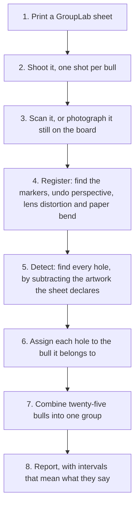
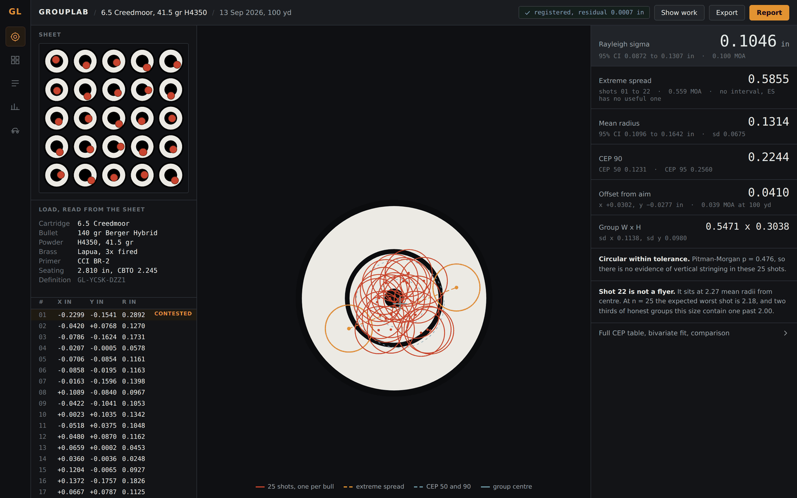
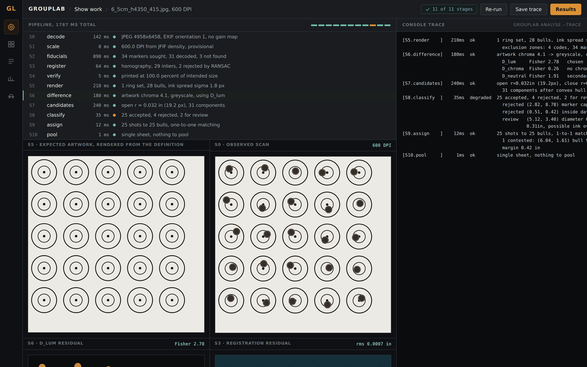
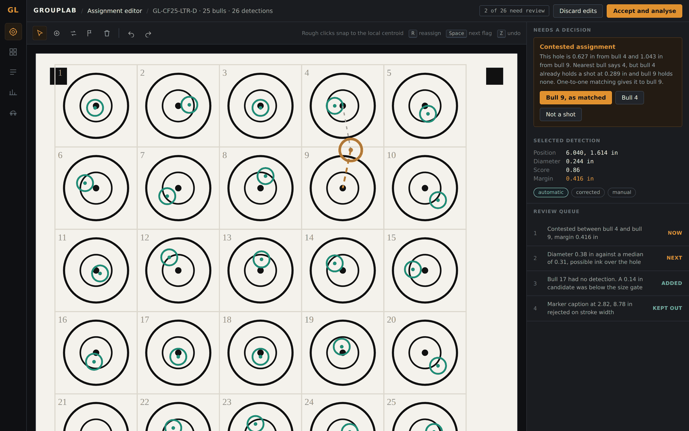
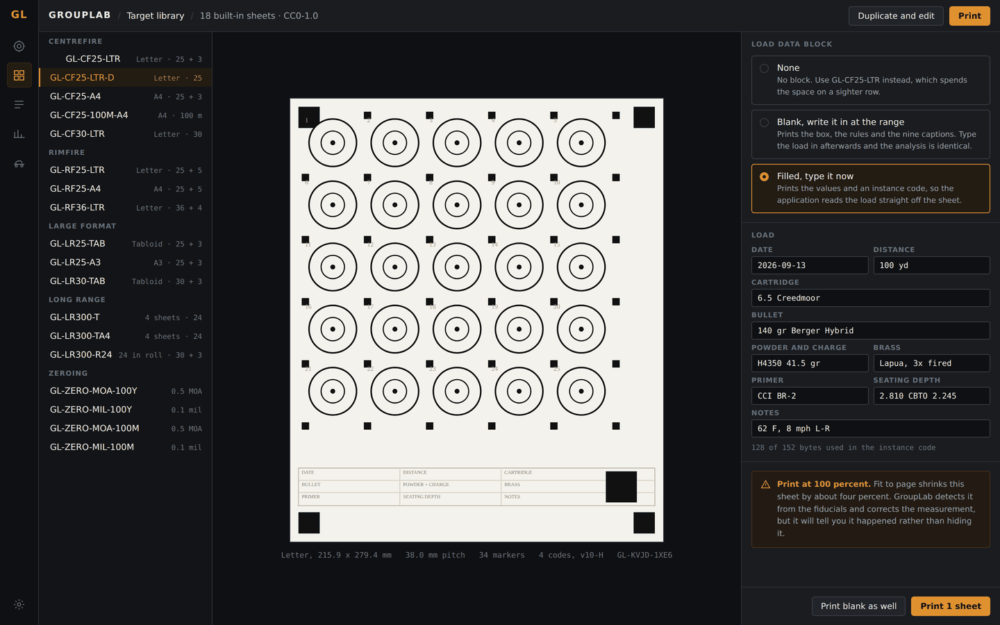
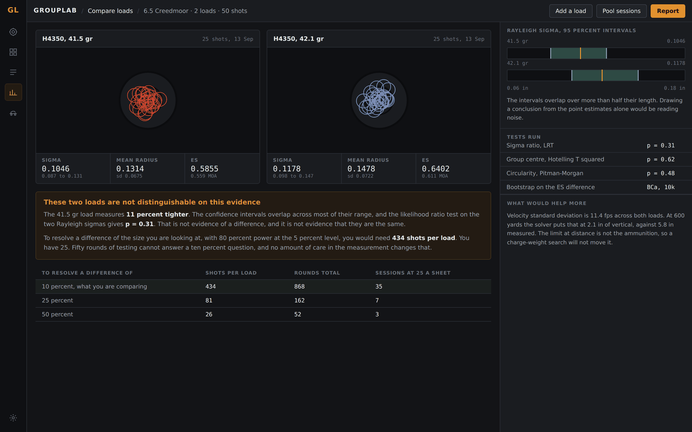
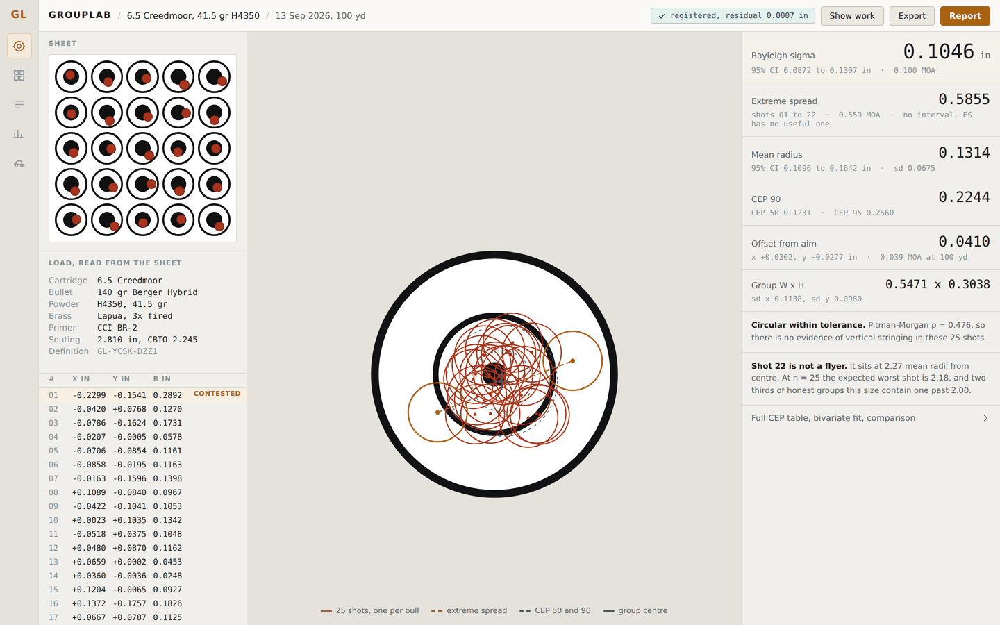
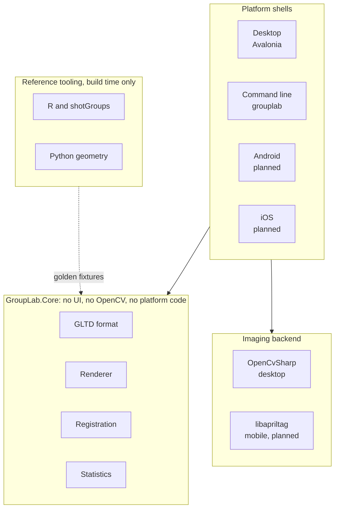

# GroupLab

**An open-source tool that measures how accurately a rifle shoots, and is honest about how little a small group actually tells you.**

Free, GPL-3.0, no account, no ads, no paid tier. GroupLab is a working name and may change.

**<https://grouplab.org>** is the website: what GroupLab is, how to use it, and where to download it. The same builds are linked below.

---

## Download

**The latest build.** Rebuilt automatically after every change that passes the tests on Windows, Linux and macOS, and published within a few minutes of it landing. **It may be broken**, because passing the tests is not the same as somebody having used it, and the Windows installer updates itself when a newer one appears.

| | |
|---|---|
| **[Installer](https://github.com/oRAirwolf/grouplab/releases/download/nightly/grouplab-setup-win-x64.exe)** | `grouplab-setup-win-x64.exe`, installs into your own user account, no administrator rights, with an entry in Add or remove programs. It keeps itself up to date. |
| **[Zip](https://github.com/oRAirwolf/grouplab/releases/download/nightly/grouplab-win-x64.zip)** | `grouplab-win-x64.zip`, unzip it anywhere and run `GroupLab.App.exe`. It tells you when there is a newer build and you download it yourself. |
| **[Linux tarball](https://github.com/oRAirwolf/grouplab/releases/download/nightly/grouplab-linux-x64.tar.gz)** | `grouplab-linux-x64.tar.gz`, self-contained, built on Ubuntu; nobody uses it day to day. |
| **[macOS, Apple silicon](https://github.com/oRAirwolf/grouplab/releases/download/nightly/grouplab-macos-arm64.tar.gz)** | `grouplab-macos-arm64.tar.gz`, a `.app` bundle for any Mac with an M1 or later. **Run on one real Mac**, by one tester; the Intel build has not been. |
| **[macOS, Intel](https://github.com/oRAirwolf/grouplab/releases/download/nightly/grouplab-macos-x64.tar.gz)** | `grouplab-macos-x64.tar.gz`, a `.app` bundle for an Intel Mac. **Untested on a real Mac.** |

**Every build here is unsigned**, so Windows will say "Windows protected your PC": click **More info**, then **Run anyway**. That warning is what Windows says about any program nobody has paid to sign; the source of the build is here, at the commit the download names.

- **Nothing else is needed:** the download carries its own .NET runtime and everything else it uses.
- **It brings two sample sheets**, so there is something to open in the first minute: a real 600 dpi scan of a 25 shot sheet, published with [its consent record](samples/PROVENANCE.md), and an unshot sheet beside it.
- **Where it keeps things:** `%APPDATA%\GroupLab`, and nowhere else. It sends nothing anywhere, and an update check sends nothing about you; [docs/UPDATES.md](docs/UPDATES.md) says exactly what it does.
- **Which build you have:** the Settings screen names the version, the train and the commit, which is what a bug report should carry.
- **What is not finished** is in [Planned](#planned) below, which is the authority on what works today. [docs/TESTING-GUIDE.md](docs/TESTING-GUIDE.md) is one page for somebody trying it for the first time.
- **On a Mac**, move `GroupLab.app` into Applications and then run `xattr -dr com.apple.quarantine /Applications/GroupLab.app` in Terminal. That removes the quarantine flag macOS puts on anything downloaded from the internet, which is what stops Gatekeeper opening unsigned software. It is the standard way to run unsigned software. **Anyone not comfortable running that command should not run this build.**
- **Questions, or somewhere to say it did not work:** the [GroupLab Discord](https://grouplab.org/discord). For anything private, or anything with a photograph attached, the support address is better.
- **Updates are manual everywhere but the Windows installer.** The zip, the tarball and both Mac builds tell you a newer build exists and leave the downloading to you.
- **[What is supported, and what is not](#what-is-supported-and-what-is-not)** is below, and on the [download page](https://grouplab.org/download/#supported): why the macOS build is unsigned, what happens once the application settles, and how to ask for another Linux target.

---

**On this page.**

- [Download](#download)
- [The problem GroupLab exists to solve](#the-problem-grouplab-exists-to-solve)
- [How it works](#how-it-works)
- [Concept screens](#concept-screens)
- [Built with](#built-with)
- [Architecture](#architecture)
- [What is supported, and what is not](#what-is-supported-and-what-is-not)
- [Status](#status)
- [Planned](#planned)
  - [What each phase holds](#what-each-phase-holds)
  - [Deferred, and why](#deferred-and-why)
  - [Platforms](#platforms)
- [What GroupLab is not](#what-grouplab-is-not)
- [Where to start](#where-to-start)
- [Repository layout](#repository-layout)
- [Test data](#test-data)
- [Building](#building)
- [Thanks](#thanks)
- [License](#license)

---

## The problem GroupLab exists to solve

A shooter fires five rounds, measures three quarters of an inch between the two widest holes, and concludes the rifle shoots three quarters of an inch. Then they change one thing, fire five more, measure six tenths, and conclude the change worked.

It almost certainly did not. From five shots, the rifle's true spread is somewhere between **0.68 and 1.92 times** what was measured, a factor of 2.8. Two loads that differ by 20 percent on five-shot groups are statistically indistinguishable. The existing tools will happily print that six tenths to three decimal places and say nothing about it.

GroupLab measures the same thing far more carefully, and then tells you what the number is worth. Below five shots it refuses to quote a group size at all, and says why. Between five and twenty it prints the figure with the interval's **real** coverage rather than a comfortable "95 percent". When you compare two loads it will tell you, in plain words, that the data does not support a conclusion and how many rounds it would take to reach one.

That is the whole point of the project. Everything else is the machinery that makes the measurement good enough to be worth being honest about.

## How it works

You print a target sheet that GroupLab generates. It carries a grid of small bullseyes and machine-readable registration markers, plus QR codes holding the sheet's complete geometric definition, so any software that has never seen the design can still analyze it correctly.

You shoot it, then scan or photograph the sheet, still stapled to the board if you like.



The one-shot-per-bull design is what makes the accuracy possible. Holes never overlap, so each one is measured cleanly against its own aiming point, and the twenty-five offsets are then pooled into a single group far larger than anything you could shoot into one bullseye.

**It also works on targets GroupLab did not print.** A commercial target with a printed grid can be marked by hand: set a known length, tap each impact, and the same statistics engine runs.

## Concept screens

These are design mockups, not screenshots of the current build. Every figure on the analysis screen is computed from one real 25-shot sample, so the numbers are internally consistent rather than decorative. The application today has the rail, with the analysis, the target library, the print screen and the session records behind it, load comparison behind its chart slot, a Ballistics slot for the solver, and a settings screen behind the gear at its foot. Behind the first destination are the two screens above as two states of one document: the assignment editor, and the analysis with its composite plot, figure stack and judgment cards. Renders of the build as it stands, every screen in both themes at two sizes, are in `docs/figures/screens/current/` beside these. Not built yet: velocity regression.



*The analysis screen. Twenty-five bulls composited into one group, the statistics that matter with their confidence intervals, and two plain-language judgments: whether the group is round, and whether that one wide shot is really a flyer.*

| | |
|---|---|
| [](docs/figures/screens/show-your-work.png) | [](docs/figures/screens/assignment-editor.png) |
| **Show your work.** Every pipeline stage emits what it decided, what it rejected, and why. The timeline and the console are the same data rendered two ways. | **Assignment editor.** A real nearest-bull failure from the sample corpus, drawn to scale. The detector has to be corrected by hand sometimes, so that path is built first, not last. |
| [](docs/figures/screens/library-and-print.png) | [](docs/figures/screens/compare-loads.png) |
| **Library and print.** The built-in sheets, with the load data block filled in before shooting or left blank to write at the range. Scaling is driven, not merely warned about. | **Compare loads.** This screen exists to refuse a conclusion. Two loads 11 percent apart, 25 shots each, p = 0.31, and the honest answer is that it would take 434 shots per load to tell. |

| |
|---|
| [](docs/figures/screens/analysis-light.png) |
| **Light theme.** Four themes are planned: dark, light, high contrast, and follow system. |

## Built with

| | |
|---|---|
| **Language** | C#, on <!--framework-->.NET 10<!--/framework-->. One language across the core and every platform shell, so the desktop and the phone cannot disagree about a measurement. |
| **Interface** | [Avalonia](https://avaloniaui.net/) 12, MIT licensed and GPL-compatible, rendering through Skia. |
| **Imaging** | OpenCV, through [OpenCvSharp](https://github.com/shimat/opencvsharp) on desktop. On mobile the marker detector is the AprilTag reference implementation under BSD-2-Clause, reached through P/Invoke. |
| **Fiducials** | AprilTag `tag36h11`. |
| **Reference tooling** | R and Python, in `tools/`. These generate the geometry and statistics fixtures the C# is validated against. **None of it ships or runs at runtime.** |

**Why C# rather than Rust or Go.** The deciding argument was one language across three shells: a measurement core plus Windows, Android and iOS interfaces that must produce identical numbers. Rust can do that at the cost of writing the interface three times or adopting a much less mature toolkit. Go has no credible story for an iOS or Android interface at all. Rust's real advantages, memory safety without a collector and predictable latency, buy little here, because the slow step is OpenCV, which is C++ underneath whatever calls it, and the statistics run on a few hundred points.

## Architecture



`GroupLab.Core` deliberately has no user-interface types and no OpenCV dependency. That is what lets the Android shell be swapped for a different toolkit later without touching a line of measurement code, and it is why the reference fixtures can validate the core without a window ever opening.

## What is supported, and what is not

<!-- platform-support: generated from docs/PLATFORM-SUPPORT.md, do not edit between these markers -->

**Windows is the supported platform.** It is where GroupLab is developed and tested by hand, and the installer and automatic updates are built for it.

**Linux builds are published and are worth trying.** The download is a self-contained 64-bit tarball, so it runs on most desktop distributions without anything else being installed alongside it. The test suite runs on Linux on every build. Hands-on testing has not started yet. Linux can be tested here on virtual machines under VMware Workstation, and there is no bare metal Linux machine, but the real reason is that the application is still under heavy development, with features, layouts, appearance and internal workings changing daily. Testing a moving target on a second platform would mostly produce findings that are obsolete a week later.

**macOS builds are published, and the Apple silicon build has been run on one Mac.** One tester ran nightly 93 on a MacBook Pro with an M5 Max, under macOS 27, natively rather than under Rosetta. macOS blocked the first launch, and the Terminal command below cleared it. Opening, detecting and analyzing the published sample, saving a session, printing a target to PDF, quitting with Command Q and sending the diagnostics report all worked, and text was sharp on the Retina display. Command shortcuts such as Command Z did not work, and pinch zoom had not been built on any platform; both are fixed in builds after nightly 94, and neither fix has been checked on a Mac yet. **The Intel build has never been run on a Mac.** The tests run on macOS on every build. These builds are an experiment rather than a release. The updater does not install them, and the developer still does not own a Mac.

### What happens once the application settles

Other platforms get proper attention once the pace of change slows and the Windows application is generally working the way the developer wants it to.

**Android is planned and is a high priority**, because that is the mobile platform in daily use here. Hands-on Linux testing follows, on virtual machines. macOS depends on the hardware question below.

### Running the macOS build

macOS quarantines anything downloaded from the internet and refuses to open software that is not signed by a registered Apple developer. After the application has been moved to the Applications folder, this removes the quarantine flag:

```
xattr -dr com.apple.quarantine /Applications/GroupLab.app
```

Anyone not comfortable running that command should not run this build.

### Why it is not signed

Signing a macOS application requires the Apple developer program, which costs 99 dollars a year. The developer of GroupLab does not own a Mac, does not intend to buy one, and is not going to pay a yearly fee for a platform they do not own.

That is the whole reason. It is not a technical obstacle and it is not indifference to Mac users. If a developer or contributor wants signed macOS releases enough to donate a Mac for testing and cover the developer fees, the project will set it up.

### Signing elsewhere

The one-off 25 dollar Google Play developer fee has been paid. A signed Windows version through the Microsoft Store is intended in due course, and a code signing certificate may be bought if the price turns out to be reasonable.

### Apple mobile

An iPad Mini, sixth generation, is available as test hardware, and an iOS version of GroupLab would be tested on it. Building and signing an iOS application requires a Mac and the Apple developer program, so that version cannot be produced at present, for the same reason the macOS build is unsigned. The hardware to test it exists; the machine to build it does not.

### Other Linux builds

The published Linux build is x86-64. Other targets can be added to the nightly builds on request: Arm64 for a Raspberry Pi or an Arm laptop, or a package built for a particular distribution rather than a tarball. Adding one is a line of configuration rather than a project. The reason a dozen are not published already is simply that nobody has asked for them.

Requests go to support@grouplab.org, naming the distribution and the architecture.

### Reports from Linux and macOS are welcome

A report is useful even when the answer is that it crashed on startup. "It opened and the buttons are the wrong size" is a useful report, and so is a crash report, which GroupLab can send on request. The address is support@grouplab.org.

<!-- end platform-support -->

---

## Status

**Where the work stands is in Planned below, phase by phase, with the state of every feature and the gate each phase is measured against.**

What exists and is tested:

- the GLTD target definition format, in JSON (GLTD-J) and as a binary QR payload (GLTD-B)
- a validator, and <!--count:sheets:digits-->20<!--/count--> built-in target sheets
- a PDF renderer, and a print screen that drives it
- registration from printed sheets, including off-axis photographs and a developable-surface model for paper that is not flat
- hole detection, validated on synthetic and real images
- the statistics engine, validated key for key against the R package `shotGroups`
- a desktop window with a manual marking path for commercial targets
- an intake tool that verifies donated photographs, refuses opt-outs, and strips location data without altering a pixel
- a sheet that names its own definition from its printed codes, so no target has to be named by hand
- an end-to-end `analyze` command, from photograph to report
- diagnostic logging, crash records and a report package, with no location data in any of them

What does not exist yet: load comparison, the chronograph and ballistic work, and any mobile build.

## Planned

Every phase below is `DESIGN.md` section 21's, with its gate. A phase is not done until its gate passes, and the gates' measured results are in `docs/PHASE0-RESULTS.md` and `docs/PHASE1-RESULTS.md`.

**The four states.**

| State | Means |
|---|---|
| **Not started** | no code |
| **In progress** | being built, not usable |
| **Built, not proven** | the code exists and works, and its gate has not been met or cannot yet be run |
| **Done** | its gate has been met and recorded |

**"Built, not proven" carries its weight here.** The assignment editor works and its gate needs a 25-shot target that nobody has shot yet. Calling that done would make this page untrue, and calling it in progress would be untrue the other way.

| Phase | State | Gate |
|---|---|---|
| **0a. Format and renderer** | **Done** | conformance test 43: a rendered definition analyzed as a scan recovers every bull center within 0.001 in |
| **0. Registration spike** | **Built, not proven** | worst bull center within 0.005 in on a 600 DPI scan of a printed sheet, and on an off-axis photograph of a sheet held flat |
| **1. Detection spike** | **Built, not proven** | at least 99 percent of holes found with no false positives, matched at 0.15 in, and the mounted photograph gate at 0.005 in |
| **2. Core and statistics** | **Built, not proven** | statistical output matches the R package `shotGroups` to numerical tolerance on shared test data |
| **3. Editor** | **Built, not proven** | a full 25-shot target with several misassignments corrected in under two minutes |
| **4. Windows application** | **In progress** | target library, generation, printing, analysis, reporting and session records, in one application |
| **5. Chronograph, solver, and comparison** | **Not started** | a ballistic solver validated against an independent implementation, and Garmin Xero import reconciled against marked shots |
| **6. Android** | **Not started** | camera capture and lens distortion fitted on the device |
| **7. Synchronization** | **Not started** | cloud provider adapters over three-tier storage |
| **8. iOS** | **Not started** | built and signed on CI |
| **9. Performance** | **Not started** | not written yet: it is written from the baseline in `docs/PERFORMANCE.md`, in the times a person waits, per platform, rather than from a figure anybody guessed |

### What each phase holds

**Phase 0a. Format and renderer.**
- **Done.** The GLTD definition format, in JSON and as a binary QR payload.
- **Done.** A validator, and <!--count:sheets:digits-->20<!--/count--> built-in target sheets.
- **Done.** A PDF renderer, with the printed name and identifier on every sheet.

**Phase 0. Registration spike.**
- **Done.** Registration from a scan of a printed sheet.
- **Built, not proven.** Registration from an off-axis photograph of a sheet held flat.
- **Built, not proven.** A developable-surface model for paper that is not flat, for the mounted case.
- **Done.** A sheet that names its own definition from its printed codes.

**Phase 1. Detection spike.**
- **Built, not proven.** Render-and-difference hole detection, with one size check that the review queue counts.
- **Done.** Hole-to-bull assignment by one-to-one matching, with sighter and scoring bulls as separate pools.
- **Done.** An end-to-end `analyze` command, from photograph to group.
- **Done.** A standing check that compares the corpus's detection counts whenever printed artwork changes.

**Phase 2. Core and statistics.**
- **Built, not proven.** The statistics engine, checked key for key against `shotGroups`.
- **Built, not proven.** Significance testing: rank and dispersion tests between two groups and among several, MANOVA on the shot coordinates, and the dispersion ratio with its interval.
- **Built, not proven.** Hit probability inside a radius at the distance shot, by three estimators, with the CEP table behind it.
- **Done.** Every figure with the interval it actually has, and the reference a figure needs to be read against.
- **Done.** Composite groups, pooled groups and load comparison in the engine.
- **Done.** Caliber-aware edge-to-edge extreme spread, with the reason printed in place of the figure when no caliber is set.
- **Built, not proven.** Subgroups within one sheet: on the marking screen, shift and click chooses bulls and one field puts a load on all of them, so a ladder sheet is set five bulls at a time. Each subgroup has its own figures and they are compared by dispersion and by center, so one sheet can carry six charge weights.
- **Done.** The zero correction: the group center's offset from the point of aim with its uncertainty, and, where the offset is smaller than the shots can resolve, the number of shots that would settle it instead of a correction.

**Phase 3. Editor.**
- **Built, not proven.** The review queue: contested assignments, possible merges, doubled bulls, shots with no bull and refused candidates, each with the choices that settle it.
- **Built, not proven.** Keyboard operation: the next item, its first choice, a bull typed to reassign, not a shot, and a flagged mark taken as the two shots it is, with no item needing the mouse.
- **Built, not proven.** Shots per bull for a sheet that breaks one a bull on purpose: every shot to its nearest bull, or two on the bulls named, matched that way. Without it, one-to-one matching pushes each second shot onto an empty neighbor and the review queue raises every one, which a synthetic doubles sheet tests both ways.
- **Built, not proven.** `grouplab compare-photos`: photographs of a sheet against its flat scan, the scan's corrected marking or its own detection as the truth, saying which. For each photograph it gives the registration model, the bull-center error, holes found, missed and false, and the hole-position error, read against 0.005 in and 0.15 in without deciding either gate.
- **Built, not proven.** The rounds fired as a check on the count: when the marks disagree with them, the queue names the marks most likely to be two, or least like a hole, and offers the first as a key press.
- **Done.** The secondary mode of `DESIGN.md` section 3: any target, including a store-bought one or blank paper, marked by hand on a photograph against a reference length or rectangle for scale.
- **Done.** Sighters found and matched and then set aside unless a person asks for them, and analyzed as a group of their own when they do, never pooled with the scoring shots.
- **Done.** The caliber entered as a cartridge name, such as 6.5 Creedmoor, or as the bullet's diameter in inches or in millimeters marked mm. A name is offered only where two published sources agree on its diameter (entry 163); a designation typed as a number, such as .38 or 7.62 mm, is still refused, because a caliber's name is usually not its diameter.
- **Done.** Assisted placement in that mode, which is the snap: a rough click lands on the dark centroid within a caliber-sized reach, with no definition needed.
- **Done.** Move, delete, reassign, exclude with a reason, mark not a shot, and undo throughout.
- **Done.** The concept screen's appearance: the tool strip as icons, each named with its key, the review's keys as keycaps, the breadcrumb header with its review count, the left rail, the document as a paper sheet on dark chrome, and the accents applied throughout, teal for what the software found, amber for what needs a person.
- **Done.** A layout and readability pass on both screens: five text styles, one row shape for every figure, the reasoning behind each figure and judgment one click away under "why", a header on one line with the document's actions in a menu, the view controls over the canvas, and the units, theme and log on a settings screen of their own.

**Phase 4. Windows application.**
- **Done.** A print screen that renders any built-in sheet to PDF at actual size.
- **Built, not proven.** Printing from inside GroupLab on Windows: the real print dialog, the sheet drawn at actual size by GroupLab itself, a refusal with its reason when the paper is not the sheet's or ink would fall in the printer's margin, and a confirmation naming the printer and the pages sent. Its drawing dropped every filled rectangle on a Brother driver, so those sheets printed with no markers or codes at all; that is fixed, and a test now prints every sheet through more than one driver and compares each item against Save PDF. **Open to print is the primary until a sheet from the fixed path has been checked on paper**, and the screen says why.
- **Done.** The parametric target editor: page, rows and columns, spacing, ring, sighters and load block, laid out by the rule the library was, with a layout that cannot register or fit refused and a spacing tight for your rifle's group warned with its misassignment rate.
- **Done.** An intake tool that verifies donated photographs, refuses opt-outs and strips location data.
- **Done.** Diagnostic logging, crash records and a report package, with no location data in any of them.
- **Done.** The three-axis unit setting: inches, centimeters and millimeters, MOA, mil and SMOA, yards and meters, each chosen independently and display only.
- **Done.** The analysis screen shown above: the editor and the analysis as two states of one document, forward by Accept and analyze and back by the sheet crumb with every edit intact; the composite plot of every scoring shot on one bull, with the caliber, the excluded shots drawn hollow, CEP 50 and 90 and the extreme spread's two shots; CEP and width by height in the figure stack; the two judgment cards, round and flyer, each naming its test; the sheet's thumbnail, drawn from its definition with every shot on it, where a click on a bull selects its shots; and the full CEP table and bivariate fit behind one disclosure that remembers it was opened.
- **Not started.** Hole detection on blank paper, with no definition to difference against. Its gate names the material it needs, one photograph at a known scale of plain paper with real holes in it, and no image in the corpus is that.
- **Built, not proven.** Session records in one SQLite database with a documented, versioned schema and full JSON export and import: Accept and analyze saves the session, with its marking, figures, definition and a 150 dpi proof image, and the Session records screen lists them newest first, filters by rifle and load, opens one back to its analysis with no image needed, and asks before deleting one.
- **Built, not proven.** The session report: a PDF from GroupLab's own writer with the particulars, the composite plot, every figure with its interval and without exclusions, the zero correction and the two cards on page 1, and the shot table with bulls, exclusions with reasons, unmade decisions, registration, every "why", and the version and identifiers on page 2. Every line on it is one the analysis screen shows.
- **Built, not proven.** The target library: the built-in sheets, read only, and your own sheets from the designer, saved as GLTD files in the data folder, renamed, duplicated from any sheet, and deleted after asking. The print screen lists both. A session keeps its own copy of the sheet it was analyzed against, so deleting a sheet never makes a session unreadable.
- **Done.** Records for rifles, barrels and loads, kept small: a rifle's scope click, a barrel's round count, a load's components.
- **Done.** The stage timeline that shows the analysis doing its work, as `DESIGN.md` section 19 describes it. During a live run each stage lands on the timeline with its own picture as it files: the markers found light up, the registration's corners are ringed by their residual, and the residual shows the artwork gone and the holes left. The timeline scrubs by slider or button, and a rejection clicked is found on the image. A batch run builds no pictures.
- **Done.** GroupLab's mark in the header and the rail, and as the application's icon for Windows, Linux and macOS, drawn from one committed source.
- **Done.** The four themes of `DESIGN.md` section 19: dark, light, high contrast and follow system, all four from one set of tokens, each held to its contrast ratio by a test.
- **Built, not proven.** An unobtrusive support link, one menu item with no payment handled inside the application. There is no address yet, so the item on the settings screen says so rather than opening anything, and a test fails if an address appears anywhere else. It becomes one browser launch when Alan has a page.
- **Done.** Adjust-to-zero turret corrections, in a linear and an angular unit at once, and in the scope's own clicks with what rounding leaves once the marking names a rifle.
- **Built, not proven.** A volunteer print pack: the print screen's "Print a volunteer pack" gives the sheet and one page of instructions together, generated from `docs/VOLUNTEER-PACK.md` at the sheet's own paper size, with its own distance from bull 1 to bull 5 to measure. Consent is the upload page's, not the pack's.

**Phase 5. Chronograph, solver, and comparison.**
- **Built, not proven.** Chronograph strings entered by hand, with the reconciliation `DESIGN.md` section 15 requires: the readings are never assumed to line up with the shots, the in-order pairing is a proposal, a reading that belongs to no shot or a shot the chronograph missed is marked, and what is accepted is kept on the session. The readings' own spread becomes the load's velocity SD, with a note of where it came from.
- **Not started.** Garmin Xero import, which waits for a sample export file; the reader produces the same list of numbers as the box that is built.
- **Built, not proven.** A ballistic solver, validated against an independent implementation: the point-mass solver ported from ballistics.js and corrected in five places, and `grouplab trajectory`, which prints a table from stated inputs. G1 and G7 agree with py-ballisticcalc well inside tolerances written down before the comparison. On screen since entry 112: the rifle and load records carry what it needs, all optional, and the Ballistics screen gives a dope table in your units and clicks with the air as an input; the analysis carries the zero correction to a second distance with its uncertainty, and keeps its refusal when the offset cannot be told from zero.
- **Built, not proven.** Load against load on screen: sessions chosen in Session records, or one sheet's subgroups, side by side with their plots, figures and intervals, the tests with their verdicts and what each could have detected, and the shots it would take to resolve a smaller difference. The loads are never ranked by a point estimate, and overlapping intervals are said to leave them unseparated.
- **Not started.** Velocity regression, and predicted against measured vertical.
- **Built, not proven.** Hit probability at a distance other than the one shot, and distance normalization, both propagated through the solver rather than by scaling a group linearly: the load's velocity SD and the crosswind's uncertainty add their own spread at the new distance, the velocity's share at the distance shot is taken out first and refused when it is larger than the group, and the chance of a hit on a circle or a rectangle is given at both ends of the sigma interval as well as its estimate. With neither spread given it is angular scaling, and says so. Every figure is labeled a prediction.

**Phase 6. Android.**
- **Not started.** The camera capture path, with lens distortion fitted on the device.

**Phase 7. Synchronization.**
- **Not started.** Cloud provider adapters over three-tier storage.

**Phase 8. iOS.**
- **Not started.** A CI build, signed. It waits on the license permission under License, for distribution rather than for development.

**Phase 9. Performance.**
- **Not started.** Making GroupLab quick, once it is right. It may run alongside Phase 6, and Android is the reason it matters: a phone is several times slower than a desktop. It starts only when the application works as intended, because a fast wrong answer is worthless.
- **Built, not proven.** `grouplab bench`, which measures GroupLab against material it generates itself and needs nothing from anybody, and the interface benchmark that walks every screen and times every control from the click to the moment nothing further is coming. [docs/PERFORMANCE.md](docs/PERFORMANCE.md) holds the first record, the method, and the wasteful things found while measuring.
- **Not started.** The gate, which is written from that baseline rather than guessed, and the optimizations themselves. Nothing has been optimized.

### Deferred, and why

**One item in `DESIGN.md` section 3 carries no phase on purpose, and it carries two promises.** A deferral means the promise still stands, nobody is working on it, and the reason is written down. It is not a quiet drop, and it is checked: a scope bullet with neither a phase nor a deferral fails a test.

- **Deferred: the full visual designer, and with it the full detector on a bought target.** Every built-in sheet is a grid, so the parametric editor covers the space, and the format already carries arbitrarily placed bulls for the day something needs them. A canvas is a large screen for a case nobody has asked for. The same canvas is how a person would trace a store-bought target into a definition, and a definition is what the detector needs, so the designer's deferral carries that second promise too: when either is asked for, both arrive together. Assisted placement on a target with no definition is the snap, above, and detection on blank paper is Phase 4.

A state changes in the same commit as the thing it describes, and `ReadmeTests` fails if a phase here and in `DESIGN.md` section 21 ever disagree, if a phase's feature carries no state, or if a scope bullet in section 3 names no phase and no deferral.

### Platforms

**What is supported, and what has been checked on real hardware, is the platform statement above,** generated from its one source,
`docs/PLATFORM-SUPPORT.md`. This section does not repeat it. What the plan adds is how the other platforms are kept correct.

**Linux and macOS are built and tested alongside Windows, not after it.** Every push builds and runs the whole suite on all three. A
second workflow reruns the complete Phase 0 measurement record on all three and compares every printed table against the Windows record,
which is a harder question than whether the code compiles: it asks whether the three platforms produce the same answers. Both reproduce
the record: every gate verdict and every printed table is identical to Windows, which is how the gate record workflow defines reproducing
it.

**The developer works on Windows.** Targets are printed, shot, photographed and marked there, so that is where the application meets real
data. Linux and macOS are held correct continuously so that neither turns into a port later, which is the expensive way to do it.

**Mobile comes after the desktop, Android first.** Android is Phase 6. iOS is Phase 8 and needs the GPL section 7 additional permission described under License, which is drafted and with a lawyer and not in force. The permission gates distribution through the App Store, not development. Building and testing on a device can proceed without it.

## What GroupLab is not

- **Not compatible with OnTarget, in any way.** No OnTarget PC or OnTarget TDS file format, target design or import path, and never will be. The files under `reference/ontarget-output/` record what the incumbent produces; they are not something to replicate.
- **Not a home for pseudoscience.** Barrel harmonics, optimal barrel time, velocity nodes and accuracy nodes are not real. They appear nowhere in GroupLab: not in the solver, the statistics, the documentation, the interface or the code comments.
- **Not a commercial product.** No paid tier, no license key, no upsell.
- **Not an electronic target system.** No acoustic scoring, no target hardware integration.

## Where to start

1. **[DESIGN.md](DESIGN.md)**, the design document: what GroupLab is for, how it works, and the build plan.
2. **[docs/TARGET-SCHEMA.md](docs/TARGET-SCHEMA.md)**, the GLTD 1.0 format, including the conformance tests of section 10.

| Document | Covers |
|---|---|
| [docs/USER-GUIDE.md](docs/USER-GUIDE.md) | Using the Windows application, from printing a sheet to comparing loads, with [a PDF](docs/USER-GUIDE.pdf) |
| [docs/TESTING-GUIDE.md](docs/TESTING-GUIDE.md) | One page for somebody trying GroupLab for the first time, with [a PDF](docs/TESTING-GUIDE.pdf) |
| [docs/PHASE0-BRIEF.md](docs/PHASE0-BRIEF.md) | The brief for Phases 0a and 0 |
| [docs/FIDUCIAL-DECISION.md](docs/FIDUCIAL-DECISION.md) | Why the markers are AprilTag `tag36h11`, and the measurements behind it |
| [docs/DETECTION-PIPELINE.md](docs/DETECTION-PIPELINE.md) | The eleven-stage analysis pipeline |
| [docs/TARGET-LIBRARY.md](docs/TARGET-LIBRARY.md) | The built-in sheets |
| [docs/STATISTICS.md](docs/STATISTICS.md) | Estimators, tests, and validation against `shotGroups` |
| [docs/SCAN-MEASUREMENTS.md](docs/SCAN-MEASUREMENTS.md) | Measurements from the real scans under `scans/` |
| [docs/SPEC-ERRATA.md](docs/SPEC-ERRATA.md) | Where the implementation had to choose because the specification does not |
| [docs/SESSION-SCHEMA.md](docs/SESSION-SCHEMA.md) | The session database's schema, its version and its JSON export |
| [docs/VOLUNTEER-PACK.md](docs/VOLUNTEER-PACK.md) | The one page of instructions in the volunteer print pack |
| [docs/UPDATES.md](docs/UPDATES.md) | The update trains, what a check sends, how a build is signed and how the key is rotated |
| [docs/PERFORMANCE.md](docs/PERFORMANCE.md) | What every part of GroupLab costs today, how the record is made, and what is wasteful and not yet changed |

## Repository layout

| Path | Contents |
|---|---|
| `src/GroupLab.Core` | Format, validation, derivations, renderer, registration and statistics, with no platform or OpenCV dependency |
| `src/GroupLab.Cli` | The `grouplab` command line, and the OpenCV imaging backend |
| `src/GroupLab.App` | The Avalonia desktop shell |
| `tests/`, `test/fixtures/` | Conformance tests, and the `shotGroups` reference fixtures |
| `targets/` | The built-in definitions, generated from `tools/layout/layouts.json` |
| `tools/` | Python and R reference tools; the authority for geometry, identifiers and statistics fixtures |
| `scans/`, `SAMPLE-NOTES.md` | Real scanned targets, and notes on each |
| `scripts/` | Operational scripts, such as pulling donated submissions |

## Test data

Donated target photographs do not live in this repository. They go in a separate one, `grouplab-testdata`, published under GPL-3.0, because that is the license named in the consent text contributors agreed to. It is at [github.com/oRAirwolf/grouplab-testdata](https://github.com/oRAirwolf/grouplab-testdata), and this repository was last checked against its commit `d35ef99`. Its own README says what was done to the photographs, what contributors agreed to, and what is deliberately not there.

- **Getting into the public data:** only through `grouplab intake`, which checks the opt-out, the consent record and the upload hashes, removes location metadata without changing a pixel, and writes a provenance record beside the files.
- **How the tests find it:** a checkout beside this one at `../grouplab-testdata`, or the directory named by `GROUPLAB_TESTDATA`. `PublicationTests` then checks every submission and the owner's photographs there for location data, an opt-out, complete provenance and published hashes.
- **Without a checkout,** that check does nothing and says so. The rest of the suite does not need it. The Phase 0 and Phase 1 scans under `scans/` stay here, because committed tests and gate records read them by path.

**Contributing photographs.** If you shoot paper and would be willing to donate photographs of whole targets still mounted where you shot them, that is the single most useful thing anyone outside this project can do for it. Send them at [grouplab.org/targets](https://grouplab.org/targets/).

## Building

See [CONTRIBUTING.md](CONTRIBUTING.md). In short, with the .NET 10 SDK:

```
dotnet build
dotnet test
dotnet run --project src/GroupLab.Cli -- render targets/GL-CF25-LTR.gltd.json -o out/GL-CF25-LTR.pdf
```

GroupLab builds and its tests pass on <!--platforms-->Windows, Linux and macOS<!--/platforms-->, and every push runs the suite on all three. Every nightly build is published for Windows, Linux and macOS; what each one is, and what is and is not tested on real hardware, is in the platform statement above.

## Thanks

To the people who have tested GroupLab and said what they found, by the names they gave:

- **Unholy** scanned a GroupLab sheet he shot on 2026-09-23, which showed that naming the right caliber could make the reading worse, and then went through the application and wrote down what got in his way: the caliber label, figures at 100 yards, the zeroing grid, setting the scale again, and the caliber box.
- **Fenix** ran GroupLab on a Mac with Apple silicon and found that Command Z did nothing and that there was no pinch zoom.

## License

**GPL-3.0.** The full text is in [LICENSE](LICENSE), and that is the license in force today for every copy of GroupLab from every source.

**An additional permission under section 7, for app-store distribution, is intended and is with a lawyer.** Plain GPL-3.0 conflicts with Apple's App Store terms, and GPL applications have been removed from that store before over exactly this. The permission is the standard resolution, and it can only be granted by the copyright holders, so it is far cheaper to add before there are outside contributors than after. It is not in force yet and this README will say so until it is. **Do not rely on it.**

Work by others that GroupLab includes or depends on is listed in [THIRD-PARTY-NOTICES.md](THIRD-PARTY-NOTICES.md).
