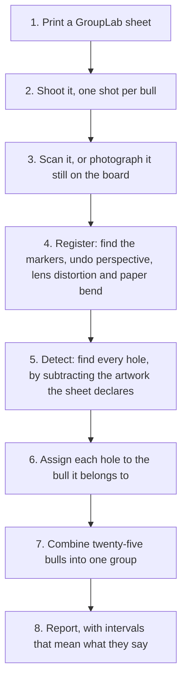
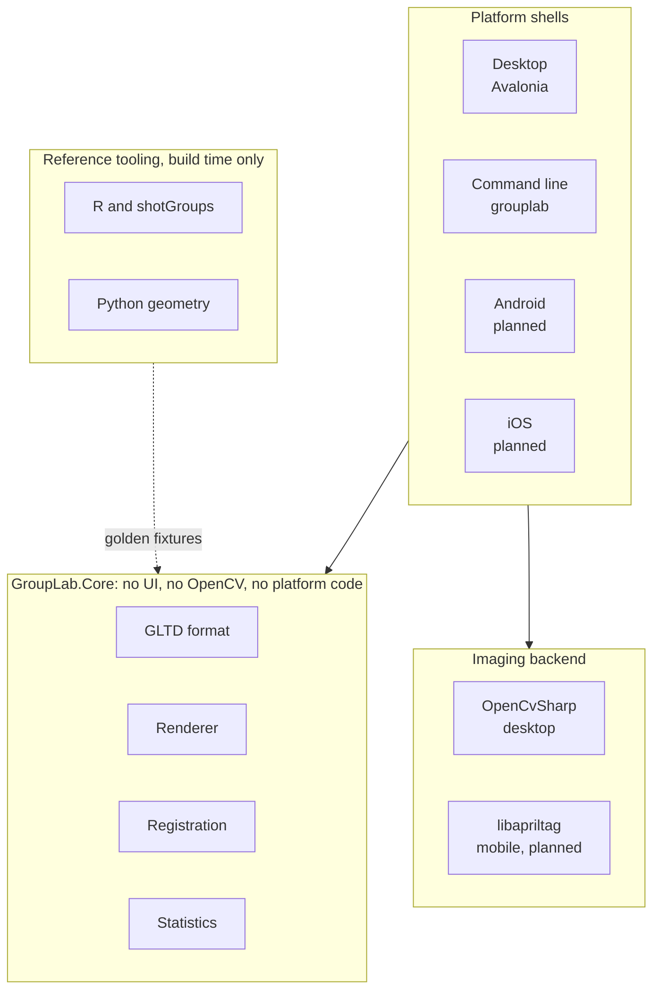

# GroupLab

**An open-source tool that measures how accurately a rifle shoots, and is honest about how little a small group actually tells you.**

Free, GPL-3.0, no account, no ads, no paid tier. GroupLab is a working name and may change.

---

## The problem GroupLab exists to solve

A shooter fires five rounds, measures three quarters of an inch between the two widest holes, and concludes the rifle shoots three quarters of an inch. Then they change one thing, fire five more, measure six tenths, and conclude the change worked.

It almost certainly did not. From five shots, the rifle's true dispersion is somewhere between **0.68 and 1.92 times** what was measured, a factor of 2.8. Two loads that differ by 20 percent on five-shot groups are statistically indistinguishable. The existing tools will happily print that six tenths to three decimal places and say nothing about it.

GroupLab measures the same thing far more carefully, and then tells you what the number is worth. Below five shots it refuses to quote a group size at all, and says why. Between five and twenty it prints the figure with the interval's **real** coverage rather than a comfortable "95 percent". When you compare two loads it will tell you, in plain words, that the data does not support a conclusion and how many rounds it would take to reach one.

That is the whole point of the project. Everything else is the machinery that makes the measurement good enough to be worth being honest about.

## How it works

You print a target sheet that GroupLab generates. It carries a grid of small bullseyes and machine-readable registration markers, plus QR codes holding the sheet's complete geometric definition, so any software that has never seen the design can still analyse it correctly.

You shoot it, then scan or photograph the sheet, still stapled to the board if you like.



The one-shot-per-bull design is what makes the accuracy possible. Holes never overlap, so each one is measured cleanly against its own aiming point, and the twenty-five offsets are then pooled into a single group far larger than anything you could shoot into one bullseye.

**It also works on targets GroupLab did not print.** A commercial target with a printed grid can be marked by hand: set a known length, tap each impact, and the same statistics engine runs.

## Concept screens

These are design mockups, not screenshots of the current build. Every figure on the analysis screen is computed from one real 25-shot sample, so the numbers are internally consistent rather than decorative. The application today has a marking screen and a print screen. They now carry the palette, the type and the marks these screens are drawn in, and not their layout: there is no navigation rail, no composite plot and no analysis screen yet.


*The analysis screen. Twenty-five bulls composited into one group, the statistics that matter with their confidence intervals, and two plain-language judgements: whether the group is round, and whether that one wide shot is really a flyer.*

| | |
|---|---|
| [](docs/figures/screens/show-your-work.png) | [](docs/figures/screens/assignment-editor.png) |
| **Show your work.** Every pipeline stage emits what it decided, what it rejected, and why. The timeline and the console are the same data rendered two ways. | **Assignment editor.** A real nearest-bull failure from the sample corpus, drawn to scale. The detector has to be corrected by hand sometimes, so that path is built first, not last. |
| [](docs/figures/screens/library-and-print.png) | [](docs/figures/screens/compare-loads.png) |
| **Library and print.** The built-in sheets, with the load data block filled in before shooting or left blank to write at the range. Scaling is driven, not merely warned about. | **Compare loads.** This screen exists to refuse a conclusion. Two loads 11 percent apart, 25 shots each, p = 0.31, and the honest answer is that it would take 434 shots per load to tell. |

| |
|---|
| [](docs/figures/screens/analysis-light.png) |
| **Light theme.** Four themes are planned: dark, light, high contrast, and follow system. |

## Built with

| | |
|---|---|
| **Language** | C#, on <!--framework-->.NET 10<!--/framework-->. One language across the core and every platform shell, so the desktop and the phone cannot disagree about a measurement. |
| **Interface** | [Avalonia](https://avaloniaui.net/) 12, MIT licensed and GPL-compatible, rendering through Skia. |
| **Imaging** | OpenCV, through [OpenCvSharp](https://github.com/shimat/opencvsharp) on desktop. On mobile the marker detector is the AprilTag reference implementation under BSD-2-Clause, reached through P/Invoke. |
| **Fiducials** | AprilTag `tag36h11`. |
| **Reference tooling** | R and Python, in `tools/`. These generate the geometry and statistics fixtures the C# is validated against. **None of it ships or runs at runtime.** |

**Why C# rather than Rust or Go.** The deciding argument was one language across three shells: a measurement core plus Windows, Android and iOS interfaces that must produce identical numbers. Rust can do that at the cost of writing the interface three times or adopting a much less mature toolkit. Go has no credible story for an iOS or Android interface at all. Rust's real advantages, memory safety without a collector and predictable latency, buy little here, because the slow step is OpenCV, which is C++ underneath whatever calls it, and the statistics run on a few hundred points.

## Architecture



`GroupLab.Core` deliberately has no user-interface types and no OpenCV dependency. That is what lets the Android shell be swapped for a different toolkit later without touching a line of measurement code, and it is why the reference fixtures can validate the core without a window ever opening.

## Status

**Where the work stands is in Planned below, phase by phase, with the state of every feature and the gate each phase is measured against.**

What exists and is tested:

- the GLTD target definition format, in JSON (GLTD-J) and as a binary QR payload (GLTD-B)
- a validator, and <!--count:sheets-->22<!--/count--> built-in target sheets
- a PDF renderer, and a print screen that drives it
- registration from printed sheets, including off-axis photographs and a developable-surface model for paper that is not flat
- hole detection, validated on synthetic and real images
- the statistics engine, validated key for key against the R package `shotGroups`
- a desktop window with a manual marking path for commercial targets
- an intake tool that verifies donated photographs, refuses opt-outs, and strips location data without altering a pixel
- a sheet that names its own definition from its printed codes, so no target has to be named by hand
- an end-to-end `analyze` command, from photograph to report
- diagnostic logging, crash records and a report package, with no location data in any of them

What does not exist yet: the full analysis screen shown above, load comparison, the chronograph and ballistic work, and any mobile build.

## Planned

Every phase below is `DESIGN.md` section 21's, with its gate. A phase is not done until its gate passes, and the gates' measured results are in `docs/PHASE0-RESULTS.md` and `docs/PHASE1-RESULTS.md`.

**The four states.**

| State | Means |
|---|---|
| **Not started** | no code |
| **In progress** | being built, not usable |
| **Built, not proven** | the code exists and works, and its gate has not been met or cannot yet be run |
| **Done** | its gate has been met and recorded |

**"Built, not proven" carries its weight here.** The assignment editor works and its gate needs a 25-shot target that nobody has shot yet. Calling that done would make this page untrue, and calling it in progress would be untrue the other way.

| Phase | State | Gate |
|---|---|---|
| **0a. Format and renderer** | **Done** | conformance test 43: a rendered definition analysed as a scan recovers every bull centre within 0.001 in |
| **0. Registration spike** | **Built, not proven** | worst bull centre within 0.005 in on a 600 DPI scan of a printed sheet, and on an off-axis photograph of a sheet held flat |
| **1. Detection spike** | **Built, not proven** | at least 99 percent of holes found with no false positives, matched at 0.15 in, and the mounted photograph gate at 0.005 in |
| **2. Core and statistics** | **Built, not proven** | statistical output matches the R package `shotGroups` to numerical tolerance on shared test data |
| **3. Editor** | **Built, not proven** | a full 25-shot target with several misassignments corrected in under two minutes |
| **4. Windows application** | **In progress** | target library, generation, printing, analysis, reporting and session records, in one application |
| **5. Chronograph, solver, and comparison** | **Not started** | a ballistic solver validated against an independent implementation, and Garmin Xero import reconciled against marked shots |
| **6. Android** | **Not started** | camera capture and lens distortion fitted on the device |
| **7. Synchronisation** | **Not started** | cloud provider adapters over three-tier storage |
| **8. iOS** | **Not started** | built and signed on CI |

### What each phase holds

**Phase 0a. Format and renderer.**
- **Done.** The GLTD definition format, in JSON and as a binary QR payload.
- **Done.** A validator, and <!--count:sheets-->22<!--/count--> built-in target sheets.
- **Done.** A PDF renderer, with the printed name and identifier on every sheet.

**Phase 0. Registration spike.**
- **Done.** Registration from a scan of a printed sheet.
- **Built, not proven.** Registration from an off-axis photograph of a sheet held flat.
- **Built, not proven.** A developable-surface model for paper that is not flat, for the mounted case.
- **Done.** A sheet that names its own definition from its printed codes.

**Phase 1. Detection spike.**
- **Built, not proven.** Render-and-difference hole detection, with one size check that the review queue counts.
- **Done.** Hole-to-bull assignment by one-to-one matching, with sighter and scoring bulls as separate pools.
- **Done.** An end-to-end `analyze` command, from photograph to group.
- **Done.** A standing check that compares the corpus's detection counts whenever printed artwork changes.

**Phase 2. Core and statistics.**
- **Built, not proven.** The statistics engine, checked key for key against `shotGroups`.
- **Built, not proven.** Significance testing: rank and dispersion tests between two groups and among several, MANOVA on the shot coordinates, and the dispersion ratio with its interval.
- **Built, not proven.** Hit probability inside a radius at the distance shot, by three estimators, with the CEP table behind it.
- **Done.** Every figure with the interval it actually has, and the reference a figure needs to be read against.
- **Done.** Composite groups, pooled groups and load comparison in the engine.
- **Done.** Calibre-aware edge-to-edge extreme spread, with the reason printed in place of the figure when no calibre is set.
- **Built, not proven.** Subgroups within one sheet: bulls mapped to loads in the session, each subgroup with its own figures, compared by dispersion and by centre, so one sheet can carry six charge weights.
- **Done.** The zero correction: the group centre's offset from the point of aim with its uncertainty, and, where the offset is smaller than the shots can resolve, the number of shots that would settle it instead of a correction.

**Phase 3. Editor.**
- **Built, not proven.** The review queue: contested assignments, possible merges, doubled bulls, shots with no bull and refused candidates, each with the choices that settle it.
- **Built, not proven.** Keyboard operation: the next item, its first choice, a bull typed to reassign, not a shot, and a flagged mark taken as the two shots it is, with no item needing the mouse.
- **Built, not proven.** The rounds fired as a check on the count: when the marks disagree with them, the queue names the marks most likely to be two, or least like a hole, and offers the first as a key press.
- **Done.** The secondary mode of `DESIGN.md` section 3: any target, including a store-bought one or blank paper, marked by hand on a photograph against a reference length or rectangle for scale.
- **Done.** Move, delete, reassign, exclude with a reason, mark not a shot, and undo throughout.
- **Done.** The concept screen's appearance: the icon tool strip with its keys as keycaps, the breadcrumb header with its review count, the left rail, the document as a paper sheet on dark chrome, and the accents applied throughout, teal for what the software found, amber for what needs a person.

**Phase 4. Windows application.**
- **Done.** A print screen that renders any built-in sheet to PDF at actual size.
- **Done.** The parametric target editor: page, rows and columns, spacing, ring, sighters and load block, laid out by the rule the library was, with a layout that cannot register or fit refused and a spacing tight for your rifle's group warned with its misassignment rate.
- **Done.** An intake tool that verifies donated photographs, refuses opt-outs and strips location data.
- **Done.** Diagnostic logging, crash records and a report package, with no location data in any of them.
- **Done.** The three-axis unit setting: inches, centimetres and millimetres, MOA, mil and SMOA, yards and metres, each chosen independently and display only.
- **In progress.** The analysis screen shown above.
- **Not started.** A target library, session records and reporting.
- **Done.** Records for rifles, barrels and loads, kept small: a rifle's scope click, a barrel's round count, a load's components.
- **Done.** The stage timeline that shows the analysis doing its work: each stage lands as it files during a live run, scrubs by slider or button, shows its own picture (the markers lighting up, the registration's corners ringed by their residual, the photograph giving way to the residual with the artwork gone), and a rejection clicked is found on the image. The pictures are kept only for an interactive run and appear when it finishes rather than stage by stage.
- **Done.** The four themes of `DESIGN.md` section 19: dark, light, high contrast and follow system, all four from one set of tokens, each held to its contrast ratio by a test.
- **Not started.** An unobtrusive support link, one menu item opening a browser, with no payment handled inside the application.
- **Done.** Adjust-to-zero turret corrections, in a linear and an angular unit at once, and in the scope's own clicks with what rounding leaves once the marking names a rifle.
- **Not started.** A volunteer print pack: the sheets and the instructions a donor needs to shoot and photograph one.

**Phase 5. Chronograph, solver, and comparison.**
- **Not started.** Garmin Xero import and reconciliation against marked shots.
- **Not started.** A ballistic solver, validated against an independent implementation.
- **Not started.** Load against load, velocity regression, and predicted against measured vertical.
- **Not started.** Hit probability at a distance other than the one shot, and distance normalisation, both propagated through the solver rather than by scaling a group linearly.

**Phase 6. Android.**
- **Not started.** The camera capture path, with lens distortion fitted on the device.

**Phase 7. Synchronisation.**
- **Not started.** Cloud provider adapters over three-tier storage.

**Phase 8. iOS.**
- **Not started.** A CI build, signed. It waits on the licence permission under Licence, for distribution rather than for development.

### Deferred, and why

**Two promises in `DESIGN.md` section 3 carry no phase on purpose.** A deferral means the promise still stands, nobody is working on it, and the reason is written down. It is not a quiet drop, and it is checked: a scope bullet with neither a phase nor a deferral fails a test.

- **Deferred: the full visual designer.** Every built-in sheet is a grid, so the parametric editor covers the space, and the format already carries arbitrarily placed bulls for the day something needs them. A canvas is a large screen for a case nobody has asked for, and it is revisited when somebody asks for a layout the form cannot express.
- **Deferred: assisted hole placement on a target with no definition.** The detector renders the target's definition and differences the image against it. A store-bought target or a sheet of blank paper has no definition, so the method as built has nothing to difference, and whether anything weaker is worth having is an open question in `docs/QUESTIONS-FOR-PLANNING.md` rather than a phase.

A state changes in the same commit as the thing it describes, and `ReadmeTests` fails if a phase here and in `DESIGN.md` section 21 ever disagree, if a phase's feature carries no state, or if a scope bullet in section 3 names no phase and no deferral.

### Platforms

**Windows 10 and 11 is what GroupLab is built for.** It is where the application is developed and used, where every screenshot comes from, and the only platform offered as a download today.

**Linux and macOS are built and tested alongside it, not after it.** Every push builds and runs the whole suite on all three. A second workflow reruns the complete Phase 0 measurement record on all three and compares every printed table against the Windows record, which is a harder question than whether the code compiles: it asks whether the three platforms produce the same answers.

| Platform | Built and tested | Reproduces the Phase 0 record | Offered as a download | Used day to day |
|---|---|---|---|---|
| Windows 10 and 11 | every push | the reference | **yes** | yes |
| Linux | every push | **yes** | not yet | no |
| macOS | every push | not yet | not yet | no |

**What stands between Linux and macOS and a download is the record, not the build.** Linux reproduces it. macOS differs on a small number of measurement rows, traced to corner refinement inside the native imaging library and to one further divergence below it. That is an open item with a named cause rather than an unknown, and it is tracked in `docs/PHASE1-RESULTS.md`.

**Neither is used as a test platform, deliberately.** Targets are printed, shot, photographed and marked on Windows, so that is where the application meets real data. Linux and macOS are held correct continuously so that neither turns into a port later, which is the expensive way to do it.

**Mobile comes after the desktop, Android first.** Android is Phase 6. iOS is Phase 8 and needs the GPL section 7 additional permission described under Licence, which is drafted and with a lawyer and not in force. The permission gates distribution through the App Store, not development. Building and testing on a device can proceed without it.

## What GroupLab is not

- **Not compatible with OnTarget, in any way.** No OnTarget PC or OnTarget TDS file format, target design or import path, and never will be. The files under `reference/ontarget-output/` record what the incumbent produces; they are not something to replicate.
- **Not a home for pseudoscience.** Barrel harmonics, optimal barrel time, velocity nodes and accuracy nodes are not real. They appear nowhere in GroupLab: not in the solver, the statistics, the documentation, the interface or the code comments.
- **Not a commercial product.** No paid tier, no licence key, no upsell.
- **Not an electronic target system.** No acoustic scoring, no target hardware integration.

## Where to start

1. **[DESIGN.md](DESIGN.md)**, the design document: what GroupLab is for, how it works, and the build plan.
2. **[docs/TARGET-SCHEMA.md](docs/TARGET-SCHEMA.md)**, the GLTD 1.0 format, including the conformance tests of section 10.

| Document | Covers |
|---|---|
| [docs/PHASE0-BRIEF.md](docs/PHASE0-BRIEF.md) | The brief for Phases 0a and 0 |
| [docs/FIDUCIAL-DECISION.md](docs/FIDUCIAL-DECISION.md) | Why the markers are AprilTag `tag36h11`, and the measurements behind it |
| [docs/DETECTION-PIPELINE.md](docs/DETECTION-PIPELINE.md) | The eleven-stage analysis pipeline |
| [docs/TARGET-LIBRARY.md](docs/TARGET-LIBRARY.md) | The built-in sheets |
| [docs/STATISTICS.md](docs/STATISTICS.md) | Estimators, tests, and validation against `shotGroups` |
| [docs/SCAN-MEASUREMENTS.md](docs/SCAN-MEASUREMENTS.md) | Measurements from the real scans under `scans/` |
| [docs/SPEC-ERRATA.md](docs/SPEC-ERRATA.md) | Where the implementation had to choose because the specification does not |

## Repository layout

| Path | Contents |
|---|---|
| `src/GroupLab.Core` | Format, validation, derivations, renderer, registration and statistics, with no platform or OpenCV dependency |
| `src/GroupLab.Cli` | The `grouplab` command line, and the OpenCV imaging backend |
| `src/GroupLab.App` | The Avalonia desktop shell |
| `tests/`, `test/fixtures/` | Conformance tests, and the `shotGroups` reference fixtures |
| `targets/` | The built-in definitions, generated from `tools/layout/layouts.json` |
| `tools/` | Python and R reference tools; the authority for geometry, identifiers and statistics fixtures |
| `scans/`, `SAMPLE-NOTES.md` | Real scanned targets, and notes on each |
| `scripts/` | Operational scripts, such as pulling donated submissions |

## Test data

Donated target photographs do not live in this repository. They go in a separate one, `grouplab-testdata`, published under GPL-3.0, because that is the licence named in the consent text contributors agreed to. It is at [github.com/oRAirwolf/grouplab-testdata](https://github.com/oRAirwolf/grouplab-testdata), and this repository was last checked against its commit `d35ef99`. Its own README says what was done to the photographs, what contributors agreed to, and what is deliberately not there.

- **Getting into the public data:** only through `grouplab intake`, which checks the opt-out, the consent record and the upload hashes, removes location metadata without changing a pixel, and writes a provenance record beside the files.
- **How the tests find it:** a checkout beside this one at `../grouplab-testdata`, or the directory named by `GROUPLAB_TESTDATA`. `PublicationTests` then checks every submission and the owner's photographs there for location data, an opt-out, complete provenance and published hashes.
- **Without a checkout,** that check does nothing and says so. The rest of the suite does not need it. The Phase 0 and Phase 1 scans under `scans/` stay here, because committed tests and gate records read them by path.

**Contributing photographs.** If you shoot paper and would be willing to donate photographs of whole targets still mounted where you shot them, that is the single most useful thing anyone outside this project can do for it. See [pissinhot.com/targets](https://pissinhot.com/targets).

## Building

See [CONTRIBUTING.md](CONTRIBUTING.md). In short, with the .NET 10 SDK:

```
dotnet build
dotnet test
dotnet run --project src/GroupLab.Cli -- render targets/GL-CF25-LTR.gltd.json -o out/GL-CF25-LTR.pdf
```

GroupLab builds and its tests pass on <!--platforms-->Windows, Linux and macOS<!--/platforms-->, and every push runs the suite on all three. The desktop application is offered as a build for Windows today: before Linux or macOS is offered, the Phase 0 gate record has to reproduce on that platform rather than merely compile, which is tracked in `docs/PHASE1-RESULTS.md`.

## Licence

**GPL-3.0.** The full text is in [LICENSE](LICENSE), and that is the licence in force today for every copy of GroupLab from every source.

**An additional permission under section 7, for app-store distribution, is intended and is with a lawyer.** Plain GPL-3.0 conflicts with Apple's App Store terms, and GPL applications have been removed from that store before over exactly this. The permission is the standard resolution, and it can only be granted by the copyright holders, so it is far cheaper to add before there are outside contributors than after. It is not in force yet and this README will say so until it is. **Do not rely on it.**

Work by others that GroupLab includes or depends on is listed in [THIRD-PARTY-NOTICES.md](THIRD-PARTY-NOTICES.md).
