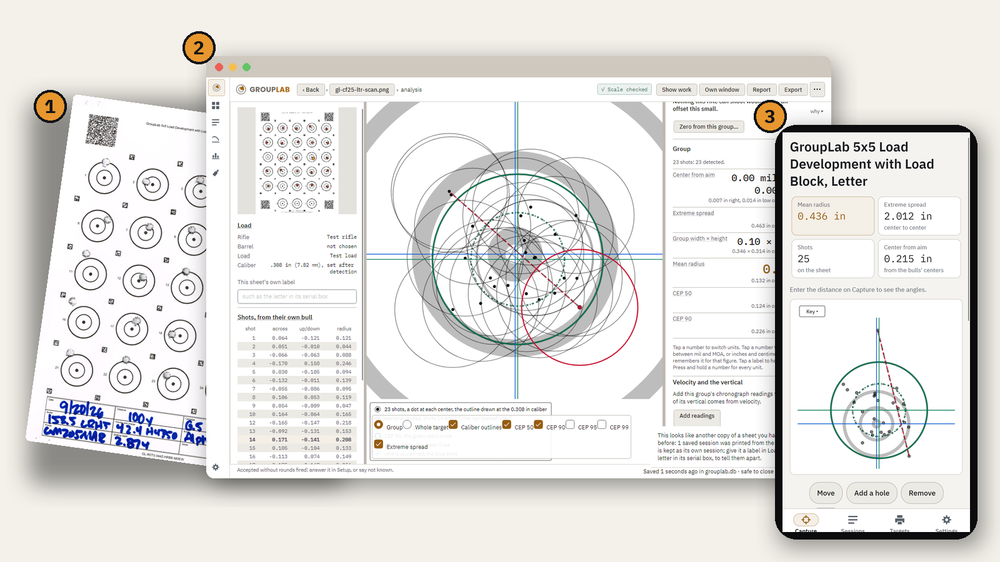
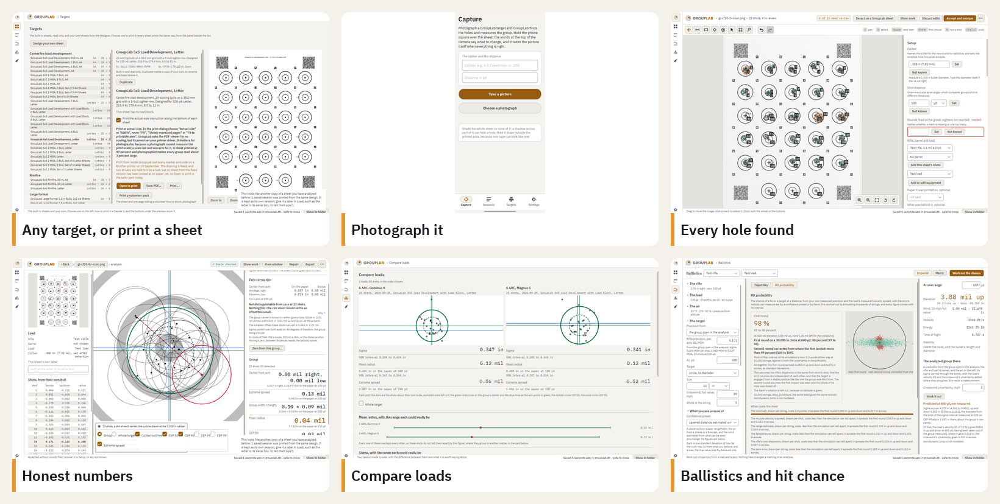
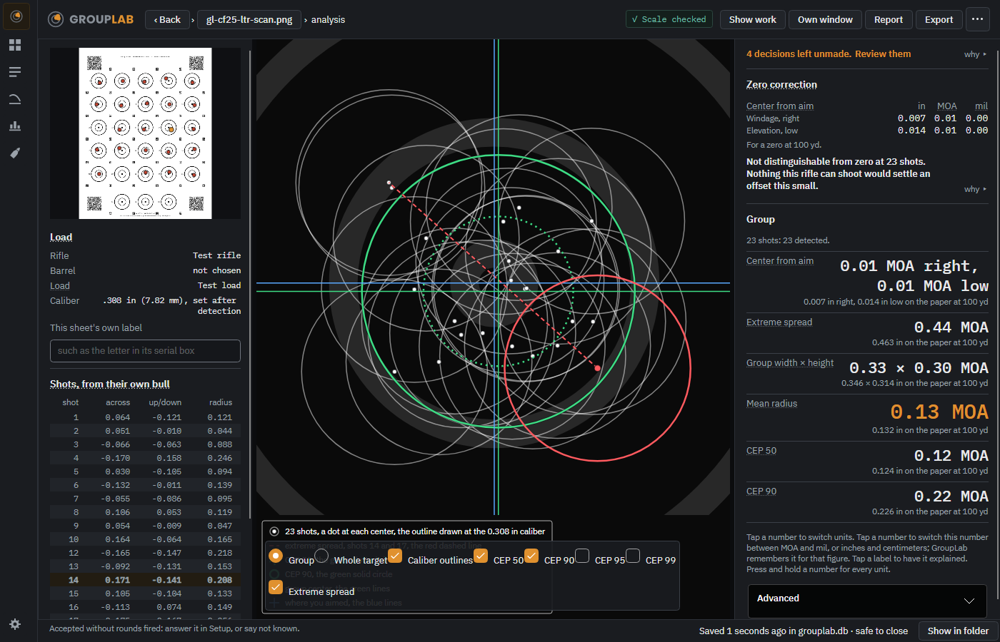
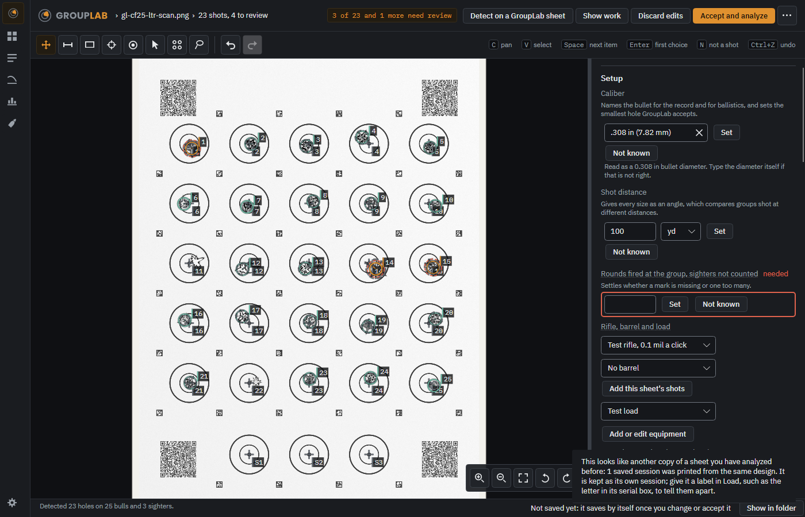
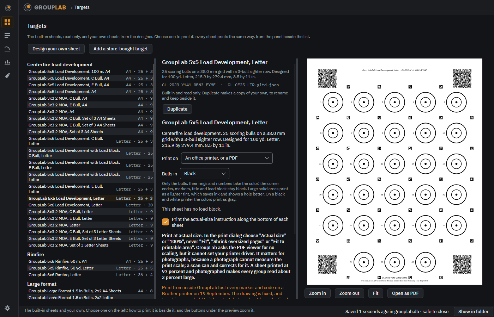
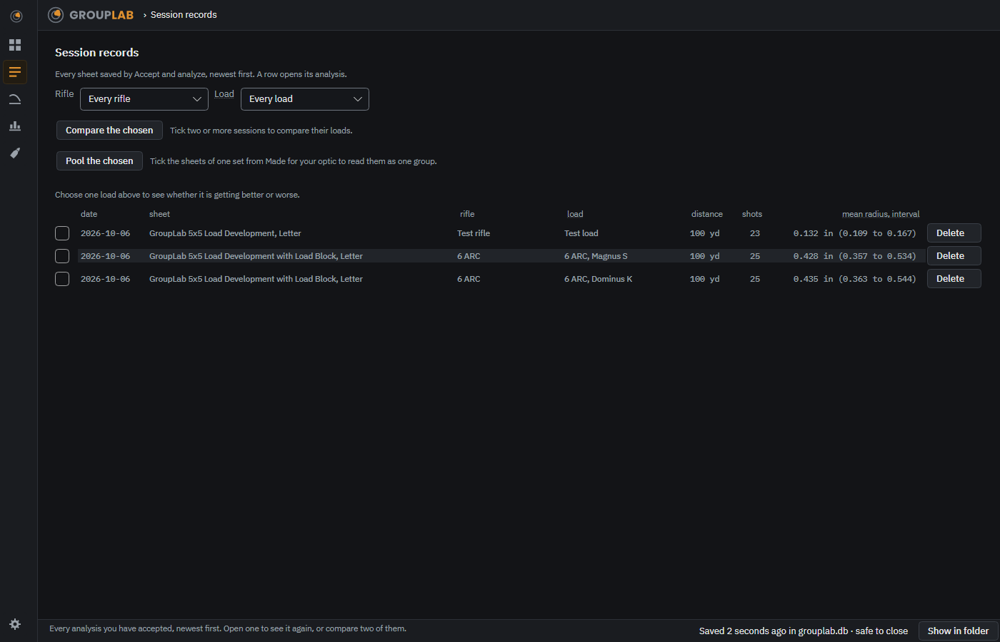
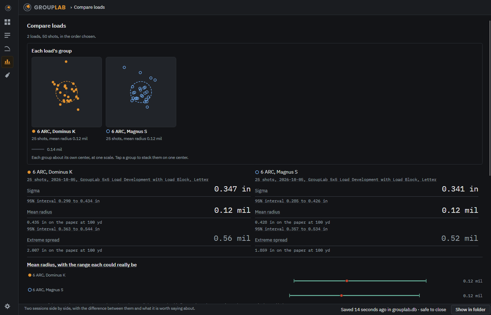
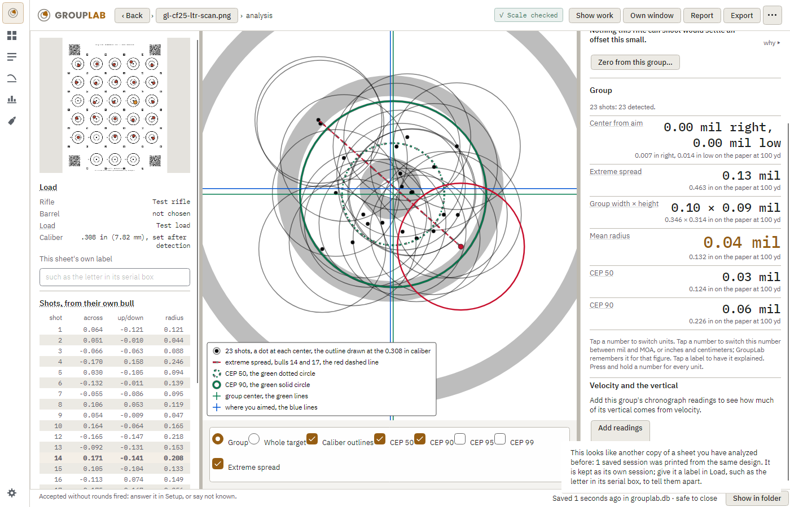
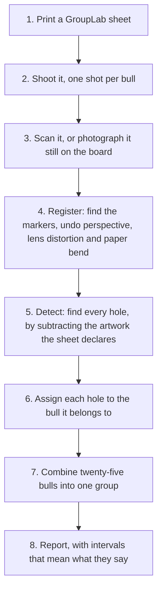
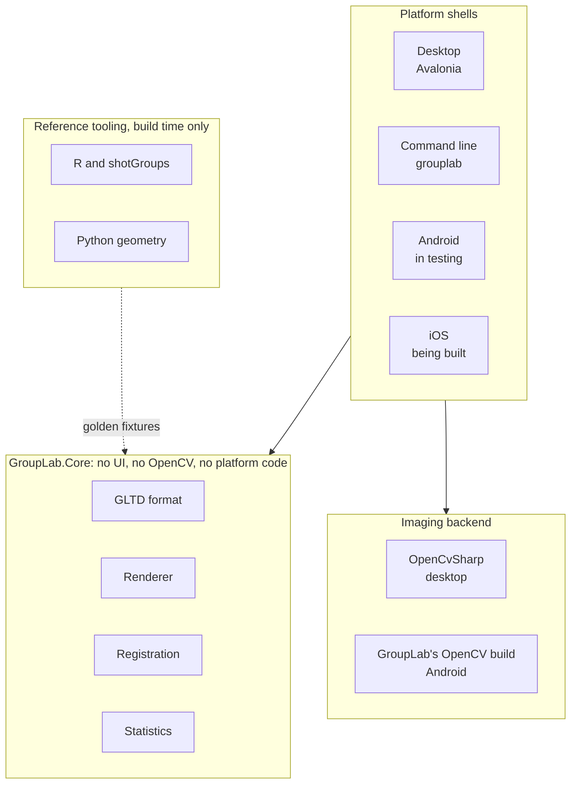

# GroupLab

**Photograph any target, and GroupLab measures the group and tells you honestly what its size is worth. Print a GroupLab sheet, and it does all of it by itself.**

Free and open source under GPL-3.0: no account, no ads, no paid tier. On Windows, macOS, Linux and Android.

[](LICENSE)
[](https://github.com/oRAirwolf/grouplab/releases)
[](https://github.com/oRAirwolf/grouplab/actions/workflows/ci.yml)

[](https://grouplab.org/discord)

<picture>
  <source media="(prefers-color-scheme: dark)" srcset="docs/figures/readme/product-dark.png">
  
</picture>

1. Shoot any target, or print a GroupLab sheet that reads itself.
2. On the computer, every hole found, then the group with honest ranges.
3. On the phone, photograph it at the range.

<picture>
  <source media="(prefers-color-scheme: dark)" srcset="docs/figures/readme/mosaic-dark.png">
  
</picture>

<p align="center">The desktop pictures come from the current build; the phone's from nightly 115, retaken at the next device sitting. <a href="https://grouplab.org/tour/">Take the tour</a>.</p>

<p align="center"><a href="#download">Download</a> · <a href="https://grouplab.org">Website</a> · <a href="https://grouplab.org/features/">Features</a> · <a href="https://grouplab.org/tour/">Tour</a> · <a href="https://grouplab.org/guides/user-guide/">User guide</a> · <a href="https://grouplab.org/discord">Discord</a></p>

## What it does

<!-- readme:features: generated by scripts/readme.py from website/features.json; do not edit between these markers -->
| **Reads targets** | **Honest statistics** | **Prints sheets** |
|---|---|---|
| [Any target you already shoot](https://grouplab.org/features/#other-targets), [A GroupLab sheet reads itself](https://grouplab.org/features/#reads-itself), [Every hole found, and every one yours to change](https://grouplab.org/features/#every-hole), [The bulls you aimed at](https://grouplab.org/features/#aimed-bulls), [A sheet shot off by the same amount](https://grouplab.org/features/#whole-sheet), [Check your printer once, for real inches from photos](https://grouplab.org/features/#printer-scale), [Open by dropping or pasting](https://grouplab.org/features/#open-anyhow), [Photographs at an angle](https://grouplab.org/features/#angle), [Sessions between phone and computer](https://grouplab.org/features/#share-session), [The phone follows your region](https://grouplab.org/features/#phone-region) (Android), [The sheet beside the numbers on a big screen](https://grouplab.org/features/#big-screen) (Android), [Guided or Manual on the camera](https://grouplab.org/features/#capture-modes) (Android), [Every picture checked](https://grouplab.org/features/#picture-check) (Android) | [Tap a number to switch units](https://grouplab.org/features/#unit-tap), [The figures you read off a target](https://grouplab.org/features/#six-figures), [Shots Needed to Zero](https://grouplab.org/features/#shots-to-zero), [CEP circles, any percent](https://grouplab.org/features/#cep), [Every figure explained](https://grouplab.org/features/#why), [Compare loads honestly](https://grouplab.org/features/#compare), [Sessions over time](https://grouplab.org/features/#sessions), [Ballistics and hit chances](https://grouplab.org/features/#ballistics), [Fudd buster mode](https://grouplab.org/features/#fudd-buster), [Shots in and out as CSV](https://grouplab.org/features/#csv), [Every shot, and which count](https://grouplab.org/features/#shots-table), [Zero from this group](https://grouplab.org/features/#zero-from), [Several aim points on one target](https://grouplab.org/features/#aim-points) | [The Targets screen](https://grouplab.org/features/#targets), [Made for your optic](https://grouplab.org/features/#optic), [Zeroing grids read through a scope](https://grouplab.org/features/#zero-grids), [Large sheets](https://grouplab.org/features/#large-sheets), [Real inches from a scan](https://grouplab.org/features/#true-size), [Pool the sheets of a set](https://grouplab.org/features/#pool-set), [The E bull](https://grouplab.org/features/#e-bull), [The C bull](https://grouplab.org/features/#c-bull), [Large format on a home printer](https://grouplab.org/features/#large-on-letter), [The 2 MOA sheets](https://grouplab.org/features/#two-moa), [Print a sheet from the phone](https://grouplab.org/features/#phone-targets) (Android) |

**Sharing and privacy:** [Send a target to the project](https://grouplab.org/features/#send-targets), [Error reports](https://grouplab.org/features/#error-reports), [The hardware survey](https://grouplab.org/features/#survey), [Words explained where they appear](https://grouplab.org/features/#explain-words), [A picture to share](https://grouplab.org/features/#share-picture), [The one-page report](https://grouplab.org/features/#one-page-report).

**Updates and platforms:** [Updates that list what you skipped](https://grouplab.org/features/#updates), [Builds for the Mac](https://grouplab.org/features/#mac), [GroupLab Dev for testers](https://grouplab.org/features/#dev-build) (Android), [GroupLab Dev updates itself](https://grouplab.org/features/#android-updates) (Android).

Each one, with its picture, its platforms and the build it arrived in, is on the [Features page](https://grouplab.org/features/).
<!-- /readme:features -->

<a id="screens"></a>

<details>
<summary><strong>Every screen, larger</strong></summary>

These are the application as it is: the build renders every screen itself, in both themes at every size, every week, and
`docs/figures/screens/current/` holds them all. The [tour](https://grouplab.org/tour/) walks through them. Not built yet: velocity regression.



*The analysis screen: every scoring shot of a sheet on one bull, the figures with their intervals, and the reasoning behind each one a click away.*

| | |
|---|---|
| [](docs/figures/screens/current/marking-dark-1400x900.png) | [](docs/figures/screens/current/targets-dark-1400x900.png) |
| **Marking.** What the detector found, to accept, move or correct, with the review queue for anything it was unsure of. | **Targets.** The built-in sheets, your own designs, and a sheet made for your optic, printed at their true size. |
| [](docs/figures/screens/current/sessions-dark-1400x900.png) | [](docs/figures/screens/current/compare-dark-1400x900.png) |
| **Session records.** Every analyzed sheet, by rifle and load, to open again, compare or pool. | **Compare loads.** Two or more groups side by side, and a plain answer to whether the data separates them. |

| |
|---|
| [](docs/figures/screens/current/analysis-light-1400x900.png) |
| **Light theme.** Dark, light, high contrast, or following the system. |

</details>

## Download

**The latest build.** Rebuilt automatically after every change that passes the tests on Windows, Linux and macOS, and published within a few minutes of it landing. **It may be broken**, because passing the tests is not the same as somebody having used it, and the Windows installer updates itself when a newer one appears.

<!-- readme:newest: generated by scripts/readme.py from docs/RELEASE-NOTES.md; do not edit between these markers -->
**The newest build is 0.2.0-nightly.125**, from 2026-09-29, commit `0011246`: [its release page](https://github.com/oRAirwolf/grouplab/releases/tag/v0.2.0-nightly.125), and [what is new in it](#what-is-new).

| Platform | Download |
|---|---|
| **Windows** | [Installer](https://github.com/oRAirwolf/grouplab/releases/download/nightly/grouplab-setup-win-x64.exe) · [Zip](https://github.com/oRAirwolf/grouplab/releases/download/nightly/grouplab-win-x64.zip) |
| **macOS** | [Apple silicon](https://github.com/oRAirwolf/grouplab/releases/download/nightly/grouplab-macos-arm64.tar.gz) · [Intel](https://github.com/oRAirwolf/grouplab/releases/download/nightly/grouplab-macos-x64.tar.gz) |
| **Linux** | [Tarball](https://github.com/oRAirwolf/grouplab/releases/download/nightly/grouplab-linux-x64.tar.gz) |
| **Android** | [APK](https://github.com/oRAirwolf/grouplab/releases/download/nightly/grouplab-android.apk) · [Google Play internal test](https://play.google.com/apps/internaltest/4701684356677501640), by invitation |
<!-- /readme:newest -->

<details>
<summary><strong>Before you install</strong></summary>

| | |
|---|---|
| **[Installer](https://github.com/oRAirwolf/grouplab/releases/download/nightly/grouplab-setup-win-x64.exe)** | `grouplab-setup-win-x64.exe`, installs into your own user account, no administrator rights, with an entry in Add or remove programs. It keeps itself up to date. |
| **[Zip](https://github.com/oRAirwolf/grouplab/releases/download/nightly/grouplab-win-x64.zip)** | `grouplab-win-x64.zip`, unzip it anywhere and run `GroupLab.App.exe`. It tells you when there is a newer build and you download it yourself. |
| **[Linux tarball](https://github.com/oRAirwolf/grouplab/releases/download/nightly/grouplab-linux-x64.tar.gz)** | `grouplab-linux-x64.tar.gz`, self-contained, built on Ubuntu; nobody uses it day to day. |
| **[macOS, Apple silicon](https://github.com/oRAirwolf/grouplab/releases/download/nightly/grouplab-macos-arm64.tar.gz)** | `grouplab-macos-arm64.tar.gz`, a `.app` bundle for any Mac with an M1 or later. **Run on one real Mac**, by one tester; the Intel build has not been. |
| **[macOS, Intel](https://github.com/oRAirwolf/grouplab/releases/download/nightly/grouplab-macos-x64.tar.gz)** | `grouplab-macos-x64.tar.gz`, a `.app` bundle for an Intel Mac. **Untested on a real Mac.** |
| **[Android](https://github.com/oRAirwolf/grouplab/releases/download/nightly/grouplab-android.apk)** | `grouplab-android.apk`, the app for an arm64 phone or tablet with Android 10 or later and 4 GB of memory. Open it on the phone to install it. It photographs or opens a sheet, checks the picture and reads it with the same engine as the desktop, shows every figure the desktop does with a tap to say what each means, takes the bulls you fired at, works out Shots Needed to Zero, compares loads, prints targets and keeps sessions; marking a target by hand is not on the phone yet. |

**Every desktop build here is unsigned**, so Windows will say "Windows protected your PC": click **More info**, then **Run anyway**. That warning is what Windows says about any program nobody has paid to sign; the source of the build is here, at the commit the download names.

- **Nothing else is needed:** the download carries its own .NET runtime and everything else it uses.
- **It brings two sample sheets**, so there is something to open in the first minute: a real 600 dpi scan of a 25 shot sheet, published with [its consent record](samples/PROVENANCE.md), and an unshot sheet beside it.
- **Where it keeps things:** `%APPDATA%\GroupLab`, and nowhere else. It sends nothing you have not agreed to: sending a target, error reports and the hardware survey each ask first, and an update check sends nothing about you; [docs/UPDATES.md](docs/UPDATES.md) says exactly what it does.
- **Which build you have:** the Settings screen names the version, the train and the commit, which is what a bug report should carry.
- **What is not finished** is in [Planned](#planned) below, which is the authority on what works today. [docs/TESTING-GUIDE.md](docs/TESTING-GUIDE.md) is one page for somebody trying it for the first time.
- **On a Mac**, move `GroupLab.app` into Applications and then run `xattr -dr com.apple.quarantine /Applications/GroupLab.app` in Terminal. That removes the quarantine flag macOS puts on anything downloaded from the internet, which is what stops Gatekeeper opening unsigned software. It is the standard way to run unsigned software. **Anyone not comfortable running that command should not run this build.**
- **Questions, or somewhere to say it did not work:** the [GroupLab Discord](https://grouplab.org/discord). For anything private, or anything with a photograph attached, the support address is better.
- **On Android**, the APK is signed. Google Play's internal test is open by invitation and updates itself, with a closed test to come; remove the Play copy before installing an APK, because the two are signed with different keys. `grouplab-android-dev.apk` is GroupLab Dev, for testers, which installs beside it. [docs/ANDROID.md](docs/ANDROID.md) section 12 has the details.
- **Updates are manual everywhere but the Windows installer.** The zip, the tarball and both Mac builds tell you a newer build exists and leave the downloading to you.
- **[What is supported, and what is not](#what-is-supported-and-what-is-not)** is below, and on the [download page](https://grouplab.org/download/#supported): why the macOS build is unsigned, what happens once the application settles, and how to ask for another Linux target.

The quarantine command for a Mac, the one thing a reader has to type:

```
xattr -dr com.apple.quarantine /Applications/GroupLab.app
```

</details>

---

**On this page.**

- [What it does](#what-it-does)
- [Download](#download)
- [What is new](#what-is-new)
- [What is supported, and what is not](#what-is-supported-and-what-is-not)
- [Why it exists](#why-it-exists)
- [How it works](#how-it-works)
- [Status and plan](#status-and-plan)
  - [Status](#status)
  - [Planned](#planned)
- [For developers](#for-developers)
- [Thanks](#thanks)
- [License](#license)

---

## What is new

<details>
<summary><strong>The newest builds</strong></summary>

What the newest builds changed that you would notice, from their release notes.

<!-- readme:whats-new: generated by scripts/readme.py from docs/RELEASE-NOTES.md and website/features.json; do not edit between these markers -->
**0.2.0-nightly.125**, 2026-09-29

- GroupLab Dev now updates itself on Android: it looks for a newer nightly, downloads it on Wi-Fi, checks its signature and signing key, and installs it when you leave the app, with Update now and a switch for automatic installs in Settings under About. [GroupLab Dev for testers](https://grouplab.org/features/#dev-build)
- The list of other people's software GroupLab is built with now names what the phone version uses, including the camera and update libraries.
- Tap any number to switch its units now works in the full CEP table too: each number there shows its own unit and switches alone. (Question 70). [Tap a number to switch units](https://grouplab.org/features/#unit-tap)

**0.2.0-nightly.124**, 2026-09-29

- On the phone, a target with several aim points shows each in its own color with its own figures, and another can be added from the result.
- On the phone, Zero from this group can hand the group's offset to Ballistics, whose dope then includes it at every range.

**0.2.0-nightly.123**, 2026-09-29

- Fudd buster mode, Unholy's idea, shows with your own shots why a few shots mislead: the tightest and widest three-shot groups among them, what averaging small groups would have said, and the zero chased five shots at a time. [Fudd buster mode](https://grouplab.org/features/#fudd-buster)
- On the phone, a result now lists every shot with its offset and clicks and a Counted switch to leave one out, and Zero from this group says where the group sits and whether to dial.
- On the phone, a target GroupLab did not print can now be marked by hand: set a known length and the aim point, then add each hole under a crosshair that stays in the middle.
- The status bar now says when the target was saved and where, with Show in folder, and it saves by itself once you change or accept it; Settings can switch to a Save button instead.
- A tap on a number now switches that number alone, and GroupLab remembers the unit for that figure; the others follow Settings as before.
- GroupLab's license now allows it to be distributed through Apple's App Store and its test service, as work on an iPhone and iPad version begins.

Every build's notes are in [docs/RELEASE-NOTES.md](docs/RELEASE-NOTES.md) and at <https://grouplab.org/releases/>.
<!-- /readme:whats-new -->

</details>

## What is supported, and what is not

<details>
<summary><strong>Every platform, its minimums and what happens on it</strong></summary>

<!-- platform-support: generated from docs/PLATFORM-SUPPORT.md, do not edit between these markers -->

**Windows is the supported platform.** It is where GroupLab is developed and tested by hand, and the installer and automatic updates are built for it.

**Linux builds are published and are worth trying.** The download is a self-contained 64-bit tarball, so it runs on most desktop distributions without anything else being installed alongside it. The test suite runs on Linux on every build. Hands-on testing has not started yet. Linux can be tested here on virtual machines under VMware Workstation, and there is no bare metal Linux machine, but the real reason is that the application is still under heavy development, with features, layouts, appearance and internal workings changing daily. Testing a moving target on a second platform would mostly produce findings that are obsolete a week later.

**macOS builds are published, and the Apple silicon build has been run on one Mac.** One tester ran nightly 93 on a MacBook Pro with an M5 Max, under macOS 27, natively rather than under Rosetta. macOS blocked the first launch, and the Terminal command below cleared it. Opening, detecting and analyzing the published sample, saving a session, printing a target to PDF, quitting with Command Q and sending the diagnostics report all worked, and text was sharp on the Retina display. Command shortcuts such as Command Z did not work, and pinch zoom had not been built on any platform; both are fixed in builds after nightly 94, and neither fix has been checked on a Mac yet. **The Intel build has never been run on a Mac.** The tests run on macOS on every build. These builds are an experiment rather than a release. The updater does not install them, and the developer still does not own a Mac.

### Minimums

The lowest each platform needs. The operating system floor is .NET 10's own support list, which nothing can go below; memory, disk and
screen are GroupLab's measurements; nothing is listed for a platform that has no published build.

| | Operating system | Built and published | Memory | Disk | Screen |
|---|---|---|---|---|---|
| **Windows** | Windows 10 version 1607 or later; version 1809 or later for the Microsoft Store copy, once it is published | x64 only; Arm64 and 32-bit x86 are not built | 4 GB, 8 GB recommended | 230 MB installed | a window about 1060 wide for the analysis screen |
| **macOS** | macOS 14 or later | Apple silicon and Intel | 4 GB, 8 GB recommended | 190 MB installed | as Windows |
| **Linux** | Ubuntu 22.04, Debian 12, Fedora 42, RHEL 8 or later; glibc 2.27 or later | x64 only; Arm64 is not built | 4 GB, 8 GB recommended | 220 MB installed | as Windows |
| **Android** | Android 10 or later | arm64 only: an APK with every nightly, and Google Play's internal test by invitation | 4 GB | under 100 MB installed | 360 dp wide; a rear camera of 8 MP or more with autofocus |

Where the figures come from:

- **Operating systems:** .NET 10's supported list (github.com/dotnet/core, `release-notes/10.0/supported-os.md`). For Android, .NET lists
  Android 14 and later as what Microsoft tests; GroupLab's minimum of Android 10 rests on GroupLab's own testing instead, because Android
  14 and later is only about half the phones in use.
- **Memory:** analyzing the 600 dpi sample scan peaks at 733 MB on the desktop, measured on 2026-09-25; the application also holds the
  image to show it. 4 GB leaves the operating system its share; 8 GB is recommended for large scans. On Android the engine works at 8
  megapixels, where it peaks at about 370 MB on a Galaxy Z Fold 7.
- **Disk:** the unpacked download of nightly 103, measured; each saved session adds about 220 KB for its proof image, so a hundred
  sessions take about 22 MB.
- **Screen:** the analysis screen needs about 1060 units of width; narrower, its right column runs past the window, which is being
  worked on.

### What happens once the application settles

Other platforms get proper attention once the pace of change slows and the Windows application is generally working the way the developer wants it to.

**Android is built and in testing**, because that is the mobile platform in daily use here. Every nightly carries a signed APK, it runs on a Galaxy Z Fold 7 and a Galaxy Tab S8 Ultra, and Google Play's internal test is open by invitation, with a closed test to come. It photographs or opens a sheet in Guided or Manual mode and checks every picture, reads it with the same engine as the desktop, shows every figure the desktop does with a tap to say what each means, takes the bulls you fired at, works out Shots Needed to Zero, compares loads, gives the dope and the chance of a hit, prints targets and keeps sessions; marking a target by hand is not on the phone yet. `docs/PHONE-PARITY.md` lists what the phone does, feature by feature. `docs/ANDROID.md` has the plan and what each stage found. Hands-on Linux testing follows, on virtual machines. macOS depends on the hardware question below.

### Running the macOS build

macOS quarantines anything downloaded from the internet and refuses to open software that is not signed by a registered Apple developer. After the application has been moved to the Applications folder, this removes the quarantine flag:

```
xattr -dr com.apple.quarantine /Applications/GroupLab.app
```

Anyone not comfortable running that command should not run this build.

### Why it is not signed

Signing a macOS application requires the Apple developer program, which costs 99 dollars a year. The developer of GroupLab does not own a Mac, does not intend to buy one, and is not going to pay a yearly fee for a platform they do not own.

That is the whole reason. It is not a technical obstacle and it is not indifference to Mac users. If a developer or contributor wants signed macOS releases enough to donate a Mac for testing and cover the developer fees, the project will set it up.

### Signing elsewhere

The one-off 25 dollar Google Play developer fee has been paid. A signed Windows version through the Microsoft Store is intended in due course, and a code signing certificate may be bought if the price turns out to be reasonable.

### Apple mobile

An iOS version of GroupLab is being built. It is tested on an iPad Mini, sixth generation, and built and signed on GitHub's Mac machines, because the developer still does not own a Mac and does not need one for this. Testers get it through TestFlight. It is not in the App Store yet; the plan is docs/IOS-PLAN.md.

### Other Linux builds

The published Linux build is x86-64. Other targets can be added to the nightly builds on request: Arm64 for a Raspberry Pi or an Arm laptop, or a package built for a particular distribution rather than a tarball. Adding one is a line of configuration rather than a project. The reason a dozen are not published already is simply that nobody has asked for them.

Requests go to support@grouplab.org, naming the distribution and the architecture.

### Reports from Linux and macOS are welcome

A report is useful even when the answer is that it crashed on startup. "It opened and the buttons are the wrong size" is a useful report, and so is a crash report, which GroupLab can send on request. The address is support@grouplab.org.

<!-- end platform-support -->

---

</details>

## Why it exists

**An open-source tool that measures how accurately a rifle shoots, and is honest about how little a small group actually tells you.**

Free, GPL-3.0, no account, no ads, no paid tier.

**<https://grouplab.org>** is the website: what GroupLab is, how to use it, and where to download it. The same builds are linked below.

A shooter fires five rounds, measures three quarters of an inch between the two widest holes, and concludes the rifle shoots three quarters of an inch. Then they change one thing, fire five more, measure six tenths, and conclude the change worked.

It almost certainly did not. From five shots, the rifle's true spread is somewhere between **0.68 and 1.92 times** what was measured, a factor of 2.8. Two loads that differ by 20 percent on five-shot groups are statistically indistinguishable. The existing tools will happily print that six tenths to three decimal places and say nothing about it.

GroupLab measures the same thing far more carefully, and then tells you what the number is worth. Below five shots it refuses to quote a group size at all, and says why. Between five and twenty it prints the figure with the interval's **real** coverage rather than a comfortable "95 percent". When you compare two loads it will tell you, in plain words, that the data does not support a conclusion and how many rounds it would take to reach one.

That is the whole point of the project. Everything else is the machinery that makes the measurement good enough to be worth being honest about. GroupLab also aims to help shooters think in mean radius and confidence rather than in the extreme spread of a few shots.

## How it works

**Any target works.** Photograph or scan whatever you shot on, set the scale once, and mark the holes by hand, on the computer or, under a crosshair, on the phone. The same statistics run. Finding the holes by itself on any target is the goal, not yet a feature.

**A GroupLab sheet is the fast lane, not a requirement.** On its own sheets everything is automatic: the scale, every hole, and which bull each shot belongs to, and one shot per bull gives large groups. You print a target sheet that GroupLab generates. It carries a grid of small bullseyes and machine-readable registration markers, plus QR codes holding the sheet's complete geometric definition, so any software that has never seen the design can still analyze it correctly.

You shoot it, then scan or photograph the sheet, still stapled to the board if you like.


```mermaid
flowchart TB
    A["1. Print a GroupLab sheet"]
    B["2. Shoot it, one shot per bull"]
    C["3. Scan it, or photograph it still on the board"]
    D["4. Register: find the markers, undo perspective, lens distortion and paper bend"]
    E["5. Detect: find every hole, by subtracting the artwork the sheet declares"]
    F["6. Assign each hole to the bull it belongs to"]
    G["7. Combine twenty-five bulls into one group"]
    H["8. Report, with intervals that mean what they say"]
    A --> B --> C --> D --> E --> F --> G --> H
```

The one-shot-per-bull design is what makes the accuracy possible. Holes never overlap, so each one is measured cleanly against its own aiming point, and the twenty-five offsets are then pooled into a single group far larger than anything you could shoot into one bullseye.

## Status and plan

### Status

<details>
<summary><strong>Where GroupLab stands</strong></summary>

**Where the work stands is in Planned below, phase by phase, with the state of every feature and the gate each phase is measured against.**
The newest build is named under [Download](#download), and what it changed under [What is new](#what-is-new).

What exists and is tested:

- the GLTD target definition format, in JSON (GLTD-J) and as a binary QR payload (GLTD-B)
- a validator, and <!--count:sheets:digits-->38<!--/count--> built-in target sheets, and a generator that sizes a sheet for your optic
- a PDF renderer, a Targets screen that prints at true size, and a designer for your own sheets
- registration from printed sheets, including off-axis photographs and a developable-surface model for paper that is not flat
- hole detection, validated on synthetic and real images
- the statistics engine, validated key for key against the R package `shotGroups`
- load comparison, pooling a set of sheets, the zero correction, and a ballistic solver
- a desktop application for Windows, Linux and macOS, with hand marking for targets GroupLab did not print
- an Android app, in testing, that photographs or opens a sheet and reads it with the same engine
- an intake tool that verifies donated photographs, refuses opt-outs, and strips location data without altering a pixel
- a sheet that names its own definition from its printed codes, so no target has to be named by hand
- an end-to-end `analyze` command, from photograph to report
- diagnostic logging, crash records and a report package, with no location data in any of them

New on the phone in the latest builds, as entries 258 and 259 bring it level with the desktop:

- On the phone, the result now opens into every figure the desktop shows, and a tap on a figure's name says what it means.
- On the phone, Shots Needed to Zero has a page of its own.
- On the phone, you tap the bulls you fired at on the sheet itself.
- On the phone, Sessions can compare loads.
- On the phone, Ballistics is a tab of its own: the dope, the trajectory and the chance of a hit with your own group.
- On the phone, a set of sheets is a checklist: the sheets read so far pooled into one group, and those still to read.
- On the phone, a scan says how it was printed, and every size is corrected to real inches.

What does not exist yet: Garmin Xero import, velocity regression, synchronization, the iOS build (being built), and hand marking on the phone.

#### Before the first beta or stable release

No beta or stable release happens until Alan asks for one by name. Each of these is checked first, from
[docs/RELEASE-PLAN.md](docs/RELEASE-PLAN.md):

<!-- readme:plan: generated by scripts/readme.py from docs/RELEASE-PLAN.md; do not edit between these markers -->
1. **No open defect that loses work or gives a wrong figure.** The issues in `grouplab-crash-reports` are read at the start of every run; none may be open from a build newer than the one before the release, and every reported crash from the last two nightlies is explained.
2. **CI green on all three systems** on the commit to be released, and the phase 0 gate record passing.
3. **The minimums table** in `docs/PLATFORM-SUPPORT.md` is the one the release notes and the download page state, generated from one place (`scripts/platform-support.py`), and the hardware survey, once open, has not contradicted it.
4. **The privacy text is true**: the article what-grouplab-sends lists everything the build can send, and the build sends nothing else (`OneWayOutTests`).
5. **The user guide describes this build**: every screen it names is on screen, the guide's PDF is regenerated, and the tour pages match the week's screenshots (entry 146 section 4.4).
6. **The release notes** are written for a person who shoots, from the builds' own notes since the last numbered release.
7. **The Windows build is signed**, or the download page says plainly, as it does today, why it is not and what the warning means.
8. **The installed update path works from the previous nightly**, checked on one clean machine (entries 119 to 123).
<!-- /readme:plan -->

</details>

### Planned

<details>
<summary><strong>Every phase, its state and what it holds</strong></summary>

Every phase below is `DESIGN.md` section 21's, with its gate. A phase is not done until its gate passes, and the gates' measured results are in `docs/PHASE0-RESULTS.md` and `docs/PHASE1-RESULTS.md`.

**The four states.**

| State | Means |
|---|---|
| **Not started** | no code |
| **In progress** | being built, not usable |
| **Built, not proven** | the code exists and works, and its gate has not been met or cannot yet be run |
| **Done** | its gate has been met and recorded |

**"Built, not proven" carries its weight here.** The assignment editor works and its gate needs a 25-shot target that nobody has shot yet. Calling that done would make this page untrue, and calling it in progress would be untrue the other way.

| Phase | State | Gate |
|---|---|---|
| **0a. Format and renderer** | **Done** | conformance test 43: a rendered definition analyzed as a scan recovers every bull center within 0.001 in |
| **0. Registration spike** | **Built, not proven** | worst bull center within 0.005 in on a 600 DPI scan of a printed sheet, and on an off-axis photograph of a sheet held flat |
| **1. Detection spike** | **Built, not proven** | at least 99 percent of holes found with no false positives, matched at 0.15 in, and the mounted photograph gate at 0.005 in |
| **2. Core and statistics** | **Built, not proven** | statistical output matches the R package `shotGroups` to numerical tolerance on shared test data |
| **3. Editor** | **Built, not proven** | a full 25-shot target with several misassignments corrected in under two minutes |
| **4. Windows application** | **In progress** | target library, generation, printing, analysis, reporting and session records, in one application |
| **5. Chronograph, solver, and comparison** | **In progress** | a ballistic solver validated against an independent implementation, and Garmin Xero import reconciled against marked shots |
| **6. Android** | **In progress** | camera capture and lens distortion fitted on the device |
| **7. Synchronization** | **Not started** | cloud provider adapters over three-tier storage |
| **8. iOS** | **In progress** | built and signed on CI |
| **9. Performance** | **In progress** | not written yet: it is written from the baseline in `docs/PERFORMANCE.md`, in the times a person waits, per platform, rather than from a figure anybody guessed |

Phases 5 and 9 are in progress in the nearest honest sense: parts of each are built and not proven, and the rest is not started.

#### What each phase holds

**Phase 0a. Format and renderer.**
- **Done.** The GLTD definition format, in JSON and as a binary QR payload.
- **Done.** A validator, and <!--count:sheets:digits-->38<!--/count--> built-in target sheets.
- **Done.** A PDF renderer, with the printed name and identifier on every sheet.

**Phase 0. Registration spike.**
- **Done.** Registration from a scan of a printed sheet.
- **Built, not proven.** Registration from an off-axis photograph of a sheet held flat.
- **Built, not proven.** A developable-surface model for paper that is not flat, for the mounted case.
- **Done.** A sheet that names its own definition from its printed codes.

**Phase 1. Detection spike.**
- **Built, not proven.** Render-and-difference hole detection, with one size check that the review queue counts.
- **Done.** Hole-to-bull assignment by one-to-one matching, with sighter and scoring bulls as separate pools.
- **Done.** An end-to-end `analyze` command, from photograph to group.
- **Done.** A standing check that compares the corpus's detection counts whenever printed artwork changes.

**Phase 2. Core and statistics.**
- **Built, not proven.** The statistics engine, checked key for key against `shotGroups`.
- **Built, not proven.** Significance testing: rank and dispersion tests between two groups and among several, MANOVA on the shot coordinates, and the dispersion ratio with its interval.
- **Built, not proven.** Hit probability inside a radius at the distance shot, by three estimators, with the CEP table behind it.
- **Done.** Every figure with the interval it actually has, and the reference a figure needs to be read against.
- **Done.** Composite groups, pooled groups and load comparison in the engine.
- **Done.** Caliber-aware edge-to-edge extreme spread, with the reason printed in place of the figure when no caliber is set.
- **Built, not proven.** Subgroups within one sheet: on the marking screen, shift and click chooses bulls and one field puts a load on all of them, so a ladder sheet is set five bulls at a time. Each subgroup has its own figures and they are compared by dispersion and by center, so one sheet can carry six charge weights.
- **Done.** The zero correction: the group center's offset from the point of aim with its uncertainty, and, where the offset is smaller than the shots can resolve, the number of shots that would settle it instead of a correction.

**Phase 3. Editor.**
- **Built, not proven.** The review queue: contested assignments, possible merges, doubled bulls, shots with no bull and refused candidates, each with the choices that settle it.
- **Built, not proven.** Keyboard operation: the next item, its first choice, a bull typed to reassign, not a shot, and a flagged mark taken as the two shots it is, with no item needing the mouse.
- **Built, not proven.** Shots per bull for a sheet that breaks one a bull on purpose: every shot to its nearest bull, or two on the bulls named, matched that way. Without it, one-to-one matching pushes each second shot onto an empty neighbor and the review queue raises every one, which a synthetic doubles sheet tests both ways.
- **Built, not proven.** `grouplab compare-photos`: photographs of a sheet against its flat scan, the scan's corrected marking or its own detection as the truth, saying which. For each photograph it gives the registration model, the bull-center error, holes found, missed and false, and the hole-position error, read against 0.005 in and 0.15 in without deciding either gate.
- **Built, not proven.** The rounds fired as a check on the count: when the marks disagree with them, the queue names the marks most likely to be two, or least like a hole, and offers the first as a key press.
- **Done.** The secondary mode of `DESIGN.md` section 3: any target, including a store-bought one or blank paper, marked by hand on a photograph against a reference length or rectangle for scale.
- **Done.** Sighters found and matched and then set aside unless a person asks for them, and analyzed as a group of their own when they do, never pooled with the scoring shots.
- **Done.** The caliber entered as a cartridge name, such as 6.5 Creedmoor, or as the bullet's diameter in inches or in millimeters marked mm. A name is offered only where two published sources agree on its diameter (entry 163); a designation typed as a number, such as .38 or 7.62 mm, is still refused, because a caliber's name is usually not its diameter.
- **Done.** Assisted placement in that mode, which is the snap: a rough click lands on the dark centroid within a caliber-sized reach, with no definition needed.
- **Done.** Move, delete, reassign, exclude with a reason, mark not a shot, and undo throughout.
- **Done.** The concept screen's appearance: the tool strip as icons, each named with its key, the review's keys as keycaps, the breadcrumb header with its review count, the left rail, the document as a paper sheet on dark chrome, and the accents applied throughout, teal for what the software found, amber for what needs a person.
- **Done.** A layout and readability pass on both screens: five text styles, one row shape for every figure, the reasoning behind each figure and judgment one click away under "why", a header on one line with the document's actions in a menu, the view controls over the canvas, and the units, theme and log on a settings screen of their own.

**Phase 4. Windows application.**
- **Done.** A print screen that renders any built-in sheet to PDF at actual size.
- **Built, not proven.** Printing from inside GroupLab on Windows: the real print dialog, the sheet drawn at actual size by GroupLab itself, a refusal with its reason when the paper is not the sheet's or ink would fall in the printer's margin, and a confirmation naming the printer and the pages sent. Its drawing dropped every filled rectangle on a Brother driver, so those sheets printed with no markers or codes at all; that is fixed, and a test now prints every sheet through more than one driver and compares each item against Save PDF. **Open to print is the primary until a sheet from the fixed path has been checked on paper**, and the screen says why.
- **Done.** The parametric target editor: page, rows and columns, spacing, ring, sighters and load block, laid out by the rule the library was, with a layout that cannot register or fit refused and a spacing tight for your rifle's group warned with its misassignment rate.
- **Done.** An intake tool that verifies donated photographs, refuses opt-outs and strips location data.
- **Done.** Diagnostic logging, crash records and a report package, with no location data in any of them.
- **Done.** The three-axis unit setting: inches, centimeters and millimeters, MOA, mil and SMOA, yards and meters, each chosen independently and display only.
- **Done.** The analysis screen shown above: the editor and the analysis as two states of one document, forward by Accept and analyze and back by the sheet crumb with every edit intact; the composite plot of every scoring shot on one bull, with the caliber, the excluded shots drawn hollow, CEP 50 and 90 and the extreme spread's two shots; CEP and width by height in the figure stack; the two judgment cards, round and flyer, each naming its test; the sheet's thumbnail, drawn from its definition with every shot on it, where a click on a bull selects its shots; and the full CEP table and bivariate fit behind one disclosure that remembers it was opened.
- **Not started.** Hole detection on blank paper, with no definition to difference against. Its gate names the material it needs, one photograph at a known scale of plain paper with real holes in it, and no image in the corpus is that.
- **Built, not proven.** Session records in one SQLite database with a documented, versioned schema and full JSON export and import: Accept and analyze saves the session, with its marking, figures, definition and a 150 dpi proof image, and the Session records screen lists them newest first, filters by rifle and load, opens one back to its analysis with no image needed, and asks before deleting one.
- **Built, not proven.** The session report: a PDF from GroupLab's own writer with the particulars, the composite plot, every figure with its interval, without any shot left out and with every shot beside it, the zero correction and the two cards on page 1, and the shot table with bulls, exclusions with reasons, unmade decisions, registration, every "why", and the version and identifiers on page 2. Every line on it is one the analysis screen shows.
- **Built, not proven.** The target library: the built-in sheets, read only, and your own sheets from the designer, saved as GLTD files in the data folder, renamed, duplicated from any sheet, and deleted after asking. The print screen lists both. A session keeps its own copy of the sheet it was analyzed against, so deleting a sheet never makes a session unreadable.
- **Done.** Records for rifles, barrels and loads, kept small: a rifle's scope click, a barrel's round count, a load's components.
- **Done.** The stage timeline that shows the analysis doing its work, as `DESIGN.md` section 19 describes it. During a live run each stage lands on the timeline with its own picture as it files: the markers found light up, the registration's corners are ringed by their residual, and the residual shows the artwork gone and the holes left. The timeline scrubs by slider or button, and a rejection clicked is found on the image. A batch run builds no pictures.
- **Done.** GroupLab's mark in the header and the rail, and as the application's icon for Windows, Linux and macOS, drawn from one committed source.
- **Done.** The four themes of `DESIGN.md` section 19: dark, light, high contrast and follow system, all four from one set of tokens, each held to its contrast ratio by a test.
- **Built, not proven.** An unobtrusive support link, one menu item with no payment handled inside the application. There is no address yet, so the item on the settings screen says so rather than opening anything, and a test fails if an address appears anywhere else. It becomes one browser launch when Alan has a page.
- **Done.** Adjust-to-zero turret corrections, in a linear and an angular unit at once, and in the scope's own clicks with what rounding leaves once the marking names a rifle.
- **Built, not proven.** A volunteer print pack: the print screen's "Print a volunteer pack" gives the sheet and one page of instructions together, generated from `docs/VOLUNTEER-PACK.md` at the sheet's own paper size, with its own distance from bull 1 to bull 5 to measure. Consent is the upload page's, not the pack's.

**Phase 5. Chronograph, solver, and comparison.**
- **Built, not proven.** Chronograph strings entered by hand, with the reconciliation `DESIGN.md` section 15 requires: the readings are never assumed to line up with the shots, the in-order pairing is a proposal, a reading that belongs to no shot or a shot the chronograph missed is marked, and what is accepted is kept on the session. The readings' own spread becomes the load's velocity SD, with a note of where it came from.
- **Not started.** Garmin Xero import, which waits for a sample export file; the reader produces the same list of numbers as the box that is built.
- **Built, not proven.** A ballistic solver, validated against an independent implementation: the point-mass solver ported from ballistics.js and corrected in five places, and `grouplab trajectory`, which prints a table from stated inputs. G1 and G7 agree with py-ballisticcalc well inside tolerances written down before the comparison. On screen since entry 112: the rifle and load records carry what it needs, all optional, and the Ballistics screen gives a dope table in your units and clicks with the air as an input; the analysis carries the zero correction to a second distance with its uncertainty, and keeps its refusal when the offset cannot be told from zero.
- **Built, not proven.** Load against load on screen: sessions chosen in Session records, or one sheet's subgroups, side by side with their plots, figures and intervals, the tests with their verdicts and what each could have detected, and the shots it would take to resolve a smaller difference. The loads are never ranked by a point estimate, and overlapping intervals are said to leave them unseparated.
- **Not started.** Velocity regression, and predicted against measured vertical.
- **Built, not proven.** Hit probability at a distance other than the one shot, and distance normalization, both propagated through the solver rather than by scaling a group linearly: the load's velocity SD and the crosswind's uncertainty add their own spread at the new distance, the velocity's share at the distance shot is taken out first and refused when it is larger than the group, and the chance of a hit on a circle or a rectangle is given at both ends of the sigma interval as well as its estimate. With neither spread given it is angular scaling, and says so. Every figure is labeled a prediction.

**Phase 6. Android.**
- **Built, not proven.** The camera capture path, with the capture screen's checks, and a sheet opened from the phone's files; the analysis runs on the device with the desktop's engine, lens distortion included, and its gate waits on a measured capture from the phone.
- **Built, not proven.** The result on the phone, its edits and undo, sessions kept and shared as files the desktop opens, and the first run's sharing questions.
- **Built, not proven.** The Targets screen: the library and a sheet made for your optic, through Android's print dialog or shared as a PDF.
- **Built, not proven.** A signed APK with every nightly, a development build that installs beside it, and Google Play's internal test.
- **Not started.** Marking a target by hand on the phone.

**Phase 7. Synchronization.**
- **Not started.** Cloud provider adapters over three-tier storage.

**Phase 8. iOS.**
- **In progress.** The plan, with sizes, is `docs/IOS-PLAN.md` (entry 278 section 6): the shared phone screens, OpenCV built for iOS, the camera on AVFoundation, and a nightly build signed on GitHub's Mac machines and sent to TestFlight. Submission to the App Store waits for Alan.

**Phase 9. Performance.**
- **Not started.** Making GroupLab quick, once it is right. It may run alongside Phase 6, and Android is the reason it matters: a phone is several times slower than a desktop. It starts only when the application works as intended, because a fast wrong answer is worthless.
- **Built, not proven.** `grouplab bench`, which measures GroupLab against material it generates itself and needs nothing from anybody, and the interface benchmark that walks every screen and times every control from the click to the moment nothing further is coming. [docs/PERFORMANCE.md](docs/PERFORMANCE.md) holds the first record, the method, and the wasteful things found while measuring.
- **Not started.** The gate, which is written from that baseline rather than guessed, and the optimizations themselves. Nothing has been optimized.

</details>

<details>
<summary><strong>Deferred, and why</strong></summary>

#### Deferred, and why

**One item in `DESIGN.md` section 3 carries no phase on purpose, and it carries two promises.** A deferral means the promise still stands, nobody is working on it, and the reason is written down. It is not a quiet drop, and it is checked: a scope bullet with neither a phase nor a deferral fails a test.

- **Deferred: the full visual designer, and with it the full detector on a bought target.** Every built-in sheet is a grid, so the parametric editor covers the space, and the format already carries arbitrarily placed bulls for the day something needs them. A canvas is a large screen for a case nobody has asked for. The same canvas is how a person would trace a store-bought target into a definition, and a definition is what the detector needs, so the designer's deferral carries that second promise too: when either is asked for, both arrive together. Assisted placement on a target with no definition is the snap, above, and detection on blank paper is Phase 4.

A state changes in the same commit as the thing it describes, and `ReadmeTests` fails if a phase here and in `DESIGN.md` section 21 ever disagree, if a phase's feature carries no state, or if a scope bullet in section 3 names no phase and no deferral.

#### Platforms

**What is supported, and what has been checked on real hardware, is the platform statement above,** generated from its one source,
`docs/PLATFORM-SUPPORT.md`. This section does not repeat it. What the plan adds is how the other platforms are kept correct.

**Linux and macOS are built and tested alongside Windows, not after it.** Every push builds and runs the whole suite on all three. A
second workflow reruns the complete Phase 0 measurement record on all three and compares every printed table against the Windows record,
which is a harder question than whether the code compiles: it asks whether the three platforms produce the same answers. Both reproduce
the record: every gate verdict and every printed table is identical to Windows, which is how the gate record workflow defines reproducing
it.

**The developer works on Windows.** Targets are printed, shot, photographed and marked there, so that is where the application meets real
data. Linux and macOS are held correct continuously so that neither turns into a port later, which is the expensive way to do it.

**Mobile comes after the desktop, Android first.** Android is Phase 6, and in testing: the platform statement above says what it runs on. iOS is Phase 8, and being built: `docs/IOS-PLAN.md` has the plan, tested on an iPad Mini and built and signed on GitHub's Mac machines. The App Store needs the GPL section 7 additional permission described under License; building and testing on a device do not.

</details>

## For developers

<details>
<summary><strong>Where to start</strong></summary>

1. **[DESIGN.md](DESIGN.md)**, the design document: what GroupLab is for, how it works, and the build plan.
2. **[docs/TARGET-SCHEMA.md](docs/TARGET-SCHEMA.md)**, the GLTD 1.0 format, including the conformance tests of section 10.

| Document | Covers |
|---|---|
| [docs/USER-GUIDE.md](docs/USER-GUIDE.md) | Using the Windows application, from printing a sheet to comparing loads, with [a PDF](docs/USER-GUIDE.pdf) |
| [docs/TESTING-GUIDE.md](docs/TESTING-GUIDE.md) | One page for somebody trying GroupLab for the first time, with [a PDF](docs/TESTING-GUIDE.pdf) |
| [docs/PHASE0-BRIEF.md](docs/PHASE0-BRIEF.md) | The brief for Phases 0a and 0 |
| [docs/FIDUCIAL-DECISION.md](docs/FIDUCIAL-DECISION.md) | Why the markers are AprilTag `tag36h11`, and the measurements behind it |
| [docs/DETECTION-PIPELINE.md](docs/DETECTION-PIPELINE.md) | The eleven-stage analysis pipeline |
| [docs/TARGET-LIBRARY.md](docs/TARGET-LIBRARY.md) | The built-in sheets |
| [docs/STATISTICS.md](docs/STATISTICS.md) | Estimators, tests, and validation against `shotGroups` |
| [docs/SCAN-MEASUREMENTS.md](docs/SCAN-MEASUREMENTS.md) | Measurements from the real scans under `scans/` |
| [docs/SPEC-ERRATA.md](docs/SPEC-ERRATA.md) | Where the implementation had to choose because the specification does not |
| [docs/SESSION-SCHEMA.md](docs/SESSION-SCHEMA.md) | The session database's schema, its version and its JSON export |
| [docs/VOLUNTEER-PACK.md](docs/VOLUNTEER-PACK.md) | The one page of instructions in the volunteer print pack |
| [docs/UPDATES.md](docs/UPDATES.md) | The update trains, what a check sends, how a build is signed and how the key is rotated |
| [docs/PERFORMANCE.md](docs/PERFORMANCE.md) | What every part of GroupLab costs today, how the record is made, and what is wasteful and not yet changed |

</details>

<details>
<summary><strong>Built with</strong></summary>

| | |
|---|---|
| **Language** | C#, on <!--framework-->.NET 10<!--/framework-->. One language across the core and every platform shell, so the desktop and the phone cannot disagree about a measurement. |
| **Interface** | [Avalonia](https://avaloniaui.net/) 12, MIT licensed and GPL-compatible, rendering through Skia. |
| **Imaging** | OpenCV, through [OpenCvSharp](https://github.com/shimat/opencvsharp) on the desktop, and a GroupLab build of OpenCV on Android; on both the markers are read with OpenCV's ArUco module and the AprilTag 36h11 dictionary. |
| **Fiducials** | AprilTag `tag36h11`. |
| **Reference tooling** | R and Python, in `tools/`. These generate the geometry and statistics fixtures the C# is validated against. **None of it ships or runs at runtime.** |

**Why C# rather than Rust or Go.** The deciding argument was one language across three shells: a measurement core plus Windows, Android and iOS interfaces that must produce identical numbers. Rust can do that at the cost of writing the interface three times or adopting a much less mature toolkit. Go has no credible story for an iOS or Android interface at all. Rust's real advantages, memory safety without a collector and predictable latency, buy little here, because the slow step is OpenCV, which is C++ underneath whatever calls it, and the statistics run on a few hundred points.

</details>

<details>
<summary><strong>Architecture</strong></summary>

**[Behind the curtain](https://grouplab.org/tour/how-it-works/)** on the website is the same picture as a map you can click: each part,
what it is built from and where it lives, how OpenCV is used, how the hole detector was built, and one target followed stage by stage.


```mermaid
flowchart TB
    subgraph shells["Platform shells"]
        direction LR
        APP["Desktop<br/>Avalonia"]
        CLI["Command line<br/>grouplab"]
        AND["Android<br/>in testing"]
        IOS["iOS<br/>being built"]
    end

    subgraph img["Imaging backend"]
        direction LR
        CV["OpenCvSharp<br/>desktop"]
        AT["GroupLab's OpenCV build<br/>Android"]
    end

    subgraph core["GroupLab.Core: no UI, no OpenCV, no platform code"]
        direction LR
        FMT["GLTD format"]
        REN["Renderer"]
        REG["Registration"]
        STAT["Statistics"]
    end

    subgraph ref["Reference tooling, build time only"]
        direction LR
        RR["R and shotGroups"]
        PY["Python geometry"]
    end

    shells --> core
    shells --> img
    ref -.->|"golden fixtures"| core
```

`GroupLab.Core` deliberately has no user-interface types and no OpenCV dependency. That is what lets the Android shell be swapped for a different toolkit later without touching a line of measurement code, and it is why the reference fixtures can validate the core without a window ever opening.

</details>

<details>
<summary><strong>Building</strong></summary>

See [CONTRIBUTING.md](CONTRIBUTING.md). In short, with the .NET 10 SDK:

```
dotnet build
dotnet test
dotnet run --project src/GroupLab.Cli -- render targets/GL-CF25-LTR.gltd.json -o out/GL-CF25-LTR.pdf
```

GroupLab builds and its tests pass on <!--platforms-->Windows, Linux and macOS<!--/platforms-->, and every push runs the suite on all three. Every nightly build is published for Windows, Linux and macOS, and for Android as the APK and GroupLab Dev; what each one is, and what is and is not tested on real hardware, is in the platform statement above.

</details>

<details>
<summary><strong>Repository layout</strong></summary>

| Path | Contents |
|---|---|
| `src/GroupLab.Core` | Format, validation, derivations, renderer, registration and statistics, with no platform or OpenCV dependency |
| `src/GroupLab.Cli` | The `grouplab` command line, and the OpenCV imaging backend |
| `src/GroupLab.App` | The Avalonia desktop shell |
| `android/` | The Android shell, GroupLab Dev, and the Android build of OpenCV |
| `website/` | The source of grouplab.org and the script that builds it |
| `tests/`, `test/fixtures/` | Conformance tests, and the `shotGroups` reference fixtures |
| `targets/` | The built-in definitions, generated from `tools/layout/layouts.json` |
| `tools/` | Python and R reference tools; the authority for geometry, identifiers and statistics fixtures |
| `scans/`, `SAMPLE-NOTES.md` | Real scanned targets, and notes on each |
| `scripts/` | Operational scripts, such as pulling donated submissions |

</details>

<details>
<summary><strong>Test data</strong></summary>

Donated target photographs do not live in this repository. They go in a separate one, `grouplab-testdata`, published under GPL-3.0, because that is the license named in the consent text contributors agreed to. It is at [github.com/oRAirwolf/grouplab-testdata](https://github.com/oRAirwolf/grouplab-testdata), and this repository was last checked against its commit `d35ef99`. Its own README says what was done to the photographs, what contributors agreed to, and what is deliberately not there.

- **Getting into the public data:** only through `grouplab intake`, which checks the opt-out, the consent record and the upload hashes, removes location metadata without changing a pixel, and writes a provenance record beside the files.
- **How the tests find it:** a checkout beside this one at `../grouplab-testdata`, or the directory named by `GROUPLAB_TESTDATA`. `PublicationTests` then checks every submission and the owner's photographs there for location data, an opt-out, complete provenance and published hashes.
- **Without a checkout,** that check does nothing and says so. The rest of the suite does not need it. The Phase 0 and Phase 1 scans under `scans/` stay here, because committed tests and gate records read them by path.

**Contributing photographs.** If you shoot paper and would be willing to donate photographs of whole targets still mounted where you shot them, that is the single most useful thing anyone outside this project can do for it. Send them at [grouplab.org/targets](https://grouplab.org/targets/).

</details>

## Thanks

To the people who have tested GroupLab and said what they found, by the names they gave:

- **Unholy** scanned a GroupLab sheet he shot on 2026-09-23, which showed that naming the right caliber could make the reading worse, and then went through the application and wrote down what got in his way: the caliber label, figures at 100 yards, the zeroing grid, setting the scale again, and the caliber box.
- **Jylee** suggested Shots Needed to Zero, and helped choose the C3 zeroing grid with Unholy.
- **Fenix** ran GroupLab on a Mac with Apple silicon and found that Command Z did nothing and that there was no pinch zoom.

## License

**GPL-3.0.** The full text is in [LICENSE](LICENSE), and that is the license in force today for every copy of GroupLab from every source.

**With an additional permission under section 7, for Apple's App Store and TestFlight** (entry 279 section 1). Plain GPL-3.0 conflicts with Apple's App Store terms, and GPL applications have been removed from that store before over exactly this, so [LICENSE](LICENSE) begins with a permission to convey GroupLab through the App Store and TestFlight under Apple's terms. It changes nothing else: whoever gets GroupLab from Apple is still entitled to its source under the GPL. Alan is the only copyright holder, which is what lets him grant it, and every contribution is accepted under the license with it (CONTRIBUTING.md).

Work by others that GroupLab includes or depends on is listed in [THIRD-PARTY-NOTICES.md](THIRD-PARTY-NOTICES.md).

GroupLab is a working name and may change.
