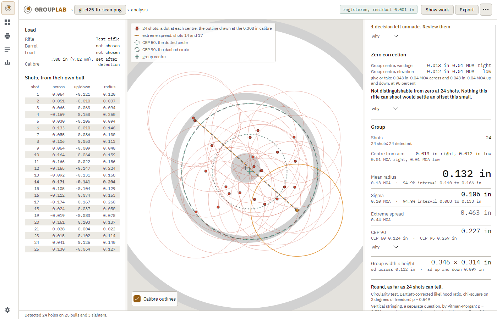
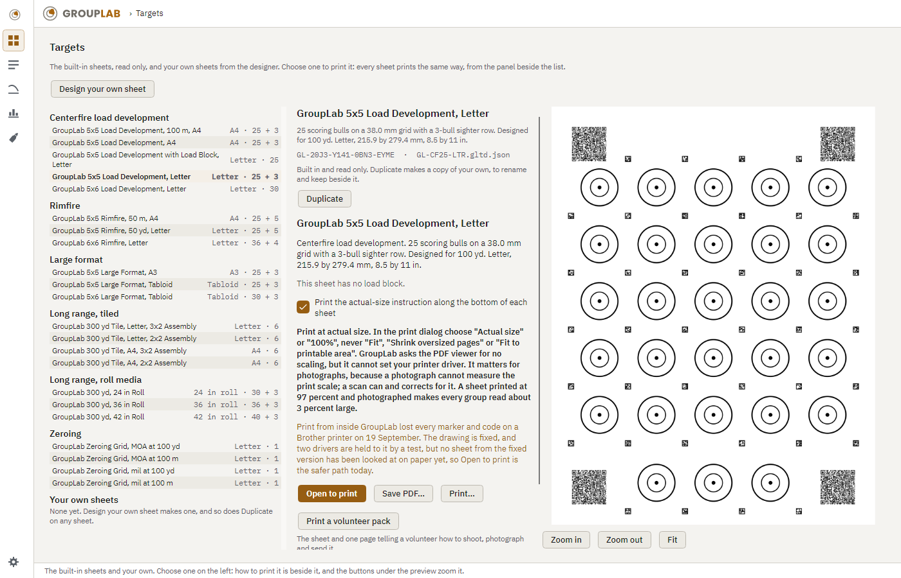
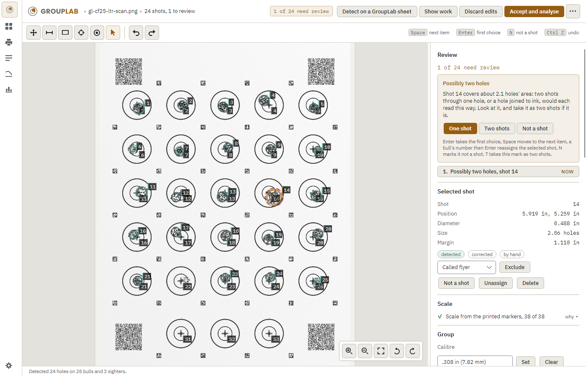
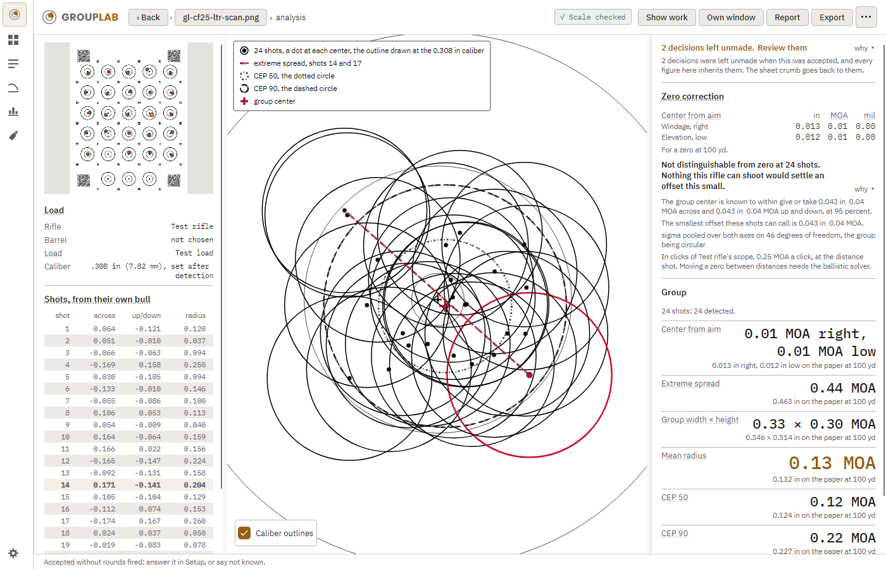
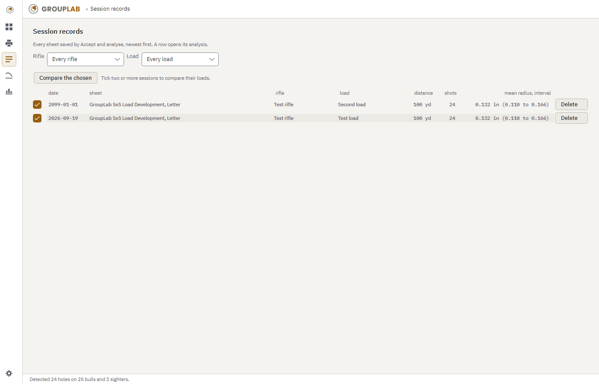
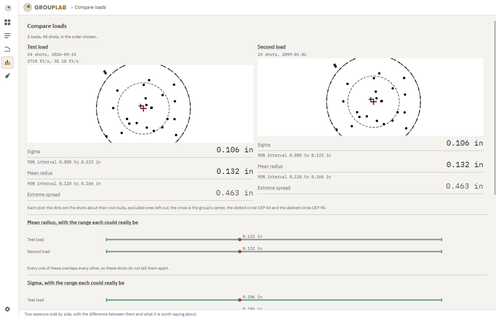
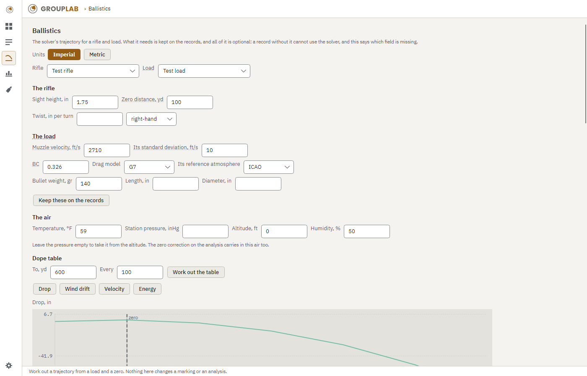
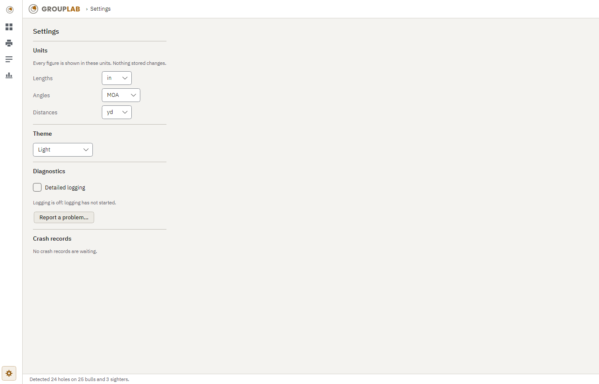

# What this project claims, and what backs it

Generated by `scripts/claims.py --extract`. Do not edit: edit `docs/claims-backing.json`, which is where
the backing is written down, and run it again.

NOTES-FROM-PLANNING.md entry 159. A claim is a sentence asserting something checkable: what the software
does, what it cannot do, a number, a measurement, a limit, a version, an address, a licence, a platform.
The site is read from `website/_site`, the built pages, because a sentence written inside `build.py` is
published exactly like one written in an article.

**code** names a file and a symbol. **measured** names where the measurement lives and when it was taken.
**decided** names the entry that decided it. **unbacked** means nothing was found, and that list is the
one that matters.

---

## The count

| backing | claims |
|---|---|
| code | 980 |
| measured | 1422 |
| decided | 1153 |
| unbacked | 0 |
| **total** | **3555** |

**531** of them were read one sentence at a time and their backing written against the sentence. The other **3024** are classified by a rule that says what their document is: a dated record, a specification the code implements, a generated page, or a research article backed by the evidence in its own front matter. A rule is not a reading, and a sentence a rule covers is only as checked as its document.

## The claims

### CLAUDE.md

- *decided* (working rules, each naming the NOTES-FROM-PLANNING.md entry that set it): Actioning an entry means four things, in the same commit as the work: 1.
- *decided* (working rules, each naming the NOTES-FROM-PLANNING.md entry that set it): ## Anything that needs Alan goes to a file, not to the panel **NOTES-FROM-PLANNING.md entry 149 section 5, and it replaces the earlier rule about handing him a numbered list in the panel.** Alan has said plainly that the panel is hard to read and that answering a question there is harder than answering it in the planning session.
- *decided* (working rules, each naming the NOTES-FROM-PLANNING.md entry that set it): ## Alan does not read the panel; the planning session reads the files NOTES-FROM-PLANNING.md entry 180.
- *decided* (working rules, each naming the NOTES-FROM-PLANNING.md entry that set it): **`docs/notes/panel.md`**, not committed (it is in `.gitignore`): every message put in the panel for Alan, newest first, with the time and the entry number, the last 50 kept.
- *decided* (working rules, each naming the NOTES-FROM-PLANNING.md entry that set it): **Entry 149 section 6 replaced the older five.** No request for Alan appears inside a report; those go in `docs/notes/for-alan.md`.
- *decided* (working rules, each naming the NOTES-FROM-PLANNING.md entry that set it): ## Waiting **Waiting for CI or a nightly is never a reason to end a turn.** NOTES-FROM-PLANNING.md entry 131 section 0, and it replaces the earlier rule about an hour.
- *decided* (working rules, each naming the NOTES-FROM-PLANNING.md entry that set it): **It publishes itself.** Entry 144 replaced entry 128 section 6: any push to `main` touching something the site is built from starts `website.yml` on its own, and about seven or eight minutes later the page is live.
- *decided* (working rules, each naming the NOTES-FROM-PLANNING.md entry that set it): **Every published sentence has its backing.** NOTES-FROM-PLANNING.md entry 159: `scripts/claims.py --check` fails CI when a checkable sentence on the site, in the README or in `docs/` has nothing behind it.
- *decided* (working rules, each naming the NOTES-FROM-PLANNING.md entry that set it): **The tour is words about pictures, so a picture changing is not enough.** Entry 146 section 4.4: the weekly screenshot job replaces the picture on its own, and nothing replaces the words.
- *decided* (working rules, each naming the NOTES-FROM-PLANNING.md entry that set it): **After a push that publishes**, I confirm within 20 minutes that the new commit is live in the `grouplab-site-build` meta tag, and record in the task's report what was published and why.
- *decided* (working rules, each naming the NOTES-FROM-PLANNING.md entry that set it): If the workflow fails, or the commit is not live after 30 minutes, I report it with the evidence rather than retrying blindly.
- *decided* (working rules, each naming the NOTES-FROM-PLANNING.md entry that set it): In short, as of 2026-09-24: - **Alan's own photographs and scans** may be used and published unless he names one as an exception (entry 171 section 6).
- *decided* (working rules, each naming the NOTES-FROM-PLANNING.md entry that set it): Alan, entry 190, 2026-09-24: "Anything from Unholy/TNA (same person) or another friend can be used for testing or publication unless I specify otherwise." - **The exception already named stays:** the friend's 2026-09-16 scan is never published.
- *decided* (working rules, each naming the NOTES-FROM-PLANNING.md entry that set it): **Error reports are the same.** NOTES-FROM-PLANNING.md entry 194: GroupLab sends them to grouplab.org, and the server turns them into issues in the private repository `oRAirwolf/grouplab-crash-reports`.
- *decided* (working rules, each naming the NOTES-FROM-PLANNING.md entry that set it): ## Release notes: say what changed, to a person who shoots NOTES-FROM-PLANNING.md entry 132 section 1.
- *decided* (working rules, each naming the NOTES-FROM-PLANNING.md entry that set it): Alan read the notes for a nightly and they told him nothing, because they were commit subjects: "Entry 130 item 3.3: doubt travels with the number".
- *decided* (working rules, each naming the NOTES-FROM-PLANNING.md entry that set it): **Every commit carries a `Release-note:` trailer**, entry 145 section 3.1, not only the ones a person notices.
- *decided* (working rules, each naming the NOTES-FROM-PLANNING.md entry that set it): **A commit that touches nothing that ships is not in an application's notes at all** (entry 168): tests, tooling, the website, the guides and the research are published by the site, which says when it changes.
- *decided* (working rules, each naming the NOTES-FROM-PLANNING.md entry that set it): **Five words, two headings, and that is deliberate.** Entry 149 section 1: the heading is what the reader sees, the kind is what the writer says.
- *decided* (working rules, each naming the NOTES-FROM-PLANNING.md entry that set it): Somebody marking a change `fixed` rather than `changed` is saying something true about it even though both land in the same place, and the words already written across 45 commits stay valid.
- *decided* (working rules, each naming the NOTES-FROM-PLANNING.md entry that set it): (Entry 130, 2b.2) Release-note-kind: fixed ``` ``` Release-note: For small calibres such as .22 LR, holes are no longer rejected as too small when you have entered the calibre.
- *decided* (working rules, each naming the NOTES-FROM-PLANNING.md entry that set it): (Entry 130, 2b.3) Release-note-kind: fixed ``` ``` Release-note: A blank sheet scanned on a flatbed can now use the scan's own resolution as its scale; GroupLab shows the number and you can refuse it.
- *decided* (working rules, each naming the NOTES-FROM-PLANNING.md entry that set it): (Entry 130, 4.1) Release-note-kind: new ``` ``` Release-note: The website's screenshots are now regenerated every week from the newest build, so what you see on grouplab.org is the version you would download.
- *decided* (working rules, each naming the NOTES-FROM-PLANNING.md entry that set it): (Entry 144, 4) Release-note-kind: internal ``` **No build lists nothing.** Entry 168 amended entry 145: a build whose commits touched nothing that ships should not exist, the gate in `scripts/shipping-gate.py` stops it, and the nine that were published before the gate was right say so in one line and name the build they behave like.
- *decided* (working rules, each naming the NOTES-FROM-PLANNING.md entry that set it): Entry 145's own words follow: Entry 145: six published builds said "Nothing in this build changes what you see or do.
- *decided* (working rules, each naming the NOTES-FROM-PLANNING.md entry that set it): One of those six carried the first measurement GroupLab has against 59 real photographs of a target on a board.
- *decided* (working rules, each naming the NOTES-FROM-PLANNING.md entry that set it): Entry 145 section 4 adds four more: no file path, no commit hash, no class or method name, nothing in code style.
- *decided* (working rules, each naming the NOTES-FROM-PLANNING.md entry that set it): **A note promises what a person can actually reach.** Nightly 27 told people GroupLab "now works out where your group actually landed before deciding which bull each shot belongs to".
- *decided* (working rules, each naming the NOTES-FROM-PLANNING.md entry that set it): NOTES-FROM-PLANNING.md entry 158 After any research, measurement or investigation, decide whether it is worth an article and record the decision either way, in `docs/RESEARCH.md` under "Worth an article?".
- *decided* (working rules, each naming the NOTES-FROM-PLANNING.md entry that set it): ## Tokens are the budget, NOTES-FROM-PLANNING.md entry 160 Alan: "I would like going forward is for cowork and code to be more efficient with tokens without sacrificing the quality of research or the application." Three log files weighed 2.1 MB between them and both sessions read some version of them most days, which is most of a day's allowance spent before a line of work happens.
- *decided* (working rules, each naming the NOTES-FROM-PLANNING.md entry that set it): **`docs/notes/STATE.md` is read first, by both sessions.** Under 120 lines, rewritten rather than appended at the end of every run, and a test holds it to that.
- *decided* (working rules, each naming the NOTES-FROM-PLANNING.md entry that set it): A test that reads only the live file is a test that quietly stops checking anything, and that has already happened here by a different route: the entry headings drifted from `##` to `#` at entry 119 and the two tests that read them had been skipping the thirty four newest entries with nothing going red.
- *decided* (working rules, each naming the NOTES-FROM-PLANNING.md entry that set it): **Pipe a command that will be noisy through something that reduces it**: `| tail -20`, `| wc -l`, `| grep -c`.
- *decided* (working rules, each naming the NOTES-FROM-PLANNING.md entry that set it): **Do not re-derive a measurement that is already written down.** Check entry 159's claims register before measuring something again.
- *decided* (working rules, each naming the NOTES-FROM-PLANNING.md entry that set it): ### The commands ordinary work needs Entry 160 section 6: Alan has been approving every command including ordinary git ones, which turns a one hour run into several hours of his attention and costs a round trip each time.
- *decided* (working rules, each naming the NOTES-FROM-PLANNING.md entry that set it): - **Ordinary git:** `git add`, `git commit`, `git rebase origin/main`, `git fetch`, `git push origin phase-1:main`, `git checkout --`, `git restore`.
- *decided* (working rules, each naming the NOTES-FROM-PLANNING.md entry that set it): ## Temporary files are made in one place and deleted when done NOTES-FROM-PLANNING.md entry 179.
- *decided* (working rules, each naming the NOTES-FROM-PLANNING.md entry that set it): Alan's temporary folder reached 18 GB: this session's scratchpad held fourteen copies of test build output, repository clones and downloaded release assets, and the suite had left 14,987 settings files and thousands of empty folders in `%TEMP%`.
- *decided* (working rules, each naming the NOTES-FROM-PLANNING.md entry that set it): - **No new build output folders.** Entry 132 section 2.1: about 10 GB of Alan's 11 GB repository folder was build output, nine copies of the same test build in `Debug`, `Release` and `alt` to `alt7`.
- *decided* (working rules, each naming the NOTES-FROM-PLANNING.md entry that set it): Entry 128 moved the site into this repository; that folder is now a record of how it was first set up.
- *decided* (working rules, each naming the NOTES-FROM-PLANNING.md entry that set it): Entry 178: request 1's own instructions did it to pissinhot.com.
- *decided* (working rules, each naming the NOTES-FROM-PLANNING.md entry that set it): - **A sample over about 10 MB is never committed.** Entry 171 section 6: it is attached to the `test-data` release, listed with its SHA-256 in `tests/test-data.json`, and fetched and checked by CI.

### CONTRIBUTING.md

- *decided* (working rules, each naming the NOTES-FROM-PLANNING.md entry that set it): ## Building and testing You need: - **Windows x64.** The desktop imaging backend uses `OpenCvSharp4.runtime.win`.
- *decided* (working rules, each naming the NOTES-FROM-PLANNING.md entry that set it): - **The .NET 10 SDK.** Phase 0a was built with 10.0.401.
- *decided* (working rules, each naming the NOTES-FROM-PLANNING.md entry that set it): - **Python 3**, for the reference tools under `tools/`.
- *decided* (working rules, each naming the NOTES-FROM-PLANNING.md entry that set it): That plausible, wrong number had survived: - 709 passing tests; - a statistics engine matched against 45,476 reference keys; - a hole detector measured on real scans.
- *decided* (working rules, each naming the NOTES-FROM-PLANNING.md entry that set it): - **Source:** NOTES-FROM-PLANNING.md entry 35 section 5.
- *decided* (working rules, each naming the NOTES-FROM-PLANNING.md entry that set it): **Where the application's log is** (NOTES-FROM-PLANNING.md entry 41 sections 3 and 4).
- *decided* (working rules, each naming the NOTES-FROM-PLANNING.md entry that set it): - **A Release build:** `%LOCALAPPDATA%\GroupLab\logs` on Windows, `~/Library/Logs/GroupLab` on macOS, and `$XDG_STATE_HOME/grouplab/logs` or `~/.local/state/grouplab/logs` on Linux.
- *decided* (working rules, each naming the NOTES-FROM-PLANNING.md entry that set it): The expected result is 22 definitions, 0 errors, and 4 warnings: the narrow marker bands on GL-ZERO-MOA-100Y and GL-ZERO-MIL-100M.
- *decided* (working rules, each naming the NOTES-FROM-PLANNING.md entry that set it): - **`selftest`** runs conformance test 43 on every page of every built-in sheet, without a PDF engine, and prints the bull error and registration residual for each.
- *decided* (working rules, each naming the NOTES-FROM-PLANNING.md entry that set it): - **`run.py`** must end with `16 multi-bull layouts, 4 zeroing sheets, 0 failing`.
- *decided* (working rules, each naming the NOTES-FROM-PLANNING.md entry that set it): **A specification disagreement is reported, not worked around.** If a document contradicts itself, contradicts a tool, or cannot be implemented as written: 1.
- *decided* (working rules, each naming the NOTES-FROM-PLANNING.md entry that set it): - **Determinism.** Rendering the same definition twice must give identical bytes (conformance test 38): no timestamps and no unordered iteration.
- *decided* (working rules, each naming the NOTES-FROM-PLANNING.md entry that set it): - **The README is part of done.** A commit that makes a statement in `README.md` false updates that statement in the same commit, not the next one (NOTES-FROM-PLANNING.md entry 50 section 1).
- *decided* (working rules, each naming the NOTES-FROM-PLANNING.md entry that set it): - **Why:** the README said for days that only Windows builds, after CI had built and tested all three platforms (entry 49 section 4).
- *decided* (working rules, each naming the NOTES-FROM-PLANNING.md entry that set it): - **Why:** the 2026-09-14 rewrite changed 42 ids and left nine citations pointing at commits that no longer exist.
- *decided* (working rules, each naming the NOTES-FROM-PLANNING.md entry that set it): - **If you must cite one:** keep the old id visible after a rewrite, as "`new` (was `old` before the 2026-09-14 rewrite)".
- *decided* (working rules, each naming the NOTES-FROM-PLANNING.md entry that set it): - **A report never prints a number it cannot mean.** Whenever the figures cannot measure what a reader takes them to measure, `GroupAnalysis` withholds them and says what is missing where they would be, rather than printing a confident figure with an interval beside it.
- *decided* (working rules, each naming the NOTES-FROM-PLANNING.md entry that set it): - **The cases so far:** too few shots (NOTES-FROM-PLANNING.md entry 24), and shots on a sheet of several bulls that are not all assigned to one (entry 39).
- *decided* (working rules, each naming the NOTES-FROM-PLANNING.md entry that set it): - **What that means:** no mark is drawn in white, and every stroke and label is drawn over a dark outline (entry 39 section 5).
- *decided* (working rules, each naming the NOTES-FROM-PLANNING.md entry that set it): - **The check:** `ThemeTests` fails on a colour literal anywhere else in the application (entry 42).
- *decided* (working rules, each naming the NOTES-FROM-PLANNING.md entry that set it): - **`phase-1`** is kept until Phase 1 formally closes.
- *decided* (working rules, each naming the NOTES-FROM-PLANNING.md entry that set it): - **`phase-0` and `phase-0a`** are closed phases, kept as history.
- *decided* (working rules, each naming the NOTES-FROM-PLANNING.md entry that set it): - **When Phase 1 closes,** `phase-1` is retired rather than carried alongside `main`.
- *decided* (working rules, each naming the NOTES-FROM-PLANNING.md entry that set it): ## Long-running steps **A job that will outlast the turn ends the turn** (NOTES-FROM-PLANNING.md entry 79 section 2, replacing the earlier rule of waiting in the turn).
- *decided* (working rules, each naming the NOTES-FROM-PLANNING.md entry that set it): - **Why:** two writers rewriting one file collided once (NOTES-FROM-PLANNING.md entry 44).
- *decided* (working rules, each naming the NOTES-FROM-PLANNING.md entry that set it): Do not use it for anything you can settle by measurement, and do not use it to ask permission for work the brief already authorises.

### DESIGN.md

- *decided* (the design as decided, section by section, in NOTES-FROM-PLANNING.md): # GroupLab Design Document **Working name.** GroupLab is provisional and may change before public release.
- *decided* (the design as decided, section by section, in NOTES-FROM-PLANNING.md): Repository names and code namespaces are cheap to rename; Android package IDs and iOS bundle IDs are permanent once published, so those are deliberately deferred to Phase 6 of the build plan.
- *decided* (the design as decided, section by section, in NOTES-FROM-PLANNING.md): **Status.** Design draft, **revision 3**.
- *decided* (the design as decided, section by section, in NOTES-FROM-PLANNING.md): **Author.** Alan Hayes **What changed in revision 3.** Seven planning documents were produced against revision 2, and several of them measured things this document had assumed.
- *decided* (the design as decided, section by section, in NOTES-FROM-PLANNING.md): Where they disagree, they win, and revision 3 folds their conclusions back in.
- *decided* (the design as decided, section by section, in NOTES-FROM-PLANNING.md): The corrections are marked **[r3]** throughout so a reader of revision 2 can find them.
- *decided* (the design as decided, section by section, in NOTES-FROM-PLANNING.md): | Document | Implements | Settles | |---|---|---| | `docs/PATENT-SEARCH.md` | open item 1 | Prior art on machine-readable targets.
- *decided* (the design as decided, section by section, in NOTES-FROM-PLANNING.md): Purpose GroupLab measures how accurately a rifle shoots, and reports the result with the statistical honesty the measurement deserves.
- *decided* (the design as decided, section by section, in NOTES-FROM-PLANNING.md): A tight five-shot group at 100 yards may print as a single ragged opening, and no software can recover five coordinates from it.
- *decided* (the design as decided, section by section, in NOTES-FROM-PLANNING.md): Scope ### In scope **[r7] Every bullet names the phase or phases of section 21 that build it, or is marked deferred and says where the reason is recorded.** A promise with neither is a bug in the plan: `docs/NOTES-FROM-PLANNING.md` entry 90 found ten of them sitting in scope with no phase behind them, and a reader could not tell a deliberate omission from a forgotten promise.
- *decided* (the design as decided, section by section, in NOTES-FROM-PLANNING.md): - Generating printable targets with embedded registration markers, in a built-in library (Phase 0a for the format, the sheets and the renderer; Phase 4 for the library screen) and through a parametric editor (Phase 4).
- *decided* (the design as decided, section by section, in NOTES-FROM-PLANNING.md): **The full visual designer is deferred**, with the reason in `docs/NOTES-FROM-PLANNING.md` entry 99 section 3: every one of the twenty-two built-in sheets is parametric, so a form covers the space, and a canvas for arbitrarily placed bulls is a large screen for a case nobody has asked for; it is revisited when somebody asks for a layout the form cannot express.
- *decided* (the design as decided, section by section, in NOTES-FROM-PLANNING.md): **[r9]** Assisted placement in that mode is the snap, entry 103 section 4: a rough click lands on the dark centroid within a calibre-sized reach, with no definition needed (Phase 3, built).
- *decided* (the design as decided, section by section, in NOTES-FROM-PLANNING.md): GroupLab does not copy its designs, formats, or terminology.
- *decided* (the design as decided, section by section, in NOTES-FROM-PLANNING.md): **shotGroups**, an R package by Daniel Wollschlaeger, published on CRAN under an open licence.
- *decided* (the design as decided, section by section, in NOTES-FROM-PLANNING.md): **[r3]** Three of them were wrong, and the corrections below come from `docs/SCAN-MEASUREMENTS.md`, which measured 343 holes across 15 files rather than eyeballing a handful.
- *decided* (the design as decided, section by section, in NOTES-FROM-PLANNING.md): **Scan geometry.** Sample scans were 4958 by 6458 pixels tagged at 600 DPI.
- *decided* (the design as decided, section by section, in NOTES-FROM-PLANNING.md): That resolves to 8.263 by 10.763 inches, which is not US Letter.
- *decided* (the design as decided, section by section, in NOTES-FROM-PLANNING.md): Any software assuming the image spans 8.5 by 11 inches would be roughly three percent wrong immediately.
- *decided* (the design as decided, section by section, in NOTES-FROM-PLANNING.md): **DPI metadata honesty.** On the same scans, the detected bull grid measured 1.4992 inches against a 1.5 inch nominal spacing, an error of 0.05 percent.
- *decided* (the design as decided, section by section, in NOTES-FROM-PLANNING.md): **Bull detection is easy.** A naive connected-component approach located 24 of 25 bulls on a sample target.
- *decided* (the design as decided, section by section, in NOTES-FROM-PLANNING.md): **Hole detection is hard.** Two standard approaches, a filled-contour method and a gradient-energy method, returned 6 of 25 and 7 of 20 respectively.
- *decided* (the design as decided, section by section, in NOTES-FROM-PLANNING.md): **[r3]** A properly tuned Hough circle detector does far better, 26 of 27, but only when tuned per image, which is the finding that forced the Phase 1 gate to be rewritten in section 21.
- *decided* (the design as decided, section by section, in NOTES-FROM-PLANNING.md): This is the central technical risk of the project and the direct justification for the render-and-difference strategy in section 12.
- *decided* (the design as decided, section by section, in NOTES-FROM-PLANNING.md): [r3] The bright core is not real, and this document was wrong about it.** Measured across 343 holes, the core of a hole averages **53 grey levels darker than the surrounding paper**, and 24 percent of cores never reach local paper level at all.
- *decided* (the design as decided, section by section, in NOTES-FROM-PLANNING.md): **[r3] Radial symmetry is an actively harmful test.** Rim radius coefficient of variation is 0.48 across the corpus.
- *decided* (the design as decided, section by section, in NOTES-FROM-PLANNING.md): **[r3] Scale is the primary discriminator, not intensity and not colour.** Every printed feature in the corpus is at most 0.0567 inches wide; every hole is 0.15 to 0.54 inches across.
- *decided* (the design as decided, section by section, in NOTES-FROM-PLANNING.md): **[r3] Paper is a developable surface, and the crumpled target is barely warped.** On the worst sheet in the set, crumpled, torn along two edges, taped and non-rectangular, a plain four-point homography leaves a residual of rms 0.0027 inches.
- *decided* (the design as decided, section by section, in NOTES-FROM-PLANNING.md): Four pristine sheets measured 0.0026 to 0.0032 in.
- *decided* (the design as decided, section by section, in NOTES-FROM-PLANNING.md): This changes the justification for the marker count in section 9.
- *decided* (the design as decided, section by section, in NOTES-FROM-PLANNING.md): **[r3] Sample attribution corrected.** The `n568*` targets are .264, 6.5 mm, with the primer as the only variable, not the .338 class this document and `SAMPLE-NOTES.md` originally recorded.
- *decided* (the design as decided, section by section, in NOTES-FROM-PLANNING.md): One target was crumpled, torn along two edges, taped, non-rectangular, and scanned at 300 DPI.
- *decided* (the design as decided, section by section, in NOTES-FROM-PLANNING.md): **[r3] Specified in full as GLTD 1.0 in `docs/TARGET-SCHEMA.md`**, as a JSON document plus a lossless compact binary encoding for the QR payload.
- *decided* (the design as decided, section by section, in NOTES-FROM-PLANNING.md): **[r3] Rings are disc stacks, and this is a correctness matter rather than a drawing convention.** A stroked circle of diameter D and width W has three legitimate ink extents depending on whether the stroke sits inside, centred or outside, and for a 25.4 mm ring those differ by 0.0157 inches.
- *decided* (the design as decided, section by section, in NOTES-FROM-PLANNING.md): The Phase 0 registration gate is 0.001 inches.
- *decided* (the design as decided, section by section, in NOTES-FROM-PLANNING.md): **[r3] The family is AprilTag `tag36h11`**, printed at a 0.5 mm module giving a 4.0 mm marker with a 1.0 mm quiet zone, so a 6.0 mm footprint.
- *decided* (the design as decided, section by section, in NOTES-FROM-PLANNING.md): Eight by eight modules including the mandatory border, 587 identifiers, minimum Hamming distance 11, correction capped at 5 bits.
- *decided* (the design as decided, section by section, in NOTES-FROM-PLANNING.md): `docs/FIDUCIAL-DECISION.md` has the comparison; the reason it is AprilTag rather than ArUco is that `tag36h11` is the only strong family that **both** OpenCV and the BSD-2-Clause AprilTag reference implementation can read, which removes the licence problem recorded in section 20 from the critical path.
- *decided* (the design as decided, section by section, in NOTES-FROM-PLANNING.md): The first half does not survive contact with the data: four corners meet the Phase 0 gate on the worst sheet in the collection, because paper bends without stretching and a homography absorbs it.
- *decided* (the design as decided, section by section, in NOTES-FROM-PLANNING.md): The layout validator places **34 markers** on the reference Letter sheet and 32 to 56 across the library.
- *decided* (the design as decided, section by section, in NOTES-FROM-PLANNING.md): **[r3] Three placement rules exist**, versioned in their names so that improving one cannot reinterpret a target already printed and shot: `grid-boundary-1` for ordinary pitches, `grid-boundary-half-1` for coarse-pitch long-range sheets where the plain lattice degenerates to two surviving markers, and `field-ring-1` for zeroing sheets, which have one bull and therefore no useful bull lattice.
- *decided* (the design as decided, section by section, in NOTES-FROM-PLANNING.md): **[r3] Two shape gates run before the code check.** Measured against the real scan corpus, every false marker a deliberately permissive detector found was a sliver of a printed ring arc: worst side ratio 4.57 and largest area 1366 square pixels against a real marker's 8928 at 600 DPI.
- *decided* (the design as decided, section by section, in NOTES-FROM-PLANNING.md): Rejecting candidates below half the expected area, or above a side ratio of 2.0, kills all of them without reference to the dictionary.
- *decided* (the design as decided, section by section, in NOTES-FROM-PLANNING.md): **[r3] The false-positive rate against real printed target artwork is zero.** Sixteen scans, nine dictionaries, 665 quadrilateral candidates found and rejected per dictionary, no accepted markers at default detector parameters.
- *decided* (the design as decided, section by section, in NOTES-FROM-PLANNING.md): **[r3] Four QR codes sit in the four corners at version 10, error correction level H.** That is 119 bytes of capacity in a 26.0 mm footprint at a 0.4 mm module.
- *decided* (the design as decided, section by section, in NOTES-FROM-PLANNING.md): A parametric target is **55 to 70 bytes of body**, 70 to 85 including the frame header, against this document's estimate of 100 to 200.
- *decided* (the design as decided, section by section, in NOTES-FROM-PLANNING.md): Crucially the size does not scale with bull count, because parametric mode stores a grid rather than a bull list: the 25-bull reference sheet and the 36-bull rimfire sheet both encode to 55 bytes.
- *decided* (the design as decided, section by section, in NOTES-FROM-PLANNING.md): A fully custom target with forty arbitrarily placed bulls lands at roughly 215 bytes, inside the under-500 estimate.
- *decided* (the design as decided, section by section, in NOTES-FROM-PLANNING.md): A version 40 QR code holds 1,273 bytes at error correction level H, so the worst case uses 6.7 percent of one.
- *decided* (the design as decided, section by section, in NOTES-FROM-PLANNING.md): **[r3] The area estimate in this document was wrong.** Section 9 said four codes cost "about 1.5 square inches out of 93", which implies a 0.32 mm module, or 3.7 printer dots at 300 DPI.
- *decided* (the design as decided, section by section, in NOTES-FROM-PLANNING.md): The honest figure at a 0.4 mm module and version 10 is **4.2 square inches for the codes**, and 6.1 to 7.3 square inches for codes and markers together, which is six to eight percent of a Letter page and under one percent on roll media.
- *decided* (the design as decided, section by section, in NOTES-FROM-PLANNING.md): It is the SHA-256 of the canonical binary body truncated to 80 bits and rendered in Crockford base-32, which costs nothing in the payload because the reader computes it from what it decoded.
- *decided* (the design as decided, section by section, in NOTES-FROM-PLANNING.md): They travel instead in an instance code with its own magic bytes, version 11 at level Q, which cannot be confused with a definition frame.
- *decided* (the design as decided, section by section, in NOTES-FROM-PLANNING.md): The correct behaviour is not to silently correct it but to say so: this target printed at 96.2 percent of intended size, measurements corrected accordingly.
- *decided* (the design as decided, section by section, in NOTES-FROM-PLANNING.md): ### The built-in library [r3] Twenty sheets ship, all geometry-validated, specified in `docs/TARGET-LIBRARY.md`: five centrefire load-development layouts, three rimfire, three large-format, two long-range tiles, three plotter-roll sheets at 24, 36 and 42 inch widths, and four zeroing sheets.
- *decided* (the design as decided, section by section, in NOTES-FROM-PLANNING.md): The design criterion is a half-pitch of about 0.75 MOA at the sheet's intended distance.
- *decided* (the design as decided, section by section, in NOTES-FROM-PLANNING.md): **That criterion has a geometric ceiling, and it is worth stating plainly.** Twenty-five bulls at the full criterion is achievable to about 137 yards on Tabloid and 103 on Letter.
- *decided* (the design as decided, section by section, in NOTES-FROM-PLANNING.md): Past 200 yards the answer is **tiled multi-page targets or plotter roll media**, not a denser sheet.
- *decided* (the design as decided, section by section, in NOTES-FROM-PLANNING.md): **Zeroing sheets are the documented exception to the 25-bull rule**, because a zeroing sheet answers a different question: where the group centre sits relative to the aiming point, which needs one aiming mark and a printed angular grid, not twenty-five bulls.
- *decided* (the design as decided, section by section, in NOTES-FROM-PLANNING.md): Four ship, covering MOA and mil at 100 yards and 100 metres, since a turret is calibrated in one and a range is marked in the other and the four combinations do not convert by scaling a printed grid.
- *decided* (the design as decided, section by section, in NOTES-FROM-PLANNING.md): Includes Ultra HDR and ISO 21496-1 gain-map JPEGs from Android, which decode as ordinary JPEGs | | PNG | iPhone screenshots and Markup exports | | HEIC / HEIF | iPhone default since iOS 11, including HEIF Max; increasingly present on mid-range and premium Android devices | | AVIF | Android and sharing pipelines.
- *decided* (the design as decided, section by section, in NOTES-FROM-PLANNING.md): HEIC and JPEG XL decoding both require explicit dependency decisions on Windows, since neither ships enabled by default and HEIC carries patent considerations.
- *decided* (the design as decided, section by section, in NOTES-FROM-PLANNING.md): **Scanner acquisition** through WIA 2.0 for USB devices and eSCL over HTTP for network devices.
- *decided* (the design as decided, section by section, in NOTES-FROM-PLANNING.md): **Photographs against their scan** (entry 113 section 4).
- *decided* (the design as decided, section by section, in NOTES-FROM-PLANNING.md): Holes are paired nearest first within 0.15 in.
- *decided* (the design as decided, section by section, in NOTES-FROM-PLANNING.md): Each photograph's row gives the registration model, the bull-centre error worst and median, holes found, missed and false, and the hole-position error median, 95th percentile and worst.
- *decided* (the design as decided, section by section, in NOTES-FROM-PLANNING.md): The table is read against 0.005 in and 0.15 in and decides neither gate.
- *decided* (the design as decided, section by section, in NOTES-FROM-PLANNING.md): **[r3]** Measured across 260 holes of known caliber, the ratio of hull diameter to bullet diameter is 0.919 for 6.5 mm, 0.920 for .308 and 0.981 for .338, with a mean deficit of 0.0202 inches and a standard deviation of 0.0509.
- *decided* (the design as decided, section by section, in NOTES-FROM-PLANNING.md): That standard deviation is two and a half times the twenty-thousandths that separates .264 from .284, so **distinguishing those two is not reliable and the application must not pretend otherwise**; distinguishing .224 from .338 is trivial.
- *decided* (the design as decided, section by section, in NOTES-FROM-PLANNING.md): **[r3] Ovality was attempted as a yaw signature and the measurement failed.** Two ellipse-fitting passes produced aspect-ratio standard deviations of 0.32 to 1.64, larger than the effect being sought.
- *decided* (the design as decided, section by section, in NOTES-FROM-PLANNING.md): The question is open and is a Phase 1 task; it is recorded here as a failure rather than omitted, because an unrecorded failed measurement gets attempted again.
- *decided* (the design as decided, section by section, in NOTES-FROM-PLANNING.md): Measured, nearest-bull is correct on every cross-cell shot in the corpus except one, where a hole 0.627 inches from bull 4 belongs to bull 9 at 1.043 inches because bull 4 already has a closer shot.
- *decided* (the design as decided, section by section, in NOTES-FROM-PLANNING.md): **The sheet a person chose is not always the sheet in the picture** (entry 115 section 4).
- *decided* (the design as decided, section by section, in NOTES-FROM-PLANNING.md): Markers of the same family register against another sheet's definition and then measure the wrong bulls: a 5x5 read as a 5x6 fits its markers to 1.63 dmm where its own sheet fits to 0.14, a 5x5 read as an A4 5x5 finds 17 of its 28 bulls and 15 holes, and a 5x5 read as a zeroing grid sees 14 markers that grid does not have.
- *decided* (the design as decided, section by section, in NOTES-FROM-PLANNING.md): **[r3] The method is only valid when the counts match, and that is a measured failure rather than a caveat.** On a file with 27 detections for 25 bulls, forcing a matching manufactures a false cross-cell result.
- *decided* (the design as decided, section by section, in NOTES-FROM-PLANNING.md): Forcing produces confident wrong answers, which section 2 says the software must never do.
- *decided* (the design as decided, section by section, in NOTES-FROM-PLANNING.md): **A sheet that breaks one shot a bull on purpose says so** (entry 113 section 4).
- *decided* (the design as decided, section by section, in NOTES-FROM-PLANNING.md): The doubles sheet puts two shots into each of bulls 1 to 10 and none into 11 to 25, so one-to-one matching pushes each second shot onto an empty neighbour, and the review queue raises every one.
- *decided* (the design as decided, section by section, in NOTES-FROM-PLANNING.md): **[r3] A margin under about 0.15 inches between nearest and second-nearest bull is a review-queue item by construction**, because a 0.05 inch registration error would flip it.
- *decided* (the design as decided, section by section, in NOTES-FROM-PLANNING.md): **Amended 2026-09-16, `docs/NOTES-FROM-PLANNING.md` entry 70 section 3: matching reruns as the person edits, and a person's decision is a constraint rather than an input.** Never rerunning leaves an answer computed for a different set of shots the moment one is added, moved or deleted.
- *decided* (the design as decided, section by section, in NOTES-FROM-PLANNING.md): **Amended by entry 74 section 1:** placing a hole says there is a hole there, not which bull it belongs to, so a hole added by hand whose bull the software picked is matched like a detection.
- *decided* (the design as decided, section by section, in NOTES-FROM-PLANNING.md): - **Sighter and scoring bulls are two pools, entry 73 section 1.** A shot fired at a sighter can never belong to a scoring bull, nor the reverse, so each shot joins the pool of its nearest bull and the counts rule above applies in each pool on its own.
- *decided* (the design as decided, section by section, in NOTES-FROM-PLANNING.md): **A known limit, entry 74 section 2: the assignment detail does not survive a save.** A marking file keeps each shot's bull and whether a person chose it, but not the sheet's page mapping, so a reopened marking has no margins, alternatives or reasons until detection runs again, and its review queue is empty for that reason rather than because nothing needs review.
- *decided* (the design as decided, section by section, in NOTES-FROM-PLANNING.md): The two are kept apart on purpose: registration and printing error are a few thousandths of an inch against a 0.15 inch margin, so the choice cannot flip an assignment that was not already flagged, and the shooter aimed at the bull as printed.
- *decided* (the design as decided, section by section, in NOTES-FROM-PLANNING.md): **[r9] Sighters are ignored unless a person asks for them, by choice** (`docs/NOTES-FROM-PLANNING.md` entry 105 section 8).
- *decided* (the design as decided, section by section, in NOTES-FROM-PLANNING.md): **[r10] The calibre is a bullet diameter and nothing else, by Alan's decision** (`docs/NOTES-FROM-PLANNING.md` entry 107 section 1).
- *decided* (the design as decided, section by section, in NOTES-FROM-PLANNING.md): This reverses entries 105 and 106, which read names through a table: every defect they fixed came from reading a name as a diameter, and every name the table did not know still fell back to a guess.
- *decided* (the design as decided, section by section, in NOTES-FROM-PLANNING.md): A calibre's designation typed as a number, such as ".38", ".270", "9mm" or "7.62 mm", is refused too (entry 108), from a short list of numbers that only refuse and are never read; the designations that are also real diameters, .40, .41, .50, 9.3 mm and 12.7 mm, are left off it, and a test holds the list apart from the pick list.
- *decided* (the design as decided, section by section, in NOTES-FROM-PLANNING.md): Statistics ### Baseline Extreme spread, mean radius, group width and height, offset from point of aim, standard deviation in x and y, standard deviation of radius, and CEP at 50, 90, and 95 percent.
- *decided* (the design as decided, section by section, in NOTES-FROM-PLANNING.md): **Sample sizes are larger than anyone expects.** To resolve a ten percent difference between two loads at conventional power requires **434 shots per load**.
- *decided* (the design as decided, section by section, in NOTES-FROM-PLANNING.md): Twenty-five percent requires 81.
- *decided* (the design as decided, section by section, in NOTES-FROM-PLANNING.md): Fifty percent requires 26.
- *decided* (the design as decided, section by section, in NOTES-FROM-PLANNING.md): At n=25 the expected maximum radius is 2.176 times the mean radius, and the probability that the worst shot exceeds twice the mean radius is 0.669.
- *decided* (the design as decided, section by section, in NOTES-FROM-PLANNING.md): Two thirds of honest 25-shot groups contain a shot that looks like a flyer and is not.
- *decided* (the design as decided, section by section, in NOTES-FROM-PLANNING.md): True MOA is the default, at 1.047 inches per 100 yards, with IPHY available.
- *decided* (the design as decided, section by section, in NOTES-FROM-PLANNING.md): Both are measured, and recorded as a known source of uncertainty, in `docs/STATISTICS.md` section 2 (`docs/NOTES-FROM-PLANNING.md` entry 52 section 4).
- *decided* (the design as decided, section by section, in NOTES-FROM-PLANNING.md): **[r9] Sighters are never pooled with the scoring shots** (entry 73 section 1), in either mode of section 13.
- *decided* (the design as decided, section by section, in NOTES-FROM-PLANNING.md): Chronograph strings and their shot mapping have their own tables now, though import waits for Phase 5.
- *decided* (the design as decided, section by section, in NOTES-FROM-PLANNING.md): **[r11] The port, and what it did not take** (`docs/NOTES-FROM-PLANNING.md` entry 110 section 2).
- *decided* (the design as decided, section by section, in NOTES-FROM-PLANNING.md): **The port corrects ballistics.js in five places, on purpose** (entry 111 section 2).
- *decided* (the design as decided, section by section, in NOTES-FROM-PLANNING.md): A later reader should not restore the JavaScript's behaviour thinking the port drifted from its source: 1.
- *decided* (the design as decided, section by section, in NOTES-FROM-PLANNING.md): **The G1 table.** The JavaScript's is not the standard G1 function above Mach 0.85.
- *decided* (the design as decided, section by section, in NOTES-FROM-PLANNING.md): The port carries the standard G1 and G7 functions, the values two independent transcriptions agree on (`docs/BALLISTICS-VALIDATION.md` section 3).
- *decided* (the design as decided, section by section, in NOTES-FROM-PLANNING.md): **On screen** (entry 112 section 4).
- *decided* (the design as decided, section by section, in NOTES-FROM-PLANNING.md): The Ballistics screen gives a dope table from them, range, drop and a 10 mph crosswind's wind in the display units and the scope's clicks, with the air as an input and "Aerodynamic jump is not modelled" beside it.
- *decided* (the design as decided, section by section, in NOTES-FROM-PLANNING.md): **Hit probability at distance and distance normalisation** (entry 113 section 3).
- *decided* (the design as decided, section by section, in NOTES-FROM-PLANNING.md): Chronograph integration **Entered by hand first** (entry 115 section 3).
- *decided* (the design as decided, section by section, in NOTES-FROM-PLANNING.md): A string of velocities is pasted or typed for a session, and reconciled with the shots as section 15 requires: the in-order pairing is a proposal a person accepts, a reading that belongs to no shot is marked and left out, a shot the chronograph missed is marked and the rest pair in order, and nothing downstream assumes a shot has a velocity.
- *decided* (the design as decided, section by section, in NOTES-FROM-PLANNING.md): What is accepted is kept on the session with its mapping, and the readings' own standard deviation becomes the load's velocity SD, carrying a note of where it came from, which is what the hit probability of section 3 takes as an input.
- *decided* (the design as decided, section by section, in NOTES-FROM-PLANNING.md): Other imports worth building: - GRT load files, which already carry powder, charge, bullet, and predicted velocity, and which would populate a load record without retyping - Kestrel or similar for environmental conditions - Generic CSV, since most users migrating to GroupLab will arrive from a spreadsheet ## 18.
- *decided* (the design as decided, section by section, in NOTES-FROM-PLANNING.md): Storage and synchronization ### The size problem A fully analysed target expressed as pure geometry is approximately 5 KB of JSON, or 1.5 KB compressed.
- *decided* (the design as decided, section by section, in NOTES-FROM-PLANNING.md): A 600 DPI colour scan of the same target is approximately 25 MB.
- *decided* (the design as decided, section by section, in NOTES-FROM-PLANNING.md): | Population | Geometry per year | Images per year | |---|---|---| | 1 active user, 200 targets | 1 MB | 5 GB | | 100 active users | 100 MB | 500 GB | | 10,000 active users | 10 GB | 50 TB | Geometry is free at any plausible scale.
- *decided* (the design as decided, section by section, in NOTES-FROM-PLANNING.md): **Proof image**, roughly 400 KB at 150 DPI, synchronised by default, sufficient for eyeballing and audit.
- *decided* (the design as decided, section by section, in NOTES-FROM-PLANNING.md): In the Windows application today, the geometry is the saved marking, which carries the sheet's registration as numbers so a session reopens with its scale and plot and no image at all; the proof image is a JPEG at 150 dpi, or 1650 pixels on the long side for an image with no scale, kept in the database; and the original is recorded by its path and its SHA-256, never copied.
- *decided* (the design as decided, section by section, in NOTES-FROM-PLANNING.md): Free tiers of 15 GB, 5 GB, and 5 GB respectively hold hundreds of full scans and effectively unlimited geometry.
- *decided* (the design as decided, section by section, in NOTES-FROM-PLANNING.md): Sign in with Apple is standard OIDC and works on Windows and Android as well as Apple devices, so it is available everywhere.
- *decided* (the design as decided, section by section, in NOTES-FROM-PLANNING.md): iCloud Drive, by contrast, has no supported third-party API on Windows or Android, so Apple can serve as an identity provider on every platform but as a storage backend only on Apple hardware.
- *decided* (the design as decided, section by section, in NOTES-FROM-PLANNING.md): **The analysis screen's last parts and the comparison** (entry 113 sections 1 and 2).
- *decided* (the design as decided, section by section, in NOTES-FROM-PLANNING.md): It is drawn from the definition, as section 18's archived view is, with every shot at its bull's centre plus its offset, and a click on a bull selects the shots on it.
- *decided* (the design as decided, section by section, in NOTES-FROM-PLANNING.md): That gives three things from one contract: a stage timeline the user can scrub, with clicking a rejection highlighting it on the image; a live run where each stage's artefact appears as it lands, so the markers light up, the residual map settles, the artwork vanishes and the holes emerge; and a console form that gives the Phase 0 and Phase 1 spikes their output for free before any UI exists.
- *decided* (the design as decided, section by section, in NOTES-FROM-PLANNING.md): **[r7] The contract is built and the screen is Phase 4.** Every stage already emits its record, and the console form of it gave the Phase 0 and Phase 1 spikes their output as intended.
- *decided* (the design as decided, section by section, in NOTES-FROM-PLANNING.md): The scrubbable timeline, the artefacts appearing as they land and the rejection clicked to highlight it on the image are the Phase 4 half, and they are now listed there rather than left implied by the contract underneath them, which is how a headline feature becomes an internal diagnostic by default (`docs/NOTES-FROM-PLANNING.md` entry 90 section 2).
- *decided* (the design as decided, section by section, in NOTES-FROM-PLANNING.md): Platform, stack, and distribution **Stack.** .NET 10 with Avalonia.
- *decided* (the design as decided, section by section, in NOTES-FROM-PLANNING.md): Windows ships as a single self-contained executable with no runtime for the user to install, which matters because the audience is shooters rather than developers.
- *decided* (the design as decided, section by section, in NOTES-FROM-PLANNING.md): **Windows floor.** Windows 10 21H2.
- *decided* (the design as decided, section by section, in NOTES-FROM-PLANNING.md): Avalonia renders through Skia rather than Windows 11 compositor APIs, so Windows 10 costs nothing in appearance or performance.
- *decided* (the design as decided, section by section, in NOTES-FROM-PLANNING.md): This would not be true of WinUI 3.
- *decided* (the design as decided, section by section, in NOTES-FROM-PLANNING.md): **Sequencing.** Windows first.
- *decided* (the design as decided, section by section, in NOTES-FROM-PLANNING.md): iOS third, built on GitHub Actions macOS runners, which are free for public repositories, so no Apple hardware is required.
- *decided* (the design as decided, section by section, in NOTES-FROM-PLANNING.md): The Apple Developer Program fee of 99 dollars per year applies only when shipping to the App Store or TestFlight.
- *decided* (the design as decided, section by section, in NOTES-FROM-PLANNING.md): **Licence.** GPL-3.0, with an additional permission under section 7 permitting distribution through app stores.
- *decided* (the design as decided, section by section, in NOTES-FROM-PLANNING.md): Plain GPL-3.0 conflicts with Apple's terms and GPL applications have been removed from the App Store before.
- *decided* (the design as decided, section by section, in NOTES-FROM-PLANNING.md): **[r3] That licence choice nearly collided with the imaging stack, and the fiducial family is what saved it.** Emgu.CV is the only .NET OpenCV binding covering Windows, Android and iOS, and its open-source licence is **plain GPL-3.0 with no app-store additional permission**.
- *decided* (the design as decided, section by section, in NOTES-FROM-PLANNING.md): A downstream distributor may remove additional permissions but cannot add them to somebody else's code, so shipping GroupLab plus Emgu.CV through the App Store would reproduce exactly the conflict this licence choice exists to avoid.
- *decided* (the design as decided, section by section, in NOTES-FROM-PLANNING.md): Windows is unaffected, because OpenCvSharp is Apache-2.0.
- *decided* (the design as decided, section by section, in NOTES-FROM-PLANNING.md): The resolution is in section 9: because the printed marker is AprilTag `tag36h11` rather than an ArUco dictionary, **the mobile detector can be the AprilTag reference implementation under BSD-2-Clause**, through a P/Invoke layer.
- *decided* (the design as decided, section by section, in NOTES-FROM-PLANNING.md): The conflict is recorded here anyway, because it still applies to any future use of OpenCV on mobile for something other than marker detection, and that is a live possibility for Phase 6.
- *decided* (the design as decided, section by section, in NOTES-FROM-PLANNING.md): The Store's one-time individual developer fee of 19 dollars gets Microsoft-signed binaries, which bypasses SmartScreen entirely and provides automatic updates.
- *decided* (the design as decided, section by section, in NOTES-FROM-PLANNING.md): Apple and Google both regulate collecting money and have historically restricted linking out, so store policy must be verified before the mobile releases; Windows and direct download are unaffected.
- *decided* (the design as decided, section by section, in NOTES-FROM-PLANNING.md): **[r3] Phase 0 gained a predecessor, because it turned out not to be buildable first.** The registration spike measures fiducial detection against a printed target, and no target with fiducials exists: every scan in the corpus runs the bull-centre fallback path.
- *decided* (the design as decided, section by section, in NOTES-FROM-PLANNING.md): **Phase 0a: Format and renderer.** No UI.
- *decided* (the design as decided, section by section, in NOTES-FROM-PLANNING.md): Gate: **conformance test 43**.
- *decided* (the design as decided, section by section, in NOTES-FROM-PLANNING.md): Render a definition, analyse the rendered image as if it were a scan, and confirm every bull centre is recovered at its declared coordinate to within the Phase 0 residual gate.
- *decided* (the design as decided, section by section, in NOTES-FROM-PLANNING.md): Secondary gates: the round-trip and decoding-robustness tests of `docs/TARGET-SCHEMA.md` section 10, and the twenty built-in sheets all rendering without a validator error.
- *decided* (the design as decided, section by section, in NOTES-FROM-PLANNING.md): **Phase 0: Registration spike.** No UI.
- *decided* (the design as decided, section by section, in NOTES-FROM-PLANNING.md): Phase 1, and it needs a surface model** | **[r5] The photograph gate has two halves, and only the first belongs to Phase 0.** A sheet held flat isolates the lens and the estimator.
- *decided* (the design as decided, section by section, in NOTES-FROM-PLANNING.md): The nine Phase 0 photographs of a sheet hanging from a single pin measured the cost of pretending otherwise, and it is an order of magnitude: worst bull 0.052 to 0.114 in with the main camera (0.048 to 0.114 before the markers were sorted, `docs/NOTES-FROM-PLANNING.md` entry 52), against 0.0066 to 0.0118 in for the same sheet and the same lens lying flat.
- *decided* (the design as decided, section by section, in NOTES-FROM-PLANNING.md): The mounted case therefore needs a surface model, and section 6 of this document already names the right one without having connected it: **paper is a developable surface**.
- *decided* (the design as decided, section by section, in NOTES-FROM-PLANNING.md): That is a far stronger constraint than a generic warp or a patchwork of local homographies, and it is the basis Phase 1 should build on.
- *decided* (the design as decided, section by section, in NOTES-FROM-PLANNING.md): **[r10, 22 September 2026] The mounted gate has real material for the first time, and the first finding is not about accuracy.** Alan photographed 59 frames at his range on 2026-09-20, at many angles.
- *decided* (the design as decided, section by section, in NOTES-FROM-PLANNING.md): (The first version of this note said the sheets were stapled to corrugated plastic, repeating entry 130 section 6b's wording; they are on his backer board, and the mounting was never something this measurement established.) **28 of them could not be read at all**: 27 because no code on the sheet could be read, one because the code read and no markers were found.
- *decided* (the design as decided, section by section, in NOTES-FROM-PLANNING.md): Of the 31 that registered, every one fitted a homography with radial distortion, the per-photograph median bull-centre error ran 0.0019 to 0.0132 in with a median of 0.0048, and the per-photograph **worst** bull ran 0.0044 to 0.0898 in with a median of 0.0202.
- *decided* (the design as decided, section by section, in NOTES-FROM-PLANNING.md): Against the 0.005 in gate, 18 of 31 are inside it at the median and **1 of 31 at the worst bull**.
- *decided* (the design as decided, section by section, in NOTES-FROM-PLANNING.md): The hole-position half is not measured, because pairing each photograph with its own scan is entry 130 section 2c item 1 and is not done.
- *decided* (the design as decided, section by section, in NOTES-FROM-PLANNING.md): **[r6, 14 September 2026] A surface model now exists, and the mounted gate is still unmet.** Phase 1 built a generalised cylinder and then a general developable surface whose rulings turn across the page, which is as much freedom as a sheet of paper has, and fitted both to the seven mounted frames.
- *decided* (the design as decided, section by section, in NOTES-FROM-PLANNING.md): No frame comes inside 0.005 in under either: worst scoring bull 0.006 to 0.067 in, one frame at a time.
- *decided* (the design as decided, section by section, in NOTES-FROM-PLANNING.md): The general surface moves the corner residual by at most 0.16 px, so what is left is not a shape paper can bend into (`docs/PHASE1-RESULTS.md` M1.10 and M1.11).
- *decided* (the design as decided, section by section, in NOTES-FROM-PLANNING.md): The requirement stays open at 0.005 in.
- *decided* (the design as decided, section by section, in NOTES-FROM-PLANNING.md): Loosening it was considered and refused, because the error budget against the 0.008 in hole-centre noise floor argues for 0.003 to 0.005 in, and a number chosen after the results is not a gate (`docs/NOTES-FROM-PLANNING.md` entry 17).
- *decided* (the design as decided, section by section, in NOTES-FROM-PLANNING.md): The recorded fallback is piecewise registration, `docs/PHASE0-RESULTS.md` section 4.5, and it is not attempted in Phase 1.
- *decided* (the design as decided, section by section, in NOTES-FROM-PLANNING.md): On three separately printed sheets the bull centres recover at 0.0021 in mean and 0.0042 worst, and the error is a displacement field that **travels with the paper**: rotating a sheet 180 degrees on the platen rotates the field with it, at a correlation of +0.769 against its own unrotated scan, while the scanner-fixed prediction scores +0.185.
- *decided* (the design as decided, section by section, in NOTES-FROM-PLANNING.md): It is the printer laying ink about 0.05 mm from where it was asked to, of which roughly 0.0019 in is systematic and reproducible and 0.0010 in is random.
- *decided* (the design as decided, section by section, in NOTES-FROM-PLANNING.md): **[r4, amended 13 September 2026]** The 0.0021 mean, 0.0042 worst, 0.0019 systematic and 0.0010 random figures above belong to the preliminary centroid.
- *decided* (the design as decided, section by section, in NOTES-FROM-PLANNING.md): The Phase 0 spike's edge-fit locator, chosen on the synthetic raster before it saw paper, measures the same three sheets at 0.0013 in mean and 0.0032 in worst, split into **0.0013 in systematic and 0.0005 in random**, and a quadratic over the page absorbs most of the systematic part (`docs/PHASE0-RESULTS.md`).
- *decided* (the design as decided, section by section, in NOTES-FROM-PLANNING.md): This document has carried a clue to that since revision 1.
- *decided* (the design as decided, section by section, in NOTES-FROM-PLANNING.md): Section 6 records 0.0026 to 0.0032 in rms on pristine sheets under a four-point homography, and nobody connected it to the gate.
- *decided* (the design as decided, section by section, in NOTES-FROM-PLANNING.md): A bull printed 0.05 mm off contributes 0.05 mm to that shot's offset, and across a composite group the bull-to-bull variation adds in quadrature with the true dispersion: on a rifle holding a sigma of 2.5 mm at 100 yards it inflates the estimated sigma by **0.02 percent**.
- *decided* (the design as decided, section by section, in NOTES-FROM-PLANNING.md): For proportion, the measured noise floor of hole centroids in the sample scans is **0.008 in**, per `docs/TARGET-SCHEMA.md` section 3.4, so the bull is not the dominant instrument error and the gate sits comfortably below the thing that is.
- *decided* (the design as decided, section by section, in NOTES-FROM-PLANNING.md): Every human and environmental term is larger again: a 5 mph crosswind at 100 yards moves a match bullet about half an inch.
- *decided* (the design as decided, section by section, in NOTES-FROM-PLANNING.md): This is the quantity the application's accuracy actually rests on, it is what conformance test 43 measures, and one thousandth of an inch is the threshold.
- *decided* (the design as decided, section by section, in NOTES-FROM-PLANNING.md): On the Phase 0a synthetic renders the corner residual **halves when the render goes from 300 to 600 DPI**, from 0.00051 to 0.00026 inches RMS, which is the signature of an error measured in pixels rather than in millimetres: it is detector corner-localisation error, not geometry error.
- *decided* (the design as decided, section by section, in NOTES-FROM-PLANNING.md): Both halves are still reported, and the corner residual is worth watching for a different reason: on synthetic renders its worst single corner is 0.00091 inches against the 0.001 inch figure, so there is very little headroom before paper, print scale and scanner noise are added.
- *decided* (the design as decided, section by section, in NOTES-FROM-PLANNING.md): Part of that is a measured 0.10 pixel inward bias on every marker corner, which a homography cannot absorb because it is common to all of them.
- *decided* (the design as decided, section by section, in NOTES-FROM-PLANNING.md): Chasing that bias is measurement 3 of `docs/FIDUCIAL-DECISION.md` section 10 and it is now a priority rather than a nicety.
- *decided* (the design as decided, section by section, in NOTES-FROM-PLANNING.md): **[r3]** Additional measurements that make the gate informative rather than merely pass or fail are listed in `docs/FIDUCIAL-DECISION.md` section 10; the two that needed no printer have already been done.
- *decided* (the design as decided, section by section, in NOTES-FROM-PLANNING.md): **Phase 1: Detection spike.** Still no UI.
- *decided* (the design as decided, section by section, in NOTES-FROM-PLANNING.md): Implement the eleven-stage pipeline of `docs/DETECTION-PIPELINE.md` against the Phase 0 images and the fifteen-file corpus.
- *decided* (the design as decided, section by section, in NOTES-FROM-PLANNING.md): **[r3] The Phase 1 gate as originally written no longer means what it was written to mean.** A tuned Hough circle detector reaches 26 of 27 true positives on the reference file, which is 96 percent, so "beat the naive baseline of roughly 25 percent by a wide margin" would be cleared by a method with no stable operating point.
- *decided* (the design as decided, section by section, in NOTES-FROM-PLANNING.md): The measurements show what the real problem is: Hough at accumulator threshold 25 gets 26 true positives, at 40 it gets 10, at 55 it gets 0.
- *decided* (the design as decided, section by section, in NOTES-FROM-PLANNING.md): A factor of 2.2 in one parameter takes it from near-perfect to blind, and the correct value depends on rim contrast, which varies by more than a factor of two with scan resolution and by 45 percent between holes on ink and holes on paper within a single scan.
- *decided* (the design as decided, section by section, in NOTES-FROM-PLANNING.md): **Phase 2: Core and statistics.** Data model and statistics engine.
- *decided* (the design as decided, section by section, in NOTES-FROM-PLANNING.md): **[r3]** The target definition format moves out of this phase into Phase 0a, where the renderer needs it.
- *decided* (the design as decided, section by section, in NOTES-FROM-PLANNING.md): **Phase 3: Editor.** The manual editing and assignment interface, built against real detections including bad ones.
- *decided* (the design as decided, section by section, in NOTES-FROM-PLANNING.md): Gate: a full 25-shot target with several misassignments corrected in under two minutes.
- *decided* (the design as decided, section by section, in NOTES-FROM-PLANNING.md): **Phase 4: Windows application.** Target library, generation, printing, analysis, reporting, session records.
- *decided* (the design as decided, section by section, in NOTES-FROM-PLANNING.md): **[r8]** And the parametric editor of section 3, which entry 99 released from a deferral that had rested on an answer never coming.
- *decided* (the design as decided, section by section, in NOTES-FROM-PLANNING.md): **[r7]** Also, named here because section 3 and section 19 promise them and no phase carried them: records for rifles, barrels and loads beside the sessions, the four themes of section 19, the stage timeline of section 19 that shows the analysis doing its work, the support link of section 20, the three-axis unit setting, adjust-to-zero turret corrections, and the volunteer print pack.
- *decided* (the design as decided, section by section, in NOTES-FROM-PLANNING.md): **[r9]** And hole detection on blank paper, entry 103 section 4, in the desktop application where the secondary mode lives.
- *decided* (the design as decided, section by section, in NOTES-FROM-PLANNING.md): Its gate names the material it needs, one photograph at a known scale of plain paper with real holes in it, which the corpus does not have, so it cannot be marked done without it.
- *decided* (the design as decided, section by section, in NOTES-FROM-PLANNING.md): **Phase 5: Chronograph, solver, and comparison.** Xero import, reconciliation interface, ballistic solver port validated against ballistics.js, load-versus-load significance testing, velocity regression, predicted-versus-measured vertical analysis.
- *decided* (the design as decided, section by section, in NOTES-FROM-PLANNING.md): **[r7]** And the two things the solver is being ported to serve, which section 3 promises and this phase had left to inference: hit probability propagated to a distance other than the one shot, and distance normalisation.
- *decided* (the design as decided, section by section, in NOTES-FROM-PLANNING.md): **Phase 6: Android.** Camera capture path, distortion fitting on device.
- *decided* (the design as decided, section by section, in NOTES-FROM-PLANNING.md): **Phase 7: Synchronization.** Cloud provider adapters, three-tier storage.
- *decided* (the design as decided, section by section, in NOTES-FROM-PLANNING.md): **Phase 8: iOS.** CI-based build and signing.
- *decided* (the design as decided, section by section, in NOTES-FROM-PLANNING.md): **Phase 9: Performance.** **[r10, entry 117]** Making GroupLab quick, once it is right.
- *decided* (the design as decided, section by section, in NOTES-FROM-PLANNING.md): **It may run alongside Phase 6**, and Android is the reason it matters: a phone is several times slower than a desktop, and an analysis that is merely slow on Windows is unusable there.
- *decided* (the design as decided, section by section, in NOTES-FROM-PLANNING.md): The gate is not written yet, and saying so is the point: a gate needs a number, and the first measurements are entry 115 section 5's and entry 117's own baseline in `docs/PERFORMANCE.md`.
- *decided* (the design as decided, section by section, in NOTES-FROM-PLANNING.md): **The method is the phase, more than any single optimisation.** Measure first, always: `grouplab bench` runs the standard set and prints a table, and its output is committed as a record in the manner of the Phase 0 gate record, so a change's effect is a difference between two committed tables rather than an opinion.
- *decided* (the design as decided, section by section, in NOTES-FROM-PLANNING.md): **The Phase 0 gate record is the safety rail:** every gate table must stay identical through every optimisation, a faster routine that moves the last digit of a measurement is a defect rather than an improvement, and any optimisation that does change a figure has to be argued as a correction with its reasoning in the record, the way entry 101's convergence fix was.
- *decided* (the design as decided, section by section, in NOTES-FROM-PLANNING.md): **[r7, 18 September 2026] The sweep of section 3 and section 19 against these phases, and the two deferrals it produced.** `docs/NOTES-FROM-PLANNING.md` entry 90 read every scope bullet and every interface commitment against this section and against the README's Planned section, and found ten promises with no phase behind them.
- *decided* (the design as decided, section by section, in NOTES-FROM-PLANNING.md): Eight are now scheduled in the phase that was already the right home for them, and they are spelled out in the phase lines above and in the README's per-phase feature lists with a state each: hit probability and distance normalisation in Phase 5, records for rifles, barrels and loads in Phase 4, the secondary mode in Phase 3, the support link, the four themes and the stage timeline in Phase 4.
- *decided* (the design as decided, section by section, in NOTES-FROM-PLANNING.md): **Two were deferred rather than scheduled**, because scheduling either would have been guessing, and [r9] entry 103 has since answered the second: - **The full visual designer.** [r8] It first waited, with the parametric editor, on a specification from the shooter who asked for thirty bulls, and that specification is not coming; entry 99 section 1 records that the two questions were run together.
- *decided* (the design as decided, section by section, in NOTES-FROM-PLANNING.md): The parametric editor is now built in Phase 4.
- *decided* (the design as decided, section by section, in NOTES-FROM-PLANNING.md): - **Assisted hole placement on a target with no definition.** [r9] Answered by entry 103 section 4 and no longer deferred.
- *decided* (the design as decided, section by section, in NOTES-FROM-PLANNING.md): Detection on blank paper is Phase 4.
- *decided* (the design as decided, section by section, in NOTES-FROM-PLANNING.md): Risks **Detection accuracy is the project.** Measured naive performance was 6 of 25.
- *decided* (the design as decided, section by section, in NOTES-FROM-PLANNING.md): Render-and-difference should transform this, but that is a hypothesis until Phase 1 measures it.
- *decided* (the design as decided, section by section, in NOTES-FROM-PLANNING.md): Emgu.CV is plain GPL-3.0 with no app-store additional permission, and it is the only .NET OpenCV binding covering mobile.
- *decided* (the design as decided, section by section, in NOTES-FROM-PLANNING.md): Mitigated by the AprilTag family choice, per sections 9 and 20.
- *decided* (the design as decided, section by section, in NOTES-FROM-PLANNING.md): Residual risk: any Phase 6 requirement for an OpenCV routine on mobile that libapriltag does not provide reopens it.
- *decided* (the design as decided, section by section, in NOTES-FROM-PLANNING.md): **[r3] Patent exposure, now specific.** `docs/PATENT-SEARCH.md` found **US7769236B2** (Fiala, now Millennium Three Technologies), live to **2029-05-03** with all maintenance fees paid, whose method claim 12 describes single-image coded-marker detection with no video limitation.
- *decided* (the design as decided, section by section, in NOTES-FROM-PLANNING.md): The decision taken is to adopt a standard fiducial scheme and accept the risk, which is recorded with its bounds in `docs/FIDUCIAL-DECISION.md` section 9.
- *decided* (the design as decided, section by section, in NOTES-FROM-PLANNING.md): **An attorney should read claim 12 before the design is frozen.** The closest target-design art, US11257243B2 (Targetscope), lapsed on 2026-03-30 for non-payment and is revivable until roughly February 2028.
- *decided* (the design as decided, section by section, in NOTES-FROM-PLANNING.md): Sorting the markers (entry 52, question 15 of `docs/QUESTIONS-FOR-PLANNING.md`) made the answer repeatable, not stable: the same correspondences in 200 orders gave 15 to 69 distinct results on each mounted frame and one or two on the flat ones (`docs/PHASE1-RESULTS.md`, "Entry 52 sections 3 and 4").
- *decided* (the design as decided, section by section, in NOTES-FROM-PLANNING.md): Entry 101 left the inlier choice native and did not touch it.
- *decided* (the design as decided, section by section, in NOTES-FROM-PLANNING.md): The answer is question 15's option C, a deterministic robust fit such as an iteratively reweighted homography over all corners, and it is **not scheduled**: it moves the figures again, and the case where the fragility bit hardest is the mounted one, whose gate has no proven material yet.
- *decided* (the design as decided, section by section, in NOTES-FROM-PLANNING.md): It is weighed once the mounted gate has real frames (`docs/NOTES-FROM-PLANNING.md` entry 104 section 1).
- *decided* (the design as decided, section by section, in NOTES-FROM-PLANNING.md): One live patent, recorded in section 22 - ~~USPTO search on the chosen name~~ `docs/TRADEMARK-SEARCH.md`.
- *decided* (the design as decided, section by section, in NOTES-FROM-PLANNING.md): Costs one email and the answer changes the Phase 6 plan - **Transcribe the hand-drawn assignment arrows** into a fixture file.
- *decided* (the design as decided, section by section, in NOTES-FROM-PLANNING.md): Two photographs of one target against two backers would isolate the one variable the scan corpus cannot exercise - **A trustworthy ovality measurement**, deferred from the caliber work in section 12 to Phase 1

### README.md

- *decided* (DESIGN.md section 1): # GroupLab **An open-source tool that measures how accurately a rifle shoots, and is honest about how little a small group actually tells you.** Free, GPL-3.0, no account, no ads, no paid tier.
- *decided* (docs/TRADEMARK-SEARCH.md): GroupLab is a working name and may change.
- *code* (website/, published by website.yml (entry 144)): ** ** is the website: what GroupLab is, how to use it, and where to download it.
- *code* (.github/workflows/nightly.yml, after ci.yml passes (entry 119)): --- ## Download **The latest build.** Rebuilt automatically after every change that passes the tests on Windows, Linux and macOS, and published within a few minutes of it landing.
- *decided* (entry 119 section 2): **It may be broken**, because passing the tests is not the same as somebody having used it, and the Windows installer updates itself when a newer one appears.
- *code* (.github/workflows/package.yml; the platform statement): | | **[Linux tarball](https://github.com/oRAirwolf/grouplab/releases/download/nightly/grouplab-linux-x64.tar.gz)** | `grouplab-linux-x64.tar.gz`, self-contained, built on Ubuntu; nobody uses it day to day.
- *decided* (entries 147 and 166, the platform statement; package.yml builds both bundles): | | **[macOS, Apple silicon](https://github.com/oRAirwolf/grouplab/releases/download/nightly/grouplab-macos-arm64.tar.gz)** | `grouplab-macos-arm64.tar.gz`, a `.app` bundle for any Mac with an M1 or later.
- *decided* (entries 147 and 166, the platform statement; package.yml builds both bundles): | | **[macOS, Intel](https://github.com/oRAirwolf/grouplab/releases/download/nightly/grouplab-macos-x64.tar.gz)** | `grouplab-macos-x64.tar.gz`, a `.app` bundle for an Intel Mac.
- *decided* (entry 116 section 5 and entry 147: the builds are unsigned): **Untested on a real Mac.** | **Every build here is unsigned**, so Windows will say "Windows protected your PC": click **More info**, then **Run anyway**.
- *decided* (entry 116 section 5 and entry 147: the builds are unsigned): That warning is what Windows says about any program nobody has paid to sign; the source of the build is here, at the commit the download names.
- *code* (samples/ and samples/PROVENANCE.md, packaged by scripts/package-windows.ps1): - **It brings two sample sheets**, so there is something to open in the first minute: a real 600 dpi scan of a 25 shot sheet, published with [its consent record](samples/PROVENANCE.md), and an unshot sheet beside it.
- *decided* (entries 147 and 166: the command, confirmed on a Mac by the first tester): That removes the quarantine flag macOS puts on anything downloaded from the internet, which is what stops Gatekeeper opening unsigned software.
- *code* (UpdateAssets.CanInstallItself in src/GroupLab.App/MainWindow.Updates.cs): - **Updates are manual everywhere but the Windows installer.** The zip, the tarball and both Mac builds tell you a newer build exists and leave the downloading to you.
- *code* (README.md's generated platform section and the download page): - **[What is supported, and what is not](#what-is-supported-and-what-is-not)** is below, and on the [download page](https://grouplab.org/download/#supported): why the macOS build is unsigned, what happens once the application settles, and how to ask for another Linux target.
- *measured* (docs/STATISTICS.md section 9.1, the true size range for small groups): From five shots, the rifle's true spread is somewhere between **0.68 and 1.92 times** what was measured, a factor of 2.8.
- *measured* (docs/STATISTICS.md section 9.1, the true size range for small groups): Two loads that differ by 20 percent on five-shot groups are statistically indistinguishable.
- *decided* (what GroupLab is for, DESIGN.md section 1): GroupLab measures the same thing far more carefully, and then tells you what the number is worth.
- *code* (GroupAnalysis.SmallGroupShots = 20 and the intervals' real coverage, STATISTICS.md section 9): Between five and twenty it prints the figure with the interval's **real** coverage rather than a comfortable "95 percent".
- *code* (the pipeline, docs/DETECTION-PIPELINE.md and src/GroupLab.Core/Marking/AutomaticMarking.cs): ```mermaid flowchart TB A["1.
- *code* (the pipeline, docs/DETECTION-PIPELINE.md and src/GroupLab.Core/Marking/AutomaticMarking.cs): Shoot it, one shot per bull"] C["3.
- *code* (the pipeline, docs/DETECTION-PIPELINE.md and src/GroupLab.Core/Marking/AutomaticMarking.cs): Register: find the markers, undo perspective, lens distortion and paper bend"] E["5.
- *code* (the pipeline, docs/DETECTION-PIPELINE.md and src/GroupLab.Core/Marking/AutomaticMarking.cs): Detect: find every hole, by subtracting the artwork the sheet declares"] F["6.
- *code* (the pipeline, docs/DETECTION-PIPELINE.md and src/GroupLab.Core/Marking/AutomaticMarking.cs): Assign each hole to the bull it belongs to"] G["7.
- *code* (the pipeline, docs/DETECTION-PIPELINE.md and src/GroupLab.Core/Marking/AutomaticMarking.cs): Combine twenty-five bulls into one group"] H["8.
- *code* (the README's screenshots, rendered from the committed sample by the screenshot tests): Every figure on the analysis screen is computed from one real 25-shot sample, so the numbers are internally consistent rather than decorative.
- *measured* (the load comparison example in docs/STATISTICS.md, from the committed sample): Two loads 11 percent apart, 25 shots each, p = 0.31, and the honest answer is that it would take 434 shots per load to tell.
- *code* (Directory.Build.props, the project files and THIRD-PARTY-NOTICES.md; the language decision, DESIGN.md section 20): | ## Built with | | | |---|---| | **Language** | C#, on .NET 10 .
- *code* (Directory.Build.props, the project files and THIRD-PARTY-NOTICES.md; the language decision, DESIGN.md section 20): | | **Interface** | [Avalonia](https://avaloniaui.net/) 12, MIT licensed and GPL-compatible, rendering through Skia.
- *code* (Directory.Build.props, the project files and THIRD-PARTY-NOTICES.md; the language decision, DESIGN.md section 20): On mobile the marker detector is the AprilTag reference implementation under BSD-2-Clause, reached through P/Invoke.
- *code* (Directory.Build.props, the project files and THIRD-PARTY-NOTICES.md; the language decision, DESIGN.md section 20): **None of it ships or runs at runtime.** | **Why C# rather than Rust or Go.** The deciding argument was one language across three shells: a measurement core plus Windows, Android and iOS interfaces that must produce identical numbers.
- *decided* (docs/PLATFORM-SUPPORT.md, Alan's statement, entries 147 and 166; README and download page generated from it): ## What is supported, and what is not **Windows is the supported platform.** It is where GroupLab is developed and tested by hand, and the installer and automatic updates are built for it.
- *decided* (docs/PLATFORM-SUPPORT.md, Alan's statement, entries 147 and 166; README and download page generated from it): **Linux builds are published and are worth trying.** The download is a self-contained 64-bit tarball, so it runs on most desktop distributions without anything else being installed alongside it.
- *decided* (docs/PLATFORM-SUPPORT.md, Alan's statement, entries 147 and 166; README and download page generated from it): The test suite runs on Linux on every build.
- *decided* (docs/PLATFORM-SUPPORT.md, Alan's statement, entries 147 and 166; README and download page generated from it): Linux can be tested here on virtual machines under VMware Workstation, and there is no bare metal Linux machine, but the real reason is that the application is still under heavy development, with features, layouts, appearance and internal workings changing daily.
- *decided* (docs/PLATFORM-SUPPORT.md, Alan's statement, entries 147 and 166; README and download page generated from it): **macOS builds are published, and the Apple silicon build has been run on one Mac.** One tester ran nightly 93 on a MacBook Pro with an M5 Max, under macOS 27, natively rather than under Rosetta.
- *decided* (docs/PLATFORM-SUPPORT.md, Alan's statement, entries 147 and 166; README and download page generated from it): macOS blocked the first launch, and the Terminal command below cleared it.
- *decided* (docs/PLATFORM-SUPPORT.md, Alan's statement, entries 147 and 166; README and download page generated from it): Command shortcuts such as Command Z did not work, and pinch zoom had not been built on any platform; both are fixed in builds after nightly 94, and neither fix has been checked on a Mac yet.
- *decided* (docs/PLATFORM-SUPPORT.md, Alan's statement, entries 147 and 166): **The Intel build has never been run on a Mac.** The tests run on macOS on every build.
- *measured* (NOTES-FROM-PLANNING.md entry 206 sections 1 and 5: the planning session's study of 2026-09-25 and the sources it lists): The operating system floor is .NET 10's own support list, which nothing can go below; memory, disk and screen are GroupLab's measurements; nothing is listed for a platform that has no published build.
- *measured* (NOTES-FROM-PLANNING.md entry 206 sections 1 and 5: the planning session's study of 2026-09-25 and the sources it lists): For Android, .NET lists Android 14 and later as what Microsoft tests; GroupLab's minimum of Android 10 rests on GroupLab's own testing instead, because Android 14 and later is only about half the phones in use.
- *measured* (measured 2026-09-25: grouplab analyze on samples/gl-cf25-ltr-d-25-shots-600-dpi.png (peak 733 MB), the unpacked nightly 103 downloads (226, 219 and 185 MB), the proof image of the sample (220 KB), the Fold 7 runs of docs/PHASE1-RESULTS.md entry 209, question 58 for the width): - **Memory:** analyzing the 600 dpi sample scan peaks at 733 MB on the desktop, measured on 2026-09-25; the application also holds the image to show it.
- *measured* (NOTES-FROM-PLANNING.md entry 206 sections 1 and 5: the planning session's study of 2026-09-25 and the sources it lists): 4 GB leaves the operating system its share; 8 GB is recommended for large scans.
- *measured* (measured 2026-09-25: grouplab analyze on samples/gl-cf25-ltr-d-25-shots-600-dpi.png (peak 733 MB), the unpacked nightly 103 downloads (226, 219 and 185 MB), the proof image of the sample (220 KB), the Fold 7 runs of docs/PHASE1-RESULTS.md entry 209, question 58 for the width): On Android the engine works at 8 megapixels, where it peaks at about 370 MB on a Galaxy Z Fold 7.
- *measured* (measured 2026-09-25: grouplab analyze on samples/gl-cf25-ltr-d-25-shots-600-dpi.png (peak 733 MB), the unpacked nightly 103 downloads (226, 219 and 185 MB), the proof image of the sample (220 KB), the Fold 7 runs of docs/PHASE1-RESULTS.md entry 209, question 58 for the width): - **Disk:** the unpacked download of nightly 103, measured; each saved session adds about 220 KB for its proof image, so a hundred sessions take about 22 MB.
- *measured* (measured 2026-09-25: grouplab analyze on samples/gl-cf25-ltr-d-25-shots-600-dpi.png (peak 733 MB), the unpacked nightly 103 downloads (226, 219 and 185 MB), the proof image of the sample (220 KB), the Fold 7 runs of docs/PHASE1-RESULTS.md entry 209, question 58 for the width): - **Screen:** the analysis screen needs about 1060 units of width; narrower, its right column runs past the window, which is being worked on.
- *decided* (docs/PLATFORM-SUPPORT.md, Alan's statement, entries 147 and 166; README and download page generated from it): ### What happens once the application settles Other platforms get proper attention once the pace of change slows and the Windows application is generally working the way the developer wants it to.
- *decided* (NOTES-FROM-PLANNING.md entry 198): Its first stage started on 2026-09-25; the plan and what it found are in `docs/ANDROID.md`.
- *decided* (docs/PLATFORM-SUPPORT.md, Alan's statement, entries 147 and 166; README and download page generated from it): Hands-on Linux testing follows, on virtual machines.
- *decided* (docs/PLATFORM-SUPPORT.md, Alan's statement, entries 147 and 166; README and download page generated from it): macOS depends on the hardware question below.
- *decided* (docs/PLATFORM-SUPPORT.md, Alan's statement, entries 147 and 166; README and download page generated from it): ### Running the macOS build macOS quarantines anything downloaded from the internet and refuses to open software that is not signed by a registered Apple developer.
- *decided* (docs/PLATFORM-SUPPORT.md, Alan's statement, entries 147 and 166; README and download page generated from it): ### Why it is not signed Signing a macOS application requires the Apple developer program, which costs 99 dollars a year.
- *decided* (docs/PLATFORM-SUPPORT.md, Alan's statement, entries 147 and 166; README and download page generated from it): The developer of GroupLab does not own a Mac, does not intend to buy one, and is not going to pay a yearly fee for a platform they do not own.
- *decided* (docs/PLATFORM-SUPPORT.md, Alan's statement, entries 147 and 166; README and download page generated from it): If a developer or contributor wants signed macOS releases enough to donate a Mac for testing and cover the developer fees, the project will set it up.
- *decided* (docs/PLATFORM-SUPPORT.md, Alan's statement, entries 147 and 166; README and download page generated from it): ### Signing elsewhere The one-off 25 dollar Google Play developer fee has been paid.
- *decided* (docs/PLATFORM-SUPPORT.md, Alan's statement, entries 147 and 166; README and download page generated from it): A signed Windows version through the Microsoft Store is intended in due course, and a code signing certificate may be bought if the price turns out to be reasonable.
- *decided* (docs/PLATFORM-SUPPORT.md, Alan's statement, entries 147 and 166; README and download page generated from it): Building and signing an iOS application requires a Mac and the Apple developer program, so that version cannot be produced at present, for the same reason the macOS build is unsigned.
- *decided* (docs/PLATFORM-SUPPORT.md, Alan's statement, entries 147 and 166): ### Other Linux builds The published Linux build is x86-64.
- *decided* (docs/PLATFORM-SUPPORT.md, Alan's statement, entries 147 and 166; README and download page generated from it): ### Reports from Linux and macOS are welcome A report is useful even when the answer is that it crashed on startup.
- *decided* (docs/PLATFORM-SUPPORT.md, Alan's statement, entries 147 and 166; README and download page generated from it): "It opened and the buttons are the wrong size" is a useful report, and so is a crash report, which GroupLab can send on request.
- *decided* (DESIGN.md section 21's phases, held to the README by ReadmeTests): ## Planned Every phase below is `DESIGN.md` section 21's, with its gate.
- *decided* (DESIGN.md section 21's phases, held to the README by ReadmeTests): | Phase | State | Gate | |---|---|---| | **0a.
- *decided* (DESIGN.md section 21's phases, held to the README by ReadmeTests): Format and renderer** | **Done** | conformance test 43: a rendered definition analyzed as a scan recovers every bull center within 0.001 in | | **0.
- *decided* (DESIGN.md section 21's phases, held to the README by ReadmeTests): Registration spike** | **Built, not proven** | worst bull center within 0.005 in on a 600 DPI scan of a printed sheet, and on an off-axis photograph of a sheet held flat | | **1.
- *decided* (DESIGN.md section 21's phases, held to the README by ReadmeTests): Detection spike** | **Built, not proven** | at least 99 percent of holes found with no false positives, matched at 0.15 in, and the mounted photograph gate at 0.005 in | | **2.
- *decided* (DESIGN.md section 21's phases, held to the README by ReadmeTests): Core and statistics** | **Built, not proven** | statistical output matches the R package `shotGroups` to numerical tolerance on shared test data | | **3.
- *decided* (DESIGN.md section 21's phases, held to the README by ReadmeTests): Editor** | **Built, not proven** | a full 25-shot target with several misassignments corrected in under two minutes | | **4.
- *decided* (DESIGN.md section 21's phases, held to the README by ReadmeTests): Windows application** | **In progress** | target library, generation, printing, analysis, reporting and session records, in one application | | **5.
- *decided* (DESIGN.md section 21's phases, held to the README by ReadmeTests): Chronograph, solver, and comparison** | **Not started** | a ballistic solver validated against an independent implementation, and Garmin Xero import reconciled against marked shots | | **6.
- *decided* (DESIGN.md section 21's phases, held to the README by ReadmeTests): Android** | **Not started** | camera capture and lens distortion fitted on the device | | **7.
- *decided* (DESIGN.md section 21's phases, held to the README by ReadmeTests): Synchronization** | **Not started** | cloud provider adapters over three-tier storage | | **8.
- *decided* (DESIGN.md section 21's phases, held to the README by ReadmeTests): iOS** | **Not started** | built and signed on CI | | **9.
- *decided* (DESIGN.md section 21's phases, held to the README by ReadmeTests): Performance** | **Not started** | not written yet: it is written from the baseline in `docs/PERFORMANCE.md`, in the times a person waits, per platform, rather than from a figure anybody guessed | ### What each phase holds **Phase 0a.
- *code* (scripts/counts.py counts targets/; the library, src/GroupLab.App/MainWindow.Library.cs): - **Done.** A validator, and 20 built-in target sheets.
- *code* (the compare-photos command, src/GroupLab.Cli/Measurement/PhotoVerb.cs): For each photograph it gives the registration model, the bull-center error, holes found, missed and false, and the hole-position error, read against 0.005 in and 0.15 in without deciding either gate.
- *decided* (the README's Planned: each state set in the same commit as its feature, held by ReadmeTests): - **Done.** The secondary mode of `DESIGN.md` section 3: any target, including a store-bought one or blank paper, marked by hand on a photograph against a reference length or rectangle for scale.
- *decided* (the README's Planned: each state set in the same commit as its feature, held by ReadmeTests): - **Done.** The caliber entered as a cartridge name, such as 6.5 Creedmoor, or as the bullet's diameter in inches or in millimeters marked mm.
- *code* (CartridgeTable in src/GroupLab.Core/Marking/CartridgeTable.cs, entry 163): A name is offered only where two published sources agree on its diameter (entry 163); a designation typed as a number, such as .38 or 7.62 mm, is still refused, because a caliber's name is usually not its diameter.
- *decided* (the README's Planned: each state set in the same commit as its feature, held by ReadmeTests): Windows application.** - **Done.** A print screen that renders any built-in sheet to PDF at actual size.
- *decided* (the README's Planned: each state set in the same commit as its feature, held by ReadmeTests): - **Built, not proven.** Printing from inside GroupLab on Windows: the real print dialog, the sheet drawn at actual size by GroupLab itself, a refusal with its reason when the paper is not the sheet's or ink would fall in the printer's margin, and a confirmation naming the printer and the pages sent.
- *decided* (the README's Planned: each state set in the same commit as its feature, held by ReadmeTests): - **Built, not proven.** The session report: a PDF from GroupLab's own writer with the particulars, the composite plot, every figure with its interval and without exclusions, the zero correction and the two cards on page 1, and the shot table with bulls, exclusions with reasons, unmade decisions, registration, every "why", and the version and identifiers on page 2.
- *decided* (the README's Planned: each state set in the same commit as its feature, held by ReadmeTests): - **Done.** The stage timeline that shows the analysis doing its work, as `DESIGN.md` section 19 describes it.
- *decided* (the README's Planned: each state set in the same commit as its feature, held by ReadmeTests): - **Done.** GroupLab's mark in the header and the rail, and as the application's icon for Windows, Linux and macOS, drawn from one committed source.
- *decided* (the README's Planned: each state set in the same commit as its feature, held by ReadmeTests): - **Done.** The four themes of `DESIGN.md` section 19: dark, light, high contrast and follow system, all four from one set of tokens, each held to its contrast ratio by a test.
- *decided* (the README's Planned: each state set in the same commit as its feature, held by ReadmeTests): - **Built, not proven.** A volunteer print pack: the print screen's "Print a volunteer pack" gives the sheet and one page of instructions together, generated from `docs/VOLUNTEER-PACK.md` at the sheet's own paper size, with its own distance from bull 1 to bull 5 to measure.
- *decided* (the README's Planned: each state set in the same commit as its feature, held by ReadmeTests): Chronograph, solver, and comparison.** - **Built, not proven.** Chronograph strings entered by hand, with the reconciliation `DESIGN.md` section 15 requires: the readings are never assumed to line up with the shots, the in-order pairing is a proposal, a reading that belongs to no shot or a shot the chronograph missed is marked, and what is accepted is kept on the session.
- *code* (the Ballistics screen and the zero carry, src/GroupLab.App/MainWindow.Ballistics.cs): On screen since entry 112: the rifle and load records carry what it needs, all optional, and the Ballistics screen gives a dope table in your units and clicks with the air as an input; the analysis carries the zero correction to a second distance with its uncertainty, and keeps its refusal when the offset cannot be told from zero.
- *decided* (README's License section and DESIGN.md: the permission is with a lawyer and not in force): It waits on the license permission under License, for distribution rather than for development.
- *decided* (DESIGN.md section 21, Phase 9): It may run alongside Phase 6, and Android is the reason it matters: a phone is several times slower than a desktop.
- *decided* (README's Deferred and ReadmeTests): ### Deferred, and why **One item in `DESIGN.md` section 3 carries no phase on purpose, and it carries two promises.** A deferral means the promise still stands, nobody is working on it, and the reason is written down.
- *decided* (README's Deferred and ReadmeTests): Assisted placement on a target with no definition is the snap, above, and detection on blank paper is Phase 4.
- *decided* (README's Deferred and ReadmeTests): A state changes in the same commit as the thing it describes, and `ReadmeTests` fails if a phase here and in `DESIGN.md` section 21 ever disagree, if a phase's feature carries no state, or if a scope bullet in section 3 names no phase and no deferral.
- *code* (scripts/platform-support.py writes it into README.md): ### Platforms **What is supported, and what has been checked on real hardware, is the platform statement above,** generated from its one source, `docs/PLATFORM-SUPPORT.md`.
- *code* (.github/workflows/ci.yml: the test matrix on windows, ubuntu and macos): **Linux and macOS are built and tested alongside Windows, not after it.** Every push builds and runs the whole suite on all three.
- *code* (.github/workflows/gate-record.yml): A second workflow reruns the complete Phase 0 measurement record on all three and compares every printed table against the Windows record, which is a harder question than whether the code compiles: it asks whether the three platforms produce the same answers.
- *code* (.github/workflows/gate-record.yml): Both reproduce the record: every gate verdict and every printed table is identical to Windows, which is how the gate record workflow defines reproducing it.
- *decided* (entry 147 section 3): **The developer works on Windows.** Targets are printed, shot, photographed and marked there, so that is where the application meets real data.
- *decided* (entry 147 section 3): Linux and macOS are held correct continuously so that neither turns into a port later, which is the expensive way to do it.
- *decided* (DESIGN.md section 21): **Mobile comes after the desktop, Android first.** Android is Phase 6.
- *decided* (README's License section and DESIGN.md: the permission is with a lawyer and not in force): iOS is Phase 8 and needs the GPL section 7 additional permission described under License, which is drafted and with a lawyer and not in force.
- *decided* (DESIGN.md section 2 and docs/PATENT-SEARCH.md: no compatibility, by decision): ## What GroupLab is not - **Not compatible with OnTarget, in any way.** No OnTarget PC or OnTarget TDS file format, target design or import path, and never will be.
- *decided* (DESIGN.md section 1): - **Not a commercial product.** No paid tier, no license key, no upsell.
- *code* (the files themselves): **[DESIGN.md](DESIGN.md)**, the design document: what GroupLab is for, how it works, and the build plan.
- *code* (the files themselves): **[docs/TARGET-SCHEMA.md](docs/TARGET-SCHEMA.md)**, the GLTD 1.0 format, including the conformance tests of section 10.
- *decided* (entry 37: donated photographs live in their own repository): They go in a separate one, `grouplab-testdata`, published under GPL-3.0, because that is the license named in the consent text contributors agreed to.
- *code* (the gate records and tests read scans/ by path): The Phase 0 and Phase 1 scans under `scans/` stay here, because committed tests and gate records read them by path.
- *code* (.github/workflows/ci.yml): In short, with the .NET 10 SDK: ``` dotnet build dotnet test dotnet run --project src/GroupLab.Cli -- render targets/GL-CF25-LTR.gltd.json -o out/GL-CF25-LTR.pdf ``` GroupLab builds and its tests pass on Windows, Linux and macOS , and every push runs the suite on all three.
- *code* (.github/workflows/nightly.yml and package.yml): Every nightly build is published for Windows, Linux and macOS; what each one is, and what is and is not tested on real hardware, is in the platform statement above.
- *code* (LICENSE, and the footer in website/build.py shell()): ## License **GPL-3.0.** The full text is in [LICENSE](LICENSE), and that is the license in force today for every copy of GroupLab from every source.
- *decided* (README's License section and DESIGN.md: the permission is with a lawyer and not in force): **An additional permission under section 7, for app-store distribution, is intended and is with a lawyer.** Plain GPL-3.0 conflicts with Apple's App Store terms, and GPL applications have been removed from that store before over exactly this.

### SAMPLE-NOTES.md

- *measured* (measured on the committed samples, samples/PROVENANCE.md): Section 6 of DESIGN.md records the measurements already taken from them.
- *measured* (measured on the committed samples, samples/PROVENANCE.md): ## Measured facts - The 600 DPI scans are 4958 by 6458 pixels, which is 8.263 by 10.763 inches.
- *measured* (measured on the committed samples, samples/PROVENANCE.md): Software assuming an 8.5 by 11 extent is roughly three percent wrong immediately.
- *measured* (measured on the committed samples, samples/PROVENANCE.md): Detected bull grid spacing measured 1.4992 inches against a 1.5 inch nominal, an error of 0.05 percent.
- *measured* (measured on the committed samples, samples/PROVENANCE.md): A naive connected-component approach found 24 of 25 bulls on 300_nm_hand_load.jpg.
- *measured* (measured on the committed samples, samples/PROVENANCE.md): A filled-contour approach returned 6 of 25 and a gradient-energy approach returned 7 of 20.
- *measured* (measured on the committed samples, samples/PROVENANCE.md): This is the baseline that render-and-difference must beat by a wide margin in Phase 1.
- *measured* (measured on the committed samples, samples/PROVENANCE.md): | File | Notes | |---|---| | `300_nm_hand_load.jpg` | 25 shots, .308, clean.
- *measured* (measured on the committed samples, samples/PROVENANCE.md): Grid measured at 1.5 inch spacing, rings 1.257 inches.
- *measured* (measured on the committed samples, samples/PROVENANCE.md): | | `300_nm_factory.jpg` | 20 shots, .308.
- *measured* (measured on the committed samples, samples/PROVENANCE.md): | | `28_6_5_cm_*.jpg` | Four 6.5 Creedmoor targets varying primer and charge.
- *measured* (measured on the committed samples, samples/PROVENANCE.md): | | `n568.jpg`, `n568-gm210m.jpg`, `n568-ruag.jpg` | **.264, 6.5 mm.** Same load throughout; the primer was the only variable.
- *measured* (measured on the committed samples, samples/PROVENANCE.md): Corrected 2026-09-13: these were described as .338 class in the original brief, and the measured hole diameters agree with .264 rather than .338.
- *measured* (measured on the committed samples, samples/PROVENANCE.md): | | `338lmao.jpg` | Many shots high and left of their bulls, several inside neighbouring cells.
- *measured* (measured on the committed samples, samples/PROVENANCE.md): | | `6_5retumbo.jpg` | Red annulus target style.
- *measured* (measured on the committed samples, samples/PROVENANCE.md): Crumpled, torn along two edges, taped, non-rectangular, 300 DPI.
- *measured* (measured on the committed samples, samples/PROVENANCE.md): | | `1748713494260-*.jpg` | Downscaled 789 by 1024 copy of the crumpled target, likely through a messaging app.
- *measured* (measured on the committed samples, samples/PROVENANCE.md): This is why section 13 requires an explicit assignment interface.
- *measured* (measured on the committed samples, samples/PROVENANCE.md): **Printing quirks.** At least one target has two bulls both labelled 9.
- *measured* (measured on the committed samples, samples/PROVENANCE.md): One is required before the distortion fitting in section 11 can be validated.
- *measured* (measured on the committed samples, samples/PROVENANCE.md): That was a ten minute job when this was written, at 23 commits and one contributor.

### START-HERE.md

- *decided* (working rules, each naming the NOTES-FROM-PLANNING.md entry that set it): Do not declare anything clear that you cannot verify from a primary source.
- *decided* (working rules, each naming the NOTES-FROM-PLANNING.md entry that set it): Target definition schema: a versioned, documented file format implementing section 8 of DESIGN.md, including the compact binary encoding that gets embedded in the QR payload per section 9.
- *decided* (working rules, each naming the NOTES-FROM-PLANNING.md entry that set it): Weigh detection reliability at print resolution, library availability for .NET across Windows, Android and iOS, survivability of inkjet printing and weather, and page area consumed.
- *decided* (working rules, each naming the NOTES-FROM-PLANNING.md entry that set it): Detection pipeline specification implementing section 12, written against the actual files in scans/ rather than in the abstract.
- *decided* (working rules, each naming the NOTES-FROM-PLANNING.md entry that set it): Statistics reference implementing section 14, including the validation plan against the shotGroups R package.
- *decided* (working rules, each naming the NOTES-FROM-PLANNING.md entry that set it): That happens later in Claude Code, starting with the Phase 0 registration spike.
- *decided* (working rules, each naming the NOTES-FROM-PLANNING.md entry that set it): - GroupLab is a working name and may change.

### THIRD-PARTY-NOTICES.md

- *code* (THIRD-PARTY-NOTICES.md: the notices of the files it names, src/GroupLab.Core/Rendering/Markers/Tag36h11.cs and the bundled fonts): ## Included in the source ### AprilTag tag36h11 code table `src/GroupLab.Core/Rendering/Markers/Tag36h11.cs` contains the 587 codes and the bit layout of the `tag36h11` family, generated from `tag36h11.c` of the AprilTag reference implementation, https://github.com/AprilRobotics/apriltag.
- *code* (THIRD-PARTY-NOTICES.md: the notices of the files it names, src/GroupLab.Core/Rendering/Markers/Tag36h11.cs and the bundled fonts): ``` Copyright (C) 2013-2016, The Regents of The University of Michigan.
- *code* (THIRD-PARTY-NOTICES.md: the notices of the files it names, src/GroupLab.Core/Rendering/Markers/Tag36h11.cs and the bundled fonts): Redistribution and use in source and binary forms, with or without modification, are permitted provided that the following conditions are met: 1.
- *code* (THIRD-PARTY-NOTICES.md: the notices of the files it names, src/GroupLab.Core/Rendering/Markers/Tag36h11.cs and the bundled fonts): ``` Copyright © 2017 IBM Corp.
- *code* (THIRD-PARTY-NOTICES.md: the notices of the files it names, src/GroupLab.Core/Rendering/Markers/Tag36h11.cs and the bundled fonts): with Reserved Font Name "Plex" ``` They are licensed under the SIL Open Font License, Version 1.1.

### docs/ANDROID.md

- *decided* (NOTES-FROM-PLANNING.md entries 198 and 199, as planned in docs/ANDROID.md): # GroupLab on Android NOTES-FROM-PLANNING.md entries 198 and 199, 2026-09-25.
- *measured* (.github/workflows/android.yml run on 5a1e769, 2026-09-25: the native job's size and NEEDED list and 16 KB check, and the APK job's size and item check): **Both build in CI** (5a1e769): the native library is 20 MB, needs nothing but Android's own system libraries, and is aligned for 16 KB pages; the debug APK is 39 MB and carries it, the sheets and the sample scan.
- *measured* (the spike (android/GroupLab.Android.Spike/SpikeRun.cs) on the Fold 7 over adb, 2026-09-25, recorded in docs/PHASE1-RESULTS.md entries 201 and 202): **Detection runs on the Fold 7** (entry 202, section 5): the desktop's engine, unchanged, names the sample scan from its codes and finds all 25 holes in 17 seconds.
- *decided* (NOTES-FROM-PLANNING.md entry 205; android/GroupLab.Android.Spike/MainActivity.cs and SpikeView.cs): **Folding, unfolding, turning and the largest font size passed** (request 27, entry 205, section 7), so Avalonia is confirmed for the phone.
- *decided* (NOTES-FROM-PLANNING.md entries 198 and 199, as planned in docs/ANDROID.md): What Alan decided (entry 198 section 1) - **The first version analyzes on the phone, offline**: the capture screen of `docs/MOBILE-CAPTURE.md`, detection, review and correction, the group figures, and saved sessions, with the desktop's engine, not a second one.
- *decided* (NOTES-FROM-PLANNING.md entries 198 and 199, as planned in docs/ANDROID.md): A newer personal Play account runs a closed test with at least 12 testers for 14 days before a production listing; the testers come from the Discord server.
- *decided* (NOTES-FROM-PLANNING.md entries 198 and 199, as planned in docs/ANDROID.md): - **A public Play listing waits on the attorney's review** of the draft GPL section 7 additional permission for app stores.
- *decided* (NOTES-FROM-PLANNING.md entries 198 and 199, as planned in docs/ANDROID.md): The user interface: Avalonia on .NET Android **Confirmed as the path, to be proved by the spike on the phone.** GroupLab.Core is plain .NET and runs on Android unchanged, and Avalonia 12 runs on .NET Android with the same controls, styles and layout as the desktop.
- *decided* (NOTES-FROM-PLANNING.md entries 198 and 199, as planned in docs/ANDROID.md): What would force a different answer: Avalonia failing the checks in section 7 on the Fold 7 (the density, the fold, rotation, the system font size), or the camera preview (section 4) not being hostable inside it.
- *code* (android/opencv/build-extern.sh; the routes and licenses read on 2026-09-25 from nuget.org (Sdcb.OpenCvSharp4.mini.runtime.android-arm64), github.com/sdcb/opencvsharp-mini-runtime and github.com/shimat/opencvsharp): **The routes, and the one chosen.** | Route | Why or why not | |---|---| | OpenCvSharp's official runtimes | Windows, Linux and macOS only.
- *decided* (NOTES-FROM-PLANNING.md entries 198 and 199, as planned in docs/ANDROID.md): | | Replace the calls with managed code | The WeChat detector, the marker detector and a RANSAC homography are each a project, and a second engine is what entry 198 rules out.
- *code* (android/opencv/build-extern.sh; the routes and licenses read on 2026-09-25 from nuget.org (Sdcb.OpenCvSharp4.mini.runtime.android-arm64), github.com/sdcb/opencvsharp-mini-runtime and github.com/shimat/opencvsharp): | | **Build OpenCvSharp's native half for Android with GroupLab's modules** | **Chosen.** `android/opencv/build-extern.sh` does what Sdcb's pipeline does (NDK, API 24, the C++ runtime linked statically, OpenCV static inside one `libOpenCvSharpExtern.so`) with GroupLab's modules, and compiles only the OpenCvSharp bindings for them.
- *code* (android/opencv/build-extern.sh; the routes and licenses read on 2026-09-25 from nuget.org (Sdcb.OpenCvSharp4.mini.runtime.android-arm64), github.com/sdcb/opencvsharp-mini-runtime and github.com/shimat/opencvsharp): It pins OpenCV 4.13.0 and OpenCvSharp 4.13.0.20260627, the version the desktop uses, because the managed and native halves must match.
- *decided* (NOTES-FROM-PLANNING.md entry 198 section 2.2; the license files of opencv, opencv_contrib, opencvsharp and sdcb/opencvsharp-mini-runtime, read 2026-09-25): | **Licenses.** OpenCV (since 4.5), opencv_contrib and OpenCvSharp are Apache-2.0; Sdcb's pipeline, read for how the build is done and not copied, is Apache-2.0 too.
- *decided* (NOTES-FROM-PLANNING.md entry 198 section 2.2; the license files of opencv, opencv_contrib, opencvsharp and sdcb/opencvsharp-mini-runtime, read 2026-09-25): Apache-2.0 code may be combined into a GPL-3.0 work, which is the direction GroupLab needs.
- *decided* (NOTES-FROM-PLANNING.md entries 198 and 199, as planned in docs/ANDROID.md): On the Fold 7 that is a choice between the wide, ultrawide and telephoto cameras.
- *measured* (the spike (android/GroupLab.Android.Spike/SpikeScaled.cs, SpikeCameras.cs) on the Fold 7 over adb, 2026-09-25; docs/PHASE1-RESULTS.md entry 209): The main camera's largest ordinary still is 12.5 MP; its full sensor needs Camera2's maximum resolution mode, which the capture screen does not need at an 8 MP working size.
- *measured* (the spike (android/GroupLab.Android.Spike/SpikeScaled.cs, SpikeCameras.cs) on the Fold 7 over adb, 2026-09-25; docs/PHASE1-RESULTS.md entry 209): For item L2 the telephoto is the longest lens, at about 66 mm, and the wide the fallback when the sheet does not fit.
- *measured* (the spike on the Fold 7 over adb, 2026-09-25, and Alan's request 27; recorded in docs/PHASE1-RESULTS.md entry 205): **Each image's own peak**, from a fresh process with the photograph run first (entry 205): the photograph 635 MB, the scan 721 MB; the 900 MB Alan saw was the process's highest so far, after the scan.
- *measured* (the spike (android/GroupLab.Android.Spike/SpikeScaled.cs, SpikeCameras.cs) on the Fold 7 over adb, 2026-09-25; docs/PHASE1-RESULTS.md entry 209): ****Working resolution on the Fold 7** (entry 209, for entry 206 section 2.2): the sample brought to each size once, then measured in a fresh process on the smaller file alone, since a phone never decodes a 32 MP scan to work on 8 of it.
- *measured* (src/GroupLab.Core/Imaging/WorkingSize.cs and ImageLoader.Load(path, most); grouplab analyze with and without --working-megapixels 8 on the sample and two range photographs, 2026-09-25, recorded in docs/PHASE1-RESULTS.md entry 219 A1): **The working size is now a Core setting** (entry 219 item A1): `WorkingSize.PhoneMegapixels`, 8, which the phone application always uses, and `ImageLoader.Load(path, most)` decodes at it, reducing a JPEG while decoding where it can.
- *measured* (src/GroupLab.Core/Imaging/WorkingSize.cs and ImageLoader.Load(path, most); grouplab analyze with and without --working-megapixels 8 on the sample and two range photographs, 2026-09-25, recorded in docs/PHASE1-RESULTS.md entry 219 A1): `grouplab analyze --working-megapixels 8` does the same on the desktop.
- *measured* (the spike (android/GroupLab.Android.Spike/SpikeScaled.cs, SpikeCameras.cs) on the Fold 7 over adb, 2026-09-25; docs/PHASE1-RESULTS.md entry 209): **What it says for the budget**: a working size of 8 MP, 300 dpi for a Letter sheet, is under entry 206's 400 MB with every hole found and a mean shift of a few thousandths of an inch; the 300 MB aim is reached only near 200 dpi, most of it the application at rest.
- *measured* (the spike (android/GroupLab.Android.Spike/SpikeScaled.cs, SpikeCameras.cs) on the Fold 7 over adb, 2026-09-25; docs/PHASE1-RESULTS.md entry 209): Loading at full size and shrinking afterwards costs about 530 MB whatever the working size, so the real application decodes at the working size, which the camera does for a photograph and a reduced decode does for a scan.
- *measured* (the spike (android/GroupLab.Android.Spike/SpikeRun.cs) on the Fold 7 over adb, 2026-09-25, recorded in docs/PHASE1-RESULTS.md entries 201 and 202): **Memory held**: 714 MB, and 901 MB after three runs, and Android did not stop the application.
- *decided* (NOTES-FROM-PLANNING.md entry 202; docs/notes/for-alan.md request 27; docs/MOBILE-CAPTURE.md section 5): It is still more than a phone application should hold, so the real application processes a capture at a capped resolution, as MOBILE-CAPTURE.md section 5 already does for the quality score, and marks a 600 dpi scan in one pass without keeping earlier images.
- *measured* (NOTES-FROM-PLANNING.md entry 206 sections 1 and 5: the planning session's study of 2026-09-25 and the sources it lists): The lowest Android version: 10 (API 29) **Android 10 is GroupLab's minimum** (entry 207, approving entry 206 section 2.1): about 91 percent of Android devices in use; the phones it leaves out are from 2019 or before with 2 or 3 GB, which could not hold the engine anyway.
- *measured* (NOTES-FROM-PLANNING.md entry 206 sections 1 and 5: the planning session's study of 2026-09-25 and the sources it lists): The native library is built for API 24 and runs on 29.
- *measured* (NOTES-FROM-PLANNING.md entry 206 sections 1 and 5: the planning session's study of 2026-09-25 and the sources it lists): **What "supported" means.** .NET 10 lists Android 14 and later as supported: what Microsoft tests and answers for, not what runs.
- *measured* (NOTES-FROM-PLANNING.md entry 206 sections 1 and 5: the planning session's study of 2026-09-25 and the sources it lists): The spike was built for API 24 and runs, and the application is built for API 29.
- *measured* (NOTES-FROM-PLANNING.md entry 206 sections 1 and 5: the planning session's study of 2026-09-25 and the sources it lists): So Android 10 to 13 rest on GroupLab's own testing, on the oldest phone Alan finds (request 30), not on Microsoft's.
- *measured* (NOTES-FROM-PLANNING.md entry 206 sections 1 and 5: the planning session's study of 2026-09-25 and the sources it lists): Android 14 and later alone would be about 55 percent of the Android phones in use, which is why GroupLab does not simply follow .NET's list.
- *decided* (NOTES-FROM-PLANNING.md entries 211 and 212): ## The phones it is tested on (entries 211 and 212) **All development and routine testing runs on the Fold 7.** Alan's older phones replace the Galaxy A16 and A06 classes of entry 206 as the low end references; the market figures below stay as the reason for the budget.
- *decided* (NOTES-FROM-PLANNING.md entries 211 and 212): They are brought out only at named milestones, each one sitting that does everything needing them at once, never for one small check: - **Once before the first Play closed testing release:** the PH-1 and the S20.
- *decided* (NOTES-FROM-PLANNING.md entries 211 and 212): **This is where Android 10 is confirmed as the minimum** (.NET 10 answers only for 14 and later, section 6) or the minimum is revisited.
- *decided* (NOTES-FROM-PLANNING.md entries 211 and 212): - **Otherwise only** for a reported problem that cannot be reproduced on the Fold 7 or the emulator.
- *decided* (NOTES-FROM-PLANNING.md entries 211 and 212): **The Fold 7 is batched too**: when a stage needs it, everything needing it is gathered into one sitting and put to Alan in advance in `docs/notes/for-alan.md`, as entry 209 did.
- *measured* (NOTES-FROM-PLANNING.md entry 211 (request 29's answers; the PH-1 read over adb on 2026-09-25) and docs/PHASE1-RESULTS.md entry 209): Scaled by the Geekbench figures below, that is roughly 25 s on the floor's class, inside the 30 s the budget allows; the emulator with limited cores and memory is the next estimate, and the PH-1 at the milestone is the measurement.
- *measured* (NOTES-FROM-PLANNING.md entry 206 sections 1 and 5: the planning session's study of 2026-09-25 and the sources it lists): ## The phones it must run on Entry 206, the planning session's study of 2026-09-25, in the spirit of the Steam hardware survey; approved by Alan in entry 207.
- *measured* (NOTES-FROM-PLANNING.md entry 206 sections 1 and 5: the planning session's study of 2026-09-25 and the sources it lists): **Where a figure is judgment rather than measurement, it says so.** **Android against iPhone** (StatCounter, web traffic, August 2026): United States 39.3 percent Android, North America 39.7, United Kingdom 48.6, Germany 72.4, Europe 62.7, South America 76.9.
- *measured* (NOTES-FROM-PLANNING.md entry 206 sections 1 and 5: the planning session's study of 2026-09-25 and the sources it lists): **Android versions in use, cumulative** (apilevels.com from StatCounter, April 2026): 16 or later 22.3 percent, 15 or later 41.0, 14 or later 54.5, 13 or later 68.9, 12 or later 78.8, 11 or later 86.9, 10 or later 91.1, 9 or later 93.5, 8 or later 96.1, 7 or later 96.6.
- *measured* (NOTES-FROM-PLANNING.md entry 206 sections 1 and 5: the planning session's study of 2026-09-25 and the sources it lists): **What sells.** In Latin America the 2025 top ten was almost all Android under 200 dollars, led by the Galaxy A06 at 7 percent, with the Moto G15, Redmi 14C, Moto G05, Redmi A5, Moto G35, Redmi Note 14 4G, Galaxy A16, A15 and A56.
- *measured* (NOTES-FROM-PLANNING.md entry 206 sections 1 and 5: the planning session's study of 2026-09-25 and the sources it lists): The iPhone 17 led in the United States, United Kingdom, Germany and France in the second quarter of 2026.
- *measured* (NOTES-FROM-PLANNING.md entry 206 sections 1 and 5: the planning session's study of 2026-09-25 and the sources it lists): AnTuTu's first quarter 2026 report on Android outside China, which leans toward enthusiasts, has 4 GB or less at 7.6 percent, 6 GB 9.8, 8 GB 39.3, 12 GB 36.1 and 16 GB 6.8; storage 128 GB 26.1 and 256 GB 49.7.
- *measured* (NOTES-FROM-PLANNING.md entry 206 sections 1 and 5: the planning session's study of 2026-09-25 and the sources it lists): It is the upper bound; the Latin American best sellers ship with 4 GB and 64 or 128 GB.
- *measured* (NOTES-FROM-PLANNING.md entry 206 sections 1 and 5: the planning session's study of 2026-09-25 and the sources it lists): **Speed** (Geekbench 6, single and multi core, about): the Fold 7's Snapdragon 8 Elite 3196 and 10142; the Galaxy A16 5G's Exynos 1330 960 and 1826; the Galaxy A06's Helio G85 405 and 1349.
- *measured* (NOTES-FROM-PLANNING.md entry 206 sections 1 and 5: the planning session's study of 2026-09-25 and the sources it lists): So the A16 class is about a third of the Fold 7 on one core and a fifth on all of them, and the A06 class an eighth on one core.
- *measured* (NOTES-FROM-PLANNING.md entry 206 sections 1 and 5: the planning session's study of 2026-09-25 and the sources it lists): **Cameras.** Every phone above takes 12 MP or more with autofocus.
- *measured* (NOTES-FROM-PLANNING.md entry 206 sections 1 and 5: the planning session's study of 2026-09-25 and the sources it lists): A Letter sheet framed with margin spans about 13 inches of a 4000 pixel image, so 12 MP gives about 300 pixels an inch and 8 MP about 250, against the quality score's perfect 150 and useless 50.
- *measured* (NOTES-FROM-PLANNING.md entry 206 sections 1 and 5: the planning session's study of 2026-09-25 and the sources it lists): **Android 17** adds a limit on each application's memory scaled from the phone's own, counting native memory, where OpenCV's buffers live; its formula is not published, and an application over it is ended.
- *measured* (NOTES-FROM-PLANNING.md entry 206 sections 1 and 5: the planning session's study of 2026-09-25 and the sources it lists): ### The budget, approved (entry 207) 1.
- *measured* (NOTES-FROM-PLANNING.md entry 206 sections 1 and 5: the planning session's study of 2026-09-25 and the sources it lists): **Android 10 or later**, section 6.
- *measured* (NOTES-FROM-PLANNING.md entry 206 sections 1 and 5: the planning session's study of 2026-09-25 and the sources it lists): **4 GB of memory at least.
- *measured* (NOTES-FROM-PLANNING.md entry 206 sections 1 and 5: the planning session's study of 2026-09-25 and the sources it lists): Peak memory under about 400 MB, aimed at 300 MB**, on any image.
- *measured* (measured 2026-09-25: grouplab analyze on samples/gl-cf25-ltr-d-25-shots-600-dpi.png (peak 733 MB), the unpacked nightly 103 downloads (226, 219 and 185 MB), the proof image of the sample (220 KB), the Fold 7 runs of docs/PHASE1-RESULTS.md entry 209, question 58 for the width): Measured on the Fold 7 (section 5): 373 MB at an 8 MP working size with every hole found, 307 MB at 3.6 MP, and 274 MB of it the application at rest.
- *measured* (NOTES-FROM-PLANNING.md entry 206 sections 1 and 5: the planning session's study of 2026-09-25 and the sources it lists): So the engine works at 8 MP, decoding at that size rather than shrinking a full decode.
- *measured* (NOTES-FROM-PLANNING.md entry 206 sections 1 and 5: the planning session's study of 2026-09-25 and the sources it lists): **Speed** (judgment): detection within about 10 s on a Galaxy A16 class phone and about 30 s on an A06 class, with progress and a cancel; the capture screen's live checks at 10 frames a second or better on the A06 class.
- *measured* (measured 2026-09-25: grouplab analyze on samples/gl-cf25-ltr-d-25-shots-600-dpi.png (peak 733 MB), the unpacked nightly 103 downloads (226, 219 and 185 MB), the proof image of the sample (220 KB), the Fold 7 runs of docs/PHASE1-RESULTS.md entry 209, question 58 for the width): The Fold 7 takes 3.3 s at 8 MP; scaled by the Geekbench figures that is roughly 10 to 17 s on the A16 class and 25 s or more on the A06 class, which is only an estimate until it is run on a slower phone.
- *decided* (NOTES-FROM-PLANNING.md entries 211 and 212): **No Galaxy A16 will be bought**: the S20 and the PH-1 are the references (above), measured at the milestone before the first closed test; the Android emulator with limited cores and memory stands in until then, as a rough guide only, since it runs on the desktop's processor.
- *measured* (NOTES-FROM-PLANNING.md entry 206 sections 1 and 5: the planning session's study of 2026-09-25 and the sources it lists): **A rear camera of at least 8 MP with autofocus**, refused with the reason otherwise.
- *measured* (NOTES-FROM-PLANNING.md entry 206 sections 1 and 5: the planning session's study of 2026-09-25 and the sources it lists): **The installed application under about 100 MB**; a warning when free space falls under about 500 MB.
- *measured* (NOTES-FROM-PLANNING.md entry 206 sections 1 and 5: the planning session's study of 2026-09-25 and the sources it lists): **Screens down to 360 dp wide.** **GroupLab's own survey** (entries 207 and 208, `docs/SURVEY.md`) will replace these borrowed figures with what GroupLab actually runs on.
- *decided* (NOTES-FROM-PLANNING.md entry 199 sections 1 and 2; android/GroupLab.Android.Spike/SpikeView.cs Measured): Phones, foldables and tablets, touch first (entry 199 section 1) - **Layout by the width available, not the device.** Compact, under 600 dp: a phone, and the Fold 7's cover screen.
- *decided* (NOTES-FROM-PLANNING.md entry 199 sections 1 and 2; android/GroupLab.Android.Spike/SpikeView.cs Measured): Medium, under 840 dp: the Fold 7 open, small tablets.
- *measured* (the spike on the Fold 7 over adb, 2026-09-25, and Alan's request 27; recorded in docs/PHASE1-RESULTS.md entry 205): **Measured on the Fold 7** (request 27, entry 205): compact 411 by 960 dp at 2.625 pixels a dp on the cover screen, medium 750 by 832 dp unfolded, 832 by 750 turned, and back, with every earlier line kept and the panels stacked or side by side as designed.
- *measured* (the spike on the Fold 7 over adb, 2026-09-25, and Alan's request 27; recorded in docs/PHASE1-RESULTS.md entry 205): Checked over adb on 2026-09-25: with rotation locked at 180 degrees the spike's screen turned to 180, the activity reports `SCREEN_ORIENTATION_FULL_USER`, and the phone's own rotation settings were put back.
- *measured* (the spike on the Fold 7 over adb, 2026-09-25, and Alan's request 27; recorded in docs/PHASE1-RESULTS.md entry 205): - **The start up sizes, and what repeated them.** Avalonia reports `1 by 1` and then the full size at 1 pixel a dp before the screen's density is known, and sizes of nothing during a fold; the spike logs them as ignored and never lays out from them, and the application does the same.
- *measured* (the spike on the Fold 7 over adb, 2026-09-25, and Alan's request 27; recorded in docs/PHASE1-RESULTS.md entry 205): Alan's second start up sequence was the activity being made again: pressing Back finishes the activity while the process lives on, and opening it again creates a new one (the log reads "activity destroyed, finishing" and then "activity created, the 2 time").
- *code* (src/GroupLab.App/CompositePlot.cs KeyLayout; tests/GroupLab.App.Tests/Entry213Tests.cs; NOTES-FROM-PLANNING.md entry 213 (the OnePlus 6T)): - **The composite plot's key** never covers the data (entry 213): beside the plot or below it, whichever leaves the plot the larger square, and a small Key button in its own strip where neither fits.
- *decided* (NOTES-FROM-PLANNING.md entry 199 sections 1 and 2; android/GroupLab.Android.Spike/SpikeView.cs Measured): - **Touch.** Targets at least 48 dp.
- *decided* (NOTES-FROM-PLANNING.md entry 199 sections 1 and 2; android/GroupLab.Android.Spike/SpikeView.cs Measured): The Fold 7's cover screen is the case to test it on.
- *decided* (NOTES-FROM-PLANNING.md entry 199 sections 1 and 2; android/GroupLab.Android.Spike/SpikeView.cs Measured): Sessions between phone and desktop (entry 198 section 1.4, entry 199 section 2) The session file is the unit whatever the route.
- *decided* (NOTES-FROM-PLANNING.md entries 198 and 199, as planned in docs/ANDROID.md): **The order, with one change from the planning session's reading:** 1.
- *measured* (android/GroupLab.Android.Spike/SpikeRun.cs run on the desktop, 2026-09-25, recorded in docs/PHASE1-RESULTS.md entry 198; the bytes a shot takes worked out from two 16-bit coordinates and a bull index): Worked out, not yet measured: a shot takes about five bytes, so a 25-shot session with its load is a few hundred bytes compressed, well inside a mid-sized code.
- *decided* (NOTES-FROM-PLANNING.md entries 198 and 199, as planned in docs/ANDROID.md): How large a code a phone reads off a laptop screen at arm's length is measured on the Fold 7; above that, the application says to share the file instead, rather than showing several codes in turn.
- *decided* (NOTES-FROM-PLANNING.md entries 198 and 199, as planned in docs/ANDROID.md): Windows asks once whether GroupLab may take connections on private networks; the application says why before that prompt appears.
- *measured* (NOTES-FROM-PLANNING.md entry 211 (request 29's answers; the PH-1 read over adb on 2026-09-25) and docs/PHASE1-RESULTS.md entry 209): **Stage B, a sync folder: possible through Google Drive** (request 29, entry 211): in the spike's folder picker on the Fold 7, Google Drive is listed and a folder in it can be chosen once opened.
- *code* (.github/workflows/android.yml; NOTES-FROM-PLANNING.md entry 198 sections 2.6 and 3.3): Builds `.github/workflows/android.yml`, on every push to `main` that touches Core, the imaging code, the sheets or `android/`: 1.
- *decided* (NOTES-FROM-PLANNING.md entry 219 item A3; .github/workflows/android.yml job apk; android/GroupLab.Android/GroupLab.Android.csproj ApplicationId): **The application's APK**, `grouplab-apk`, from `android/GroupLab.Android`, the permanent id `org.grouplab.app` (entry 219 item A3).
- *decided* (NOTES-FROM-PLANNING.md entry 219 item A3; .github/workflows/android.yml job apk; android/GroupLab.Android/GroupLab.Android.csproj ApplicationId): **The spike's APK**, `grouplab-spike-apk`, until item A4 moves the camera into the application; request 33 installs it.
- *code* (.github/workflows/android.yml; NOTES-FROM-PLANNING.md entry 198 sections 2.6 and 3.3): A signed release APK and an AAB for Play need the upload key, which Alan generates and keeps outside the repository (entry 198 section 3.3); the commands and secret names are written when the release build needs them.
- *code* (android/GroupLab.Android.Spike/CameraSession.cs, CaptureView.cs, SpikeView.cs; .github/workflows/android.yml; src/GroupLab.Core/Capture/CaptureGuidance.cs): Running the spike on the phone The `android` workflow's artifact `grouplab-spike-apk` is a Release build signed with the build machine's debug key, so it installs and starts by itself; a Debug build expects Visual Studio's fast deployment and does not (entry 202).
- *code* (android/GroupLab.Android.Spike/CameraSession.cs, CaptureView.cs, SpikeView.cs; .github/workflows/android.yml; src/GroupLab.Core/Capture/CaptureGuidance.cs): **Camera** opens the capture screen of entry 219 item A2: the preview, the one instruction, 0.6x, 1x and 3x, tap to focus and lock, the automatic shutter after three ready frames, and Take.
- *decided* (NOTES-FROM-PLANNING.md entry 219 item A3; .github/workflows/android.yml job apk; android/GroupLab.Android/GroupLab.Android.csproj ApplicationId): The application (entry 219 item A3) `android/GroupLab.Android` is GroupLab itself, `org.grouplab.app`.
- *code* (android/GroupLab.Android/SettingsView.cs SettingsView; android/GroupLab.Android/FirstRunView.cs SurveyDue; android/GroupLab.Android/Shell.cs SurveyOpen): Settings has the same answers under **Sharing**, the hardware survey included, which is asked only once its receiver is open (entry 208).

### docs/BALLISTICS-VALIDATION.md

- *measured* (measurements recorded with their dates in the document and in docs/PHASE0-RESULTS.md and docs/PHASE1-RESULTS.md): `docs/NOTES-FROM-PLANNING.md` entry 110 section 2f asks for two checks.
- *measured* (measurements recorded with their dates in the document and in docs/PHASE0-RESULTS.md and docs/PHASE1-RESULTS.md): The cases are in `reference/ballistics-cases.json`: six flat-fire loads across G1 and G7, from .223 to .300 Win Mag.
- *measured* (measurements recorded with their dates in the document and in docs/PHASE0-RESULTS.md and docs/PHASE1-RESULTS.md): Each is zeroed at 100 or 200 yd, in atmospheres from 20 to 90 °F, 26.0 to 30.4 inHg and 0 to 60 percent humidity, with crosswinds of 5 to 15 mph.
- *measured* (measurements recorded with their dates in the document and in docs/PHASE0-RESULTS.md and docs/PHASE1-RESULTS.md): Each is compared every 100 yd from 100 to 1000 yd.
- *measured* (measurements recorded with their dates in the document and in docs/PHASE0-RESULTS.md and docs/PHASE1-RESULTS.md): The CI job for Linux runs it again and fails if the output differs from the committed file.
- *measured* (measurements recorded with their dates in the document and in docs/PHASE0-RESULTS.md and docs/PHASE1-RESULTS.md): The port is run in its JavaScript-compatible mode for this check, which reproduces the four places where it deliberately differs on a flat trajectory: - it records the first integration step at or past each range; - it finds the zero with first-order steps; - it does not interpolate; - it flies the JavaScript's own drag tables, where the solver flies the standard ones (section 3).
- *measured* (measurements recorded with their dates in the document and in docs/PHASE0-RESULTS.md and docs/PHASE1-RESULTS.md): The helper functions are compared unrounded, to 1 part in 10^9: the drag tables and their interpolation, the atmosphere, Miller's stability factor at standard pressure, Litz's spin drift, and the Coriolis horizontal term.
- *measured* (measurements recorded with their dates in the document and in docs/PHASE0-RESULTS.md and docs/PHASE1-RESULTS.md): Against py-ballisticcalc: the gate **What it proves.** That the solver's physics agrees with an independent point-mass implementation, which is the Phase 5 gate: "a ballistic solver validated against an independent implementation".
- *measured* (measurements recorded with their dates in the document and in docs/PHASE0-RESULTS.md and docs/PHASE1-RESULTS.md): **The reference.** py-ballisticcalc 2.3.1, the RK4 engine, LGPL-3.0-only.
- *measured* (measurements recorded with their dates in the document and in docs/PHASE0-RESULTS.md and docs/PHASE1-RESULTS.md): It is independent in the ways that matter: - a different author; - its own copy of the G1 and G7 tables; - air density by CIPM-2007 rather than the virtual-temperature correction; - crosswind integrated as a vector in the equations of motion rather than by the lag rule.
- *measured* (measurements recorded with their dates in the document and in docs/PHASE0-RESULTS.md and docs/PHASE1-RESULTS.md): **What is compared.** At each 100 yd, drop and wind deflection in MOA and time of flight.
- *measured* (measurements recorded with their dates in the document and in docs/PHASE0-RESULTS.md and docs/PHASE1-RESULTS.md): **Tolerances, and why each figure.** | Quantity | Allowed difference | Why | |---|---|---| | Drop | 0.10 MOA plus 1 percent of the reference drop | The absolute part covers the atmosphere.
- *measured* (measurements recorded with their dates in the document and in docs/PHASE0-RESULTS.md and docs/PHASE1-RESULTS.md): The two density formulas differ by up to about 0.2 percent at these conditions, and the humidity correction to the speed of sound by up to about 0.15 percent.
- *measured* (measurements recorded with their dates in the document and in docs/PHASE0-RESULTS.md and docs/PHASE1-RESULTS.md): Each moves drop at 1000 yd by a few hundredths of a MOA.
- *measured* (measurements recorded with their dates in the document and in docs/PHASE0-RESULTS.md and docs/PHASE1-RESULTS.md): A difference of about half a percent in Cd, sustained over the flight, moves drop by roughly twice that share, about 1 percent, and more through the transonic region.
- *measured* (measurements recorded with their dates in the document and in docs/PHASE0-RESULTS.md and docs/PHASE1-RESULTS.md): | | Wind deflection | 0.05 MOA plus 2 percent of the reference deflection | The lag rule is exact for a constant crosswind only to first order in the wind speed over the bullet's speed.
- *measured* (measurements recorded with their dates in the document and in docs/PHASE0-RESULTS.md and docs/PHASE1-RESULTS.md): At 5 to 15 mph against a bullet above 1200 fps, the neglected terms come to about 1 percent.
- *measured* (measurements recorded with their dates in the document and in docs/PHASE0-RESULTS.md and docs/PHASE1-RESULTS.md): The drag difference above adds up to about another 1 percent through the time of flight.
- *measured* (measurements recorded with their dates in the document and in docs/PHASE0-RESULTS.md and docs/PHASE1-RESULTS.md): | | Time of flight | 0.5 percent | Time of flight depends on drag roughly half as strongly as drop does, and not on gravity or the zero.
- *measured* (measurements recorded with their dates in the document and in docs/PHASE0-RESULTS.md and docs/PHASE1-RESULTS.md): | **These apply at every range from 100 to 1000 yd in every case, supersonic or not.** If a case fails, it is reported as failing, with its numbers.
- *measured* (measurements recorded with their dates in the document and in docs/PHASE0-RESULTS.md and docs/PHASE1-RESULTS.md): The drag tables, and where their values come from `docs/NOTES-FROM-PLANNING.md` entry 111 section 1 sets the rule.
- *measured* (measurements recorded with their dates in the document and in docs/PHASE0-RESULTS.md and docs/PHASE1-RESULTS.md): ballistics.js's G1 table is not the standard G1 function above Mach 0.85, which is why both G1 cases failed the gate on the first run.
- *measured* (measurements recorded with their dates in the document and in docs/PHASE0-RESULTS.md and docs/PHASE1-RESULTS.md): Both transcriptions are committed in `reference/drag-tables`, as the strings they print: - **py-ballisticcalc 2.3.1,** `py_ballisticcalc/drag_tables.py`, `TableG1` and `TableG7`.
- *measured* (measurements recorded with their dates in the document and in docs/PHASE0-RESULTS.md and docs/PHASE1-RESULTS.md): **They agree at every point:** all 79 of G1 and all 84 of G7, Mach and Cd alike.
- *measured* (measurements recorded with their dates in the document and in docs/PHASE0-RESULTS.md and docs/PHASE1-RESULTS.md): **Against the standard tables:** - **ballistics.js's G1** differs at 60 of the 79 points above Mach 0.85.
- *measured* (measurements recorded with their dates in the document and in docs/PHASE0-RESULTS.md and docs/PHASE1-RESULTS.md): - **Its G7** agrees wherever it has a point below Mach 3.5, but has 73 points to the standard's 84 and differs at Mach 3.5, 4.0 and 5.0.
- *measured* (measurements recorded with their dates in the document and in docs/PHASE0-RESULTS.md and docs/PHASE1-RESULTS.md): The solver carries the standard 79 and 84, and the transcription check flies the JavaScript's own for its own comparison.
- *measured* (measurements recorded with their dates in the document and in docs/PHASE0-RESULTS.md and docs/PHASE1-RESULTS.md): **The gate after the change.** Rerun with the tolerances of section 2, as committed before the first run and unchanged, every case passes, G1 as well as G7.
- *measured* (measurements recorded with their dates in the document and in docs/PHASE0-RESULTS.md and docs/PHASE1-RESULTS.md): The largest share of any allowance used is 4 percent for drop and wind and 7 percent for time of flight.
- *measured* (measurements recorded with their dates in the document and in docs/PHASE0-RESULTS.md and docs/PHASE1-RESULTS.md): The .308 G1 case reads 40.33 MOA at 1000 yd against the reference's 40.33, where it read 31.77 on the JavaScript's table.
- *measured* (measurements recorded with their dates in the document and in docs/PHASE0-RESULTS.md and docs/PHASE1-RESULTS.md): What the port deliberately does differently from ballistics.js `docs/PHASE1-RESULTS.md` "Entry 110" lists each difference with the case that shows it, and "Entry 111" adds the drag tables and the Coriolis vertical term.

### docs/CALIBRES.md

- *code* (generated by `grouplab calibres` from src/GroupLab.Core/Marking/CalibreList.cs and CartridgeTable.cs): How to enter a caliber Type the cartridge's name, such as 6.5 Creedmoor, 308 or 9mm, or the bullet's diameter in inches, such as .264 or 0.264, or in millimeters with mm, such as 6.71 mm.
- *code* (generated by `grouplab calibres` from src/GroupLab.Core/Marking/CalibreList.cs and CartridgeTable.cs): **A name is matched before a number** (entry 163 section 3): 6.5 is the 6.5 mm family, 0.264 in, and not 6.5 mm, and .38 is 0.357 in, and not 0.380.
- *code* (generated by `grouplab calibres` from src/GroupLab.Core/Marking/CalibreList.cs and CartridgeTable.cs): A designation that names no family in the table is refused rather than read as a diameter, because it is a name written as a number: 7.62 mm could be three different bullets.
- *code* (generated by `grouplab calibres` from src/GroupLab.Core/Marking/CalibreList.cs and CartridgeTable.cs): The designations refused when they name no family are, in inches, .17, .20, .22, .25, .27, .28, .30, .303, .32, .35, .38, .44 and .45, and in millimeters, 5.45 mm, 5.56 mm, 6 mm, 6.5 mm, 6.8 mm, 7 mm, 7.5 mm, 7.62 mm, 7.65 mm, 8 mm, 9 mm and 10 mm.
- *code* (generated by `grouplab calibres` from src/GroupLab.Core/Marking/CalibreList.cs and CartridgeTable.cs): A bare number of one or more that names nothing, such as 7.62 or 22, is refused for the same reason.
- *code* (generated by `grouplab calibres` from src/GroupLab.Core/Marking/CalibreList.cs and CartridgeTable.cs): Every diameter must lie between 0.1 and 1 in.
- *code* (generated by `grouplab calibres` from src/GroupLab.Core/Marking/CalibreList.cs and CartridgeTable.cs): A designation's refusal names the problem, for example: "7.62 mm is a caliber's name, not the bullet's diameter.
- *code* (generated by `grouplab calibres` from src/GroupLab.Core/Marking/CalibreList.cs and CartridgeTable.cs): Enter the bullet's diameter, such as 7.82 mm or 0.308." A refusal says what to type: "Enter the bullet diameter in inches, such as 0.308, or in millimeters with mm, such as 7.82 mm." ## 2.
- *code* (generated by `grouplab calibres` from src/GroupLab.Core/Marking/CalibreList.cs and CartridgeTable.cs): Every cartridge here is confirmed at its diameter by both of these sources, and a cartridge only one confirms is held in section 3 until a second does: - **A**: Wikipedia, Table of handgun and rifle cartridges, bullet diameter column, which cites SAAMI and CIP.
- *code* (generated by `grouplab calibres` from src/GroupLab.Core/Marking/CalibreList.cs and CartridgeTable.cs): | | .22 Short | 0.222 in | A | one source | | 7mm PRC | 0.284 in | B | one source | | .284 Winchester | 0.284 in | B | one source | | 28 Nosler | 0.284 in | B | one source | | .300 PRC | 0.308 in | B | one source | | .300 Norma Magnum | 0.308 in | A | one source | | .30 Carbine | 0.308 in | A | one source | | 7.62x39mm | 0.310 in | A, B | The two disagree: A gives 0.312, B lists it under 0.310.
- *code* (generated by `grouplab calibres` from src/GroupLab.Core/Marking/CalibreList.cs and CartridgeTable.cs): | | 7.62x54mmR | 0.311 in | A | A gives 0.308, which is not what anybody loads it with; B does not list it.
- *code* (generated by `grouplab calibres` from src/GroupLab.Core/Marking/CalibreList.cs and CartridgeTable.cs): | | .303 British | 0.311 in | A | one source | | .338 Norma Magnum | 0.338 in | A | one source | | .44 Magnum | 0.429 in | B | one source | | .44 Special | 0.429 in | B | one source | | .45 ACP | 0.451 in | B | one source | | .45 Colt | 0.451 in | B | B lists 0.451; 0.452 and 0.454 are also loaded.
- *code* (generated by `grouplab calibres` from src/GroupLab.Core/Marking/CalibreList.cs and CartridgeTable.cs): | | .17 HMR | 0.172 in | A | one source | | .50 BMG | 0.510 in | none yet | one source | | 6.8 Western | 0.277 in | none yet | one source | | .25 Creedmoor | 0.257 in | none yet | one source | | 22 ARC | 0.224 in | none yet | one source | | .224 Valkyrie | 0.224 in | none yet | one source | | 8.6 Blackout | 0.338 in | none yet | one source | | 6 Dasher | 0.243 in | none yet | one source | ## 4.
- *code* (generated by `grouplab calibres` from src/GroupLab.Core/Marking/CalibreList.cs and CartridgeTable.cs): Why names came back Alan decided in entry 107 that the caliber is a diameter and nothing else, reversing entries 105 and 106, which read names through a table whose defects all came from reading a name as a diameter.
- *code* (generated by `grouplab calibres` from src/GroupLab.Core/Marking/CalibreList.cs and CartridgeTable.cs): Entry 108 refused the designations a person might type as a diameter.
- *code* (generated by `grouplab calibres` from src/GroupLab.Core/Marking/CalibreList.cs and CartridgeTable.cs): **Entry 163 reverses both, on the evidence of the first real user**: a person who shoots a 6.5 Creedmoor typed 6.5 and was offered .257, because the pick list matched 6.53 mm.

### docs/CRASH-REPORTING.md

- *code* (describes src/GroupLab.Core/Updates, src/GroupLab.App/Diagnostics, src/GroupLab.Core/Records/SessionStore.cs and src/GroupLab.Core/Reporting/VolunteerPack.cs): The client is GPL and anybody can read what it sends anyway.
- *code* (describes src/GroupLab.Core/Updates, src/GroupLab.App/Diagnostics, src/GroupLab.Core/Records/SessionStore.cs and src/GroupLab.Core/Reporting/VolunteerPack.cs): This document is the difference between a project that can be trusted on this point and one that merely asks to be (NOTES-FROM-PLANNING.md entries 41 and 45).
- *code* (describes src/GroupLab.Core/Updates, src/GroupLab.App/Diagnostics, src/GroupLab.Core/Records/SessionStore.cs and src/GroupLab.Core/Reporting/VolunteerPack.cs): Entry 164 section 4 removed the name, because a file name can carry a person's name or a place.
- *code* (describes src/GroupLab.Core/Updates, src/GroupLab.App/Diagnostics, src/GroupLab.Core/Records/SessionStore.cs and src/GroupLab.Core/Reporting/VolunteerPack.cs): ## What the client does - **The package:** it builds exactly the entries in section 1 below.
- *code* (describes src/GroupLab.Core/Updates, src/GroupLab.App/Diagnostics, src/GroupLab.Core/Records/SessionStore.cs and src/GroupLab.Core/Reporting/VolunteerPack.cs): Over 2 MB, it leaves out the previous run's log and tries again.
- *code* (describes src/GroupLab.Core/Updates, src/GroupLab.App/Diagnostics, src/GroupLab.Core/Records/SessionStore.cs and src/GroupLab.Core/Reporting/VolunteerPack.cs): A package still over 2 MB is saved and not sent, and the dialog says why.
- *code* (describes src/GroupLab.Core/Updates, src/GroupLab.App/Diagnostics, src/GroupLab.Core/Records/SessionStore.cs and src/GroupLab.Core/Reporting/VolunteerPack.cs): - **One attempt, with a 30 second timeout, and no background retry queue.** If sending fails, the zip is kept, the dialog says where it is, and it stops.
- *code* (describes src/GroupLab.Core/Updates, src/GroupLab.App/Diagnostics, src/GroupLab.Core/Records/SessionStore.cs and src/GroupLab.Core/Reporting/VolunteerPack.cs): --- The four sections below are NOTES-FROM-PLANNING.md entry 45 sections 1 to 4, verbatim.
- *code* (describes src/GroupLab.Core/Updates, src/GroupLab.App/Diagnostics, src/GroupLab.Core/Records/SessionStore.cs and src/GroupLab.Core/Reporting/VolunteerPack.cs): The client's own cap is 2 MB for the zip; the server's wall is 5 MB.
- *code* (describes src/GroupLab.Core/Updates, src/GroupLab.App/Diagnostics, src/GroupLab.Core/Records/SessionStore.cs and src/GroupLab.Core/Reporting/VolunteerPack.cs): **`schema` is 1 and it increments if any of this changes**, because a receiver reading a future format should be able to say so rather than guess.
- *code* (describes src/GroupLab.Core/Updates, src/GroupLab.App/Diagnostics, src/GroupLab.Core/Records/SessionStore.cs and src/GroupLab.Core/Reporting/VolunteerPack.cs): ```json { "ok": true, "reference": "2026-09-15_1a2b3c4d", "sha256": "6b80184e..." } ``` **Show the reference to the user** so they can quote it.
- *code* (describes src/GroupLab.Core/Updates, src/GroupLab.App/Diagnostics, src/GroupLab.Core/Records/SessionStore.cs and src/GroupLab.Core/Reporting/VolunteerPack.cs): Entry 41 section 7 already says one attempt and no background retry queue; this is the reason it says that.
- *code* (describes src/GroupLab.Core/Updates, src/GroupLab.App/Diagnostics, src/GroupLab.Core/Records/SessionStore.cs and src/GroupLab.Core/Reporting/VolunteerPack.cs): --- **How this client departs from the example in section 2,** so a reader of a real record is not surprised: - **`last_action`** is the name of the last event the log recorded, such as `print.select`, rather than a separately chosen name.
- *code* (describes src/GroupLab.Core/Updates, src/GroupLab.App/Diagnostics, src/GroupLab.Core/Records/SessionStore.cs and src/GroupLab.Core/Reporting/VolunteerPack.cs): - **`renderer`** is `Skia`, which is what Avalonia 12 draws through on every desktop platform.
- *code* (describes src/GroupLab.Core/Updates, src/GroupLab.App/Diagnostics, src/GroupLab.Core/Records/SessionStore.cs and src/GroupLab.Core/Reporting/VolunteerPack.cs): - **`framework`** is the runtime's own description, such as `.NET 10.0.5`.

### docs/DETECTION-PIPELINE.md

- *measured* (measurements recorded with their dates in the document and in docs/PHASE0-RESULTS.md and docs/PHASE1-RESULTS.md): # GroupLab Detection Pipeline Specification **Version** 1.0 (draft) **Implements** DESIGN.md section 12, with the registration of section 11 as its input **Grounded in** SCAN-MEASUREMENTS.md, which measured 343 holes across 15 files **Status** Specification for review.
- *measured* (measurements recorded with their dates in the document and in docs/PHASE0-RESULTS.md and docs/PHASE1-RESULTS.md): Five findings that change section 12 DESIGN.md section 12 was written before the sample scans were measured.
- *measured* (measurements recorded with their dates in the document and in docs/PHASE0-RESULTS.md and docs/PHASE1-RESULTS.md): The bright core is not a usable signature.** DESIGN.md section 12 lists "bright core on a scan" as a classification signature.
- *measured* (measurements recorded with their dates in the document and in docs/PHASE0-RESULTS.md and docs/PHASE1-RESULTS.md): Measured across 343 holes, the core is on average **53 grey levels darker than paper**, not brighter, and the maximum core-minus-paper observed anywhere in the corpus is **+4**.
- *measured* (measurements recorded with their dates in the document and in docs/PHASE0-RESULTS.md and docs/PHASE1-RESULTS.md): Worse than the mean being wrong is the overlap: **81 of 343 holes, 24 percent, have a core peak within 5 grey levels of their own local paper**, because the scanner lid is white and an open perforation reads as page.
- *measured* (measurements recorded with their dates in the document and in docs/PHASE0-RESULTS.md and docs/PHASE1-RESULTS.md): **Section 6 of DESIGN.md should be corrected too.** It states that "every hole in the sample set showed a bright core surrounded by a dark ragged annulus", and draws from it the useful conclusion that berm backer material does not affect scanned appearance.
- *measured* (measurements recorded with their dates in the document and in docs/PHASE0-RESULTS.md and docs/PHASE1-RESULTS.md): Radial symmetry is an actively harmful test.** DESIGN.md section 12 lists "radial symmetry within tolerance" as a signature.
- *measured* (measurements recorded with their dates in the document and in docs/PHASE0-RESULTS.md and docs/PHASE1-RESULTS.md): Measured, the rim radius has a standard deviation of **0.047 in about a mean radius of 0.105 in**, a coefficient of variation of **0.48**.
- *measured* (measurements recorded with their dates in the document and in docs/PHASE0-RESULTS.md and docs/PHASE1-RESULTS.md): The naive baseline is far better than recorded, which raises the Phase 1 bar.** DESIGN.md section 21 sets the Phase 1 gate as beating "the naive baseline of roughly 25 percent by a wide margin".
- *measured* (measurements recorded with their dates in the document and in docs/PHASE0-RESULTS.md and docs/PHASE1-RESULTS.md): On re-measurement, a properly tuned Hough circle detector achieves **26 of 27 true positives with 4 false positives** on `300_nm_hand_load.jpg`.
- *measured* (measurements recorded with their dates in the document and in docs/PHASE0-RESULTS.md and docs/PHASE1-RESULTS.md): The published 7-of-20 is reproducible only as one operating point on a sweep, not as a property of the method.
- *measured* (measurements recorded with their dates in the document and in docs/PHASE0-RESULTS.md and docs/PHASE1-RESULTS.md): Section 9 of this document proposes a replacement gate, because a gate of "beat 25 percent" would now be passed by a method nobody should ship.
- *measured* (measurements recorded with their dates in the document and in docs/PHASE0-RESULTS.md and docs/PHASE1-RESULTS.md): Colour is style-conditional and gives nothing on the hardest style.** On the greyscale rendering `retumbo.png`, the printed ring and the hole core are the **same grey**: 156.2 against 158.7, with standard deviations of 28 and 58.
- *measured* (measurements recorded with their dates in the document and in docs/PHASE0-RESULTS.md and docs/PHASE1-RESULTS.md): The best Fisher ratio on any channel is **0.14**.
- *measured* (measurements recorded with their dates in the document and in docs/PHASE0-RESULTS.md and docs/PHASE1-RESULTS.md): Chroma is the best channel on all five colour-printed styles at Fisher 2.05 to 4.89, and useless on the two achromatic ones.
- *measured* (measurements recorded with their dates in the document and in docs/PHASE0-RESULTS.md and docs/PHASE1-RESULTS.md): Luminance is the best channel on the black style at 2.78 and useless on all five colour ones.
- *measured* (measurements recorded with their dates in the document and in docs/PHASE0-RESULTS.md and docs/PHASE1-RESULTS.md): What does hold everywhere is scale.** Every printed feature in the corpus is at most **0.0567 in** wide, the widest being a barcode bar, with the printed ring stroke at 0.0525 to 0.0539 in.
- *measured* (measurements recorded with their dates in the document and in docs/PHASE0-RESULTS.md and docs/PHASE1-RESULTS.md): Every hole is **0.15 to 0.54 in** across.
- *measured* (measurements recorded with their dates in the document and in docs/PHASE0-RESULTS.md and docs/PHASE1-RESULTS.md): One further correction, from section 5 of the measurements: **the crumpled target is barely warped**.
- *measured* (measurements recorded with their dates in the document and in docs/PHASE0-RESULTS.md and docs/PHASE1-RESULTS.md): A four-point homography on `IMG_20250530_0001` leaves rms 0.0027 in and max 0.0093 in, indistinguishable from four pristine sheets.
- *measured* (measurements recorded with their dates in the document and in docs/PHASE0-RESULTS.md and docs/PHASE1-RESULTS.md): This affects registration rather than detection, and it is dealt with in FIDUCIAL-DECISION.md section 2.
- *measured* (measurements recorded with their dates in the document and in docs/PHASE0-RESULTS.md and docs/PHASE1-RESULTS.md): **These reconstructions must never ship.** DESIGN.md section 3 excludes any OnTarget compatibility, target library or file format, and START-HERE.md repeats it.
- *measured* (measurements recorded with their dates in the document and in docs/PHASE0-RESULTS.md and docs/PHASE1-RESULTS.md): The **secondary mode**, analysing store-bought targets and blank paper with user-defined scale and manual placement, is specified in section 8.
- *measured* (measurements recorded with their dates in the document and in docs/PHASE0-RESULTS.md and docs/PHASE1-RESULTS.md): This table is the acceptance matrix; section 9 sets the numbers.
- *measured* (measurements recorded with their dates in the document and in docs/PHASE0-RESULTS.md and docs/PHASE1-RESULTS.md): | File | Resolution | What it tests | Known difficulty | |---|---|---|---| | `300_nm_hand_load.jpg` | 600 DPI, 25 shots, .308 | The reference case.
- *measured* (measurements recorded with their dates in the document and in docs/PHASE0-RESULTS.md and docs/PHASE1-RESULTS.md): Black rings on white | Two holes overlap at bull 20.
- *measured* (measurements recorded with their dates in the document and in docs/PHASE0-RESULTS.md and docs/PHASE1-RESULTS.md): One hole outside bull 15.
- *measured* (measurements recorded with their dates in the document and in docs/PHASE0-RESULTS.md and docs/PHASE1-RESULTS.md): Marker caption "Hand Loads" | | `300_nm_factory.jpg` | 600 DPI, 20 shots, .308 | Load comparison partner to the above | Wider dispersion | | `28_6_5_*` (four files) | 600 DPI, 6.5 CM | Style #51 repeatability.
- *measured* (measurements recorded with their dates in the document and in docs/PHASE0-RESULTS.md and docs/PHASE1-RESULTS.md): Load-versus-load statistics on real data | Smallest holes in the corpus, hull mean 0.220 to 0.241 in | | `n568.jpg` | 600 DPI, .264 | Blue thin rings.
- *measured* (measurements recorded with their dates in the document and in docs/PHASE0-RESULTS.md and docs/PHASE1-RESULTS.md): **Holes measure 1.121 of calibre, the only file above 1.0** | 3 shots outside their cell, worst 0.171 in.
- *measured* (measurements recorded with their dates in the document and in docs/PHASE0-RESULTS.md and docs/PHASE1-RESULTS.md): Blue arrow annotation | | `n568-gm210m.jpg` | 600 DPI, .264 | Blue rings, shot count exceeds bull count | **27 shots for 25 bulls.** Breaks one-to-one assignment | | `n568-ruag.jpg` | 600 DPI, .264 | Blue rings | 1 shot outside its cell by 0.273 in | | `338lmao.jpg` | 600 DPI | Solid red bulls.
- *measured* (measurements recorded with their dates in the document and in docs/PHASE0-RESULTS.md and docs/PHASE1-RESULTS.md): The hard assignment case | **1 shot where nearest-bull is provably wrong.** Two more with a margin under 0.12 in.
- *measured* (measurements recorded with their dates in the document and in docs/PHASE0-RESULTS.md and docs/PHASE1-RESULTS.md): Blue caption whose letter bowls read as holes | | `6_5retumbo.jpg` | 600 DPI | Red annulus style, blue marker strokes | Different colour separation from black styles | | `retumbo.jpg` | 600 DPI | Pink-over-blue style | Chroma is the only useful channel | | `retumbo.png` | 600 DPI greyscale | **The hardest file in the corpus** | Ring and hole are the same grey.
- *measured* (measurements recorded with their dates in the document and in docs/PHASE0-RESULTS.md and docs/PHASE1-RESULTS.md): Fisher 0.14 on every channel.
- *measured* (measurements recorded with their dates in the document and in docs/PHASE0-RESULTS.md and docs/PHASE1-RESULTS.md): Black marker X over two holes | | `retumbo_0001.jpg` | 600 DPI | Solid red, blue ballpoint arrows | Genuine multi-shot cells.
- *measured* (measurements recorded with their dates in the document and in docs/PHASE0-RESULTS.md and docs/PHASE1-RESULTS.md): Arrows detected as holes | | `IMG_20250530_0001.jpg` | 300 DPI | The ugly one.
- *measured* (measurements recorded with their dates in the document and in docs/PHASE0-RESULTS.md and docs/PHASE1-RESULTS.md): Crumpled, torn, taped, non-rectangular | 0.76 in of paper missing at the top-right.
- *measured* (measurements recorded with their dates in the document and in docs/PHASE0-RESULTS.md and docs/PHASE1-RESULTS.md): Page outline unrecoverable | | `IMG_20250530_0001.pdf` | 300 DPI in PDF | Scanners emit PDF | Lower-quality re-encode of the same scan.
- *measured* (measurements recorded with their dates in the document and in docs/PHASE0-RESULTS.md and docs/PHASE1-RESULTS.md): Prefer the JPEG | | `1748713494260-*.jpg` | **93 DPI derived** | Degraded input through a messaging app | **No DPI tag at all.** 19 px across a hole | Two structural facts about the corpus that the pipeline must respect: **Thirteen of the sixteen raster files came off one scanner in one configuration:** 4958 by 6458 px, 600 DPI, JPEG quality about 86, 4:4:4 subsampling.
- *measured* (measurements recorded with their dates in the document and in docs/PHASE0-RESULTS.md and docs/PHASE1-RESULTS.md): **The 600 DPI window is 8.2633 by 10.7633 in on an 8.5 by 11 sheet.** The scanner crops 0.237 in inside the page on each axis, so **there is no page edge in any of the fourteen 600 DPI files**, and on the 300 DPI file the paper-to-lid contrast is three grey levels.
- *measured* (measurements recorded with their dates in the document and in docs/PHASE0-RESULTS.md and docs/PHASE1-RESULTS.md): The stage identifiers are stable and are referenced by the observability contract in section 6 and by the UI.
- *measured* (measurements recorded with their dates in the document and in docs/PHASE0-RESULTS.md and docs/PHASE1-RESULTS.md): Decode and normalise Decodes every format in DESIGN.md section 10 and produces one normalised raster plus a provenance record.
- *measured* (measurements recorded with their dates in the document and in docs/PHASE0-RESULTS.md and docs/PHASE1-RESULTS.md): Measured on `IMG_20250530_0001`: the PDF's embedded image is an independent JPEG encode at estimated quality 61 against the sibling JPEG's 76, differs by one pixel in width, and phase-correlates at a sub-pixel offset of +0.57 px, so they were resampled differently.
- *measured* (measurements recorded with their dates in the document and in docs/PHASE0-RESULTS.md and docs/PHASE1-RESULTS.md): Output is 8-bit per channel linear-indexed RGB plus, where the source was greyscale, a flag saying so.
- *measured* (measurements recorded with their dates in the document and in docs/PHASE0-RESULTS.md and docs/PHASE1-RESULTS.md): **Amended 2026-09-15, NOTES-FROM-PLANNING.md entry 35 section 6 item 3: the sheet names its definition.** When no definition is given, `S0.identify` follows the decode.
- *measured* (measurements recorded with their dates in the document and in docs/PHASE0-RESULTS.md and docs/PHASE1-RESULTS.md): A resolution that would make the image longer than 8000 px is skipped.
- *measured* (measurements recorded with their dates in the document and in docs/PHASE0-RESULTS.md and docs/PHASE1-RESULTS.md): On the 37 Phase 0 scans and photographs, 33 give the definition and tile they were printed from on Windows and macOS and 32 on Linux, and none gives a wrong one on any platform.
- *measured* (measurements recorded with their dates in the document and in docs/PHASE0-RESULTS.md and docs/PHASE1-RESULTS.md): The QR detectors are native code built separately for each platform, so the count is measured on each platform by `grouplab identify sweep` in the gate record workflow rather than assumed from one (entry 47 section 3).
- *measured* (measurements recorded with their dates in the document and in docs/PHASE0-RESULTS.md and docs/PHASE1-RESULTS.md): **The number that must stay at zero is the wrong names, not the unnamed ones** (entry 48 section 4).
- *measured* (measurements recorded with their dates in the document and in docs/PHASE0-RESULTS.md and docs/PHASE1-RESULTS.md): Measured, the tag is accurate to better than 0.1 percent on all fifteen files that carry one: the pooled scoring-grid pitch across 112 gaps is 1.49845 in against a 1.5 in nominal, standard deviation 0.00225 in.
- *measured* (measurements recorded with their dates in the document and in docs/PHASE0-RESULTS.md and docs/PHASE1-RESULTS.md): On the messaging file, two independent derivations agree: 789 px over the 8.4833 in page width gives 93.0 DPI, and a 174.46 px measured grid pitch over a 1.875 in nominal gives 93.05 DPI.
- *measured* (measurements recorded with their dates in the document and in docs/PHASE0-RESULTS.md and docs/PHASE1-RESULTS.md): **This is a measured failure, not a hypothetical.** The bull-finding matched filter in the measurement harness failed completely on the messaging file when it assumed the default 600 DPI, reporting a nonsense pitch of 0.279 in, because its radius sweep never reached the true 22.6 px ring radius.
- *measured* (measurements recorded with their dates in the document and in docs/PHASE0-RESULTS.md and docs/PHASE1-RESULTS.md): Fiducial detection Per FIDUCIAL-DECISION.md: AprilTag `tag36h11`, 0.5 mm module, 4.0 mm marker, placement rule `grid-boundary-1`.
- *measured* (measurements recorded with their dates in the document and in docs/PHASE0-RESULTS.md and docs/PHASE1-RESULTS.md): Two detectors can read it, OpenCV on the desktop and the BSD-2-Clause AprilTag reference implementation on mobile, which is the reason that family was chosen.
- *measured* (measurements recorded with their dates in the document and in docs/PHASE0-RESULTS.md and docs/PHASE1-RESULTS.md): **Two shape gates run before the code check, and they are independent of it.** Measured in FIDUCIAL-DECISION.md section 4.1, every false marker the permissive detector found on the real corpus was a sliver: worst longest-to-shortest side ratio 4.57, largest area 1366 px squared against a real marker's 8928 at 600 DPI.
- *measured* (measurements recorded with their dates in the document and in docs/PHASE0-RESULTS.md and docs/PHASE1-RESULTS.md): Reject any candidate quad below half the expected marker area, or with a side ratio above 2.0, before its bits are sampled.
- *measured* (measurements recorded with their dates in the document and in docs/PHASE0-RESULTS.md and docs/PHASE1-RESULTS.md): Against a Phase 0 gate of one thousandth of an inch, which is 0.6 px at 600 DPI, unrefined corners would not come close.
- *measured* (measurements recorded with their dates in the document and in docs/PHASE0-RESULTS.md and docs/PHASE1-RESULTS.md): - **The adaptive-threshold window must be sized for the input.** `adaptiveThreshWinSizeMax` defaults to 23 px, which is tuned for camera-scale markers.
- *measured* (measurements recorded with their dates in the document and in docs/PHASE0-RESULTS.md and docs/PHASE1-RESULTS.md): At 600 DPI a 4.0 mm marker is 94 px across.
- *measured* (measurements recorded with their dates in the document and in docs/PHASE0-RESULTS.md and docs/PHASE1-RESULTS.md): Either downsample before detection or widen the window, and settle which in Phase 0.
- *measured* (measurements recorded with their dates in the document and in docs/PHASE0-RESULTS.md and docs/PHASE1-RESULTS.md): **Fallback, in order.** Full marker set, then partial set with RANSAC, then QR finder patterns from any surviving code (three per code, twelve if all four survive; see FIDUCIAL-DECISION.md section 8), then visually detected bull centres with reduced accuracy and an explicit warning, per DESIGN.md section 9.
- *measured* (measurements recorded with their dates in the document and in docs/PHASE0-RESULTS.md and docs/PHASE1-RESULTS.md): On the crumpled sheet, similarity leaves rms 0.0040 in, affine 0.0028 in, homography 0.0027 in, and a biquadratic 0.0025 in.
- *measured* (measurements recorded with their dates in the document and in docs/PHASE0-RESULTS.md and docs/PHASE1-RESULTS.md): Homography captures essentially everything; the biquadratic buys 0.0002 in, which is a quarter of the harness's own 0.008 in noise floor.
- *measured* (measurements recorded with their dates in the document and in docs/PHASE0-RESULTS.md and docs/PHASE1-RESULTS.md): - **An affine minimum is required, not a similarity.** Rows and columns are consistently non-orthogonal by 0.12 to 0.17 degrees, with the same sign on thirteen of fifteen files.
- *measured* (measurements recorded with their dates in the document and in docs/PHASE0-RESULTS.md and docs/PHASE1-RESULTS.md): Report the residual as an image-quality figure the user sees, per DESIGN.md section 11.
- *measured* (measurements recorded with their dates in the document and in docs/PHASE0-RESULTS.md and docs/PHASE1-RESULTS.md): Verify scale and metadata DESIGN.md section 11's metadata comparison report, plus section 9's print-scale verification.
- *measured* (measurements recorded with their dates in the document and in docs/PHASE0-RESULTS.md and docs/PHASE1-RESULTS.md): - **The measurement that forced it.** On the N568 photograph against its own scan, `docs/PHASE1-RESULTS.md` entries 19 and 20, 0 of 28 holes were found on the whole photograph, where the dark mat merged into one blob twelve inches across, and 26 of 28 on the same pixels cropped to the sheet, untuned.
- *measured* (measurements recorded with their dates in the document and in docs/PHASE0-RESULTS.md and docs/PHASE1-RESULTS.md): - **Model the paper level locally, not globally.** Measured paper V ranges from 195.8 to 255.0 across the corpus with a per-hole local mean of 245.65 and standard deviation 9.9.
- *measured* (measurements recorded with their dates in the document and in docs/PHASE0-RESULTS.md and docs/PHASE1-RESULTS.md): - **Emit the declared exclusion zones alongside the render.** The definition names regions that are printed matter by construction and can never contain a shot: the data block of TARGET-SCHEMA.md section 3.10, the code squares with their quiet zones, the fiducial footprints, and the printed identifier text.
- *measured* (measurements recorded with their dates in the document and in docs/PHASE0-RESULTS.md and docs/PHASE1-RESULTS.md): - Emit the render as an artefact, because comparing it against the observed image by eye is the single most useful debugging view in the pipeline, and, per section 6, the most compelling thing to show a user.
- *measured* (measurements recorded with their dates in the document and in docs/PHASE0-RESULTS.md and docs/PHASE1-RESULTS.md): Handwriting is exactly the failure case the corpus already demonstrates: on `338lmao.jpg` five letter bowls in a blue caption read as holes to the naive detectors, and on `n568.jpg` and `retumbo_0001.jpg` marker and ballpoint strokes had to be rejected on chroma.
- *measured* (measurements recorded with their dates in the document and in docs/PHASE0-RESULTS.md and docs/PHASE1-RESULTS.md): A candidate whose hull centroid falls inside an exclusion zone is dropped at S7 and recorded as a rejection with the zone named, so the trace says "rejected, inside dataBlock" rather than "rejected, score 0.28".
- *measured* (measurements recorded with their dates in the document and in docs/PHASE0-RESULTS.md and docs/PHASE1-RESULTS.md): Measured Fisher on the black style: 2.78 for L*, against 0.26 for chroma.
- *measured* (measurements recorded with their dates in the document and in docs/PHASE0-RESULTS.md and docs/PHASE1-RESULTS.md): Measured Fisher 2.05 to 4.89 on the five colour styles, and 0.00 to 0.26 on the achromatic ones.
- *measured* (measurements recorded with their dates in the document and in docs/PHASE0-RESULTS.md and docs/PHASE1-RESULTS.md): **It fails on blue**, measured Fisher 0.04 on `n568.jpg`, because blue ink's maximum channel sits at 184.7, far below paper.
- *measured* (measurements recorded with their dates in the document and in docs/PHASE0-RESULTS.md and docs/PHASE1-RESULTS.md): **Which of the three is trusted is decided per image, from a measurement, not from a setting.** Compute the mean chroma of the rendered artwork region: | Measured artwork chroma | Style | Trust | |---|---|---| | Approximately 0 | Greyscale render | `D_lum` only.
- *measured* (measurements recorded with their dates in the document and in docs/PHASE0-RESULTS.md and docs/PHASE1-RESULTS.md): Chroma carries no information | | Under about 15 | Black or grey ink on white | `D_lum` primary, `D_neutral` secondary | | 86 to 133 | Colour ink | `D_chroma` primary, `D_lum` secondary | The measured values are unambiguous: paper 5.3 to 7.6, colour artwork 86 to 133, greyscale artwork 0.
- *measured* (measurements recorded with their dates in the document and in docs/PHASE0-RESULTS.md and docs/PHASE1-RESULTS.md): Candidate extraction **The primary operation is morphological, driven by physical scale.** From the measurements: every printed feature is at most 0.0567 in wide, every hand-drawn stroke is 0.037 to 0.102 in wide, and every hole is 0.15 to 0.54 in across.
- *measured* (measurements recorded with their dates in the document and in docs/PHASE0-RESULTS.md and docs/PHASE1-RESULTS.md): **The opening radius is set by the widest printed stroke.** A 0.032 in radius gives a 0.064 in disk, which exceeds the 0.0567 in barcode bar and the 0.0525 in ring stroke, so all printed line work is erased.
- *measured* (measurements recorded with their dates in the document and in docs/PHASE0-RESULTS.md and docs/PHASE1-RESULTS.md): **The threshold must be relative to local paper, never absolute.** Measured, the same detector needed `dn_thresh` 28 at 600 DPI, 12 at 300 DPI and 18 at 93 DPI on the same physical targets, because rim contrast falls as each rim is averaged over fewer, larger pixels.
- *measured* (measurements recorded with their dates in the document and in docs/PHASE0-RESULTS.md and docs/PHASE1-RESULTS.md): This is what lets one parameter set span 93 to 600 DPI.
- *measured* (measurements recorded with their dates in the document and in docs/PHASE0-RESULTS.md and docs/PHASE1-RESULTS.md): The hand-drawn stroke width range of 0.037 to 0.102 in **overlaps** the printed ring stroke at 0.0525 in.
- *measured* (measurements recorded with their dates in the document and in docs/PHASE0-RESULTS.md and docs/PHASE1-RESULTS.md): The 0.032 in opening therefore erases some hand ink and keeps some: the thick black marker caption on `300_nm_hand_load` at 0.102 in survives any opening that also keeps a 0.15 in hole.
- *measured* (measurements recorded with their dates in the document and in docs/PHASE0-RESULTS.md and docs/PHASE1-RESULTS.md): The signatures below replace those in DESIGN.md section 12, with the reasons recorded.
- *measured* (measurements recorded with their dates in the document and in docs/PHASE0-RESULTS.md and docs/PHASE1-RESULTS.md): Primary.** | Hull diameter 0.2655 plus or minus 0.0570 in, range 0.150 to 0.539.
- *measured* (measurements recorded with their dates in the document and in docs/PHASE0-RESULTS.md and docs/PHASE1-RESULTS.md): Perforation measures 0.85 to 0.96 of caliber | | **Rim darkness relative to local paper** | **Keep.
- *measured* (measurements recorded with their dates in the document and in docs/PHASE0-RESULTS.md and docs/PHASE1-RESULTS.md): Primary.** | Annulus minimum V 38.5 plus or minus 35.6 against paper 245.6.
- *measured* (measurements recorded with their dates in the document and in docs/PHASE0-RESULTS.md and docs/PHASE1-RESULTS.md): This is the reliable signal | | **Rim closure fraction over angle** | **Add, replacing radial symmetry** | Fraction of 360 rays on which a rim minimum below threshold is found.
- *measured* (measurements recorded with their dates in the document and in docs/PHASE0-RESULTS.md and docs/PHASE1-RESULTS.md): Tolerant of a C-shaped rim, intolerant of a random dark blob | | Bright core on a scan | **Drop** | Core is 53 V darker than paper on average.
- *measured* (measurements recorded with their dates in the document and in docs/PHASE0-RESULTS.md and docs/PHASE1-RESULTS.md): 24 percent of cores reach local paper level | | Radial symmetry within tolerance | **Drop** | Rim radius CV 0.48.
- *measured* (measurements recorded with their dates in the document and in docs/PHASE0-RESULTS.md and docs/PHASE1-RESULTS.md): Holes are lobed stars | | Torn fibre halo at the boundary | **Keep, softened** | Real, but rim thickness is 0.070 plus or minus 0.045 in, a CV of 0.64.
- *measured* (measurements recorded with their dates in the document and in docs/PHASE0-RESULTS.md and docs/PHASE1-RESULTS.md): Use as a weak positive, never as a gate | | **Chroma deficit against the local artwork model** | **Add, style-conditional** | Hole annulus chroma 15 to 42 against colour artwork 86 to 133.
- *measured* (measurements recorded with their dates in the document and in docs/PHASE0-RESULTS.md and docs/PHASE1-RESULTS.md): Blue ballpoint has chroma 97 to 164 and is separable; black marker at chroma 0 to 11 is not | | **Position relative to the definition** | **Add** | Free, because the definition is known.
- *measured* (measurements recorded with their dates in the document and in docs/PHASE0-RESULTS.md and docs/PHASE1-RESULTS.md): **Ink over holes must be handled, because it is real.** Measured on `retumbo.png`, the hole under an X mark in cell 16 reports a hull diameter of 0.3804 in against a file mean of 0.3110 plus or minus 0.0412, the one in cell 21 reports 0.3588 in, and a marked sighter reports 0.3354 in.
- *measured* (measurements recorded with their dates in the document and in docs/PHASE0-RESULTS.md and docs/PHASE1-RESULTS.md): Marking a hole inflates its measured diameter by roughly 0.03 to 0.07 in.
- *measured* (measurements recorded with their dates in the document and in docs/PHASE0-RESULTS.md and docs/PHASE1-RESULTS.md): **Holes on ink measure differently, systematically.** Measured across 114 on-ink against 229 on-paper holes: hull diameter 7 percent smaller, annulus minimum V rises from 34 to 48 with 45 percent more spread, apparent rim 29 percent thicker, and the core unchanged, since the paper carrying the ink is gone.
- *measured* (measurements recorded with their dates in the document and in docs/PHASE0-RESULTS.md and docs/PHASE1-RESULTS.md): **Caliber estimation** follows DESIGN.md section 12, with the measured calibration now available.
- *measured* (measurements recorded with their dates in the document and in docs/PHASE0-RESULTS.md and docs/PHASE1-RESULTS.md): On the corrected attribution the .264 and .308 pools agree to three decimal places, 0.919 against 0.920, which they did not before.
- *measured* (measurements recorded with their dates in the document and in docs/PHASE0-RESULTS.md and docs/PHASE1-RESULTS.md): Across all 260 holes of known caliber the deficit is **−0.0202 in with a standard deviation of 0.0509**, and it is roughly constant in absolute terms rather than proportional.
- *measured* (measurements recorded with their dates in the document and in docs/PHASE0-RESULTS.md and docs/PHASE1-RESULTS.md): **Model it as a fixed closure allowance, not a scale factor**, and recover caliber as measured diameter plus 0.020 in rather than measured diameter divided by 0.92.
- *measured* (measurements recorded with their dates in the document and in docs/PHASE0-RESULTS.md and docs/PHASE1-RESULTS.md): **One file remains anomalous and it is worth a Phase 1 look.** `n568.jpg` measures 0.2961 in against a .264 bullet, a ratio of **1.121**, making it the only file in the corpus whose holes measure **larger** than the projectile.
- *measured* (measurements recorded with their dates in the document and in docs/PHASE0-RESULTS.md and docs/PHASE1-RESULTS.md): Its two siblings, same powder and differing only in primer, measure 0.896 and 0.922.
- *measured* (measurements recorded with their dates in the document and in docs/PHASE0-RESULTS.md and docs/PHASE1-RESULTS.md): Its standard deviation is 0.0236, the tightest in the corpus, so the effect is consistent rather than erratic.
- *measured* (measurements recorded with their dates in the document and in docs/PHASE0-RESULTS.md and docs/PHASE1-RESULTS.md): **This was attempted during the verification pass and the measurement failed.** Two ellipse-fitting passes produced aspect-ratio standard deviations of 0.32 to 1.64, larger than the effect being sought, and major axes inconsistent with the validated harness.
- *measured* (measurements recorded with their dates in the document and in docs/PHASE0-RESULTS.md and docs/PHASE1-RESULTS.md): A trustworthy ovality measurement is a Phase 1 task, and if it works it is a candidate feature rather than merely a diagnostic.
- *measured* (measurements recorded with their dates in the document and in docs/PHASE0-RESULTS.md and docs/PHASE1-RESULTS.md): The measured spread makes distinguishing 0.264 from 0.284 unreliable, exactly as section 12 predicted.
- *measured* (measurements recorded with their dates in the document and in docs/PHASE0-RESULTS.md and docs/PHASE1-RESULTS.md): Measured, on the files where shot count equals bull count: - Zero to three shots per target land outside their own 1.5 in cell, by 0.09 to 0.27 in.
- *measured* (measurements recorded with their dates in the document and in docs/PHASE0-RESULTS.md and docs/PHASE1-RESULTS.md): - Nearest-bull is correct on all of them **except one**, on `338lmao.jpg`: a hole at (6.040, 1.614) in is 0.627 in from bull 4 and 1.043 in from bull 9.
- *measured* (measurements recorded with their dates in the document and in docs/PHASE0-RESULTS.md and docs/PHASE1-RESULTS.md): Nearest-bull gives it to bull 4, but bull 4 already has a much closer shot at 0.289 in and bull 9 has none.
- *measured* (measurements recorded with their dates in the document and in docs/PHASE0-RESULTS.md and docs/PHASE1-RESULTS.md): - Two further shots on that file have a nearest-versus-second-nearest margin under 0.12 in, which means a 0.05 in registration error would flip them.
- *measured* (measurements recorded with their dates in the document and in docs/PHASE0-RESULTS.md and docs/PHASE1-RESULTS.md): The rule the pipeline must follow: 1.
- *measured* (measurements recorded with their dates in the document and in docs/PHASE0-RESULTS.md and docs/PHASE1-RESULTS.md): Forcing produces confident wrong answers, which is the one thing DESIGN.md section 2 says the software must never do.
- *measured* (measurements recorded with their dates in the document and in docs/PHASE0-RESULTS.md and docs/PHASE1-RESULTS.md): Tile alignment error, tape gaps, a sheet stapled 4 mm out of square: all of it contributes exactly zero to the composite group.
- *measured* (measurements recorded with their dates in the document and in docs/PHASE0-RESULTS.md and docs/PHASE1-RESULTS.md): TARGET-SCHEMA.md section 3.12 makes the same argument from the format side, and section 10 test 35 is the check that it holds in practice.
- *measured* (measurements recorded with their dates in the document and in docs/PHASE0-RESULTS.md and docs/PHASE1-RESULTS.md): What S10 does have to be careful about is bookkeeping rather than geometry: - **Every tile must be present, and each exactly once.** Six tiles of a 3 by 2 assembly means tile indices 0 through 5, no gaps and no repeats.
- *measured* (measurements recorded with their dates in the document and in docs/PHASE0-RESULTS.md and docs/PHASE1-RESULTS.md): A missing tile is reported as missing bulls, not silently dropped, because a composite of 30 shots that should have been 36 is a biased sample if the missing sheet was the one the shooter fired last.
- *measured* (measurements recorded with their dates in the document and in docs/PHASE0-RESULTS.md and docs/PHASE1-RESULTS.md): Because each tile registers on its own fiducials this is corrected rather than merely detected, but the trace should say so, since a tile that printed at 96 percent while its neighbours printed at 100 is a printer problem the user wants to know about.
- *measured* (measurements recorded with their dates in the document and in docs/PHASE0-RESULTS.md and docs/PHASE1-RESULTS.md): - **Confidence is per shot and survives pooling.** A contested assignment on tile 3 stays contested in the composite.
- *measured* (measurements recorded with their dates in the document and in docs/PHASE0-RESULTS.md and docs/PHASE1-RESULTS.md): In every case report what is present, what is missing, and what the composite would look like without it, rather than refusing outright: 30 shots from five of six tiles is still a usable measurement provided the user is told it is five of six.
- *measured* (measurements recorded with their dates in the document and in docs/PHASE0-RESULTS.md and docs/PHASE1-RESULTS.md): | File | Registration | Detection | Assignment | Specific behaviour required | |---|---|---|---|---| | `300_nm_hand_load.jpg` | Bulls only, no fiducials | 27 holes | 25 bulls, 27 shots | **Must detect the overlapping pair at bull 20 as two shots or flag it.** Must not silently report one.
- *measured* (measurements recorded with their dates in the document and in docs/PHASE0-RESULTS.md and docs/PHASE1-RESULTS.md): Must reject the "Hand Loads" caption | | `300_nm_factory.jpg` | Bulls only | 20 holes | Clean | Baseline comparison partner | | `28_6_5_*` | Bulls only | 16 to 25 per file | Clean | Smallest holes.
- *measured* (measurements recorded with their dates in the document and in docs/PHASE0-RESULTS.md and docs/PHASE1-RESULTS.md): Size gate must reach down to 0.15 in | | `n568.jpg` | Bulls only | 28 holes | 3 cross-cell, all recoverable | Blue arrow must be rejected.
- *measured* (measurements recorded with their dates in the document and in docs/PHASE0-RESULTS.md and docs/PHASE1-RESULTS.md): Must reject the blue caption's letter bowls, of which 5 read as holes | | `6_5retumbo.jpg` | Bulls only | 19 holes | Clean | Chroma path.
- *measured* (measurements recorded with their dates in the document and in docs/PHASE0-RESULTS.md and docs/PHASE1-RESULTS.md): Blue marker strokes rejected | | `retumbo.jpg` | Bulls only | 25 holes | Clean | Pink over blue.
- *measured* (measurements recorded with their dates in the document and in docs/PHASE0-RESULTS.md and docs/PHASE1-RESULTS.md): Chroma primary | | `retumbo.png` | Bulls only | 25 holes | Clean | **The hardest file.** Greyscale, chroma unavailable, black marker X over two holes.
- *measured* (measurements recorded with their dates in the document and in docs/PHASE0-RESULTS.md and docs/PHASE1-RESULTS.md): Both marked holes must be found and flagged for inflated diameter | | `retumbo_0001.jpg` | Bulls only | 27 detections | **Multi-shot cells** | Must not force one-to-one.
- *measured* (measurements recorded with their dates in the document and in docs/PHASE0-RESULTS.md and docs/PHASE1-RESULTS.md): Blue ballpoint arrows must be rejected on chroma | | `IMG_20250530_0001.jpg` | **Must not attempt page-outline registration** | 7 to 22 holes | 20 bulls | Crumpled and torn.
- *measured* (measurements recorded with their dates in the document and in docs/PHASE0-RESULTS.md and docs/PHASE1-RESULTS.md): Homography from bulls must land within 0.0093 in.
- *measured* (measurements recorded with their dates in the document and in docs/PHASE0-RESULTS.md and docs/PHASE1-RESULTS.md): Must not fail on the missing corner | | `IMG_20250530_0001.pdf` | As above | As above | As above | Must prefer the sibling JPEG and record that it did | | `1748713494260-*.jpg` | Scale derived, not defaulted | About 20 of 22 | 20 bulls | **No DPI tag.** Must derive 93.0 DPI from content.
- *measured* (measurements recorded with their dates in the document and in docs/PHASE0-RESULTS.md and docs/PHASE1-RESULTS.md): Must not assume 600 | Note that all of these run through the **bull-centre fallback** registration path, since none carries fiducials.
- *measured* (measurements recorded with their dates in the document and in docs/PHASE0-RESULTS.md and docs/PHASE1-RESULTS.md): **Two paths have no test file in this corpus and will not until GroupLab sheets are printed and shot: the data-block exclusion of S5 and S7, and the tile pooling of S10.** Both are specified here because the format specifies them, and both must be marked as untested in the Phase 1 report rather than reported alongside the fourteen measured files as though they carried the same evidence.
- *measured* (measurements recorded with their dates in the document and in docs/PHASE0-RESULTS.md and docs/PHASE1-RESULTS.md): The synthetic path partly covers them: TARGET-SCHEMA.md section 10 test 43 renders a definition and analyses the render, which exercises exclusion-zone masking on real geometry, and test 35 pools synthetic tiles.
- *measured* (measurements recorded with their dates in the document and in docs/PHASE0-RESULTS.md and docs/PHASE1-RESULTS.md): This exists for three reasons that happen to coincide: it makes Phase 1 debuggable, it gives the command-line spikes their output format, and it is what a "show the work" view renders.
- *measured* (measurements recorded with their dates in the document and in docs/PHASE0-RESULTS.md and docs/PHASE1-RESULTS.md): ### 6.1 What each stage emits ``` StageRecord { stage : string // "S6.difference" sequence : int startedUtc : timestamp durationMs : int status : ok | degraded | failed summary : string // one line, human, e.g.
- *measured* (measurements recorded with their dates in the document and in docs/PHASE0-RESULTS.md and docs/PHASE1-RESULTS.md): **`parameters` carries resolved values, not configured ones.** If the opening radius is configured as 0.032 in and the solved scale is 600 DPI, the trace records `openRadius: 0.032 in = 19.2 px`.
- *measured* (measurements recorded with their dates in the document and in docs/PHASE0-RESULTS.md and docs/PHASE1-RESULTS.md): Section 3 makes the point that absolute thresholds are resolution-dependent bugs; the trace is how that gets caught, because a wrong scale becomes visible as an absurd pixel value rather than as a quietly poor result.
- *measured* (measurements recorded with their dates in the document and in docs/PHASE0-RESULTS.md and docs/PHASE1-RESULTS.md): **`rejections` is the interesting half.** What the pipeline threw away and why is more informative than what it kept, and it is what turns "no shot detected on bull 12" from a mystery into "candidate at 0.14 in rejected, below the 0.15 in size gate, score 0.31".
- *measured* (measurements recorded with their dates in the document and in docs/PHASE0-RESULTS.md and docs/PHASE1-RESULTS.md): **`decisions` records forks with their alternatives.** "Chose `D_chroma` because artwork mean chroma measured 112, above the 15 threshold; `D_lum` scored 0.05." That is the difference between a tool that is trusted and one that is merely used.
- *measured* (measurements recorded with their dates in the document and in docs/PHASE0-RESULTS.md and docs/PHASE1-RESULTS.md): ### 6.2 Artefacts by stage | Stage | Artefacts | |---|---| | S0 | Decoded raster.
- *measured* (measurements recorded with their dates in the document and in docs/PHASE0-RESULTS.md and docs/PHASE1-RESULTS.md): ### 6.3 Console form The same records serialise to a text stream, which gives the Phase 0 and Phase 1 spikes their output for free.
- *measured* (measurements recorded with their dates in the document and in docs/PHASE0-RESULTS.md and docs/PHASE1-RESULTS.md): ### 6.4 The user-facing view Two forms of the same data, and the second is the one that matters.
- *measured* (measurements recorded with their dates in the document and in docs/PHASE0-RESULTS.md and docs/PHASE1-RESULTS.md): ### 6.5 Cost Artefact rasters at full 600 DPI resolution would be roughly 25 MB each, and there are around sixteen of them per sheet.
- *measured* (measurements recorded with their dates in the document and in docs/PHASE0-RESULTS.md and docs/PHASE1-RESULTS.md): - Retain artefacts at a **reduced working resolution**, 150 DPI, giving roughly 400 KB each, which matches the proof-image tier in DESIGN.md section 18.
- *measured* (measurements recorded with their dates in the document and in docs/PHASE0-RESULTS.md and docs/PHASE1-RESULTS.md): Per DESIGN.md section 18, traces are local by default and are not synchronised.
- *measured* (measurements recorded with their dates in the document and in docs/PHASE0-RESULTS.md and docs/PHASE1-RESULTS.md): Phase 1 gates, revised DESIGN.md section 21 sets the Phase 1 gate as a measured detection rate and false-positive rate, published honestly, and requires render-and-difference to beat "the naive baseline of roughly 25 percent by a wide margin".
- *measured* (measurements recorded with their dates in the document and in docs/PHASE0-RESULTS.md and docs/PHASE1-RESULTS.md): **That gate no longer means what it was written to mean.** A tuned Hough circle detector achieves 26 of 27 true positives with 4 false positives on the reference file, which is 96 percent.
- *measured* (measurements recorded with their dates in the document and in docs/PHASE0-RESULTS.md and docs/PHASE1-RESULTS.md): A gate of "beat 25 percent by a wide margin" would be cleared by a method that has no stable operating point, which is precisely the wrong thing to reward.
- *measured* (measurements recorded with their dates in the document and in docs/PHASE0-RESULTS.md and docs/PHASE1-RESULTS.md): Hough at accumulator threshold 25 gets 26 true positives; at 40 it gets 10; at 55 it gets 0.
- *measured* (measurements recorded with their dates in the document and in docs/PHASE0-RESULTS.md and docs/PHASE1-RESULTS.md): A factor of 2.2 in one parameter takes it from near-perfect to blind, and the correct value depends on rim contrast, which varies by more than a factor of two with scan resolution and by 45 percent between holes on ink and holes on paper **within a single scan**.
- *measured* (measurements recorded with their dates in the document and in docs/PHASE0-RESULTS.md and docs/PHASE1-RESULTS.md): The remaining false positives are text, barcode and handwriting, and position priors should eliminate them | | G3 | **Parameter stability: recall stays above 90 percent when every threshold is varied by plus or minus 30 percent** | This is the criterion the naive methods fail.
- *measured* (measurements recorded with their dates in the document and in docs/PHASE0-RESULTS.md and docs/PHASE1-RESULTS.md): It is the one that actually distinguishes a shippable detector | | G4 | **Resolution invariance: same parameter set clears G1 at 93, 300 and 600 DPI** | Directly tests that no absolute intensity threshold survived.
- *measured* (measurements recorded with their dates in the document and in docs/PHASE0-RESULTS.md and docs/PHASE1-RESULTS.md): The corpus has all three | | G5 | **Style invariance: recall at least 95 percent on `retumbo.png`, the greyscale render** | The hardest file.
- *measured* (measurements recorded with their dates in the document and in docs/PHASE0-RESULTS.md and docs/PHASE1-RESULTS.md): If it works here it works everywhere | Report every number whatever it is, per DESIGN.md section 21.
- *measured* (measurements recorded with their dates in the document and in docs/PHASE0-RESULTS.md and docs/PHASE1-RESULTS.md): **Two measurements to take alongside the gate,** because they are cheap and they inform Phase 3: - **Recall against review-queue size.** A detector at 92 percent recall that flags its own eight percent is better than one at 96 percent that silently misses four.
- *measured* (measurements recorded with their dates in the document and in docs/PHASE0-RESULTS.md and docs/PHASE1-RESULTS.md): DESIGN.md section 13 already builds the editor first for exactly this reason; this measurement quantifies the trade.
- *measured* (measurements recorded with their dates in the document and in docs/PHASE0-RESULTS.md and docs/PHASE1-RESULTS.md): The measurement harness saw 0.008 in and 10 grey levels of spread between them, which is its own noise floor; the production detector should be well inside that.
- *measured* (measurements recorded with their dates in the document and in docs/PHASE0-RESULTS.md and docs/PHASE1-RESULTS.md): Secondary mode DESIGN.md section 3 requires a mode that analyses any target, including store-bought targets and blank paper, with a user-defined scale and manual or assisted hole placement.
- *measured* (measurements recorded with their dates in the document and in docs/PHASE0-RESULTS.md and docs/PHASE1-RESULTS.md): The measurement harness's own detector, which had **no knowledge of the artwork**, achieved **25 true positives, 0 false positives, 2 false negatives out of 27** on `300_nm_hand_load.jpg` using only: ``` D_neutral = local paper level − max(R, G, B) open r = 0.032 in → threshold → close r = 0.055 in → fill → convex hull ``` That is the secondary-mode detector, and it is already good.
- *measured* (measurements recorded with their dates in the document and in docs/PHASE0-RESULTS.md and docs/PHASE1-RESULTS.md): What it lacks relative to the primary mode is the position prior, the on-ink expectation, and the ability to subtract artwork it cannot predict, which is what would show up as false positives on a busier target than this one.
- *measured* (measurements recorded with their dates in the document and in docs/PHASE0-RESULTS.md and docs/PHASE1-RESULTS.md): Scale in secondary mode comes from DESIGN.md section 11's three options, in descending order: a printable calibration strip taped beside the target, camera intrinsics where exposed, and guidance to stand farther back and zoom in.
- *measured* (measurements recorded with their dates in the document and in docs/PHASE0-RESULTS.md and docs/PHASE1-RESULTS.md): **The `D_neutral` caveat carries over and must be stated in the interface.** It fails on blue artwork, measured Fisher 0.04, because blue ink's maximum channel is far below paper.
- *measured* (measurements recorded with their dates in the document and in docs/PHASE0-RESULTS.md and docs/PHASE1-RESULTS.md): What the detector will not attempt Per DESIGN.md section 12, with one addition.
- *measured* (measurements recorded with their dates in the document and in docs/PHASE0-RESULTS.md and docs/PHASE1-RESULTS.md): The corpus contains one instance: `300_nm_hand_load.jpg` bull 20, where two perforations overlap into a single blob.
- *measured* (measurements recorded with their dates in the document and in docs/PHASE0-RESULTS.md and docs/PHASE1-RESULTS.md): That is the honest answer, it is cheap to implement, and it is exactly the failure mode DESIGN.md section 1 uses to justify the whole one-shot-per-bull design.
- *measured* (measurements recorded with their dates in the document and in docs/PHASE0-RESULTS.md and docs/PHASE1-RESULTS.md): Blue ink is separable on chroma at 97 to 164 against a hole annulus at 15 to 42.
- *measured* (measurements recorded with their dates in the document and in docs/PHASE0-RESULTS.md and docs/PHASE1-RESULTS.md): Black marker at chroma 0 to 11 on a greyscale target is not separable, and that limitation should be stated rather than papered over.
- *measured* (measurements recorded with their dates in the document and in docs/PHASE0-RESULTS.md and docs/PHASE1-RESULTS.md): Changes this implies for DESIGN.md | Section | Change | |---|---| | 6, Findings | Correct "every hole showed a bright core".
- *measured* (measurements recorded with their dates in the document and in docs/PHASE0-RESULTS.md and docs/PHASE1-RESULTS.md): The dark ragged annulus is universal; the core is 53 V darker than paper on average and reaches paper level in 24 percent of holes | | 6, Findings | Correct the bull detection figure.
- *measured* (measurements recorded with their dates in the document and in docs/PHASE0-RESULTS.md and docs/PHASE1-RESULTS.md): A matched-filter finder gets 25 of 25 or 30 of 30 on every 600 DPI file, not 24 of 25 | | 6, Findings | Add: the scanner crops inside the page on all 14 files, so no page edge exists in any of them.
- *measured* (measurements recorded with their dates in the document and in docs/PHASE0-RESULTS.md and docs/PHASE1-RESULTS.md): Registration cannot use the sheet outline | | 12, Signatures | Remove "bright core on a scan".
- *measured* (measurements recorded with their dates in the document and in docs/PHASE0-RESULTS.md and docs/PHASE1-RESULTS.md): The naive baseline reaches 96 percent when tuned per image.
- *measured* (measurements recorded with their dates in the document and in docs/PHASE0-RESULTS.md and docs/PHASE1-RESULTS.md): The five criteria in section 7 test stability instead | | New | An observability contract section, or a reference to this document's section 6 | --- ## 11.
- *measured* (measurements recorded with their dates in the document and in docs/PHASE0-RESULTS.md and docs/PHASE1-RESULTS.md): ~~What caliber are the `n568*` targets?~~ **Answered: .264, 6.5 mm.** The correction is folded into section 3, S8.
- *measured* (measurements recorded with their dates in the document and in docs/PHASE0-RESULTS.md and docs/PHASE1-RESULTS.md): It made the .264 and .308 pools agree to three decimal places and left one narrower question in its place: `n568.jpg` measures 1.121 of calibre against its siblings' 0.896 and 0.922.
- *measured* (measurements recorded with their dates in the document and in docs/PHASE0-RESULTS.md and docs/PHASE1-RESULTS.md): **Is the two-hole overlap at `300_nm_hand_load` bull 20 genuinely two shots?** The harness assumed so from the crop.
- *measured* (measurements recorded with their dates in the document and in docs/PHASE0-RESULTS.md and docs/PHASE1-RESULTS.md): **The 300 DPI file is the only one with 4:2:0 chroma subsampling**, which halves colour resolution.
- *measured* (measurements recorded with their dates in the document and in docs/PHASE0-RESULTS.md and docs/PHASE1-RESULTS.md): If that is a scanner setting rather than a one-off, it changes how much chroma can be relied on at 300 DPI, and it is worth knowing before the chroma path is tuned.
- *measured* (measurements recorded with their dates in the document and in docs/PHASE0-RESULTS.md and docs/PHASE1-RESULTS.md): **Should a missing tile block the composite or degrade it?** Section 3, S10 currently degrades: it reports 30 shots from five of six sheets and says so.

### docs/FIDUCIAL-DECISION.md

- *measured* (measurements recorded with their dates in the document and in docs/PHASE0-RESULTS.md and docs/PHASE1-RESULTS.md): # GroupLab: Fiducial marker decision **Prepared** 13 September 2026 **Revised** 13 September 2026, after the section 10 measurements were actually run.
- *measured* (measurements recorded with their dates in the document and in docs/PHASE0-RESULTS.md and docs/PHASE1-RESULTS.md): **Decides** Open item 6 of DESIGN.md section 23, "adopt an existing scheme or design a bespoke one" **Depends on** PATENT-SEARCH.md, and the measurements in SCAN-MEASUREMENTS.md **Status** Recommendation for approval.
- *measured* (measurements recorded with their dates in the document and in docs/PHASE0-RESULTS.md and docs/PHASE1-RESULTS.md): Decision **Adopt AprilTag `tag36h11`, printed at a 0.5 mm module, giving a 4.0 mm marker, on the cell-boundary lattice.** | | Decision | |---|---| | **Family** | AprilTag `tag36h11`.
- *measured* (measurements recorded with their dates in the document and in docs/PHASE0-RESULTS.md and docs/PHASE1-RESULTS.md): 8 x 8 modules including the mandatory border, 587 identifiers, minimum Hamming distance 11, error correction capped at 5 bits | | **Printed size** | 0.5 mm module, 4.0 mm marker, 1.0 mm quiet zone all round, 6.0 mm total footprint | | **Count and placement** | Every intersection of the cell-boundary lattice.
- *measured* (measurements recorded with their dates in the document and in docs/PHASE0-RESULTS.md and docs/PHASE1-RESULTS.md): No longer a deferred decision, and no longer dependent on Emgu.CV | **This reverses the first draft of this document, which chose ArUco `DICT_6X6_250`.** The reversal came from running the two measurements section 10 said could be done in an afternoon.
- *measured* (measurements recorded with their dates in the document and in docs/PHASE0-RESULTS.md and docs/PHASE1-RESULTS.md): Section 4 records what changed and section 4.1 has the measurements.
- *measured* (measurements recorded with their dates in the document and in docs/PHASE0-RESULTS.md and docs/PHASE1-RESULTS.md): The short version: the two families are indistinguishable on every property GroupLab cares about, including a false-positive test on the real scan corpus where both scored zero, and `tag36h11` additionally has 587 identifiers against 250 and is the **only strong family that both OpenCV and the BSD-licensed AprilTag reference implementation can read**.
- *measured* (measurements recorded with their dates in the document and in docs/PHASE0-RESULTS.md and docs/PHASE1-RESULTS.md): Choosing it costs nothing and removes the Emgu.CV licence conflict of section 5 from the critical path entirely.
- *measured* (measurements recorded with their dates in the document and in docs/PHASE0-RESULTS.md and docs/PHASE1-RESULTS.md): The bespoke option was considered seriously and is rejected in section 6.
- *measured* (measurements recorded with their dates in the document and in docs/PHASE0-RESULTS.md and docs/PHASE1-RESULTS.md): Measured on the worst sheet in the sample set, `IMG_20250530_0001`, which is crumpled, torn along two edges, taped and non-rectangular, the residual of a plain four-point homography is **rms 0.0027 in, maximum 0.0093 in**.
- *measured* (measurements recorded with their dates in the document and in docs/PHASE0-RESULTS.md and docs/PHASE1-RESULTS.md): Four pristine sheets measured 0.0026 to 0.0032 in.
- *measured* (measurements recorded with their dates in the document and in docs/PHASE0-RESULTS.md and docs/PHASE1-RESULTS.md): Independently, eleven printed rules traced over roughly 100 inches of line depart from straight by at most 0.0061 in, and two of the three flat sheets are worse than the crumpled one.
- *measured* (measurements recorded with their dates in the document and in docs/PHASE0-RESULTS.md and docs/PHASE1-RESULTS.md): **So the original justification for thirty to forty markers is wrong.** DESIGN.md section 9 says forty markers are needed because "a homography needs four points; a radial distortion model wants roughly fifteen" and because the solution must "survive losing half the page".
- *measured* (measurements recorded with their dates in the document and in docs/PHASE0-RESULTS.md and docs/PHASE1-RESULTS.md): Four corners meet the Phase 0 gate on the worst sheet in the collection.
- *measured* (measurements recorded with their dates in the document and in docs/PHASE0-RESULTS.md and docs/PHASE1-RESULTS.md): All fourteen 600 DPI scans in the sample set are cropped **inside** the sheet, so the paper edge is not even in the image, and on the 300 DPI scan the paper-versus-lid contrast is three grey levels.
- *measured* (measurements recorded with their dates in the document and in docs/PHASE0-RESULTS.md and docs/PHASE1-RESULTS.md): *Photographs, which are a different problem.* DESIGN.md section 11 fits a full lens model including radial distortion from the image itself, with no camera metadata.
- *measured* (measurements recorded with their dates in the document and in docs/PHASE0-RESULTS.md and docs/PHASE1-RESULTS.md): *Overdetermination buys accuracy, not just robustness.* Thirty-four markers give 136 corners constraining an eight-parameter homography.
- *measured* (measurements recorded with their dates in the document and in docs/PHASE0-RESULTS.md and docs/PHASE1-RESULTS.md): Residual falls roughly as the square root of the point count, so 136 points rather than 16 is a factor of about 2.9 on the fit.
- *measured* (measurements recorded with their dates in the document and in docs/PHASE0-RESULTS.md and docs/PHASE1-RESULTS.md): Given a Phase 0 gate of one thousandth of an inch, which is 0.6 pixels at 600 DPI, that margin is worth having and it is nearly free.
- *measured* (measurements recorded with their dates in the document and in docs/PHASE0-RESULTS.md and docs/PHASE1-RESULTS.md): Detection reliability at print resolution ### 3.1 The floor is set by the printer, not by the detector This is the single most useful thing to understand about sizing, and it inverts the intuition.
- *measured* (measurements recorded with their dates in the document and in docs/PHASE0-RESULTS.md and docs/PHASE1-RESULTS.md): With Gaussian blur at sigma 0.8 and noise at sigma 8 added, 4x4 held above 0.85 from 12 px, while 6x6 and 36h11 needed 16 px.
- *measured* (measurements recorded with their dates in the document and in docs/PHASE0-RESULTS.md and docs/PHASE1-RESULTS.md): The rule this supports is **roughly two pixels per module as an absolute floor and three pixels per module for reliability**, which agrees with the independent practitioner guidance from the Find-GCP photogrammetry tool ("minimum 20 x 20 pixels to be detected, optimal 30 x 30" for six-module markers).
- *measured* (measurements recorded with their dates in the document and in docs/PHASE0-RESULTS.md and docs/PHASE1-RESULTS.md): Note the non-monotonic dips, 5x5 at 16 px and 6x6 at 14 px: those are aliasing artefacts of pixel-aligned synthetic rendering and are a reminder that this test is a best case.
- *measured* (measurements recorded with their dates in the document and in docs/PHASE0-RESULTS.md and docs/PHASE1-RESULTS.md): **Put the two tables together.** Three pixels per module at 600 DPI is a 0.13 mm module.
- *measured* (measurements recorded with their dates in the document and in docs/PHASE0-RESULTS.md and docs/PHASE1-RESULTS.md): **Therefore: 0.5 mm module.** That is 5.9 dots at 300 DPI and 11.8 at 600 DPI, which is safe on a consumer inkjet, and it yields 11.8 pixels per module on a 600 DPI scan and 7.2 on a 12 MP phone photograph filling the frame.
- *measured* (measurements recorded with their dates in the document and in docs/PHASE0-RESULTS.md and docs/PHASE1-RESULTS.md): ### 3.2 Scans are the easy case, and the defaults are wrong for them Nothing published addresses square fiducial detection from flatbed scans as distinct from camera capture, which is a gap worth naming because the scan is GroupLab's primary path.
- *measured* (measurements recorded with their dates in the document and in docs/PHASE0-RESULTS.md and docs/PHASE1-RESULTS.md): A 600 DPI flatbed scan has near-zero perspective, no motion blur, uniform illumination and, at 0.5 mm modules, nearly twelve pixels per module.
- *measured* (measurements recorded with their dates in the document and in docs/PHASE0-RESULTS.md and docs/PHASE1-RESULTS.md): That has one non-obvious consequence: OpenCV's `adaptiveThreshWinSizeMax` default of 23 pixels is sized for camera-scale markers and is far too small relative to a 600 DPI marker, where the whole marker is 94 pixels across.
- *measured* (measurements recorded with their dates in the document and in docs/PHASE0-RESULTS.md and docs/PHASE1-RESULTS.md): Detection on scans should either downsample first or widen the adaptive-threshold window, and Phase 0 should test both.
- *measured* (measurements recorded with their dates in the document and in docs/PHASE0-RESULTS.md and docs/PHASE1-RESULTS.md): For a system whose gate is 0.6 pixels of residual at 600 DPI, shipping with integer-ish corners would be a silent, comprehensive failure.
- *measured* (measurements recorded with their dates in the document and in docs/PHASE0-RESULTS.md and docs/PHASE1-RESULTS.md): Set `CORNER_REFINE_SUBPIX`, and evaluate `CORNER_REFINE_CONTOUR` against it in Phase 0.
- *measured* (measurements recorded with their dates in the document and in docs/PHASE0-RESULTS.md and docs/PHASE1-RESULTS.md): - **`errorCorrectionRate` defaults to 0.6.** For `DICT_6X6_250`, whose maximum correction is 5 bits, that permits 3 bits of correction.
- *measured* (measurements recorded with their dates in the document and in docs/PHASE0-RESULTS.md and docs/PHASE1-RESULTS.md): Section 3.3 explains why this parameter deserves a second look for one particular dictionary.
- *measured* (measurements recorded with their dates in the document and in docs/PHASE0-RESULTS.md and docs/PHASE1-RESULTS.md): ### 3.3 Choosing the dictionary The requirement is 42 identifiers on the reference layout, with headroom for larger sheets.
- *measured* (measurements recorded with their dates in the document and in docs/PHASE0-RESULTS.md and docs/PHASE1-RESULTS.md): Options, with module counts computed directly from OpenCV 4.13.0's own dictionaries rather than from documentation: | Dictionary | Total modules | Identifiers | Min Hamming | Max correction | Marker at 0.5 mm | Verdict | |---|---|---|---|---|---|---| | DICT_4X4_50 | 6 x 6 | 50 | 4 | 1 bit | 3.0 mm | Smallest, weakest.
- *measured* (measurements recorded with their dates in the document and in docs/PHASE0-RESULTS.md and docs/PHASE1-RESULTS.md): A minimum Hamming distance of 11 is the requirement, because the false-positive cost is asymmetric and high.
- *measured* (measurements recorded with their dates in the document and in docs/PHASE0-RESULTS.md and docs/PHASE1-RESULTS.md): RANSAC is there precisely to reject it, and with 34 markers where 4 would do there is enormous redundancy, so a single false positive is survivable.
- *measured* (measurements recorded with their dates in the document and in docs/PHASE0-RESULTS.md and docs/PHASE1-RESULTS.md): Hamming distance 11 makes an accidental valid decode essentially impossible; Hamming distance 4 with one bit of correction does not.
- *measured* (measurements recorded with their dates in the document and in docs/PHASE0-RESULTS.md and docs/PHASE1-RESULTS.md): Section 4.1 measures this rather than assuming it: under a permissive detector the 4 x 4 and 5 x 5 dictionaries each produced false positives on real target artwork, and every dictionary at Hamming 11 or above produced none.
- *measured* (measurements recorded with their dates in the document and in docs/PHASE0-RESULTS.md and docs/PHASE1-RESULTS.md): Thirty-four markers on Letter, and 56 on the densest rimfire layout, scale to well over a hundred on Tabloid with a denser lattice, and identifiers must be unique across the sheet, or across the whole assembly on a tiled target.
- *measured* (measurements recorded with their dates in the document and in docs/PHASE0-RESULTS.md and docs/PHASE1-RESULTS.md): Two hundred and fifty is enough for every sheet but tight for a large assembly, which is why TARGET-SCHEMA.md section 3.7 had to specify a wrap-and-disambiguate rule.
- *measured* (measurements recorded with their dates in the document and in docs/PHASE0-RESULTS.md and docs/PHASE1-RESULTS.md): **A caveat worth recording about `DICT_ARUCO_MIP_36h12`**, which is the ArUco authors' own recommended dictionary and is marginally better on paper, at Hamming 12 in the same 8 x 8 footprint.
- *measured* (measurements recorded with their dates in the document and in docs/PHASE0-RESULTS.md and docs/PHASE1-RESULTS.md): Its `maxCorrectionBits` field in OpenCV reads 12, where every other dictionary stores the correct floor((tau - 1) / 2).
- *measured* (measurements recorded with their dates in the document and in docs/PHASE0-RESULTS.md and docs/PHASE1-RESULTS.md): If that value is used as intended, the default `errorCorrectionRate` of 0.6 would permit 7 bits of correction on a code with a minimum distance of 12, which is beyond the unambiguous decoding radius of 5 and would manufacture false positives.
- *measured* (measurements recorded with their dates in the document and in docs/PHASE0-RESULTS.md and docs/PHASE1-RESULTS.md): Until somebody checks, it is not worth the investigation, and section 4 has made the point moot: `tag36h11` gives Hamming 11 in the same printed area with a correctly stated correction cap of 5 bits and a second reader.
- *measured* (measurements recorded with their dates in the document and in docs/PHASE0-RESULTS.md and docs/PHASE1-RESULTS.md): ### 3.4 Do the corners meet the accuracy gate?
- *measured* (measurements recorded with their dates in the document and in docs/PHASE0-RESULTS.md and docs/PHASE1-RESULTS.md): The Phase 0 gate is one thousandth of an inch of residual across the page, which at 600 DPI is **0.6 pixels**.
- *measured* (measurements recorded with their dates in the document and in docs/PHASE0-RESULTS.md and docs/PHASE1-RESULTS.md): At 0.5 mm modules the marker is 4.0 mm, which is 94 pixels across on a 600 DPI scan.
- *measured* (measurements recorded with their dates in the document and in docs/PHASE0-RESULTS.md and docs/PHASE1-RESULTS.md): Sub-pixel corner refinement on a high-contrast quad edge with that much support typically delivers 0.1 to 0.3 pixels of corner localisation error.
- *measured* (measurements recorded with their dates in the document and in docs/PHASE0-RESULTS.md and docs/PHASE1-RESULTS.md): Thirty-four markers give 136 corners constraining eight homography parameters, a ratio of 17 to 1, so the fit residual should sit comfortably below the per-corner error rather than above it.
- *measured* (measurements recorded with their dates in the document and in docs/PHASE0-RESULTS.md and docs/PHASE1-RESULTS.md): Phase 0 exists to find out whether the arithmetic is right, and the honest position is that this is a prediction, not a result.
- *measured* (measurements recorded with their dates in the document and in docs/PHASE0-RESULTS.md and docs/PHASE1-RESULTS.md): One measurement worth taking in Phase 0 that is not in DESIGN.md: **the residual as a function of marker count**, computed by refitting with random subsets of the detected markers.
- *measured* (measurements recorded with their dates in the document and in docs/PHASE0-RESULTS.md and docs/PHASE1-RESULTS.md): It matters more now than when it was first written, because the 300 yard tile carries **nine** markers and the question of whether nine is enough is exactly what that curve answers.
- *measured* (measurements recorded with their dates in the document and in docs/PHASE0-RESULTS.md and docs/PHASE1-RESULTS.md): The 10 x 10 figure counts AprilTag's recommended one-module white surround, which GroupLab already prints as part of its 1.0 mm quiet zone.
- *measured* (measurements recorded with their dates in the document and in docs/PHASE0-RESULTS.md and docs/PHASE1-RESULTS.md): On Windows that is fine, because OpenCvSharp is Apache-2.0.
- *measured* (measurements recorded with their dates in the document and in docs/PHASE0-RESULTS.md and docs/PHASE1-RESULTS.md): On Android and iOS the only OpenCV binding is Emgu.CV, which is plain GPL-3.0 with no app-store additional permission, for the reasons section 5 sets out.
- *measured* (measurements recorded with their dates in the document and in docs/PHASE0-RESULTS.md and docs/PHASE1-RESULTS.md): So `DICT_6X6_250` puts a licence conflict on the critical path for Phases 6 and 8 with no escape route short of porting six to eight thousand lines of numerical C.
- *measured* (measurements recorded with their dates in the document and in docs/PHASE0-RESULTS.md and docs/PHASE1-RESULTS.md): With `tag36h11` printed on the sheet, two independent implementations can read it: OpenCV everywhere, and the BSD-2-Clause reference library through P/Invoke on mobile.
- *measured* (measurements recorded with their dates in the document and in docs/PHASE0-RESULTS.md and docs/PHASE1-RESULTS.md): The licence conflict stops being a blocker and becomes a preference.
- *measured* (measurements recorded with their dates in the document and in docs/PHASE0-RESULTS.md and docs/PHASE1-RESULTS.md): | Family | Codes | Total modules | Min Hamming | In OpenCV | In libapriltag | |---|---|---|---|---|---| | `tag16h5` | 30 | 6 x 6 | 5 | yes | yes | | `tag25h9` | 35 | 7 x 7 | 9 | yes | yes | | `tag36h10` | 2320 | 8 x 8 | 10 | yes | **no** | | **`tag36h11`** | **587** | **8 x 8** | **11** | **yes** | **yes** | Thirty identifiers is not enough for a 56-marker sheet.
- *measured* (measurements recorded with their dates in the document and in docs/PHASE0-RESULTS.md and docs/PHASE1-RESULTS.md): **What AprilTag also brings, which the first draft already credited.** Published false-positive rates, which ArUco does not have: Wang and Olson measured 36h11 with up to two bits corrected at 0.000044 percent across 421,049 LabelMe images.
- *measured* (measurements recorded with their dates in the document and in docs/PHASE0-RESULTS.md and docs/PHASE1-RESULTS.md): Better rotational accuracy in the 2026 FMAC ray-traced benchmark, about 0.1 degrees on all axes.
- *measured* (measurements recorded with their dates in the document and in docs/PHASE0-RESULTS.md and docs/PHASE1-RESULTS.md): **The cost of the change.** Three documents change a string and one enum value: `fiducials.family` becomes `apriltag-36h11`, which was already value 7 in the GLTD-B family table because the format was written to allow exactly this.
- *measured* (measurements recorded with their dates in the document and in docs/PHASE0-RESULTS.md and docs/PHASE1-RESULTS.md): ### 4.1 The measurements Run by `tools/fiducial/validate.py` against the fifteen scans in `scans/`, with OpenCV 5.0.0, libapriltag 3.1.0 and `segno`.
- *measured* (measurements recorded with their dates in the document and in docs/PHASE0-RESULTS.md and docs/PHASE1-RESULTS.md): Every one of the five false positives is a **fragment of a printed ring stroke** read as a foreshortened quad, which is the failure mode section 3.3 named.
- *measured* (measurements recorded with their dates in the document and in docs/PHASE0-RESULTS.md and docs/PHASE1-RESULTS.md): Worth stating that the first attempt at this computation unpacked OpenCV's rotation-interleaved `bytesList` incorrectly and returned 1 for `DICT_4X4_50`, whose true distance is 4.
- *measured* (measurements recorded with their dates in the document and in docs/PHASE0-RESULTS.md and docs/PHASE1-RESULTS.md): A 4.0 mm marker is 95 px at 600 DPI, 47 px at 300 DPI, and roughly 37 px in a phone photograph where the sheet fills a 4000 px frame.
- *measured* (measurements recorded with their dates in the document and in docs/PHASE0-RESULTS.md and docs/PHASE1-RESULTS.md): **The 4.0 mm marker has roughly a factor of two in hand** before size becomes the limiting factor, and the thing that actually breaks detection is the combination of heavy blur with tilt, not size alone.
- *measured* (measurements recorded with their dates in the document and in docs/PHASE0-RESULTS.md and docs/PHASE1-RESULTS.md): **The 1.0 mm quiet zone is enough.** Two modules of guaranteed white at a 0.5 mm module, with solid black artwork immediately outside it, at 6, 8 and 12 pixels per module: 12 of 12 for `tag36h11` under both detectors, 12 of 12 for `DICT_6X6_250` under OpenCV.
- *measured* (measurements recorded with their dates in the document and in docs/PHASE0-RESULTS.md and docs/PHASE1-RESULTS.md): Library availability, and a licence problem that has to be raised This section is uncomfortable and it is the reason section 1 defers the mobile detector.
- *measured* (measurements recorded with their dates in the document and in docs/PHASE0-RESULTS.md and docs/PHASE1-RESULTS.md): ### 5.1 What exists | Wrapper | Licence | Windows | Android | iOS | ArUco included | Notes | |---|---|---|---|---|---|---| | **OpenCvSharp4** 4.13.0 | Apache-2.0 | yes, x64 and arm64 | **no** | **no** | yes in `runtime.win`, **no** in `runtime.win.slim` | README states it will not work on Xamarin platforms.
- *measured* (measurements recorded with their dates in the document and in docs/PHASE0-RESULTS.md and docs/PHASE1-RESULTS.md): The native build sets `NO_CONTRIB=ON` and all 77 ArUco P/Invoke exports are compiled out, so calls throw `EntryPointNotFoundException` at run time and only at run time.
- *measured* (measurements recorded with their dates in the document and in docs/PHASE0-RESULTS.md and docs/PHASE1-RESULTS.md): The full 38 MB `runtime.win` is required.
- *measured* (measurements recorded with their dates in the document and in docs/PHASE0-RESULTS.md and docs/PHASE1-RESULTS.md): ### 5.2 The licence problem DESIGN.md section 20 chooses GPL-3.0 **with an additional permission under section 7 permitting distribution through app stores**, and gives the correct reason: plain GPL-3.0 conflicts with Apple's terms, and GPL applications have been removed from the App Store before.
- *measured* (measurements recorded with their dates in the document and in docs/PHASE0-RESULTS.md and docs/PHASE1-RESULTS.md): **Emgu.CV's open-source licence is plain GPL-3.0 with no such additional permission.** That matters because of how GPL section 7 works.
- *measured* (measurements recorded with their dates in the document and in docs/PHASE0-RESULTS.md and docs/PHASE1-RESULTS.md): GroupLab can grant an app-store exception for GroupLab's own source.
- *measured* (measurements recorded with their dates in the document and in docs/PHASE0-RESULTS.md and docs/PHASE1-RESULTS.md): Shipping GroupLab plus Emgu.CV through the App Store would therefore reproduce exactly the conflict the licence choice was designed to avoid.
- *measured* (measurements recorded with their dates in the document and in docs/PHASE0-RESULTS.md and docs/PHASE1-RESULTS.md): This is precisely the failure mode DESIGN.md section 20 anticipated when it said adding the permission later "would require the agreement of every contributor".
- *measured* (measurements recorded with their dates in the document and in docs/PHASE0-RESULTS.md and docs/PHASE1-RESULTS.md): Here the contributor is a company with a commercial licensing business, and the whole point of its dual licence is that the GPL side is deliberately inconvenient.
- *measured* (measurements recorded with their dates in the document and in docs/PHASE0-RESULTS.md and docs/PHASE1-RESULTS.md): **It does not block anything now, and after the section 4 family change it does not block anything later either.** Emgu.CV was only ever needed for Android and iOS, Phases 6 and 8, because it was the only OpenCV binding covering them and OpenCV was the only software that could read a `DICT_6X6_250` marker.
- *measured* (measurements recorded with their dates in the document and in docs/PHASE0-RESULTS.md and docs/PHASE1-RESULTS.md): Printing `tag36h11` instead means the mobile detector can be the AprilTag reference implementation under BSD-2-Clause, which imposes no distribution restriction at all.
- *measured* (measurements recorded with their dates in the document and in docs/PHASE0-RESULTS.md and docs/PHASE1-RESULTS.md): It is the reason the family changed, so removing it would make the reversal in section 4 unintelligible.
- *measured* (measurements recorded with their dates in the document and in docs/PHASE0-RESULTS.md and docs/PHASE1-RESULTS.md): And it still applies to any future use of OpenCV on mobile, for instance if the hole detector wants an OpenCV routine that libapriltag does not provide, which is a live possibility for Phase 6 and is exactly the kind of thing that gets rediscovered painfully.
- *measured* (measurements recorded with their dates in the document and in docs/PHASE0-RESULTS.md and docs/PHASE1-RESULTS.md): ### 5.3 The ways out, for the record The family change in section 4 adds a fifth option and makes it the plan of record: **print `tag36h11` and use the BSD-2-Clause AprilTag reference implementation on mobile**, which needs no permission from anybody.
- *measured* (measurements recorded with their dates in the document and in docs/PHASE0-RESULTS.md and docs/PHASE1-RESULTS.md): A polite, specific request from a free GPL-3 project, referencing the app-store exception by name, costs one email.
- *measured* (measurements recorded with their dates in the document and in docs/PHASE0-RESULTS.md and docs/PHASE1-RESULTS.md): **Buy an Emgu commercial licence.** Solves it outright and contradicts DESIGN.md section 3's no-paid-tier, no-commercial-offering stance only in that somebody has to pay.
- *measured* (measurements recorded with their dates in the document and in docs/PHASE0-RESULTS.md and docs/PHASE1-RESULTS.md): **Do not ship to the App Store.** Android allows sideloading and F-Droid; Windows is unaffected.
- *measured* (measurements recorded with their dates in the document and in docs/PHASE0-RESULTS.md and docs/PHASE1-RESULTS.md): **Port an AprilTag-style detector to managed C#.** The reference detector core is about 4 KLOC of BSD-2 C (`apriltag.c` at 1,553 lines and `apriltag_quad_thresh.c` at 2,017), plus perhaps 2 to 4 KLOC of supporting containers: `zarray`, `unionfind`, `matd`, `svd22`, `g2d`, `homography`, `image_u8`, `math_util`.
- *measured* (measurements recorded with their dates in the document and in docs/PHASE0-RESULTS.md and docs/PHASE1-RESULTS.md): Option 4 is now much cheaper than it was, because the marker family is one libapriltag already implements: a managed port would be a port of code that is known to read GroupLab's own targets, rather than a port that also has to acquire an ArUco family table.
- *measured* (measurements recorded with their dates in the document and in docs/PHASE0-RESULTS.md and docs/PHASE1-RESULTS.md): It deserves more than a mention, because it dissolves five separate problems at once: the licence conflict, iOS static linking and AOT, trimming, the single-file executable size that DESIGN.md section 20 cares about, and the dependency on any one library being present, which DESIGN.md section 7 already lists as an architectural goal for the imaging backend.
- *measured* (measurements recorded with their dates in the document and in docs/PHASE0-RESULTS.md and docs/PHASE1-RESULTS.md): And a managed port would decode the markers chosen in this document without reprinting a single target, which after section 4 is true because the family is `tag36h11` and not because of anything the AprilTag repository does with ArUco dictionaries.
- *measured* (measurements recorded with their dates in the document and in docs/PHASE0-RESULTS.md and docs/PHASE1-RESULTS.md): But DESIGN.md section 22 already lists "imaging library availability differs across platforms" as a risk and specifies the mitigation as "the fiducial design avoids depending on any single library's marker implementation".
- *measured* (measurements recorded with their dates in the document and in docs/PHASE0-RESULTS.md and docs/PHASE1-RESULTS.md): Option 4 is what that mitigation looks like when it is actually built.
- *measured* (measurements recorded with their dates in the document and in docs/PHASE0-RESULTS.md and docs/PHASE1-RESULTS.md): It should be scoped properly at Phase 5 or 6, not decided now.
- *measured* (measurements recorded with their dates in the document and in docs/PHASE0-RESULTS.md and docs/PHASE1-RESULTS.md): For GroupLab's actual requirement, as restated in section 2, it is genuinely attractive, and the reasoning for rejecting it is worth recording because it is not obvious.
- *measured* (measurements recorded with their dates in the document and in docs/PHASE0-RESULTS.md and docs/PHASE1-RESULTS.md): And, as PATENT-SEARCH.md section 3.1 notes, a scheme that does not perform edge detection, polygon grouping, per-candidate homography and checksum-verified bit extraction is on its face outside claim 12 of US7769236B2.
- *measured* (measurements recorded with their dates in the document and in docs/PHASE0-RESULTS.md and docs/PHASE1-RESULTS.md): That is not a convenience; it is the property DESIGN.md section 9 specifically asked for when it wrote "each marker encodes its own index so that a partial set remains unambiguous".
- *measured* (measurements recorded with their dates in the document and in docs/PHASE0-RESULTS.md and docs/PHASE1-RESULTS.md): DESIGN.md section 22 already identifies detection accuracy as "the project".
- *measured* (measurements recorded with their dates in the document and in docs/PHASE0-RESULTS.md and docs/PHASE1-RESULTS.md): *It does not save enough.* Section 7 puts the whole marker field at 2.27 percent of a Letter sheet.
- *measured* (measurements recorded with their dates in the document and in docs/PHASE0-RESULTS.md and docs/PHASE1-RESULTS.md): That decision has been made separately and is recorded in section 9.
- *measured* (measurements recorded with their dates in the document and in docs/PHASE0-RESULTS.md and docs/PHASE1-RESULTS.md): It is rejected for version one on complexity grounds: two detectors, two failure modes, two things to validate, to buy accuracy that section 3.4 suggests is already sufficient.
- *measured* (measurements recorded with their dates in the document and in docs/PHASE0-RESULTS.md and docs/PHASE1-RESULTS.md): It is worth revisiting if and only if Phase 0 misses the accuracy gate.
- *measured* (measurements recorded with their dates in the document and in docs/PHASE0-RESULTS.md and docs/PHASE1-RESULTS.md): The format supports it without change, since `fiducials.scheme` is a versioned string and `grid-boundary-2` can mean whatever a later revision needs.
- *measured* (measurements recorded with their dates in the document and in docs/PHASE0-RESULTS.md and docs/PHASE1-RESULTS.md): The largest payload in the library measures **85 bytes**, from the reference encoder in `tools/gltd/encode.py`, and the library standardises on a **version 10 symbol at error correction level H**, 57 modules square, byte-mode capacity **119 bytes** (verified against the `segno` library, not read from a table), leaving 34 bytes spare on the worst sheet and 49 on the reference one.
- *measured* (measurements recorded with their dates in the document and in docs/PHASE0-RESULTS.md and docs/PHASE1-RESULTS.md): The version-10 decision cost 0.9 percent of a Letter page against version 8 and bought a single code size for the whole library.
- *measured* (measurements recorded with their dates in the document and in docs/PHASE0-RESULTS.md and docs/PHASE1-RESULTS.md): Version 8 would have fitted ten of the fourteen multi-bull layouts and none of the four zeroing sheets, which means either two code sizes and two sets of layout constants, or a library where the sheets with the most to say are the ones that cannot say it.
- *measured* (measurements recorded with their dates in the document and in docs/PHASE0-RESULTS.md and docs/PHASE1-RESULTS.md): 0.4 mm is 4.7 dots at 300 DPI, which is marginal, and 9.4 at 600 DPI, which is fine.
- *measured* (measurements recorded with their dates in the document and in docs/PHASE0-RESULTS.md and docs/PHASE1-RESULTS.md): If the target audience prints at 300 DPI, use 0.5 mm QR modules and accept 7.6 percent total.
- *measured* (measurements recorded with their dates in the document and in docs/PHASE0-RESULTS.md and docs/PHASE1-RESULTS.md): **This is more than DESIGN.md estimated and the estimate should be corrected.** Section 9 says four codes cost "about 1.5 square inches out of 93".
- *measured* (measurements recorded with their dates in the document and in docs/PHASE0-RESULTS.md and docs/PHASE1-RESULTS.md): That implies 0.61 inch codes, which even for a version 8 symbol means a 0.32 mm module, or 3.7 dots at 300 DPI.
- *measured* (measurements recorded with their dates in the document and in docs/PHASE0-RESULTS.md and docs/PHASE1-RESULTS.md): Achievable at 600 DPI print, not at 300.
- *measured* (measurements recorded with their dates in the document and in docs/PHASE0-RESULTS.md and docs/PHASE1-RESULTS.md): The honest number for a design that prints reliably on a consumer inkjet is 4.2 to 6.6 square inches for the codes, and 6.1 to 7.3 square inches for codes and markers together.
- *measured* (measurements recorded with their dates in the document and in docs/PHASE0-RESULTS.md and docs/PHASE1-RESULTS.md): Placement, and what the renderer must guarantee **Rule `grid-boundary-1`**, referenced by `fiducials.scheme` in TARGET-SCHEMA.md and immutable once published: 1.
- *measured* (measurements recorded with their dates in the document and in docs/PHASE0-RESULTS.md and docs/PHASE1-RESULTS.md): Markers are placed at every intersection of the cell-boundary lattice, which for an `n` by `m` grid is `(n+1)` by `(m+1)` positions, plus a row bounding the sighter band.
- *measured* (measurements recorded with their dates in the document and in docs/PHASE0-RESULTS.md and docs/PHASE1-RESULTS.md): The reference layout GL-CF25-LTR yields 42 lattice points, of which **34 survive**; across the fourteen multi-bull sheets the surviving count runs from 32 to 56.
- *measured* (measurements recorded with their dates in the document and in docs/PHASE0-RESULTS.md and docs/PHASE1-RESULTS.md): Identifiers are assigned row-major from 0, so identity is derivable from position and position from identity.
- *measured* (measurements recorded with their dates in the document and in docs/PHASE0-RESULTS.md and docs/PHASE1-RESULTS.md): TARGET-SCHEMA.md section 10 makes this a hard error.
- *measured* (measurements recorded with their dates in the document and in docs/PHASE0-RESULTS.md and docs/PHASE1-RESULTS.md): Markers are printed pure black, at 100 percent coverage, with no anti-aliasing and no halftone screening.
- *measured* (measurements recorded with their dates in the document and in docs/PHASE0-RESULTS.md and docs/PHASE1-RESULTS.md): **Rule `grid-boundary-half-1`**, added after the layout validator found that `grid-boundary-1` degenerates at coarse pitch.
- *measured* (measurements recorded with their dates in the document and in docs/PHASE0-RESULTS.md and docs/PHASE1-RESULTS.md): Identical to `grid-boundary-1` in every respect except that the lattice steps by half a pitch rather than a full pitch in both axes, requiring the pitch to be divisible by 4 dmm so the offsets stay integer.
- *measured* (measurements recorded with their dates in the document and in docs/PHASE0-RESULTS.md and docs/PHASE1-RESULTS.md): On the 300 yard tile, a 2 by 3 grid at 101.6 mm pitch, the full lattice offers twelve candidate positions and the 38.1 mm outer discs knock out all but **two**.
- *measured* (measurements recorded with their dates in the document and in docs/PHASE0-RESULTS.md and docs/PHASE1-RESULTS.md): Halving the step raises the candidates to 35 and leaves **nine** surviving markers spread across the sheet.
- *measured* (measurements recorded with their dates in the document and in docs/PHASE0-RESULTS.md and docs/PHASE1-RESULTS.md): TARGET-SCHEMA.md section 7 now makes fewer than four survivors an error and fewer than eight a warning, so the next layout that trips this fails loudly.
- *measured* (measurements recorded with their dates in the document and in docs/PHASE0-RESULTS.md and docs/PHASE1-RESULTS.md): **Rule `field-ring-1`**, for the zeroing sheets, which have one bull and therefore no useful bull lattice.
- *measured* (measurements recorded with their dates in the document and in docs/PHASE0-RESULTS.md and docs/PHASE1-RESULTS.md): The four built-in zeroing sheets carry 16 to 32 markers each.
- *measured* (measurements recorded with their dates in the document and in docs/PHASE0-RESULTS.md and docs/PHASE1-RESULTS.md): Two additions to what DESIGN.md specifies: **Use the QR finder patterns as a fallback registration source.** DESIGN.md section 9 says the QR codes perform no registration work, and as a primary design that is right: separating identity from geometry is clean, and the codes sit in the corners where tearing is likeliest.
- *measured* (measurements recorded with their dates in the document and in docs/PHASE0-RESULTS.md and docs/PHASE1-RESULTS.md): This costs nothing, changes no artwork, and only ever runs in the degraded case.
- *measured* (measurements recorded with their dates in the document and in docs/PHASE0-RESULTS.md and docs/PHASE1-RESULTS.md): When somebody reports that registration failed on a particular sheet, being able to say "marker 0 is at the top left" from a photograph of the sheet is worth the eight square millimetres.
- *measured* (measurements recorded with their dates in the document and in docs/PHASE0-RESULTS.md and docs/PHASE1-RESULTS.md): What the file should also record, so that the decision is legible later: - Neither open-source licence helps.
- *measured* (measurements recorded with their dates in the document and in docs/PHASE0-RESULTS.md and docs/PHASE1-RESULTS.md): AprilTag's BSD-2-Clause contains no patent language at all, neither grant nor retaliation.
- *measured* (measurements recorded with their dates in the document and in docs/PHASE0-RESULTS.md and docs/PHASE1-RESULTS.md): OpenCV's Apache-2.0 does contain an express patent grant, but only from OpenCV's own contributors, and Millennium Three is not one.
- *measured* (measurements recorded with their dates in the document and in docs/PHASE0-RESULTS.md and docs/PHASE1-RESULTS.md): - The patent expires **3 May 2029**, which on DESIGN.md's build plan is around Phase 4 to 6.
- *measured* (measurements recorded with their dates in the document and in docs/PHASE0-RESULTS.md and docs/PHASE1-RESULTS.md): - The claim is nineteen years past its priority date in a field with substantial pre-2005 art, including references cited in the patent itself.
- *measured* (measurements recorded with their dates in the document and in docs/PHASE0-RESULTS.md and docs/PHASE1-RESULTS.md): A managed detector built along different lines, or the passage of May 2029, resolves it without reprinting anything or invalidating any target already shot and archived.
- *measured* (measurements recorded with their dates in the document and in docs/PHASE0-RESULTS.md and docs/PHASE1-RESULTS.md): What Phase 0 must measure DESIGN.md's Phase 0 gate is registration residual under one thousandth of an inch across the whole page, on both a scan and an off-axis photograph, plus correct detection of a deliberately mis-scaled print.
- *measured* (measurements recorded with their dates in the document and in docs/PHASE0-RESULTS.md and docs/PHASE1-RESULTS.md): **Residual against marker count.** Refit with random subsets from 4 markers up to all 34 and plot residual against count.
- *measured* (measurements recorded with their dates in the document and in docs/PHASE0-RESULTS.md and docs/PHASE1-RESULTS.md): This is the empirical answer to the question section 2 could only reason about, and it either justifies 34 markers or tells you 16 would do.
- *measured* (measurements recorded with their dates in the document and in docs/PHASE0-RESULTS.md and docs/PHASE1-RESULTS.md): Run it at nine markers in particular, which is what a 300 yard tile carries.
- *measured* (measurements recorded with their dates in the document and in docs/PHASE0-RESULTS.md and docs/PHASE1-RESULTS.md): **Residual against marker module size.** Print the same target at 0.3, 0.4, 0.5, 0.6 and 0.8 mm modules and measure.
- *measured* (measurements recorded with their dates in the document and in docs/PHASE0-RESULTS.md and docs/PHASE1-RESULTS.md): Confirms that refinement is doing what section 3.4 assumes.
- *measured* (measurements recorded with their dates in the document and in docs/PHASE0-RESULTS.md and docs/PHASE1-RESULTS.md): **Partly done on synthetic renders, and it moved from a nicety to a priority.** On a 300 DPI render OpenCV's default subpixel window, 0.3 of a module, leaves corners 0.24 px RMS out; one module gives 0.16 px; two modules gives 2.0 px; `NONE` and `CONTOUR` give 0.7 to 0.8 px.
- *measured* (measurements recorded with their dates in the document and in docs/PHASE0-RESULTS.md and docs/PHASE1-RESULTS.md): Phase 0a therefore ships a one-module window.
- *measured* (measurements recorded with their dates in the document and in docs/PHASE0-RESULTS.md and docs/PHASE1-RESULTS.md): What survives that is a **0.10 px inward bias present on every marker**, which a homography cannot absorb precisely because it is common to all of them, and which accounts for much of the 0.00091 inch worst single corner in the Phase 0a table.
- *measured* (measurements recorded with their dates in the document and in docs/PHASE0-RESULTS.md and docs/PHASE1-RESULTS.md): **Adaptive threshold window on 600 DPI input.** Detection rate against `adaptiveThreshWinSizeMax`, and against downsampling factor, to settle whether scans should be downsampled before detection.
- *measured* (measurements recorded with their dates in the document and in docs/PHASE0-RESULTS.md and docs/PHASE1-RESULTS.md): Zero at default parameters**, across sixteen files and nine dictionaries, with 665 quad candidates rejected per dictionary.
- *measured* (measurements recorded with their dates in the document and in docs/PHASE0-RESULTS.md and docs/PHASE1-RESULTS.md): Section 4.1 has the table and the permissive-detector variant that separates the strong dictionaries from the weak ones.
- *measured* (measurements recorded with their dates in the document and in docs/PHASE0-RESULTS.md and docs/PHASE1-RESULTS.md): Section 4 records the whole thing.
- *measured* (measurements recorded with their dates in the document and in docs/PHASE0-RESULTS.md and docs/PHASE1-RESULTS.md): **Print-scale detection.** Print at 96.2 percent and confirm the reported scale, which is DESIGN.md's own example and makes a good regression test.
- *measured* (measurements recorded with their dates in the document and in docs/PHASE0-RESULTS.md and docs/PHASE1-RESULTS.md): **Read section 11 before running this one**, because the two detectors do not agree about which corner is first.
- *measured* (measurements recorded with their dates in the document and in docs/PHASE0-RESULTS.md and docs/PHASE1-RESULTS.md): **Done on the Phase 0 scans; the record follows this list.** `docs/PHASE0-SPIKE-BRIEF.md` numbers it measurement 4.
- *measured* (measurements recorded with their dates in the document and in docs/PHASE0-RESULTS.md and docs/PHASE1-RESULTS.md): Measurements 5 and 6 needed no printer and no scanner and have been done; `tools/fiducial/run_all.sh` reruns them.
- *measured* (measurements recorded with their dates in the document and in docs/PHASE0-RESULTS.md and docs/PHASE1-RESULTS.md): ### Measurement 8, recorded 13 September 2026 **Method, run outside this repository.** OpenCV `DICT_APRILTAG_36h11` with `CORNER_REFINE_SUBPIX` at a 12 px window, against libapriltag through `pupil-apriltags` 1.0.4 with `quad_decimate` 1.0 and `refine_edges` on.
- *measured* (measurements recorded with their dates in the document and in docs/PHASE0-RESULTS.md and docs/PHASE1-RESULTS.md): Same images, same declared model corners, a homography fitted per detector, and bull centres located by an ink-weighted centroid in a 100 dmm circular mask.
- *measured* (measurements recorded with their dates in the document and in docs/PHASE0-RESULTS.md and docs/PHASE1-RESULTS.md): Both detectors find 34 of 34 markers on every 600 DPI sheet.
- *measured* (measurements recorded with their dates in the document and in docs/PHASE0-RESULTS.md and docs/PHASE1-RESULTS.md): Mean worst bull over the four 600 DPI images: OpenCV 0.00492, libapriltag 0.00569.
- *measured* (measurements recorded with their dates in the document and in docs/PHASE0-RESULTS.md and docs/PHASE1-RESULTS.md): A 0.05 percent scale bias moves a bull 190 mm from the fit centre by 0.0037 in, which is the size of the gap.
- *measured* (measurements recorded with their dates in the document and in docs/PHASE0-RESULTS.md and docs/PHASE1-RESULTS.md): **On this evidence OpenCV is the better primary for the metric that matters, by a small margin.** The caveats are real: one estimator, one printer, one paper, and a scratch centroid rather than the Phase 0 bull locator.
- *measured* (measurements recorded with their dates in the document and in docs/PHASE0-RESULTS.md and docs/PHASE1-RESULTS.md): **A detector must not be chosen by corner residual.** This is independent evidence for the two-gate structure of DESIGN.md section 21, reached from the opposite direction to the argument that produced it.
- *measured* (measurements recorded with their dates in the document and in docs/PHASE0-RESULTS.md and docs/PHASE1-RESULTS.md): **Re-run through the Phase 0 pipeline, both halves.** OpenCV's corners detected with the shipped settings, and libapriltag's from `scans/phase0/apriltag-corners.json`, committed from the same external run; each through the same homography over every matched corner and both of the pipeline's bull locators.
- *measured* (measurements recorded with their dates in the document and in docs/PHASE0-RESULTS.md and docs/PHASE1-RESULTS.md): **libapriltag's corners sit half a pixel from OpenCV's, and that decides the ranking.** For the same markers the mean offset, libapriltag minus OpenCV, is +0.34 to +0.59 px in x and +0.37 to +0.54 px in y, and it is the same number of pixels at 300 DPI as at 600, which makes it a pixel-convention difference rather than a difference in where the detectors put the ink edge.
- *measured* (measurements recorded with their dates in the document and in docs/PHASE0-RESULTS.md and docs/PHASE1-RESULTS.md): That is exactly the pattern of the as-returned column: libapriltag better than OpenCV on the three upright 600 DPI sheets, worse on the rotated one.
- *measured* (measurements recorded with their dates in the document and in docs/PHASE0-RESULTS.md and docs/PHASE1-RESULTS.md): **With the half pixel removed the two detectors are tied**: OpenCV is ahead on three images, level on one and behind on the rotated rescan, and no mean differs by more than 0.00014 in.
- *measured* (measurements recorded with their dates in the document and in docs/PHASE0-RESULTS.md and docs/PHASE1-RESULTS.md): **The rotated rescan, revised by the Phase 0 field measurement.** With a centroid the rotated scan of sheet 2 is worse than the unrotated one, 0.00715 in worst against 0.00418 externally and 0.00658 against 0.00431 in the pipeline, which read as a smaller scanner-fixed component on top of the paper-fixed field.
- *measured* (measurements recorded with their dates in the document and in docs/PHASE0-RESULTS.md and docs/PHASE1-RESULTS.md): With the edge fit the two are 0.00268 and 0.00316.
- *measured* (measurements recorded with their dates in the document and in docs/PHASE0-RESULTS.md and docs/PHASE1-RESULTS.md): The field is still paper-fixed under both locators, correlating with the unrotated scan at +0.66 for the edge fit and +0.81 for the centroid against -0.05 and -0.27 for the scanner-fixed prediction, but the extra error on rotation belongs to the centroid rather than to where the ink is.
- *measured* (measurements recorded with their dates in the document and in docs/PHASE0-RESULTS.md and docs/PHASE1-RESULTS.md): OpenCV's tag36h11 is rotated 180 degrees, and the printed sheet is not Found by the Phase 0a implementation and verified against the published AprilRobotics marker images for ids 0 and 1.
- *measured* (measurements recorded with their dates in the document and in docs/PHASE0-RESULTS.md and docs/PHASE1-RESULTS.md): **OpenCV's `DICT_APRILTAG_36h11` holds every code turned 180 degrees** from libapriltag's own `apriltag_to_image` output and from the official images.
- *measured* (measurements recorded with their dates in the document and in docs/PHASE0-RESULTS.md and docs/PHASE1-RESULTS.md): **GroupLab prints the official orientation.** That is the right way round and it is not a close call.
- *measured* (measurements recorded with their dates in the document and in docs/PHASE0-RESULTS.md and docs/PHASE1-RESULTS.md): The imaging backend rotates OpenCV's corner list back, and a test checks the correction against all 587 codes.
- *measured* (measurements recorded with their dates in the document and in docs/PHASE0-RESULTS.md and docs/PHASE1-RESULTS.md): **This would have been invisible until it was expensive.** A uniform 180 degree corner-order error does not stop a marker decoding and does not obviously break a homography; it inflates the residual and shifts the fit in a way that looks like poor detection rather than like a bug.
- *measured* (measurements recorded with their dates in the document and in docs/PHASE0-RESULTS.md and docs/PHASE1-RESULTS.md): It would have surfaced at Phase 0 as a target that registers slightly badly on paper, which is exactly the symptom everyone would have blamed on the printer.
- *measured* (measurements recorded with their dates in the document and in docs/PHASE0-RESULTS.md and docs/PHASE1-RESULTS.md): **Consequence for `tools/fiducial/`.** That harness draws its markers with OpenCV, so its rendered markers are rotated relative to what GroupLab prints.
- *measured* (measurements recorded with their dates in the document and in docs/PHASE0-RESULTS.md and docs/PHASE1-RESULTS.md): The measurements already recorded in section 4.1 are unaffected, because false-positive counts and Hamming distances are rotation-invariant, and the Hamming figures were recomputed from rendered images rather than from `bytesList`.
- *measured* (measurements recorded with their dates in the document and in docs/PHASE0-RESULTS.md and docs/PHASE1-RESULTS.md): Anything that depends on corner order is affected, which means **measurement 8 above must render its test markers from the GroupLab renderer rather than from OpenCV**, or it will measure the rotation rather than the two detectors.
- *measured* (measurements recorded with their dates in the document and in docs/PHASE0-RESULTS.md and docs/PHASE1-RESULTS.md): Summary of changes this implies for DESIGN.md | Section | Change | |---|---| | 9, Fiducials | Marker count rationale changes from surviving distortion to surviving loss and serving the photograph path.
- *measured* (measurements recorded with their dates in the document and in docs/PHASE0-RESULTS.md and docs/PHASE1-RESULTS.md): The mobile detector is now **decided**: the BSD-2-Clause AprilTag reference implementation through P/Invoke, which is possible only because the printed family is `tag36h11` | | 22, Risks | Add the licence conflict as a distinct risk from imaging library availability.
- *measured* (measurements recorded with their dates in the document and in docs/PHASE0-RESULTS.md and docs/PHASE1-RESULTS.md): They have different mitigations | | 23, Open items | Close item 6.

### docs/GLOSSARY.md

- *decided* (src/GroupLab.Core/Marking/glossary.json, the one list of what GroupLab's words mean (entries 131 and 154)): A load development sheet has many, one shot fired at each, and GroupLab measures every shot from its own bull.
- *decided* (src/GroupLab.Core/Marking/glossary.json, the one list of what GroupLab's words mean (entries 131 and 154)): ## CEP The radius of a circle that would hold that share of your shots: the 50 percent circle holds half of them, the 90 percent circle nine in ten, the 95 percent circle 19 in 20.
- *decided* (src/GroupLab.Core/Marking/glossary.json, the one list of what GroupLab's words mean (entries 131 and 154)): ## Confidence preset One choice that sets every uncertainty you cannot measure at once, from a known distance with the air measured to a guessed distance with a guessed wind.
- *decided* (src/GroupLab.Core/Marking/glossary.json, the one list of what GroupLab's words mean (entries 131 and 154)): A scan at 600 dots per inch shows a bullet hole clearly enough to measure its center to a few thousandths of an inch.
- *decided* (src/GroupLab.Core/Marking/glossary.json, the one list of what GroupLab's words mean (entries 131 and 154)): Only you can say whether a shot was a flyer; GroupLab only says whether it is unusual for a group of that size.
- *decided* (src/GroupLab.Core/Marking/glossary.json, the one list of what GroupLab's words mean (entries 131 and 154)): ## Hit probability How likely a shot is to land inside a target of a given size at a given distance, worked out from the group's spread, the rifle's predicted path and the errors you cannot measure.
- *decided* (src/GroupLab.Core/Marking/glossary.json, the one list of what GroupLab's words mean (entries 131 and 154)): At 100 yards it covers about 1.047 inches, and it grows in proportion to the distance, so it lets groups shot at different distances be compared.
- *decided* (src/GroupLab.Core/Marking/glossary.json, the one list of what GroupLab's words mean (entries 131 and 154)): At 100 meters it covers 10 centimeters, and at 100 yards about 3.6 inches.
- *decided* (src/GroupLab.Core/Marking/glossary.json, the one list of what GroupLab's words mean (entries 131 and 154)): GroupLab does it from the printed markers, so every part of the sheet is measured at the same scale.
- *decided* (src/GroupLab.Core/Marking/glossary.json, the one list of what GroupLab's words mean (entries 131 and 154)): GroupLab reads it so it knows where every bull is without being told.
- *decided* (src/GroupLab.Core/Marking/glossary.json, the one list of what GroupLab's words mean (entries 131 and 154)): *Precisely:* The per-axis standard deviation of the shots about their own center, in mrad; for circular dispersion it is the Rayleigh sigma, and a radial figure such as the mean radius is about 1.25 times it.
- *decided* (src/GroupLab.Core/Marking/glossary.json, the one list of what GroupLab's words mean (entries 131 and 154)): ## SMOA An inch at 100 yards, two inches at 200: the way many shooters think of a minute of angle.
- *decided* (src/GroupLab.Core/Marking/glossary.json, the one list of what GroupLab's words mean (entries 131 and 154)): A true minute is 1.047 inches at 100 yards, so this unit reads about 5 percent higher.
- *decided* (src/GroupLab.Core/Marking/glossary.json, the one list of what GroupLab's words mean (entries 131 and 154)): A 0.422 inch group shot at 25.4 yards is 1.66 in it, and 1.59 true minutes.
- *decided* (src/GroupLab.Core/Marking/glossary.json, the one list of what GroupLab's words mean (entries 131 and 154)): *Precisely:* One inch of height at 100 yards, 1/3600 of the distance.
- *decided* (entry 131 section 2: a flyer is the shooter's call): It says whether one shot was unusual for this group rather than whether it was a flyer, which is a judgment only you can make.
- *decided* (src/GroupLab.Core/Marking/glossary.json, the one list of what GroupLab's words mean (entries 131 and 154)): A rifle zeroed at 100 yards lands low beyond it and slightly high before it.

### docs/MOBILE-CAPTURE.md

- *measured* (entry 157's requirements, and the measurements made with grouplab capture-check and compare-photos as the document gives them, held by tests/GroupLab.Core.Tests/Capture/CaptureTests.cs): # How the mobile application takes the photograph NOTES-FROM-PLANNING.md entry 157.
- *measured* (entry 157's requirements, and the measurements made with grouplab capture-check and compare-photos as the document gives them, held by tests/GroupLab.Core.Tests/Capture/CaptureTests.cs): Section 4 is built now, on the desktop, because the desktop import path needs the same pieces and the mobile screen will call them.
- *measured* (entry 157's requirements, and the measurements made with grouplab capture-check and compare-photos as the document gives them, held by tests/GroupLab.Core.Tests/Capture/CaptureTests.cs): Any way up.** The capture screen works whichever of the four ways the phone or tablet is held, upside down portrait included (a phone on a bench or a tripod mount often is, and a foldable's inner screen is near square), while honoring the person's rotation lock: the activity asks for `FullUser`, not `FullSensor`, which ignores the lock (entry 205).
- *measured* (entry 157's requirements, and the measurements made with grouplab capture-check and compare-photos as the document gives them, held by tests/GroupLab.Core.Tests/Capture/CaptureTests.cs): *Test to write: `CaptureScreenTests.APhotographTakenUpsideDownIsStoredUpright`, and the same for the outline's corners at each of the four rotations.* ## 2.
- *measured* (entry 157's requirements, and the measurements made with grouplab capture-check and compare-photos as the document gives them, held by tests/GroupLab.Core.Tests/Capture/CaptureTests.cs): Flash.** Use it only when the metered light is below a threshold, and prefer the torch at low power to a burst: a burst makes hard shadows, and question 38 established that shadow, not resolution, is what makes a hole in a photograph measure larger than the bullet.
- *measured* (entry 157's requirements, and the measurements made with grouplab capture-check and compare-photos as the document gives them, held by tests/GroupLab.Core.Tests/Capture/CaptureTests.cs): Where the intrinsics are not available and the sheet is a GroupLab sheet, solve it from the printed markers: section 4.4.
- *measured* (entry 157's requirements, and the measurements made with grouplab capture-check and compare-photos as the document gives them, held by tests/GroupLab.Core.Tests/Capture/CaptureTests.cs): Refuse outright beyond the angle at which correction stops being trustworthy, and say what the angle was and what the limit is: section 4.2.
- *measured* (entry 157's requirements, and the measurements made with grouplab capture-check and compare-photos as the document gives them, held by tests/GroupLab.Core.Tests/Capture/CaptureTests.cs): What is recorded with the image**: the lens, the focal length and its 35 mm equivalent, the intrinsics where reported, the measured off-axis angle and the focal length it was measured with, the correction applied and the lens's radial terms, whether the flash or torch fired, and the quality score with every part of it.
- *measured* (entry 157's requirements, and the measurements made with grouplab capture-check and compare-photos as the document gives them, held by tests/GroupLab.Core.Tests/Capture/CaptureTests.cs): *Test: `CaptureTests.TheRecordIsKeptWithTheMarking`.* ## 3.
- *measured* (entry 157's requirements, and the measurements made with grouplab capture-check and compare-photos as the document gives them, held by tests/GroupLab.Core.Tests/Capture/CaptureTests.cs): **The scale is asked for afterwards rather than read from the sheet**, which is what entry 152 settled: any target, once the scale is set.
- *measured* (entry 157's requirements, and the measurements made with grouplab capture-check and compare-photos as the document gives them, held by tests/GroupLab.Core.Tests/Capture/CaptureTests.cs): Where the paper's shape matches a standard size the application offers that size and never assumes it, because Letter and A4 are 9 percent apart.
- *measured* (entry 157's requirements, and the measurements made with grouplab capture-check and compare-photos as the document gives them, held by tests/GroupLab.Core.Tests/Capture/CaptureTests.cs): If this section and entry 152 ever disagree, entry 152 wins.
- *measured* (entry 157's requirements, and the measurements made with grouplab capture-check and compare-photos as the document gives them, held by tests/GroupLab.Core.Tests/Capture/CaptureTests.cs): A **synthetic sweep**, `grouplab capture-check --sweep`: GL-CF25-LTR rendered at 150 dpi on a dark board and photographed through a known 4000 by 3000 camera of 26 mm equivalent, tilted from 0 to 75 degrees with the camera stepping back until the sheet fits, so every true corner, angle and bull is known exactly.
- *measured* (entry 157's requirements, and the measurements made with grouplab capture-check and compare-photos as the document gives them, held by tests/GroupLab.Core.Tests/Capture/CaptureTests.cs): And **real photographs**, `grouplab capture-check `: the 59 of the 2026-09-20 range day, 15 of them paired with their sheet's 600 dpi scan in entry 130, and the 26 owner photographs, which have no ground truth and are used only where none is needed, as entry 172 section 2.2 allows.
- *measured* (entry 157's requirements, and the measurements made with grouplab capture-check and compare-photos as the document gives them, held by tests/GroupLab.Core.Tests/Capture/CaptureTests.cs): ### 4.1 The paper's corners, and perspective from them `SheetOutline.Find` splits the photograph by Otsu's threshold, takes the largest light region, and when that is not a sheet splits it again, up to three times, so white paper can be told from a light board behind it.
- *measured* (entry 157's requirements, and the measurements made with grouplab capture-check and compare-photos as the document gives them, held by tests/GroupLab.Core.Tests/Capture/CaptureTests.cs): The capture screen's C3 guidance gains *put something darker behind the sheet* for a sheet it cannot find.
- *measured* (entry 157's requirements, and the measurements made with grouplab capture-check and compare-photos as the document gives them, held by tests/GroupLab.Core.Tests/Capture/CaptureTests.cs): On the desktop this is the **Find the paper's edges** button beside the rectangle scale tool: it places the four corners as if tapped, still draggable, and offers a standard paper size where the camera's focal length gives the shape and it matches one within 3 percent.
- *measured* (entry 157's requirements, and the measurements made with grouplab capture-check and compare-photos as the document gives them, held by tests/GroupLab.Core.Tests/Capture/CaptureTests.cs): ### 4.2 The off-axis angle, its limit, and the refusal `CameraGeometry` reads the angle from the page-to-image homography: K^-1 H's first two columns are the page's axes as the camera sees them, their cross product is the sheet's normal, and its angle to the camera's axis is how far off square the photograph is.
- *measured* (entry 157's requirements, and the measurements made with grouplab capture-check and compare-photos as the document gives them, held by tests/GroupLab.Core.Tests/Capture/CaptureTests.cs): The focal length comes from the file's 35 mm equivalent.
- *measured* (entry 157's requirements, and the measurements made with grouplab capture-check and compare-photos as the document gives them, held by tests/GroupLab.Core.Tests/Capture/CaptureTests.cs): Without one it is solved from the sheet by the whiteboard method of Zhang and He, but only once the sheet is 20 degrees or more off square, and a typical 26 mm equivalent is taken otherwise.
- *measured* (entry 157's requirements, and the measurements made with grouplab capture-check and compare-photos as the document gives them, held by tests/GroupLab.Core.Tests/Capture/CaptureTests.cs): - **Synthetic:** the markers give the angle to within 0.05 degrees from 0 to 65, and the corners to within 0.01 with the camera's focal length.
- *measured* (entry 157's requirements, and the measurements made with grouplab capture-check and compare-photos as the document gives them, held by tests/GroupLab.Core.Tests/Capture/CaptureTests.cs): - **Real:** 31 of the 59 range photographs registered, from 3.1 to 35.1 degrees off square.
- *measured* (entry 157's requirements, and the measurements made with grouplab capture-check and compare-photos as the document gives them, held by tests/GroupLab.Core.Tests/Capture/CaptureTests.cs): Solved without the file's focal length, the angle came within 2 degrees of the camera's own above 20 degrees, and was wrong by up to 28 degrees below it, which is where the 20 degree rule comes from.
- *measured* (entry 157's requirements, and the measurements made with grouplab capture-check and compare-photos as the document gives them, held by tests/GroupLab.Core.Tests/Capture/CaptureTests.cs): And in the synthetic sweep, with no blur and no lens, the markers keep every bull within 0.001 in to 60 degrees, lose a quarter of their markers by 50 and three quarters by 65, and cannot register at 70.
- *measured* (entry 157's requirements, and the measurements made with grouplab capture-check and compare-photos as the document gives them, held by tests/GroupLab.Core.Tests/Capture/CaptureTests.cs): **The limit is 40 degrees.** Every real photograph up to 35 degrees registered, and the steepest measured against its scan, 32 degrees, kept the squarest photographs' hole error; nothing real has been measured beyond 35.
- *measured* (entry 157's requirements, and the measurements made with grouplab capture-check and compare-photos as the document gives them, held by tests/GroupLab.Core.Tests/Capture/CaptureTests.cs): The ideal case breaks at 65.
- *measured* (entry 157's requirements, and the measurements made with grouplab capture-check and compare-photos as the document gives them, held by tests/GroupLab.Core.Tests/Capture/CaptureTests.cs): The limit sits above what the real photographs showed working and well inside where the ideal case fails, and question 54 asks planning to read it.
- *measured* (entry 157's requirements, and the measurements made with grouplab capture-check and compare-photos as the document gives them, held by tests/GroupLab.Core.Tests/Capture/CaptureTests.cs): Photographs of a scanned sheet at 40 to 60 degrees would move it with evidence, and request 18 asks for them.
- *measured* (entry 157's requirements, and the measurements made with grouplab capture-check and compare-photos as the document gives them, held by tests/GroupLab.Core.Tests/Capture/CaptureTests.cs): The refusal names both numbers: "This photograph was taken 52 degrees off square to the sheet, and GroupLab corrects up to 40 degrees.
- *measured* (entry 157's requirements, and the measurements made with grouplab capture-check and compare-photos as the document gives them, held by tests/GroupLab.Core.Tests/Capture/CaptureTests.cs): ### 4.3 The quality score Section 5 says how it is computed.
- *measured* (entry 157's requirements, and the measurements made with grouplab capture-check and compare-photos as the document gives them, held by tests/GroupLab.Core.Tests/Capture/CaptureTests.cs): On the 31 range photographs that registered it reads **good on 10, usable on 6 and poor on 15**.
- *measured* (entry 157's requirements, and the measurements made with grouplab capture-check and compare-photos as the document gives them, held by tests/GroupLab.Core.Tests/Capture/CaptureTests.cs): The poor are set by the angle on 7, all between 28 and 35 degrees off square, by the paper blown out on 6, and by markers missed on 2.
- *measured* (entry 157's requirements, and the measurements made with grouplab capture-check and compare-photos as the document gives them, held by tests/GroupLab.Core.Tests/Capture/CaptureTests.cs): Among the blown out are the two photographs of scan 1's sheet that matched only 5 of its 14 holes.
- *measured* (entry 157's requirements, and the measurements made with grouplab capture-check and compare-photos as the document gives them, held by tests/GroupLab.Core.Tests/Capture/CaptureTests.cs): Focus set none of them: every photograph's blur read under 0.0013 in, so on this material the focus part never told a photograph apart, and whether its levels are right is untested.
- *measured* (entry 157's requirements, and the measurements made with grouplab capture-check and compare-photos as the document gives them, held by tests/GroupLab.Core.Tests/Capture/CaptureTests.cs): **The levels are judgment**, kept as they are by entry 187 section 2, and every part of every score is sent with a target so real submissions can tune them.
- *measured* (entry 157's requirements, and the measurements made with grouplab capture-check and compare-photos as the document gives them, held by tests/GroupLab.Core.Tests/Capture/CaptureTests.cs): ### 4.4 Lens distortion solved from the printed markers This was built in Phase 0: `LensFit` fits a homography with two radial terms to the markers' corners by Levenberg-Marquardt, the distortion centered on the image, and the automatic path uses it on every photograph.
- *measured* (entry 157's requirements, and the measurements made with grouplab capture-check and compare-photos as the document gives them, held by tests/GroupLab.Core.Tests/Capture/CaptureTests.cs): The quality score, to recompute by hand One number from 0 to 100 kept with every photograph, so later analysis can weight or exclude poor photographs and a support conversation can tell a poor photograph from a poor detection.
- *measured* (entry 157's requirements, and the measurements made with grouplab capture-check and compare-photos as the document gives them, held by tests/GroupLab.Core.Tests/Capture/CaptureTests.cs): A person is shown words, never the number: **good** at 70 and above, **usable** at 40 and above, **poor** below.
- *measured* (entry 157's requirements, and the measurements made with grouplab capture-check and compare-photos as the document gives them, held by tests/GroupLab.Core.Tests/Capture/CaptureTests.cs): **Each part is between 0 and 1**, linear between the level where it is perfect and the level where it is worthless, and clamped.
- *measured* (entry 157's requirements, and the measurements made with grouplab capture-check and compare-photos as the document gives them, held by tests/GroupLab.Core.Tests/Capture/CaptureTests.cs): **The score is 100 times the least of the parts, rounded half away from zero**: a photograph is as good as its weakest part.
- *measured* (entry 157's requirements, and the measurements made with grouplab capture-check and compare-photos as the document gives them, held by tests/GroupLab.Core.Tests/Capture/CaptureTests.cs): **The sheet, rectified.** The page is resampled bilinearly from the photograph at the least of its own resolution and 200 pixels an inch, leaving 3 percent of the shorter side off every edge.
- *measured* (entry 157's requirements, and the measurements made with grouplab capture-check and compare-photos as the document gives them, held by tests/GroupLab.Core.Tests/Capture/CaptureTests.cs): **Focus.** On the rectified sheet, the slope at every pixel is the central difference, and pixels with a slope of 12 levels a pixel or more are edges.
- *measured* (entry 157's requirements, and the measurements made with grouplab capture-check and compare-photos as the document gives them, held by tests/GroupLab.Core.Tests/Capture/CaptureTests.cs): Of those, the strongest fiftieth, and at least 50, are kept.
- *measured* (entry 157's requirements, and the measurements made with grouplab capture-check and compare-photos as the document gives them, held by tests/GroupLab.Core.Tests/Capture/CaptureTests.cs): At each, the contrast A is the highest level less the lowest in the 9 by 9 pixels around it, and the blur is sigma = A / (slope times the root of 2 pi).
- *measured* (entry 157's requirements, and the measurements made with grouplab capture-check and compare-photos as the document gives them, held by tests/GroupLab.Core.Tests/Capture/CaptureTests.cs): The median sigma, less 0.798 pixel in quadrature, the floor a central difference puts under a perfect step, divided by the rectified resolution, is the blur in inches.
- *measured* (entry 157's requirements, and the measurements made with grouplab capture-check and compare-photos as the document gives them, held by tests/GroupLab.Core.Tests/Capture/CaptureTests.cs): **Perfect at 0.004 in, worthless at 0.015.** 3.
- *measured* (entry 157's requirements, and the measurements made with grouplab capture-check and compare-photos as the document gives them, held by tests/GroupLab.Core.Tests/Capture/CaptureTests.cs): Two figures: the share of the paper at 250 or above, **perfect at 2 percent and worthless at 20**; and the paper's median level, **perfect at 140 and worthless at 70**.
- *measured* (entry 157's requirements, and the measurements made with grouplab capture-check and compare-photos as the document gives them, held by tests/GroupLab.Core.Tests/Capture/CaptureTests.cs): **Angle.** The off-axis angle of section 4.2: **perfect at 10 degrees, worthless at the limit, 40.** 5.
- *measured* (entry 157's requirements, and the measurements made with grouplab capture-check and compare-photos as the document gives them, held by tests/GroupLab.Core.Tests/Capture/CaptureTests.cs): **Perfect at 150, worthless at 50.** 6.
- *measured* (entry 157's requirements, and the measurements made with grouplab capture-check and compare-photos as the document gives them, held by tests/GroupLab.Core.Tests/Capture/CaptureTests.cs): **Perfect at 90 percent, worthless at 50.** **On the 2026-09-20 range photographs that registered**, the words and what set them are in section 4.3.

### docs/OVERNIGHT-2026-09-21.md

- *decided* (a dated brief, plan or run record, kept as written; the entry it records is its backing, and it is not a statement about today): # Overnight, 2026-09-21 into 2026-09-22 NOTES-FROM-PLANNING.md entry 135 section 0.1.
- *decided* (a dated brief, plan or run record, kept as written; the entry it records is its backing, and it is not a statement about today): **Entry 141 has arrived** and carries a hard deadline: Alan prints targets from the newest nightly before he leaves between 12:00 and 13:00 Mountain on 2026-09-23, and wants the print checks and a verified build by 09:00 Mountain.
- *decided* (a dated brief, plan or run record, kept as written; the entry it records is its backing, and it is not a statement about today): This file covers the 2026-09-21 night; entry 141 asks for `docs/OVERNIGHT-2026-09-22.md` as its own progress file.
- *decided* (a dated brief, plan or run record, kept as written; the entry it records is its backing, and it is not a statement about today): **Next step:** queue item 1, the entry 131 section 1 checklist pass over every screen, starting with the analysis panel rebuild.
- *decided* (a dated brief, plan or run record, kept as written; the entry it records is its backing, and it is not a statement about today): Then item 6, question 37's control.
- *decided* (a dated brief, plan or run record, kept as written; the entry it records is its backing, and it is not a statement about today): `scripts/Test-RealUpdate.ps1` runs again once the nightly carrying entry 139 publishes, which is the proof entry 139 section 5 asks for.
- *decided* (a dated brief, plan or run record, kept as written; the entry it records is its backing, and it is not a statement about today): **Stopped at Alan's request after `6c32b1e`,** with queue items 4 and 5 finished.
- *decided* (a dated brief, plan or run record, kept as written; the entry it records is its backing, and it is not a statement about today): Local suites green alone: Core 1249, App 169.
- *decided* (a dated brief, plan or run record, kept as written; the entry it records is its backing, and it is not a statement about today): **Then the server, the site and question 38, on Alan's instruction.** The fixed sync went on the server (Alan ran both `sudo` commands, both clean), the website publish is under way, and question 38 is answered by measurement: there is no photograph factor to measure.
- *decided* (a dated brief, plan or run record, kept as written; the entry it records is its backing, and it is not a statement about today): **One red to know about, and it is not the code.** The `build and test` run on main for `28a3365` failed on `windows-latest` with every step after `setup-dotnet` unfinished: the runner was lost after 52 minutes.
- *decided* (a dated brief, plan or run record, kept as written; the entry it records is its backing, and it is not a statement about today): The identical tree passed on `windows-latest` on phase-1 in the same minutes, and both local suites are green, so there is nothing to fix.
- *decided* (a dated brief, plan or run record, kept as written; the entry it records is its backing, and it is not a statement about today): The push of `6c32b1e` re-runs it.
- *decided* (a dated brief, plan or run record, kept as written; the entry it records is its backing, and it is not a statement about today): --- ## The update that installed and did not reopen Alan pressed Install and restart on nightly 31 and GroupLab did not come back; starting it by hand reported a crash.
- *decided* (a dated brief, plan or run record, kept as written; the entry it records is its backing, and it is not a statement about today): ## The queue | # | Item | State | |---|---|---| | 1 | Entry 131 section 1: before and after renders of every screen, checked against the checklist and fixed where they fail.
- *decided* (a dated brief, plan or run record, kept as written; the entry it records is its backing, and it is not a statement about today): | **in progress**: renders now taken at 1280 by 720 and 2560 by 1440, before and after kept under `docs/figures/screens/`.
- *decided* (a dated brief, plan or run record, kept as written; the entry it records is its backing, and it is not a statement about today): | | 2 | Entry 131 section 6.2: the zero offset picture | **done**: `ZeroOffsetPicture`, behind a "Where it landed" disclosure on the zero block.
- *decided* (a dated brief, plan or run record, kept as written; the entry it records is its backing, and it is not a statement about today): | | 3 | Entry 131 section 7: the Equipment screen, with the old "rounds or components" box gone | **done**: a rail slot of its own, three lists, a form generated from the one field list so the screen and the record cannot drift, autocomplete offering earlier values, and a name already used refused rather than silently overwriting.
- *decided* (a dated brief, plan or run record, kept as written; the entry it records is its backing, and it is not a statement about today): | | 4 | Entry 131 section 8: the ballistics page rebuilt | **done**: the trajectory graph with drop, wind drift, velocity and energy each on their own and the zero marked; the inputs already grouped and the dope table already there; and now the imperial and metric toggle at the top.
- *decided* (a dated brief, plan or run record, kept as written; the entry it records is its backing, and it is not a statement about today): It moves the whole application's units and rewrites what is typed rather than only relabelling it, so 2850 ft/s becomes 868.68 m/s and back again; the air, the velocity SD and every label follow; grains stay grains.
- *decided* (a dated brief, plan or run record, kept as written; the entry it records is its backing, and it is not a statement about today): The old script is kept beside the new one as a timestamped `.bak`, and the timer is enabled and active | | The website republished and confirmed live | **done 2026-09-22**: `grouplab.org` serves `b5ea04c1a8e8007b591089a60a86a356411636d4` in its build meta tag, `/releases/` answers 200 and lists nightlies 44, 43 and 42.
- *decided* (a dated brief, plan or run record, kept as written; the entry it records is its backing, and it is not a statement about today): Question 39 raised: three of his five close pairs straddle the two lists | | Question 38, the photographed hole size | **answered by measuring**: 176 holes, nine photographs, four sheets of known calibre.
- *decided* (a dated brief, plan or run record, kept as written; the entry it records is its backing, and it is not a statement about today): The ratio runs 0.90 to 1.45 sheet by sheet where the scans of those sheets read 0.76 to 0.95, and it is not resolution and not angle.
- *decided* (a dated brief, plan or run record, kept as written; the entry it records is its backing, and it is not a statement about today): No constant changed; the recommendation is the sheet's own marks, which every one of the thirteen sheets already produced | | Entry 140, a new image is a new target | **done**: every section.
- *decided* (a dated brief, plan or run record, kept as written; the entry it records is its backing, and it is not a statement about today): `75ff2e8` (the reset and the setup offer), `3ae2de1` (the review queue), `78f6549` (New target and the unsaved question) | | Entry 139, signing the bytes as published | **done, every section**: `28a3365`, and section 5 proved from nightly 44 to nightly 49.
- *decided* (a dated brief, plan or run record, kept as written; the entry it records is its backing, and it is not a statement about today): Confirmed here by read-only checks: the timer is scheduled every 15 minutes and the log reads "nothing to do: the site release does not exist yet", with the live site untouched.
- *decided* (a dated brief, plan or run record, kept as written; the entry it records is its backing, and it is not a statement about today): Both fixed in `65e07bc`, with two tests.
- *decided* (a dated brief, plan or run record, kept as written; the entry it records is its backing, and it is not a statement about today): **Entry 136, the release notes page**, is built: `docs/RELEASE-NOTES.md` is the source of truth with all twelve published builds, `/releases/` is generated from it with one collapsible block per version and the newest open, the update bar's "Show all" opens the offered version's own block, and a test fails if the file falls behind the tags.
- *decided* (a dated brief, plan or run record, kept as written; the entry it records is its backing, and it is not a statement about today): **Entry 137, drop and paste**, places itself after the entry 135 queue and entry 136.
- *decided* (a dated brief, plan or run record, kept as written; the entry it records is its backing, and it is not a statement about today): ## Done tonight, before this entry arrived - All six range scans now match Alan's own counts: 15, 0, 25, 23, 20, 10.
- *decided* (a dated brief, plan or run record, kept as written; the entry it records is its backing, and it is not a statement about today): - Native libraries for platforms nobody runs are out of every build: Core tests 685 to 262 MB, App tests 705 to 278 MB, published package unchanged at 205 MB.

### docs/OVERNIGHT-2026-09-22.md

- *decided* (a dated brief, plan or run record, kept as written; the entry it records is its backing, and it is not a statement about today): # Overnight, 2026-09-22 into 2026-09-23 NOTES-FROM-PLANNING.md entry 141.
- *decided* (a dated brief, plan or run record, kept as written; the entry it records is its backing, and it is not a statement about today): **The printing deadline is lifted**: Alan has printed everything he needs for 2026-09-23, so there is no push freeze and no print report.
- *decided* (a dated brief, plan or run record, kept as written; the entry it records is its backing, and it is not a statement about today): The section 1.1 print tests stay, because they protect future printing.
- *decided* (a dated brief, plan or run record, kept as written; the entry it records is its backing, and it is not a statement about today): **Next step:** entry 129's server side, which is the last unbuilt item and needs Alan awake for every path in it.
- *decided* (a dated brief, plan or run record, kept as written; the entry it records is its backing, and it is not a statement about today): **`docs/RELEASE-NOTES.md` is current to nightly 76.** The commit that added those notes produced a nightly of its own, which carries nothing a person would notice; whoever works next adds it along with their own.
- *decided* (a dated brief, plan or run record, kept as written; the entry it records is its backing, and it is not a statement about today): **What is waiting for Alan, and nothing else can proceed without him:** 1.
- *decided* (a dated brief, plan or run record, kept as written; the entry it records is its backing, and it is not a statement about today): **Nothing is published and nothing will be until he says "publish research batch 1".** The renders are in `docs/figures/research/`, one narrow and one desktop for each.
- *decided* (a dated brief, plan or run record, kept as written; the entry it records is its backing, and it is not a statement about today): To see the built site himself: `python website/build.py`, then from inside `website/_site`, `python -m http.server`, and open `http://localhost:8000/research/`.
- *decided* (a dated brief, plan or run record, kept as written; the entry it records is its backing, and it is not a statement about today): **Entry 129.** Every path in it is a path on the server, and it needs SSH, sudo and the Turnstile secret.
- *decided* (a dated brief, plan or run record, kept as written; the entry it records is its backing, and it is not a statement about today): --- ## The deadline **Alan prints his targets from the newest nightly before he leaves, between 12:00 and 13:00 Mountain on 2026-09-23.** Entry 141 section 1: stop pushing to main at 07:30 Mountain (13:30 UTC), verify printing on the nightly that produces, and report by 09:00 Mountain (15:00 UTC).
- *decided* (a dated brief, plan or run record, kept as written; the entry it records is its backing, and it is not a statement about today): **Printing is covered by tests that need no printer, as of the first commit tonight.** `PrintGateTests` renders every sheet in the library through `TargetRenderer`, which is the call `PrintWindow.SavePdf` makes, and then reads the PDF that came out: 88 checks over 22 sheets.
- *decided* (a dated brief, plan or run record, kept as written; the entry it records is its backing, and it is not a statement about today): **the end to end proof against entry 120 is done**: scan 5's assignment matches Alan's table exactly, all twenty, and its zero correction across goes from 0.041 in, nothing to dial, to 1.163 in left.
- *decided* (a dated brief, plan or run record, kept as written; the entry it records is its backing, and it is not a statement about today): Question 40 raised where it meets entry 82 section 3 | | 5 | The interface: type scale, graphics, editing shots and tying them to bulls | **5.1, 5.2 and 5.3 are all done**, bar two questions and one proof.
- *decided* (a dated brief, plan or run record, kept as written; the entry it records is its backing, and it is not a statement about today): | | - | `docs/RELEASE-NOTES.md` caught up | **done**: nightlies 49 and 66 added from their `Release-note:` trailers.
- *decided* (a dated brief, plan or run record, kept as written; the entry it records is its backing, and it is not a statement about today): | **entry 131 section 1's checklist pass done**: the Equipment form was the one real failure and is now two columns with fields sized to what they hold; the library list looked cut off and measurement says it is not.
- *decided* (a dated brief, plan or run record, kept as written; the entry it records is its backing, and it is not a statement about today): **entry 130 sections 2c and 6b item 1 done**: every photograph paired with its own scan, hole agreement measured, and scan 2 found to be unreadable so the 14:14 burst has no truth to pair with.
- *decided* (a dated brief, plan or run record, kept as written; the entry it records is its backing, and it is not a statement about today): A hole in a photograph is out by about 0.03 in at the median against a 0.17 in mean radius.
- *decided* (a dated brief, plan or run record, kept as written; the entry it records is its backing, and it is not a statement about today): **entry 130 section 6 item 1 done**: the application decoded the same file three times; one read and one decode saved, and the third saving refused because the test proved it would change the image.
- *decided* (a dated brief, plan or run record, kept as written; the entry it records is its backing, and it is not a statement about today): **the earlier 6b record**: the mounted photograph gate has its first real record.
- *decided* (a dated brief, plan or run record, kept as written; the entry it records is its backing, and it is not a statement about today): 28 of 59 photographs could not be read at all, 27 of them because no code on the sheet could be read; of the 31 that registered, 18 are inside the 0.005 in gate at the median bull and 1 at the worst.
- *decided* (a dated brief, plan or run record, kept as written; the entry it records is its backing, and it is not a statement about today): Items 2 and 3 want section 2c's pairing first.
- *decided* (a dated brief, plan or run record, kept as written; the entry it records is its backing, and it is not a statement about today): **entry 130 section 2c in part**: two sheets in one photograph are now counted, one is chosen by a written rule, and the summary and the trace both say which.
- *decided* (a dated brief, plan or run record, kept as written; the entry it records is its backing, and it is not a statement about today): **entry 137 done**: drop an image on the window or paste one, both through the same call Open uses, with the clipboard behind `IOutsideWorld` and a second guard in `OneWayOutTests` so only one file may touch a real one.
- *decided* (a dated brief, plan or run record, kept as written; the entry it records is its backing, and it is not a statement about today): Question 43 raised where entry 137 names an image safety the desktop does not have.
- *decided* (a dated brief, plan or run record, kept as written; the entry it records is its backing, and it is not a statement about today): **Entry 131 and questions 34 and 36 done.** Only entry 129, prepared, is left of section 6 | | 142 | The Research section: the page, the navigation link, the article format, the build and its checks | **done** | | 142 | Research batch 1: articles 1, 3, 5 and 6 | **written and rendered, waiting for Alan's review.** Nothing published.
- *decided* (a dated brief, plan or run record, kept as written; the entry it records is its backing, and it is not a statement about today): `docs/RESEARCH.md` | | 142 | Research batch 2: articles 2, 12, 17, 18, 19 and 20 | **written and rendered 2026-09-22**, waiting with batch 1.
- *decided* (a dated brief, plan or run record, kept as written; the entry it records is its backing, and it is not a statement about today): Nothing published | | 142 | Research batch 3: articles 7, 9, 10, 24, 25, 26, 27 and 28 | **written and rendered 2026-09-22**.
- *decided* (a dated brief, plan or run record, kept as written; the entry it records is its backing, and it is not a statement about today): Article 9 needed entry 130 section 2c, which is now done, so it carries the real photograph against scan figures.
- *decided* (a dated brief, plan or run record, kept as written; the entry it records is its backing, and it is not a statement about today): **All eighteen of my own articles are now written**; nothing published | | - | Entry 131, all sections | **done 2026-09-22.** Its status line had said eight were undone; six had been built under entries 135 and 141 without it being corrected, and two were already described as done three lines below it |

### docs/PATENT-SEARCH.md

- *measured* (a dated search, recorded with its date and sources in the document itself): # GroupLab: Patent search on machine-readable targets for automated shot analysis **Prepared** 12 September 2026 **Prepared for** Open item 1 of DESIGN.md section 23, and the risk recorded in section 22 **Status** Search report.
- *measured* (a dated search, recorded with its date and sources in the document itself): Three limits matter and none of them can be argued away: 1.
- *measured* (a dated search, recorded with its date and sources in the document itself): Anything filed after roughly March 2025 is invisible to any searcher today.
- *measured* (a dated search, recorded with its date and sources in the document itself): Section 5 lists, explicitly, the things that could not be verified.
- *measured* (a dated search, recorded with its date and sources in the document itself): Executive summary **The core GroupLab concept appears to be unoccupied.** The specific combination that defines the project, namely a printed paper target carrying distributed coded fiducials plus a 2D code that contains the complete target definition, analysed from a **single still image or scan taken after shooting**, was not found in any patent or published application located by this search.
- *measured* (a dated search, recorded with its date and sources in the document itself): GroupLab does the opposite.
- *measured* (a dated search, recorded with its date and sources in the document itself): **One item requires a real freedom-to-operate review before Phase 0 freezes anything.** US7769236B2 (Fiala, now Millennium Three Technologies) claims a generic method for detecting square coded markers in an image, with no video limitation, and it is fully paid up and live until 3 May 2029.
- *measured* (a dated search, recorded with its date and sources in the document itself): It is discussed in section 3.1 and it is the only genuine risk item in this report.
- *measured* (a dated search, recorded with its date and sources in the document itself): It lapsed on 30 March 2026 for non-payment of the three and a half year maintenance fee.
- *measured* (a dated search, recorded with its date and sources in the document itself): That lapse is recent enough to be reversible, which matters, and section 3.2 explains why.
- *measured* (a dated search, recorded with its date and sources in the document itself): ### Risk table | Item | Owner | Status | Bearing on GroupLab | |---|---|---|---| | US7769236B2 | Millennium Three Technologies | Live to 2029-05-03, all fees paid | **Needs FTO review.** Method claim 12 covers single-image coded-marker detection | | US11257243B2 | Targetscope, Inc.
- *measured* (a dated search, recorded with its date and sources in the document itself): | Lapsed 2026-03-30, revivable until approx.
- *measured* (a dated search, recorded with its date and sources in the document itself): 2028-02 | Closest target-design art.
- *measured* (a dated search, recorded with its date and sources in the document itself): Monitor | | US11727666B2 | Rivalshot Corp | Live to 2040-09-09 | Requires image frames in sequence.
- *measured* (a dated search, recorded with its date and sources in the document itself): Behiel (individual) | Live to 2038-05-25 | Requires a pulse meter.
- *measured* (a dated search, recorded with its date and sources in the document itself): Not applicable | | US9230326B1 | Cognex Corp | Live to 2032-12-31 | Camera-calibration system with a motion stage.
- *measured* (a dated search, recorded with its date and sources in the document itself): Now free prior art | | US20190063884A1 | Downrange Headquarters | Abandoned 2021-06-30 | Disclosed code-carries-geometry.
- *measured* (a dated search, recorded with its date and sources in the document itself): Free prior art | | US9135512B2 | Hewlett-Packard | Lapsed 2023-10-23 | Print and scan scale from fiducials.
- *measured* (a dated search, recorded with its date and sources in the document itself): Free prior art | --- ## 2.
- *measured* (a dated search, recorded with its date and sources in the document itself): Findings in order of importance ### 3.1 US7769236B2, Marker and method for detecting said marker.
- *measured* (a dated search, recorded with its date and sources in the document itself): 8th year paid 2018-07-25 with late surcharge.
- *measured* (a dated search, recorded with its date and sources in the document itself): **12th year paid 2021-08-06.** No further maintenance fee is due.
- *measured* (a dated search, recorded with its date and sources in the document itself): | | Source | https://patents.google.com/patent/US7769236B2/en | Mark Fiala is the author of ARTag, the 2005 fiducial system from which both ArUco and AprilTag descend.
- *measured* (a dated search, recorded with its date and sources in the document itself): **Apparatus claim 1 is not a problem.** Verbatim: > 1.
- *measured* (a dated search, recorded with its date and sources in the document itself): On the face of the claim, printing standard ArUco markers on a target does not practise claim 1.
- *measured* (a dated search, recorded with its date and sources in the document itself): **Method claim 12 is the problem.** Verbatim: > 12.
- *measured* (a dated search, recorded with its date and sources in the document itself): Claim 15 is broader still, covering edgel detection, grouping into line segments, and grouping segments into polygons, though breadth of that kind usually comes with corresponding vulnerability to pre-2005 prior art.
- *measured* (a dated search, recorded with its date and sources in the document itself): **Why the open-source licences do not help here.** AprilTag ships under BSD-2-Clause, which contains no patent language whatsoever, neither a grant nor a retaliation clause.
- *measured* (a dated search, recorded with its date and sources in the document itself): OpenCV 4.5 and above ships under Apache-2.0, which does contain an express patent grant, but that grant runs only from OpenCV's own contributors.
- *measured* (a dated search, recorded with its date and sources in the document itself): Neither licence provides any shield against a third party's patent.
- *measured* (a dated search, recorded with its date and sources in the document itself): **Countervailing points, none of which are a substitute for advice.** The claim is nineteen years past its priority date in a field with substantial pre-2005 art (the patent's own citations include Sony's US6650776B2 on 2D code recognition from 1998, Zhang's coded visual markers work, and ARToolworks).
- *measured* (a dated search, recorded with its date and sources in the document itself): The patent expires 3 May 2029, which is likely to be at or before GroupLab's Phase 4.
- *measured* (a dated search, recorded with its date and sources in the document itself): It is a narrow question with a narrow answer: does detecting standard square binary fiducials in a single still image practise claim 12 of US7769236B2, and if so, is claim 12 valid over pre-2005 art.
- *measured* (a dated search, recorded with its date and sources in the document itself): Section 6 sets out the options that avoid the question entirely.
- *measured* (a dated search, recorded with its date and sources in the document itself): ### 3.2 US11257243B2, Target shooting system, Targetscope, Inc.
- *measured* (a dated search, recorded with its date and sources in the document itself): **This is the closest thing in the corpus to a GroupLab target.** Claim 1 as granted covers a shot detection device comprising a paper target with four fiducials at known separations, a continuous border adjacent to those fiducials defining a shooting area, and **a bar code on the target, spaced apart from the shooting area, identifying the known distances**.
- *measured* (a dated search, recorded with its date and sources in the document itself): Dependent claim 3 goes as far as specifying the fiducials' CMYK values (cyan approximately 100, magenta 25 to 100, yellow 0, black 0 to 80, which is to say a blue that a red or infrared channel sees as white).
- *measured* (a dated search, recorded with its date and sources in the document itself): Under 37 CFR 1.378 a petition to accept unintentionally delayed payment is available for two years from the date of expiry, so this patent is potentially revivable until roughly February 2028.
- *measured* (a dated search, recorded with its date and sources in the document itself): Intervening rights under 35 USC 41(c)(2) may protect activity begun during the lapse, but that is a question for counsel, not a plan.
- *measured* (a dated search, recorded with its date and sources in the document itself): **Re-check this patent in Patent Center before each public release.** ### 3.3 US20260071854A1 and WO2024049898A1, Sensormetrix.
- *measured* (a dated search, recorded with its date and sources in the document itself): | Field | Value | |---|---| | US publication | US20260071854A1, published 2026-03-12, application 19/106,611 | | Family | WO2024049898A1 and A8 (PCT/US2023/031527), EP4581326A1 | | Inventor | Anthony F.
- *measured* (a dated search, recorded with its date and sources in the document itself): **There is exactly one independent claim, claim 1, and it is limited to real time.** It requires one or more computers configured, "**in real-time during a shooting session**", to "compare respective images in a sequence of the images to identify image data representing a projectile having hit the physical target".
- *measured* (a dated search, recorded with its date and sources in the document itself): Every one of claims 2 to 23 depends from it.
- *measured* (a dated search, recorded with its date and sources in the document itself): Two dependent claims are worth recording because they show how close a competitor has come to GroupLab's ideas while remaining outside them: > 7.
- *measured* (a dated search, recorded with its date and sources in the document itself): Note however that it corrects distortion locally, per shot, rather than fitting one global lens model from thirty overdetermined points, which is what DESIGN.md section 11 specifies.
- *measured* (a dated search, recorded with its date and sources in the document itself): **It is nevertheless a different technique and a different claim.** Three distinctions, all of them limitations in the claim itself: 1.
- *measured* (a dated search, recorded with its date and sources in the document itself): GroupLab does not learn the artwork.
- *measured* (a dated search, recorded with its date and sources in the document itself): That is a categorically different operation, and it is why GroupLab can subtract a ring that is partly destroyed by a hole while a palette method cannot.
- *measured* (a dated search, recorded with its date and sources in the document itself): ### 3.5 US20110218021A1, Visual image scoring, Erik Anderson.
- *measured* (a dated search, recorded with its date and sources in the document itself): | Field | Value | |---|---| | Number | US20110218021A1, application 12/718,735 | | Inventor and applicant | Erik Anderson, unassigned | | Filed | 2010-03-05, published 2011-09-08 | | Status | Abandoned.
- *measured* (a dated search, recorded with its date and sources in the document itself): Never granted | | Source | https://patents.google.com/patent/US20110218021A1/en | Of everything found, this is the document whose author was thinking about the same problem GroupLab is thinking about.
- *measured* (a dated search, recorded with its date and sources in the document itself): It is the only one built around a **scan of a shot target rather than a live feed**: claim 19 recites "an image scanning device ...
- *measured* (a dated search, recorded with its date and sources in the document itself): It also anticipates two specific GroupLab ideas: - **Caliber estimated from the holes rather than declared.** Claim 1 calls for "calculating from said captured image a standard puncture dimension based on the puncture edge data of at least two of said punctures".
- *measured* (a dated search, recorded with its date and sources in the document itself): That is DESIGN.md section 12's caliber estimation, disclosed in 2010.
- *measured* (a dated search, recorded with its date and sources in the document itself): - **A code on the sheet that tells the software the sheet's geometry.** Claim 16: "a target scheme identifier, on said body, adapted to communicate to an electronic reader information that identifies position data of said bull and reference data." Because it is abandoned and published, it is free prior art.
- *measured* (a dated search, recorded with its date and sources in the document itself): ### 3.6 US20190063884A1, Downrange Headquarters LLC.
- *measured* (a dated search, recorded with its date and sources in the document itself): The system of claim 2, wherein the machine readable target identifier comprises one or more of the target size, the target distance, the target usage, and the target scoring information.
- *measured* (a dated search, recorded with its date and sources in the document itself): That is a printed code carrying the target's own parameters rather than a pointer to them, claimed in 2018 and now abandoned.
- *measured* (a dated search, recorded with its date and sources in the document itself): Claim 3 recites the opposite arrangement, a code that is "a reference to a target data record ...
- *measured* (a dated search, recorded with its date and sources in the document itself): Both independent claims (1 and 11) require a vision system "coupled in a fixed position to the target carrier" that identifies changes "by comparing a current image of the target to a plurality of prior images of the target".
- *measured* (a dated search, recorded with its date and sources in the document itself): **This is the most useful defensive prior art in the report.** It puts "printed machine-readable code carries the target's own geometry and scoring information" squarely in the public domain as of February 2019.
- *measured* (a dated search, recorded with its date and sources in the document itself): ### 3.7 Print-scale verification: US9135512B2, Hewlett-Packard.
- *measured* (a dated search, recorded with its date and sources in the document itself): | Field | Value | |---|---| | Number | US9135512B2, from US20120275708A1, application 13/098,454 | | Inventors | Terry M.
- *measured* (a dated search, recorded with its date and sources in the document itself): | | Filed | 2011-04-30, granted 2015-09-15 | | Status | 2023-10-23, LAPS and STCH: "PATENT EXPIRED DUE TO NONPAYMENT OF MAINTENANCE FEES UNDER 37 CFR 1.362".
- *measured* (a dated search, recorded with its date and sources in the document itself): Lapse effective 2023-09-15 | | Source | https://patents.google.com/patent/US9135512B2/en | Claim 1 sets a unit of measure per axis from the pixel distance between printed fiducials, and locates features "independent of different resolutions of scanning the document along the respective first and second axes".
- *measured* (a dated search, recorded with its date and sources in the document itself): That is anisotropic scanner-resolution correction from printed marks, which is exactly what DESIGN.md section 11 does when it reports measured horizontal and vertical resolution separately.
- *measured* (a dated search, recorded with its date and sources in the document itself): The lapse became effective 15 September 2023.
- *measured* (a dated search, recorded with its date and sources in the document itself): The two-year window under 37 CFR 1.378 closed in September 2025, so revival is no longer routinely available.
- *measured* (a dated search, recorded with its date and sources in the document itself): The related **US9779323B2** (Whitelines AB, Olof Hansson, priority 2012-06-15), covering low-contrast printed markers that let a phone app recover a sheet's size, scale and orientation and compensate for tilt and creases, is reported expired for fee non-payment.
- *measured* (a dated search, recorded with its date and sources in the document itself): Its status was not independently confirmed against the legal-events table and is listed in section 5 as unverified.
- *measured* (a dated search, recorded with its date and sources in the document itself): ### 3.8 US9230326B1, Cognex Corp.
- *measured* (a dated search, recorded with its date and sources in the document itself): | Field | Value | |---|---| | Number | US9230326B1, application 13/731,308 | | Inventor | Gang Liu.
- *measured* (a dated search, recorded with its date and sources in the document itself): Assignee: Cognex Corporation | | Filed | 2012-12-31, granted 2016-01-05 | | Status | Active.
- *measured* (a dated search, recorded with its date and sources in the document itself): 8th-year maintenance fee paid 2023-11-13.
- *measured* (a dated search, recorded with its date and sources in the document itself): Anticipated expiration 2032-12-31 | | Source | https://patents.google.com/patent/US9230326B1/en | A machine-vision calibration plate in which embedded 2D codes carry the real-world coordinates of anchor calibration features, so the vision system learns the plate's metric layout without external data.
- *measured* (a dated search, recorded with its date and sources in the document itself): Its value is as prior art: it puts "2D code on a printed artefact encoding that artefact's own real-world coordinates" in the public domain as of December 2012.
- *measured* (a dated search, recorded with its date and sources in the document itself): ### 3.9 Cleared and inapplicable | Document | Owner | Status | Why it does not apply | |---|---|---|---| | US10648781B1 | Arthur J.
- *measured* (a dated search, recorded with its date and sources in the document itself): Behiel, individual | Active to 2038-05-25 | Both independent claims require sensing the shooter's pulse and correlating it with the image data.
- *measured* (a dated search, recorded with its date and sources in the document itself): Claim 1 also has an antecedent-basis defect ("attached to the wrist band", never introduced).
- *measured* (a dated search, recorded with its date and sources in the document itself): No codes on the target | | US12152881B2 | Trimble Inc | Active to 2043-01-13 | AprilTags in surveying, but expressly requires target pose "saved in a remote database".
- *measured* (a dated search, recorded with its date and sources in the document itself): The lookup model, not self-description | | US10504231B2, US10929980B2, US11100649B2, US11887312B2 | Millennium Three Technologies | Active | Same inventor as 3.1, but every independent claim requires "a consecutive image sequence" and tracking a marker detected in a previous frame.
- *measured* (a dated search, recorded with its date and sources in the document itself): A single scan is outside all four | --- ## 4.
- *measured* (a dated search, recorded with its date and sources in the document itself): Concepts confirmed as free, and why that cuts both ways ### 4.1 Multi-bull composite grouping No patent was found.
- *measured* (a dated search, recorded with its date and sources in the document itself): ### 4.2 Target identification by printed barcode OnTarget's own site states that when a target is scanned, "TDS will read the barcode and recognize the layout and color of the target for automatic processing".
- *measured* (a dated search, recorded with its date and sources in the document itself): US20190063884A1 claim 4 came closest and is abandoned.
- *measured* (a dated search, recorded with its date and sources in the document itself): ### 4.3 OnTarget Software holds no patents Inventor and keyword searches on Justia for the developer, and on the product names, returned nothing in this field.
- *measured* (a dated search, recorded with its date and sources in the document itself): The developer's location, given in DESIGN.md as Westminster, Colorado, could not be confirmed from the site and should be checked before the attribution in section 4 of DESIGN.md is published.
- *measured* (a dated search, recorded with its date and sources in the document itself): ### 4.4 Competing photo-based apps make no patent claims Ballistic-X, Blackhole (9oClock Software GmbH) and IllumiShot (LLKM LLC) were checked.
- *measured* (a dated search, recorded with its date and sources in the document itself): DESIGN.md section 22 refers to "at least one commercial product [that] analyses shots from photographs of targets it describes as patented".
- *measured* (a dated search, recorded with its date and sources in the document itself): The petition window is open until roughly February 2028.
- *measured* (a dated search, recorded with its date and sources in the document itself): **Nothing filed after approximately March 2025 is visible.** This is a hard limit of the eighteen-month publication rule and applies to every searcher.
- *measured* (a dated search, recorded with its date and sources in the document itself): Recommendations before the fiducial design is frozen **Do these before Phase 0 begins.** 1.
- *measured* (a dated search, recorded with its date and sources in the document itself): **Put US7769236B2 claim 12 in front of a patent attorney.** One narrow question.
- *measured* (a dated search, recorded with its date and sources in the document itself): Given that US20260094303A1 (Rivalshot) is pending with unfixed claims and the Sensormetrix family is at pre-exam, this is worth doing before Phase 1 rather than after.
- *measured* (a dated search, recorded with its date and sources in the document itself): **Never use the University of Cordoba ArUco library.** It is GPLv3 with a paid commercial licence option, which is a licensing question rather than a patent one, but it is a trap that catches people who assume ArUco is BSD.
- *measured* (a dated search, recorded with its date and sources in the document itself): Use OpenCV 4.5 or later, which is Apache-2.0 and includes an express patent grant from its contributors.
- *measured* (a dated search, recorded with its date and sources in the document itself): **Correct or confirm the OnTarget attribution in DESIGN.md section 4** before the repository goes public.

### docs/PERFORMANCE.md

- *measured* (measurements recorded with their dates in the document and in docs/PHASE0-RESULTS.md and docs/PHASE1-RESULTS.md): `DESIGN.md` section 21 Phase 9 is the phase itself; `NOTES-FROM-PLANNING.md` entry 117 is where it came from.
- *measured* (measurements recorded with their dates in the document and in docs/PHASE0-RESULTS.md and docs/PHASE1-RESULTS.md): The gate will be written from the record below, in the terms a person waits in: - **The times a person actually waits:** start-up to a usable window, opening an image, a full analysis of a 600 dpi Letter scan, a full analysis of a phone photograph, the analysis screen after Accept, and a batch of ten sheets.
- *measured* (measurements recorded with their dates in the document and in docs/PHASE0-RESULTS.md and docs/PHASE1-RESULTS.md): - **Per platform**, because the answer differs: this desktop today, and a mid-range Android phone when Phase 6 exists.
- *measured* (measurements recorded with their dates in the document and in docs/PHASE0-RESULTS.md and docs/PHASE1-RESULTS.md): - **Memory too**, since a 600 dpi colour scan is about 25 MB before anything is derived from it.
- *measured* (measurements recorded with their dates in the document and in docs/PHASE0-RESULTS.md and docs/PHASE1-RESULTS.md): - **The Phase 0 gate record is the safety rail.** Every gate table must stay identical through every optimisation.
- *measured* (measurements recorded with their dates in the document and in docs/PHASE0-RESULTS.md and docs/PHASE1-RESULTS.md): An optimisation that does change a figure has to be argued as a correction, with its reasoning written down, the way entry 101's convergence fix was.
- *measured* (measurements recorded with their dates in the document and in docs/PHASE0-RESULTS.md and docs/PHASE1-RESULTS.md): - **Cheap wins first:** work done twice, images copied that could be shared, work done at 600 dpi that a smaller image would settle, and anything computed for a screen nobody opened.
- *measured* (measurements recorded with their dates in the document and in docs/PHASE0-RESULTS.md and docs/PHASE1-RESULTS.md): ``` grouplab bench --runs 5 --record docs/PERFORMANCE.md ``` `grouplab bench` takes no file from anybody.
- *measured* (measurements recorded with their dates in the document and in docs/PHASE0-RESULTS.md and docs/PHASE1-RESULTS.md): Every case runs against material committed in this repository or generated by GroupLab from its own sheet: a rendered sheet, a 25 shot sample it shoots at with a seeded generator, Alan's own committed scans and photograph, and a sessions database it fills itself.
- *measured* (measurements recorded with their dates in the document and in docs/PHASE0-RESULTS.md and docs/PHASE1-RESULTS.md): ## What was found while measuring, and not changed Entry 117 optimises nothing: each of these is a candidate with its measurement beside it, for the phase to take up.
- *measured* (measurements recorded with their dates in the document and in docs/PHASE0-RESULTS.md and docs/PHASE1-RESULTS.md): - **Hole detection is the analysis.** On the generated 300 dpi sheet, S5-S8 is 622 ms of an 824 ms analysis; on Alan's 600 dpi scan it is 2103 ms of 3649 ms.
- *measured* (measurements recorded with their dates in the document and in docs/PHASE0-RESULTS.md and docs/PHASE1-RESULTS.md): - **Finding the bulls costs four times what registering the page does, and grows faster than the image.** P0 is 158 ms at 300 dpi and 818 ms at 600 dpi, against 42 ms and 79 ms for the markers.
- *measured* (measurements recorded with their dates in the document and in docs/PHASE0-RESULTS.md and docs/PHASE1-RESULTS.md): - **Identifying the sheet from its codes is 530 ms** on a 2550 by 3300 image, which is more than ten times the marker stage that follows it and reads the same page.
- *measured* (measurements recorded with their dates in the document and in docs/PHASE0-RESULTS.md and docs/PHASE1-RESULTS.md): Its own spread is wide, 239 ms to 539 ms, which says the cost depends on where in the library the answer is found.
- *measured* (measurements recorded with their dates in the document and in docs/PHASE0-RESULTS.md and docs/PHASE1-RESULTS.md): Entry 115 section 5 saw the same thing at 600 dpi, where identification was 9.7 to 13.7 s of a 17.7 to 22.8 s analysis.
- *measured* (measurements recorded with their dates in the document and in docs/PHASE0-RESULTS.md and docs/PHASE1-RESULTS.md): - **The CEP table is 125 ms** for two figures, which is twice the whole analysis of a marking that contains it and the only statistic anywhere near the cost of an image.
- *measured* (measurements recorded with their dates in the document and in docs/PHASE0-RESULTS.md and docs/PHASE1-RESULTS.md): - **A 600 dpi image is decoded twice.** Loading is 634 ms, and the pipeline reads the same file again for its strongest channel: one decode could give both.
- *measured* (measurements recorded with their dates in the document and in docs/PHASE0-RESULTS.md and docs/PHASE1-RESULTS.md): - **Saving a session is 65 ms**, almost all of it writing the marking as JSON rather than the database write.
- *measured* (measurements recorded with their dates in the document and in docs/PHASE0-RESULTS.md and docs/PHASE1-RESULTS.md): - **A batch of ten sheets is ten separate analyses**, 8.7 s for ten copies of a sheet that takes 958 ms alone.
- *measured* (measurements recorded with their dates in the document and in docs/PHASE0-RESULTS.md and docs/PHASE1-RESULTS.md): ## The record Measured 2026-09-20 on TACIT-BLUE, 16 processors, Microsoft Windows NT 10.0.26200.0, Release build, commit a92efd7, 5 timed runs of each case after one thrown away.
- *measured* (measurements recorded with their dates in the document and in docs/PHASE0-RESULTS.md and docs/PHASE1-RESULTS.md): | | validate a sheet definition | 0.2 (0.2 to 0.2) | Every conformance check the validator makes, on one sheet.
- *measured* (measurements recorded with their dates in the document and in docs/PHASE0-RESULTS.md and docs/PHASE1-RESULTS.md): | | derive the layout | 0.0 (0.0 to 0.0) | The bull lattice, the marker positions and ids, the code corners and the data block cells.
- *measured* (measurements recorded with their dates in the document and in docs/PHASE0-RESULTS.md and docs/PHASE1-RESULTS.md): 38 markers, 4 code corners, a data block, 13 grid lines, layout recognised.
- *measured* (measurements recorded with their dates in the document and in docs/PHASE0-RESULTS.md and docs/PHASE1-RESULTS.md): | | encode and decode the code payload | 0.4 (0.3 to 0.6) | The sheet to a GLTD-B body and frame, and back again.
- *measured* (measurements recorded with their dates in the document and in docs/PHASE0-RESULTS.md and docs/PHASE1-RESULTS.md): 70 byte frame, decoded back.
- *measured* (measurements recorded with their dates in the document and in docs/PHASE0-RESULTS.md and docs/PHASE1-RESULTS.md): | ### rendering | Case | ms, median (low to high) | What, and what it did | |---|---|---| | sheet to PDF | 1.8 (1.7 to 9.4) | Building the sheet's pages and writing them as a PDF, which is what Save PDF does.
- *measured* (measurements recorded with their dates in the document and in docs/PHASE0-RESULTS.md and docs/PHASE1-RESULTS.md): | | sheet drawn for the printer | 0.8 (0.7 to 1.0) | Laying the sheet out for a 600 dpi Letter printer and checking every mark against the paper and the margins.
- *measured* (measurements recorded with their dates in the document and in docs/PHASE0-RESULTS.md and docs/PHASE1-RESULTS.md): | | rasterise the sheet at 300 dpi | 46.5 (45.7 to 49.6) | Drawing the sheet into an image, which is what generates a sample and what the tests measure against.
- *measured* (measurements recorded with their dates in the document and in docs/PHASE0-RESULTS.md and docs/PHASE1-RESULTS.md): | | the icon set | 85.3 (81.8 to 88.2) | Every Windows and Linux icon size from the mark, which is a build step rather than something a person waits for.
- *measured* (measurements recorded with their dates in the document and in docs/PHASE0-RESULTS.md and docs/PHASE1-RESULTS.md): | | read the target library | 1.8 (1.7 to 2.6) | Every sheet in the library read and laid out, which is what the library screen shows.
- *measured* (measurements recorded with their dates in the document and in docs/PHASE0-RESULTS.md and docs/PHASE1-RESULTS.md): | ### images | Case | ms, median (low to high) | What, and what it did | |---|---|---| | load a 600 dpi Letter scan | 634.5 (632.2 to 635.9) | Decoding the file and building the grey and strongest-channel images the analysis works on.
- *measured* (measurements recorded with their dates in the document and in docs/PHASE0-RESULTS.md and docs/PHASE1-RESULTS.md): | | load the same sheet at 300 dpi | 133.3 (131.7 to 134.5) | Decoding the file and building the grey and strongest-channel images the analysis works on.
- *measured* (measurements recorded with their dates in the document and in docs/PHASE0-RESULTS.md and docs/PHASE1-RESULTS.md): | | load a phone photograph | 45.1 (44.8 to 46.5) | Decoding the file and building the grey and strongest-channel images the analysis works on.
- *measured* (measurements recorded with their dates in the document and in docs/PHASE0-RESULTS.md and docs/PHASE1-RESULTS.md): | | load the generated sample | 85.8 (85.1 to 87.1) | Decoding the file and building the grey and strongest-channel images the analysis works on.
- *measured* (measurements recorded with their dates in the document and in docs/PHASE0-RESULTS.md and docs/PHASE1-RESULTS.md): | ### measurement | Case | ms, median (low to high) | What, and what it did | |---|---|---| | identify the sheet from its codes | 530.5 (238.7 to 538.8) | Reading the printed codes and finding which definition they name, which is what happens before anything is measured.
- *measured* (measurements recorded with their dates in the document and in docs/PHASE0-RESULTS.md and docs/PHASE1-RESULTS.md): GroupLab 5x5 Load Development, Letter.
- *measured* (measurements recorded with their dates in the document and in docs/PHASE0-RESULTS.md and docs/PHASE1-RESULTS.md): | | the generated sheet, stage by stage | 823.9 (818.4 to 862.6) | One analysis of the 25 shot sample, with every stage of the pipeline filed as its own figure from the stage record.
- *measured* (measurements recorded with their dates in the document and in docs/PHASE0-RESULTS.md and docs/PHASE1-RESULTS.md): 25 holes, 0 markers not found.
- *measured* (measurements recorded with their dates in the document and in docs/PHASE0-RESULTS.md and docs/PHASE1-RESULTS.md): 0 holes, 4 markers not found.
- *measured* (measurements recorded with their dates in the document and in docs/PHASE0-RESULTS.md and docs/PHASE1-RESULTS.md): | | what to say about the sheet | 0.0 (0.0 to 0.0) | The sentences the marking screen shows when a sheet is imperfect: the print scale, the doubt, and the refusal with what to do next.
- *measured* (measurements recorded with their dates in the document and in docs/PHASE0-RESULTS.md and docs/PHASE1-RESULTS.md): | | print the stage trace | 0.0 (0.0 to 0.0) | Laying the whole trace out as grouplab analyze prints it, at its fullest.
- *measured* (measurements recorded with their dates in the document and in docs/PHASE0-RESULTS.md and docs/PHASE1-RESULTS.md): 2625 characters over 9 stages.
- *measured* (measurements recorded with their dates in the document and in docs/PHASE0-RESULTS.md and docs/PHASE1-RESULTS.md): | ### storage | Case | ms, median (low to high) | What, and what it did | |---|---|---| | a chronograph string | 0.0 (0.0 to 0.0) | Reading a string of velocities, pairing it with the shots and taking its spread, as the Ballistics screen does.
- *measured* (measurements recorded with their dates in the document and in docs/PHASE0-RESULTS.md and docs/PHASE1-RESULTS.md): | | save a session | 65.4 (64.8 to 71.1) | Writing one analysed sheet to the sessions database, as Save does.
- *measured* (measurements recorded with their dates in the document and in docs/PHASE0-RESULTS.md and docs/PHASE1-RESULTS.md): | | reopen a session | 1.3 (1.1 to 1.4) | Reading one back, which is what opening a session from the list does.
- *measured* (measurements recorded with their dates in the document and in docs/PHASE0-RESULTS.md and docs/PHASE1-RESULTS.md): | | query a few hundred sessions | 7.2 (6.8 to 8.0) | The Session records list over a database the benchmark fills itself with 300 sessions.
- *measured* (measurements recorded with their dates in the document and in docs/PHASE0-RESULTS.md and docs/PHASE1-RESULTS.md): 300 sessions, 43 on one rifle.
- *measured* (measurements recorded with their dates in the document and in docs/PHASE0-RESULTS.md and docs/PHASE1-RESULTS.md): | | export and import the database | 8.1 (7.8 to 8.8) | The whole database out as JSON and back into an empty one, which is what a person's backup is.
- *measured* (measurements recorded with their dates in the document and in docs/PHASE0-RESULTS.md and docs/PHASE1-RESULTS.md): | ### statistics | Case | ms, median (low to high) | What, and what it did | |---|---|---| | sigma and mean radius with intervals | 0.0 (0.0 to 0.0) | The Rayleigh estimate and its exact interval, which every headline figure comes from.
- *measured* (measurements recorded with their dates in the document and in docs/PHASE0-RESULTS.md and docs/PHASE1-RESULTS.md): | | the CEP table | 124.6 (124.1 to 125.8) | CEP 50 and CEP 90 under both the correlated normal and the Grubbs-Patnaik approximations.
- *measured* (measurements recorded with their dates in the document and in docs/PHASE0-RESULTS.md and docs/PHASE1-RESULTS.md): | | the bootstrap interval | 13.9 (13.4 to 14.1) | The resampled interval around the mean radius, at the committed number of resamples.
- *measured* (measurements recorded with their dates in the document and in docs/PHASE0-RESULTS.md and docs/PHASE1-RESULTS.md): | | the shape tests | 0.0 (0.0 to 0.0) | The circularity test with its resamples and the vertical stringing test, which are the two judgement cards.
- *measured* (measurements recorded with their dates in the document and in docs/PHASE0-RESULTS.md and docs/PHASE1-RESULTS.md): circularity p 0.541, stringing correlation 0.22.
- *measured* (measurements recorded with their dates in the document and in docs/PHASE0-RESULTS.md and docs/PHASE1-RESULTS.md): | | the flyer calibration | 0.3 (0.3 to 0.3) | What the worst shot of a group this size is expected to be, which the worst-shot card is read against.
- *measured* (measurements recorded with their dates in the document and in docs/PHASE0-RESULTS.md and docs/PHASE1-RESULTS.md): worst expected at 2.727 sigma.
- *measured* (measurements recorded with their dates in the document and in docs/PHASE0-RESULTS.md and docs/PHASE1-RESULTS.md): | | group comparison | 1.8 (1.7 to 1.8) | Two groups compared by dispersion and by centre, with the tests' verdicts and what each could have detected.
- *measured* (measurements recorded with their dates in the document and in docs/PHASE0-RESULTS.md and docs/PHASE1-RESULTS.md): | | hit probability | 0.0 (0.0 to 0.0) | The chance of a hit inside a named radius, at both ends of the sigma interval.
- *measured* (measurements recorded with their dates in the document and in docs/PHASE0-RESULTS.md and docs/PHASE1-RESULTS.md): 100.0 percent inside half an inch.
- *measured* (measurements recorded with their dates in the document and in docs/PHASE0-RESULTS.md and docs/PHASE1-RESULTS.md): | | the range statistic intervals | 0.0 (0.0 to 0.0) | Extreme spread and the other range statistics read off the simulated table, with their intervals.
- *measured* (measurements recorded with their dates in the document and in docs/PHASE0-RESULTS.md and docs/PHASE1-RESULTS.md): sigma 0.2155 in from a 1 in spread.
- *measured* (measurements recorded with their dates in the document and in docs/PHASE0-RESULTS.md and docs/PHASE1-RESULTS.md): | | the zero correction | 1.1 (1.1 to 1.1) | The group centre's offset from the point of aim with its uncertainty, and the refusal when it cannot be told from chance.
- *measured* (measurements recorded with their dates in the document and in docs/PHASE0-RESULTS.md and docs/PHASE1-RESULTS.md): | | the whole analysis of a marking | 63.0 (62.2 to 106.5) | Every figure the analysis screen shows, from a marking: the path a person waits on after Accept.
- *measured* (measurements recorded with their dates in the document and in docs/PHASE0-RESULTS.md and docs/PHASE1-RESULTS.md): | ### solver | Case | ms, median (low to high) | What, and what it did | |---|---|---| | one trajectory | 6.2 (4.4 to 109.2) | A single flight to 1000 yards at the solver's own step, which is what every dope table is made of.
- *measured* (measurements recorded with their dates in the document and in docs/PHASE0-RESULTS.md and docs/PHASE1-RESULTS.md): 11 points, 35.6 MOA at the far end.
- *measured* (measurements recorded with their dates in the document and in docs/PHASE0-RESULTS.md and docs/PHASE1-RESULTS.md): | | a dope table | 4.3 (4.3 to 4.4) | The table the Ballistics screen shows, in the person's own units and clicks.
- *measured* (measurements recorded with their dates in the document and in docs/PHASE0-RESULTS.md and docs/PHASE1-RESULTS.md): | ### documents | Case | ms, median (low to high) | What, and what it did | |---|---|---| | user-guide PDF | 90.9 (89.8 to 92.5) | Laying USER-GUIDE.md out and writing it as a PDF, pictures and all.
- *measured* (measurements recorded with their dates in the document and in docs/PHASE0-RESULTS.md and docs/PHASE1-RESULTS.md): | | testing-guide PDF | 14.1 (13.4 to 15.1) | Laying TESTING-GUIDE.md out and writing it as a PDF, pictures and all.
- *measured* (measurements recorded with their dates in the document and in docs/PHASE0-RESULTS.md and docs/PHASE1-RESULTS.md): | | the volunteer pack | 0.9 (0.9 to 3.1) | The sheet and its page of instructions together, as the print screen gives them.
- *measured* (measurements recorded with their dates in the document and in docs/PHASE0-RESULTS.md and docs/PHASE1-RESULTS.md): | ### end to end | Case | ms, median (low to high) | What, and what it did | |---|---|---| | one sheet from file to figures | 958.3 (952.5 to 971.1) | Everything a person waits for after choosing an image: decoding it, identifying the sheet, registering, finding the holes, assigning them and measuring the group.
- *measured* (measurements recorded with their dates in the document and in docs/PHASE0-RESULTS.md and docs/PHASE1-RESULTS.md): 250 shots over ten sheets.
- *measured* (measurements recorded with their dates in the document and in docs/PHASE0-RESULTS.md and docs/PHASE1-RESULTS.md): | ### Measured by name, and not measured Entry 117 section 3b: exclusion is by name in the record, never by silence.
- *measured* (measurements recorded with their dates in the document and in docs/PHASE0-RESULTS.md and docs/PHASE1-RESULTS.md): | 306.9 | 401.2 | 401.2 | 2 | on the interface thread | | marking, a sheet detected | Every figure is shown in these units.
- *measured* (measurements recorded with their dates in the document and in docs/PHASE0-RESULTS.md and docs/PHASE1-RESULTS.md): | 244.5 | 298.1 | 298.1 | 2 | on the interface thread | | settings | Every figure is shown in these units.
- *measured* (measurements recorded with their dates in the document and in docs/PHASE0-RESULTS.md and docs/PHASE1-RESULTS.md): Since entry 155 it is the Targets panel's own, and it is there on Windows only.
- *measured* (measurements recorded with their dates in the document and in docs/PHASE0-RESULTS.md and docs/PHASE1-RESULTS.md): The 56 MB scan's two copies were among the downloads.
- *measured* (measurements recorded with their dates in the document and in docs/PHASE0-RESULTS.md and docs/PHASE1-RESULTS.md): All 927 were deleted in one command once listed; the three entries still in use were kept.
- *measured* (measurements recorded with their dates in the document and in docs/PHASE0-RESULTS.md and docs/PHASE1-RESULTS.md): Then, entry 179 section 1.1: ten earlier session folders idle for a day, the suite's 15,456 leftover `grouplab-*` entries and 4,292 empty random folders in `%TEMP%`, 1.45 GB, went in a second listed command.
- *measured* (measurements recorded with their dates in the document and in docs/PHASE0-RESULTS.md and docs/PHASE1-RESULTS.md): A full Core run afterwards left nothing, and the scratch area stayed at 707 MB.

### docs/PHASE0-BRIEF.md

- *decided* (a dated brief, plan or run record, kept as written; the entry it records is its backing, and it is not a statement about today): # GroupLab Phase 0a and Phase 0: build brief **For** the first Claude Code session in `C:\Dev\grouplab` **Prepared** 13 September 2026, at the end of the planning session **Status** Instructions, not design.
- *decided* (a dated brief, plan or run record, kept as written; the entry it records is its backing, and it is not a statement about today): Section 10 is the conformance list and it is your test plan.
- *decided* (a dated brief, plan or run record, kept as written; the entry it records is its backing, and it is not a statement about today): `docs/TARGET-LIBRARY.md` sections 3, 4 and 5.
- *decided* (a dated brief, plan or run record, kept as written; the entry it records is its backing, and it is not a statement about today): `docs/FIDUCIAL-DECISION.md` sections 1 and 8.
- *decided* (a dated brief, plan or run record, kept as written; the entry it records is its backing, and it is not a statement about today): Both are load-bearing and both are explained in TARGET-SCHEMA.md section 2 and section 3.4.
- *decided* (a dated brief, plan or run record, kept as written; the entry it records is its backing, and it is not a statement about today): Why Phase 0a exists DESIGN.md revision 2 made the registration spike the first phase.
- *decided* (a dated brief, plan or run record, kept as written; the entry it records is its backing, and it is not a statement about today): That is Phase 0a, and its gate is the one test that validates the whole format without a printer or a scanner in the room.
- *decided* (a dated brief, plan or run record, kept as written; the entry it records is its backing, and it is not a statement about today): Phase 0a: what to build Command line only.
- *decided* (a dated brief, plan or run record, kept as written; the entry it records is its backing, and it is not a statement about today): No UI, no Avalonia, no Windows-specific code.
- *decided* (a dated brief, plan or run record, kept as written; the entry it records is its backing, and it is not a statement about today): **Project layout.** `src/GroupLab.Core` as a netstandard or net9.0 class library, `src/GroupLab.Cli` as the console entry point, `tests/GroupLab.Core.Tests` as xUnit.
- *decided* (a dated brief, plan or run record, kept as written; the entry it records is its backing, and it is not a statement about today): The imaging backend interface of DESIGN.md section 7 should exist from the first commit even if it has one implementation, because retrofitting it is the mobile port becoming a rewrite.
- *decided* (a dated brief, plan or run record, kept as written; the entry it records is its backing, and it is not a statement about today): The encoder is 200 lines, it is fully testable against `tools/gltd/encode.py`, and getting it right first means the definition identifiers in the built-in library are correct before anything is printed with one on it.
- *decided* (a dated brief, plan or run record, kept as written; the entry it records is its backing, and it is not a statement about today): **Things that will catch you out, listed because they caught the planning work out:** - **The canonical JSON form is specified** in TARGET-SCHEMA.md section 6: key order as given in the spec, two-space indent, LF, UTF-8 without BOM.
- *decided* (a dated brief, plan or run record, kept as written; the entry it records is its backing, and it is not a statement about today): The definition identifier is the SHA-256 of the binary body, not of the JSON, so it does not depend on any of that.
- *decided* (a dated brief, plan or run record, kept as written; the entry it records is its backing, and it is not a statement about today): - **Round-tripping compares against the projection, not the source document.** GLTD-J carries ink keys, roles, names and print settings that the binary cannot; TARGET-SCHEMA.md section 6 defines what survives.
- *decided* (a dated brief, plan or run record, kept as written; the entry it records is its backing, and it is not a statement about today): In particular the ink table stores each **distinct sRGB value** once, so the five inks of the section 4 example become one entry.
- *decided* (a dated brief, plan or run record, kept as written; the entry it records is its backing, and it is not a statement about today): That rule is what makes the published identifier `GL-YCSK-DZZ1-R0VJ-4T5Y` correct.
- *decided* (a dated brief, plan or run record, kept as written; the entry it records is its backing, and it is not a statement about today): TARGET-SCHEMA.md section 3.11 and 3.12.
- *decided* (a dated brief, plan or run record, kept as written; the entry it records is its backing, and it is not a statement about today): - **The paper knockout is ink index 15 and is never written into the ink table.** A disc painted in it lays no ink, it reveals the substrate.
- *decided* (a dated brief, plan or run record, kept as written; the entry it records is its backing, and it is not a statement about today): - **`grid-boundary-1` and its siblings are derivation rules with a versioned name.** The drop test is part of the rule.
- *decided* (a dated brief, plan or run record, kept as written; the entry it records is its backing, and it is not a statement about today): TARGET-SCHEMA.md section 3.10 and 3.13.
- *decided* (a dated brief, plan or run record, kept as written; the entry it records is its backing, and it is not a statement about today): It builds each one from `tools/layout/layouts.json`, so it cannot drift away from the validated geometry.
- *decided* (a dated brief, plan or run record, kept as written; the entry it records is its backing, and it is not a statement about today): It ends with `16 multi-bull layouts, 4 zeroing sheets, 0 failing`.
- *decided* (a dated brief, plan or run record, kept as written; the entry it records is its backing, and it is not a statement about today): The codes now sit above the block with 3 mm of clearance.
- *decided* (a dated brief, plan or run record, kept as written; the entry it records is its backing, and it is not a statement about today): GL-CF25-LTR-D was 11.0 mm short, GL-CF30-LTR 2.8 mm, GL-LR300-TA4 0.3 mm.
- *decided* (a dated brief, plan or run record, kept as written; the entry it records is its backing, and it is not a statement about today): - **The column-to-code test used bare overlap rather than the clearance**, which let a bull sit 0.15 mm from a code on the 300 yard Letter tile.
- *decided* (a dated brief, plan or run record, kept as written; the entry it records is its backing, and it is not a statement about today): Consequently **three sheets changed shape**: GL-CF25-LTR-D carries two codes rather than four, GL-CF30-LTR moved to a 35.0 mm pitch, and both 300 yard tiles moved to a 32.0 mm ring.
- *decided* (a dated brief, plan or run record, kept as written; the entry it records is its backing, and it is not a statement about today): Everything in TARGET-LIBRARY.md sections 4 and 5 is current; `layouts.json` is the authority.
- *decided* (a dated brief, plan or run record, kept as written; the entry it records is its backing, and it is not a statement about today): **The second review found three more, plus one specification gap.** Same method, same result, and all four are fixed: - **`check.py` derived the page size from a rounded inch string**, so A4 came out 2100.1 x 2969.6 and rounded to 2101 x 2969.
- *decided* (a dated brief, plan or run record, kept as written; the entry it records is its backing, and it is not a statement about today): That moved the data block and the tiling on GL-RF25-A4, GL-LR25-A3, GL-LR300-TA4 and the TA4 3 by 2 preset, and therefore changed four identifiers.
- *decided* (a dated brief, plan or run record, kept as written; the entry it records is its backing, and it is not a statement about today): - **The zeroing data block was declared wrong in two ways at once**: `fields-3x3-1` where it is two rows, and a 280 dmm instance-code reserve inside a 210 dmm block, which cannot hold the 276 dmm symbol.
- *decided* (a dated brief, plan or run record, kept as written; the entry it records is its backing, and it is not a statement about today): The zeroing sheets now use `fields-3x2-1`, `standard-6` and a 210 dmm reserve, and carry **no instance code**.
- *decided* (a dated brief, plan or run record, kept as written; the entry it records is its backing, and it is not a statement about today): TARGET-SCHEMA.md section 3.10 states the general rule: below a 280 dmm reserve the square holds the identifier and the serial as text instead.
- *decided* (a dated brief, plan or run record, kept as written; the entry it records is its backing, and it is not a statement about today): - **`zero.py` had not been given the 3 mm gap** between the bottom codes and the load block that `layout.py` was fixed to leave, so the two solvers disagreed about the same rule.
- *decided* (a dated brief, plan or run record, kept as written; the entry it records is its backing, and it is not a statement about today): Two zeroing sheets now warn honestly about a narrow marker band, and marker counts moved: 24, 16, 24 and 12.
- *decided* (a dated brief, plan or run record, kept as written; the entry it records is its backing, and it is not a statement about today): It is now the versioned rule **`corners-1`**, spelled out in TARGET-SCHEMA.md section 3.8, `positions` is required in GLTD-J even under the rule, and `check.py` cross-checks the rule against every sheet the layout solver placed.
- *decided* (a dated brief, plan or run record, kept as written; the entry it records is its backing, and it is not a statement about today): Note that the rule fixes its footprint at 65 modules rather than reading `codes.version`, because the binary carries the module size and not the version.
- *decided* (a dated brief, plan or run record, kept as written; the entry it records is its backing, and it is not a statement about today): **Four specification gaps remain open** and are listed as questions 10, 11, 12 and 13 at the end of TARGET-SCHEMA.md: the four flagged blocks with no byte layout, the values a decoder must invent because the body cannot carry them, the definition of the four erasure shares, and the missing byte layout for `explicit` code placement.
- *decided* (a dated brief, plan or run record, kept as written; the entry it records is its backing, and it is not a statement about today): Phase 0a gate **The gate is conformance test 43 of TARGET-SCHEMA.md section 10.** > Generate a target, render it, analyse the rendered image as if it were a scan, and confirm that every bull centre is recovered at its declared coordinate to within the Phase 0 residual gate.
- *decided* (a dated brief, plan or run record, kept as written; the entry it records is its backing, and it is not a statement about today): Passing it means the renderer and the analyser agree about what the definition says, which is the only thing Phase 0 can then be honest about measuring.
- *decided* (a dated brief, plan or run record, kept as written; the entry it records is its backing, and it is not a statement about today): **Secondary gates, all from TARGET-SCHEMA.md section 10:** - Tests 1 to 4, round trip.
- *decided* (a dated brief, plan or run record, kept as written; the entry it records is its backing, and it is not a statement about today): - Tests 5 to 11, decoding robustness.
- *decided* (a dated brief, plan or run record, kept as written; the entry it records is its backing, and it is not a statement about today): **Test 9 matters more than it looks: never allocate on an untrusted length before checking it.** - Tests 12 to 26, validation.
- *decided* (a dated brief, plan or run record, kept as written; the entry it records is its backing, and it is not a statement about today): In particular test 20, strictly decreasing disc diameters, and test 24, no bull crossing a tile boundary.
- *decided* (a dated brief, plan or run record, kept as written; the entry it records is its backing, and it is not a statement about today): - Tests 38 to 42, rendering.
- *decided* (a dated brief, plan or run record, kept as written; the entry it records is its backing, and it is not a statement about today): Especially test 41, that a paper-ink disc lays no ink, and test 42, that annulus ink extents match the difference of the declared diameters to within half a device pixel at 300 and 600 DPI.
- *decided* (a dated brief, plan or run record, kept as written; the entry it records is its backing, and it is not a statement about today): `GL-LR300-R36` is the middle case and the one that will expose any roll-media assumption Scan each at 600 and at 300 DPI.
- *decided* (a dated brief, plan or run record, kept as written; the entry it records is its backing, and it is not a statement about today): Phase 0: the registration spike Gate unchanged from DESIGN.md: registration residual under one thousandth of an inch across the entire page including corners, on both the scan and the photograph, and correct detection of the deliberately mis-scaled print.
- *decided* (a dated brief, plan or run record, kept as written; the entry it records is its backing, and it is not a statement about today): **Five measurements to take while you are there**, from FIDUCIAL-DECISION.md section 10.
- *decided* (a dated brief, plan or run record, kept as written; the entry it records is its backing, and it is not a statement about today): They turn a pass-or-fail gate into something informative: 1.
- *decided* (a dated brief, plan or run record, kept as written; the entry it records is its backing, and it is not a statement about today): **Residual against marker count.** Refit with random subsets from 4 markers up to all 34 and plot residual against count.
- *decided* (a dated brief, plan or run record, kept as written; the entry it records is its backing, and it is not a statement about today): Run it at **nine** in particular, because that is what a 300 yard tile carries and nobody knows yet whether nine is enough.
- *decided* (a dated brief, plan or run record, kept as written; the entry it records is its backing, and it is not a statement about today): **Residual against marker module size.** Print at 0.3, 0.4, 0.5, 0.6 and 0.8 mm and measure.
- *decided* (a dated brief, plan or run record, kept as written; the entry it records is its backing, and it is not a statement about today): **Partly done on synthetic renders at Phase 0a, and now a priority**: a one-module window beat the 0.3-module default, 0.16 px against 0.24 px, and what survives is a 0.10 px inward bias on every marker that a homography cannot absorb.
- *decided* (a dated brief, plan or run record, kept as written; the entry it records is its backing, and it is not a statement about today): **Adaptive threshold window on 600 DPI input**, and whether scans should be downsampled before detection.
- *decided* (a dated brief, plan or run record, kept as written; the entry it records is its backing, and it is not a statement about today): **Read FIDUCIAL-DECISION.md section 11 first**: OpenCV holds `tag36h11` rotated 180 degrees from the printed orientation, so this measurement must render its test markers from the GroupLab renderer or it will measure the rotation rather than the detectors.
- *decided* (a dated brief, plan or run record, kept as written; the entry it records is its backing, and it is not a statement about today): The list above is renumbered 1 to 5 for this brief.
- *decided* (a dated brief, plan or run record, kept as written; the entry it records is its backing, and it is not a statement about today): In **FIDUCIAL-DECISION.md section 10's own numbering** these are items 1, 2, 3, 4 and 8, and its items 5 and 6, the false-positive count and the cross-decode check, are already done and recorded in section 4.1.
- *decided* (a dated brief, plan or run record, kept as written; the entry it records is its backing, and it is not a statement about today): Its item 7, print-scale detection, is covered by the 96.2 percent sheet in section 4 above.
- *decided* (a dated brief, plan or run record, kept as written; the entry it records is its backing, and it is not a statement about today): DESIGN.md's phase order puts the editor at Phase 3 and it is right.
- *decided* (a dated brief, plan or run record, kept as written; the entry it records is its backing, and it is not a statement about today): - **No detection beyond markers and homography.** Render-and-difference is Phase 1 and it has its own five-criterion gate.
- *decided* (a dated brief, plan or run record, kept as written; the entry it records is its backing, and it is not a statement about today): - **No statistics.** Phase 2, and the fixtures already exist at `tools/shotgroups/`.
- *decided* (a dated brief, plan or run record, kept as written; the entry it records is its backing, and it is not a statement about today): - **No mobile, no Emgu.CV, no OpenCvSharp mobile packages.** Windows only.
- *decided* (a dated brief, plan or run record, kept as written; the entry it records is its backing, and it is not a statement about today): OpenCvSharp under Apache-2.0 is the desktop binding and `OpenCvSharp4.runtime.win.slim` will not work: it compiles out all 77 ArUco exports and fails at run time only.
- *decided* (a dated brief, plan or run record, kept as written; the entry it records is its backing, and it is not a statement about today): - **Do not change the geometry.** If a sheet does not fit, that is a bug in the renderer or a finding worth reporting, not a licence to nudge a coordinate.
- *decided* (a dated brief, plan or run record, kept as written; the entry it records is its backing, and it is not a statement about today): - **Do not reintroduce a bright-core test, a radial-symmetry test, or an absolute intensity threshold.** All three are struck for measured reasons, in DESIGN.md section 6 and 12.
- *decided* (a dated brief, plan or run record, kept as written; the entry it records is its backing, and it is not a statement about today): Repository is public from the first commit, per DESIGN.md section 20, so the history is part of the deliverable.

### docs/PHASE0-PRELIM.md

- *decided* (a dated brief, plan or run record, kept as written; the entry it records is its backing, and it is not a statement about today): # Phase 0 preliminary measurement, from the first sample set **Measured** 13 September 2026, from `scans/phase0/`, before the Phase 0 spike was written **Status** Finding, not a conclusion.
- *decided* (a dated brief, plan or run record, kept as written; the entry it records is its backing, and it is not a statement about today): Reproduce it properly in Phase 0.
- *decided* (a dated brief, plan or run record, kept as written; the entry it records is its backing, and it is not a statement about today): What was measured Three separately printed copies of `GL-CF25-LTR`, scanned at 600 and 300 DPI on a flatbed.
- *decided* (a dated brief, plan or run record, kept as written; the entry it records is its backing, and it is not a statement about today): For each scan: detect the 34 `tag36h11` markers with OpenCV, correct the corner order, fit a homography from the declared marker corners to the detected ones, then locate each bull centre by an ink-weighted centroid over a 100 dmm circular window and map it back to page coordinates through the inverse homography.
- *decided* (a dated brief, plan or run record, kept as written; the entry it records is its backing, and it is not a statement about today): Results are stable to within 0.00002 inches across window radii of 90, 100 and 110 dmm, so the method is not the limiting factor.
- *decided* (a dated brief, plan or run record, kept as written; the entry it records is its backing, and it is not a statement about today): The measured bull error is two to four times that.** ## 3.
- *decided* (a dated brief, plan or run record, kept as written; the entry it records is its backing, and it is not a statement about today): What the error is not **Not corner refinement.** Sweeping OpenCV's subpixel window from 3 to 24 pixels, which is 0.25 to 2.0 marker modules at 600 DPI, changes the residual by less than one part in a thousand.
- *decided* (a dated brief, plan or run record, kept as written; the entry it records is its backing, and it is not a statement about today): It is flat at 0.00213 inches throughout.
- *decided* (a dated brief, plan or run record, kept as written; the entry it records is its backing, and it is not a statement about today): **Not the geometric model.** Adding a quadratic or a cubic correction on top of the homography, evaluated leave-one-marker-out so the flexible model cannot flatter itself, gives 0.00201 and 0.00202 inches against the homography's 0.00224.
- *decided* (a dated brief, plan or run record, kept as written; the entry it records is its backing, and it is not a statement about today): **Not ink spread.** Solving for the marker size that best fits the printed ink gives 40.2 dmm against a declared 40.0, so the printed markers are 0.01 mm per edge larger than nominal.
- *decided* (a dated brief, plan or run record, kept as written; the entry it records is its backing, and it is not a statement about today): That is far too small to explain the residual, and it also means this Brother's dot gain is much lower than the 0.05 to 0.15 mm that was assumed.
- *decided* (a dated brief, plan or run record, kept as written; the entry it records is its backing, and it is not a statement about today): **Amended 13 September 2026, from `docs/PHASE0-RESULTS.md`: this was wrong.** The three window radii all hold the same ink, the inner ring and the dot, so their agreement showed only that the estimator was insensitive to how much paper surrounded it, not that the estimator class was not the limit.
- *decided* (a dated brief, plan or run record, kept as written; the entry it records is its backing, and it is not a statement about today): An edge fit to the declared disc radii, validated on the synthetic raster before it saw paper, recovers the same bulls through the same registration at 0.0012 to 0.0015 in mean against the centroid's 0.0021 to 0.0022, and halves the random component.
- *decided* (a dated brief, plan or run record, kept as written; the entry it records is its backing, and it is not a statement about today): | Comparison | Mean vector difference | Correlation | |---|---|---| | Same sheet, 600 against 300 DPI | 0.00163 in | **+0.844** | | Sheet 1 against sheet 2 | 0.00148 in | **+0.752** | | Sheet 1 against sheet 3 | 0.00154 in | **+0.725** | | Sheet 2 against sheet 3 | 0.00127 in | **+0.841** | Three sheets, printed separately and scanned separately, agree on where the error points.
- *decided* (a dated brief, plan or run record, kept as written; the entry it records is its backing, and it is not a statement about today): Averaging the three fields leaves a magnitude of 0.00194 inches mean and 0.00363 worst, barely below the single-sheet figures, which is what a systematic error looks like: averaging does not remove it.
- *decided* (a dated brief, plan or run record, kept as written; the entry it records is its backing, and it is not a statement about today): The three candidate causes, and the experiment that separates them 1.
- *decided* (a dated brief, plan or run record, kept as written; the entry it records is its backing, and it is not a statement about today): **Printer dot placement.** Consumer inkjets place ink to roughly 0.05 to 0.1 mm, and the measured field is 0.05 mm.
- *decided* (a dated brief, plan or run record, kept as written; the entry it records is its backing, and it is not a statement about today): **Something in the renderer or the definition.** Least likely, because Phase 0a's conformance test 43 recovers every bull to 0.0002 inches on a synthetic render of the same PDF, and test 39 shows the PDF and the renderer's own raster agree within 0.27 pixels.
- *decided* (a dated brief, plan or run record, kept as written; the entry it records is its backing, and it is not a statement about today): **One experiment separates 1 from 2, and it costs one scan.** Take a sheet that has already been scanned, rotate it 180 degrees on the platen, and scan it again at 600 DPI.
- *decided* (a dated brief, plan or run record, kept as written; the entry it records is its backing, and it is not a statement about today): The experiment was run, and the answer is the printer Sheet 2 was rotated 180 degrees on the platen and rescanned at 600 DPI.
- *decided* (a dated brief, plan or run record, kept as written; the entry it records is its backing, and it is not a statement about today): The scanner-fixed prediction scores +0.185 and is rejected.
- *decided* (a dated brief, plan or run record, kept as written; the entry it records is its backing, and it is not a statement about today): **The renderer is excluded independently.** Phase 0a's conformance test 43 recovers every bull to 0.0002 inches from a synthetic raster of the same PDF, using a comparable centroid method.
- *decided* (a dated brief, plan or run record, kept as written; the entry it records is its backing, and it is not a statement about today): The same measurement on a scan of that PDF printed gives 0.0021 inches.
- *decided* (a dated brief, plan or run record, kept as written; the entry it records is its backing, and it is not a statement about today): **So the ink is not where the definition says it is, by about 0.05 mm, and the pattern is a property of the printer.** Splitting the variance by the correlation, roughly 0.0019 inches of it is systematic and reproducible across sheets, and roughly 0.0010 inches is random from sheet to sheet.
- *decided* (a dated brief, plan or run record, kept as written; the entry it records is its backing, and it is not a statement about today): **Amended 13 September 2026.** Those figures belong to the preliminary centroid.
- *decided* (a dated brief, plan or run record, kept as written; the entry it records is its backing, and it is not a statement about today): With the edge-fit locator the Phase 0 spike ships, the split measured directly over the three sheets is **0.0013 in systematic and 0.0005 in random** (`docs/PHASE0-RESULTS.md`, measurement 6).
- *decided* (a dated brief, plan or run record, kept as written; the entry it records is its backing, and it is not a statement about today): The field is still fixed to the paper under either locator: with the edge fit the rotated rescan correlates with sheet 2 at +0.66, against -0.05 for the scanner-fixed prediction.
- *decided* (a dated brief, plan or run record, kept as written; the entry it records is its backing, and it is not a statement about today): **The two-gate structure below was proposed on 13 September 2026 and accepted the same day**, and DESIGN.md section 21 now carries it.
- *decided* (a dated brief, plan or run record, kept as written; the entry it records is its backing, and it is not a statement about today): **One thousandth of an inch is below the placement accuracy of the machine that prints the target.** No registration scheme recovers a bull whose ink was laid 0.05 mm from where it was asked for, because there is nothing to recover it from: the fiducials are printed by the same head on the same pass and carry their own share of the same error.
- *decided* (a dated brief, plan or run record, kept as written; the entry it records is its backing, and it is not a statement about today): **And the accuracy that matters is two orders of magnitude coarser.** A shot is measured against its own bull's declared centre, so a bull printed 0.05 mm off contributes 0.05 mm of error to that shot's offset.
- *decided* (a dated brief, plan or run record, kept as written; the entry it records is its backing, and it is not a statement about today): For a rifle holding a sigma of 2.5 mm at 100 yards, which is roughly half a minute, 0.05 mm of placement error inflates the estimated sigma by **0.02 percent**.
- *decided* (a dated brief, plan or run record, kept as written; the entry it records is its backing, and it is not a statement about today): **Proposed structure: two gates, measuring two different things.** | Gate | Measured on | Threshold | What it protects | |---|---|---|---| | Conformance test 43 | A synthetic raster of the PDF | 0.001 in worst bull | That the renderer and the analyser agree.
- *decided* (a dated brief, plan or run record, kept as written; the entry it records is its backing, and it is not a statement about today): **The registration residual stays a reported diagnostic**, per DESIGN.md section 21, and Phase 0 should additionally record the systematic and random split, because a printer whose systematic component is known is a printer whose systematic component could one day be calibrated out.
- *decided* (a dated brief, plan or run record, kept as written; the entry it records is its backing, and it is not a statement about today): **Amended 13 September 2026.** The spike measured it, and the prize is larger than this paragraph assumed.
- *decided* (a dated brief, plan or run record, kept as written; the entry it records is its backing, and it is not a statement about today): A quadratic over the page absorbs most of the systematic field, leaving 0.0004 in mean and 0.0007 in worst (`docs/PHASE0-RESULTS.md`, measurement 6), so a per-printer calibration would recover most of the systematic component rather than a fraction of it.
- *decided* (a dated brief, plan or run record, kept as written; the entry it records is its backing, and it is not a statement about today): DESIGN.md section 6 already recorded that a four-point homography leaves 0.0026 to 0.0032 inches rms on pristine sheets from the existing corpus.
- *decided* (a dated brief, plan or run record, kept as written; the entry it records is its backing, and it is not a statement about today): The 34-marker homography measured here gives 0.0021, which is better but the same order.
- *decided* (a dated brief, plan or run record, kept as written; the entry it records is its backing, and it is not a statement about today): That figure has been in the design documents since the beginning and nobody connected it to the Phase 0 gate.

### docs/PHASE0-PRINT-PROTOCOL.md

- *decided* (a dated brief, plan or run record, kept as written; the entry it records is its backing, and it is not a statement about today): # Phase 0 print, measure and scan protocol **For** producing the physical sample set that Phase 0 measures against **Status** Procedure.
- *decided* (a dated brief, plan or run record, kept as written; the entry it records is its backing, and it is not a statement about today): **Read with** `docs/PHASE0-BRIEF.md` section 4, `DESIGN.md` section 21, `SAMPLE-NOTES.md` --- ## 0.
- *decided* (a dated brief, plan or run record, kept as written; the entry it records is its backing, and it is not a statement about today): What this is for, and what it is not Phase 0a proved that the renderer and the analyser agree with each other.
- *decided* (a dated brief, plan or run record, kept as written; the entry it records is its backing, and it is not a statement about today): Phase 0 asks the only question that matters after that: does the agreement survive contact with a printer.
- *decided* (a dated brief, plan or run record, kept as written; the entry it records is its backing, and it is not a statement about today): **This protocol produces the evidence, it does not judge the printer.** A print that comes out at 99.6 percent of nominal is not a failure.
- *decided* (a dated brief, plan or run record, kept as written; the entry it records is its backing, and it is not a statement about today): There is one thing here that genuinely is a gate, and it is not a measurement: **every sheet must be scanned before it is shot.** A clean scan and a shot scan of the same physical sheet is the input pair that render-and-difference needs at Phase 1, and it cannot be reconstructed later.
- *decided* (a dated brief, plan or run record, kept as written; the entry it records is its backing, and it is not a statement about today): - Digital calipers reading to 0.01 mm, with jaws of at least 150 mm.
- *decided* (a dated brief, plan or run record, kept as written; the entry it records is its backing, and it is not a statement about today): The existing corpus came from one and its behaviour is already characterised in section 8.
- *decided* (a dated brief, plan or run record, kept as written; the entry it records is its backing, and it is not a statement about today): **Optional.** - A steel rule 200 mm or longer, for the spans that exceed the calipers.
- *decided* (a dated brief, plan or run record, kept as written; the entry it records is its backing, and it is not a statement about today): Nothing gets shot until section 10.
- *decided* (a dated brief, plan or run record, kept as written; the entry it records is its backing, and it is not a statement about today): Then open `out/GL-CF25-LTR.pdf` in a PDF viewer and look at it at 100 percent zoom.
- *decided* (a dated brief, plan or run record, kept as written; the entry it records is its backing, and it is not a statement about today): **Four square QR codes, one near each page corner.** 3.
- *decided* (a dated brief, plan or run record, kept as written; the entry it records is its backing, and it is not a statement about today): **In the print dialog, find the page scaling control and set it to 100 percent.** Depending on the application it is called one of: - "Actual size" in Adobe Acrobat Reader.
- *decided* (a dated brief, plan or run record, kept as written; the entry it records is its backing, and it is not a statement about today): - "Scale: 100" or "Custom Scale: 100%" elsewhere.
- *decided* (a dated brief, plan or run record, kept as written; the entry it records is its backing, and it is not a statement about today): - In Chrome or Edge, "Scale" set to "Default" is **not** the same as 100 percent.
- *decided* (a dated brief, plan or run record, kept as written; the entry it records is its backing, and it is not a statement about today): Change it to "Custom" and type 100.
- *decided* (a dated brief, plan or run record, kept as written; the entry it records is its backing, and it is not a statement about today): Any one of these applies a scale factor of roughly 94 to 97 percent without telling you.
- *decided* (a dated brief, plan or run record, kept as written; the entry it records is its backing, and it is not a statement about today): **Set the paper size to Letter**, 8.5 by 11 inches.
- *decided* (a dated brief, plan or run record, kept as written; the entry it records is its backing, and it is not a statement about today): **Set orientation to portrait.** **Set print quality to normal or better.** Draft mode on an inkjet thins the ink and can break up the fiducial markers, which are only 4.0 mm square.
- *decided* (a dated brief, plan or run record, kept as written; the entry it records is its backing, and it is not a statement about today): If your printer composites black from colour inks, that is worth knowing and worth noting, because it changes how the artwork subtracts at Phase 1.
- *decided* (a dated brief, plan or run record, kept as written; the entry it records is its backing, and it is not a statement about today): Section 5 tells you what to do with that first sheet, and if the settings are wrong you will have wasted one sheet rather than fifteen.
- *decided* (a dated brief, plan or run record, kept as written; the entry it records is its backing, and it is not a statement about today): The print list Print these only after the first sheet has passed section 5.
- *decided* (a dated brief, plan or run record, kept as written; the entry it records is its backing, and it is not a statement about today): | # | File | Copies | Scale | Notes | |---|---|---|---|---| | 1 | `GL-CF25-LTR.pdf` | 3 | 100% | The reference sheet.
- *decided* (a dated brief, plan or run record, kept as written; the entry it records is its backing, and it is not a statement about today): Skip if you do not have one | | 7 | `GL-CF25-LTR.pdf` on buff stock | 1 | 100% | Optional.
- *decided* (a dated brief, plan or run record, kept as written; the entry it records is its backing, and it is not a statement about today): Only if you have tinted paper | **Item 4 is the one people get wrong.** The 96.2 percent sheet is deliberately mis-scaled, and the mis-scaling is baked into the PDF.
- *decided* (a dated brief, plan or run record, kept as written; the entry it records is its backing, and it is not a statement about today): You print it at 100 percent like everything else.
- *decided* (a dated brief, plan or run record, kept as written; the entry it records is its backing, and it is not a statement about today): If you also set the printer to 96.2 percent you get 92.5 percent and a fixture that tests nothing anybody planned.
- *decided* (a dated brief, plan or run record, kept as written; the entry it records is its backing, and it is not a statement about today): **Items 2 and 3 must produce identical geometry.** That is conformance test 27 and it is worth confirming with your own eyes: hold the two sheets up to a window, one on top of the other, and every bull, marker and code should sit exactly on top of its twin.
- *decided* (a dated brief, plan or run record, kept as written; the entry it records is its backing, and it is not a statement about today): Measurement ### 5.1 Why you are measuring at all Two reasons, and neither of them is quality control on your printer.
- *decided* (a dated brief, plan or run record, kept as written; the entry it records is its backing, and it is not a statement about today): **To catch a gross scale error.** Fit-to-page produces roughly 94 to 96 percent, which is a 4 to 6 percent error.
- *decided* (a dated brief, plan or run record, kept as written; the entry it records is its backing, and it is not a statement about today): On the measurement below that is 4.5 to 6.8 mm, which you cannot miss.
- *decided* (a dated brief, plan or run record, kept as written; the entry it records is its backing, and it is not a statement about today): This check exists to catch that, not to catch 0.3 percent.
- *decided* (a dated brief, plan or run record, kept as written; the entry it records is its backing, and it is not a statement about today): **To confirm that the deliberately mis-scaled sheet really is mis-scaled.** Sheet 04 is 96.2 percent of sheet 01, which is a 4.3 mm difference on the span below.
- *decided* (a dated brief, plan or run record, kept as written; the entry it records is its backing, and it is not a statement about today): A printed ink edge is soft at roughly the 0.05 mm level, locating it by hand with caliper jaws is not a hundredth-of-a-millimetre operation whatever the instrument resolves to, and the paper moves with humidity by more than the quantity being chased.
- *decided* (a dated brief, plan or run record, kept as written; the entry it records is its backing, and it is not a statement about today): Asking for 113.98 against 114.00 is asking for a number the method cannot produce, and a fabricated one would be worse than none because it would be trusted.
- *decided* (a dated brief, plan or run record, kept as written; the entry it records is its backing, and it is not a statement about today): But the same definition is printed twice, at 100 percent and at 96.2 percent, on the same paper on the same day, and the ratio between those two sheets is exactly 0.962 by construction.
- *decided* (a dated brief, plan or run record, kept as written; the entry it records is its backing, and it is not a statement about today): So the real check is whether the software reports a scale for sheet 04 that is 3.8 percent below the one it reports for sheet 01, computed from 600 DPI scans where a pixel is 0.042 mm and the edge finding is subpixel.
- *decided* (a dated brief, plan or run record, kept as written; the entry it records is its backing, and it is not a statement about today): ### 5.2 The like-edge rule, which matters more than the caliper does Ink spreads.
- *decided* (a dated brief, plan or run record, kept as written; the entry it records is its backing, and it is not a statement about today): On a consumer inkjet it is commonly 0.05 to 0.15 mm on each edge.
- *decided* (a dated brief, plan or run record, kept as written; the entry it records is its backing, and it is not a statement about today): This means **measuring the outside diameter of a ring gives you the true diameter plus two dot gains**, and it will read over 25.4 mm every time.
- *decided* (a dated brief, plan or run record, kept as written; the entry it records is its backing, and it is not a statement about today): ``` left edge to left edge outside to outside gain cancels, exact gain adds twice, reads high | | | | (##) (##) (##) (##) (##) (##) (##) (##) ^ ^ ^ ^ ``` ### 5.3 What to measure on `GL-CF25-LTR` Take the first printed sheet.
- *decided* (a dated brief, plan or run record, kept as written; the entry it records is its backing, and it is not a statement about today): Do not try to extract a dot-gain figure from it by hand: dot gain is measured properly from the 600 DPI scans, where a pixel is 0.042 mm, by comparing the imaged ring diameter against the declared one.
- *decided* (a dated brief, plan or run record, kept as written; the entry it records is its backing, and it is not a statement about today): That is measurement 2 of `docs/FIDUCIAL-DECISION.md` section 10 and it needs the scan, not the caliper.
- *decided* (a dated brief, plan or run record, kept as written; the entry it records is its backing, and it is not a statement about today): **If A and B are both inside the thresholds, the print path is honest and you can print the rest of the set.** **If A or B is low by 4 to 6 percent**, roughly 108 to 110 mm, then a fit-to-page setting is still on somewhere.
- *decided* (a dated brief, plan or run record, kept as written; the entry it records is its backing, and it is not a statement about today): Go back to section 3 and work through it again.
- *decided* (a dated brief, plan or run record, kept as written; the entry it records is its backing, and it is not a statement about today): **If A and B disagree with each other by more than about 0.5 mm**, the printer is scaling the two axes differently.
- *decided* (a dated brief, plan or run record, kept as written; the entry it records is its backing, and it is not a statement about today): **If A and B are off by less than 1 percent, that is normal and you do nothing about it.** Write the numbers down and carry on.
- *decided* (a dated brief, plan or run record, kept as written; the entry it records is its backing, and it is not a statement about today): ### 5.4 What to measure on the other sheets Do not repeat the full set.
- *decided* (a dated brief, plan or run record, kept as written; the entry it records is its backing, and it is not a statement about today): If it measures 114.0 you printed the wrong file.
- *decided* (a dated brief, plan or run record, kept as written; the entry it records is its backing, and it is not a statement about today): If it measures about 105.5 you scaled it twice.
- *decided* (a dated brief, plan or run record, kept as written; the entry it records is its backing, and it is not a statement about today): ### 5.5 Recording Create `scans/phase0/MEASUREMENTS.md` and write the conditions and the outcome into it, one block per sheet, in this shape: ``` ## GL-CF25-LTR, sheet 1 of 3 Printed 2026-09-14, Brother MFC-J430W, plain paper, Normal quality, colour Foxit print dialog: Scale None, preview reported 8.5 x 11.0 document on 8.5 x 11.0 paper at 100 percent zoom.
- *decided* (a dated brief, plan or run record, kept as written; the entry it records is its backing, and it is not a statement about today): Calipers, Mitutoyo 500-197-30, to the nearest 0.5 mm: A top row, 1st to 4th, left edge to left edge 114 mm, within tolerance B left column, 1st to 4th, top edge to top edge 114 mm, within tolerance C ring outside diameter reads slightly over 25.4, as expected D adjacent bulls, like edge 38 mm, within tolerance Conclusion: no gross scale error.
- *decided* (a dated brief, plan or run record, kept as written; the entry it records is its backing, and it is not a statement about today): Precise scale to come from the 600 DPI scans.
- *decided* (a dated brief, plan or run record, kept as written; the entry it records is its backing, and it is not a statement about today): Scanning ### 6.1 Settings - **Resolution: scan every sheet twice, once at 600 DPI and once at 300 DPI.** Both are needed.
- *decided* (a dated brief, plan or run record, kept as written; the entry it records is its backing, and it is not a statement about today): The 600 DPI scan is the reference and the 300 DPI scan is what most users will actually produce.
- *decided* (a dated brief, plan or run record, kept as written; the entry it records is its backing, and it is not a statement about today): - **Colour mode: colour, 24 bit**, even though the sheets are black only.
- *decided* (a dated brief, plan or run record, kept as written; the entry it records is its backing, and it is not a statement about today): A colour scan can be converted to grayscale later and the reverse is not true, and the chroma residual work in DESIGN.md section 11 needs colour.
- *decided* (a dated brief, plan or run record, kept as written; the entry it records is its backing, and it is not a statement about today): ### 6.2 Placement Place the sheet squarely against the scanner's registration corner, artwork face down, and close the lid fully.
- *decided* (a dated brief, plan or run record, kept as written; the entry it records is its backing, and it is not a statement about today): The off-axis case is covered by the photograph in section 7, and a scanner that has been given a skewed sheet plus an auto-deskew you forgot to turn off produces a result nobody can interpret.
- *decided* (a dated brief, plan or run record, kept as written; the entry it records is its backing, and it is not a statement about today): ### 6.3 The thing that will catch you out **Your scanner does not capture the whole page.** This is already measured and recorded in `SAMPLE-NOTES.md`: the existing 600 DPI scans are 4958 by 6458 pixels, which is 8.263 by 10.763 inches, against a page that is 8.5 by 11.
- *decided* (a dated brief, plan or run record, kept as written; the entry it records is its backing, and it is not a statement about today): Roughly 0.24 inches of width and 0.24 inches of height are missing.
- *decided* (a dated brief, plan or run record, kept as written; the entry it records is its backing, and it is not a statement about today): The corner QR codes start 12.0 mm, or 0.47 inches, in from the page edge, so they survive comfortably.
- *decided* (a dated brief, plan or run record, kept as written; the entry it records is its backing, and it is not a statement about today): The outermost fiducial markers can sit as close as 6.0 mm, or 0.24 inches, from the edge, and those are right on the boundary of what your scanner keeps.
- *decided* (a dated brief, plan or run record, kept as written; the entry it records is its backing, and it is not a statement about today): So, **after the first 600 DPI scan, before you scan anything else, check the marker count.** Open the image and look at all four edges.
- *decided* (a dated brief, plan or run record, kept as written; the entry it records is its backing, and it is not a statement about today): ### 6.4 Naming ``` scans/phase0/ _ _ .png GL-CF25-LTR_clean_600.png GL-CF25-LTR_clean_300.png GL-CF25-LTR-96_clean_600.png GL-LR300-T-tile1_clean_600.png ``` Use `clean` now.
- *decided* (a dated brief, plan or run record, kept as written; the entry it records is its backing, and it is not a statement about today): The photograph `SAMPLE-NOTES.md` records that the existing corpus has **no genuine off-axis photograph at all**, and that the distortion fitting in DESIGN.md section 11 cannot be validated without one.
- *decided* (a dated brief, plan or run record, kept as written; the entry it records is its backing, and it is not a statement about today): This is the single most valuable new sample in the whole run, because it is the only one that tests a code path nothing has ever tested.
- *decided* (a dated brief, plan or run record, kept as written; the entry it records is its backing, and it is not a statement about today): **A single pin at the top is not flat**: a sheet hanging from one point curls away under its own weight, and measured against a global homography that curl put the two lowest marker rows 0.026 to 0.138 inches out, six to sixteen times worse than the same sheet lying loose on a table.
- *decided* (a dated brief, plan or run record, kept as written; the entry it records is its backing, and it is not a statement about today): If not, fix the print path and start again at step 1.
- *decided* (a dated brief, plan or run record, kept as written; the entry it records is its backing, and it is not a statement about today): Measure one span on each remaining sheet, section 5.4.
- *decided* (a dated brief, plan or run record, kept as written; the entry it records is its backing, and it is not a statement about today): **Scan every sheet clean**, at 600 and at 300, section 6.
- *decided* (a dated brief, plan or run record, kept as written; the entry it records is its backing, and it is not a statement about today): Check the marker count on the first 600 DPI scan before continuing, section 6.3.
- *decided* (a dated brief, plan or run record, kept as written; the entry it records is its backing, and it is not a statement about today): Write the `SAMPLE-NOTES.md` entries, section 9.
- *decided* (a dated brief, plan or run record, kept as written; the entry it records is its backing, and it is not a statement about today): **Step 6 comes before any shooting and there is no way to go back and do it later.** Once a sheet has holes, its clean scan cannot be made.
- *decided* (a dated brief, plan or run record, kept as written; the entry it records is its backing, and it is not a statement about today): What happens after this, and what not to do yet Phase 0 runs against these clean scans and this photograph.
- *decided* (a dated brief, plan or run record, kept as written; the entry it records is its backing, and it is not a statement about today): The measurements you wrote down in section 5 are what the reported scale gets checked against.
- *decided* (a dated brief, plan or run record, kept as written; the entry it records is its backing, and it is not a statement about today): **Do not shoot anything until Phase 0 has run.** Not because shooting breaks anything, but because if the registration work turns up a reason to change the sheet, you want to find that out before there are fifteen shot targets of the old design and a temptation to keep them.
- *decided* (a dated brief, plan or run record, kept as written; the entry it records is its backing, and it is not a statement about today): That comes later and it is a Phase 1 concern.
- *decided* (a dated brief, plan or run record, kept as written; the entry it records is its backing, and it is not a statement about today): Paper is a developable surface and a homography absorbs a fold better than you would expect, per DESIGN.md section 6, but there is no reason to spend that margin before the baseline exists.

### docs/PHASE0-SPIKE-BRIEF.md

- *decided* (a dated brief, plan or run record, kept as written; the entry it records is its backing, and it is not a statement about today): # Phase 0: the registration spike, build brief **For** the Claude Code session that follows Phase 0a in `C:\Dev\grouplab` **Prepared** 13 September 2026, after the sample set was printed, scanned and measured **Status** Instructions, not design.
- *decided* (a dated brief, plan or run record, kept as written; the entry it records is its backing, and it is not a statement about today): It is a preliminary measurement of the sample set, made with a scratch script before this session existed, and it has already answered the question everybody assumed Phase 0 would answer.
- *decided* (a dated brief, plan or run record, kept as written; the entry it records is its backing, and it is not a statement about today): `DESIGN.md` section 21, the phase table, where the gate is now two gates.
- *decided* (a dated brief, plan or run record, kept as written; the entry it records is its backing, and it is not a statement about today): `docs/FIDUCIAL-DECISION.md` sections 10 and 11.
- *decided* (a dated brief, plan or run record, kept as written; the entry it records is its backing, and it is not a statement about today): Section 10 is your measurement list.
- *decided* (a dated brief, plan or run record, kept as written; the entry it records is its backing, and it is not a statement about today): Section 11 is the OpenCV rotation, which you found and which the printed sheet has now confirmed independently.
- *decided* (a dated brief, plan or run record, kept as written; the entry it records is its backing, and it is not a statement about today): `docs/PHASE0-PRINT-PROTOCOL.md` sections 5 and 6, for how the sample set was produced and what its known limitations are.
- *decided* (a dated brief, plan or run record, kept as written; the entry it records is its backing, and it is not a statement about today): `docs/PHASE0-BRIEF.md` was the Phase 0a brief.
- *decided* (a dated brief, plan or run record, kept as written; the entry it records is its backing, and it is not a statement about today): Its section 5 is superseded by this document.
- *decided* (a dated brief, plan or run record, kept as written; the entry it records is its backing, and it is not a statement about today): What Phase 0 is now for The original framing was that Phase 0 would find out whether registration works on paper.
- *decided* (a dated brief, plan or run record, kept as written; the entry it records is its backing, and it is not a statement about today): Bull centres recover at 0.0021 in mean and 0.0042 worst on three separately printed sheets, and the residual is a displacement field that travels with the paper.
- *decided* (a dated brief, plan or run record, kept as written; the entry it records is its backing, and it is not a statement about today): So the spike's job has shifted from "does it work" to four things: 1.
- *decided* (a dated brief, plan or run record, kept as written; the entry it records is its backing, and it is not a statement about today): **Take the measurements in FIDUCIAL-DECISION.md section 10** that need paper, which are now available.
- *decided* (a dated brief, plan or run record, kept as written; the entry it records is its backing, and it is not a statement about today): DESIGN.md section 21 explains why, and `docs/PHASE0-PRELIM.md` section 3 shows what happens to anyone who gates on it: the residual is dominated by ink edge raggedness at roughly 1.3 pixels at 600 DPI, it does not improve with the corner refinement window, and it does not improve with a higher-order geometric model.
- *decided* (a dated brief, plan or run record, kept as written; the entry it records is its backing, and it is not a statement about today): The sample set `scans/phase0/` holds ten printed sheets, each scanned at 600 and 300 DPI, plus one extra scan and four photographs.
- *decided* (a dated brief, plan or run record, kept as written; the entry it records is its backing, and it is not a statement about today): Measured print scale x 1.00005, y 1.00058.
- *decided* (a dated brief, plan or run record, kept as written; the entry it records is its backing, and it is not a statement about today): Measured ink spread 0.01 mm per edge, which is far better than the 0.05 to 0.15 mm the documents had assumed.
- *decided* (a dated brief, plan or run record, kept as written; the entry it records is its backing, and it is not a statement about today): | Files | What they are | |---|---| | `gl-cf25-ltr-{1,2,3}-{600,300}-dpi.png` | Three separately printed copies of the reference sheet.
- *decided* (a dated brief, plan or run record, kept as written; the entry it records is its backing, and it is not a statement about today): Sheet 3 is the permanent control and will never be shot | | `gl-cf25-ltr-2-600-dpi-rot180.png` | Sheet 2 rescanned upside down on the platen.
- *decided* (a dated brief, plan or run record, kept as written; the entry it records is its backing, and it is not a statement about today): This is the experiment that proved the error field is fixed to the paper | | `gl-cf25-ltr-96.2-{600,300}-dpi.png` | The deliberately mis-scaled sheet, scaled inside the PDF and printed at 100 percent | | `gl-cf25-ltr-d-{blank,filled}-{600,300}-dpi.png` | The load-block variant in both print modes.
- *decided* (a dated brief, plan or run record, kept as written; the entry it records is its backing, and it is not a statement about today): Same definition, same identifier | | `gl-lr300-t-{1,2,3,4}-{600,300}-dpi.png` | The four tiles of the 2 by 2 assembly, row major: 1 and 2 across the top, 3 and 4 across the bottom.
- *decided* (a dated brief, plan or run record, kept as written; the entry it records is its backing, and it is not a statement about today): Nine markers each | | `20260913_1305{43,50,54,59}.jpg` | Four handheld photographs of the sheet 1 print.
- *decided* (a dated brief, plan or run record, kept as written; the entry it records is its backing, and it is not a statement about today): Samsung Galaxy Z Fold 7, 4000 by 3000, camera originals | **Known limitations of the set, established rather than suspected.** - **The scanner captures 8.263 by 10.763 inches of an 8.5 by 11 page**, losing 0.237 inches in each dimension.
- *decided* (a dated brief, plan or run record, kept as written; the entry it records is its backing, and it is not a statement about today): All 34 markers survive on `GL-CF25-LTR` at both resolutions.
- *decided* (a dated brief, plan or run record, kept as written; the entry it records is its backing, and it is not a statement about today): - **The photographs are all from the same lens**, f/2.2 at 2.2 mm, which reads as the ultra-wide rather than the main camera.
- *decided* (a dated brief, plan or run record, kept as written; the entry it records is its backing, and it is not a statement about today): Two of the four are meaningfully off-axis, with top-to-bottom width ratios of 0.901 and 1.144; the other two are close to perpendicular.
- *decided* (a dated brief, plan or run record, kept as written; the entry it records is its backing, and it is not a statement about today): Marker detection finds 34, 34, 34 and 32 of 34.
- *decided* (a dated brief, plan or run record, kept as written; the entry it records is its backing, and it is not a statement about today): Phase 0a already has `IImagingBackend`, `OpenCvSharpBackend`, the derivations and the definitions.
- *decided* (a dated brief, plan or run record, kept as written; the entry it records is its backing, and it is not a statement about today): - Whatever the report needs to be legible: DESIGN.md section 19 wants every stage to emit a structured record, and this is the first thing that consumes one.
- *decided* (a dated brief, plan or run record, kept as written; the entry it records is its backing, and it is not a statement about today): No statistics.** Render-and-difference is Phase 1 and has its own five-criterion gate.
- *decided* (a dated brief, plan or run record, kept as written; the entry it records is its backing, and it is not a statement about today): Bull location, which is the one method question The preliminary measurement used an ink-weighted centroid over a 100 dmm circular window, thresholded locally at the midpoint between the 3rd and 97th percentiles inside the window.
- *decided* (a dated brief, plan or run record, kept as written; the entry it records is its backing, and it is not a statement about today): The result was stable to 0.00002 in across window radii of 90, 100 and 110 dmm.
- *decided* (a dated brief, plan or run record, kept as written; the entry it records is its backing, and it is not a statement about today): Three mistakes were made getting there and they are recorded so you do not repeat them: - **A square window reaches into the neighbouring bull.** At a 38.0 mm pitch the half-pitch is 19 mm, and the corners of a 15 mm square window reach 21.2 mm.
- *decided* (a dated brief, plan or run record, kept as written; the entry it records is its backing, and it is not a statement about today): - **The mask must clear the outer annulus, not merely contain it.** A mask at 135 dmm clips the 127 dmm outer disc as soon as the estimate is a few dmm out, and the resulting asymmetry feeds back into the next iteration.
- *decided* (a dated brief, plan or run record, kept as written; the entry it records is its backing, and it is not a statement about today): Whatever you use, validate it on the synthetic raster first, where test 43 already reaches 0.0002 in, so you know the estimator is not the limit before you point it at paper.
- *decided* (a dated brief, plan or run record, kept as written; the entry it records is its backing, and it is not a statement about today): Measurements to take, all of which now have data From `docs/FIDUCIAL-DECISION.md` section 10, renumbered here by what is possible today.
- *decided* (a dated brief, plan or run record, kept as written; the entry it records is its backing, and it is not a statement about today): **Residual against marker count.** Refit with random subsets from 4 markers up to all 34, plot residual and worst bull error against count.
- *decided* (a dated brief, plan or run record, kept as written; the entry it records is its backing, and it is not a statement about today): **Run it at nine in particular**, because that is what a 300 yard tile carries and the four tiles in the sample set are the only real test of it.
- *decided* (a dated brief, plan or run record, kept as written; the entry it records is its backing, and it is not a statement about today): This is the empirical answer to a question DESIGN.md section 9 could only reason about.
- *decided* (a dated brief, plan or run record, kept as written; the entry it records is its backing, and it is not a statement about today): The preliminary work found the window makes no difference at all between 0.25 and 2.0 modules on a 600 DPI scan, which contradicts the synthetic result from Phase 0a where one module beat 0.3 modules.
- *decided* (a dated brief, plan or run record, kept as written; the entry it records is its backing, and it is not a statement about today): **Adaptive threshold window on 600 DPI input**, and whether scans should be downsampled before detection.
- *decided* (a dated brief, plan or run record, kept as written; the entry it records is its backing, and it is not a statement about today): The 300 DPI scans in the set are the natural comparison: the preliminary measurement got 0.0031 in mean at 300 against 0.0021 at 600.
- *decided* (a dated brief, plan or run record, kept as written; the entry it records is its backing, and it is not a statement about today): **Corner localisation, OpenCV against the AprilTag reference implementation.** Read section 11 of the fiducial document first.
- *decided* (a dated brief, plan or run record, kept as written; the entry it records is its backing, and it is not a statement about today): **Print-scale detection**, against the 96.2 percent sheet.
- *decided* (a dated brief, plan or run record, kept as written; the entry it records is its backing, and it is not a statement about today): **Not possible yet: marker module size.** Measurement 2 of the fiducial document's own list wants the same target printed at 0.3, 0.4, 0.5, 0.6 and 0.8 mm modules.
- *decided* (a dated brief, plan or run record, kept as written; the entry it records is its backing, and it is not a statement about today): DESIGN.md section 11 specifies a distortion model on the assumption that many well-spread markers make one fittable, and that assumption has never met a photograph.
- *decided* (a dated brief, plan or run record, kept as written; the entry it records is its backing, and it is not a statement about today): - **Do not reintroduce a bright-core test, a radial-symmetry test, or an absolute intensity threshold.** All three are struck for measured reasons in DESIGN.md sections 6 and 12.
- *decided* (a dated brief, plan or run record, kept as written; the entry it records is its backing, and it is not a statement about today): Keep asking when you hit a genuine decision; the two questions raised during Phase 0a were both worth the interruption and both changed the specification.
- *decided* (a dated brief, plan or run record, kept as written; the entry it records is its backing, and it is not a statement about today): Plus the six measurements from section 6 as their own tables.
- *decided* (a dated brief, plan or run record, kept as written; the entry it records is its backing, and it is not a statement about today): Push to `phase-0` after each milestone commit.

### docs/PHASE1-BRIEF.md

- *decided* (a dated brief, plan or run record, kept as written; the entry it records is its backing, and it is not a statement about today): # Phase 1: detection, surface, statistics and the application, build brief **Written** 14 September 2026 by the planning session **Follows** `docs/PHASE0-RESULTS.md` and `docs/NOTES-FROM-PLANNING.md` entry 11 **Paper** none of this brief needs paper.
- *decided* (a dated brief, plan or run record, kept as written; the entry it records is its backing, and it is not a statement about today): The one paper session is next weekend and has its own protocol document --- ## 0.
- *decided* (a dated brief, plan or run record, kept as written; the entry it records is its backing, and it is not a statement about today): `docs/PHASE0-RESULTS.md`, all of it, and in particular section 4.5 and the decision log in section 7.
- *decided* (a dated brief, plan or run record, kept as written; the entry it records is its backing, and it is not a statement about today): Phase 1 inherits four things and they are listed in section 8.
- *decided* (a dated brief, plan or run record, kept as written; the entry it records is its backing, and it is not a statement about today): `docs/NOTES-FROM-PLANNING.md` entry 11, which is the geometry commit and the frozen-fixture rule.
- *decided* (a dated brief, plan or run record, kept as written; the entry it records is its backing, and it is not a statement about today): `DESIGN.md` sections 6, 13 and 21.
- *decided* (a dated brief, plan or run record, kept as written; the entry it records is its backing, and it is not a statement about today): Section 6 already names the surface model.
- *decided* (a dated brief, plan or run record, kept as written; the entry it records is its backing, and it is not a statement about today): Section 13 requires an explicit assignment interface.
- *decided* (a dated brief, plan or run record, kept as written; the entry it records is its backing, and it is not a statement about today): Section 21 carries the gates.
- *decided* (a dated brief, plan or run record, kept as written; the entry it records is its backing, and it is not a statement about today): `docs/SCAN-MEASUREMENTS.md` section 3, and section 8 for the naive baselines.
- *decided* (a dated brief, plan or run record, kept as written; the entry it records is its backing, and it is not a statement about today): Section 3.1 is the hole-detection primitive that already works, and Phase 1 starts from it rather than from nothing.
- *decided* (a dated brief, plan or run record, kept as written; the entry it records is its backing, and it is not a statement about today): Section 15 is a build specification, not a sketch.
- *decided* (a dated brief, plan or run record, kept as written; the entry it records is its backing, and it is not a statement about today): `docs/FIDUCIAL-DECISION.md` section 10, measurement 2, which is the marker module sweep.
- *decided* (a dated brief, plan or run record, kept as written; the entry it records is its backing, and it is not a statement about today): What Phase 1 is for Phase 0 proved the sheet can be registered from its own printed fiducials on a scan and on a flat photograph.
- *decided* (a dated brief, plan or run record, kept as written; the entry it records is its backing, and it is not a statement about today): Phase 1 turns that into an application: it registers a sheet that is not flat, finds the holes, computes the statistics, and puts all three behind a window a person can use.
- *decided* (a dated brief, plan or run record, kept as written; the entry it records is its backing, and it is not a statement about today): 343 holes are committed, plus synthetic | Needs nothing from M1 but follows it because M1 has a deadline | | **M3** | Statistics engine | None at all, ever | Fully specified, fully independent, and the Monte Carlo tables want hours of idle compute | | **M4** | Application shell | None | Where the other three meet.
- *decided* (a dated brief, plan or run record, kept as written; the entry it records is its backing, and it is not a statement about today): Last because it needs them | **M0, a small thing to do first, in an hour.** The marker module sweep of `FIDUCIAL-DECISION.md` section 10 measurement 2 needs five sheets at 0.3, 0.4, 0.5, 0.6 and 0.8 mm modules.
- *decided* (a dated brief, plan or run record, kept as written; the entry it records is its backing, and it is not a statement about today): `fiducials.markerSize` is already a declared field with validation against `family`, and `tag36h11` is ten modules across, so this is five definitions at `markerSize` 30, 40, 50, 60 and 80 dmm, generated by the layout tool, each with its own identifier.
- *decided* (a dated brief, plan or run record, kept as written; the entry it records is its backing, and it is not a statement about today): **No renderer change and no schema change.** Emit them as a sweep set, let the validator say what it says about the 30 dmm sheet rather than suppressing it, and report the PDF page count so the protocol knows what it is asking to be printed.
- *decided* (a dated brief, plan or run record, kept as written; the entry it records is its backing, and it is not a statement about today): The gates Unchanged from `DESIGN.md` section 21 as amended `[r5]`, plus two that are new to Phase 1.
- *decided* (a dated brief, plan or run record, kept as written; the entry it records is its backing, and it is not a statement about today): | Gate | Measured on | Threshold | |---|---|---| | Conformance test 43 | Synthetic raster | 0.001 in worst bull.
- *decided* (a dated brief, plan or run record, kept as written; the entry it records is its backing, and it is not a statement about today): **Must not regress** | | Paper gate | The ten printed sheets | 0.005 in worst bull.
- *decided* (a dated brief, plan or run record, kept as written; the entry it records is its backing, and it is not a statement about today): **Must not regress** | | Photograph gate, flat | `main_flat1-3` | 0.005 in worst bull.
- *decided* (a dated brief, plan or run record, kept as written; the entry it records is its backing, and it is not a statement about today): The control for M1 | | **Photograph gate, mounted** | The seven usable pinned frames | 0.005 in worst bull.
- *decided* (a dated brief, plan or run record, kept as written; the entry it records is its backing, and it is not a statement about today): **M1's gate** | | **Hole detection** | See section 4.4 | Stated there, because it is new | | Statistics | `STATISTICS.md` section 15.5 | That section, unchanged.
- *decided* (a dated brief, plan or run record, kept as written; the entry it records is its backing, and it is not a statement about today): It was DESIGN's Phase 2 gate and is being pulled forward | --- ## 3.
- *decided* (a dated brief, plan or run record, kept as written; the entry it records is its backing, and it is not a statement about today): M1: the developable surface fit ### 3.1 The model, and why it is this one `DESIGN.md` section 6 states it and `PHASE0-RESULTS.md` section 4.5 argues it: **paper bends without stretching.** A sheet of paper has zero Gaussian curvature everywhere, so the map from page coordinates to the sheet in space is an isometry: distance measured along the sheet is the same distance it was on the flat page.
- *decided* (a dated brief, plan or run record, kept as written; the entry it records is its backing, and it is not a statement about today): That is a constraint, and Phase 0's evidence is that a constraint is what is missing.
- *decided* (a dated brief, plan or run record, kept as written; the entry it records is its backing, and it is not a statement about today): - **The lens**, k1 and k2, already fitted in Phase 0 and consistent across frames at k1 -0.044 to -0.073, k2 +0.053 to +0.106.
- *decided* (a dated brief, plan or run record, kept as written; the entry it records is its backing, and it is not a statement about today): Call it fifteen parameters against 136 corners, which is 272 equations on a full-marker frame and 182 on the worst.
- *decided* (a dated brief, plan or run record, kept as written; the entry it records is its backing, and it is not a statement about today): ### 3.2 The trap: you need a focal length now, and you did not before A homography with a radial term works without knowing anything about the camera, because a plane maps to a plane under projection and the unknowns fold into the eight homography coefficients.
- *decided* (a dated brief, plan or run record, kept as written; the entry it records is its backing, and it is not a statement about today): The pinned frames carry a focal length and a 35 mm equivalent, the main camera reporting 6.25 mm at 23 mm equivalent on a 4000 by 3000 frame, which puts the initial estimate at about 4000 times 23 divided by 36, near 2556 pixels.
- *decided* (a dated brief, plan or run record, kept as written; the entry it records is its backing, and it is not a statement about today): ### 3.3 Build it against synthetic truth first, and touch the real frames once This is the method Phase 0 used for the bull locator and for the lens, and it is why those results are trustworthy.
- *decided* (a dated brief, plan or run record, kept as written; the entry it records is its backing, and it is not a statement about today): Add corner noise matching what Phase 0 measured, not an invented figure.
- *decided* (a dated brief, plan or run record, kept as written; the entry it records is its backing, and it is not a statement about today): **Sweep until it breaks.** Increase bend amplitude, add a twist the model cannot represent, cut the marker count to the 23 that `main_flat3` decoded, move the camera off-axis to the 0.802 keystone of the worst real frame.
- *decided* (a dated brief, plan or run record, kept as written; the entry it records is its backing, and it is not a statement about today): Report where the 0.005 in gate is crossed in each direction.
- *decided* (a dated brief, plan or run record, kept as written; the entry it records is its backing, and it is not a statement about today): The ten printed sheets on a flatbed are as flat as anything gets, and the paper gate must not regress from 0.00325 in worst.
- *decided* (a dated brief, plan or run record, kept as written; the entry it records is its backing, and it is not a statement about today): ### 3.5 What to report The benchmark and the figures to beat are in `PHASE0-RESULTS.md` sections 3a and 4.5: worst scoring bull 0.018 to 0.113 in across the seven usable pinned frames, 8 to 22 of 25 scoring bulls over the gate, corner RMS 0.015 to 0.070 in over all corners.
- *decided* (a dated brief, plan or run record, kept as written; the entry it records is its backing, and it is not a statement about today): Those are the figures measured again with the markers sorted (`docs/NOTES-FROM-PLANNING.md` entry 52); first stated as 0.015 to 0.091 in, 8 to 21 and 0.014 to 0.060 in, for the same frames and corners in another order.
- *decided* (a dated brief, plan or run record, kept as written; the entry it records is its backing, and it is not a statement about today): Raw rows as `scans/phase0/measurements/surface.json` under the entry 7 convention.
- *decided* (a dated brief, plan or run record, kept as written; the entry it records is its backing, and it is not a statement about today): Compare against the whole-sheet homography and against the nearest-marker diagnostic of section 4.5 in the same table, so the three approaches sit side by side.
- *decided* (a dated brief, plan or run record, kept as written; the entry it records is its backing, and it is not a statement about today): **Two things will still fail and they are not the model's fault.** A bull outside the marker lattice is extrapolated whatever the surface model, which is section 4.4 reached from a fourth direction, though a developable fit does constrain the surface past the last marker in a way a piecewise fit cannot, and that difference is worth measuring explicitly.
- *decided* (a dated brief, plan or run record, kept as written; the entry it records is its backing, and it is not a statement about today): And markers lost to defocus are a detection problem, listed as Phase 1's second inheritance and not solved here.
- *decided* (a dated brief, plan or run record, kept as written; the entry it records is its backing, and it is not a statement about today): ### 3.6 If it fails Say so plainly and report the sweep from 3.3, which is what tells us whether the model is wrong or the frames are worse than the model's range.
- *decided* (a dated brief, plan or run record, kept as written; the entry it records is its backing, and it is not a statement about today): The fallback is the piecewise registration of section 4.5, whose diagnostic figures are already measured.
- *decided* (a dated brief, plan or run record, kept as written; the entry it records is its backing, and it is not a statement about today): M2: hole detection ### 4.1 Start from what already works `docs/SCAN-MEASUREMENTS.md` section 3.1 already found the primitive, and section 8 already showed what the obvious approaches do.
- *decided* (a dated brief, plan or run record, kept as written; the entry it records is its backing, and it is not a statement about today): **Port it into `GroupLab.Core` and revalidate it on all 343 holes across the fifteen files**, plus the messaging-app copy at its own DPI.
- *decided* (a dated brief, plan or run record, kept as written; the entry it records is its backing, and it is not a statement about today): ### 4.2 Then render-and-difference, which is what the fiducials are for A GroupLab sheet is registered, and the application knows exactly what was printed on it.
- *decided* (a dated brief, plan or run record, kept as written; the entry it records is its backing, and it is not a statement about today): ### 4.3 Synthetic holes, which the survey already characterised well enough to build This is the part that makes M2 possible without paper, and the survey did the work without knowing it would be used this way.
- *decided* (a dated brief, plan or run record, kept as written; the entry it records is its backing, and it is not a statement about today): `SCAN-MEASUREMENTS.md` gives the core intensity distribution in section 3.3, the angle-averaged radial intensity profile in section 3.4, hole diameter against nominal bullet diameter in section 3.5, and the difference between a hole on printed ink and a hole on bare paper in section 3.6.
- *decided* (a dated brief, plan or run record, kept as written; the entry it records is its backing, and it is not a statement about today): Synthetic scans have a white backing and synthetic photographs do not, and section 3.1 of the survey plus `SAMPLE-NOTES.md` both say so.
- *decided* (a dated brief, plan or run record, kept as written; the entry it records is its backing, and it is not a statement about today): - **Overlapping perforations merge into one blob**, as at bull 20 of `300_nm_hand_load`.
- *decided* (a dated brief, plan or run record, kept as written; the entry it records is its backing, and it is not a statement about today): - **X marks over holes** do not remove the hole but inflate the hull by 0.03 to 0.07 in.
- *decided* (a dated brief, plan or run record, kept as written; the entry it records is its backing, and it is not a statement about today): - **Holes on printed ink versus bare paper** behave differently, per section 3.6.
- *decided* (a dated brief, plan or run record, kept as written; the entry it records is its backing, and it is not a statement about today): ### 4.4 The gate New, so it is stated here rather than inherited.
- *decided* (a dated brief, plan or run record, kept as written; the entry it records is its backing, and it is not a statement about today): **Against the ported baseline on real paper**: on the fifteen scanned files, no worse than the survey's own figures, and on `300_nm_hand_load` at least 25 of 27 with zero false positives.
- *decided* (a dated brief, plan or run record, kept as written; the entry it records is its backing, and it is not a statement about today): **Against truth on synthetic GroupLab sheets**: render-and-difference recovers at least 99 percent of holes with no false positives at a hole-centre tolerance of 0.01 in, at hole counts up to two per bull, and degrades gracefully rather than catastrophically as registration error grows.
- *decided* (a dated brief, plan or run record, kept as written; the entry it records is its backing, and it is not a statement about today): **Amended 2026-09-14, by `docs/NOTES-FROM-PLANNING.md` entry 18 section 3, answering question 9.** The tolerance in this point is a matching radius: it decides whether a detection and a truth hole are the same hole.
- *decided* (a dated brief, plan or run record, kept as written; the entry it records is its backing, and it is not a statement about today): It is **0.15 in**, the hit tolerance `docs/SCAN-MEASUREMENTS.md` section 8 used for the naive baselines, not 0.01 in.
- *decided* (a dated brief, plan or run record, kept as written; the entry it records is its backing, and it is not a statement about today): The 0.01 in above was a matching radius written at the value of an accuracy requirement, and it sat on the 0.008 in noise floor, so a correct detection of a real-looking hole would have been scored a miss and a false positive at once.
- *decided* (a dated brief, plan or run record, kept as written; the entry it records is its backing, and it is not a statement about today): Centre accuracy stays reported, not gated, under point 3.
- *decided* (a dated brief, plan or run record, kept as written; the entry it records is its backing, and it is not a statement about today): The 0.008 in centroid noise floor measured on real paper is the number it will eventually be judged against, and a synthetic figure far below it means the synthesis is too clean.
- *decided* (a dated brief, plan or run record, kept as written; the entry it records is its backing, and it is not a statement about today): ### 4.5 Assignment `SCAN-MEASUREMENTS.md` section 7.2 settles the rule and it is cheap: where the definition declares one shot per bull, the defensible assignment is the globally optimal one-to-one matching, Hungarian, minimising total distance.
- *decided* (a dated brief, plan or run record, kept as written; the entry it records is its backing, and it is not a statement about today): `DESIGN.md` section 13 requires an explicit assignment interface regardless, because the survey found hand-drawn arrows recording the shooter's own cross-cell assignment, which no geometric rule recovers.
- *decided* (a dated brief, plan or run record, kept as written; the entry it records is its backing, and it is not a statement about today): M3: the statistics engine `docs/STATISTICS.md` is the specification and section 15 is the build plan, with fixtures in 15.2, tolerances in 15.3, the nine shotGroups quirks to encode as expected in 15.4, and the gate in 15.5.
- *decided* (a dated brief, plan or run record, kept as written; the entry it records is its backing, and it is not a statement about today): This was DESIGN's Phase 2 gate and is being pulled forward because it needs nothing from anyone.
- *decided* (a dated brief, plan or run record, kept as written; the entry it records is its backing, and it is not a statement about today): **The two open questions in section 16 are answered here, so they do not block you.** 1.
- *decided* (a dated brief, plan or run record, kept as written; the entry it records is its backing, and it is not a statement about today): **The Monte Carlo tables are the reason this milestone suits this week.** Section 15.3 wants at least ten million replications per cell for n from 2 to 50 and groups from 1 to 10, which is hours of compute in a separate tool, run once, with the output checked in.
- *decided* (a dated brief, plan or run record, kept as written; the entry it records is its backing, and it is not a statement about today): Acceptance is within 0.2 percent on the mean and 0.5 percent on the 2.5 and 97.5 percent quantiles against shotGroups' own table.
- *decided* (a dated brief, plan or run record, kept as written; the entry it records is its backing, and it is not a statement about today): **Licence care, per section 15.1.** shotGroups is GPL-2-or-later and GroupLab is GPL-3.0, so linking is not the issue, but GroupLab must not ship shotGroups' data or its Monte Carlo tables as its own.
- *decided* (a dated brief, plan or run record, kept as written; the entry it records is its backing, and it is not a statement about today): Generated fixtures under `test/fixtures/shotgroups/` with a README stating provenance, package version, R version and licence, and attribution to Wollschlaeger in the repository per `DESIGN.md` section 4.
- *decided* (a dated brief, plan or run record, kept as written; the entry it records is its backing, and it is not a statement about today): M4: the application shell Avalonia, GPL-3.0, and the point is that Alan can open it and click on things.
- *decided* (a dated brief, plan or run record, kept as written; the entry it records is its backing, and it is not a statement about today): Minimum useful scope, in order: 1.
- *decided* (a dated brief, plan or run record, kept as written; the entry it records is its backing, and it is not a statement about today): **Correct an assignment by hand**, which is `DESIGN.md` section 13 and is not optional.
- *decided* (a dated brief, plan or run record, kept as written; the entry it records is its backing, and it is not a statement about today): Show the statistics panel for the group, with mean radius as the headline per section 5 above.
- *decided* (a dated brief, plan or run record, kept as written; the entry it records is its backing, and it is not a statement about today): **Comment the code for a reader who did not write it.** That has been the standing requirement since Phase 0a and it matters more here, because the UI is where an outside contributor is most likely to start.
- *decided* (a dated brief, plan or run record, kept as written; the entry it records is its backing, and it is not a statement about today): This is the rule Phase 0 followed and it is why Phase 0's numbers are worth something.
- *decided* (a dated brief, plan or run record, kept as written; the entry it records is its backing, and it is not a statement about today): - **Do not touch the frozen Phase 0 definitions** once entry 11's fixtures exist.
- *decided* (a dated brief, plan or run record, kept as written; the entry it records is its backing, and it is not a statement about today): Reporting As Phase 0: `docs/PHASE1-RESULTS.md`, one document, sections per milestone, every table reproducible by a named command, raw rows under `scans/phase0/measurements/` or a Phase 1 equivalent per entry 7, and a decision log of one line per method choice where there was a real alternative.
- *decided* (a dated brief, plan or run record, kept as written; the entry it records is its backing, and it is not a statement about today): That decision log was the most useful part of the Phase 0 report and it should grow the same way.

### docs/PHASE1-PAPER-PROTOCOL.md

- *decided* (a dated brief, plan or run record, kept as written; the entry it records is its backing, and it is not a statement about today): # Phase 1 paper session **Everything physical the project needs, in one list.** Nothing else is being asked for before this, and nothing has been held back to ask for later.
- *decided* (a dated brief, plan or run record, kept as written; the entry it records is its backing, and it is not a statement about today): About 15 minutes on top of a normal session.
- *decided* (a dated brief, plan or run record, kept as written; the entry it records is its backing, and it is not a statement about today): **About 53 rounds.** Two sheets, one shot per scoring bull, plus three sighters on S2.
- *decided* (a dated brief, plan or run record, kept as written; the entry it records is its backing, and it is not a statement about today): **Print settings, and the one that matters.** Brother MFC-J430W, plain paper, Normal quality, portrait, and **scale set to 100 percent with "fit to page" and "shrink to fit" both off**.
- *decided* (a dated brief, plan or run record, kept as written; the entry it records is its backing, and it is not a statement about today): These are the settings from the Phase 0 protocol, unchanged, so the new sheets stay comparable with the old ones.
- *decided* (a dated brief, plan or run record, kept as written; the entry it records is its backing, and it is not a statement about today): Save as `scans/phase1/module-sweep/scans/M03-600.jpg` and so on.
- *decided* (a dated brief, plan or run record, kept as written; the entry it records is its backing, and it is not a statement about today): Save as `scans/phase1/paper/S1-before-600.jpg` and so on.
- *decided* (a dated brief, plan or run record, kept as written; the entry it records is its backing, and it is not a statement about today): Then scan it, `C1-600.jpg`.
- *decided* (a dated brief, plan or run record, kept as written; the entry it records is its backing, and it is not a statement about today): **25 rounds, one per scoring bull.
- *decided* (a dated brief, plan or run record, kept as written; the entry it records is its backing, and it is not a statement about today): `GL-CF25-LTR` carries 25 scoring bulls plus 3 sighters, and the original text just said "one per bull", which is ambiguous on a sheet that has both.
- *decided* (a dated brief, plan or run record, kept as written; the entry it records is its backing, and it is not a statement about today): A bug found on 15 September was counting shots on sighter bulls as part of the measured group, which inflates the result silently and produces a plausible wrong answer.
- *decided* (a dated brief, plan or run record, kept as written; the entry it records is its backing, and it is not a statement about today): 28 rounds on this sheet: 25 scoring plus 3 sighters.
- *decided* (a dated brief, plan or run record, kept as written; the entry it records is its backing, and it is not a statement about today): Hole size tracks bullet diameter, so .308 on one sheet and 6.5 mm on another spans the range.
- *decided* (a dated brief, plan or run record, kept as written; the entry it records is its backing, and it is not a statement about today): Four frames per sheet, thirty seconds each: 1.
- *decided* (a dated brief, plan or run record, kept as written; the entry it records is its backing, and it is not a statement about today): Square on, from wherever you would normally stand to take the photo 2.
- *decided* (a dated brief, plan or run record, kept as written; the entry it records is its backing, and it is not a statement about today): Deliberately off to one side, a steep angle 3.
- *decided* (a dated brief, plan or run record, kept as written; the entry it records is its backing, and it is not a statement about today): Do not pinch to zoom**, because zooming crops the sensor and changes the lens geometry the software has to undo, and on some phones the metadata does not record that it happened 4.
- *decided* (a dated brief, plan or run record, kept as written; the entry it records is its backing, and it is not a statement about today): Then take one extra frame of each sheet with the main camera specifically, so there is something directly comparable with the Phase 0 set.
- *decided* (a dated brief, plan or run record, kept as written; the entry it records is its backing, and it is not a statement about today): A measurement in September found that a hole photographed against a dark backer reads about 0.023 in off from the same hole scanned against the white scanner lid, which is nearly three times the noise floor.
- *decided* (a dated brief, plan or run record, kept as written; the entry it records is its backing, and it is not a statement about today): `S1-after-600.jpg`, `S2-after-600.jpg`, `S3-after-600.jpg`.
- *decided* (a dated brief, plan or run record, kept as written; the entry it records is its backing, and it is not a statement about today): Put everything in a staging folder **outside** the repository, and tell me the total size ``` C:\Dev\grouplab-session-2026-09-20\paper\ S1/S2/S3 before and after, C1 C:\Dev\grouplab-session-2026-09-20\mounted\ the range photographs C:\Dev\grouplab-session-2026-09-20\sweep\ M03 to M08 ``` **Do not commit them yet.** This changed on 15 September.
- *decided* (a dated brief, plan or run record, kept as written; the entry it records is its backing, and it is not a statement about today): Eight scans at 600 DPI plus a dozen phone photographs is plausibly three hundred megabytes, and the repository was deliberately rebuilt that week to remove weight and is now public.
- *decided* (a dated brief, plan or run record, kept as written; the entry it records is its backing, and it is not a statement about today): Whether the printer produced anything visibly rough on the 0.3 mm sweep sheet, which is the one most likely to be past what it can do.
- *decided* (a dated brief, plan or run record, kept as written; the entry it records is its backing, and it is not a statement about today): **One thing that is different from last time.** As of 15 September the whole path runs as a single command, `grouplab analyze`, so a scan can go in and a group size can come out the same day.

### docs/PLATFORM-SUPPORT.md

- *decided* (docs/PLATFORM-SUPPORT.md, Alan's statement, entries 147 and 166; README and download page generated from it): # What is supported, and what is not NOTES-FROM-PLANNING.md entry 147 section 3.
- *decided* (docs/PLATFORM-SUPPORT.md, Alan's statement, entries 147 and 166; README and download page generated from it): **This file is the one source of this statement.** It is word for word as Alan settled it, and it is not to be reworded; entry 166 section 4 replaced the macOS paragraph with what the first tester on a real Mac checked, and nothing more.
- *decided* (docs/PLATFORM-SUPPORT.md, Alan's statement, entries 147 and 166; README and download page generated from it): Entry 147 section 3.2, as entry 168 section 5 amended it: the statement appears on the download page and in `README.md`, both generated from here, and every release that carries a macOS asset gets one line generated from its lead sentences with a link to the download page, because a published release is frozen and a whole copy on it goes stale.
- *code* (scripts/platform-support.py and MacBuildsTests hold the one source): - `.github/workflows/nightly.yml` appends the one line `scripts/platform-support.py --release` makes to a release whose assets include a macOS build.
- *measured* (NOTES-FROM-PLANNING.md entry 206 sections 1 and 5: the planning session's study of 2026-09-25 and the sources it lists): **iPhone, recorded as a fact and not a plan** (entry 206 section 4).
- *measured* (NOTES-FROM-PLANNING.md entry 206 sections 1 and 5: the planning session's study of 2026-09-25 and the sources it lists): iPhone is about 60 percent of phones in the United States and half in the United Kingdom (StatCounter, August 2026).
- *measured* (NOTES-FROM-PLANNING.md entry 206 sections 1 and 5: the planning session's study of 2026-09-25 and the sources it lists): If it were ever reconsidered: the floor would be an iPhone 11 on iOS 26 or later; Avalonia runs on iOS; the engine would need OpenCV built for iOS, which GitHub's macOS build machines could do without anyone owning a Mac; and distribution would need the paid Apple developer program.
- *decided* (docs/PLATFORM-SUPPORT.md, Alan's statement, entries 147 and 166; README and download page generated from it): --- **Windows is the supported platform.** It is where GroupLab is developed and tested by hand, and the installer and automatic updates are built for it.
- *decided* (docs/PLATFORM-SUPPORT.md, Alan's statement, entries 147 and 166; README and download page generated from it): **Linux builds are published and are worth trying.** The download is a self-contained 64-bit tarball, so it runs on most desktop distributions without anything else being installed alongside it.
- *decided* (docs/PLATFORM-SUPPORT.md, Alan's statement, entries 147 and 166; README and download page generated from it): The test suite runs on Linux on every build.
- *decided* (docs/PLATFORM-SUPPORT.md, Alan's statement, entries 147 and 166; README and download page generated from it): Linux can be tested here on virtual machines under VMware Workstation, and there is no bare metal Linux machine, but the real reason is that the application is still under heavy development, with features, layouts, appearance and internal workings changing daily.
- *decided* (docs/PLATFORM-SUPPORT.md, Alan's statement, entries 147 and 166; README and download page generated from it): **macOS builds are published, and the Apple silicon build has been run on one Mac.** One tester ran nightly 93 on a MacBook Pro with an M5 Max, under macOS 27, natively rather than under Rosetta.
- *decided* (docs/PLATFORM-SUPPORT.md, Alan's statement, entries 147 and 166; README and download page generated from it): macOS blocked the first launch, and the Terminal command below cleared it.
- *decided* (docs/PLATFORM-SUPPORT.md, Alan's statement, entries 147 and 166; README and download page generated from it): Command shortcuts such as Command Z did not work, and pinch zoom had not been built on any platform; both are fixed in builds after nightly 94, and neither fix has been checked on a Mac yet.
- *decided* (docs/PLATFORM-SUPPORT.md, Alan's statement, entries 147 and 166): **The Intel build has never been run on a Mac.** The tests run on macOS on every build.
- *measured* (NOTES-FROM-PLANNING.md entry 206 sections 1 and 5: the planning session's study of 2026-09-25 and the sources it lists): The operating system floor is .NET 10's own support list, which nothing can go below; memory, disk and screen are GroupLab's measurements; nothing is listed for a platform that has no published build.
- *measured* (NOTES-FROM-PLANNING.md entry 206 sections 1 and 5: the planning session's study of 2026-09-25 and the sources it lists): For Android, .NET lists Android 14 and later as what Microsoft tests; GroupLab's minimum of Android 10 rests on GroupLab's own testing instead, because Android 14 and later is only about half the phones in use.
- *measured* (measured 2026-09-25: grouplab analyze on samples/gl-cf25-ltr-d-25-shots-600-dpi.png (peak 733 MB), the unpacked nightly 103 downloads (226, 219 and 185 MB), the proof image of the sample (220 KB), the Fold 7 runs of docs/PHASE1-RESULTS.md entry 209, question 58 for the width): - **Memory:** analyzing the 600 dpi sample scan peaks at 733 MB on the desktop, measured on 2026-09-25; the application also holds the image to show it.
- *measured* (NOTES-FROM-PLANNING.md entry 206 sections 1 and 5: the planning session's study of 2026-09-25 and the sources it lists): 4 GB leaves the operating system its share; 8 GB is recommended for large scans.
- *measured* (measured 2026-09-25: grouplab analyze on samples/gl-cf25-ltr-d-25-shots-600-dpi.png (peak 733 MB), the unpacked nightly 103 downloads (226, 219 and 185 MB), the proof image of the sample (220 KB), the Fold 7 runs of docs/PHASE1-RESULTS.md entry 209, question 58 for the width): On Android the engine works at 8 megapixels, where it peaks at about 370 MB on a Galaxy Z Fold 7.
- *measured* (measured 2026-09-25: grouplab analyze on samples/gl-cf25-ltr-d-25-shots-600-dpi.png (peak 733 MB), the unpacked nightly 103 downloads (226, 219 and 185 MB), the proof image of the sample (220 KB), the Fold 7 runs of docs/PHASE1-RESULTS.md entry 209, question 58 for the width): - **Disk:** the unpacked download of nightly 103, measured; each saved session adds about 220 KB for its proof image, so a hundred sessions take about 22 MB.
- *measured* (measured 2026-09-25: grouplab analyze on samples/gl-cf25-ltr-d-25-shots-600-dpi.png (peak 733 MB), the unpacked nightly 103 downloads (226, 219 and 185 MB), the proof image of the sample (220 KB), the Fold 7 runs of docs/PHASE1-RESULTS.md entry 209, question 58 for the width): - **Screen:** the analysis screen needs about 1060 units of width; narrower, its right column runs past the window, which is being worked on.
- *decided* (docs/PLATFORM-SUPPORT.md, Alan's statement, entries 147 and 166; README and download page generated from it): ## What happens once the application settles Other platforms get proper attention once the pace of change slows and the Windows application is generally working the way the developer wants it to.
- *decided* (NOTES-FROM-PLANNING.md entry 198): Its first stage started on 2026-09-25; the plan and what it found are in `docs/ANDROID.md`.
- *decided* (docs/PLATFORM-SUPPORT.md, Alan's statement, entries 147 and 166; README and download page generated from it): Hands-on Linux testing follows, on virtual machines.
- *decided* (docs/PLATFORM-SUPPORT.md, Alan's statement, entries 147 and 166; README and download page generated from it): macOS depends on the hardware question below.
- *decided* (docs/PLATFORM-SUPPORT.md, Alan's statement, entries 147 and 166; README and download page generated from it): ## Running the macOS build macOS quarantines anything downloaded from the internet and refuses to open software that is not signed by a registered Apple developer.
- *decided* (docs/PLATFORM-SUPPORT.md, Alan's statement, entries 147 and 166; README and download page generated from it): ## Why it is not signed Signing a macOS application requires the Apple developer program, which costs 99 dollars a year.
- *decided* (docs/PLATFORM-SUPPORT.md, Alan's statement, entries 147 and 166; README and download page generated from it): The developer of GroupLab does not own a Mac, does not intend to buy one, and is not going to pay a yearly fee for a platform they do not own.
- *decided* (docs/PLATFORM-SUPPORT.md, Alan's statement, entries 147 and 166; README and download page generated from it): If a developer or contributor wants signed macOS releases enough to donate a Mac for testing and cover the developer fees, the project will set it up.
- *decided* (docs/PLATFORM-SUPPORT.md, Alan's statement, entries 147 and 166; README and download page generated from it): ## Signing elsewhere The one-off 25 dollar Google Play developer fee has been paid.
- *decided* (docs/PLATFORM-SUPPORT.md, Alan's statement, entries 147 and 166; README and download page generated from it): A signed Windows version through the Microsoft Store is intended in due course, and a code signing certificate may be bought if the price turns out to be reasonable.
- *decided* (docs/PLATFORM-SUPPORT.md, Alan's statement, entries 147 and 166; README and download page generated from it): Building and signing an iOS application requires a Mac and the Apple developer program, so that version cannot be produced at present, for the same reason the macOS build is unsigned.
- *decided* (docs/PLATFORM-SUPPORT.md, Alan's statement, entries 147 and 166; README and download page generated from it): ## Other Linux builds The published Linux build is x86-64.
- *decided* (docs/PLATFORM-SUPPORT.md, Alan's statement, entries 147 and 166; README and download page generated from it): ## Reports from Linux and macOS are welcome A report is useful even when the answer is that it crashed on startup.
- *decided* (docs/PLATFORM-SUPPORT.md, Alan's statement, entries 147 and 166; README and download page generated from it): "It opened and the buttons are the wrong size" is a useful report, and so is a crash report, which GroupLab can send on request.

### docs/RELEASE-NOTES.md

- *code* (each line is one commit's Release-note trailer, generated by scripts/release-notes.py (entry 144); the commit is the backing): **Every entry was rewritten on 2026-09-24 from its build's own commits** (NOTES-FROM-PLANNING.md entry 168).
- *code* (each line is one commit's Release-note trailer, generated by scripts/release-notes.py (entry 144); the commit is the backing): Two builds, nightly 25 and nightly 12, keep the text they were published with, because their notes were written before today's checks existed.
- *code* (each line is one commit's Release-note trailer, generated by scripts/release-notes.py (entry 144); the commit is the backing): **Why the nightly numbers skip.** Up to nightly 91 a nightly was numbered by the workflow run that built it, and a run that was cancelled or skipped still took its number.
- *code* (each line is one commit's Release-note trailer, generated by scripts/release-notes.py (entry 144); the commit is the backing): From nightly 92 the number is the last published build plus one, so from there a gap means a number was never used, and a build that should not have been made is named as such below rather than hidden.
- *code* (each line is one commit's Release-note trailer, generated by scripts/release-notes.py (entry 144); the commit is the backing): --- ## 0.2.0-nightly.107 **2026-09-25**, commit `27bd109`.
- *code* (each line is one commit's Release-note trailer, generated by scripts/release-notes.py (entry 144); the commit is the backing): [Downloads for this build](https://github.com/oRAirwolf/grouplab/releases/tag/v0.2.0-nightly.107) --- ## 0.2.0-nightly.106 **2026-09-25**, commit `e7ef504`.
- *code* (each line is one commit's Release-note trailer, generated by scripts/release-notes.py (entry 144); the commit is the backing): [Downloads for this build](https://github.com/oRAirwolf/grouplab/releases/tag/v0.2.0-nightly.106) --- ## 0.2.0-nightly.105 **2026-09-25**, commit `1d92d96`.
- *code* (each line is one commit's Release-note trailer, generated by scripts/release-notes.py (entry 144); the commit is the backing): [Downloads for this build](https://github.com/oRAirwolf/grouplab/releases/tag/v0.2.0-nightly.105) --- ## 0.2.0-nightly.104 **2026-09-25**, commit `f377168`.
- *code* (each line is one commit's Release-note trailer, generated by scripts/release-notes.py (entry 144); the commit is the backing): **What you will notice** - Toggles beside the plot turn the CEP 50, CEP 90 and CEP 95 circles and the extreme spread line on and off, GroupLab remembers them, and the saved report draws the same marks.
- *code* (each line is one commit's Release-note trailer, generated by scripts/release-notes.py (entry 144); the commit is the backing): - The composite group plot is easier to read: the bull's rings are pale, the shot outlines lighter, the CEP circles green and bolder with CEP 95 added, and the group center and your point of aim are green and blue lines across the whole plot.
- *code* (each line is one commit's Release-note trailer, generated by scripts/release-notes.py (entry 144); the commit is the backing): [Downloads for this build](https://github.com/oRAirwolf/grouplab/releases/tag/v0.2.0-nightly.104) --- ## 0.2.0-nightly.103 **2026-09-25**, commit `bcda1c8`.
- *code* (each line is one commit's Release-note trailer, generated by scripts/release-notes.py (entry 144); the commit is the backing): **What you will notice** - GroupLab can now send a report when it hits an error, so the problem can be fixed; the first time, it asks whether to send automatically, ask each time, or never, and Settings can change it.
- *code* (each line is one commit's Release-note trailer, generated by scripts/release-notes.py (entry 144); the commit is the backing): - The two consent choices on the first screen, and the other long choices in the sending question and Settings, now wrap onto several lines instead of running off the edge, so you can read everything you are agreeing to.
- *code* (each line is one commit's Release-note trailer, generated by scripts/release-notes.py (entry 144); the commit is the backing): [Downloads for this build](https://github.com/oRAirwolf/grouplab/releases/tag/v0.2.0-nightly.103) --- ## 0.2.0-nightly.102 **2026-09-25**, commit `5a1e769`.
- *code* (each line is one commit's Release-note trailer, generated by scripts/release-notes.py (entry 144); the commit is the backing): - A very large scan, such as a roll sheet, now has its printed codes read at full detail, so it can name itself on Linux and macOS as well as Windows.
- *code* (each line is one commit's Release-note trailer, generated by scripts/release-notes.py (entry 144); the commit is the backing): - The codes printed on the roll sheets are searched for in smaller pieces of the image when a first look finds none, so these sheets can name themselves on Linux and macOS.
- *code* (each line is one commit's Release-note trailer, generated by scripts/release-notes.py (entry 144); the commit is the backing): - A scanned GroupLab sheet whose printed codes could not be found in the whole page now reads them from its corners, so a zeroing grid scanned at 600 dpi names itself instead of asking which sheet it is.
- *code* (each line is one commit's Release-note trailer, generated by scripts/release-notes.py (entry 144); the commit is the backing): - The zeroing grids now say in the library that they are for sighting in by eye at the bench, and that a zero from a group is shot on a 5x5 sheet.
- *code* (each line is one commit's Release-note trailer, generated by scripts/release-notes.py (entry 144); the commit is the backing): [Downloads for this build](https://github.com/oRAirwolf/grouplab/releases/tag/v0.2.0-nightly.102) --- ## 0.2.0-nightly.101 **2026-09-24**, commit `98da32d`.
- *code* (each line is one commit's Release-note trailer, generated by scripts/release-notes.py (entry 144); the commit is the backing): - A problem report written by hand now keeps its description to 500 characters.
- *code* (each line is one commit's Release-note trailer, generated by scripts/release-notes.py (entry 144); the commit is the backing): [Downloads for this build](https://github.com/oRAirwolf/grouplab/releases/tag/v0.2.0-nightly.101) --- ## 0.2.0-nightly.100 **2026-09-24**, commit `5f08633`.
- *code* (each line is one commit's Release-note trailer, generated by scripts/release-notes.py (entry 144); the commit is the backing): **Under the hood** - A zeroing grid scanned at 600 dpi now registers and finds its shot once you say which sheet it is; its printed codes can still fail to read on a scan.
- *code* (each line is one commit's Release-note trailer, generated by scripts/release-notes.py (entry 144); the commit is the backing): [Downloads for this build](https://github.com/oRAirwolf/grouplab/releases/tag/v0.2.0-nightly.100) --- ## 0.2.0-nightly.99 **2026-09-24**, commit `e84c949`.
- *code* (each line is one commit's Release-note trailer, generated by scripts/release-notes.py (entry 144); the commit is the backing): (Entry 165) - The upload page on grouplab.org now asks whether your photographs are for testing only or may also be published, and a testing only target is never published.
- *code* (each line is one commit's Release-note trailer, generated by scripts/release-notes.py (entry 144); the commit is the backing): (Entry 165) [Downloads for this build](https://github.com/oRAirwolf/grouplab/releases/tag/v0.2.0-nightly.99) --- ## 0.2.0-nightly.98 **2026-09-24**, commit `099c270`.
- *code* (each line is one commit's Release-note trailer, generated by scripts/release-notes.py (entry 144); the commit is the backing): **Under the hood** - The article on why a photo cannot tell you your bullet's size now says what a .22 hole's smaller size could be down to, and the test that would tell.
- *code* (each line is one commit's Release-note trailer, generated by scripts/release-notes.py (entry 144); the commit is the backing): (Entry 158) - GroupLab can now find the printed grid on a commercial gridded target and correct the photograph's perspective and lens from it; it is measured, not yet on a screen.
- *code* (each line is one commit's Release-note trailer, generated by scripts/release-notes.py (entry 144); the commit is the backing): (Entry 158) [Downloads for this build](https://github.com/oRAirwolf/grouplab/releases/tag/v0.2.0-nightly.98) --- ## 0.2.0-nightly.97 **2026-09-24**, commit `88dbc25`.
- *code* (each line is one commit's Release-note trailer, generated by scripts/release-notes.py (entry 144); the commit is the backing): **What you will notice** - A photograph taken more than 40 degrees off square to the sheet is now refused with the angle named, and every photograph keeps how far off square it was and whether it is good, usable or poor.
- *code* (each line is one commit's Release-note trailer, generated by scripts/release-notes.py (entry 144); the commit is the backing): (Entry 157) - With the rectangle scale, Find the paper's edges places the four corners on the paper itself when the sheet stands out from what is behind it.
- *code* (each line is one commit's Release-note trailer, generated by scripts/release-notes.py (entry 144); the commit is the backing): (Entry 157) [Downloads for this build](https://github.com/oRAirwolf/grouplab/releases/tag/v0.2.0-nightly.97) --- ## 0.2.0-nightly.96 **2026-09-24**, commit `a70338a`.
- *code* (each line is one commit's Release-note trailer, generated by scripts/release-notes.py (entry 144); the commit is the backing): (Entry 156) - Words like sigma, CEP, MOA and bull are underlined with dots in GroupLab and on the website; point at one, or tab to it, for a plain explanation, and click for the whole glossary entry.
- *code* (each line is one commit's Release-note trailer, generated by scripts/release-notes.py (entry 144); the commit is the backing): (Entry 154) - The user guide no longer says GroupLab can read several sheets of one load as one group, which it cannot yet; the guides and project page now match what each build does.
- *code* (each line is one commit's Release-note trailer, generated by scripts/release-notes.py (entry 144); the commit is the backing): (Entry 159) - The target library and printing are now one screen, Targets: choose a sheet and everything it takes to print it is beside the list, with no second window.
- *code* (each line is one commit's Release-note trailer, generated by scripts/release-notes.py (entry 144); the commit is the backing): (Entry 155) - The cartridge list shows .22 centerfire, and the target library's families are spelled the same American way as everything else.
- *code* (each line is one commit's Release-note trailer, generated by scripts/release-notes.py (entry 144); the commit is the backing): (Entry 159) [Downloads for this build](https://github.com/oRAirwolf/grouplab/releases/tag/v0.2.0-nightly.96) --- ## 0.2.0-nightly.95 **2026-09-24**, commit `dbdb3a3`.
- *code* (each line is one commit's Release-note trailer, generated by scripts/release-notes.py (entry 144); the commit is the backing): (Entry 169) - Pinch to zoom now works on a trackpad or touch screen; a touchpad's two finger drag moves the sheet, and Ctrl or Command with a scroll zooms.
- *code* (each line is one commit's Release-note trailer, generated by scripts/release-notes.py (entry 144); the commit is the backing): (Entry 166) - The bulls you fired at can be chosen a whole row or column at a time from one bull.
- *code* (each line is one commit's Release-note trailer, generated by scripts/release-notes.py (entry 144); the commit is the backing): (Entry 149, 3) - Target photographs can now be sent from grouplab.org/targets, and the website's top bar says Send a target.
- *code* (each line is one commit's Release-note trailer, generated by scripts/release-notes.py (entry 144); the commit is the backing): (Entry 173) - Typing a cartridge name in the calibre box now works, so 6.5 Creedmoor gives 0.264 in and GroupLab warns you it is not the .25 calibre; only cartridges two published sources agree on are offered.
- *code* (each line is one commit's Release-note trailer, generated by scripts/release-notes.py (entry 144); the commit is the backing): (Entry 163, 3) - You can now record the paper a target was printed on and what was behind it, two optional choices on the marking screen, because how big a bullet hole looks depends on both.
- *code* (each line is one commit's Release-note trailer, generated by scripts/release-notes.py (entry 144); the commit is the backing): (Entry 162, 3.2) - On a Mac, Command Z, Shift Command Z and the other shortcuts now use the Command key, and the undo button says what it will undo.
- *code* (each line is one commit's Release-note trailer, generated by scripts/release-notes.py (entry 144); the commit is the backing): (Entry 166) - Naming the bulls you fired at and excluding a shot no longer freeze the window for seconds, and the zero correction now says the distance it is for and what it means for your rifle's own zero distance.
- *code* (each line is one commit's Release-note trailer, generated by scripts/release-notes.py (entry 144); the commit is the backing): (Entry 170) - A build's notes now say only what changed in the application, in whole sentences, and a build that changed nothing in the application is no longer made.
- *code* (each line is one commit's Release-note trailer, generated by scripts/release-notes.py (entry 144); the commit is the backing): (Entry 168, 2 to 4) - Naming the right calibre no longer makes GroupLab call good holes possibly two; it judges one hole from two against the other holes on your sheet, and tells you when they are a different size from what the calibre suggests.
- *code* (each line is one commit's Release-note trailer, generated by scripts/release-notes.py (entry 144); the commit is the backing): (Entry 161, 3) - A sheet printed smaller than it should be makes every group read larger, and GroupLab now says so and by how much, instead of wrongly saying the figures were corrected.
- *code* (each line is one commit's Release-note trailer, generated by scripts/release-notes.py (entry 144); the commit is the backing): (Entry 161, 6) - The analysis screen shows the six figures you read off a target and the zero correction in inches, MOA and mil with the clicks to dial; everything else is under Advanced, and the plot is high contrast.
- *code* (each line is one commit's Release-note trailer, generated by scripts/release-notes.py (entry 144); the commit is the backing): (Entry 169) - Every word in the application and on the website now uses American spelling: center, caliber, analyze, color.
- *code* (each line is one commit's Release-note trailer, generated by scripts/release-notes.py (entry 144); the commit is the backing): (Entry 169) - A diagnostics report no longer contains the names of the files you opened, only their type and an anonymous identifier, so a report can be shared without showing what your files are called.
- *code* (each line is one commit's Release-note trailer, generated by scripts/release-notes.py (entry 144); the commit is the backing): (Entry 164, 4) - A scanned target now reports real inches: if the sheet was printed smaller or larger than it should be, the scan measures that and corrects every size, and a photograph says its figures are in the sheet's own inches.
- *code* (each line is one commit's Release-note trailer, generated by scripts/release-notes.py (entry 144); the commit is the backing): (Entry 171, 1) - The Equipment button in the left rail now shows a cartridge instead of a rifle that was too thin to read at that size.
- *code* (each line is one commit's Release-note trailer, generated by scripts/release-notes.py (entry 144); the commit is the backing): (Entry 167, 1) - The calibre, shot distance and rounds fired now sit at the top of the marking panel, marked needed until you answer them or say you do not know.
- *code* (each line is one commit's Release-note trailer, generated by scripts/release-notes.py (entry 144); the commit is the backing): (Entry 163, 4) - The pan tool, which is the one you start with, now also selects a mark you click, and C switches to it next to V for select.
- *code* (each line is one commit's Release-note trailer, generated by scripts/release-notes.py (entry 144); the commit is the backing): (Entry 163, 1 and 2) - The analysis screen opens with each judgement as one line, and the reasoning behind it is one click away instead of in the way.
- *code* (each line is one commit's Release-note trailer, generated by scripts/release-notes.py (entry 144); the commit is the backing): (Entry 163, 5) - GroupLab no longer guesses a cartridge from the size of the holes, which can be wrong by a whole calibre; it tells you what the holes measure and asks what you fired.
- *code* (each line is one commit's Release-note trailer, generated by scripts/release-notes.py (entry 144); the commit is the backing): (Entry 161, 4) **Under the hood** - GroupLab's hole centres on scans are now measured against each hole's edge, and a change that moves them further off fails its checks; which centre to report is waiting on a hand-marked comparison.
- *code* (each line is one commit's Release-note trailer, generated by scripts/release-notes.py (entry 144); the commit is the backing): (Entry 170, 4) - The website's community page now lists the Discord channels and the server's rules, and an article shows a photographed bullet hole whose shadow makes it measure half again the bullet.
- *code* (each line is one commit's Release-note trailer, generated by scripts/release-notes.py (entry 144); the commit is the backing): (Entry 171, 3 and 6) [Downloads for this build](https://github.com/oRAirwolf/grouplab/releases/tag/v0.2.0-nightly.95) --- ## 0.2.0-nightly.94 **2026-09-24**, commit `227917a`.
- *code* (each line is one commit's Release-note trailer, generated by scripts/release-notes.py (entry 144); the commit is the backing): This build has no change to the application; it behaves exactly as nightly 93 does.
- *code* (each line is one commit's Release-note trailer, generated by scripts/release-notes.py (entry 144); the commit is the backing): [Downloads for this build](https://github.com/oRAirwolf/grouplab/releases/tag/v0.2.0-nightly.94) --- ## 0.2.0-nightly.93 **2026-09-23**, commit `aa8c559`.
- *code* (each line is one commit's Release-note trailer, generated by scripts/release-notes.py (entry 144); the commit is the backing): (Entry 152, 3) - The calibre list now offers 0.222 for a rimfire 22, which was missing: the nearest thing it had was the centrefire 0.224, almost one percent too wide.
- *code* (each line is one commit's Release-note trailer, generated by scripts/release-notes.py (entry 144); the commit is the backing): (Entry 153, 4) - A target GroupLab did not print can be measured once you set the scale yourself, and the tour now says so on every screen instead of claiming otherwise.
- *code* (each line is one commit's Release-note trailer, generated by scripts/release-notes.py (entry 144); the commit is the backing): (Entry 152, 3 and 4) **Under the hood** - Every research article on the website now ends with what the numbers mean for you, and none of them names the developer.
- *code* (each line is one commit's Release-note trailer, generated by scripts/release-notes.py (entry 144); the commit is the backing): (Entry 153, 1 and 2) [Downloads for this build](https://github.com/oRAirwolf/grouplab/releases/tag/v0.2.0-nightly.93) --- ## 0.2.0-nightly.92 **2026-09-23**, commit `57f5a3f`.
- *code* (each line is one commit's Release-note trailer, generated by scripts/release-notes.py (entry 144); the commit is the backing): (Entry 149, 2) **Under the hood** - Anything GroupLab needs from you is written down in a file now rather than asked for in passing, so nothing is lost and nothing waits on an answer.
- *code* (each line is one commit's Release-note trailer, generated by scripts/release-notes.py (entry 144); the commit is the backing): (Entry 149, 5) [Downloads for this build](https://github.com/oRAirwolf/grouplab/releases/tag/v0.2.0-nightly.92) --- ## 0.2.0-nightly.91 **2026-09-23**, commit `2d8f229`.
- *code* (each line is one commit's Release-note trailer, generated by scripts/release-notes.py (entry 144); the commit is the backing): Nobody has run either on a real Mac, the download page says so beside each one, and it gives the Terminal command macOS needs before it will open unsigned software.
- *code* (each line is one commit's Release-note trailer, generated by scripts/release-notes.py (entry 144); the commit is the backing): (Entry 147) - A broken or hostile image file that claims to be hundreds of megapixels is now refused with its measured size, instead of being decoded until GroupLab runs out of memory.
- *code* (each line is one commit's Release-note trailer, generated by scripts/release-notes.py (entry 144); the commit is the backing): Real scans are unaffected: the limit is twelve times a 600 dpi letter scan.
- *code* (each line is one commit's Release-note trailer, generated by scripts/release-notes.py (entry 144); the commit is the backing): (Entry 143, 43) - When you run detection again on a sheet, the marks you had already moved or reassigned are kept where you put them instead of being thrown away, and the button tells you how many it will keep.
- *code* (each line is one commit's Release-note trailer, generated by scripts/release-notes.py (entry 144); the commit is the backing): (Entry 143, 42) [Downloads for this build](https://github.com/oRAirwolf/grouplab/releases/tag/v0.2.0-nightly.91) --- ## 0.2.0-nightly.84 **2026-09-23**, commit `fcdebac`.
- *code* (each line is one commit's Release-note trailer, generated by scripts/release-notes.py (entry 144); the commit is the backing): (Entry 144) [Downloads for this build](https://github.com/oRAirwolf/grouplab/releases/tag/v0.2.0-nightly.84) --- ## 0.2.0-nightly.81 **2026-09-23**, commit `2c51788`.
- *code* (each line is one commit's Release-note trailer, generated by scripts/release-notes.py (entry 144); the commit is the backing): This build has no change to the application; it behaves exactly as nightly 78 does.
- *code* (each line is one commit's Release-note trailer, generated by scripts/release-notes.py (entry 144); the commit is the backing): [Downloads for this build](https://github.com/oRAirwolf/grouplab/releases/tag/v0.2.0-nightly.81) --- ## 0.2.0-nightly.78 **2026-09-22**, commit `aae67d8`.
- *code* (each line is one commit's Release-note trailer, generated by scripts/release-notes.py (entry 144); the commit is the backing): This build has no change to the application; it behaves exactly as nightly 77 does.
- *code* (each line is one commit's Release-note trailer, generated by scripts/release-notes.py (entry 144); the commit is the backing): [Downloads for this build](https://github.com/oRAirwolf/grouplab/releases/tag/v0.2.0-nightly.78) --- ## 0.2.0-nightly.77 **2026-09-22**, commit `ad41ea1`.
- *code* (each line is one commit's Release-note trailer, generated by scripts/release-notes.py (entry 144); the commit is the backing): This build has no change to the application; it behaves exactly as nightly 76 does.
- *code* (each line is one commit's Release-note trailer, generated by scripts/release-notes.py (entry 144); the commit is the backing): [Downloads for this build](https://github.com/oRAirwolf/grouplab/releases/tag/v0.2.0-nightly.77) --- ## 0.2.0-nightly.76 **2026-09-22**, commit `f935ab2`.
- *code* (each line is one commit's Release-note trailer, generated by scripts/release-notes.py (entry 144); the commit is the backing): This build has no change to the application; it behaves exactly as nightly 75 does.
- *code* (each line is one commit's Release-note trailer, generated by scripts/release-notes.py (entry 144); the commit is the backing): [Downloads for this build](https://github.com/oRAirwolf/grouplab/releases/tag/v0.2.0-nightly.76) --- ## 0.2.0-nightly.75 **2026-09-22**, commit `a82d7f5`.
- *code* (each line is one commit's Release-note trailer, generated by scripts/release-notes.py (entry 144); the commit is the backing): This build has no change to the application; it behaves exactly as nightly 74 does.
- *code* (each line is one commit's Release-note trailer, generated by scripts/release-notes.py (entry 144); the commit is the backing): [Downloads for this build](https://github.com/oRAirwolf/grouplab/releases/tag/v0.2.0-nightly.75) --- ## 0.2.0-nightly.74 **2026-09-22**, commit `1ab0b86`.
- *code* (each line is one commit's Release-note trailer, generated by scripts/release-notes.py (entry 144); the commit is the backing): (Entry 141, 5.3.4) **Under the hood** - The bent sheet fits the markers, not the sheet.
- *code* (each line is one commit's Release-note trailer, generated by scripts/release-notes.py (entry 144); the commit is the backing): [Downloads for this build](https://github.com/oRAirwolf/grouplab/releases/tag/v0.2.0-nightly.74) --- ## 0.2.0-nightly.73 **2026-09-22**, commit `5f1be30`.
- *code* (each line is one commit's Release-note trailer, generated by scripts/release-notes.py (entry 144); the commit is the backing): (Entry 130, 6) [Downloads for this build](https://github.com/oRAirwolf/grouplab/releases/tag/v0.2.0-nightly.73) --- ## 0.2.0-nightly.72 **2026-09-22**, commit `f40260a`.
- *code* (each line is one commit's Release-note trailer, generated by scripts/release-notes.py (entry 144); the commit is the backing): This build has no change to the application; it behaves exactly as nightly 71 does.
- *code* (each line is one commit's Release-note trailer, generated by scripts/release-notes.py (entry 144); the commit is the backing): [Downloads for this build](https://github.com/oRAirwolf/grouplab/releases/tag/v0.2.0-nightly.72) --- ## 0.2.0-nightly.71 **2026-09-22**, commit `72afe73`.
- *code* (each line is one commit's Release-note trailer, generated by scripts/release-notes.py (entry 144); the commit is the backing): (Entry 137) - You can now say which bull a shot belongs to straight from the shots list, and tick several shots to move them all to one bull in a single step that undoes in one go.
- *code* (each line is one commit's Release-note trailer, generated by scripts/release-notes.py (entry 144); the commit is the backing): (Entry 141, 5.3) - Where you have entered a string of velocities, GroupLab now draws them with the mean and spread marked, gives the SD with the range that many shots really pins it to, and says that an extreme spread can only be compared with another string of the same length.
- *code* (each line is one commit's Release-note trailer, generated by scripts/release-notes.py (entry 144); the commit is the backing): (Entry 141, 5.2.5) - The Session records screen now draws one load's sessions over time, each with its uncertainty, and says whether the sessions can really tell that the load is getting better or worse.
- *code* (each line is one commit's Release-note trailer, generated by scripts/release-notes.py (entry 144); the commit is the backing): (Entry 141, 5.2.4) - When a photograph has more than one target sheet in it, GroupLab now says how many it can see and which one the figures are about, instead of quietly measuring whichever it found first.
- *code* (each line is one commit's Release-note trailer, generated by scripts/release-notes.py (entry 144); the commit is the backing): (Entry 130, 2c) - An image that another program has open for a moment, such as a scan your scanner has only just finished writing, now opens after a short wait instead of being refused.
- *code* (each line is one commit's Release-note trailer, generated by scripts/release-notes.py (entry 144); the commit is the backing): (Entry 141) [Downloads for this build](https://github.com/oRAirwolf/grouplab/releases/tag/v0.2.0-nightly.71) --- ## 0.2.0-nightly.66 **2026-09-22**, commit `398f987`.
- *code* (each line is one commit's Release-note trailer, generated by scripts/release-notes.py (entry 144); the commit is the backing): (Entry 141, 5.2.3) - The analysis now draws how far your shots spread across and up and down, on one scale, and says plainly whether the shots can tell the two apart or whether the group is only lopsided the way small groups usually are.
- *code* (each line is one commit's Release-note trailer, generated by scripts/release-notes.py (entry 144); the commit is the backing): (Entry 141, 5.2.2) - You can now tell GroupLab which bulls you aimed at, by rows, by the same columns of every row, or as a list, and it reads the sheet that way instead of giving each shot to whichever bull it landed nearest.
- *code* (each line is one commit's Release-note trailer, generated by scripts/release-notes.py (entry 144); the commit is the backing): (Entry 141, 5.3.4) - On a sheet with enough holes, GroupLab now works out what one hole looks like from the sheet itself rather than from the calibre you entered, so a photograph no longer reports most of its holes as possibly two shots.
- *code* (each line is one commit's Release-note trailer, generated by scripts/release-notes.py (entry 144); the commit is the backing): - When GroupLab guesses the calibre from the holes, it now offers one of the diameters people actually shoot rather than a raw measurement, with any it cannot tell apart listed beside it, and it picks from a pistol list when your record says pistol.
- *code* (each line is one commit's Release-note trailer, generated by scripts/release-notes.py (entry 144); the commit is the backing): [Downloads for this build](https://github.com/oRAirwolf/grouplab/releases/tag/v0.2.0-nightly.66) --- ## 0.2.0-nightly.49 **2026-09-22**, commit `b5ea04c`.
- *code* (each line is one commit's Release-note trailer, generated by scripts/release-notes.py (entry 144); the commit is the backing): (Entry 131, 8 and 10) - New target, on Ctrl+N or from the menu, clears the sheet and starts again, and a sheet with edits you have not saved now asks whether to save or discard them before it goes.
- *code* (each line is one commit's Release-note trailer, generated by scripts/release-notes.py (entry 144); the commit is the backing): (Entry 140, 1.4 and 2) - An update published by a newer build can no longer stop older builds from updating themselves, and the update bar now lists every build you skipped, newest first, with what each one changed.
- *code* (each line is one commit's Release-note trailer, generated by scripts/release-notes.py (entry 144); the commit is the backing): (Entry 139) - GroupLab no longer flags every hole on a sheet as possibly two shots when the calibre does not fit what you were shooting; it asks once whether the calibre is right.
- *code* (each line is one commit's Release-note trailer, generated by scripts/release-notes.py (entry 144); the commit is the backing): (Entry 140, 3) **Under the hood** - Question 38 answered by measuring: a photograph has no hole size factor.
- *code* (each line is one commit's Release-note trailer, generated by scripts/release-notes.py (entry 144); the commit is the backing): This build asks once rather than flagging every hole, which is the nightly.44 problem fixed; the sizes themselves are addressed in a later build.
- *code* (each line is one commit's Release-note trailer, generated by scripts/release-notes.py (entry 144); the commit is the backing): [Downloads for this build](https://github.com/oRAirwolf/grouplab/releases/tag/v0.2.0-nightly.49) --- ## 0.2.0-nightly.44 **2026-09-22**, commit `75ff2e8`.
- *code* (each line is one commit's Release-note trailer, generated by scripts/release-notes.py (entry 144); the commit is the backing): [Downloads for this build](https://github.com/oRAirwolf/grouplab/releases/tag/v0.2.0-nightly.44) --- ## 0.2.0-nightly.43 **2026-09-22**, commit `6545cf2`.
- *code* (each line is one commit's Release-note trailer, generated by scripts/release-notes.py (entry 144); the commit is the backing): --- ## 0.2.0-nightly.42 **2026-09-22**, commit `6616330`.
- *code* (each line is one commit's Release-note trailer, generated by scripts/release-notes.py (entry 144); the commit is the backing): **What you will notice** - Compare loads now draws each load's mean radius and sigma with the range it could really be, so you can see at a glance whether the shots can tell two loads apart at all.
- *code* (each line is one commit's Release-note trailer, generated by scripts/release-notes.py (entry 144); the commit is the backing): ### Known issues - **This build cannot update older builds.** It carried a field in its update information that builds up to nightly 41 do not know, and those builds refuse it as unsigned.
- *code* (each line is one commit's Release-note trailer, generated by scripts/release-notes.py (entry 144); the commit is the backing): Fixed in nightly 43; anybody stuck on an older build can install the newest by hand from the downloads below.
- *code* (each line is one commit's Release-note trailer, generated by scripts/release-notes.py (entry 144); the commit is the backing): --- ## 0.2.0-nightly.37 **2026-09-22**, commit `e551dbb`.
- *code* (each line is one commit's Release-note trailer, generated by scripts/release-notes.py (entry 144); the commit is the backing): - The notes on the release itself still open with the whole history since nightly 18.
- *code* (each line is one commit's Release-note trailer, generated by scripts/release-notes.py (entry 144); the commit is the backing): --- ## 0.2.0-nightly.35 **2026-09-22**, commit `5690ded`.
- *code* (each line is one commit's Release-note trailer, generated by scripts/release-notes.py (entry 144); the commit is the backing): **What you will notice** - The zero correction can now show you where your group landed against where you aimed, with the uncertainty around it, so you can see whether it is worth dialling.
- *code* (each line is one commit's Release-note trailer, generated by scripts/release-notes.py (entry 144); the commit is the backing): ### Known issues - **Installs and does not reopen**, as nightly 37 does.
- *code* (each line is one commit's Release-note trailer, generated by scripts/release-notes.py (entry 144); the commit is the backing): - The notes on the release itself open with the whole history since nightly 18.
- *code* (each line is one commit's Release-note trailer, generated by scripts/release-notes.py (entry 144); the commit is the backing): --- ## 0.2.0-nightly.31 **2026-09-21**, commit `85a4ac4`.
- *code* (each line is one commit's Release-note trailer, generated by scripts/release-notes.py (entry 144); the commit is the backing): --- ## 0.2.0-nightly.30 **2026-09-21**, commit `3c6db96`.
- *code* (each line is one commit's Release-note trailer, generated by scripts/release-notes.py (entry 144); the commit is the backing): This build has no change to the application; it behaves exactly as nightly 29 does.
- *code* (each line is one commit's Release-note trailer, generated by scripts/release-notes.py (entry 144); the commit is the backing): --- ## 0.2.0-nightly.29 **2026-09-21**, commit `dd57b31`.
- *code* (each line is one commit's Release-note trailer, generated by scripts/release-notes.py (entry 144); the commit is the backing): - The shot distance now has its own yards or metres choice beside it, so you can type it in the unit you think in without changing a setting.
- *code* (each line is one commit's Release-note trailer, generated by scripts/release-notes.py (entry 144); the commit is the backing): --- ## 0.2.0-nightly.28 **2026-09-21**, commit `37686b9`.
- *code* (each line is one commit's Release-note trailer, generated by scripts/release-notes.py (entry 144); the commit is the backing): (Entry 131, 3.2) - The analysis page can now show your group's mean radius per 100 yards on a scale, against rules of thumb quoted on a Hornady podcast, with a plain note on how much weight your shot count can carry.
- *code* (each line is one commit's Release-note trailer, generated by scripts/release-notes.py (entry 144); the commit is the backing): (Entry 131, 6.1) - The zero correction is now shown in MOA, mil, inches and centimetres at once, with the number of clicks to turn where your rifle's scope details are recorded.
- *code* (each line is one commit's Release-note trailer, generated by scripts/release-notes.py (entry 144); the commit is the backing): (Entry 131, 3.1) - Every figure on the analysis page can now tell you what it means in two or three plain sentences, including what having only a few shots does to it.
- *code* (each line is one commit's Release-note trailer, generated by scripts/release-notes.py (entry 144); the commit is the backing): (Entry 131, 4) - Every edit now shows a short line at the bottom right saying what changed, with an Undo button beside it, instead of changing the sheet silently.
- *code* (each line is one commit's Release-note trailer, generated by scripts/release-notes.py (entry 144); the commit is the backing): (Entry 131, 9) - A sheet where the whole group landed away from where it was aimed is now measured against the bulls you actually shot at, once you tell GroupLab which those were.
- *code* (each line is one commit's Release-note trailer, generated by scripts/release-notes.py (entry 144); the commit is the backing): - The download is about a third smaller, and the installed application about 128 MB smaller, with no change to what it does.
- *code* (each line is one commit's Release-note trailer, generated by scripts/release-notes.py (entry 144); the commit is the backing): (Entry 132, 2) **Under the hood** - Native libraries only for the platforms anything runs on.
- *code* (each line is one commit's Release-note trailer, generated by scripts/release-notes.py (entry 144); the commit is the backing): Corrected from nightly 30 onwards.
- *code* (each line is one commit's Release-note trailer, generated by scripts/release-notes.py (entry 144); the commit is the backing): --- ## 0.2.0-nightly.27 **2026-09-21**, commit `e5887a8`.
- *code* (each line is one commit's Release-note trailer, generated by scripts/release-notes.py (entry 144); the commit is the backing): **Under the hood** - Holes off the grid are kept, and question 35 says what that costs.
- *code* (each line is one commit's Release-note trailer, generated by scripts/release-notes.py (entry 144); the commit is the backing): --- ## 0.2.0-nightly.26 **2026-09-21**, commit `b089122`.
- *code* (each line is one commit's Release-note trailer, generated by scripts/release-notes.py (entry 144); the commit is the backing): --- ## 0.2.0-nightly.25 **2026-09-21**, commit `03c5821`.
- *code* (each line is one commit's Release-note trailer, generated by scripts/release-notes.py (entry 144); the commit is the backing): ### Fixed - **GroupLab can update itself at last.** Every build before this one refused its own update as unsigned, whichever version it was, so it could never install anything.
- *code* (each line is one commit's Release-note trailer, generated by scripts/release-notes.py (entry 144); the commit is the backing): **If you are on nightly 18 or earlier you have to install this one, or a later one, by hand, once.** After that it updates itself.
- *code* (each line is one commit's Release-note trailer, generated by scripts/release-notes.py (entry 144); the commit is the backing): --- ## 0.2.0-nightly.18 **2026-09-21**, commit `a5e90de`.
- *code* (each line is one commit's Release-note trailer, generated by scripts/release-notes.py (entry 144); the commit is the backing): **Under the hood** - Entries 126 and 127: the support address, and saying plainly when work is done.
- *code* (each line is one commit's Release-note trailer, generated by scripts/release-notes.py (entry 144); the commit is the backing): --- ## 0.2.0-nightly.16 **2026-09-21**, commit `b39b7af`.
- *code* (each line is one commit's Release-note trailer, generated by scripts/release-notes.py (entry 144); the commit is the backing): - The write-up, question 33, and two states nothing reached.
- *code* (each line is one commit's Release-note trailer, generated by scripts/release-notes.py (entry 144); the commit is the backing): --- ## 0.2.0-nightly.14 **2026-09-21**, commit `9db6500`.
- *code* (each line is one commit's Release-note trailer, generated by scripts/release-notes.py (entry 144); the commit is the backing): This build has no change to the application; it behaves exactly as nightly 12 does.
- *code* (each line is one commit's Release-note trailer, generated by scripts/release-notes.py (entry 144); the commit is the backing): --- ## 0.2.0-nightly.12 **2026-09-21**, commit `862aab2`.
- *code* (each line is one commit's Release-note trailer, generated by scripts/release-notes.py (entry 144); the commit is the backing): --- ## 0.1.0 **2026-09-21**, commit `5a4cd07`.
- *code* (each line is one commit's Release-note trailer, generated by scripts/release-notes.py (entry 144); the commit is the backing): ### New - The Windows installer and zip, and the Linux tarball.
- *code* (each line is one commit's Release-note trailer, generated by scripts/release-notes.py (entry 144); the commit is the backing): ### Known issues - **Published as a release by mistake.** GroupLab is unreleased, and this is marked a pre-release now.
- *code* (each line is one commit's Release-note trailer, generated by scripts/release-notes.py (entry 144); the commit is the backing): It was published as a release when it should not have been, it cannot update itself, and sending anybody to it now would be sending them to the one build that is a dead end.

### docs/RESEARCH.md

- *decided* (the design as decided, section by section, in NOTES-FROM-PLANNING.md): # Research articles NOTES-FROM-PLANNING.md entry 142.
- *decided* (the design as decided, section by section, in NOTES-FROM-PLANNING.md): ## Batch 1 is ready for review, and nothing is published The Research page, the navigation link, the article format, the build and its checks are in, with **articles 1, 3, 5 and 6 written**.
- *decided* (the design as decided, section by section, in NOTES-FROM-PLANNING.md): Nothing is on grouplab.org: entry 142 section 4 publishes a batch only after Alan sends "publish research batch 1".
- *decided* (the design as decided, section by section, in NOTES-FROM-PLANNING.md): **All eighteen of my own articles are written and rendered as of 2026-09-22**, in three batches; the twelve planning drafts are imported.
- *decided* (the design as decided, section by section, in NOTES-FROM-PLANNING.md): **About those renders.** Entry 142 section 4.1 asks for phone and desktop widths.
- *decided* (the design as decided, section by section, in NOTES-FROM-PLANNING.md): Chrome's command line screenshot on this machine does not emulate a phone: it lays the page out at about 800 pixels whatever window size it is given and then crops the picture to the size asked for, so a "390 wide" render is a crop of a wider page and shows text running off an edge that is not really there.
- *decided* (the design as decided, section by section, in NOTES-FROM-PLANNING.md): So the narrow renders are taken at 860, the width where the site's own mobile layout begins, which Chrome does honour.
- *decided* (the design as decided, section by section, in NOTES-FROM-PLANNING.md): ## Importing a planning draft The twelve drafts arrived in `C:\Dev\grouplab-research-drafts` on 2026-09-22, one folder each with `article.md`, its figures and the script that makes them, its data and its sources.
- *decided* (the design as decided, section by section, in NOTES-FROM-PLANNING.md): **Article 4's three checked out exactly**: the 86 percent ammunition figure at 25 shots is `docs/STATISTICS.md` section 5's own number, the mean radius scale marks are word for word what `MeanRadiusScale.cs` holds, and the headline figure is in the logo's amber as the draft says.
- *decided* (the design as decided, section by section, in NOTES-FROM-PLANNING.md): A real comparison | Range tests | Code | **written**, batch 1 | | 4 | `mean-radius-or-extreme-spread` | Mean radius or extreme spread?
- *decided* (the design as decided, section by section, in NOTES-FROM-PLANNING.md): Aim points and optics at 100 yards | Range tests | Planning | **imported, draft**: results wait for the 2026-09-23 test | | 9 | `scans-against-photos` | Scans against phone photos: how close is close enough?
- *decided* (the design as decided, section by section, in NOTES-FROM-PLANNING.md): | Reading targets | Code | **written 2026-09-22**, batch 3, waiting with batches 1 and 2 for review | | 10 | `safe-updates` | How GroupLab updates itself safely | How GroupLab is built | Code | **written 2026-09-22**, batch 3, waiting with batches 1 and 2 for review | | 11 | `how-many-shots` | How many shots do you need?
- *decided* (the design as decided, section by section, in NOTES-FROM-PLANNING.md): | Reading targets | Code | **written 2026-09-22**, batch 2, waiting with batch 1 for review | | 18 | `curled-angled-paper` | Curled, angled and wrinkled paper | Reading targets | Code | **written 2026-09-22**, batch 2, waiting with batch 1 for review | | 19 | `wind-or-rifle` | Wind or rifle?
- *decided* (the design as decided, section by section, in NOTES-FROM-PLANNING.md): ## Figures come in both themes NOTES-FROM-PLANNING.md entry 143 section 1.2.
- *decided* (the design as decided, section by section, in NOTES-FROM-PLANNING.md): ## Three states, and a record of what went live Entry 143 section 1.3.
- *decided* (the design as decided, section by section, in NOTES-FROM-PLANNING.md): The standing rule, and what was decided NOTES-FROM-PLANNING.md entry 158 section 1.
- *decided* (the design as decided, section by section, in NOTES-FROM-PLANNING.md): | investigation | decision | why | |---|---|---| | Question 38: a photographed hole has no size constant | **already covered** | Articles 1, `photo-hole-size`, and 2, `hole-is-not-the-bullet`, are that finding.
- *decided* (the design as decided, section by section, in NOTES-FROM-PLANNING.md): | | Question 44: the bent-sheet model predicts a held-out marker as well as a fitted one | **not written** | It improved the bull centers on seven of seven photographs and worsened the hole positions on seven of seven, so there is no conclusion yet that a developer could build on, and the model is not adopted.
- *decided* (the design as decided, section by section, in NOTES-FROM-PLANNING.md): | | Entry 130: photographs against scans of the same sheets | **already covered** | `scans-against-photos` is that comparison.
- *decided* (the design as decided, section by section, in NOTES-FROM-PLANNING.md): | | Entry 157: how far off square a photograph can be | **worth an article, not yet written** | Up to 32 degrees the holes in a photograph kept the square-on photographs' error, while the bull centers grew three times worse.
- *decided* (the design as decided, section by section, in NOTES-FROM-PLANNING.md): But nothing past 35 degrees has been measured against a scan, and the article's useful sentence is where it stops working; request 18 asks for the photographs that would say.
- *decided* (the design as decided, section by section, in NOTES-FROM-PLANNING.md): | | Entries 196 and 197: a touching pair is found as two shots about half the time, wherever it sits | **not written yet** | It would change what a shooter does (enter the rounds fired on a tight group), but it is twenty synthetic seeds a case; it waits on a real sheet with touching pairs, and question 57.
- *decided* (the design as decided, section by section, in NOTES-FROM-PLANNING.md): | | Entry 198: OpenCV with ArUco and WeChat QR under OpenCvSharp on Android | **not yet** | It would change what another developer builds, since no published runtime carries those modules; decided when the build has run on a phone.
- *decided* (the design as decided, section by section, in NOTES-FROM-PLANNING.md): | | Entry 157: a white sheet on a white board cannot be outlined | **not written** | A limit of GroupLab's own outline finder, with nothing a shooter would do differently beyond what the application already tells them.
- *decided* (the design as decided, section by section, in NOTES-FROM-PLANNING.md): | | Entry 158 program A step 2: the scan detector on overlapping holes in photographs | **not written yet**, see below | It measures a detector built for scans on a case it was never meant for; the article worth writing is program A's, which needs the holes placed.
- *decided* (the design as decided, section by section, in NOTES-FROM-PLANNING.md): | | Entry 158 program B: hole size against velocity and nose shape | **covered in part, and extended** | Step 1 is articles 1 and 2.
- *decided* (the design as decided, section by section, in NOTES-FROM-PLANNING.md): What cannot yet be separated, and the test that would, is added to article 1's "What we still do not know".
- *decided* (the design as decided, section by section, in NOTES-FROM-PLANNING.md): | ## Program A: the ST-4, 5 and 10 shot groups Entry 158 section 2, run on the 2026-09-20 ST-4 sheet with Alan's twenty groups and 115 shots, as entry 172 replaced step 1.
- *decided* (the design as decided, section by section, in NOTES-FROM-PLANNING.md): The ST-4 is the orange commercial target, so under the rules above no article names or shows it.
- *decided* (the design as decided, section by section, in NOTES-FROM-PLANNING.md): The printed 1 in grid's crossings are found from the orange lines and counted into a lattice, so every crossing's true place is known.
- *decided* (the design as decided, section by section, in NOTES-FROM-PLANNING.md): Eight of the nine frames registered; the ninth, the whole sheet from furthest back, gives the grid at 48 pixels an inch and too few crossings.
- *decided* (the design as decided, section by section, in NOTES-FROM-PLANNING.md): What remains, 0.012 to 0.045 in, holds the crossing finder's own error, a few pixels, and a sheet that is not flat on its board, which a homography with two radial terms cannot follow.
- *decided* (the design as decided, section by section, in NOTES-FROM-PLANNING.md): **Detection on overlapping holes, step 2.** The neutral darkness detector, built for scans, with the 0.264 in calibre, finds **54 of the 400 shots in view across the eight frames as a mark of their own**, about one in seven; every other shot is merged into a neighbour's mark, or not found.
- *decided* (the design as decided, section by section, in NOTES-FROM-PLANNING.md): A five shot group is typically one or two marks between 0.3 and 0.6 in across, which is two or three touching holes read as one.
- *decided* (the design as decided, section by section, in NOTES-FROM-PLANNING.md): Marks found on the printed grid away from every group are few, 13 in all.
- *decided* (the design as decided, section by section, in NOTES-FROM-PLANNING.md): Two close ups, 185950 and 185958, and the oblique frame placed their marks away from the groups they show, because their lattice was offset or miscounted; their counts are not to be read.
- *decided* (the design as decided, section by section, in NOTES-FROM-PLANNING.md): **The same group in several frames**, entry 172 section 3 item 2.
- *decided* (the design as decided, section by section, in NOTES-FROM-PLANNING.md): Where a group's marks were found in more than one frame, their center agreed within 0.006 to 0.17 in on the frames that aligned, and by up to 0.77 in where a frame found a different subset of the merged holes.
- *decided* (the design as decided, section by section, in NOTES-FROM-PLANNING.md): **Steps 3 and 4 wait.** What five shots tell you needs every shot placed, and this detector cannot place overlapping holes in a photograph.
- *decided* (the design as decided, section by section, in NOTES-FROM-PLANNING.md): A 600 dpi scan of the same sheet might: on a scan GroupLab tells one hole from two by their size, which is what that part was built for.
- *decided* (the design as decided, section by section, in NOTES-FROM-PLANNING.md): Request 19 asks Alan whether the sheet can still be scanned.
- *decided* (the design as decided, section by section, in NOTES-FROM-PLANNING.md): Entry 172's zero offsets, section 2 item 4, wait for the same reason, and also need the aiming marks' own positions measured rather than read off the annotated photograph.
- *decided* (the design as decided, section by section, in NOTES-FROM-PLANNING.md): ## Program B: what would separate speed from everything else Entry 158 section 3.
- *decided* (the design as decided, section by section, in NOTES-FROM-PLANNING.md): **Step 1 is measured and published**: on the 2026-09-20 scans a hole measures 0.765 of the bullet for the .22 LR, 0.92 to 0.95 for the 6 ARC and the two 6.5 Creedmoor sheets, articles 1 and 2.
- *decided* (the design as decided, section by section, in NOTES-FROM-PLANNING.md): The spread of a single hole about its sheet's median is large: `docs/SCAN-MEASUREMENTS.md` section 3.5 measured a standard deviation of 0.024 to 0.043 in in hull diameter on four of its five groups of 29 to 104 holes, about 0.09 to 0.16 of the bullet.
- *decided* (the design as decided, section by section, in NOTES-FROM-PLANNING.md): **Step 2, what is confounded.** The .22 LR differs from the centerfire sheets in every way at once: speed, about 1080 against 2500 to 2845 ft/s; nose, round against spitzer; construction, bare lead against a jacket; and diameter, 0.222 against 0.243 and 0.264.
- *decided* (the design as decided, section by section, in NOTES-FROM-PLANNING.md): So the data says a .22 LR hole closes up more and cannot say why.
- *decided* (the design as decided, section by section, in NOTES-FROM-PLANNING.md): Question 38 already showed how strongly the light moves a photographed hole, which is why only scans are used here.
- *decided* (the design as decided, section by section, in NOTES-FROM-PLANNING.md): **Step 3, the test that would settle it.** Everything held but the cartridge: - One printed batch of GroupLab 25-bull Letter sheets, one backing, stapled the same way, one distance, 50 yd, and one flatbed at 600 dpi.
- *decided* (the design as decided, section by section, in NOTES-FROM-PLANNING.md): - The cartridges, the subsonic set at about 1000 to 1080 ft/s beside the supersonic ones: subsonic .22 LR, .300 Blackout subsonic, 8.6 Blackout subsonic, .510 Whisper; and supersonic .22 LR, 6 ARC, 6.5 Creedmoor, and .300 Blackout supersonic, which gives one diameter at two speeds.
- *decided* (the design as decided, section by section, in NOTES-FROM-PLANNING.md): - One shot to a bull, so no hole touches another, **two sheets, 50 holes, for each cartridge**, the sheets shot in an interleaved order so the light and the paper's age are not on one cartridge's side.
- *decided* (the design as decided, section by section, in NOTES-FROM-PLANNING.md): **How many holes.** With a per-hole standard deviation of 0.12 of the bullet, the middle of section 3.5's range, comparing two cartridges' mean ratios at the 5 percent level with 80 percent power needs 2 (1.96 + 0.84)^2 (0.12 / d)^2 holes each to see a difference d: 90 for 0.05, 23 for 0.10, 10 for 0.15.
- *decided* (the design as decided, section by section, in NOTES-FROM-PLANNING.md): The .22 LR sits 0.17 below the centerfire mean, so 50 each sees a difference that size with room to spare and one of 0.067 at the 80 percent power.
- *decided* (the design as decided, section by section, in NOTES-FROM-PLANNING.md): Two sheets per cartridge, rather than one of 50, keep a single sheet's paper or backing from passing as the cartridge's.
- *decided* (the design as decided, section by section, in NOTES-FROM-PLANNING.md): **The two comparisons that decide it:** the four subsonic cartridges against each other, 0.222 to 0.510 in at one speed, which is diameter alone; and .300 Blackout subsonic against supersonic, and .22 LR subsonic against high velocity, which is speed alone at one diameter.
- *decided* (the design as decided, section by section, in NOTES-FROM-PLANNING.md): **Step 4.** The article waits for the data.
- *decided* (the design as decided, section by section, in NOTES-FROM-PLANNING.md): Until then article 1 says what can and cannot be separated.
- *decided* (the design as decided, section by section, in NOTES-FROM-PLANNING.md): Request 20 asks Alan to shoot the test when he can.

### docs/REWRITE-HASH-MAP.md

- *measured* (a dated record of the 2026-09-14 rewrite, entries 29 and 30): # The 2026-09-14 history rewrite: old and new commit ids On 2026-09-14, `git filter-branch --index-filter` rewrote every local branch of this repository to replace sixteen Phase 0 phone photographs under `scans/phase0/` with copies scrubbed of their location metadata.
- *measured* (a dated record of the 2026-09-14 rewrite, entries 29 and 30): Thirteen of them carried the GPS coordinates of where they were taken, and the repository was about to be published (`docs/NOTES-FROM-PLANNING.md` entries 29 and 30, `docs/QUESTIONS-FOR-PLANNING.md` question 13).
- *measured* (a dated record of the 2026-09-14 rewrite, entries 29 and 30): - **Branches rewritten:** `main`, `phase-0`, `phase-0a`, `phase-1` and one leftover worktree branch.
- *measured* (a dated record of the 2026-09-14 rewrite, entries 29 and 30): - **Commits:** 59 before the rewrite.
- *measured* (a dated record of the 2026-09-14 rewrite, entries 29 and 30): 42 changed id, listed below, and 17 did not.
- *measured* (a dated record of the 2026-09-14 rewrite, entries 29 and 30): - **The pre-rewrite history** is kept outside the repository in Alan's bundle, `grouplab-prerewrite-2026-09-14.bundle`, until the rewritten history is verified in a fresh repository.

### docs/SESSION-SCHEMA.md

- *code* (describes src/GroupLab.Core/Updates, src/GroupLab.App/Diagnostics, src/GroupLab.Core/Records/SessionStore.cs and src/GroupLab.Core/Reporting/VolunteerPack.cs): # GroupLab's storage schema **Schema version 2.** `DESIGN.md` section 15: "Storage is SQLite with a documented schema and full JSON export." This is the document; `src/GroupLab.Core/Records/SessionStore.cs` creates the database, and `SessionSchemaTests` fails if the statements below differ from what it creates.
- *code* (describes src/GroupLab.Core/Updates, src/GroupLab.App/Diagnostics, src/GroupLab.Core/Records/SessionStore.cs and src/GroupLab.Core/Reporting/VolunteerPack.cs): The solver's fields are all optional (`NOTES-FROM-PLANNING.md` entry 112 section 4).
- *code* (describes src/GroupLab.Core/Updates, src/GroupLab.App/Diagnostics, src/GroupLab.Core/Records/SessionStore.cs and src/GroupLab.Core/Reporting/VolunteerPack.cs): - **`sessions`:** one analysed sheet each (entry 112 section 1), in `DESIGN.md` section 18's three tiers.
- *code* (describes src/GroupLab.Core/Updates, src/GroupLab.App/Diagnostics, src/GroupLab.Core/Records/SessionStore.cs and src/GroupLab.Core/Reporting/VolunteerPack.cs): - **A proof image of about 150 dpi,** by default: `proof_image` and its type.
- *code* (describes src/GroupLab.Core/Updates, src/GroupLab.App/Diagnostics, src/GroupLab.Core/Records/SessionStore.cs and src/GroupLab.Core/Reporting/VolunteerPack.cs): - **The full-resolution original only by path and SHA-256:** `image_path` and `image_sha256`, never a copy.
- *code* (describes src/GroupLab.Core/Updates, src/GroupLab.App/Diagnostics, src/GroupLab.Core/Records/SessionStore.cs and src/GroupLab.Core/Reporting/VolunteerPack.cs): **Section 15's rule is why these last three exist before Xero import does:** "the shot sequence and the chronograph sequence are separate ordered lists that get reconciled, never assumed to align." Adding import needs no migration of any session.
- *code* (describes src/GroupLab.Core/Updates, src/GroupLab.App/Diagnostics, src/GroupLab.Core/Records/SessionStore.cs and src/GroupLab.Core/Reporting/VolunteerPack.cs): A database of a newer version is refused with its number, because this GroupLab cannot know what it holds.
- *code* (describes src/GroupLab.Core/Updates, src/GroupLab.App/Diagnostics, src/GroupLab.Core/Records/SessionStore.cs and src/GroupLab.Core/Reporting/VolunteerPack.cs): | From | To | What it does | Why | |---|---|---|---| | 1 | 2 | `ALTER TABLE loads ADD COLUMN muzzle_velocity_sd_from TEXT` | A velocity SD worked out from a chronograph string says where it came from, rather than looking like a figure somebody typed (`NOTES-FROM-PLANNING.md` entry 115 section 3).

### docs/SPEC-ERRATA.md

- *decided* (a dated brief, plan or run record, kept as written; the entry it records is its backing, and it is not a statement about today): # GLTD 1.0 draft: implementation errata **For** the Phase 0a implementation in `src/GroupLab.Core` **Records** every place the C# implementation had to choose because TARGET-SCHEMA.md does not decide, and the open schema questions as they are currently implemented **Status** Interim.
- *decided* (a dated brief, plan or run record, kept as written; the entry it records is its backing, and it is not a statement about today): In particular the projection roles, including a shared ink index taking the fiducial role, are TARGET-SCHEMA.md section 6, and marker ids over the assembly lattice with the stored list belonging to tile 0 are section 3.7.
- *decided* (a dated brief, plan or run record, kept as written; the entry it records is its backing, and it is not a statement about today): Flag bits 2 to 5 have no byte layout TARGET-SCHEMA.md section 11, question 10.
- *decided* (a dated brief, plan or run record, kept as written; the entry it records is its backing, and it is not a statement about today): - The encoder never sets bits 2 (cell block), 3 (label block), 4 (print block) or 5 (extension block).
- *decided* (a dated brief, plan or run record, kept as written; the entry it records is its backing, and it is not a statement about today): - The encoder refuses a document that would need one of them: drawn cells, explicit cell polygons, or labels that differ from the default rule of section 5.2.
- *decided* (a dated brief, plan or run record, kept as written; the entry it records is its backing, and it is not a statement about today): Values the body cannot carry TARGET-SCHEMA.md section 11, question 11.
- *decided* (a dated brief, plan or run record, kept as written; the entry it records is its backing, and it is not a statement about today): Erasure shares TARGET-SCHEMA.md section 11, question 12.
- *decided* (a dated brief, plan or run record, kept as written; the entry it records is its backing, and it is not a statement about today): - Arithmetic over GF(256) with reducing polynomial 0x11D.
- *decided* (a dated brief, plan or run record, kept as written; the entry it records is its backing, and it is not a statement about today): - Shares 0 to 3 are D0, D1, D0 xor D1, and D0 xor 2*D1, where 2*D1 multiplies each byte by the field element 2.
- *decided* (a dated brief, plan or run record, kept as written; the entry it records is its backing, and it is not a statement about today): Explicit code placement has no byte layout TARGET-SCHEMA.md section 11, question 13.
- *decided* (a dated brief, plan or run record, kept as written; the entry it records is its backing, and it is not a statement about today): **This deliberately diverges from `tools/gltd/encode.py`.** The reference encoder writes placement byte 1 and carries no positions, which produces a body from which no decoder can place the codes, contrary to rule R3.
- *decided* (a dated brief, plan or run record, kept as written; the entry it records is its backing, and it is not a statement about today): The C# encoder refuses `placement: explicit`, and the decoder rejects a frame whose placement byte is 1.
- *decided* (a dated brief, plan or run record, kept as written; the entry it records is its backing, and it is not a statement about today): DEFLATE framing Section 5.1 says `totalLen` is the body length, and section 5.7 allows a DEFLATE body, but neither says which length is stored when the body is compressed.
- *decided* (a dated brief, plan or run record, kept as written; the entry it records is its backing, and it is not a statement about today): - The compressed payload is the remainder of the frame after the 15-byte header.
- *decided* (a dated brief, plan or run record, kept as written; the entry it records is its backing, and it is not a statement about today): GLTD-I field length prefix Section 3.11 says the fields are "length-prefixed UTF-8" without giving the prefix width.
- *decided* (a dated brief, plan or run record, kept as written; the entry it records is its backing, and it is not a statement about today): - Each field is a 1-byte length followed by that many bytes of UTF-8, in field-set order.
- *decided* (a dated brief, plan or run record, kept as written; the entry it records is its backing, and it is not a statement about today): - A field longer than 255 bytes is refused at generation time, naming the field.
- *decided* (a dated brief, plan or run record, kept as written; the entry it records is its backing, and it is not a statement about today): The 152-byte budget of section 3.11 counts the field bytes including their length prefixes, and also names the overflowing field.
- *decided* (a dated brief, plan or run record, kept as written; the entry it records is its backing, and it is not a statement about today): - The section 3.11 example measures 128 bytes of field data and 153 in total under this rule, exactly the figures the section quotes, which is the evidence for a 1-byte prefix.
- *decided* (a dated brief, plan or run record, kept as written; the entry it records is its backing, and it is not a statement about today): - `printed` is a little-endian 24-bit count of days from 2000-01-01, and `crc32` covers the uncompressed field bytes.
- *decided* (a dated brief, plan or run record, kept as written; the entry it records is its backing, and it is not a statement about today): - The standard nine keys are `date`, `distance`, `cartridge`, `bullet`, `powder`, `brass`, `primer`, `seating` and `notes`, as spelled in the section 3.11 example.
- *decided* (a dated brief, plan or run record, kept as written; the entry it records is its backing, and it is not a statement about today): `standard-6` drops `bullet`, `brass` and `seating`.
- *decided* (a dated brief, plan or run record, kept as written; the entry it records is its backing, and it is not a statement about today): Conformance tests 26b and 26c on a stored definition Tests 26b and 26c constrain a solver placing rows.
- *decided* (a dated brief, plan or run record, kept as written; the entry it records is its backing, and it is not a statement about today): Phase 0a has no generator; the built-in definitions come from `tools/layout/layouts.json`.
- *decided* (a dated brief, plan or run record, kept as written; the entry it records is its backing, and it is not a statement about today): - Warnings mirror `check()` in `tools/layout/layout.py` and `tools/layout/zero.py`: - two major elements (bulls, codes, data block, grid field) closer than 30 dmm - two markers closer than 20 dmm - any element within 60 dmm of the page edge - a `field-ring-1` band between the grid field and a code row below 120 dmm ### C6.
- *decided* (a dated brief, plan or run record, kept as written; the entry it records is its backing, and it is not a statement about today): - **Bull labels.** Left of the outermost disc, vertically centred, 15 dmm gap, 25 dmm Helvetica (a capital about 18 dmm tall).
- *decided* (a dated brief, plan or run record, kept as written; the entry it records is its backing, and it is not a statement about today): Test 14 includes label boxes, and the placement was measured across every built-in sheet: at 35 dmm a label to the left lands 2.5 dmm into the top-left code of GL-LR300-T and one to the right 3.5 dmm into the top-right code, and a label below the disc overlaps a bottom code on GL-CF30-LTR at any size.
- *decided* (a dated brief, plan or run record, kept as written; the entry it records is its backing, and it is not a statement about today): Left at 25 dmm is the only fixed rule that clears all twenty, with 3.1 dmm to spare on the tile.
- *decided* (a dated brief, plan or run record, kept as written; the entry it records is its backing, and it is not a statement about today): - **Human-readable identifier.** Centred horizontally, baseline 80 dmm above the bottom page edge.
- *decided* (a dated brief, plan or run record, kept as written; the entry it records is its backing, and it is not a statement about today): - **The printed name, added 2026-09-17 by NOTES-FROM-PLANNING.md entry 77 section 5.** - **What it reads:** the sheet's name, a middle dot, then the identifier, a tile's place included.
- *decided* (a dated brief, plan or run record, kept as written; the entry it records is its backing, and it is not a statement about today): - **Where it goes:** centred, its glyph box starting 136 dmm below the top edge, which is the margin the codes keep.
- *decided* (a dated brief, plan or run record, kept as written; the entry it records is its backing, and it is not a statement about today): It is drawn at 25 dmm, shrunk in 1 dmm steps to no less than 12 dmm.
- *decided* (a dated brief, plan or run record, kept as written; the entry it records is its backing, and it is not a statement about today): - **When it is left off:** it goes only where the box stays at least 60 dmm from every bull's cell, the region render-and-difference looks for holes in, and 30 dmm from everything else printed.
- *decided* (a dated brief, plan or run record, kept as written; the entry it records is its backing, and it is not a statement about today): - **Data block rows.** Row boundaries are `5 + round((height - 10) * r / rows)` under the tie rule of section 2, which reproduces the 100 dmm rows section 3.10 gives for both built-in block heights.
- *decided* (a dated brief, plan or run record, kept as written; the entry it records is its backing, and it is not a statement about today): The reserved square sits at the right-hand end, its top at `round((height - reserve) / 2)`.
- *decided* (a dated brief, plan or run record, kept as written; the entry it records is its backing, and it is not a statement about today): - **Canonical key order** for top-level blocks section 3.1 does not place: `codes`, `print`, `dataBlock`, `instance`, `tiling`, `grids`, then unknown fields in the order read.
- *decided* (a dated brief, plan or run record, kept as written; the entry it records is its backing, and it is not a statement about today): - **Canonical key order inside blocks** follows the `properties` order of the section 9 schema, because the prose examples disagree with it in two places: section 3.8 writes `positions` before `humanReadableId` where the schema has it after, and the section 3.10 table lists `fields` before `reserve` where the schema lists it last.
- *decided* (a dated brief, plan or run record, kept as written; the entry it records is its backing, and it is not a statement about today): Section 3.4 says a paper disc reveals what is underneath, so a knockout in the zeroing aiming mark shows the grid lines painted before it rather than blank paper.
- *decided* (a dated brief, plan or run record, kept as written; the entry it records is its backing, and it is not a statement about today): - **Text.** Helvetica, one of the fourteen standard PDF fonts, in WinAnsiEncoding; a character outside Latin-1 prints as a question mark.
- *decided* (a dated brief, plan or run record, kept as written; the entry it records is its backing, and it is not a statement about today): Labels are 25 dmm, the identifier 25 dmm, data block captions 18 dmm and typed values at most 30 dmm, shrunk to fit their cell and refused below 12 dmm, naming the field.
- *decided* (a dated brief, plan or run record, kept as written; the entry it records is its backing, and it is not a statement about today): - **Measurement grid labels.** Printed for `moa` and `mil` only, at every `labelStep`-th line, as the line's offset divided by one unit at the stated distance, to 0.1.
- *decided* (a dated brief, plan or run record, kept as written; the entry it records is its backing, and it is not a statement about today): - **Data block drawing.** Rules of `border` dmm, 2 when absent, laid inside the edge of the block, every cell and the reserved square.
- *decided* (a dated brief, plan or run record, kept as written; the entry it records is its backing, and it is not a statement about today): Captions sit 15 dmm in and 25 dmm down from each cell's top-left.
- *decided* (a dated brief, plan or run record, kept as written; the entry it records is its backing, and it is not a statement about today): Every code on a sheet carries the same replicated frame with share index 0 and the page's tile index.
- *decided* (a dated brief, plan or run record, kept as written; the entry it records is its backing, and it is not a statement about today): What a decode synthesises Section 6 fixes ink keys and roles.
- *decided* (a dated brief, plan or run record, kept as written; the entry it records is its backing, and it is not a statement about today): - The `paper` ink, previewed as `#FFFFFF`, is emitted only when index 15 is referenced.
- *decided* (a dated brief, plan or run record, kept as written; the entry it records is its backing, and it is not a statement about today): - `fiducials.markers` is emitted from the scheme's derivation rule for tile 0, with identifiers, as section 3.7 asks writers to do, and omitted only when the rule cannot be derived from the decoded definition.
- *decided* (a dated brief, plan or run record, kept as written; the entry it records is its backing, and it is not a statement about today): `codes.positions` is always emitted, from `corners-1`.
- *decided* (a dated brief, plan or run record, kept as written; the entry it records is its backing, and it is not a statement about today): Cells Section 3.6 settles the lattice: on a parametric layout it is derived from the bull grid, `cells.grid` is optional and must equal the derivation (test 24a), and an undrawn cell region is clipped by the sheet.
- *decided* (a dated brief, plan or run record, kept as written; the entry it records is its backing, and it is not a statement about today): Drawn cells, polygons, and any other mode on a multi-bull sheet need the cell block and are refused (question 10).
- *decided* (a dated brief, plan or run record, kept as written; the entry it records is its backing, and it is not a statement about today): - The pitch along an axis holding a single bull is TARGET-SCHEMA.md section 6: the other axis's pitch, or 0 for a single bull.
- *decided* (a dated brief, plan or run record, kept as written; the entry it records is its backing, and it is not a statement about today): A label that differs from the default, or any `labelOffset`, needs the label block and is refused (question 10).
- *decided* (a dated brief, plan or run record, kept as written; the entry it records is its backing, and it is not a statement about today): Explicit mode packing Section 5.5 gives the attribute run as 4 bits per bull without a bit order.
- *decided* (a dated brief, plan or run record, kept as written; the entry it records is its backing, and it is not a statement about today): A trimmed named page A named page whose dimensions differ from the standard, or a roll preset whose width differs from the roll's, is legitimate per section 3.2 but has no standard page code that carries its dimensions.
- *decided* (a dated brief, plan or run record, kept as written; the entry it records is its backing, and it is not a statement about today): The decoder refuses non-canonical bodies Section 6 says a body has exactly one legal encoding.
- *decided* (a dated brief, plan or run record, kept as written; the entry it records is its backing, and it is not a statement about today): Explicit fiducial placement has no byte layout Section 3.7 requires `markers` when `scheme` is `explicit`, and section 5.2 assigns scheme byte 0 to `explicit`, but the fiducial block carries no marker list.
- *decided* (a dated brief, plan or run record, kept as written; the entry it records is its backing, and it is not a statement about today): This is the same gap as question 13 for codes.
- *decided* (a dated brief, plan or run record, kept as written; the entry it records is its backing, and it is not a statement about today): The encoder refuses `scheme: explicit` and the decoder rejects scheme byte 0.
- *decided* (a dated brief, plan or run record, kept as written; the entry it records is its backing, and it is not a statement about today): Explicit data block layouts have no complete byte layout Section 5.2 says explicit layouts "append 8 bytes of rect per field" and explicit field sets "append a length-prefixed key list", but gives neither the width of the length prefix nor anywhere to carry the field labels the schema requires.
- *decided* (a dated brief, plan or run record, kept as written; the entry it records is its backing, and it is not a statement about today): The encoder refuses `layout: explicit`, `fieldSet: explicit` and any `fields` list, and the decoder rejects byte 255 in either.

### docs/STATISTICS.md

- *measured* (derived in its own section and held by tests/GroupLab.Core.Tests/Statistics): # GroupLab Statistics Reference **Version** 1.0 (draft) **Implements** DESIGN.md section 14 **Validated against** shotGroups 0.8.4 (Daniel Wollschlaeger, CRAN, GPL >= 2), R 4.3.3 **Status** Specification for review.
- *measured* (derived in its own section and held by tests/GroupLab.Core.Tests/Statistics): Every closed-form estimator in section 3 was implemented independently in R during the writing of this document and checked against shotGroups on its `DF300BLK` fixture.
- *measured* (derived in its own section and held by tests/GroupLab.Core.Tests/Statistics): Agreement was **exact to machine precision**, delta 0.000e+00 on sigma, its confidence interval, mean radius, median radius, radial standard deviation, and CEP at the 50th, 90th and 95th percentiles.
- *measured* (derived in its own section and held by tests/GroupLab.Core.Tests/Statistics): Never report a point estimate without an interval.** DESIGN.md section 2's governing principle is that the software should never help a shooter believe something the data does not support.
- *measured* (derived in its own section and held by tests/GroupLab.Core.Tests/Statistics): A five-shot group gives a dispersion estimate whose 95 percent interval spans a factor of 2.8.
- *measured* (derived in its own section and held by tests/GroupLab.Core.Tests/Statistics): Section 5 quantifies the gap.
- *measured* (derived in its own section and held by tests/GroupLab.Core.Tests/Statistics): Estimating the centre costs two degrees of freedom, and the code must never forget it.** This is the single most commonly botched detail in shooting statistics, and section 3.2 shows exactly where it enters.
- *measured* (derived in its own section and held by tests/GroupLab.Core.Tests/Statistics): Distances are linear at the target plane, in the canonical storage unit of DESIGN.md section 14.
- *measured* (derived in its own section and held by tests/GroupLab.Core.Tests/Statistics): **What a composite group from a sheet of bulls measures, `docs/NOTES-FROM-PLANNING.md` entry 72 section 2.** With one shot per bull, the offsets pool two things that no statistic can separate from one sheet: the rifle's dispersion, and the shooter re-aiming at a different bull for every shot.
- *measured* (derived in its own section and held by tests/GroupLab.Core.Tests/Statistics): **So a sigma from such a sheet is the sheet's dispersion, with both sources in it, and is never reported as the rifle's.** This is a property of every load development sheet GroupLab prints, not a fault of any one target.
- *measured* (derived in its own section and held by tests/GroupLab.Core.Tests/Statistics): Whether the circular assumption holds is not asserted, it is **tested**, in section 7, and the answer conditions which estimators are shown.
- *measured* (derived in its own section and held by tests/GroupLab.Core.Tests/Statistics): **The coordinates are taken as exact, and they are not.** Added 15 September 2026, `docs/NOTES-FROM-PLANNING.md` entry 52 section 4.
- *measured* (derived in its own section and held by tests/GroupLab.Core.Tests/Statistics): Both were measured on the Phase 0 photographs (`docs/PHASE1-RESULTS.md` "Entry 52 sections 3 and 4"): - **Registration of a sheet that is not flat.** The same corners were handed to the homography fit in 200 orders, on each of seven mounted photographs.
- *measured* (derived in its own section and held by tests/GroupLab.Core.Tests/Statistics): They gave 15 to 70 distinct results per frame, and a worst bull spanning up to threefold, 0.030 to 0.096 in on one frame.
- *measured* (derived in its own section and held by tests/GroupLab.Core.Tests/Statistics): On two of the three flat photographs the result was identical all 200 times, and on the third it took two values.
- *measured* (derived in its own section and held by tests/GroupLab.Core.Tests/Statistics): - **The edge fit on a bull seen by few edge points.** Leaving any one point out moves a bull by at most 0.0002 in where it has 106 to 900 points.
- *measured* (derived in its own section and held by tests/GroupLab.Core.Tests/Statistics): On the one photograph whose sheet overflows the frame, a bull with 14 points moves by up to 0.0032 in.
- *measured* (derived in its own section and held by tests/GroupLab.Core.Tests/Statistics): **An interval computed from coordinates that can move is narrower than the truth by however much they move.** On the flat photographs the registration's share was nothing on two and 0.0035 in on the third.
- *measured* (derived in its own section and held by tests/GroupLab.Core.Tests/Statistics): Rayleigh sigma, the preferred estimator ### 3.1 Why it is preferred `σ` is the scale parameter of the whole radial distribution.
- *measured* (derived in its own section and held by tests/GroupLab.Core.Tests/Statistics): Compute it through the **log-gamma** function, never through a ratio of gamma functions, which overflows above about `k = 340` and is reachable with a large pooled group.
- *measured* (derived in its own section and held by tests/GroupLab.Core.Tests/Statistics): ### 3.3 The confidence interval `rSqSum / σ²` is chi-square distributed on `dfChi` degrees of freedom, so ``` σ̂_lo = corrFac · √( rSqSum / χ²(1 − α/2, dfChi) ) σ̂_up = corrFac · √( rSqSum / χ²(α/2, dfChi) ) ``` Note that the bias-correction factor multiplies the endpoints as well as the point estimate.
- *measured* (derived in its own section and held by tests/GroupLab.Core.Tests/Statistics): Verified exactly against `getRayParam` and `getCEP(type="Rayleigh")` at all three levels, delta 0.000e+00.
- *measured* (derived in its own section and held by tests/GroupLab.Core.Tests/Statistics): **Two honesty requirements.** The mean radius **computed directly** as `(1/n)Σrᵢ` is not the same number as `σ̂·√(π/2)`; the first is an estimate that makes no distributional assumption, the second is model-based and more efficient.
- *measured* (derived in its own section and held by tests/GroupLab.Core.Tests/Statistics): When section 7 rejects circularity, they must be presented as approximations with the direction of error stated, or replaced by the elliptical forms in section 4.
- *measured* (derived in its own section and held by tests/GroupLab.Core.Tests/Statistics): Several are restricted to the 50 percent level, several do not generalise, and one, `RMSE`, is characterised by shotGroups' own documentation as becoming "seriously wrong" when bias is not small.
- *measured* (derived in its own section and held by tests/GroupLab.Core.Tests/Statistics): **Implementing the exact one properly is.** Reference values on `DF300BLK` at the 50 percent level, produced by shotGroups, which are the validation targets: ``` CorrNormal 1.50022083074366 GrubbsPatnaik 1.49502636547150 GrubbsPearson 1.45824737501618 Rayleigh 1.67202896098667 ``` The spread between them, 1.458 to 1.672 or about 15 percent, is itself worth showing a user once.
- *measured* (derived in its own section and held by tests/GroupLab.Core.Tests/Statistics): Under the circular model, ``` P(hit within radius R) = 1 − exp( −R² / (2σ̂²) ) ``` Verified against `getHitProb(type="Rayleigh")` at `r` = 0.5, 1 and 2: agreement to 1.1e-16.
- *measured* (derived in its own section and held by tests/GroupLab.Core.Tests/Statistics): Per DESIGN.md section 14, hit probability **at distance** goes through the ballistic solver rather than by scaling the group linearly.
- *measured* (derived in its own section and held by tests/GroupLab.Core.Tests/Statistics): **At twenty-five shots per group the penalty is 86 percent more ammunition for the same confidence.** That is the number to show a shooter, and it is precisely the regime GroupLab's one-shot-per-bull design puts them in.
- *measured* (derived in its own section and held by tests/GroupLab.Core.Tests/Statistics): Put differently, from a single group: | | 95 percent CI on sigma | Ratio of upper to lower | |---|---|---| | One 5-shot extreme spread | 0.207 to 0.622, from ES = 1.00 | **3.01** | | One 25-shot Rayleigh sigma | 0.834 to 1.249 times σ̂ | **1.50** | **What GroupLab does.** Report extreme spread, because it is the language of the audience and refusing to speak it is not honesty, it is rudeness.
- *measured* (derived in its own section and held by tests/GroupLab.Core.Tests/Statistics): **GroupLab must generate its own tables** rather than shipping a GPL data file, and must validate them against `DFdistr`.
- *measured* (derived in its own section and held by tests/GroupLab.Core.Tests/Statistics): That is a specific Phase 2 task with a specific acceptance test, and it is in section 15.
- *measured* (derived in its own section and held by tests/GroupLab.Core.Tests/Statistics): Confidence intervals: closed form where possible, bootstrap where not | Quantity | Method | Notes | |---|---|---| | Rayleigh sigma, MR, MEDR, RSD, circular CEP | **Closed form, chi-square** | Section 3.3.
- *measured* (derived in its own section and held by tests/GroupLab.Core.Tests/Statistics): Exact under the model | | Per-axis standard deviations | **Closed form, chi-square on `n−1` df** | Univariate, so `n−1`, not `2(n−1)`.
- *measured* (derived in its own section and held by tests/GroupLab.Core.Tests/Statistics): - **9999 resamples** for a 95 percent interval.
- *measured* (derived in its own section and held by tests/GroupLab.Core.Tests/Statistics): The Monte Carlo error on a 2.5 percent quantile from 1000 resamples is large enough to be visible in the reported digits, which makes the software look non-deterministic.
- *measured* (derived in its own section and held by tests/GroupLab.Core.Tests/Statistics): - With fewer than about 10 shots, report that the bootstrap interval is unreliable rather than reporting it silently.
- *measured* (derived in its own section and held by tests/GroupLab.Core.Tests/Statistics): Shape: circularity and vertical stringing are two different questions DESIGN.md section 14 asks for a "bivariate normal fit with a test for circularity, which detects vertical stringing".
- *measured* (derived in its own section and held by tests/GroupLab.Core.Tests/Statistics): The likelihood-ratio test statistic is ``` −2 ln Λ = −n · ln( det S / (tr S / 2)² ), S the maximum-likelihood covariance ``` which is asymptotically chi-square on 2 degrees of freedom.
- *measured* (derived in its own section and held by tests/GroupLab.Core.Tests/Statistics): A group tilted 45 degrees is non-circular but is not stringing, and a shooter told "your group is not circular" when the elongation is diagonal has been told something true and useless.
- *measured* (derived in its own section and held by tests/GroupLab.Core.Tests/Statistics): So ``` t = r_UV · √(n − 2) / √(1 − r_UV²), on n − 2 degrees of freedom ``` and it is a **one-sided** test when the alternative is specifically vertical stringing.
- *measured* (derived in its own section and held by tests/GroupLab.Core.Tests/Statistics): **Both were simulated.** 20,000 to 40,000 replications, seeds 7 and 11, reported here because the small-sample behaviour decides how they should be used.
- *measured* (derived in its own section and held by tests/GroupLab.Core.Tests/Statistics): Size of the sphericity likelihood-ratio test on genuinely circular data, at nominal 5 percent: | n | Uncorrected | Bartlett-corrected | |---|---|---| | 5 | 0.165 | 0.103 | | 10 | 0.091 | 0.069 | | 15 | 0.075 | 0.061 | | 20 | 0.067 | 0.059 | | 25 | 0.063 | 0.057 | | 50 | 0.058 | 0.053 | | 100 | 0.054 | 0.050 | The Bartlett correction multiplies the statistic by `1 − 1/n` for the bivariate case.
- *measured* (derived in its own section and held by tests/GroupLab.Core.Tests/Statistics): It helps and it is not enough at small `n`: at five shots the corrected test still rejects circular data 10 percent of the time at a nominal 5 percent.
- *measured* (derived in its own section and held by tests/GroupLab.Core.Tests/Statistics): Pitman-Morgan, by contrast, held size at 0.049 to 0.051 at every combination tested, `n` of 10 and 25 crossed with correlation 0 and 0.5.
- *measured* (derived in its own section and held by tests/GroupLab.Core.Tests/Statistics): **Therefore.** Use the **Bartlett-corrected likelihood-ratio test for circularity at `n ≥ 20`**, and a parametric bootstrap calibration below that.
- *measured* (derived in its own section and held by tests/GroupLab.Core.Tests/Statistics): **And be honest about power, which is the more useful number.** Shots needed for 80 percent power to detect vertical stringing at 5 percent, by simulation: | σ_y / σ_x | Shots needed | |---|---| | 1.25 | **155** | | 1.50 | **50** | | 2.00 | **19** | A 25-shot group has roughly 49 percent power against 1.5 times stringing.
- *measured* (derived in its own section and held by tests/GroupLab.Core.Tests/Statistics): **Half the time, a group that really is stringing by fifty percent will not be flagged.** That belongs in the interface next to the result, not in a footnote, because "no significant stringing detected" from 25 shots means very little and users will read it as meaning a lot.
- *measured* (derived in its own section and held by tests/GroupLab.Core.Tests/Statistics): **Beside it, what a circular group of that size gives** (NOTES-FROM-PLANNING.md entry 76 section 1, the pattern of section 10).
- *measured* (derived in its own section and held by tests/GroupLab.Core.Tests/Statistics): For `n` circular shots those follow a 2 by 2 Wishart distribution on `m = n − 1` degrees of freedom.
- *measured* (derived in its own section and held by tests/GroupLab.Core.Tests/Statistics): Integrating out the scale leaves, for `u = 1/aspect` on (0, 1), ``` f(u) ∝ u^(m−2) · (1 − u²) / (1 + u²)^m ``` which is exact.
- *measured* (derived in its own section and held by tests/GroupLab.Core.Tests/Statistics): Entry 76's simulated quantiles at 10 and 12 shots agree with them within simulation noise, the largest difference being 0.01 at the tail, and a seeded simulation agrees as well (`CircularAspectTests`).
- *measured* (derived in its own section and held by tests/GroupLab.Core.Tests/Statistics): ### 8.1 Dispersion, which is the question that matters Under the circular model this has an **exact closed form**, and it is worth using rather than reaching for a bootstrap.
- *measured* (derived in its own section and held by tests/GroupLab.Core.Tests/Statistics): `rSqSum / σ²` is chi-square on `2(n−1)` degrees of freedom for each group independently, so under `H0: σ_A = σ_B` ``` F = ( rSqSumA / dfA ) / ( rSqSumB / dfB ) ~ F( dfA, dfB ), df = 2(n − 1) ``` Note the estimator's `c4` bias correction **cancels** in the ratio when the two groups have the same `n`, and nearly cancels when they do not.
- *measured* (derived in its own section and held by tests/GroupLab.Core.Tests/Statistics): Report the **ratio with a confidence interval**, not just a p-value: ``` σ̂A/σ̂B divided by √F(1−α/2, dfA, dfB) to σ̂A/σ̂B divided by √F(α/2, dfA, dfB) ``` "Load A's dispersion is 0.87 times load B's, 95 percent CI 0.71 to 1.08" is a far better answer than "p = 0.21", and it is the same computation.
- *measured* (derived in its own section and held by tests/GroupLab.Core.Tests/Statistics): ### 8.2 Location Hotelling's T² for a difference in group centres, which is the standard two-sample multivariate test and is what shotGroups' MANOVA path reduces to for two groups.
- *measured* (derived in its own section and held by tests/GroupLab.Core.Tests/Statistics): ### 8.3 Non-parametric backstops When the circularity test in section 7 rejects, or when the group is visibly contaminated, the F test's assumption is broken.
- *measured* (derived in its own section and held by tests/GroupLab.Core.Tests/Statistics): ### 8.4 Multiple comparisons A user testing six powder charges against each other is running fifteen tests, and at 5 percent will find a "significant" difference by chance about half the time.
- *measured* (derived in its own section and held by tests/GroupLab.Core.Tests/Statistics): ### 9.1 How well is sigma known from n shots?
- *measured* (derived in its own section and held by tests/GroupLab.Core.Tests/Statistics): `σ̂` has a coefficient of variation of approximately `1 / (2√(n−1))`.
- *measured* (derived in its own section and held by tests/GroupLab.Core.Tests/Statistics): Simulated at `n = 25` over 40,000 replications: predicted 10.21 percent, observed 10.26 percent, with a bias of −0.03 percent, confirming both the correction factor and the approximation.
- *measured* (derived in its own section and held by tests/GroupLab.Core.Tests/Statistics): ### 9.2 How many shots to prove load A beats load B?
- *measured* (derived in its own section and held by tests/GroupLab.Core.Tests/Statistics): Detecting a genuine ten percent improvement takes **434 shots per load**, which is more than most barrels last.
- *measured* (derived in its own section and held by tests/GroupLab.Core.Tests/Statistics): Detecting a third takes 26, which is a morning.
- *measured* (derived in its own section and held by tests/GroupLab.Core.Tests/Statistics): "These 20 shots per load cannot resolve a difference smaller than about 45 percent.
- *measured* (derived in its own section and held by tests/GroupLab.Core.Tests/Statistics): The observed difference is 12 percent, 95 percent CI −18 to 52 percent" is a complete, honest answer, and it is more useful than either a p-value or a refusal.
- *measured* (derived in its own section and held by tests/GroupLab.Core.Tests/Statistics): **A design consequence worth stating.** These numbers make the pooled and virtual groups of section 11 the most important feature in the statistics layer, not a convenience.
- *measured* (derived in its own section and held by tests/GroupLab.Core.Tests/Statistics): A shooter who fires 25 rounds of a load per session over eight sessions has 200 shots, which is a usable sample.
- *measured* (derived in its own section and held by tests/GroupLab.Core.Tests/Statistics): The same shooter looking at eight separate 25-shot groups has nothing.
- *measured* (derived in its own section and held by tests/GroupLab.Core.Tests/Statistics): --- ### 9.3 How finely a multi-bull sheet can be spaced for a given group (NOTES-FROM-PLANNING.md entries 56 and 76.) On a square lattice of spacing `s`, each shot is assigned to its nearest bull.
- *measured* (derived in its own section and held by tests/GroupLab.Core.Tests/Statistics): For shots centred on the aim with per-axis sigma `σ`, the misassignment rate is therefore closed form: ``` P(misassigned) = 1 − (Φ(s/2σ) − Φ(−s/2σ))² ``` For a centre offset `(μx, μy)`, each axis term becomes `Φ((s/2 − μ)/σ) − Φ((−s/2 − μ)/σ)`.
- *measured* (derived in its own section and held by tests/GroupLab.Core.Tests/Statistics): | Spacing / σ | Misassigned per shot | |---|---| | 3 | 24.9% | | 4 | 8.9% | | 5 | 2.5% | | **6** | **0.54%** | | 7 | 0.09% | | 8 | 0.013% | **The rule:** bull spacing wants to be at least 6 σ at the shooting distance, and 7 σ is comfortable.
- *measured* (derived in its own section and held by tests/GroupLab.Core.Tests/Statistics): For the 1.5 in spacing of `GL-CF25-LTR`, that means σ at or under 0.25 in on the paper.
- *measured* (derived in its own section and held by tests/GroupLab.Core.Tests/Statistics): **What the table rests on.** - **Simulation.** Entry 56 checked it against 400,000 simulated shots at three ratios, and the two agree to three decimals.
- *measured* (derived in its own section and held by tests/GroupLab.Core.Tests/Statistics): - **Real paper: one sheet corroborates it, and only as a count of two.** That sheet is the friend's `GL-CF25-LTR` of entry 56.
- *measured* (derived in its own section and held by tests/GroupLab.Core.Tests/Statistics): - Entry 76 section 2 suspected that sheet's figures were inflated by the sighter pooling defect, since fixed, so it was re-run through the fixed pipeline.
- *measured* (derived in its own section and held by tests/GroupLab.Core.Tests/Statistics): - Its ten scoring holes give σ 0.390 in, against entry 56's 0.386 in.
- *measured* (derived in its own section and held by tests/GroupLab.Core.Tests/Statistics): That is a spacing ratio of 3.84, where the table expects 1.1 misassigned shots in ten centred on the aim, or 2.1 at the group's measured offset of 0.23 in across and 0.29 in vertically.
- *measured* (derived in its own section and held by tests/GroupLab.Core.Tests/Statistics): - **Observed: 2 of 10.** - **The second real sheet**, Alan's scan of entry 72, sits at a ratio of 5.5 with 0 of 10 misassigned.
- *measured* (derived in its own section and held by tests/GroupLab.Core.Tests/Statistics): The table expects 0.12 of a shot there, so that sheet agrees with the table but cannot test it.
- *measured* (derived in its own section and held by tests/GroupLab.Core.Tests/Statistics): **The table is corroborated on real paper by one sheet of ten shots, whose count agrees with it.** Two misassigned shots out of ten cannot distinguish 10 percent from 30 percent.
- *measured* (derived in its own section and held by tests/GroupLab.Core.Tests/Statistics): Flyer handling DESIGN.md section 14 requires that before permitting an exclusion, GroupLab states what the mathematics expects from a group that size.
- *measured* (derived in its own section and held by tests/GroupLab.Core.Tests/Statistics): For `n` shots from a circular bivariate normal, the expected maximum radius is ``` E[R_max] = σ · √(π/2) · Σ_{k=1}^{n} C(n,k) · (−1)^{k+1} / √k ``` derived from `E[max] = ∫₀^∞ (1 − F(r)ⁿ) dr` with `F(r) = 1 − exp(−r²/2σ²)`.
- *measured* (derived in its own section and held by tests/GroupLab.Core.Tests/Statistics): Verified by simulation over 200,000 replications: at `n = 5`, formula 2.0675 against simulated 2.0676; at `n = 25`, formula 2.7274 against simulated 2.7274.
- *measured* (derived in its own section and held by tests/GroupLab.Core.Tests/Statistics): **Compute this with alternating-sign binomial care.** At `n = 25` the terms reach about 5.2 million and alternate in sign, so naive double-precision summation loses most of the significant digits.
- *measured* (derived in its own section and held by tests/GroupLab.Core.Tests/Statistics): **MR in this table is the population mean radius, `σ√(π/2)`, and every radius is measured from the true centre.** It describes shots from a gun whose σ and point of impact are known.
- *measured* (derived in its own section and held by tests/GroupLab.Core.Tests/Statistics): The probability that it exceeds twice the mean radius is **0.67**, and the probability that it exceeds 1.5 times is **0.99**.
- *measured* (derived in its own section and held by tests/GroupLab.Core.Tests/Statistics): **What the screen judges a worst shot by** (NOTES-FROM-PLANNING.md entry 104 section 2).
- *measured* (derived in its own section and held by tests/GroupLab.Core.Tests/Statistics): The flyer card measures the worst shot from the group's own centre in the group's own mean radius, the Rayleigh estimate `√(π/2) · σ̂` with σ̂ from section 3.3, fitted to the same shots.
- *measured* (derived in its own section and held by tests/GroupLab.Core.Tests/Statistics): The worst shot inflates the mean radius it is divided by, so this ratio is compressed: about its own centre the worst of `n` shots can be at most `√((n−1)/n)` of the root sum of squared radii, which is about 1.96 group mean radii at five shots.
- *measured* (derived in its own section and held by tests/GroupLab.Core.Tests/Statistics): `Flyers.CalibrateWorst` simulates 9,999 circular groups of the same size, seeded, measures each the way the screen does, and reports the share at least as extreme and the mean; the card reads those.
- *measured* (derived in its own section and held by tests/GroupLab.Core.Tests/Statistics): Entry 104's own measurement divided by the arithmetic mean of the radii, a third statistic, whose lines are 2.108, 2.477, 2.621 and 2.774 at the same counts; the screen does not quote that one.
- *measured* (derived in its own section and held by tests/GroupLab.Core.Tests/Statistics): **The table above still stands for what it says**, and so does the dialog text built on it: a shooter who calls anything past twice the true mean radius a flyer discards an ordinary shot two times in three at 25 shots.
- *measured* (derived in its own section and held by tests/GroupLab.Core.Tests/Statistics): Excluding the worst shot from a 25-shot group narrows the point estimate and biases it downward, and seeing the interval fail to narrow correspondingly is instructive.
- *measured* (derived in its own section and held by tests/GroupLab.Core.Tests/Statistics): ``` rSqSum_pooled = Σ over targets t of Σ over shots in t of ‖(xᵢ,yᵢ) − c_t‖² df = 2 · (N − k) for k targets, N total shots varHat = rSqSum_pooled / (2 (N − k)) corrFac = 1 / c4(2N − 2k + 1) ``` **Each re-centring costs two degrees of freedom.** Eight 25-shot targets pooled this way give `2 × (200 − 8) = 384` degrees of freedom, not 398.
- *measured* (derived in its own section and held by tests/GroupLab.Core.Tests/Statistics): A cheap and effective test: run the section 8.1 F test **between** the targets being pooled, and if they differ significantly, say so before pooling rather than after.
- *measured* (derived in its own section and held by tests/GroupLab.Core.Tests/Statistics): The solver-coupled analyses These are the four places where the ballistic solver of DESIGN.md section 16 enters the statistics layer.
- *measured* (derived in its own section and held by tests/GroupLab.Core.Tests/Statistics): ### 12.1 Velocity regressed against vertical dispersion Ordinary least squares of vertical position on muzzle velocity, ``` yᵢ = a + b·vᵢ + εᵢ ``` reported with the slope, its confidence interval, `R²`, and the residual standard deviation.
- *measured* (derived in its own section and held by tests/GroupLab.Core.Tests/Statistics): **This depends entirely on the reconciliation of DESIGN.md section 15 being correct.** If shot `i` is paired with the wrong velocity, this regression produces a confident, plausible, wrong slope.
- *measured* (derived in its own section and held by tests/GroupLab.Core.Tests/Statistics): ### 12.2 Predicted versus measured vertical The analysis DESIGN.md section 14 says is argued constantly and almost never answered numerically.
- *measured* (derived in its own section and held by tests/GroupLab.Core.Tests/Statistics): ``` σ_y,predicted = |dy/dv| · SD(v) from the solver and the chronograph σ_y,measured from the shots σ_y,other = √( max(0, σ²_y,measured − σ²_y,predicted) ) ``` Report all three, with intervals on the measured and residual components.
- *measured* (derived in its own section and held by tests/GroupLab.Core.Tests/Statistics): And `SD(v)` from a typical string of 10 to 25 rounds carries the same wide interval as any other small-sample standard deviation, roughly plus or minus 15 percent at `n = 25`, which propagates straight into `σ_y,predicted`.
- *measured* (derived in its own section and held by tests/GroupLab.Core.Tests/Statistics): ### 12.3 Distance normalisation Angular conversion, `MOA` and `mil`, handles the geometry.
- *measured* (derived in its own section and held by tests/GroupLab.Core.Tests/Statistics): So: convert linearly for the angular columns, which is honest and is what the units mean, and use the **solver** for any statement of the form "this group at 100 yards implies this at 600 yards".
- *measured* (derived in its own section and held by tests/GroupLab.Core.Tests/Statistics): ### 12.4 Hit probability at distance Per DESIGN.md section 14, through the solver rather than by scaling the group.
- *measured* (derived in its own section and held by tests/GroupLab.Core.Tests/Statistics): The dispersion at the target distance is the measured dispersion propagated by the solver, plus the wind and velocity contributions at that distance, and the hit probability follows from section 4 applied to that propagated dispersion.
- *measured* (derived in its own section and held by tests/GroupLab.Core.Tests/Statistics): ### 12.5 Angular conversion constants shotGroups uses the **half-angle form** throughout, `angle = k · atan(x / (2·dst))`, not the small-angle approximation.
- *measured* (derived in its own section and held by tests/GroupLab.Core.Tests/Statistics): | Unit | Constant | Value | |---|---|---| | degrees | 360/π | 114.59155902616464175 | | radians | 2 | | | MOA | 21600/π | 6875.4935415698785052 | | SMOA (IPHY) | 1/atan(1/7200) | 7200.0000462962960581 | | mrad | 2000 | | | mil (NATO, 6400) | 6400/π | 2037.1832715762602978 | `MOA2SMOA = 0.95492965241113508368`.
- *measured* (derived in its own section and held by tests/GroupLab.Core.Tests/Statistics): DESIGN.md section 14 makes true MOA the default at 1.047 inches per 100 yards, with IPHY available.
- *measured* (derived in its own section and held by tests/GroupLab.Core.Tests/Statistics): Both are here, and the sanity anchor is that 1 inch at 100 yards is exactly 1.000000 SMOA and 0.954930 MOA, which is confirmed by execution.
- *measured* (derived in its own section and held by tests/GroupLab.Core.Tests/Statistics): ### 12.6 Hit probability by simulation NOTES-FROM-PLANNING.md entry 156, built in `HitProbability`.
- *measured* (derived in its own section and held by tests/GroupLab.Core.Tests/Statistics): Section 12.4's figure carries the group's sigma to a distance and integrates it over the target, which is right for a single shot with no error but the rifle's.
- *measured* (derived in its own section and held by tests/GroupLab.Core.Tests/Statistics): A radial figure such as the mean radius is about 1.25 times it and is never put in its place.
- *measured* (derived in its own section and held by tests/GroupLab.Core.Tests/Statistics): It comes from the group open in the analysis, from a load's sessions pooled re-centered as section 11 does, or typed.
- *measured* (derived in its own section and held by tests/GroupLab.Core.Tests/Statistics): The group already holds the velocity's share of its vertical at the distance it was shot, so that share is taken out in quadrature before the velocity is drawn per shot, as section 12.2 does.
- *measured* (derived in its own section and held by tests/GroupLab.Core.Tests/Statistics): The interval on every probability is widened by the answer worked out again at both ends of sigma's 95 percent interval, on the same random numbers, and by 1.96 standard errors of the simulation, and the screen says which of the two is the larger.
- *measured* (derived in its own section and held by tests/GroupLab.Core.Tests/Statistics): **When it refuses.** When sigma's interval alone moves the first-round answer across more than half the scale, the answer says nothing useful, and the screen says so with the number of shots in one group that would narrow it to half the scale, found from section 9.1's interval multiples.
- *measured* (derived in its own section and held by tests/GroupLab.Core.Tests/Statistics): **Calibration.** `ShotOrderTrendTests` fires 400 simulated groups of ten Rayleigh radii in random order and requires the share called a trend at the 5 percent level to stay under 11 percent.
- *measured* (derived in its own section and held by tests/GroupLab.Core.Tests/Statistics): The same question as section 12a, asked of sessions instead of shots: do later sessions of one load measure larger than earlier ones, more than a shuffle of the same sessions would.
- *measured* (derived in its own section and held by tests/GroupLab.Core.Tests/Statistics): **The SD.** A sample SD of 10 ft/s over ten shots does not mean the rifle holds 10 ft/s.
- *measured* (derived in its own section and held by tests/GroupLab.Core.Tests/Statistics): The interval is chi-squared on n minus 1 degrees of freedom: lower = s * sqrt((n - 1) / chi2(1 - a/2, n - 1)) upper = s * sqrt((n - 1) / chi2(a/2, n - 1)) At ten shots and 95 percent that is **6.9 to 18.3 ft/s** for a measured 10.
- *measured* (derived in its own section and held by tests/GroupLab.Core.Tests/Statistics): At thirty shots, which almost nobody fires for this, it is still 8.0 to 13.4.
- *measured* (derived in its own section and held by tests/GroupLab.Core.Tests/Statistics): **Calibration.** `VelocitySdIntervalTests` draws 2000 strings of ten shots from a rifle whose velocity SD is truly 12 ft/s and requires the share of intervals covering 12 to fall between 93 and 97 percent.
- *measured* (derived in its own section and held by tests/GroupLab.Core.Tests/Statistics): **The extreme spread** grows with the number of shots on its own, for the same reason as a group's extreme spread (section 4): more shots means more chances at both tails.
- *measured* (derived in its own section and held by tests/GroupLab.Core.Tests/Statistics): Units Everything is stored canonically as linear distance at the target plane, per DESIGN.md section 14.
- *measured* (derived in its own section and held by tests/GroupLab.Core.Tests/Statistics): `getDistance` inverts the conversion, which is what "what distance would make this group 1 MOA" needs.
- *measured* (derived in its own section and held by tests/GroupLab.Core.Tests/Statistics): What GroupLab adds beyond shotGroups shotGroups is substantially the statistics layer GroupLab needs, and DESIGN.md section 4 is right that porting it with attribution and validating against it is the correct approach.
- *measured* (derived in its own section and held by tests/GroupLab.Core.Tests/Statistics): It has nothing for "how many shots to distinguish these two loads", which is section 9.2 and is the question users actually have.
- *measured* (derived in its own section and held by tests/GroupLab.Core.Tests/Statistics): Sections 12.1 through 12.4.
- *measured* (derived in its own section and held by tests/GroupLab.Core.Tests/Statistics): **Separating circularity from vertical stringing.** shotGroups reports an aspect ratio and runs normality tests; it has no direct test for either hypothesis in section 7.
- *measured* (derived in its own section and held by tests/GroupLab.Core.Tests/Statistics): Item 4 is the one that could not be built any other way, and it is the strongest reason for the project to exist.
- *measured* (derived in its own section and held by tests/GroupLab.Core.Tests/Statistics): Validation plan against shotGroups DESIGN.md section 21 sets the Phase 2 gate as statistical output matching shotGroups within numerical tolerance on shared test data.
- *measured* (derived in its own section and held by tests/GroupLab.Core.Tests/Statistics): ### 15.1 The reference harness R 4.3.3 with shotGroups 0.8.4 was installed and run during the writing of this document, so this is a description of something that works rather than a proposal.
- *measured* (derived in its own section and held by tests/GroupLab.Core.Tests/Statistics): Runs on `DF300BLK`, `DFscar17` and `DFcciHV` produced 454, 444 and 474 rows respectively.
- *measured* (derived in its own section and held by tests/GroupLab.Core.Tests/Statistics): **Where the reference lives.** shotGroups is **GPL >= 2**, and GroupLab is GPL-3.0, so linking is not the issue.
- *measured* (derived in its own section and held by tests/GroupLab.Core.Tests/Statistics): The arrangement: - The R script and the generated fixture JSON live in the repository under `test/fixtures/shotgroups/`, with a README stating the provenance, the package version, the R version and the licence.
- *measured* (derived in its own section and held by tests/GroupLab.Core.Tests/Statistics): - Attribution to Wollschlaeger appears in the repository, per DESIGN.md section 4.
- *measured* (derived in its own section and held by tests/GroupLab.Core.Tests/Statistics): **Amended 2026-09-14, by `docs/NOTES-FROM-PLANNING.md` entry 18 and `test/fixtures/shotgroups/README.md`.** The generated fixtures are in `test/fixtures/shotgroups/`, as the first point says, but the R scripts that write them, `sg_dump.R` and `sg_distr.R`, are in `tools/shotgroups/`, where the dump already was.
- *measured* (derived in its own section and held by tests/GroupLab.Core.Tests/Statistics): ### 15.2 Fixtures | Dataset | Shots | Groups | Distance | Why | |---|---|---|---|---| | `DF300BLK` | 20 | 1 | 100 yd, inches | The canonical single-group case.
- *measured* (derived in its own section and held by tests/GroupLab.Core.Tests/Statistics): Start here | | `DFscar17` | 10 | 1 | 100 yd, inches | Small `n`.
- *measured* (derived in its own section and held by tests/GroupLab.Core.Tests/Statistics): Exercises `c4` at low degrees of freedom, where the correction is largest | | `DFcciHV` | 40 | 2 | 100 yd, inches | Two groups.
- *measured* (derived in its own section and held by tests/GroupLab.Core.Tests/Statistics): The Ansari-Bradley and Wilcoxon branch of `compareGroups` | | `DF300BLKhl` | 60 | 3 | 100 yd, inches | Three groups.
- *measured* (derived in its own section and held by tests/GroupLab.Core.Tests/Statistics): The Fligner-Killeen and Kruskal-Wallis branch | | `DFcm` and `DFinch` | 487 each | 3 | 25 m / 27.34 yd | The unit-conversion regression test.
- *measured* (derived in its own section and held by tests/GroupLab.Core.Tests/Statistics): **Amended 2026-09-15, `NOTES-FROM-PLANNING.md` entry 23 section 1:** they are the same shots grouped differently, not the same data.
- *measured* (derived in its own section and held by tests/GroupLab.Core.Tests/Statistics): Every `DFcm` shot is a `DFinch` shot times 2.54, but shot 242 is in series 5 of `DFcm` and series 4 of `DFinch`, so those two series hold different shots.
- *measured* (derived in its own section and held by tests/GroupLab.Core.Tests/Statistics): The conversion test is met on the shots and cannot be met on the series as shipped | | `DFsavage` | 180 | 9 series | 100, 200, 300 m | **Multiple distances in one frame.** Angular columns must drop out.
- *measured* (derived in its own section and held by tests/GroupLab.Core.Tests/Statistics): A negative test | | `DFlandy04` | 175 | 6 | 50 yd | Unequal group sizes, 5 x 25 plus 1 x 50.
- *measured* (derived in its own section and held by tests/GroupLab.Core.Tests/Statistics): **Amended 2026-09-14, entry 18 section 2:** also the fixture that exercises the multi-group range path, `nGroups` = 6 in `range2sigma`, `range2CEP` and `getRangeStatEff`, emitted under `multiGroup.*` | | `DFlandy01` | 530 | 53 | 50 m | Large.
- *measured* (derived in its own section and held by tests/GroupLab.Core.Tests/Statistics): **Amended 2026-09-14, entry 18 section 2:** it cannot reach that purpose.
- *measured* (derived in its own section and held by tests/GroupLab.Core.Tests/Statistics): `getRangeStat` has no group argument and pools all 530 shots, and the multi-group range tables stop at 10 groups, so the fixture carries `multiGroup.beyondTable`.
- *measured* (derived in its own section and held by tests/GroupLab.Core.Tests/Statistics): It remains the large per-series battery | Plus GroupLab's own fixtures, which shotGroups cannot provide: synthetic groups drawn from a known `Σ` so that the estimator can be checked against **truth** rather than against another implementation, and the four solver-coupled analyses in section 12.
- *measured* (derived in its own section and held by tests/GroupLab.Core.Tests/Statistics): ### 15.3 Tolerances | Class | Tolerance | Rationale | |---|---|---| | Closed-form scalars: sigma, its CI, MR, MEDR, RSD, circular CEP, hit probability | **1e-12 relative** | These matched at 0.000e+00 during drafting.
- *measured* (derived in its own section and held by tests/GroupLab.Core.Tests/Statistics): Anything worse is a bug, not a tolerance | | Angular conversions | **1e-12 relative** | Pure arithmetic with published constants | | Hoyt-based `CorrNormal` CEP | **1e-8 relative** | Numerical quadrature.
- *measured* (derived in its own section and held by tests/GroupLab.Core.Tests/Statistics): Implementations may differ in the last digits | | Minimum enclosing circle, minimum-area bounding box | **1e-9 absolute** on radius and dimensions | Geometric constructions, exact up to floating point, but different hull orderings can shift the last digits | | Minimum-volume enclosing ellipse | **1e-4 relative** | Iterative with a default tolerance of 1e-3.
- *measured* (derived in its own section and held by tests/GroupLab.Core.Tests/Statistics): Match the tolerance or expect disagreement | | Range statistics from lookup | **2e-3 relative** | GroupLab generates its own Monte Carlo tables.
- *measured* (derived in its own section and held by tests/GroupLab.Core.Tests/Statistics): Acceptance: at least 10 million replications per `(n, nGroups)` cell, matching shotGroups' own table to **within 0.2 percent on the mean and 0.5 percent on the 2.5 and 97.5 percent quantiles**, for `n` from 2 to 50 and `nGroups` from 1 to 10.
- *measured* (derived in its own section and held by tests/GroupLab.Core.Tests/Statistics): ### 15.4 Known differences to encode as expected, not as failures Discovered by reading shotGroups 0.8.4's source and worth writing into the comparison harness so nobody chases them.
- *measured* (derived in its own section and held by tests/GroupLab.Core.Tests/Statistics): **`groupSpread` names the minimum-ellipse columns `semi_major` and `semi_minor` with underscores, but the confidence-ellipse columns `semi-major` and `semi-minor` with hyphens.** 3.
- *measured* (derived in its own section and held by tests/GroupLab.Core.Tests/Statistics): **`GrubbsLiu` is numerically identical to `GrubbsPearson`** when `accuracy=FALSE`, agreeing to 14 digits.
- *measured* (derived in its own section and held by tests/GroupLab.Core.Tests/Statistics): **The comment block in `compareGroups.R` lines 280 to 283 has the two-group and multi-group test labels inverted** relative to the code.
- *measured* (derived in its own section and held by tests/GroupLab.Core.Tests/Statistics): **Items 10 to 12 added 2026-09-15, `NOTES-FROM-PLANNING.md` entry 23 section 1, found by the M3 harness (`docs/QUESTIONS-FOR-PLANNING.md` question 11).** 10.
- *measured* (derived in its own section and held by tests/GroupLab.Core.Tests/Statistics): **The fixture's MANOVA row is R's intercept row.** `sg_dump.R` takes `MANOVA[1, ]`, which in `anova.mlm` tests whether the mean over all shots is the origin, not section 8.2's test of the group centres; row 2 would be the group test.
- *measured* (derived in its own section and held by tests/GroupLab.Core.Tests/Statistics): The harness reproduces row 1 and GroupLab computes the group test separately.
- *measured* (derived in its own section and held by tests/GroupLab.Core.Tests/Statistics): The next reader of the fixture will assume row 1 is the group test.
- *measured* (derived in its own section and held by tests/GroupLab.Core.Tests/Statistics): **`fromMOA` in SMOA is not the exact inverse of `getMOA`.** In every scope of every fixture it is the inverse times 1 + 6.21288e-10, so section 12.5's anchor holds for `getMOA` and the round trip misses section 15.3's 1e-12.
- *measured* (derived in its own section and held by tests/GroupLab.Core.Tests/Statistics): **shotGroups' CorrNormal CEP is not a root of its own distribution.** Its hit probabilities match GroupLab's Hoyt CDF to 1e-15, but under that CDF its CEPs miss their probability: on `DF300BLK` by +3.7e-6, +2.9e-6 and -5.8e-7 at 0.50, 0.90 and 0.95, and by 3e-6 to 2.3e-5 relative across 899 keys, which is a root finder with a coarse tolerance.
- *measured* (derived in its own section and held by tests/GroupLab.Core.Tests/Statistics): For this key, section 15.3's 1e-8 is replaced by three checks.
- *measured* (derived in its own section and held by tests/GroupLab.Core.Tests/Statistics): The distribution is gated through the hit probabilities at 1e-8.
- *measured* (derived in its own section and held by tests/GroupLab.Core.Tests/Statistics): GroupLab's CEP must be a root of it to 1e-12.
- *measured* (derived in its own section and held by tests/GroupLab.Core.Tests/Statistics): shotGroups' CEP is compared at 1e-4 relative.
- *measured* (derived in its own section and held by tests/GroupLab.Core.Tests/Statistics): **Items 13 and 14 added 2026-09-15, `NOTES-FROM-PLANNING.md` entry 28 sections 2 and 5.** 13.
- *measured* (derived in its own section and held by tests/GroupLab.Core.Tests/Statistics): **`getRangeStat`'s interval does not cover the expected range statistic at the level it states.** It scales the observed statistic by the table's 2.5 and 97.5 percent quantiles over its mean.
- *measured* (derived in its own section and held by tests/GroupLab.Core.Tests/Statistics): That covers the expected extreme spread less often than 95 percent, most at the smallest groups.
- *measured* (derived in its own section and held by tests/GroupLab.Core.Tests/Statistics): Coverage of the expected extreme spread over 40,000 circular normal groups at each n, `SmallGroupCoverageTests`: | n | shotGroups' `getRangeStat` form | GroupLab's form | |---|---|---| | 2 | 84.66 % | 95.10 % | | 3 | 89.39 % | 94.96 % | | 5 | 92.31 % | 95.17 % | | 10 | 93.91 % | 94.93 % | | 20 | 94.68 % | 94.94 % | 14.
- *measured* (derived in its own section and held by tests/GroupLab.Core.Tests/Statistics): - **In the fixtures:** in `DFlandy01`, 519 of 530 rows carry a coordinate from another row.
- *measured* (derived in its own section and held by tests/GroupLab.Core.Tests/Statistics): - **What GroupLab does:** it pairs every coordinate with its own label.
- *measured* (derived in its own section and held by tests/GroupLab.Core.Tests/Statistics): It is 0 only for `DFlandy01`.
- *measured* (derived in its own section and held by tests/GroupLab.Core.Tests/Statistics): In `DFlandy01` that is the labels' leading number, 1 to 53, where the fixture's `seriesLabels` list them as strings, "10_..." before "1_...".
- *measured* (derived in its own section and held by tests/GroupLab.Core.Tests/Statistics): **Item 15 added 2026-09-15, found answering `docs/QUESTIONS-FOR-PLANNING.md` question 14, and amended the same day when the defect was fixed, `NOTES-FROM-PLANNING.md` entry 36.** 15.
- *measured* (derived in its own section and held by tests/GroupLab.Core.Tests/Statistics): **Until 2026-09-15 the fixtures did not carry R's doubles exactly, and on a frame with a point of aim that moved a rank statistic.** This was a property of the fixtures, not a difference between implementations (`NOTES-FROM-PLANNING.md` entry 30 section 4).
- *measured* (derived in its own section and held by tests/GroupLab.Core.Tests/Statistics): The values were stored at 15 significant digits.
- *measured* (derived in its own section and held by tests/GroupLab.Core.Tests/Statistics): That is enough for every comparison at 1e-12 and not enough to reproduce a rank-based statistic with near-ties.
- *measured* (derived in its own section and held by tests/GroupLab.Core.Tests/Statistics): - **The cause.** `sg_dump.R` wrote its JSON with `jsonlite::toJSON(digits = 15)` and its CSV with `write.csv`'s 15 significant digits.
- *measured* (derived in its own section and held by tests/GroupLab.Core.Tests/Statistics): Neither round-trips every double: 5,957 keys of `DFinch` differed between its two files.
- *measured* (derived in its own section and held by tests/GroupLab.Core.Tests/Statistics): - **Why it mattered for one statistic.** Closed forms were unaffected at 1e-12.
- *measured* (derived in its own section and held by tests/GroupLab.Core.Tests/Statistics): With that, all four Fligner-Killeen statistics matched shotGroups to 5.5e-13 relative or better.
- *measured* (derived in its own section and held by tests/GroupLab.Core.Tests/Statistics): - **The fix, entry 36.** Both scripts now write 17 significant digits, the round-trip precision of a double: `sprintf("%.17g")` in the CSV, and `digits = I(17)` in the JSON.
- *measured* (derived in its own section and held by tests/GroupLab.Core.Tests/Statistics): The `digits = NA` this item once named as the fix still emits 15 digits on jsonlite 2.0.0.
- *measured* (derived in its own section and held by tests/GroupLab.Core.Tests/Statistics): - **Checked on the nine regenerated datasets:** - no key added or removed; - no stored number moved by more than 5.6e-16 relative; - CSV and JSON agree bit for bit on 71,056 numeric values.
- *measured* (derived in its own section and held by tests/GroupLab.Core.Tests/Statistics): Three negative zeros in `DFlandy01`, written `-0` in the CSV and `0` in the JSON, are now written `0` by both scripts (entry 38).
- *measured* (derived in its own section and held by tests/GroupLab.Core.Tests/Statistics): Against the true stored values, the reconstruction was exact on 3,775 of 3,978 coordinates.
- *measured* (derived in its own section and held by tests/GroupLab.Core.Tests/Statistics): The other 203 are all `DFcm`, off by at most 3.6e-15, because its aims in centimetres are not six-decimal numbers.
- *measured* (derived in its own section and held by tests/GroupLab.Core.Tests/Statistics): - **Its only known casualty** was question 14's four Fligner-Killeen keys, and the day spent on them.
- *measured* (derived in its own section and held by tests/GroupLab.Core.Tests/Statistics): - **`shotGroups_DFdistr`, entry 38.** Its first regenerated JSON stored every table value as a string, because `sg_distr.R` formatted the columns as text for the CSV before building the JSON from the same frame.
- *measured* (derived in its own section and held by tests/GroupLab.Core.Tests/Statistics): Regenerated: - its 9,440 table values are 2,360 integers and 7,080 doubles; - they agree with the CSV bit for bit; - none moved from the 15-digit version by more than 4.4e-16 relative.
- *measured* (derived in its own section and held by tests/GroupLab.Core.Tests/Statistics): Every closed-form quantity in section 15.3 matches within tolerance on all eight fixtures.
- *measured* (derived in its own section and held by tests/GroupLab.Core.Tests/Statistics): Known-truth synthetic tests recover `σ` with the correct bias and the stated coverage: over 10,000 simulated 25-shot groups, the 95 percent interval covers the true `σ` between 94.0 and 96.0 percent of the time.
- *measured* (derived in its own section and held by tests/GroupLab.Core.Tests/Statistics): The Monte Carlo tables meet section 15.3's tolerance against `DFdistr`.
- *measured* (derived in its own section and held by tests/GroupLab.Core.Tests/Statistics): Section 3.2 is where a silent error would live.
- *measured* (derived in its own section and held by tests/GroupLab.Core.Tests/Statistics): **Should pooling default to re-centred or raw?** Section 11 argues for re-centred in load development and raw in hit probability.
- *measured* (derived in its own section and held by tests/GroupLab.Core.Tests/Statistics): If numerical, the step size and its error need specifying, because that derivative feeds section 12.2, which is the project's most distinctive analysis.

### docs/SURVEY.md

- *decided* (NOTES-FROM-PLANNING.md entries 207 section 3 and 208; the thresholds of 10 and 200 reports are judgment, docs/SURVEY.md): # The hardware and benchmark survey NOTES-FROM-PLANNING.md entries 207 section 3 and 208, 2026-09-25.
- *code* (src/GroupLab.Core/Survey/Benchmark.cs Benchmark; src/GroupLab.Core/Survey/SurveyReport.cs Keys, WhatIsSent; website/api/limits.json surveyOpen; website/server/install.py survey; tests/GroupLab.Core.Tests/Survey/SurveyReportTests.cs): **Built for the desktop and the server, and switched off** (entry 219 item D1): `surveyOpen` in `website/api/limits.json` stays false until Alan installs the worker (request 34), and while it is false the question is not asked and nothing is sent.
- *decided* (NOTES-FROM-PLANNING.md entries 207 section 3 and 208; the thresholds of 10 and 200 reports are judgment, docs/SURVEY.md): Asking **One first run screen, three choices** (entry 208): sending targets, error reports, and the hardware survey with its benchmark, one after another on the window that asks today, each with its own plain description of what is sent and its own answer.
- *decided* (NOTES-FROM-PLANNING.md entries 207 section 3 and 208; the thresholds of 10 and 200 reports are judgment, docs/SURVEY.md): **Nothing is chosen for the person** on any of the three, the rule entry 203 section 3 set and `Entry203Tests` holds.
- *measured* (measured 2026-09-25: grouplab analyze on samples/gl-cf25-ltr-d-25-shots-600-dpi.png (peak 733 MB), the unpacked nightly 103 downloads (226, 219 and 185 MB), the proof image of the sample (220 KB), the Fold 7 runs of docs/PHASE1-RESULTS.md entry 209, question 58 for the width): The desktop's reference today is `SpikeRun` in the Android spike: the sample at 600 dpi takes 7.9 s on Alan's desktop and 17 s on the Fold 7.
- *code* (src/GroupLab.Core/Survey/Benchmark.cs Benchmark; src/GroupLab.Core/Survey/SurveyReport.cs Keys, WhatIsSent; website/api/limits.json surveyOpen; website/server/install.py survey; tests/GroupLab.Core.Tests/Survey/SurveyReportTests.cs): **As built.** `GroupLab.Core.Survey.Benchmark`: GL-CF25-LTR rendered at 300 dpi with one hole in each of its 25 bulls from a fixed seed, analyzed as a photograph is, only the analysis timed.
- *code* (src/GroupLab.Core/Survey/Benchmark.cs Benchmark; src/GroupLab.Core/Survey/SurveyReport.cs Keys, WhatIsSent; website/api/limits.json surveyOpen; website/server/install.py survey; tests/GroupLab.Core.Tests/Survey/SurveyReportTests.cs): `install.py --survey` installs the worker, in the same sitting as request 31.
- *decided* (NOTES-FROM-PLANNING.md entries 207 section 3 and 208; the thresholds of 10 and 200 reports are judgment, docs/SURVEY.md): Any group smaller than 10 reports is merged into "other", so no one machine can be picked out.
- *decided* (NOTES-FROM-PLANNING.md entries 215 and 216; docs/SURVEY.md, to be built with the survey): **How long a report is kept** (entries 215 and 216): on the server, only until the worker has counted it into the aggregate, and never longer than thirty days whatever happens; the aggregate keeps counts, not records.
- *decided* (NOTES-FROM-PLANNING.md entries 207 section 3 and 208; the thresholds of 10 and 200 reports are judgment, docs/SURVEY.md): Use Once there are 200 reports from one platform, the minimums in `docs/PLATFORM-SUPPORT.md` are reviewed against it, and `docs/notes/STATE.md` says when that happened.

### docs/TARGET-LIBRARY.md

- *code* (the format and library the code implements: src/GroupLab.Core/Gltd and targets/, held by the conformance tests): # GroupLab Built-in Target Library **Version** 1.1 (draft) **Expressed in** the format specified in TARGET-SCHEMA.md **Uses** the fiducial scheme decided in FIDUCIAL-DECISION.md **Cross-checked against** the dimensional survey in ONTARGET-DIMENSIONS.md **Status** Specification for review.
- *code* (the format and library the code implements: src/GroupLab.Core/Gltd and targets/, held by the conformance tests): **All twenty sheets pass with zero errors**, and the only two warnings in the library are the narrow marker band on two zeroing sheets, described in section 10.
- *code* (the format and library the code implements: src/GroupLab.Core/Gltd and targets/, held by the conformance tests): The validators are delivered alongside this document as `tools/layout/layout.py` for the multi-bull sheets and `tools/layout/zero.py` for the zeroing sheets, and the placement they produced is the geometry in sections 4 and 5.
- *code* (the format and library the code implements: src/GroupLab.Core/Gltd and targets/, held by the conformance tests): | Family | Sheets | Purpose | |---|---|---| | Centrefire load development | 5 | The core case.
- *code* (the format and library the code implements: src/GroupLab.Core/Gltd and targets/, held by the conformance tests): Multi-bull composite grouping at 100 yards or 100 metres | | Rimfire | 3 | 50 yards and 50 metres, tighter geometry | | Large format | 3 | Tabloid and A3, 100 to 200 yards | | Long range, tiled | 2 | 300 yards, assembled from ordinary sheets.
- *code* (the format and library the code implements: src/GroupLab.Core/Gltd and targets/, held by the conformance tests): Two assembly presets each | | Long range, roll media | 3 | 300 yards on a plotter, at 24, 36 and 42 inch roll widths | | Zeroing | 4 | MOA and mil, at 100 yards and 100 metres | Every multi-bull layout carries **at least 25 scoring bulls**, per the requirement, with two documented exceptions.
- *code* (the format and library the code implements: src/GroupLab.Core/Gltd and targets/, held by the conformance tests): The zeroing sheets carry one aiming mark each, for the reason section 5 gives.
- *code* (the format and library the code implements: src/GroupLab.Core/Gltd and targets/, held by the conformance tests): The tiled 300 yard target carries 24 in its default 2 by 2 assembly and 36 in its 3 by 2, and section 4.4 makes the case for defaulting one short.
- *code* (the format and library the code implements: src/GroupLab.Core/Gltd and targets/, held by the conformance tests): **Licence CC0-1.0.** Nobody should have to think about whether they may print, modify or redistribute a target.
- *code* (the format and library the code implements: src/GroupLab.Core/Gltd and targets/, held by the conformance tests): The 47 shipped OnTarget sheets measured in ONTARGET-DIMENSIONS.md were used to understand what real targets look like and how they behave when shot; the geometry below was derived from the angular reasoning in section 2, not copied.
- *code* (the format and library the code implements: src/GroupLab.Core/Gltd and targets/, held by the conformance tests): Section 8 reports where the two independently agree, which is a validation of the reasoning rather than a borrowing.
- *code* (the format and library the code implements: src/GroupLab.Core/Gltd and targets/, held by the conformance tests): DESIGN.md section 3 and START-HERE.md both exclude OnTarget compatibility and this library respects that.
- *code* (the format and library the code implements: src/GroupLab.Core/Gltd and targets/, held by the conformance tests): So a cell that comfortably contains a shot at 100 yards is half as adequate at 200 and a sixth as adequate at 600.
- *code* (the format and library the code implements: src/GroupLab.Core/Gltd and targets/, held by the conformance tests): From the measurements: 0 to 3 shots per target landed outside their own 1.5 inch cell, by 0.09 to 0.27 inches, and the worst shot-to-own-bull distance observed was **1.02 inches at 100 yards, which is 0.97 MOA**.
- *code* (the format and library the code implements: src/GroupLab.Core/Gltd and targets/, held by the conformance tests): That worst case is from `338lmao.jpg`, a target SAMPLE-NOTES describes as having many shots high and left, so it mixes dispersion with a zero error and overstates dispersion alone.
- *code* (the format and library the code implements: src/GroupLab.Core/Gltd and targets/, held by the conformance tests): A cleaner criterion from the model: a rifle with a Rayleigh sigma of 0.25 MOA puts 99 percent of its shots within `3.03 sigma = 0.76 MOA` of its centre.
- *code* (the format and library the code implements: src/GroupLab.Core/Gltd and targets/, held by the conformance tests): So **a half-pitch of about 0.75 MOA is the design target**, and it leaves a little room for imperfect zero.
- *code* (the format and library the code implements: src/GroupLab.Core/Gltd and targets/, held by the conformance tests): Note that the centrefire and rimfire layouts land at 0.71 and 0.95 MOA respectively, which brackets the 0.75 target, and that this is why the rimfire pitch is 1.0 inch at 50 yards rather than 0.75: at 50 yards a 1.0 inch cell is *angularly larger* than a 1.5 inch cell at 100.
- *code* (the format and library the code implements: src/GroupLab.Core/Gltd and targets/, held by the conformance tests): The measured cross-cell rate on the sample scans, which used exactly this 1.5 inch at 100 yards geometry, is the empirical confirmation: a handful of shots per target land outside, and DESIGN.md section 13's explicit assignment interface handles them.
- *code* (the format and library the code implements: src/GroupLab.Core/Gltd and targets/, held by the conformance tests): **The 300 yard tile is capped by its page, not chosen.** On a Letter or A4 tile at a 4.0 inch pitch, the two top codes sit directly beside the outer bull columns, and the ring can only grow until the top row comes within the 3 mm clearance of a code.
- *code* (the format and library the code implements: src/GroupLab.Core/Gltd and targets/, held by the conformance tests): That limit is **32.0 mm, 1.26 inches**.
- *code* (the format and library the code implements: src/GroupLab.Core/Gltd and targets/, held by the conformance tests): The roll-media sheets, which have no such constraint, use the 2.5 inch ring the angular argument asks for.
- *code* (the format and library the code implements: src/GroupLab.Core/Gltd and targets/, held by the conformance tests): A 0.40 MOA aiming mark is smaller than ideal but still 1.26 inches of solid black, which is a usable hold at 300 yards through a scope, and since every bull takes exactly one shot no hole ever obscures a later aiming point.
- *code* (the format and library the code implements: src/GroupLab.Core/Gltd and targets/, held by the conformance tests): Common elements Shared by every sheet, so sections 4 and 5 do not repeat them.
- *code* (the format and library the code implements: src/GroupLab.Core/Gltd and targets/, held by the conformance tests): **Fiducials.** AprilTag `tag36h11`, 0.5 mm module, 4.0 mm marker, 1.0 mm quiet zone, 6.0 mm footprint, pure black, no anti-aliasing, no halftone screening.
- *code* (the format and library the code implements: src/GroupLab.Core/Gltd and targets/, held by the conformance tests): 8 by 8 modules including the mandatory border, 587 identifiers, minimum Hamming distance 11.
- *code* (the format and library the code implements: src/GroupLab.Core/Gltd and targets/, held by the conformance tests): Placement rule `grid-boundary-1` on the sheets from 25.4 to 50.8 mm pitch, `grid-boundary-half-1` on the 300 yard tiles, the 24 and 36 inch rolls and GL-CF25-100M-A4, `field-ring-1` on the zeroing sheets.
- *code* (the format and library the code implements: src/GroupLab.Core/Gltd and targets/, held by the conformance tests): TARGET-SCHEMA.md section 3.7 defines all three.
- *code* (the format and library the code implements: src/GroupLab.Core/Gltd and targets/, held by the conformance tests): **QR codes.** Version 10 at error correction level H, 0.4 mm module, 22.8 mm symbol, 1.6 mm quiet zone, **26.0 mm footprint**.
- *code* (the format and library the code implements: src/GroupLab.Core/Gltd and targets/, held by the conformance tests): Four, one per page corner, except on the 300 yard tiles, which carry two in the top corners because the sheet is small and the assembly already holds twelve copies.
- *code* (the format and library the code implements: src/GroupLab.Core/Gltd and targets/, held by the conformance tests): Version 10 holds 119 bytes; the largest payload in the library is 85 bytes, so every sheet has at least 34 bytes of headroom, and one footprint means one set of layout constants.
- *code* (the format and library the code implements: src/GroupLab.Core/Gltd and targets/, held by the conformance tests): TARGET-SCHEMA.md section 5.3 has the measured payload sizes.
- *code* (the format and library the code implements: src/GroupLab.Core/Gltd and targets/, held by the conformance tests): **Safe margin: 12.0 mm on all four edges**, and this number is measured rather than conventional.
- *code* (the format and library the code implements: src/GroupLab.Core/Gltd and targets/, held by the conformance tests): The author's scanner captures only 8.2633 by 10.7633 inches of an 8.5 by 11 sheet, cropping **0.237 inches of width and height inside the page**, which is roughly 3 mm per side if centred.
- *code* (the format and library the code implements: src/GroupLab.Core/Gltd and targets/, held by the conformance tests): A consumer inkjet's non-printable margin is another 3 mm or so.
- *code* (the format and library the code implements: src/GroupLab.Core/Gltd and targets/, held by the conformance tests): **Nothing that matters is printed within 12 mm of the page edge**, which is why the codes sit where they do.
- *code* (the format and library the code implements: src/GroupLab.Core/Gltd and targets/, held by the conformance tests): **Clearance.** 3.0 mm minimum between any two printed elements including their quiet zones.
- *code* (the format and library the code implements: src/GroupLab.Core/Gltd and targets/, held by the conformance tests): The standard centrefire bull is five discs: 25.4, 23.8, 12.7, 11.5 and 2.5 mm.
- *code* (the format and library the code implements: src/GroupLab.Core/Gltd and targets/, held by the conformance tests): That draws a 0.8 mm outer annulus, a 0.6 mm mid annulus and a 2.5 mm centre dot, and every ink boundary in the printed sheet is the difference of two integers in the definition.
- *code* (the format and library the code implements: src/GroupLab.Core/Gltd and targets/, held by the conformance tests): TARGET-SCHEMA.md section 3.4 gives the full argument; the short version is that a stroked circle has three legitimate ink extents that differ by 0.0157 inches, which is sixteen times the Phase 0 registration gate, and a disc stack has one.
- *code* (the format and library the code implements: src/GroupLab.Core/Gltd and targets/, held by the conformance tests): The survey of 47 shipped OnTarget PDFs found the same: not one of them uses a stroked annulus.
- *code* (the format and library the code implements: src/GroupLab.Core/Gltd and targets/, held by the conformance tests): A filled dot is a compact, high-contrast feature that the bull-finding matched filter locates reliably, and, critically, the naive detector baselines correctly rejected every printed centre dot on size at every threshold setting: measured at 0.101 to 0.107 inches against a hole size gate of 0.15 inches and up.
- *code* (the format and library the code implements: src/GroupLab.Core/Gltd and targets/, held by the conformance tests): **Sighter rows sit at 1.2 times the grid pitch** below the last scoring row.
- *code* (the format and library the code implements: src/GroupLab.Core/Gltd and targets/, held by the conformance tests): The ratio is the modal value measured across the shipped sheets that have a sighter row, and it is a good number for an independent reason: at 0.2 pitch beyond a normal step it is unambiguously distinguishable from a scoring row by geometry alone, with no OCR and no label parsing, which makes a sighter row identifiable even from a partial scan.
- *code* (the format and library the code implements: src/GroupLab.Core/Gltd and targets/, held by the conformance tests): TARGET-SCHEMA.md section 7 makes it a validator warning with `cells.sighterGap` as the override.
- *code* (the format and library the code implements: src/GroupLab.Core/Gltd and targets/, held by the conformance tests): Three sheets depart from it, GL-CF25-LTR at 454 dmm and GL-LR300-R24 and GL-LR300-R36 at 1142 dmm, each shortened only as far as brings the sighter row inside the fiducial lattice, and each declares `cells.sighterGap`.
- *code* (the format and library the code implements: src/GroupLab.Core/Gltd and targets/, held by the conformance tests): **Load-data block, where present**, is a 31.0 mm band across the bottom of the sheet holding nine fields in three rows plus a 28.0 mm square reserved for the instance code.
- *code* (the format and library the code implements: src/GroupLab.Core/Gltd and targets/, held by the conformance tests): **Human-readable identifier** printed as text in the bottom margin, per TARGET-SCHEMA.md section 6.
- *code* (the format and library the code implements: src/GroupLab.Core/Gltd and targets/, held by the conformance tests): **Labels.** Sequential from 1, row-major, for scoring bulls.
- *code* (the format and library the code implements: src/GroupLab.Core/Gltd and targets/, held by the conformance tests): No printed numeral is placed where it can be confused with a hole; the measurements confirm the naive detectors rejected all 25 printed numerals on size, at 0.143 to 0.144 inches, but the label is kept clear of the ring regardless.
- *code* (the format and library the code implements: src/GroupLab.Core/Gltd and targets/, held by the conformance tests): ### 4.1 Centrefire load development **GL-CF25-LTR**, the reference layout.
- *code* (the format and library the code implements: src/GroupLab.Core/Gltd and targets/, held by the conformance tests): 100 yards, centrefire, with a sighter row.
- *code* (the format and library the code implements: src/GroupLab.Core/Gltd and targets/, held by the conformance tests): A usable nine-field load block needs 31 mm.
- *code* (the format and library the code implements: src/GroupLab.Core/Gltd and targets/, held by the conformance tests): Twenty-five bulls at a 38.0 mm pitch plus a 31 mm block plus four codes is **11 mm more than Letter has**, measured by the validator.
- *code* (the format and library the code implements: src/GroupLab.Core/Gltd and targets/, held by the conformance tests): Dropping to the top pair frees 29 mm and the sheet fits with 15 mm to spare.
- *code* (the format and library the code implements: src/GroupLab.Core/Gltd and targets/, held by the conformance tests): TARGET-SCHEMA.md section 3.10 explains why `blank` and `filled` are print-time modes of one definition while `none` is a different definition.
- *code* (the format and library the code implements: src/GroupLab.Core/Gltd and targets/, held by the conformance tests): **The even-pitch rule.** Grid pitch is **380 dmm, not 381**, and that is deliberate.
- *code* (the format and library the code implements: src/GroupLab.Core/Gltd and targets/, held by the conformance tests): The `grid-boundary-1` fiducial lattice sits at cell boundaries, which are half a pitch from each bull centre.
- *code* (the format and library the code implements: src/GroupLab.Core/Gltd and targets/, held by the conformance tests): The cost is 0.1 mm of design freedom and the loss of the round 1.500 inch figure.
- *code* (the format and library the code implements: src/GroupLab.Core/Gltd and targets/, held by the conformance tests): 38.0 mm is 1.4961 inches, which is in fact **closer to the 1.49845 inch pitch actually measured on the sample scans** than a nominal 1.500 would be, and since the definition is the truth and the renderer prints from it, the printed grid is exactly 38.0 mm whatever it is called.
- *code* (the format and library the code implements: src/GroupLab.Core/Gltd and targets/, held by the conformance tests): Note that it carries **40 markers against Letter's 38**.
- *code* (the format and library the code implements: src/GroupLab.Core/Gltd and targets/, held by the conformance tests): A4 is 2.3 mm narrower, which drops fewer lattice points at the corner codes than the taller page adds along its length.
- *code* (the format and library the code implements: src/GroupLab.Core/Gltd and targets/, held by the conformance tests): ``` page a4, 2100 x 2970 dmm columns x 290, 670, 1050, 1430, 1810 pitch 380 dmm rows y 627, 1007, 1387, 1767, 2147 sighters y 2603, x 670, 1050, 1430 ``` **GL-CF25-100M-A4**, a true 100 metre sheet rather than a 100 yard sheet printed in a metric country.
- *code* (the format and library the code implements: src/GroupLab.Core/Gltd and targets/, held by the conformance tests): `grid-boundary-half-1` brackets them at a margin of zero, as on the 300 yard tiles, and the sighters already sit inside it at the conventional gap.
- *code* (the format and library the code implements: src/GroupLab.Core/Gltd and targets/, held by the conformance tests): One hundred metres is 9.36 percent further than 100 yards, so everything subtends 9.36 percent less and the pitch should grow by the same factor: 38.0 mm becomes 41.6 mm.
- *code* (the format and library the code implements: src/GroupLab.Core/Gltd and targets/, held by the conformance tests): **A4 cannot hold it.** Five columns at 41.6 mm pitch plus a 25.4 mm ring span 191.8 mm against 186.0 mm of usable width.
- *code* (the format and library the code implements: src/GroupLab.Core/Gltd and targets/, held by the conformance tests): Forty millimetres is the largest even pitch that fits, and it gives a half-pitch of **0.69 MOA at 100 m** against the Letter sheet's 0.71 MOA at 100 yd.
- *code* (the format and library the code implements: src/GroupLab.Core/Gltd and targets/, held by the conformance tests): ``` page letter columns x 380, 730, 1080, 1430, 1780 pitch 350 dmm = 35.0 mm = 1.378 in rows y 522, 872, 1222, 1572, 1922, 2272 discs 222 / 208 / 111 / 101 / 25 dmm sighters none, the sixth row uses the space ``` Half-pitch is 0.66 MOA at 100 yards against the reference layout's 0.71, so cross-cell shots will be marginally more common.
- *code* (the format and library the code implements: src/GroupLab.Core/Gltd and targets/, held by the conformance tests): The pitch is 35.0 mm rather than the 35.6 mm an earlier draft used, because at 35.6 the sixth row sat 2.8 mm below where the bottom code band allows; the validator now catches that and did not before.
- *code* (the format and library the code implements: src/GroupLab.Core/Gltd and targets/, held by the conformance tests): That is a real trade and it is worth making, because thirty shots against twenty-five narrows the confidence interval on sigma from 0.834 to 1.249 down to 0.847 to 1.222 times the estimate, per STATISTICS.md section 9.1.
- *code* (the format and library the code implements: src/GroupLab.Core/Gltd and targets/, held by the conformance tests): ### 4.2 Rimfire **GL-RF25-LTR** for 50 yards, **GL-RF25-A4** for 50 metres.
- *code* (the format and library the code implements: src/GroupLab.Core/Gltd and targets/, held by the conformance tests): **GL-RF36-LTR**, thirty-six scoring bulls at the same 1.0 inch pitch with smaller rings.
- *code* (the format and library the code implements: src/GroupLab.Core/Gltd and targets/, held by the conformance tests): ``` page letter columns x 444, 698, 952, 1206, 1460, 1714 pitch 254 dmm rows y 740, 994, 1248, 1502, 1756, 2010 sighters y 2314, x 698, 952, 1206, 1460 discs 127 / 117 / 64 / 56 / 18 dmm fiducials 54 markers ``` Thirty-six shots is where the statistics start to be genuinely informative: it takes the coefficient of variation on sigma to about 8.5 percent.
- *code* (the format and library the code implements: src/GroupLab.Core/Gltd and targets/, held by the conformance tests): ### 4.3 Large format, 100 to 200 yards **GL-LR25-TAB** and **GL-LR25-A3**, twenty-five bulls at a 2.0 inch pitch, both with sighters and a load block.
- *code* (the format and library the code implements: src/GroupLab.Core/Gltd and targets/, held by the conformance tests): ``` page tabloid columns x 381, 889, 1397, 1905, 2413 pitch 508 dmm rows y 714, 1222, 1730, 2238, 2746, 3254 sighters y 3863, x 889, 1397, 1905 discs 356 / 342 / 178 / 166 / 36 dmm fiducials 52 markers ``` Overhead on the large formats is 3.6 to 3.8 percent against 6.5 to 7.8 percent on Letter, because the fiducial and code footprints are absolute while the page grew.
- *code* (the format and library the code implements: src/GroupLab.Core/Gltd and targets/, held by the conformance tests): ### 4.4 Long range, tiled **GL-LR300-T** on Letter and **GL-LR300-TA4** on A4.
- *code* (the format and library the code implements: src/GroupLab.Core/Gltd and targets/, held by the conformance tests): Each is one tile, six scoring bulls at a 4.0 inch pitch, printed as many times as the assembly needs.
- *code* (the format and library the code implements: src/GroupLab.Core/Gltd and targets/, held by the conformance tests): From STATISTICS.md section 9.1, the 95 percent confidence interval on Rayleigh sigma runs **0.831 to 1.256** times the estimate at n=24 and **0.858 to 1.198** at n=36.
- *code* (the format and library the code implements: src/GroupLab.Core/Gltd and targets/, held by the conformance tests): At 300 yards, where each shot costs more and conditions drift over a longer string, that is not an obvious trade, so the library makes the cheaper one the default and leaves the other one click away.
- *code* (the format and library the code implements: src/GroupLab.Core/Gltd and targets/, held by the conformance tests): TARGET-SCHEMA.md section 3.12 has the full argument.
- *code* (the format and library the code implements: src/GroupLab.Core/Gltd and targets/, held by the conformance tests): *Tiles are scanned separately and pooled.* Nobody has to fit a 25 by 22 inch assembled target onto a Letter scanner.
- *code* (the format and library the code implements: src/GroupLab.Core/Gltd and targets/, held by the conformance tests): **Why the fiducial scheme changes here.** At a 101.6 mm pitch the `grid-boundary-1` lattice offers only twelve candidate positions on a 2 by 3 tile, and the 38.1 mm rings knock out all but **two** of them.
- *code* (the format and library the code implements: src/GroupLab.Core/Gltd and targets/, held by the conformance tests): Subdividing the lattice to half-pitch steps raises the candidates to 35 and leaves **nine** surviving markers, well spread across the sheet.
- *code* (the format and library the code implements: src/GroupLab.Core/Gltd and targets/, held by the conformance tests): This is the reason `grid-boundary-half-1` exists, and it is a case where a rule that works everywhere else degenerates quietly rather than failing loudly, which is exactly what the validator is for.
- *code* (the format and library the code implements: src/GroupLab.Core/Gltd and targets/, held by the conformance tests): ### 4.5 Long range, roll media Three sheets, one per plotter roll width.
- *code* (the format and library the code implements: src/GroupLab.Core/Gltd and targets/, held by the conformance tests): Rows are then chosen so the total lands in a plausible session: 30, 36 and 40 scoring bulls plus three sighters.
- *code* (the format and library the code implements: src/GroupLab.Core/Gltd and targets/, held by the conformance tests): Nobody shoots 70 rounds at 300 yards in one sitting, so filling the roll lengthwise would waste media rather than gather data.
- *code* (the format and library the code implements: src/GroupLab.Core/Gltd and targets/, held by the conformance tests): **Overhead stays under two percent on all three**, against 4.3 to 7.7 percent on Letter, because the fiducial and code footprints are absolute while the page grows.
- *code* (the format and library the code implements: src/GroupLab.Core/Gltd and targets/, held by the conformance tests): 113 markers on the 24 inch sheet and 73 on the 42 inch one are far more than any registration needs; the surplus is what makes a torn or shot-out corner a non-event.
- *code* (the format and library the code implements: src/GroupLab.Core/Gltd and targets/, held by the conformance tests): **Why the 24 and 36 inch sheets take the half lattice and a shorter sighter gap.** Under `grid-boundary-1` the marker columns outside their outer bull columns are dropped at the page edge, which leaves those bulls 50.8 mm outside the lattice, and no sighter gap reaches a column.
- *code* (the format and library the code implements: src/GroupLab.Core/Gltd and targets/, held by the conformance tests): `grid-boundary-half-1` brackets the columns at a margin of zero.
- *code* (the format and library the code implements: src/GroupLab.Core/Gltd and targets/, held by the conformance tests): At the conventional 1219 dmm gap the sighters still sit 50.8 mm below the half lattice, measured, so the gap is shortened to 1142 dmm, which brings them inside it.
- *code* (the format and library the code implements: src/GroupLab.Core/Gltd and targets/, held by the conformance tests): The 42 inch sheet brackets every bull under `grid-boundary-1` and is unchanged.
- *code* (the format and library the code implements: src/GroupLab.Core/Gltd and targets/, held by the conformance tests): The `roll-24`, `roll-36` and `roll-42` page presets fix the width and leave the length to the design.
- *code* (the format and library the code implements: src/GroupLab.Core/Gltd and targets/, held by the conformance tests): TARGET-SCHEMA.md section 3.2 explains why a roll preset is not the same as a custom page: the width is a media constraint the user cannot change, which is what the generator needs to know before it offers to make a sheet longer.
- *code* (the format and library the code implements: src/GroupLab.Core/Gltd and targets/, held by the conformance tests): **A note on how wide is too wide.** GL-LR300-R42 spans 11.5 MOA of windage at 300 yards, which is the widest sight picture in the library.
- *code* (the format and library the code implements: src/GroupLab.Core/Gltd and targets/, held by the conformance tests): That is a shooting ergonomics question rather than a measurement one, and section 7 works through why.
- *code* (the format and library the code implements: src/GroupLab.Core/Gltd and targets/, held by the conformance tests): Putting 25 bulls on a zeroing sheet would leave no room for the grid and would answer neither question well.
- *code* (the format and library the code implements: src/GroupLab.Core/Gltd and targets/, held by the conformance tests): The earlier draft of this library shipped a 25-bull sheet called GL-ZR25-LTR that was a load-development sheet with finer rings; it has been dropped, because it was a compromise nobody asked for.
- *code* (the format and library the code implements: src/GroupLab.Core/Gltd and targets/, held by the conformance tests): That fails rule R1 for three of the four sheets: 0.1 mil at 100 yards is 9.144 mm, and no integer number of tenths of a millimetre is that.
- *code* (the format and library the code implements: src/GroupLab.Core/Gltd and targets/, held by the conformance tests): Rounding the pitch to 91 dmm and stepping eight times puts the edge of the field 3.5 dmm from where it should be.
- *code* (the format and library the code implements: src/GroupLab.Core/Gltd and targets/, held by the conformance tests): Measured across all four sheets the worst deviation is **0.48 dmm, which is 0.048 mm**.
- *code* (the format and library the code implements: src/GroupLab.Core/Gltd and targets/, held by the conformance tests): On GL-ZERO-MIL-100M it is exactly zero, because 0.1 mil at 100 metres is 10.0 mm on the nose, which is the one place in this entire library where the metric system pays for itself outright.
- *code* (the format and library the code implements: src/GroupLab.Core/Gltd and targets/, held by the conformance tests): **The tie rule is why that figure is 0.48 and not 0.80.** On GL-ZERO-MIL-100Y the stored half is 732 dmm over 8 divisions, so four of the eight lines land on an exact half.
- *code* (the format and library the code implements: src/GroupLab.Core/Gltd and targets/, held by the conformance tests): Ties toward zero, which TARGET-SCHEMA.md section 2 now specifies for every derived boundary in the format, gives 91, 274, 457 and 640 and a worst deviation of 0.48 dmm.
- *code* (the format and library the code implements: src/GroupLab.Core/Gltd and targets/, held by the conformance tests): The ties-to-even default of both Python and C# would give 92 and 458, a worst deviation of 0.80 dmm, and would move the `field-ring-1` markers on the 0.5 mil lines by a dmm.
- *code* (the format and library the code implements: src/GroupLab.Core/Gltd and targets/, held by the conformance tests): **Why the ranges differ between sheets.** The field has to leave a clear band on all four sides for the `field-ring-1` markers, at least 15 mm, and the widest field Letter allows is therefore about 162 mm.
- *code* (the format and library the code implements: src/GroupLab.Core/Gltd and targets/, held by the conformance tests): Within that, each sheet takes the largest whole number of its own unit that fits: 3.0 MOA at 100 yards, 0.8 mil at 100 yards, 2.5 MOA at 100 metres, 0.8 mil at 100 metres.
- *code* (the format and library the code implements: src/GroupLab.Core/Gltd and targets/, held by the conformance tests): Every one of them is more adjustment range than a zeroed scope should ever need; a scope that is 3 MOA out at 100 yards is not being confirmed, it is being zeroed from scratch, and that is what the sighter row on a load-development sheet is for.
- *code* (the format and library the code implements: src/GroupLab.Core/Gltd and targets/, held by the conformance tests): Its accuracy therefore matters to the eye, not to the measurement, which is why 0.048 mm of line placement error is comfortably irrelevant.
- *code* (the format and library the code implements: src/GroupLab.Core/Gltd and targets/, held by the conformance tests): **The block layout is derived, not hand-placed.** Three rows of 10.0 mm inside the 31.0 mm band, and three columns across the content width, which is the block width less the 28.0 mm code reserve and a 2.0 mm gap.
- *code* (the format and library the code implements: src/GroupLab.Core/Gltd and targets/, held by the conformance tests): On Letter that is 161.9 mm of content split into cells of 54.0, 53.9 and 54.0 mm.
- *code* (the format and library the code implements: src/GroupLab.Core/Gltd and targets/, held by the conformance tests): **The instance code** is a second QR inside the reserved square, version 11 at level Q, 24.4 mm symbol in a 27.6 mm footprint.
- *code* (the format and library the code implements: src/GroupLab.Core/Gltd and targets/, held by the conformance tests): A realistic filled set of all nine fields measures 153 bytes against a capacity of 177.
- *code* (the format and library the code implements: src/GroupLab.Core/Gltd and targets/, held by the conformance tests): TARGET-SCHEMA.md section 3.11 has the frame layout.
- *code* (the format and library the code implements: src/GroupLab.Core/Gltd and targets/, held by the conformance tests): Their block is 21.0 mm tall, because a taller one eats the clear band that `field-ring-1` needs for its marker rows, and a 27.6 mm code does not fit a 21.0 mm square.
- *code* (the format and library the code implements: src/GroupLab.Core/Gltd and targets/, held by the conformance tests): A 27.6 mm code needs a 28.0 mm square, and a 28.0 mm square needs a block at least 28.0 mm tall, which takes the vertical band on GL-ZERO-MOA-100Y from 6.9 mm to 3.4 mm and on GL-ZERO-MIL-100M from 6.7 mm to 3.2 mm.
- *code* (the format and library the code implements: src/GroupLab.Core/Gltd and targets/, held by the conformance tests): At the 31.0 mm block the other sheets use, the bands are 1.9 mm and 1.7 mm and GL-ZERO-MOA-100Y loses four of its 24 markers.
- *code* (the format and library the code implements: src/GroupLab.Core/Gltd and targets/, held by the conformance tests): TARGET-SCHEMA.md section 3.10 states the rule: below a 28.0 mm reserve, no instance code.
- *code* (the format and library the code implements: src/GroupLab.Core/Gltd and targets/, held by the conformance tests): They are 100 to 200 yard layouts on a bigger sheet, and calling them anything else would be dishonest.** Past 200 yards the answer is tiles or roll media, which is what sections 4.4 and 4.5 add.
- *code* (the format and library the code implements: src/GroupLab.Core/Gltd and targets/, held by the conformance tests): Take the design criterion from section 2, a half-pitch of about 0.75 MOA, and ask what pitch that needs at each distance and how many bulls then fit.
- *code* (the format and library the code implements: src/GroupLab.Core/Gltd and targets/, held by the conformance tests): Usable area after the 12 mm safe margin, the top and bottom code bands and their clearances is **10.06 by 13.77 inches on Tabloid**, **7.56 by 7.77 inches on Letter**, and **23.06 by 32.77 inches on a 24 inch roll**.
- *code* (the format and library the code implements: src/GroupLab.Core/Gltd and targets/, held by the conformance tests): The 0.75 MOA criterion assumes a 0.25 MOA rifle and a good zero; the **measured** worst shot-to-own-bull distance in the corpus was 0.97 MOA, about 30 percent larger, so a shooter with an imperfect zero should read one row further down the table.
- *code* (the format and library the code implements: src/GroupLab.Core/Gltd and targets/, held by the conformance tests): Against that, the criterion is deliberately conservative, because it asks nearest-bull assignment to be safe, and DETECTION-PIPELINE.md section 3, S9 does better than nearest-bull whenever shot count equals bull count.
- *code* (the format and library the code implements: src/GroupLab.Core/Gltd and targets/, held by the conformance tests): **What the library now does about it.** The GL-LR300 family shipped in sections 4.4 and 4.5 sits slightly inside the criterion at 300 yards: a 4.0 inch pitch gives a 0.64 MOA half-pitch against the 0.75 target, which is 15 percent tight.
- *code* (the format and library the code implements: src/GroupLab.Core/Gltd and targets/, held by the conformance tests): That is a deliberate trade, because the alternative at 4.71 inch pitch is 24 bulls on the roll sheet instead of 30, or five tiles instead of six for the same count.
- *code* (the format and library the code implements: src/GroupLab.Core/Gltd and targets/, held by the conformance tests): Cross-cell shots at 300 yards will be occasional rather than rare, and the assignment interface handles them.
- *code* (the format and library the code implements: src/GroupLab.Core/Gltd and targets/, held by the conformance tests): ### 7.1 How wide a sheet can usefully be Cell pitch is angular, per section 2.
- *code* (the format and library the code implements: src/GroupLab.Core/Gltd and targets/, held by the conformance tests): The one second-order term that does scale with angle, the cosine of the hold angle, is 0.99999 at 6 MOA.
- *code* (the format and library the code implements: src/GroupLab.Core/Gltd and targets/, held by the conformance tests): **What it does cost is comfort.** Swinging 11.5 MOA of windage from a bipod means breaking position and rebuilding it, and a rebuilt position has a different natural point of aim.
- *code* (the format and library the code implements: src/GroupLab.Core/Gltd and targets/, held by the conformance tests): ### 7.2 Why there is still no 600 yard sheet The question is live now that 36 and 42 inch rolls are in the library, because a 600 yard grid does fit one.
- *code* (the format and library the code implements: src/GroupLab.Core/Gltd and targets/, held by the conformance tests): At the 0.75 MOA criterion the pitch is 9.42 inches, and both the 36 and the 42 inch roll hold **four columns**, since the roll gets wider faster than the pitch does not.
- *code* (the format and library the code implements: src/GroupLab.Core/Gltd and targets/, held by the conformance tests): Twenty-eight bulls needs seven rows, which is a sheet **42 by 78 inches**, six and a half feet tall.
- *code* (the format and library the code implements: src/GroupLab.Core/Gltd and targets/, held by the conformance tests): **Four columns is a bad shape.** The grid would be 4.5 MOA wide and 9.0 MOA tall, so almost all the swing is elevation, which is the axis where a bipod position is least repeatable.
- *code* (the format and library the code implements: src/GroupLab.Core/Gltd and targets/, held by the conformance tests): **The measurement is the wrong one anyway.** At 600 yards the useful questions are hit probability and vertical dispersion against predicted, not extreme spread of a composite group, and those are answered by the solver-coupled analyses in STATISTICS.md section 12.
- *code* (the format and library the code implements: src/GroupLab.Core/Gltd and targets/, held by the conformance tests): The format expresses a 600 yard sheet perfectly well and the generator will make one on request; the built-in library does not include one because shipping it would imply it is the right tool.
- *code* (the format and library the code implements: src/GroupLab.Core/Gltd and targets/, held by the conformance tests): Beyond 300 yards the honest answer remains that this is a different measurement.
- *code* (the format and library the code implements: src/GroupLab.Core/Gltd and targets/, held by the conformance tests): At 600 yards the useful questions are hit probability and vertical dispersion against predicted, not extreme spread of a composite group, and those are answered by the solver-coupled analyses in STATISTICS.md section 12 rather than by a denser target.
- *code* (the format and library the code implements: src/GroupLab.Core/Gltd and targets/, held by the conformance tests): Section 7.2 works through what a 600 yard sheet would actually look like and why the library does not ship one.
- *code* (the format and library the code implements: src/GroupLab.Core/Gltd and targets/, held by the conformance tests): Cross-check against the shipped OnTarget sheets ONTARGET-DIMENSIONS.md measures all 47 target PDFs shipped with OnTarget TDS.
- *code* (the format and library the code implements: src/GroupLab.Core/Gltd and targets/, held by the conformance tests): It exists as a sanity check on the reasoning in section 2, not as a source of geometry, and none of its numbers were copied into this library.
- *code* (the format and library the code implements: src/GroupLab.Core/Gltd and targets/, held by the conformance tests): **The sizing agrees, independently.** The modal shipped bull is a **1.000 inch outer ring on a 1.500 inch pitch**, a ratio of 1.5026.
- *code* (the format and library the code implements: src/GroupLab.Core/Gltd and targets/, held by the conformance tests): GL-CF25 arrived at **25.4 mm on 38.0 mm**, a ratio of 1.4961, from the angular argument alone.
- *code* (the format and library the code implements: src/GroupLab.Core/Gltd and targets/, held by the conformance tests): Two different routes to the same proportion is the strongest available evidence that the proportion is right, and it is also a reminder that convergent geometry is not copying: a 1 inch ring at 100 yards subtends 0.96 MOA whoever draws it.
- *code* (the format and library the code implements: src/GroupLab.Core/Gltd and targets/, held by the conformance tests): This was arrived at here from the ambiguity argument in TARGET-SCHEMA.md section 3.4 and adopted before the survey was read; finding that the incumbent does the same, presumably for the same reason, raised confidence enough to make it a format rule rather than a convention.
- *code* (the format and library the code implements: src/GroupLab.Core/Gltd and targets/, held by the conformance tests): **The sighter gap is 1.2 times the pitch.** Of the shipped sheets that carry a sighter row, the modal gap is 1.2 pitches.
- *code* (the format and library the code implements: src/GroupLab.Core/Gltd and targets/, held by the conformance tests): The earlier draft of this library used a measured absolute figure of 45.6 mm, which happened to be the right number for a 38.0 mm pitch and the wrong number for every other pitch in the library.
- *code* (the format and library the code implements: src/GroupLab.Core/Gltd and targets/, held by the conformance tests): The survey turned an accident into a rule, and all fourteen multi-bull sheets now use it, three of them shortened only as far as brings the sighter row inside the fiducial lattice (section 3).
- *code* (the format and library the code implements: src/GroupLab.Core/Gltd and targets/, held by the conformance tests): What is deliberately not in the library **No silhouettes, no scoring rings, no competition faces.** GroupLab measures dispersion.
- *code* (the format and library the code implements: src/GroupLab.Core/Gltd and targets/, held by the conformance tests): **No OnTarget layouts.** Excluded by DESIGN.md section 3 and START-HERE.md.
- *code* (the format and library the code implements: src/GroupLab.Core/Gltd and targets/, held by the conformance tests): **No sub-0.5 inch pitch.** The measured hull diameter of a hole runs to 0.539 inches at the top of the range, and the disturbed zone is larger still.
- *code* (the format and library the code implements: src/GroupLab.Core/Gltd and targets/, held by the conformance tests): The colour analysis in SCAN-MEASUREMENTS.md section 4 is the reason: on the greyscale rendering, printed artwork and hole core are the same grey, Fisher ratio 0.14, and no channel separates them.
- *code* (the format and library the code implements: src/GroupLab.Core/Gltd and targets/, held by the conformance tests): **No 600 yard sheet.** Section 7 explains why.
- *code* (the format and library the code implements: src/GroupLab.Core/Gltd and targets/, held by the conformance tests): For each multi-bull layout, `layout.py`: 1.
- *code* (the format and library the code implements: src/GroupLab.Core/Gltd and targets/, held by the conformance tests): Centres the grid horizontally and places the scoring rows below the top code band with a 3.0 mm clearance, computing the required offset from whether the outer bull columns overlap the code corners in x.
- *code* (the format and library the code implements: src/GroupLab.Core/Gltd and targets/, held by the conformance tests): Places the sighter row at 1.2 times the pitch and checks it clears the bottom code band and the load block.
- *code* (the format and library the code implements: src/GroupLab.Core/Gltd and targets/, held by the conformance tests): Generates the fiducial lattice for the declared scheme and drops any marker that would fall inside the 12 mm safe margin, within 2.0 mm of a code quiet zone, within 1.0 mm of a ring, or within 2.0 mm of another marker.
- *code* (the format and library the code implements: src/GroupLab.Core/Gltd and targets/, held by the conformance tests): Warns when any two large elements come within the 3.0 mm clearance, and when two markers come within 2.0 mm.
- *code* (the format and library the code implements: src/GroupLab.Core/Gltd and targets/, held by the conformance tests): **Checks 4 to 7 were tightened after the first Claude Code session read this document and found what the validator was missing.** They are recorded here because each had let a real fault through, and a validator that has never caught anything is not evidence of anything.
- *code* (the format and library the code implements: src/GroupLab.Core/Gltd and targets/, held by the conformance tests): For each zeroing sheet, `zero.py`: 1.
- *code* (the format and library the code implements: src/GroupLab.Core/Gltd and targets/, held by the conformance tests): Places the `field-ring-1` markers in the band around the field, on the grid's major lines, dropping any that clash.
- *code* (the format and library the code implements: src/GroupLab.Core/Gltd and targets/, held by the conformance tests): Warns if the side band falls below 15 mm, if the band between the field and the code rows is too narrow for a full marker row, if line rounding exceeds 1 dmm, if two markers come within 2.0 mm, or if fewer than eight markers survive.
- *code* (the format and library the code implements: src/GroupLab.Core/Gltd and targets/, held by the conformance tests): Emits markers in raster order, y then x, as TARGET-SCHEMA.md section 3.7 requires.
- *code* (the format and library the code implements: src/GroupLab.Core/Gltd and targets/, held by the conformance tests): Current status: **sixteen multi-bull layouts and four zeroing sheets, zero errors.** Two zeroing sheets carry a warning apiece, and the warning is true rather than spurious: GL-ZERO-MOA-100Y and GL-ZERO-MIL-100M leave 6.9 mm and 6.7 mm between the grid field and the code rows, where a full marker row wants 12.0 mm, so their top and bottom rows survive only away from the code columns.
- *code* (the format and library the code implements: src/GroupLab.Core/Gltd and targets/, held by the conformance tests): That is why they carry 24 and 12 markers where the other two carry 16 and 24.
- *code* (the format and library the code implements: src/GroupLab.Core/Gltd and targets/, held by the conformance tests): **A second review found three more faults and one specification gap**, in the same way and with the same result: | Fault | What it had been hiding | |---|---| | `check.py` derived the page size from a rounded inch string | A4 came out 2101 x 2969 rather than 2100 x 2970, which moved the data block and the tiling on GL-RF25-A4, GL-LR25-A3, GL-LR300-TA4 and the TA4 3 by 2 preset.
- *code* (the format and library the code implements: src/GroupLab.Core/Gltd and targets/, held by the conformance tests): It now reads the page table | | The zeroing block was declared as `fields-3x3-1` with a 28.0 mm reserve | It is two rows, not three, and a 28.0 mm reserve does not fit inside a 21.0 mm block.
- *code* (the format and library the code implements: src/GroupLab.Core/Gltd and targets/, held by the conformance tests): Both were wrong in the same four lines | | `zero.py` put the bottom codes hard against the load block | The multi-bull solver had been fixed to leave 3.0 mm and this one had not, so the two solvers disagreed about the same rule | | `codes.placement` named no offsets at all | A decoder had to invent the inset from the page edge.
- *code* (the format and library the code implements: src/GroupLab.Core/Gltd and targets/, held by the conformance tests): It is now the versioned rule `corners-1`, stated in full, and `check.py` cross-checks it against every sheet the layout solver placed | **Payload size: checked, and it is fine.** The reference encoder at `tools/gltd/encode.py` gives 47 to 70 bytes of body across all twenty sheets plus the two extra tile-assembly presets.
- *code* (the format and library the code implements: src/GroupLab.Core/Gltd and targets/, held by the conformance tests): With the 15 byte frame header the worst case is **85 bytes** against the 119 byte capacity of a version 10 level H symbol, leaving 34 bytes of headroom.
- *code* (the format and library the code implements: src/GroupLab.Core/Gltd and targets/, held by the conformance tests): Two checks to add in Phase 2, which need a renderer and therefore cannot be done here: - **Round trip.** Every layout encodes to GLTD-B and back to a byte-identical canonical document, per TARGET-SCHEMA.md section 10.
- *code* (the format and library the code implements: src/GroupLab.Core/Gltd and targets/, held by the conformance tests): - **Render and re-detect.** Render each layout, analyse the render as if it were a scan, and confirm every bull centre is recovered at its declared coordinate within the Phase 0 residual gate.
- *code* (the format and library the code implements: src/GroupLab.Core/Gltd and targets/, held by the conformance tests): This is test 43 of TARGET-SCHEMA.md section 10 and it closes the loop between the library, the renderer and the analyser.
- *code* (the format and library the code implements: src/GroupLab.Core/Gltd and targets/, held by the conformance tests): **Is a 3 by 2 assembly the right default for 300 yards?** Six sheets is a lot of taping.
- *code* (the format and library the code implements: src/GroupLab.Core/Gltd and targets/, held by the conformance tests): Two by two gives 24 bulls, which is one short of the rule, on four sheets.
- *code* (the format and library the code implements: src/GroupLab.Core/Gltd and targets/, held by the conformance tests): Three by two gives 36 on six.
- *code* (the format and library the code implements: src/GroupLab.Core/Gltd and targets/, held by the conformance tests): If 24 is acceptable in practice the default should probably be four sheets.
- *code* (the format and library the code implements: src/GroupLab.Core/Gltd and targets/, held by the conformance tests): **Is 1.0 inch the right ring for centrefire at 100 yards?** It subtends 0.96 MOA.
- *code* (the format and library the code implements: src/GroupLab.Core/Gltd and targets/, held by the conformance tests): Some shooters prefer a much smaller aiming point, a 0.25 inch dot or a fine diamond, on the grounds that a scope's reticle centres more precisely on a small mark.
- *code* (the format and library the code implements: src/GroupLab.Core/Gltd and targets/, held by the conformance tests): Three grids on one Letter sheet would each be about 50 mm across, which is 1.9 MOA of range at 100 yards, enough for confirmation but not for zeroing from scratch.
- *code* (the format and library the code implements: src/GroupLab.Core/Gltd and targets/, held by the conformance tests): **Should the widest sheets carry a printed shooting-order note?** Section 7.1 concludes that GL-LR300-R42, at 11.5 MOA of windage, is better shot column by column than row by row.

### docs/TARGET-SCHEMA.md

- *code* (the format and library the code implements: src/GroupLab.Core/Gltd and targets/, held by the conformance tests): # GroupLab Target Definition Format **Version** GLTD 1.0 (draft) **Implements** DESIGN.md section 8, and the payload described in section 9 **Status** Specification draft for review.
- *code* (the format and library the code implements: src/GroupLab.Core/Gltd and targets/, held by the conformance tests): This round-trip is a test, not an aspiration, and section 10 makes it a gate.
- *code* (the format and library the code implements: src/GroupLab.Core/Gltd and targets/, held by the conformance tests): Page size is declared, never assumed.** DESIGN.md section 8 is right that this is what makes A4 support fall out for free, and the sample data proves the wider point: the sample scans cover 8.263 by 10.763 inches, not 8.5 by 11, so software that assumes a page extent is wrong before it starts.
- *code* (the format and library the code implements: src/GroupLab.Core/Gltd and targets/, held by the conformance tests): 254 dmm is 25.4 mm is one inch.
- *code* (the format and library the code implements: src/GroupLab.Core/Gltd and targets/, held by the conformance tests): JSON Schema's `multipleOf: 0.1` cannot express "one decimal place" reliably, because 0.1 has no exact binary floating-point representation and validators disagree at the edges.
- *code* (the format and library the code implements: src/GroupLab.Core/Gltd and targets/, held by the conformance tests): A 0.1 mm quantum is 0.0039 inches, which sounds alarming next to the Phase 0 gate of one thousandth of an inch of registration residual.
- *code* (the format and library the code implements: src/GroupLab.Core/Gltd and targets/, held by the conformance tests): What it costs is design freedom: a bull centre cannot sit at 25.43 mm, only at 25.4 or 25.5.
- *code* (the format and library the code implements: src/GroupLab.Core/Gltd and targets/, held by the conformance tests): A format that stored 25.43 mm in JSON and 25.4 mm in the QR would introduce a real 0.3 mm error into every shot in that cell, and it would be invisible.
- *code* (the format and library the code implements: src/GroupLab.Core/Gltd and targets/, held by the conformance tests): **Every derived layout rounds to nearest, ties toward zero.** Several rules in section 3 divide an extent into n parts and round each boundary, written `round(extent * i / n)` throughout.
- *code* (the format and library the code implements: src/GroupLab.Core/Gltd and targets/, held by the conformance tests): Centring a grid on a page is the example: `(2159 - 1520) / 2` is 319.5, the solver picks 320, and 320 is what the file carries.
- *code* (the format and library the code implements: src/GroupLab.Core/Gltd and targets/, held by the conformance tests): `corners-1` halves a footprint of 65 modules, and `field-ring-1` halves a marker footprint.
- *code* (the format and library the code implements: src/GroupLab.Core/Gltd and targets/, held by the conformance tests): Both are even in every built-in, at a 4 dmm module and a 60 dmm footprint, so no tie arises and the reference tools in `tools/` agree with the rule by accident rather than by construction.
- *code* (the format and library the code implements: src/GroupLab.Core/Gltd and targets/, held by the conformance tests): On GL-ZERO-MIL-100Y, the one built-in where ties occur at all, ties toward zero holds the worst line deviation at **0.48 dmm** where ties to even would give 0.80 and ties away from zero 0.92.
- *code* (the format and library the code implements: src/GroupLab.Core/Gltd and targets/, held by the conformance tests): Present in stored files, absent in hand-authored ones, recomputed on load and compared if present | | `name` | string | yes | Short display name | | `description` | string | no | Free text | | `author` | string | no | Free text | | `licence` | string | no | SPDX identifier.
- *code* (the format and library the code implements: src/GroupLab.Core/Gltd and targets/, held by the conformance tests): Built-in targets are CC0-1.0 so that nobody has to think about whether they may print one | | `created` | string | no | ISO 8601 date | | `units` | string | yes | Must be the literal `"dmm"` in version 1.
- *code* (the format and library the code implements: src/GroupLab.Core/Gltd and targets/, held by the conformance tests): The three roll presets fix `width` and require `height` to be written explicitly: | Name | Width dmm | Inches | Height | |---|---|---|---| | `roll-24` | 6096 | 24 | declared | | `roll-36` | 9144 | 36 | declared | | `roll-42` | 10668 | 42 | declared | A roll preset is not the same as `custom`.
- *code* (the format and library the code implements: src/GroupLab.Core/Gltd and targets/, held by the conformance tests): `custom` says nothing is standard and both dimensions are the designer's; `roll-24` says the width is a media constraint the user cannot change, which is what the generator needs to know before it offers to lengthen a sheet.
- *code* (the format and library the code implements: src/GroupLab.Core/Gltd and targets/, held by the conformance tests): All three are used by the built-in library: TARGET-LIBRARY.md section 4.5 ships a 300 yard sheet on each.
- *code* (the format and library the code implements: src/GroupLab.Core/Gltd and targets/, held by the conformance tests): The `dmm` ceiling of 65535 caps a roll target at 6553.5 mm of length, which is 21.5 feet, and the generator refuses beyond it rather than wrapping.
- *code* (the format and library the code implements: src/GroupLab.Core/Gltd and targets/, held by the conformance tests): ### 3.3 `inks` ```json "inks": [ { "key": "black", "srgb": "#000000", "role": "artwork" }, { "key": "red", "srgb": "#C8102E", "role": "artwork" }, { "key": "fid", "srgb": "#000000", "role": "fiducial" }, { "key": "paper", "srgb": "#FFFFFF", "role": "paper" } ] ``` An indexed palette rather than colours inline on every element.
- *code* (the format and library the code implements: src/GroupLab.Core/Gltd and targets/, held by the conformance tests): Three reasons: the binary encoding then stores a 4-bit index instead of a 24-bit colour everywhere; a target can be recoloured in one place; and the detection pipeline needs to know which printed colours exist on the sheet before it looks at a scan, which is exactly a palette.
- *code* (the format and library the code implements: src/GroupLab.Core/Gltd and targets/, held by the conformance tests): In the binary encoding it is **ink index 15**, always, and it is never written into the ink table, so the knockout costs zero bytes.
- *code* (the format and library the code implements: src/GroupLab.Core/Gltd and targets/, held by the conformance tests): That leaves indices 0 to 14 for real inks, so the practical limit is **15 declared inks**.
- *code* (the format and library the code implements: src/GroupLab.Core/Gltd and targets/, held by the conformance tests): ### 3.4 `ringSets` A ring set is a reusable bull design.
- *code* (the format and library the code implements: src/GroupLab.Core/Gltd and targets/, held by the conformance tests): 1 to 15 entries | | `discs[].diameter` | integer dmm | yes | Diameter of the filled disc | | `discs[].ink` | string | yes | An ink `key`.
- *code* (the format and library the code implements: src/GroupLab.Core/Gltd and targets/, held by the conformance tests): A `paper` ink knocks out, revealing what is underneath | That example draws a black annulus from 23.8 to 25.4 mm, a black annulus from 11.5 to 12.7 mm, and a 2.5 mm centre dot.
- *code* (the format and library the code implements: src/GroupLab.Core/Gltd and targets/, held by the conformance tests): **Why discs and not strokes.** A stroked circle of diameter D and stroke width W has three legitimate interpretations, and every graphics stack picks one: ink from D-W to D (inside), from D-W/2 to D+W/2 (centred, the SVG and PDF default), or from D to D+W (outside).
- *code* (the format and library the code implements: src/GroupLab.Core/Gltd and targets/, held by the conformance tests): For the reference bull those are 24.6 to 25.4, 25.0 to 25.8, and 25.4 to 26.2 mm.
- *code* (the format and library the code implements: src/GroupLab.Core/Gltd and targets/, held by the conformance tests): The three differ by 0.8 mm, which is **0.0157 inches at the edge of the ring**.
- *code* (the format and library the code implements: src/GroupLab.Core/Gltd and targets/, held by the conformance tests): The Phase 0 registration gate is 0.001 inches and the measured noise floor of hole centroids in the sample scans is 0.008 inches, so a stroke convention mismatch between the renderer and the analyser would be sixteen times the gate and twice the noise floor.
- *code* (the format and library the code implements: src/GroupLab.Core/Gltd and targets/, held by the conformance tests): Of the 47 shipped OnTarget PDFs measured in ONTARGET-DIMENSIONS.md, **none** uses a stroked annulus; every bull is built from filled discs.
- *code* (the format and library the code implements: src/GroupLab.Core/Gltd and targets/, held by the conformance tests): For scale: the sample OnTarget sheets measure 1.257 inch rings, 319 dmm, on a measured 1.49845 inch grid.
- *code* (the format and library the code implements: src/GroupLab.Core/Gltd and targets/, held by the conformance tests): The GroupLab reference layout uses a 25.4 mm ring on a 38.0 mm grid, chosen from the angular reasoning in TARGET-LIBRARY.md section 2 rather than copied.
- *code* (the format and library the code implements: src/GroupLab.Core/Gltd and targets/, held by the conformance tests): The sample data contains a target with two bulls both labelled 9, which is a printing quirk in a real product, and a format that refuses to represent reality is a format that cannot describe the test set.
- *code* (the format and library the code implements: src/GroupLab.Core/Gltd and targets/, held by the conformance tests): ### 3.6 `cells` ```json "cells": { "mode": "grid", "drawn": true, "ink": "black", "stroke": 3, "grid": { "originX": 130, "originY": 349, "pitchX": 380, "pitchY": 380, "cols": 5, "rows": 5 }, "sighterGap": 456 } ``` | `mode` | Meaning | |---|---| | `none` | No cells.
- *code* (the format and library the code implements: src/GroupLab.Core/Gltd and targets/, held by the conformance tests): The geometry is already absolute in `bulls`, so this field changes nothing about rendering; it exists so that a deliberate departure from the library convention of **1.2 times the grid pitch** does not raise a validator warning on every load.
- *code* (the format and library the code implements: src/GroupLab.Core/Gltd and targets/, held by the conformance tests): Section 7 gives the rule and ONTARGET-DIMENSIONS.md gives the measurement it came from.
- *code* (the format and library the code implements: src/GroupLab.Core/Gltd and targets/, held by the conformance tests): **On a parametric layout the cell lattice is derived, not stored.** Its boundaries sit half a pitch from each bull centre, so the lattice is the bull grid of section 3.5 shifted by `pitchX/2` and `pitchY/2`, and it carries no information the grid does not already have.
- *code* (the format and library the code implements: src/GroupLab.Core/Gltd and targets/, held by the conformance tests): This matters for a reason beyond tidiness: the binary body has no cell block at all in version 1, so a definition whose cells could not be derived would be one the encoder has to refuse.
- *code* (the format and library the code implements: src/GroupLab.Core/Gltd and targets/, held by the conformance tests): **A cell is a region, and a region is clipped by the paper.** The derived lattice of a small sheet can extend past the sheet edge, and on the 300 yard tiles it does: three rows at a 101.6 mm pitch make a 304.8 mm lattice on a 279.4 mm Letter sheet, so the outer boundaries fall 12.7 mm off each end.
- *code* (the format and library the code implements: src/GroupLab.Core/Gltd and targets/, held by the conformance tests): On GL-LR300-T the bulls sit at a 4.0 inch pitch within a sheet, and the last bull of one tile is 3.0 inches from the first bull of the tile below, because three 4.0 inch rows do not divide an 11.0 inch sheet.
- *code* (the format and library the code implements: src/GroupLab.Core/Gltd and targets/, held by the conformance tests): Nothing measures across a seam, per section 3.12, so this costs no accuracy.
- *code* (the format and library the code implements: src/GroupLab.Core/Gltd and targets/, held by the conformance tests): DESIGN.md section 13 requires the explicit reassignment interface for exactly this reason.
- *code* (the format and library the code implements: src/GroupLab.Core/Gltd and targets/, held by the conformance tests): `apriltag-36h11` throughout the built-in library.
- *code* (the format and library the code implements: src/GroupLab.Core/Gltd and targets/, held by the conformance tests): The rule is versioned in its name so that changing the placement algorithm later cannot silently reinterpret an old target: `grid-boundary-1` means exactly one placement, forever.
- *code* (the format and library the code implements: src/GroupLab.Core/Gltd and targets/, held by the conformance tests): `grid-boundary-half-1` exists because `grid-boundary-1` degenerates at coarse pitch.
- *code* (the format and library the code implements: src/GroupLab.Core/Gltd and targets/, held by the conformance tests): On the 300 yard tile, a 101.6 mm pitch over a 2 by 3 grid offers only 12 lattice positions and the 38.1 mm rings knock out all but two of them.
- *code* (the format and library the code implements: src/GroupLab.Core/Gltd and targets/, held by the conformance tests): Subdividing to half-pitch raises the candidate count to 35 and leaves **nine** surviving markers, well spread.
- *code* (the format and library the code implements: src/GroupLab.Core/Gltd and targets/, held by the conformance tests): The half rule requires the pitch to be divisible by 4 dmm so that the quarter-pitch offsets stay integer, which the validator asserts.
- *code* (the format and library the code implements: src/GroupLab.Core/Gltd and targets/, held by the conformance tests): Marker `id` values are the family's own code values, and they are what makes a partial detection unambiguous, per DESIGN.md section 9.
- *code* (the format and library the code implements: src/GroupLab.Core/Gltd and targets/, held by the conformance tests): Ids are assigned in raster order over the derived lattice, starting at 0.
- *code* (the format and library the code implements: src/GroupLab.Core/Gltd and targets/, held by the conformance tests): With `apriltag-36h11` and its 587 identifiers this is close to unreachable: the largest assembly the format can express would need more than seventeen Tabloid sheets at the densest lattice before it wrapped.
- *code* (the format and library the code implements: src/GroupLab.Core/Gltd and targets/, held by the conformance tests): **On a tiled definition the stored `markers` list is tile 0's**, because one body serves every tile and the tile index lives in the frame header rather than the body.
- *code* (the format and library the code implements: src/GroupLab.Core/Gltd and targets/, held by the conformance tests): A reader recomputes the lattice for the tile it is holding, and compares against the stored list only for tile 0.
- *code* (the format and library the code implements: src/GroupLab.Core/Gltd and targets/, held by the conformance tests): ### 3.8 `codes` The QR codes, which carry the payload.
- *code* (the format and library the code implements: src/GroupLab.Core/Gltd and targets/, held by the conformance tests): ```json "codes": { "count": 4, "version": 10, "ecLevel": "H", "moduleSize": 4, "quietZone": 16, "placement": "corners-1", "positions": [ { "x": 250, "y": 250 }, { "x": 1909, "y": 250 }, { "x": 250, "y": 2544 }, { "x": 1909, "y": 2544 } ], "humanReadableId": true } ``` `positions` are the centres of the code squares.
- *code* (the format and library the code implements: src/GroupLab.Core/Gltd and targets/, held by the conformance tests): `moduleSize` is the printed size of one QR module, and section 7 explains why it has a floor.
- *code* (the format and library the code implements: src/GroupLab.Core/Gltd and targets/, held by the conformance tests): **`corners-1` is a derivation rule, versioned in its name exactly as the fiducial schemes are**, and the rule is this: ``` footprint F = 65 * moduleSize (57 modules of v10 plus 4 quiet each side) top y = safeMargin + F/2 bottom y = height - safeMargin - dataBlockHeight - (dataBlockHeight ?
- *code* (the format and library the code implements: src/GroupLab.Core/Gltd and targets/, held by the conformance tests): clearance : 0) - F/2 left x = safeMargin + F/2 right x = width - safeMargin - F/2 count 2 emits the top pair only; count 4 emits both pairs ``` with the safe margin at 120 dmm and the clearance at 30 dmm, per section 7.
- *code* (the format and library the code implements: src/GroupLab.Core/Gltd and targets/, held by the conformance tests): For the reference sheet that is a 260 dmm footprint and centres at 250 and 1909 in x, 250 and 2544 in y.
- *code* (the format and library the code implements: src/GroupLab.Core/Gltd and targets/, held by the conformance tests): **The footprint is fixed at 65 modules rather than read from `codes.version`**, which matters because the binary carries `moduleSize` and not the version.
- *code* (the format and library the code implements: src/GroupLab.Core/Gltd and targets/, held by the conformance tests): If the rule depended on the version, a decoder that assumed version 10 where the generator used version 8 would recompute every corner centre 20 dmm out, and the definition would be quietly wrong rather than loudly broken.
- *code* (the format and library the code implements: src/GroupLab.Core/Gltd and targets/, held by the conformance tests): **`positions` is required whenever `count` is greater than zero, including under `corners-1`.** The generator writes the computed centres into the document the way it writes the computed marker list, and a reader recomputes the rule and compares.
- *code* (the format and library the code implements: src/GroupLab.Core/Gltd and targets/, held by the conformance tests): A stored position that disagrees with the rule is an error, not a repair, which is the same treatment section 3.7 gives a stored marker list.
- *code* (the format and library the code implements: src/GroupLab.Core/Gltd and targets/, held by the conformance tests): `tools/gltd/check.py` implements `corners-1` and cross-checks it against every sheet the layout solver placed.
- *code* (the format and library the code implements: src/GroupLab.Core/Gltd and targets/, held by the conformance tests): **The library standardises on version 10 at error correction level H.** That is 57 modules square, 119 bytes of byte-mode capacity, verified against the `segno` library rather than read from a table.
- *code* (the format and library the code implements: src/GroupLab.Core/Gltd and targets/, held by the conformance tests): At the 4 dmm module it is a 22.8 mm symbol in a 26.0 mm footprint including the mandatory four-module quiet zone.
- *code* (the format and library the code implements: src/GroupLab.Core/Gltd and targets/, held by the conformance tests): Section 5.3 shows the largest sheet in the library at 85 bytes, so every built-in fits with at least 34 bytes spare, and one fixed footprint means one set of layout constants rather than a per-sheet reserve.
- *code* (the format and library the code implements: src/GroupLab.Core/Gltd and targets/, held by the conformance tests): A generator may emit a smaller version for a smaller payload; the built-in library does not, because the saving is 3.2 mm of margin and the cost is a layout that changes shape when a field is added.
- *code* (the format and library the code implements: src/GroupLab.Core/Gltd and targets/, held by the conformance tests): Tiles use 2, in the top corners only, because a tile is a small sheet whose bottom edge is needed for bulls and because an assembly of six sheets already carries twelve copies of the same payload.
- *code* (the format and library the code implements: src/GroupLab.Core/Gltd and targets/, held by the conformance tests): ### 3.9 `print` ```json "print": { "scaling": "none", "minimumDpi": 300, "colourMode": "colour", "duplex": false, "generator": "GroupLab 0.1.0", "notes": "Print at 100 percent.
- *code* (the format and library the code implements: src/GroupLab.Core/Gltd and targets/, held by the conformance tests): It is advisory, because no application can force a print driver to obey, which is exactly why print scale is detected and reported after the fact per DESIGN.md section 9.
- *code* (the format and library the code implements: src/GroupLab.Core/Gltd and targets/, held by the conformance tests): ### 3.10 `dataBlock` A reserved band, normally along the bottom of the sheet, carrying the load data for the target.
- *code* (the format and library the code implements: src/GroupLab.Core/Gltd and targets/, held by the conformance tests): 0 for none | | `ink` | string | yes | Ink for the rules and boxes | | `labelInk` | string | no | Ink for the printed field captions.
- *code* (the format and library the code implements: src/GroupLab.Core/Gltd and targets/, held by the conformance tests): 0 for no border | **The standard nine fields**, in order: date, distance, cartridge, bullet, powder and charge, brass, primer, seating depth, notes.
- *code* (the format and library the code implements: src/GroupLab.Core/Gltd and targets/, held by the conformance tests): `standard-6` drops bullet, brass and seating depth, and is what the zeroing sheets use because they have less vertical room and less to record.
- *code* (the format and library the code implements: src/GroupLab.Core/Gltd and targets/, held by the conformance tests): **The derived layouts are exact.** `fields-3x3-1` divides the block into three rows of equal height and, within each row, three cells across the content width, where the content width is `width - reserve - gap` and `gap` is fixed at 20 dmm by the rule.
- *code* (the format and library the code implements: src/GroupLab.Core/Gltd and targets/, held by the conformance tests): Boundaries are computed as `round(contentWidth * j / 3)` for j from 0 to 3, under the tie rule and the integer form of section 2, so every edge is an integer, the cells differ by at most one dmm, and the rule is reproducible from the four numbers in the file.
- *code* (the format and library the code implements: src/GroupLab.Core/Gltd and targets/, held by the conformance tests): For the reference block that is a content width of 1919 - 280 - 20 = 1619 dmm split at 0, 540, 1079 and 1619, giving cells of 540, 539 and 540 dmm, and three rows of 100 dmm inside a 310 dmm band with 5 dmm of padding at top and bottom.
- *code* (the format and library the code implements: src/GroupLab.Core/Gltd and targets/, held by the conformance tests): `fields-3x2-1` is the same rule with two rows.
- *code* (the format and library the code implements: src/GroupLab.Core/Gltd and targets/, held by the conformance tests): In `filled` mode it holds the instance code of section 3.11.
- *code* (the format and library the code implements: src/GroupLab.Core/Gltd and targets/, held by the conformance tests): **A square too small for the code carries the text instead.** The instance code is a version 11 level Q symbol with a 276 dmm footprint, so **an instance code is printed only where `reserve` is at least 280 dmm**.
- *code* (the format and library the code implements: src/GroupLab.Core/Gltd and targets/, held by the conformance tests): This is not a hypothetical case: the zeroing sheets have a 210 dmm block, because a taller one eats the clear band that `field-ring-1` needs for its markers, and 210 dmm of square cannot hold 276 dmm of code.
- *code* (the format and library the code implements: src/GroupLab.Core/Gltd and targets/, held by the conformance tests): The four zeroing sheets therefore use `fields-3x2-1`, `standard-6` and a 210 dmm reserve, and carry no instance code.
- *code* (the format and library the code implements: src/GroupLab.Core/Gltd and targets/, held by the conformance tests): Their content width is 1919 - 210 - 20 = 1689 dmm, split at 0, 563, 1126 and 1689, in two rows of 100 dmm inside the 210 dmm band.
- *code* (the format and library the code implements: src/GroupLab.Core/Gltd and targets/, held by the conformance tests): `reserve` may be 0, which means no square: the block is fields all the way across, there is no gap, and the content width is the full block width.
- *code* (the format and library the code implements: src/GroupLab.Core/Gltd and targets/, held by the conformance tests): ### 3.11 `instance` The values written into the data block, and the one part of the document that is **not part of the definition**.
- *code* (the format and library the code implements: src/GroupLab.Core/Gltd and targets/, held by the conformance tests): A realistic filled set of the standard nine fields measures **128 bytes** of field data, so 153 bytes in total.
- *code* (the format and library the code implements: src/GroupLab.Core/Gltd and targets/, held by the conformance tests): The instance code is specified at **version 11, error correction level Q**, which carries 177 bytes and is 61 modules square: at the 4 dmm module that is a 24.4 mm symbol in a 27.6 mm footprint, which fits the 280 dmm reserve with 2 dmm each side.
- *code* (the format and library the code implements: src/GroupLab.Core/Gltd and targets/, held by the conformance tests): The generator budgets 152 bytes for field data and refuses to print beyond it, naming the field that overflowed.
- *code* (the format and library the code implements: src/GroupLab.Core/Gltd and targets/, held by the conformance tests): Two dmm each side is the whole margin, so a definition whose reserve is under 280 dmm carries no instance code at all, per section 3.10.
- *code* (the format and library the code implements: src/GroupLab.Core/Gltd and targets/, held by the conformance tests): DEFLATE is available but rarely helps at this size: the sample field set compresses from 128 bytes to 124.
- *code* (the format and library the code implements: src/GroupLab.Core/Gltd and targets/, held by the conformance tests): ### 3.12 `tiling` Present only on a sheet that is one tile of a larger assembly.
- *code* (the format and library the code implements: src/GroupLab.Core/Gltd and targets/, held by the conformance tests): **0 in the built-in library** | **The same tile geometry can be assembled at more than one size, and each is a separate definition.** GL-LR300-T ships as a 2 by 2 assembly of four sheets and 24 bulls, which is the default, and as a 3 by 2 of six sheets and 36 bulls.
- *code* (the format and library the code implements: src/GroupLab.Core/Gltd and targets/, held by the conformance tests): It is a byte in the frame header, section 5.1, so that every tile of an assembly carries a byte-identical body and therefore the same definition identifier.
- *code* (the format and library the code implements: src/GroupLab.Core/Gltd and targets/, held by the conformance tests): What follows from that is the constraint the validator enforces: **no bull, marker, code or drawn cell boundary may cross a tile boundary.** A bull cut in half by a seam is a bull whose centre is not measurable, which is a real error, whereas a seam that is 4 mm out of square is not an error at all.
- *code* (the format and library the code implements: src/GroupLab.Core/Gltd and targets/, held by the conformance tests): Undrawn cells are the exception and section 3.6 says why: a cell is an assignment region rather than artwork, it is clipped by the paper, and on these tiles the derived lattice does extend past the sheet.
- *code* (the format and library the code implements: src/GroupLab.Core/Gltd and targets/, held by the conformance tests): Nobody has to fit a 25 by 22 inch assembled target onto a Letter scanner.
- *code* (the format and library the code implements: src/GroupLab.Core/Gltd and targets/, held by the conformance tests): ### 3.13 `grids` A printed measurement grid whose cell size is an exact angular unit at a stated distance.
- *code* (the format and library the code implements: src/GroupLab.Core/Gltd and targets/, held by the conformance tests): 0 for no labels | **Line positions are computed, not stored, and they are integers.** Minor line i, for i from `-divisions` to `+divisions`, sits at ``` centre + sign(i) * round( half * |i| / divisions ) ``` with the tie rule and the integer form of section 2.
- *code* (the format and library the code implements: src/GroupLab.Core/Gltd and targets/, held by the conformance tests): Storing a per-cell pitch and multiplying would need a non-integer pitch for three of the four zeroing sheets: 0.1 mil at 100 yards is 9.144 mm, and no integer number of tenths of a millimetre is that.
- *code* (the format and library the code implements: src/GroupLab.Core/Gltd and targets/, held by the conformance tests): Rounding the pitch to 91 dmm and stepping eight times accumulates to 3.5 dmm of error at the edge of the field.
- *code* (the format and library the code implements: src/GroupLab.Core/Gltd and targets/, held by the conformance tests): Measured across the four built-in zeroing sheets the worst line deviation is **0.48 dmm, which is 0.048 mm**; on the 100 metre mil sheet it is exactly zero, because 0.1 mil at 100 m is 10.0 mm on the nose.
- *code* (the format and library the code implements: src/GroupLab.Core/Gltd and targets/, held by the conformance tests): **The lines derive from the stored `half`, not from the true angular extent, and the difference is not cosmetic.** `half` is itself a rounded value: 0.8 mil at 100 yards is 731.52 dmm and the field stores 732.
- *code* (the format and library the code implements: src/GroupLab.Core/Gltd and targets/, held by the conformance tests): A generator that keeps the unrounded 731.52 and rounds each line from that gets a slightly better fit, and it produces a target no decoder can reproduce, because 731.52 is nowhere in the body and cannot be recovered from it.
- *code* (the format and library the code implements: src/GroupLab.Core/Gltd and targets/, held by the conformance tests): On GL-ZERO-MIL-100Y, 732 over 8 divisions puts four of the eight lines exactly on a tie, which is what makes the tie rule of section 2 load-bearing rather than pedantic.
- *code* (the format and library the code implements: src/GroupLab.Core/Gltd and targets/, held by the conformance tests): Under ties toward zero the derived offsets are 0, 91, 183, 274, 366, 457, 549, 640 and 732, which match the unrounded angle to 0.48 dmm and are what the sheet has always been drawn with.
- *code* (the format and library the code implements: src/GroupLab.Core/Gltd and targets/, held by the conformance tests): Under ties to even the first line moves to 92 and the fifth to 458, the worst deviation becomes 0.80 dmm, and the `field-ring-1` markers on the 0.5 mil lines move with them.
- *code* (the format and library the code implements: src/GroupLab.Core/Gltd and targets/, held by the conformance tests): Worked example: the reference 5x5 target Full document for **GL-CF25-LTR**, the reference layout from TARGET-LIBRARY.md, whose geometry has been placed and overlap-checked by the layout validator.
- *code* (the format and library the code implements: src/GroupLab.Core/Gltd and targets/, held by the conformance tests): This is the definition the Phase 0 sample set was printed from, frozen at `targets/frozen/phase0/GL-YCSK-DZZ1-R0VJ-4T5Y.gltd.json` and superseded in the live library by `GL-20J3-Y141-0BN3-EYME`, and it is kept here as printed because an identifier hashes geometry, so a worked example that tracked the library would change with every geometry commit.
- *code* (the format and library the code implements: src/GroupLab.Core/Gltd and targets/, held by the conformance tests): Do not use fit to page." } } ``` **Geometry check.** Five columns at 380 dmm pitch from 320 dmm put the last centre at 320 + 4 x 380 = 1840, and the outer disc extends 127 dmm beyond, reaching 1967 against a page width of 2159.
- *code* (the format and library the code implements: src/GroupLab.Core/Gltd and targets/, held by the conformance tests): Margins to the outer disc are 192 dmm each side, 19.2 mm.
- *code* (the format and library the code implements: src/GroupLab.Core/Gltd and targets/, held by the conformance tests): Vertically the last sighter disc reaches 2515 + 127 = 2642 against a page height of 2794, leaving 152 dmm.
- *code* (the format and library the code implements: src/GroupLab.Core/Gltd and targets/, held by the conformance tests): The corner codes occupy 120 to 380 dmm from each edge; the top row of discs begins at 539 - 127 = 412, clearing the top codes by 32 dmm.
- *code* (the format and library the code implements: src/GroupLab.Core/Gltd and targets/, held by the conformance tests): **Why the sighter gap is 456.** The library convention is 1.2 times the grid pitch, which is 456 dmm at a 380 dmm pitch.
- *code* (the format and library the code implements: src/GroupLab.Core/Gltd and targets/, held by the conformance tests): **Why the pitch is 380 and not 381.** The `grid-boundary-1` lattice sits at cell boundaries, half a pitch from each bull centre.
- *code* (the format and library the code implements: src/GroupLab.Core/Gltd and targets/, held by the conformance tests): Here the lattice lands on x = 130, 510, 890, 1270, 1650, 2030 and y = 349, 729, 1109, 1489, 1869, 2249, all integers.
- *code* (the format and library the code implements: src/GroupLab.Core/Gltd and targets/, held by the conformance tests): The cost is 0.1 mm of design freedom; 38.0 mm is 1.4961 inches, which is closer to the 1.49845 inch pitch actually measured on the sample scans than a nominal 1.500 would be.
- *code* (the format and library the code implements: src/GroupLab.Core/Gltd and targets/, held by the conformance tests): GLTD-B, the binary payload ### 5.1 Framing Every QR code on the sheet carries one **frame**.
- *code* (the format and library the code implements: src/GroupLab.Core/Gltd and targets/, held by the conformance tests): Frames differ only when a pathological design exceeds single-code capacity and erasure coding is engaged, per section 5.6.
- *code* (the format and library the code implements: src/GroupLab.Core/Gltd and targets/, held by the conformance tests): `flags`: | Bit | Meaning | |---|---| | 0 | Layout mode.
- *code* (the format and library the code implements: src/GroupLab.Core/Gltd and targets/, held by the conformance tests): Seven spare bits is enough room for the format's remaining life; if it is not, the extension block of bit 5 takes over.
- *code* (the format and library the code implements: src/GroupLab.Core/Gltd and targets/, held by the conformance tests): The body is byte-identical on every tile, so the CRC, the definition identifier and the community-library key are all the same, and the only thing that distinguishes sheet 4 from sheet 1 is one header byte.
- *code* (the format and library the code implements: src/GroupLab.Core/Gltd and targets/, held by the conformance tests): It is therefore an end-to-end check on reconstruction, not merely on one code's transmission, and it is what tells the reader that a 2-of-4 reassembly actually worked.
- *code* (the format and library the code implements: src/GroupLab.Core/Gltd and targets/, held by the conformance tests): ### 5.2 Body, parametric mode (flags bit 0 = 0) The common case, and the one every built-in target uses.
- *code* (the format and library the code implements: src/GroupLab.Core/Gltd and targets/, held by the conformance tests): Each DISTINCT sRGB value is stored once, in declaration order: the body carries colours, not keys or roles, so four inks that are all #000000 are one entry.
- *code* (the format and library the code implements: src/GroupLab.Core/Gltd and targets/, held by the conformance tests): The default labelling rule, sequential from 1 in the grid's declared `order`, followed by S1..Sn for sighters, reproduces the reference target exactly and costs nothing.
- *code* (the format and library the code implements: src/GroupLab.Core/Gltd and targets/, held by the conformance tests): The label block exists for targets that need something else, including the real-world case of two bulls both labelled 9.
- *code* (the format and library the code implements: src/GroupLab.Core/Gltd and targets/, held by the conformance tests): ### 5.3 Byte budget, measured The numbers below come from a **working reference encoder** run against the definitions in the built-in library, not from estimates.
- *code* (the format and library the code implements: src/GroupLab.Core/Gltd and targets/, held by the conformance tests): The payload uses **6.7 percent** of one maximum-size code.
- *code* (the format and library the code implements: src/GroupLab.Core/Gltd and targets/, held by the conformance tests): **The library standardises on version 10 at level H**, whose byte-mode capacity is **119 bytes**, verified against the `segno` library rather than taken from a table.
- *code* (the format and library the code implements: src/GroupLab.Core/Gltd and targets/, held by the conformance tests): Every built-in fits with at least 34 bytes spare.
- *code* (the format and library the code implements: src/GroupLab.Core/Gltd and targets/, held by the conformance tests): Version 8 would fit ten of the fourteen multi-bull layouts and none of the zeroing sheets, and the 3.2 mm of margin it saves is not worth a library where four sheets have a different code size from the rest.
- *code* (the format and library the code implements: src/GroupLab.Core/Gltd and targets/, held by the conformance tests): **A more useful property than the margin is that the margin does not depend on the number of bulls.** Parametric mode stores a grid, not a bull list, so the payload is the same size whether the grid holds 25 bulls or 36: GL-CF25-LTR and GL-RF36-LTR both encode to 55 bytes of body.
- *code* (the format and library the code implements: src/GroupLab.Core/Gltd and targets/, held by the conformance tests): What costs bytes is adding *kinds* of thing, which is why the 85-byte sheets are the ones carrying a data block plus one more optional block, and why the smallest is the one sheet with neither a sighter row nor a block.
- *code* (the format and library the code implements: src/GroupLab.Core/Gltd and targets/, held by the conformance tests): The figures come from `tools/gltd/check.py`, which builds every definition from `tools/layout/layouts.json` rather than from its own copy of the geometry, so it cannot report sizes for a target that no longer exists.
- *code* (the format and library the code implements: src/GroupLab.Core/Gltd and targets/, held by the conformance tests): ### 5.4 The quantum, and pages larger than 409.5 mm Coordinates in the explicit mode of section 5.5 are packed as 12-bit pairs, which addresses 0 to 4095 quanta.
- *code* (the format and library the code implements: src/GroupLab.Core/Gltd and targets/, held by the conformance tests): At the default 0.1 mm quantum that is 409.5 mm, which covers Letter, Legal, A4 and the short axis of A3, but not the long axis of A3 (420 mm), Tabloid (431.8 mm), or any roll media.
- *code* (the format and library the code implements: src/GroupLab.Core/Gltd and targets/, held by the conformance tests): The `quantum` byte in the page block selects 0.1, 0.2, 0.5 or 1.0 mm, addressing 409.5, 819, 2047.5 and 4095 mm respectively.
- *code* (the format and library the code implements: src/GroupLab.Core/Gltd and targets/, held by the conformance tests): A 24 by 36 inch roll sheet needs 914.4 mm on its long axis and therefore the 0.5 mm quantum.
- *code* (the format and library the code implements: src/GroupLab.Core/Gltd and targets/, held by the conformance tests): Per section 2 this costs design freedom and no accuracy, since the renderer uses the same quantised values.
- *code* (the format and library the code implements: src/GroupLab.Core/Gltd and targets/, held by the conformance tests): Parametric mode stores coordinates as full uint16 and is unaffected, addressing 6553.5 mm at the fine quantum.
- *code* (the format and library the code implements: src/GroupLab.Core/Gltd and targets/, held by the conformance tests): The 12-bit packing exists only to hit three bytes per bull in explicit mode.
- *code* (the format and library the code implements: src/GroupLab.Core/Gltd and targets/, held by the conformance tests): ### 5.5 Body, explicit mode (flags bit 0 = 1) For arbitrary bull placement from the visual designer.
- *code* (the format and library the code implements: src/GroupLab.Core/Gltd and targets/, held by the conformance tests): Forty arbitrarily placed bulls cost 2 + 140 + 20 = 162 bytes, and a complete explicit target with four inks and three ring sets lands at roughly **215 bytes**, comfortably inside DESIGN.md's under-500 estimate and at 17 percent of a single version 40 code.
- *code* (the format and library the code implements: src/GroupLab.Core/Gltd and targets/, held by the conformance tests): | Value | Family | |---|---| | 0 | none | | 1 | ArUco 4x4, dictionary of 50 | | 2 | ArUco 4x4, dictionary of 100 | | 3 | ArUco 5x5, dictionary of 100 | | 4 | ArUco 6x6, dictionary of 250 | | 5 | AprilTag 16h5 | | 6 | AprilTag 25h9 | | 7 | AprilTag 36h11 | | 8 | AprilTag Circle21h7 | | 9-255 | Reserved | ### 5.6 Erasure coding Engaged only when the body exceeds what one code can carry.
- *code* (the format and library the code implements: src/GroupLab.Core/Gltd and targets/, held by the conformance tests): Scheme: **Reed-Solomon over GF(256), k = 2, n = 4**.
- *code* (the format and library the code implements: src/GroupLab.Core/Gltd and targets/, held by the conformance tests): Each of the four corner codes carries one share with `shareCount = 4` and `shareK = 2`.
- *code* (the format and library the code implements: src/GroupLab.Core/Gltd and targets/, held by the conformance tests): Erasure coding trades that down to needing two, in exchange for doubling capacity to 2 x (1273 - 15) = 2516 bytes.
- *code* (the format and library the code implements: src/GroupLab.Core/Gltd and targets/, held by the conformance tests): Given that section 5.3 shows the realistic worst case at 85 bytes and the explicit-mode worst case at around 215, this path is expected never to execute in practice.
- *code* (the format and library the code implements: src/GroupLab.Core/Gltd and targets/, held by the conformance tests): If a design exceeds even 2516 bytes, the generator refuses to print it and says why.
- *code* (the format and library the code implements: src/GroupLab.Core/Gltd and targets/, held by the conformance tests): ### 5.7 Compression Flag bit 1 selects raw DEFLATE on the body.
- *code* (the format and library the code implements: src/GroupLab.Core/Gltd and targets/, held by the conformance tests): The encoder applies it **only if the compressed body is strictly smaller**, and never for bodies under 128 bytes, where the DEFLATE header costs more than it saves.
- *code* (the format and library the code implements: src/GroupLab.Core/Gltd and targets/, held by the conformance tests): The definition identifier ``` id_bytes = SHA-256(canonical GLTD-B body, uncompressed, unsharded)[0..9] id_text = "GL-" + Crockford_Base32(id_bytes) grouped in fours ``` Ten bytes, eighty bits, rendered as sixteen Crockford base-32 characters: `GL-YCSK-DZZ1-R0VJ-4T5Y`, which is the identifier the reference encoder produces for the section 4 example.
- *code* (the format and library the code implements: src/GroupLab.Core/Gltd and targets/, held by the conformance tests): **It verifies the reconstruction.** DESIGN.md section 9 asks for a content hash so the application can confirm its reconstruction matches what was printed.
- *code* (the format and library the code implements: src/GroupLab.Core/Gltd and targets/, held by the conformance tests): Eighty bits gives a fifty percent collision probability at roughly 2^40 distinct definitions, which is a trillion targets.
- *code* (the format and library the code implements: src/GroupLab.Core/Gltd and targets/, held by the conformance tests): Crockford base-32 was chosen over standard base-32 because it excludes I, L, O and U, so a user reading the identifier off a crumpled sheet cannot confuse one with zero.
- *code* (the format and library the code implements: src/GroupLab.Core/Gltd and targets/, held by the conformance tests): **The canonical form is the projection, not the source document.** This needs stating plainly, because the obvious reading of conformance test 1 is not satisfiable and an implementer will otherwise assume a bug.
- *code* (the format and library the code implements: src/GroupLab.Core/Gltd and targets/, held by the conformance tests): GLTD-J carries information GLTD-B does not: ink keys, ink roles, the name, description, author, licence and creation date, the cell `drawn` and `stroke` settings, label inks and border weights.
- *code* (the format and library the code implements: src/GroupLab.Core/Gltd and targets/, held by the conformance tests): Conformance test 1 compares the projection of the source against the decode of its own encoding, and requires `J to B to J to B` to give identical bytes.
- *code* (the format and library the code implements: src/GroupLab.Core/Gltd and targets/, held by the conformance tests): The worked example in section 4 declares five inks: black, paper, fid, code and text.
- *code* (the format and library the code implements: src/GroupLab.Core/Gltd and targets/, held by the conformance tests): Four of those are `#000000`.
- *code* (the format and library the code implements: src/GroupLab.Core/Gltd and targets/, held by the conformance tests): Storing them literally would give a 64-byte body and a different identifier from the one printed in section 4.
- *code* (the format and library the code implements: src/GroupLab.Core/Gltd and targets/, held by the conformance tests): Deduplicating them gives 55 bytes and exactly `GL-YCSK-DZZ1-R0VJ-4T5Y`, which is what the reference encoder produces and what the section 4 document declares.
- *code* (the format and library the code implements: src/GroupLab.Core/Gltd and targets/, held by the conformance tests): Roles are partly recoverable on decode rather than stored: an ink referenced by `fiducials.ink` is fiducial, one painting a disc is artwork, and index 15 is paper.
- *code* (the format and library the code implements: src/GroupLab.Core/Gltd and targets/, held by the conformance tests): Where `cols` is 1 there is no second column to measure `pitchX` against, and since a decode emits no cells there is nothing else in the body that reveals it, so any value round-trips as well as any other and the identifier would depend on a number nobody can see.
- *code* (the format and library the code implements: src/GroupLab.Core/Gltd and targets/, held by the conformance tests): The canonical body therefore writes `pitchY` into `pitchX` when `cols` is 1, writes `pitchX` into `pitchY` when `rows` is 1, and writes zero into both when the grid holds a single bull, which is what the four zeroing sheets do.
- *code* (the format and library the code implements: src/GroupLab.Core/Gltd and targets/, held by the conformance tests): That ink carries the `fiducial` role, because section 3.7 requires the fiducial ink to have it and nothing anywhere requires a disc's ink to be `artwork`.
- *code* (the format and library the code implements: src/GroupLab.Core/Gltd and targets/, held by the conformance tests): **The `code` and `text` roles do not survive**, because the code block of section 5.2 carries no ink index and there is no text block at all.
- *code* (the format and library the code implements: src/GroupLab.Core/Gltd and targets/, held by the conformance tests): An earlier draft of this section claimed an ink referenced by `codes` decodes as the code role; it cannot, and adding the index would cost a byte and move every identifier in the library to buy back something that does not matter.
- *code* (the format and library the code implements: src/GroupLab.Core/Gltd and targets/, held by the conformance tests): A decoded definition renders its codes and its text in ink index 0, and a QR code has to be dark on light to scan at all, so the projection loses a colour choice that was never available in practice.
- *code* (the format and library the code implements: src/GroupLab.Core/Gltd and targets/, held by the conformance tests): Canonicalisation rules for the JSON side, so that a stored file also round-trips predictably: object keys in the order given in this specification, two-space indentation, no trailing whitespace, LF line endings, UTF-8 without BOM, and arrays in the order specified.
- *code* (the format and library the code implements: src/GroupLab.Core/Gltd and targets/, held by the conformance tests): The `instance` block is excluded because it is not part of the definition, per section 3.11.
- *code* (the format and library the code implements: src/GroupLab.Core/Gltd and targets/, held by the conformance tests): **Two constants are named here and used by rule everywhere else.** The **safe margin is 120 dmm**, which covers a 3 mm scanner crop plus the no-print border of a consumer inkjet with room to spare, and nothing that has to survive printing may cross it.
- *code* (the format and library the code implements: src/GroupLab.Core/Gltd and targets/, held by the conformance tests): The **clearance is 30 dmm**, the minimum ink-free gap between any two major elements: bulls, codes, the data block and the grid field.
- *code* (the format and library the code implements: src/GroupLab.Core/Gltd and targets/, held by the conformance tests): Both are properties of paper and printers rather than of a design, which is why they are fixed rather than declared per sheet, and why the derivation rules of sections 3.7 and 3.8 can refer to them by name.
- *code* (the format and library the code implements: src/GroupLab.Core/Gltd and targets/, held by the conformance tests): **QR module size has a floor.** A version 10 level H symbol is 57 modules across.
- *code* (the format and library the code implements: src/GroupLab.Core/Gltd and targets/, held by the conformance tests): At a 4 dmm module that is 22.8 mm, where one module is 4.7 device pixels at 300 DPI and 9.4 at 600.
- *code* (the format and library the code implements: src/GroupLab.Core/Gltd and targets/, held by the conformance tests): Below roughly 3 dmm per module on a consumer inkjet, dot gain begins to close the gaps between modules and level H's tolerance gets spent on the printer rather than on damage.
- *code* (the format and library the code implements: src/GroupLab.Core/Gltd and targets/, held by the conformance tests): The generator warns below 4 dmm and refuses below 3 dmm.
- *code* (the format and library the code implements: src/GroupLab.Core/Gltd and targets/, held by the conformance tests): **Fiducials go where shots do not.** DESIGN.md section 9 places markers on cell boundaries for this reason.
- *code* (the format and library the code implements: src/GroupLab.Core/Gltd and targets/, held by the conformance tests): **A derived fiducial scheme must leave enough markers.** The drop test can starve a coarse-pitch layout: `grid-boundary-1` on the 300 yard tile leaves two markers, which is not a registration.
- *code* (the format and library the code implements: src/GroupLab.Core/Gltd and targets/, held by the conformance tests): The validator errors below four surviving markers and warns below eight, and the fix is `grid-boundary-half-1`.
- *code* (the format and library the code implements: src/GroupLab.Core/Gltd and targets/, held by the conformance tests): **The sighter row sits at 1.2 times the grid pitch.** Measured across the shipped sheets that have one, this is the modal ratio, and the library follows it.
- *code* (the format and library the code implements: src/GroupLab.Core/Gltd and targets/, held by the conformance tests): A layout whose sighter gap differs by more than 1 dmm from 1.2 times `pitchY`, and which does not declare `cells.sighterGap`, raises a warning.
- *code* (the format and library the code implements: src/GroupLab.Core/Gltd and targets/, held by the conformance tests): Where a derived scheme leaves the sighter row outside, a generator shortens the sighter gap from 1.2 times the pitch, one dmm at a time, until the lattice brackets, and declares `cells.sighterGap`.
- *code* (the format and library the code implements: src/GroupLab.Core/Gltd and targets/, held by the conformance tests): The Phase 0 photographs measured the cost: the sighters of GL-CF25-LTR, 266 dmm outside the lattice because one marker row is dropped, were the worst bull on three photographs of four.
- *code* (the format and library the code implements: src/GroupLab.Core/Gltd and targets/, held by the conformance tests): A sweep of the library then found the same defect at the same scale on three sheets nobody had photographed, horizontally, where a sighter gap cannot reach it: the outermost bull columns lie 200 dmm outside on GL-CF25-100M-A4 and 508 dmm outside on GL-LR300-R24 and GL-LR300-R36 (docs/PHASE0-RESULTS.md section 4.4).
- *code* (the format and library the code implements: src/GroupLab.Core/Gltd and targets/, held by the conformance tests): The validator warned until those four sheets were fixed, and the change that fixed them made it an error: GL-CF25-LTR by a sighter gap of 454, GL-CF25-100M-A4 by `grid-boundary-half-1`, and GL-LR300-R24 and GL-LR300-R36 by `grid-boundary-half-1` with a sighter gap of 1142 (docs/NOTES-FROM-PLANNING.md entry 13).
- *code* (the format and library the code implements: src/GroupLab.Core/Gltd and targets/, held by the conformance tests): **Codes never overlap the data block, and there is 3 mm between them.** Where a sheet carries a load block, the bottom pair of codes sits above it rather than at the page corner.
- *code* (the format and library the code implements: src/GroupLab.Core/Gltd and targets/, held by the conformance tests): **Column-to-code clearance uses the clearance, not bare overlap.** A bull column that comes within 3 mm of a code band counts as clashing and forces the grid down.
- *code* (the format and library the code implements: src/GroupLab.Core/Gltd and targets/, held by the conformance tests): Testing for overlap alone allows a bull 0.15 mm from a code, which is what happened on the 300 yard Letter tile.
- *code* (the format and library the code implements: src/GroupLab.Core/Gltd and targets/, held by the conformance tests): Tile alignment itself is unconstrained, for the reason given in section 3.12.
- *code* (the format and library the code implements: src/GroupLab.Core/Gltd and targets/, held by the conformance tests): **A measurement grid must leave a clear band.** The `field-ring-1` scheme needs somewhere to put markers, so the grid field plus a clearance must fit inside the safe margins with room for a marker row on each side.
- *code* (the format and library the code implements: src/GroupLab.Core/Gltd and targets/, held by the conformance tests): A full row needs the 60 dmm marker footprint plus a clearance each side, so 120 dmm.
- *code* (the format and library the code implements: src/GroupLab.Core/Gltd and targets/, held by the conformance tests): The built-in zeroing sheets leave 160 to 233 dmm of side band measured to the safe margin, which is comfortable, and 67 to 140 dmm above and below measured to the corner code rows, which is not.
- *code* (the format and library the code implements: src/GroupLab.Core/Gltd and targets/, held by the conformance tests): They carry 12 to 24 markers each.
- *code* (the format and library the code implements: src/GroupLab.Core/Gltd and targets/, held by the conformance tests): Where that vertical band is under 120 dmm the top and bottom marker rows survive only away from the code columns, which is a warning rather than an error, and it is the reason the marker counts differ so much between four sheets that look alike.
- *code* (the format and library the code implements: src/GroupLab.Core/Gltd and targets/, held by the conformance tests): **Derivation rules are versioned in their names.** `grid-boundary-1` is immutable.
- *code* (the format and library the code implements: src/GroupLab.Core/Gltd and targets/, held by the conformance tests): An improved placement becomes `grid-boundary-2`.
- *code* (the format and library the code implements: src/GroupLab.Core/Gltd and targets/, held by the conformance tests): JSON Schema Published at `https://grouplab.invalid/schema/gltd-1.schema.json`, versioned by path, and shipped in the repository so validation never requires network access.
- *code* (the format and library the code implements: src/GroupLab.Core/Gltd and targets/, held by the conformance tests): Those are the validator's job and section 10 lists them.
- *code* (the format and library the code implements: src/GroupLab.Core/Gltd and targets/, held by the conformance tests): These are written as a test list because that is what they should become in Phase 2.
- *code* (the format and library the code implements: src/GroupLab.Core/Gltd and targets/, held by the conformance tests): Section 6 defines the projection and explains why comparing against the source document itself is not a satisfiable test.
- *code* (the format and library the code implements: src/GroupLab.Core/Gltd and targets/, held by the conformance tests): **Decoding robustness.** 5.
- *code* (the format and library the code implements: src/GroupLab.Core/Gltd and targets/, held by the conformance tests): A frame with a bad CRC-32 is rejected, and the rejection names the reason.
- *code* (the format and library the code implements: src/GroupLab.Core/Gltd and targets/, held by the conformance tests): Under `grid-boundary-half-1` the pitch must be divisible by four.
- *code* (the format and library the code implements: src/GroupLab.Core/Gltd and targets/, held by the conformance tests): A sighter row whose gap differs from 1.2 times `pitchY` by more than 1 dmm, with no `cells.sighterGap` declared, is a warning **unless the shortened gap is what brings the sighter row inside the fiducial lattice, in which case it is not**.
- *code* (the format and library the code implements: src/GroupLab.Core/Gltd and targets/, held by the conformance tests): An undrawn cell region is not artwork and is clipped by the sheet instead, per section 3.6; a derived cell lattice extending past the sheet edge is neither an error nor a warning.
- *code* (the format and library the code implements: src/GroupLab.Core/Gltd and targets/, held by the conformance tests): A code overlapping a `dataBlock` rectangle is an error, and less than 30 dmm between them is a warning.
- *code* (the format and library the code implements: src/GroupLab.Core/Gltd and targets/, held by the conformance tests): A bull column within 30 dmm of a code band must be treated as clashing when the rows are placed.
- *code* (the format and library the code implements: src/GroupLab.Core/Gltd and targets/, held by the conformance tests): Under `corners-1`, a stored `positions` entry that differs from the derived centre is an error.
- *code* (the format and library the code implements: src/GroupLab.Core/Gltd and targets/, held by the conformance tests): A `dataBlock` whose `reserve` is greater than zero and less than 280 dmm carries no instance code, and a generator asked to print one on such a sheet refuses rather than shrinking the symbol.
- *code* (the format and library the code implements: src/GroupLab.Core/Gltd and targets/, held by the conformance tests): **Print mode and instance data.** 27.
- *code* (the format and library the code implements: src/GroupLab.Core/Gltd and targets/, held by the conformance tests): **Measurement grids.** 36.
- *code* (the format and library the code implements: src/GroupLab.Core/Gltd and targets/, held by the conformance tests): Every derived boundary uses ties toward zero, per section 2.
- *code* (the format and library the code implements: src/GroupLab.Core/Gltd and targets/, held by the conformance tests): GL-ZERO-MIL-100Y is the fixture: `half` 732 over 8 divisions puts lines 1, 3, 5 and 7 on exact ties, and the correct offsets are 91, 274, 457 and 640.
- *code* (the format and library the code implements: src/GroupLab.Core/Gltd and targets/, held by the conformance tests): An implementation producing 92 and 458 has inherited its host language's ties-to-even default and is wrong.
- *code* (the format and library the code implements: src/GroupLab.Core/Gltd and targets/, held by the conformance tests): Rendering to PDF and to a 600 DPI raster produces geometry agreeing within half a device pixel.
- *code* (the format and library the code implements: src/GroupLab.Core/Gltd and targets/, held by the conformance tests): The ink extent of every annulus in the rendered output matches the difference of the two declared diameters to within half a device pixel, at 300 and at 600 DPI.
- *code* (the format and library the code implements: src/GroupLab.Core/Gltd and targets/, held by the conformance tests): **The cross check that matters most.** 43.
- *code* (the format and library the code implements: src/GroupLab.Core/Gltd and targets/, held by the conformance tests): Generate a target, render it, analyse the rendered image as if it were a scan, and confirm that every bull centre is recovered at its declared coordinate to within the Phase 0 residual gate.
- *code* (the format and library the code implements: src/GroupLab.Core/Gltd and targets/, held by the conformance tests): The pass criterion of test 43 is the **worst bull-centre error on the sheet**, not the residual over marker corners.
- *code* (the format and library the code implements: src/GroupLab.Core/Gltd and targets/, held by the conformance tests): Test 43 is measured on a synthetic raster of the PDF and its threshold is 0.001 in.
- *code* (the format and library the code implements: src/GroupLab.Core/Gltd and targets/, held by the conformance tests): **The paper gate is a separate criterion at 0.005 in**, because the printer lays ink about 0.05 mm from where it is asked to and no software recovers that; DESIGN.md section 21 and `docs/PHASE0-PRELIM.md` carry the measurement and the reasoning.
- *code* (the format and library the code implements: src/GroupLab.Core/Gltd and targets/, held by the conformance tests): DESIGN.md section 21 gives the reasoning, the short form of which is that the corner residual halves when the render goes from 300 to 600 DPI and the bull error does not, so the two are measuring different things and only one of them is what a shooter's group depends on.
- *code* (the format and library the code implements: src/GroupLab.Core/Gltd and targets/, held by the conformance tests): **Fifteen inks and fifteen ring sets** are generous limits chosen to keep the packing tight, with index 15 spent on the paper knockout.
- *code* (the format and library the code implements: src/GroupLab.Core/Gltd and targets/, held by the conformance tests): Worth confirming before Phase 2.
- *code* (the format and library the code implements: src/GroupLab.Core/Gltd and targets/, held by the conformance tests): **Boustrophedon numbering** is listed as grid order 2 because some shooters number a grid in a serpentine.
- *code* (the format and library the code implements: src/GroupLab.Core/Gltd and targets/, held by the conformance tests): There is a case for deferring them to revision 1 and shipping `none`, `grid` and `voronoi` only.
- *code* (the format and library the code implements: src/GroupLab.Core/Gltd and targets/, held by the conformance tests): **Four flagged blocks have no byte layout.** Flag bits 2 to 5 name a Cell block, a Label block, a Print block and an Extension block, and section 5.2 lists them without specifying their contents.
- *code* (the format and library the code implements: src/GroupLab.Core/Gltd and targets/, held by the conformance tests): The reference encoder assumes version 10, quiet zone 16, human-readable id true, style 1 meaning 2/3/4 dmm strokes with axis and label in the major ink, and quantum 0 in parametric mode.
- *code* (the format and library the code implements: src/GroupLab.Core/Gltd and targets/, held by the conformance tests): Those are defaults, not decisions; they should be written into section 5 as one or the other.
- *code* (the format and library the code implements: src/GroupLab.Core/Gltd and targets/, held by the conformance tests): One of them is now settled: `corners-1` fixes its footprint at 65 modules rather than deriving it from `codes.version`, so the code positions no longer depend on an invented value.
- *code* (the format and library the code implements: src/GroupLab.Core/Gltd and targets/, held by the conformance tests): **`explicit` code placement has no byte layout.** `corners-1` needs none because the rule derives the centres, but a definition that sets placement to `explicit` has positions the binary cannot carry, in exactly the way flag bits 2 to 5 have blocks the binary cannot carry.
- *code* (the format and library the code implements: src/GroupLab.Core/Gltd and targets/, held by the conformance tests): **The erasure shares are named but not defined.** Section 5.6 specifies Reed-Solomon over GF(256) with k=2 and n=4 without saying which four shares.
- *code* (the format and library the code implements: src/GroupLab.Core/Gltd and targets/, held by the conformance tests): The reference implementation uses D0, D1, D0 xor D1, and D0 xor 2*D1 with polynomial 0x11D, which does let any two reconstruct the body.

### docs/TESTING-GUIDE.md

- *decided* (what GroupLab is, DESIGN.md section 1): # Trying GroupLab ## What it is, in three sentences GroupLab measures how accurately a rifle shoots, from a photograph or a scan of a target you have shot.
- *decided* (entry 116 section 5 and entry 147: the builds are unsigned): Windows may say **"Windows protected your PC"**.
- *decided* (entry 116 section 5 and entry 147: the builds are unsigned): GroupLab is unsigned, because signing costs money the project has not spent; the source of the build is public.
- *measured* (measured 2026-09-21, entries 119 to 123): On 2026-09-21 two machines installed `grouplab-setup-win-x64.exe` from the nightly release and neither was warned, so it does not always happen; it is not promised either way, because SmartScreen decides per file and per machine and nothing here controls it.
- *code* (UpdateAssets.CanInstallItself in src/GroupLab.App/MainWindow.Updates.cs): The zip and the Linux tarball cannot replace themselves, because they were unpacked wherever you put them.
- *measured* (measured 2026-09-21: the first self-update run end to end, entry 123): ### One reinstall by hand, once **`v0.2.0-nightly.25` is the first build that can update itself.** If you are on anything earlier, the update will not work and it is not your machine's fault: the signature those builds check was written differently on the machine that made them, so they reject a perfectly good update.
- *measured* (measured 2026-09-21: the first self-update run end to end, entry 123): The update from `nightly.25` to `nightly.26` was then run end to end on a real machine, with real clicks: 97 MB downloaded and checked in under 15 seconds, no installer window, no administrator prompt, and GroupLab back on the screen it was on.
- *code* (samples/ and samples/PROVENANCE.md): It is a GroupLab sheet with 25 shots, generated by GroupLab itself, so it is nobody's target.
- *code* (AutomaticMarking.Run in src/GroupLab.Core/Marking/AutomaticMarking.cs: codes, registration, detection, assignment): GroupLab reads the sheet's printed codes, registers the page from the corner markers, finds the holes and puts each on its bull.
- *measured* (the research article hole-is-not-the-bullet and photo-hole-size, with their data): A .22 hole in paper is a good deal smaller than the bullet that made it.
- *code* (CompositePlot in src/GroupLab.App/CompositePlot.cs): ## Reading what it shows you  - **The plot** draws every shot on one bull, each from its own bull's center, with the group's center and its CEP 50 and CEP 90 circles.
- *code* (AssignmentCertainty and ReviewQueue in src/GroupLab.Core/Marking): Where GroupLab is unsure which bull a hole belongs to, it says so, and every figure built on that assignment carries the doubt until you settle it.
- *decided* (the print instructions, entry 107 and the print screen): - Print with **Open to print**, and choose Actual size or 100 percent, never Fit to page.
- *code* (targets/GL-CF25-LTR.gltd.json: a 38.0 mm pitch, four pitches from bull 1 to bull 5): - **Measure bull 1 to bull 5 before you shoot:** on the Letter 5x5 sheet it is 5.98 in (152.0 mm).
- *decided* (the photograph instructions, docs/VOLUNTEER-PACK.md and research/photographing-targets): - Photograph it from about 2.5 ft on your phone's main camera with the whole sheet in frame, or scan it flat at 600 dpi.
- *measured* (the gates in docs/PHASE1-RESULTS.md and the mounted photograph gate measured on 59 photographs of 2026-09-20): - **Two of the project's own gates have no material yet**: no 25-shot editor timing and no blank-paper photograph.
- *measured* (the mounted photograph gate, measured on Alan's 59 photographs of 2026-09-20 (entry 130 section 6b, docs/notes/archive/results-milestones.md)): The mounted photograph gate has one day's material, 59 photographs from 2026-09-20, and GroupLab could not read about half of them.
- *measured* (the gates in docs/PHASE1-RESULTS.md; entry 159): So GroupLab is careful software that has not yet been proved against a large body of real targets.
- *code* (.github/workflows/ci.yml: the test matrix on windows, ubuntu and macos): - **Linux and macOS** are built and tested on every push.
- *decided* (entries 147 and 166, the platform statement): Nobody uses Linux day to day, and the Apple silicon Mac build has been run on one Mac; the platform statement on the download page says exactly what has been checked.

### docs/TRADEMARK-SEARCH.md

- *measured* (a dated search, recorded with its date and sources in the document itself): # GroupLab: USPTO trademark search **Prepared** 12 September 2026 **Prepared for** Open item 2 of DESIGN.md section 23, and the risk recorded in section 22 **Status** Search report.
- *measured* (a dated search, recorded with its date and sources in the document itself): What this document is, and what it is not DESIGN.md section 22 states that no AI assurance of availability should be treated as a clearance.
- *measured* (a dated search, recorded with its date and sources in the document itself): What follows is a record of searches actually run against the USPTO Trademark Search database on 12 September 2026, with the exact queries and the exact result counts.
- *measured* (a dated search, recorded with its date and sources in the document itself): All results below were obtained either by clicking the search button, or by posting queries directly to the same backend endpoint the interface itself calls (`POST https://tmsearch.uspto.gov/prod-stage-v1-0-0/tmsearch`).
- *measured* (a dated search, recorded with its date and sources in the document itself): Both methods were validated against a control query that returned 224 hits for `nike*`, confirming the searches were genuinely executing.
- *measured* (a dated search, recorded with its date and sources in the document itself): It is common-law use**, and there is a real instance of it, described in section 4.
- *measured* (a dated search, recorded with its date and sources in the document itself): Searches run, with counts All searches against the USPTO Trademark Search database (successor to TESS), both live and dead records included, all classes, on 12 September 2026.
- *measured* (a dated search, recorded with its date and sources in the document itself): 1124181) | Group Labs, Inc.
- *measured* (a dated search, recorded with its date and sources in the document itself): Of the dead marks, the closest on its face is **GROUP LABS in IC 042**, serial 73129819, filed 1977 by Group Labs, Inc.
- *measured* (a dated search, recorded with its date and sources in the document itself): IC 042 in the current Nice classification covers scientific and technological services including software design and development, so the class is right.
- *measured* (a dated search, recorded with its date and sources in the document itself): The mark is dead, and a registration filed in 1977 is long expired.
- *measured* (a dated search, recorded with its date and sources in the document itself): **No mark identical or confusingly similar to GROUPLAB exists in the classes that matter:** - **IC 009**, downloadable computer software.
- *measured* (a dated search, recorded with its date and sources in the document itself): - **IC 042**, software as a service, software design and development.
- *measured* (a dated search, recorded with its date and sources in the document itself): - **IC 041**, education and training services.
- *measured* (a dated search, recorded with its date and sources in the document itself): - **IC 013**, firearms and ammunition.
- *measured* (a dated search, recorded with its date and sources in the document itself): - **IC 028**, sporting goods, which is where printed paper targets sit.
- *measured* (a dated search, recorded with its date and sources in the document itself): | Class | Covers | Applicable to GroupLab | |---|---|---| | **IC 009** | Downloadable computer software | Yes.
- *measured* (a dated search, recorded with its date and sources in the document itself): Under 15 USC 1051, a use-based application requires use in commerce, and an intent-to-use application requires a bona fide intention to use the mark in commerce.
- *measured* (a dated search, recorded with its date and sources in the document itself): A freely distributed open-source application with no paid tier, no licence key and no commercial offering, which is exactly what DESIGN.md section 3 specifies, sits awkwardly against that requirement.
- *measured* (a dated search, recorded with its date and sources in the document itself): ### 4.1 GroupLab, University of Calgary There is a long-established human-computer interaction research group at the University of Calgary named **GroupLab**, led by Saul Greenberg, at `grouplab.cpsc.ucalgary.ca`.
- *measured* (a dated search, recorded with its date and sources in the document itself): - They hold no US registration, as section 2 establishes.
- *measured* (a dated search, recorded with its date and sources in the document itself): ### 4.2 Other common-law uses not investigated The following were not searched and should be before the name is finalised: - **State trademark registers.** Fifty separate databases.
- *measured* (a dated search, recorded with its date and sources in the document itself): **Three things are worth doing before the name is frozen**, and DESIGN.md already defers the decision to Phase 6 for the Android package ID and the iOS bundle ID, which is the right sequencing.
- *measured* (a dated search, recorded with its date and sources in the document itself): --- ## Sources - USPTO Trademark Search, https://tmsearch.uspto.gov/search/search-results, searched 12 September 2026.
- *measured* (a dated search, recorded with its date and sources in the document itself): Queries run through the interface search button and through the interface's own backend endpoint `POST https://tmsearch.uspto.gov/prod-stage-v1-0-0/tmsearch`, validated with a control query returning 224 records for `nike*`.

### docs/UPDATES.md

- *code* (describes src/GroupLab.Core/Updates, src/GroupLab.App/Diagnostics, src/GroupLab.Core/Records/SessionStore.cs and src/GroupLab.Core/Reporting/VolunteerPack.cs): # How GroupLab updates itself `NOTES-FROM-PLANNING.md` entries 119 and 121.
- *code* (describes src/GroupLab.Core/Updates, src/GroupLab.App/Diagnostics, src/GroupLab.Core/Records/SessionStore.cs and src/GroupLab.Core/Reporting/VolunteerPack.cs): ## Trains A **train** is a stream of builds you can follow.
- *code* (describes src/GroupLab.Core/Updates, src/GroupLab.App/Diagnostics, src/GroupLab.Core/Records/SessionStore.cs and src/GroupLab.Core/Reporting/VolunteerPack.cs): Question 30 in `QUESTIONS-FOR-PLANNING.md` asks the planning session to confirm it.
- *code* (describes src/GroupLab.Core/Updates, src/GroupLab.App/Diagnostics, src/GroupLab.Core/Records/SessionStore.cs and src/GroupLab.Core/Reporting/VolunteerPack.cs): Indented JSON is not the same on every machine: from .NET 9 the JSON writer's newline follows `Environment.NewLine`, so the same manifest serialises with a carriage return on Windows and without one on Linux.
- *code* (describes src/GroupLab.Core/Updates, src/GroupLab.App/Diagnostics, src/GroupLab.Core/Records/SessionStore.cs and src/GroupLab.Core/Reporting/VolunteerPack.cs): The nightly is signed on a Linux runner and verified on a Windows desktop, so for as long as the signed bytes were indented, **every published manifest was refused as BadSignature and no update could ever install**.
- *code* (describes src/GroupLab.Core/Updates, src/GroupLab.App/Diagnostics, src/GroupLab.Core/Records/SessionStore.cs and src/GroupLab.Core/Reporting/VolunteerPack.cs): It shipped that way in `v0.2.0-nightly.16` and was found by installing a nightly and watching it refuse its own train.
- *code* (describes src/GroupLab.Core/Updates, src/GroupLab.App/Diagnostics, src/GroupLab.Core/Records/SessionStore.cs and src/GroupLab.Core/Reporting/VolunteerPack.cs): ## The order builds are compared in **Strict SemVer 2.0.0 precedence.** A pre-release sorts below the release it is named for, so `0.2.0-nightly.16` is older than `0.2.0`, and pre-release identifiers are compared one at a time, numbers as numbers and anything else as text.
- *code* (describes src/GroupLab.Core/Updates, src/GroupLab.App/Diagnostics, src/GroupLab.Core/Records/SessionStore.cs and src/GroupLab.Core/Reporting/VolunteerPack.cs): Question 30 asked whether a train should rank above the version instead.
- *code* (describes src/GroupLab.Core/Updates, src/GroupLab.App/Diagnostics, src/GroupLab.Core/Records/SessionStore.cs and src/GroupLab.Core/Reporting/VolunteerPack.cs): **If a third train is ever added**, the two ranks it needs are these, written down here rather than built, because a rank nothing uses is a rank nothing tests: 1.
- *code* (describes src/GroupLab.Core/Updates, src/GroupLab.App/Diagnostics, src/GroupLab.Core/Records/SessionStore.cs and src/GroupLab.Core/Reporting/VolunteerPack.cs): ## What a build is signed with Each build publishes `update-manifest.json`: its version, its train, its commit, when it was published, the release notes, and for every file its name, its size and its SHA-256.
- *code* (describes src/GroupLab.Core/Updates, src/GroupLab.App/Diagnostics, src/GroupLab.Core/Records/SessionStore.cs and src/GroupLab.Core/Reporting/VolunteerPack.cs): The manifest is signed, and **the application refuses a manifest whose signature does not verify, and any download whose SHA-256 does not match the manifest**, saying so in plain words rather than failing quietly.
- *code* (describes src/GroupLab.Core/Updates, src/GroupLab.App/Diagnostics, src/GroupLab.Core/Records/SessionStore.cs and src/GroupLab.Core/Reporting/VolunteerPack.cs): Entry 138 section 5 added one field, nightly 42 published with it, and nightly 37 answered `update.check result=Refused refusal=BadSignature`: every build already installed was unable to update itself at all.
- *code* (describes src/GroupLab.Core/Updates, src/GroupLab.App/Diagnostics, src/GroupLab.Core/Records/SessionStore.cs and src/GroupLab.Core/Reporting/VolunteerPack.cs): The revert is in `6545cf2`; entry 139 is the fix.
- *code* (describes src/GroupLab.Core/Updates, src/GroupLab.App/Diagnostics, src/GroupLab.Core/Records/SessionStore.cs and src/GroupLab.Core/Reporting/VolunteerPack.cs): **So the first format is frozen.** It carries exactly the fields it carried on 2026-09-22 and can never carry another.
- *code* (describes src/GroupLab.Core/Updates, src/GroupLab.App/Diagnostics, src/GroupLab.Core/Records/SessionStore.cs and src/GroupLab.Core/Reporting/VolunteerPack.cs): Concretely, all three of these: 1.
- *code* (describes src/GroupLab.Core/Updates, src/GroupLab.App/Diagnostics, src/GroupLab.Core/Records/SessionStore.cs and src/GroupLab.Core/Reporting/VolunteerPack.cs): Every nightly up to 44 is beyond the thirty the workflow keeps, so none of them can be installed fresh any more.
- *code* (describes src/GroupLab.Core/Updates, src/GroupLab.App/Diagnostics, src/GroupLab.Core/Records/SessionStore.cs and src/GroupLab.Core/Reporting/VolunteerPack.cs): **The algorithm is ECDSA over the P-256 curve with SHA-256.** Entry 119 asked for Ed25519.
- *code* (describes src/GroupLab.Core/Updates, src/GroupLab.App/Diagnostics, src/GroupLab.Core/Records/SessionStore.cs and src/GroupLab.Core/Reporting/VolunteerPack.cs): .NET 10 has no Ed25519 of its own, and this project cannot add a package for one: the machine GroupLab is built on has no NuGet source configured, so a restore uses only what is already in its cache.
- *code* (describes src/GroupLab.Core/Updates, src/GroupLab.App/Diagnostics, src/GroupLab.Core/Records/SessionStore.cs and src/GroupLab.Core/Reporting/VolunteerPack.cs): P-256 is in the box on every platform GroupLab builds for, and OpenSSL on the build runner signs it with one command.
- *code* (describes src/GroupLab.Core/Updates, src/GroupLab.App/Diagnostics, src/GroupLab.Core/Records/SessionStore.cs and src/GroupLab.Core/Reporting/VolunteerPack.cs): - **A build with no public key installs nothing.** It says "This build carries no update key, so it cannot tell a real update from a forged one and will not install any", and points at the download page.
- *code* (describes src/GroupLab.Core/Updates, src/GroupLab.App/Diagnostics, src/GroupLab.Core/Records/SessionStore.cs and src/GroupLab.Core/Reporting/VolunteerPack.cs): The private half is a base64 PKCS#8 key on one line.
- *code* (describes src/GroupLab.Core/Updates, src/GroupLab.App/Diagnostics, src/GroupLab.Core/Records/SessionStore.cs and src/GroupLab.Core/Reporting/VolunteerPack.cs): **Tell people.** Builds older than step 3 will say the signature does not match and will stop offering updates; those copies have to be downloaded again by hand.
- *code* (describes src/GroupLab.Core/Updates, src/GroupLab.App/Diagnostics, src/GroupLab.Core/Records/SessionStore.cs and src/GroupLab.Core/Reporting/VolunteerPack.cs): ## What the updater does 1.
- *code* (describes src/GroupLab.Core/Updates, src/GroupLab.App/Diagnostics, src/GroupLab.Core/Records/SessionStore.cs and src/GroupLab.Core/Reporting/VolunteerPack.cs): **Update now is silent.** GroupLab downloads the file, checks its SHA-256 against the manifest, verifies the manifest's signature, and installs with no installer windows and no administrator prompt, because the installer is a per-user one.
- *code* (describes src/GroupLab.Core/Updates, src/GroupLab.App/Diagnostics, src/GroupLab.Core/Records/SessionStore.cs and src/GroupLab.Core/Reporting/VolunteerPack.cs): **The zip and the Linux tarball cannot replace themselves.** They check and notify in the same way, and the bar's button reads **Get the download** rather than Update now, because an archive was unpacked wherever its owner chose and GroupLab does not write over a folder it did not make.
- *code* (describes src/GroupLab.Core/Updates, src/GroupLab.App/Diagnostics, src/GroupLab.Core/Records/SessionStore.cs and src/GroupLab.Core/Reporting/VolunteerPack.cs): ## The mechanism, and why it is this one **GroupLab updates itself by running its own Inno Setup installer silently.** It downloads the installer the signed manifest names, checks its SHA-256, saves your work, starts the installer with `/VERYSILENT /SUPPRESSMSGBOXES /NORESTART /CLOSEAPPLICATIONS /relaunch=yes`, closes, and the installer puts the new build in place and starts it again.
- *code* (describes src/GroupLab.Core/Updates, src/GroupLab.App/Diagnostics, src/GroupLab.Core/Records/SessionStore.cs and src/GroupLab.Core/Reporting/VolunteerPack.cs): **Only Windows can do this.** The zip and the Linux tarball were unpacked wherever their owner chose, and GroupLab does not write over a folder it did not make.
- *code* (describes src/GroupLab.Core/Updates, src/GroupLab.App/Diagnostics, src/GroupLab.Core/Records/SessionStore.cs and src/GroupLab.Core/Reporting/VolunteerPack.cs): What is true, and what you do: 1.
- *code* (describes src/GroupLab.Core/Updates, src/GroupLab.App/Diagnostics, src/GroupLab.Core/Records/SessionStore.cs and src/GroupLab.Core/Reporting/VolunteerPack.cs): **When this changes.** Keeping the previous install beside the new one, with a "Roll back to " shortcut, is built at the first of these two things happening, and not before: 1.
- *code* (describes src/GroupLab.Core/Updates, src/GroupLab.App/Diagnostics, src/GroupLab.Core/Records/SessionStore.cs and src/GroupLab.Core/Reporting/VolunteerPack.cs): the beta train opening, or 2.
- *code* (describes src/GroupLab.Core/Updates, src/GroupLab.App/Diagnostics, src/GroupLab.Core/Records/SessionStore.cs and src/GroupLab.Core/Reporting/VolunteerPack.cs): This was question 33, answered by entry 124 section 2.
- *code* (describes src/GroupLab.Core/Updates, src/GroupLab.App/Diagnostics, src/GroupLab.Core/Records/SessionStore.cs and src/GroupLab.Core/Reporting/VolunteerPack.cs): ## What a tester will see, honestly - **SmartScreen.** No code signing certificate exists, so Windows may warn on a freshly downloaded installer: "Windows protected your PC", then More info and Run anyway.
- *code* (describes src/GroupLab.Core/Updates, src/GroupLab.App/Diagnostics, src/GroupLab.Core/Records/SessionStore.cs and src/GroupLab.Core/Reporting/VolunteerPack.cs): With the repository default left at read-only, the publish step failed with `HTTP 403: Resource not accessible by integration` on `POST /repos/oRAirwolf/grouplab/releases`, although the job log printed `Contents: write` in its own token summary.

### docs/USER-GUIDE.md

- *decided* (what GroupLab is, DESIGN.md section 1): # GroupLab user guide GroupLab measures how accurately a rifle shoots, and tells you how much its figures can be trusted.
- *code* (.github/workflows/screenshots.yml renders every picture from the newest build each week (entry 144)): It describes the Windows application as it is built today, and every picture in it is a render of the build.
- *code* (the screens they describe, src/GroupLab.App; pictures rendered from the build each week):  - **The load block** can be left blank, to write in at the range, or filled in now from the fields shown.
- *code* (the GLTD-I instance code, src/GroupLab.Core/Gltd/Binary/InstanceCodec.cs, only where the reserve holds it (TARGET-SCHEMA.md section 3.10)): On a sheet with room for it, a filled block also carries an instance code, so GroupLab reads the load straight off the sheet.
- *code* (the screens they describe, src/GroupLab.App; pictures rendered from the build each week): - **Print** (on Windows) prints from inside GroupLab at actual size.
- *decided* (NOTES-FROM-PLANNING.md entry 197 section 3: the zeroing grids are for sighting in by eye; a zero from a group is shot on a 5x5 sheet): For a zero worked out from a group, and the group figures, shoot a [5x5 sheet](#2-shoot-it) instead.
- *decided* (NOTES-FROM-PLANNING.md entry 197 section 3: the zeroing grids are for sighting in by eye; a zero from a group is shot on a 5x5 sheet): GroupLab still reads a scanned zeroing grid, but it cannot know the order of the shots or the dialing between them, which is what the grid was for.
- *code* (the print screen's check line and targets/GL-CF25-LTR.gltd.json): **Check the size before you shoot.** Measure from the center of bull 1 to the center of bull 5 with a ruler.
- *code* (targets/GL-CF25-LTR.gltd.json: a 38.0 mm pitch, four pitches from bull 1 to bull 5): On the Letter 5x5 sheet it is 5.98 in (152.0 mm).
- *code* (the library screen, src/GroupLab.App/MainWindow.Library.cs): There you can rename it, duplicate it, or delete it after GroupLab asks.
- *decided* (the volunteer instructions, docs/VOLUNTEER-PACK.md, entry 113): Shoot it - Mount the sheet flat, supported all over.
- *decided* (how the sheets are designed to be shot, docs/TARGET-LIBRARY.md): - For a load development sheet, fire one shot per bull, in order, starting at bull 1.
- *decided* (how the sheets are designed to be shot, docs/TARGET-LIBRARY.md): Some sheets break one shot a bull on purpose, such as two shots into each of bulls 1 to 10.
- *decided* (the photograph instructions, docs/VOLUNTEER-PACK.md and research/photographing-targets): For photographs: - stand about 2.5 ft (75 cm) from the sheet; - use the phone's main camera, not its wide or zoom lens; - keep the whole sheet and all its corner squares in the frame; - do not crop the pictures, and do not send them through a messaging app, which shrinks them.
- *code* (AutomaticMarking.Run in src/GroupLab.Core/Marking/AutomaticMarking.cs): On a GroupLab sheet the rest happens on its own: 1.
- *code* (AutomaticMarking.Run in src/GroupLab.Core/Marking/AutomaticMarking.cs: codes, registration, detection, assignment): GroupLab reads the sheet's printed codes to name its definition.
- *code* (MarkingSession in src/GroupLab.Core/Marking/MarkingSession.cs): Every result is an ordinary mark that you can move, delete or reassign.
- *code* (the marking screen's Find the paper's edges and the automatic path's refusal, src/GroupLab.Core/Capture, entry 157): On a white board it cannot tell the paper from the board, and you tap the corners.
- *code* (the marking screen's Find the paper's edges and the automatic path's refusal, src/GroupLab.Core/Capture, entry 157): A photograph taken more than 40 degrees off square to the sheet is refused, with the angle named, and every photograph you open keeps how far off square it was and how good it is: good, usable or poor.
- *code* (the screens they describe, src/GroupLab.App; pictures rendered from the build each week):  The pill in the header counts the marks that need you.
- *measured* (the research article hole-is-not-the-bullet and photo-hole-size, with their data): A .22 hole in paper is much smaller than the bullet that made it, and without the caliber the detector has only the shape of a mark to go on.
- *code* (AssignmentCertainty and ReviewQueue in src/GroupLab.Core/Marking): Where GroupLab is not sure which bull a hole belongs to, it says so and the figures built on that assignment carry the doubt with them until you have settled it: **a figure that rests on a guess is marked as resting on a guess.** The queue works from the keyboard: - **Space** goes to the next item.
- *code* (src/GroupLab.App/CompositePlot.cs Render and Key; MainWindow.cs cep50Box, cep90Box, cep95Box, spreadBox; AppSettings.cs LoadPlotMarks; tests/GroupLab.App.Tests/Entry204Tests.cs): Green lines cross at the group's center and blue lines at where you aimed, both across the whole plot; the CEP circles are green, CEP 50 dotted, CEP 90 solid and CEP 95 dashed; the extreme spread is a red dashed line between the two shots furthest apart.
- *code* (src/GroupLab.App/CompositePlot.cs Render and Key; MainWindow.cs cep50Box, cep90Box, cep95Box, spreadBox; AppSettings.cs LoadPlotMarks; tests/GroupLab.App.Tests/Entry204Tests.cs): Toggles beside the plot turn CEP 50, CEP 90, CEP 95 and the extreme spread on and off, and GroupLab remembers them; CEP 95 starts off.
- *code* (the screens they describe, src/GroupLab.App; pictures rendered from the build each week):  **Click a hole to edit it.** A small editor opens beside it, not a dialog over the page.
- *code* (MainWindow.Refresh's kept figures, src/GroupLab.App/MainWindow.cs (entry 169)): **Six figures stay in view:** center from aim, extreme spread, group width by height, mean radius, and CEP 50 and 90.
- *code* (src/GroupLab.App/MainWindow.cs Sized; tests/GroupLab.App.Tests/Entry189Tests.cs ASizeIsAnAngleFirstWhereTheDistanceIsKnown): **With the shot distance set, each is an angle first,** in the unit chosen in Settings, and its size on the paper at that distance is beneath it in smaller type: an angle is what lets a group shot at 25 yards be compared with one shot at 100.
- *measured* (src/GroupLab.Core/Statistics/Angular.cs ToAngle: 0.422 in at 914.4 in is 1.587 MOA and 1.661 SMOA, 2026-09-24; UnitSettings default MOA): MOA is the default; SMOA, an inch at 100 yards, is there for those who think in it, so a 0.422 inch group at 25.4 yards reads 1.59 MOA or 1.66 SMOA.
- *code* (ShowZero in src/GroupLab.App/MainWindow.cs and Clicks.Describe (entry 169)): Where your rifle records its scope's click value, the line beneath spells it out in clicks with the click value stated: "Dial 2 clicks left and 8 clicks up, at 0.1 mil a click".
- *code* (FullFigures in src/GroupLab.App/MainWindow.Figures.cs): The table gives the CEP at 50, 90, 95 and 99 percent three ways.
- *code* (SessionReport in src/GroupLab.App/MainWindow.Report.cs):  The analysis's Report button saves the session as a PDF: - **Page 1:** the particulars, the plot, the figures with their intervals, the zero correction and the cards.
- *code* (SessionReport in src/GroupLab.App/MainWindow.Report.cs): - **Page 2:** the shot table, the exclusions with their reasons, any decisions left unmade, the registration and every "why".
- *code* (the screens they describe, src/GroupLab.App; pictures rendered from the build each week):  **The loads are never ranked by their figures alone.** When the intervals overlap, the screen says the data do not separate the loads.
- *code* (the Ballistics screen, src/GroupLab.App/MainWindow.Ballistics.cs):  **The dope table** gives drop and the wind of a 10 mph crosswind at each range, in your units and your scope's clicks, in the air you enter.
- *code* (the Ballistics screen's hit probability, src/GroupLab.App/MainWindow.Hit.cs, its costs from HitProbability, entry 156): - **What costs the most** lists every error source by the hits it takes away, so you can tell whether to practice wind calls, work on the load or buy a rangefinder.
- *code* (UpdateRun.DownloadAsync verifies the manifest's SHA-256, src/GroupLab.Core/Updates/UpdateRun.cs): When you do, GroupLab downloads the installer, checks it against the SHA-256 the release states, and hands it to Windows.
- *code* (ReportUploader and the report window, src/GroupLab.App (entry 164)): Nothing is sent until you press send, and you can see what is in the package before you do.
- *code* (src/GroupLab.App/MainWindow.Errors.cs FillFirstRunErrors and FillErrorSettings; tests/GroupLab.App.Tests/Entry194Tests.cs): GroupLab can also send error reports by itself, once you say so: the first time it can, and in Settings under **Error reports**, you choose automatically, ask each time, or never.
- *code* (src/GroupLab.App/MainWindow.Sending.cs OfferToSend; tests/GroupLab.App.Tests/Entry165Tests.cs NothingIsSentWithoutAYes): GroupLab can also send a target itself once you have analyzed it, with the holes it found and the ones you corrected, and it asks first every time unless you say otherwise in Settings.
- *code* (the screens they describe, src/GroupLab.App; pictures rendered from the build each week): 

### docs/VOLUNTEER-PACK.md

- *code* (describes src/GroupLab.Core/Updates, src/GroupLab.App/Diagnostics, src/GroupLab.Core/Records/SessionStore.cs and src/GroupLab.Core/Reporting/VolunteerPack.cs): ## Print it - Print the sheet through GroupLab's Print, at actual size, 100 percent, never Fit to page.
- *code* (describes src/GroupLab.Core/Updates, src/GroupLab.App/Diagnostics, src/GroupLab.Core/Records/SessionStore.cs and src/GroupLab.Core/Reporting/VolunteerPack.cs): - Measure from the centre of bull 1 to the centre of bull 5 with a ruler.
- *code* (describes src/GroupLab.Core/Updates, src/GroupLab.App/Diagnostics, src/GroupLab.Core/Records/SessionStore.cs and src/GroupLab.Core/Reporting/VolunteerPack.cs): It should be {bull-1-to-5}.
- *code* (describes src/GroupLab.Core/Updates, src/GroupLab.App/Diagnostics, src/GroupLab.Core/Records/SessionStore.cs and src/GroupLab.Core/Reporting/VolunteerPack.cs): ## Mount it - Mount the sheet flat on a stiff backer, supported all over, with no curl or fold.
- *code* (describes src/GroupLab.Core/Updates, src/GroupLab.App/Diagnostics, src/GroupLab.Core/Records/SessionStore.cs and src/GroupLab.Core/Reporting/VolunteerPack.cs): ## Shoot it - One shot per bull, in order, starting at bull 1.
- *code* (describes src/GroupLab.Core/Updates, src/GroupLab.App/Diagnostics, src/GroupLab.Core/Records/SessionStore.cs and src/GroupLab.Core/Reporting/VolunteerPack.cs): ## Photograph it - Take four photographs of the whole sheet from about 2.5 ft (75 cm), on the phone's main camera, not its wide or zoom lens.
- *code* (describes src/GroupLab.Core/Updates, src/GroupLab.App/Diagnostics, src/GroupLab.Core/Records/SessionStore.cs and src/GroupLab.Core/Reporting/VolunteerPack.cs): ## Scan it, if you can - If you have a flatbed scanner, add one flat scan of the sheet at 600 dpi.

### docs/WEBSITE.md

- *decided* (the design as decided, section by section, in NOTES-FROM-PLANNING.md): # grouplab.org: how it is built, published and served NOTES-FROM-PLANNING.md entries 128 and 144.
- *decided* (the design as decided, section by section, in NOTES-FROM-PLANNING.md): The server checks that release every 5 minutes, verifies the signature, and installs it.
- *decided* (the design as decided, section by section, in NOTES-FROM-PLANNING.md): ## Stopping a publish Entry 144 replaced entry 128 section 6's rule that nothing published the site by itself.
- *decided* (the design as decided, section by section, in NOTES-FROM-PLANNING.md): **What is deliberately not a stop:** the other workflow's Windows and macOS test runs.
- *decided* (the design as decided, section by section, in NOTES-FROM-PLANNING.md): The site no longer waits on them, because a C# test failing on Windows says nothing about whether a page is right, and waiting half an hour for it was the cost that entry 144 removed.
- *decided* (the design as decided, section by section, in NOTES-FROM-PLANNING.md): **The build fails rather than publishing something wrong.** It refuses an em dash, any of the banned terms, anything shaped like an address, a link to `releases/latest` or `v0.1.0`, and download buttons that do not point at the rolling nightly's stable asset names.
- *decided* (the design as decided, section by section, in NOTES-FROM-PLANNING.md): ## What the server does `grouplab-site-sync.timer` runs `grouplab-site-sync.py` as root every 5 minutes and 2 minutes after boot (entry 144 section 3; it was 15 while a publish was something a person asked for).
- *decided* (the design as decided, section by section, in NOTES-FROM-PLANNING.md): Downloads the archive and its signature, refusing anything over 200 MB.
- *decided* (the design as decided, section by section, in NOTES-FROM-PLANNING.md): Checks the SHA-256, then verifies the signature against `/etc/grouplab-site-sync/update-signing.pub`.
- *decided* (the design as decided, section by section, in NOTES-FROM-PLANNING.md): Refuses the build unless it has `index.html`, `404.html`, `download/index.html`, `support/index.html` and `assets/css/site.css`, every page carries the build commit, and the file count is between 20 and 2000.
- *decided* (the design as decided, section by section, in NOTES-FROM-PLANNING.md): Backs up the live site to `/home/airwolf/backups/grouplab.org/web- .tar.gz`, keeping the newest 10.
- *decided* (the design as decided, section by section, in NOTES-FROM-PLANNING.md): `rsync -a --delete` into the site root, and installs `404.html` into the error pages folder.
- *decided* (the design as decided, section by section, in NOTES-FROM-PLANNING.md): Asks the server itself, over TLS, that `/`, `/download/` and `/support/` return 200 and that the home page carries the new commit.
- *decided* (the design as decided, section by section, in NOTES-FROM-PLANNING.md): **If not, it restores the backup it just took and logs a rollback.** 9.
- *decided* (the design as decided, section by section, in NOTES-FROM-PLANNING.md): ### Pausing it ``` sudo systemctl stop grouplab-site-sync.timer # until the next boot sudo systemctl disable --now grouplab-site-sync.timer # for good ``` ## The target upload page, and what happens to a photograph NOTES-FROM-PLANNING.md entries 129 and 173.
- *decided* (the design as decided, section by section, in NOTES-FROM-PLANNING.md): The page is `/targets/`, opened on 2026-09-24; the old `/shoot-a-target/send/` answers with a plain page linking to it, and `pissinhot.com/targets` is to redirect there.
- *decided* (the design as decided, section by section, in NOTES-FROM-PLANNING.md): **The strongest single protection here is that nothing you send is ever opened.** The receiver writes each accepted upload into `private/quarantine/` and does nothing else with it: no decode, no GD, no Imagick, nothing but sniffing the first 32 bytes and hashing the file.
- *decided* (the design as decided, section by section, in NOTES-FROM-PLANNING.md): A short whitelist of camera facts crosses, as validated numbers written freshly into the new file rather than copied as bytes: resolution, orientation, camera make and model, focal length and its 35 mm equivalent, f-number, digital zoom, lens model, ISO and exposure time.
- *decided* (the design as decided, section by section, in NOTES-FROM-PLANNING.md): Entry 178: request 1's own instructions did it to pissinhot.com.
- *decided* (the design as decided, section by section, in NOTES-FROM-PLANNING.md): **How the worker runs, entry 176.** It scans each file through the ClamAV daemon with `clamdscan --fdpass`, so the database lives once in clamd and the worker keeps a tight memory limit, 1600 MB, derived from its 120 megapixel cap.
- *decided* (the design as decided, section by section, in NOTES-FROM-PLANNING.md): The page is built by Python and the receiver is PHP, neither can read the other's constants, and the build fails if they disagree: a page saying 30 MB while the receiver refuses at 20 wastes somebody's upload and tells them nothing useful about why.
- *decided* (the design as decided, section by section, in NOTES-FROM-PLANNING.md): Refusing is the safe direction when the check itself is unavailable, and it is entry 129 section 2.1's rule.
- *decided* (the design as decided, section by section, in NOTES-FROM-PLANNING.md): **The secret half never enters this repository, a commit, a log or a report.** Alan types it into `grouplab-set-turnstile-secret` in his own SSH session, with the echo off, and it goes straight into a file under `private/` with mode 600.
- *decided* (the design as decided, section by section, in NOTES-FROM-PLANNING.md): ## The Discord, and one thing not automated Entry 148.
- *decided* (the design as decided, section by section, in NOTES-FROM-PLANNING.md): **Release announcements into Discord are not automated, and entry 148 section 5 says they are worth doing later.** How it would work: the nightly already writes the plain-words release note before it publishes, so posting it is a single HTTP call to a Discord webhook URL held as a repository secret, in the same job, after the release is made.
- *decided* (the design as decided, section by section, in NOTES-FROM-PLANNING.md): ## The live check waits, because the first publish rolled itself back The first real publish, on 2026-09-21, installed correctly and then rolled itself back: ``` the live check failed: the home page is not serving the new commit rolled back: the site did not answer correctly after installing ``` **The safety worked**, and grouplab.org kept serving the site it had.
- *decided* (the design as decided, section by section, in NOTES-FROM-PLANNING.md): Both fixes went on the server on 2026-09-22.
- *decided* (the design as decided, section by section, in NOTES-FROM-PLANNING.md): Alan runs every `sudo` command himself; the copy is `scp` of the five files `install.py` needs into `~/grouplab-server/`, proved by comparing their SHA-256 against the repository, and then: ``` sudo python3 ~/grouplab-server/install.py --dry-run sudo python3 ~/grouplab-server/install.py ``` The installer is idempotent and keeps the old script beside the new one as a timestamped `.bak`.
- *decided* (the design as decided, section by section, in NOTES-FROM-PLANNING.md): ## If it goes wrong The workflow failing, or the new commit not being live 30 minutes after a publish, is reported with its evidence rather than retried blindly.

### docs/WHAT-CAN-BE-MEASURED.md

- *decided* (entries 152, 161 and 171): # What GroupLab can measure, and what the scale comes from NOTES-FROM-PLANNING.md entries 152, 161 and 171.
- *decided* (entries 152, 161 and 171): Two published statements said GroupLab can only measure a sheet it printed, and that a sheet printed at the wrong size cannot be recovered.
- *decided* (entries 152, 161 and 171): The second was half true, and entry 152 got the other half wrong **in this file**: it said a shrunk sheet measures correctly, and entry 161 read the code and found that it does not.
- *decided* (entries 152, 161 and 171): The corrected statement is below, and the entry 152 version is quoted in the log rather than left standing here.
- *decided* (entries 152, 161 and 171): Entry 171 then answered question 49: a scan now corrects for the print scale and reports real inches.
- *code* (ScaleReference.Describe, shown in Show work (entry 169)): GroupLab always says which of these it used, because they are not equally good.
- *code* (src/GroupLab.Core/Marking/StatedResolutionScale.cs): `src/GroupLab.Core/Marking/StatedResolutionScale.cs` holds the fourth, which refuses a photograph and refuses the 72 and 96 that a file gets when the thing that wrote it had nothing to say.
- *code* (SyntheticScanTests.Test43APrintAt962PercentReportsItsScale): `SyntheticScanTests.Test43APrintAt962PercentReportsItsScale` proves exactly this: on a sheet printed at 96.2 percent, every bull centre is recovered in the sheet's own coordinates to within 0.001 in.
- *code* (SheetReference.PrintScale, entry 171): **On a scan, every distance is in real inches.** A scan's stated resolution is an absolute ruler, so GroupLab measures how large the sheet was printed and multiplies every distance by it: a group on a sheet printed at 96 percent reads its true size, and a hole's diameter is its true diameter.
- *code* (DetectionAdvice's print scale line, src/GroupLab.Core/Marking/DetectionAdvice.cs): The results panel names the scale once it is more than a quarter of a percent from 100.
- *code* (ImperfectSheetTests.AScanPrintedAt96PercentReadsTrueSizeAndAPhotographSaysWhyItDoesNot): This is entry 171's answer to question 49, and `ImperfectSheetTests.AScanPrintedAt96PercentReadsTrueSizeAndAPhotographSaysWhyItDoesNot` holds it.
- *code* (SheetReference.Correction believes 0.85 to 1.15): Where a file's stated resolution puts the sheet below 85 or above 115 percent, which is more likely a wrong resolution than a real print, nothing is corrected and the screen says so.
- *measured* (entry 161 section 6 and the printer-true-size article): At the 100.3 percent one sheet here was printed at, it is 0.003 in on a one inch group, which is below everything else in the measurement.
- *measured* (entry 161 section 6 and the printer-true-size article): At the 94 to 97 percent a "fit to page" print dialog produces, it is 3 to 6 percent, which is larger than the difference between two good loads.
- *decided* (entries 152, 161 and 171): ## So why print at actual size 1.

### docs/phase0a-plan.md

- *decided* (a dated brief, plan or run record, kept as written; the entry it records is its backing, and it is not a statement about today): # Phase 0a: GLTD format, built-in library, PDF renderer (revision 4) ## Context `docs/PHASE0-BRIEF.md` makes Phase 0a the first code in the repository.
- *decided* (a dated brief, plan or run record, kept as written; the entry it records is its backing, and it is not a statement about today): It delivers: - the GLTD-J reader, writer and validator - the GLTD-B encoder and decoder - the twenty built-in definitions in `targets/` - a PDF renderer The gate is conformance test 43: render, analyse the render as a scan, and recover every bull centre within 0.001 in.
- *decided* (a dated brief, plan or run record, kept as written; the entry it records is its backing, and it is not a statement about today): Secondary gates are tests 1 to 26e and 36 to 42.
- *decided* (a dated brief, plan or run record, kept as written; the entry it records is its backing, and it is not a statement about today): Every finding from plan revisions 1 and 2 is fixed at source, `corners-1` now fully specifies code placement, and schema questions 10 to 13 remain open.
- *decided* (a dated brief, plan or run record, kept as written; the entry it records is its backing, and it is not a statement about today): **Rechecked against the current working tree:** - `check.py` passes its `corners-1` cross-check: "22 definitions, largest frame 85 bytes, headroom 34".
- *decided* (a dated brief, plan or run record, kept as written; the entry it records is its backing, and it is not a statement about today): - `run.py`: "16 multi-bull layouts, 4 zeroing sheets, 0 failing".
- *decided* (a dated brief, plan or run record, kept as written; the entry it records is its backing, and it is not a statement about today): The only warnings are the narrow marker band on GL-ZERO-MOA-100Y and GL-ZERO-MIL-100M.
- *decided* (a dated brief, plan or run record, kept as written; the entry it records is its backing, and it is not a statement about today): - My own pairwise check, independent of the solvers, finds no overlap, no fit failure, and no major pair under 30 dmm on any of the twenty sheets.
- *decided* (a dated brief, plan or run record, kept as written; the entry it records is its backing, and it is not a statement about today): - Zeroing sheets: markers in raster order, data block cells at 0/563/1126/1689, rows of 100 dmm.
- *decided* (a dated brief, plan or run record, kept as written; the entry it records is its backing, and it is not a statement about today): **Decisions already taken:** - net10.0, with the .NET 10 SDK installed by winget, and a DESIGN.md section 20 note.
- *decided* (a dated brief, plan or run record, kept as written; the entry it records is its backing, and it is not a statement about today): - The projection rule (TARGET-SCHEMA.md section 6).
- *decided* (a dated brief, plan or run record, kept as written; the entry it records is its backing, and it is not a statement about today): `run.py` reports 0 failing and `layouts.json` matches a fresh run.
- *decided* (a dated brief, plan or run record, kept as written; the entry it records is its backing, and it is not a statement about today): - **Documentation gap, to raise at the M0 report.** The review 3 wording for sections 6 and 3.7 is not in the repository: - Section 6 line 916 still says "one referenced by `codes` is code".
- *decided* (a dated brief, plan or run record, kept as written; the entry it records is its backing, and it is not a statement about today): - Section 3.7 has no tile 0 rule.
- *decided* (a dated brief, plan or run record, kept as written; the entry it records is its backing, and it is not a statement about today): - TARGET-SCHEMA.md was last committed in 5a5fad6, and `Claude outputs/` holds older copies.
- *decided* (a dated brief, plan or run record, kept as written; the entry it records is its backing, and it is not a statement about today): The implementation follows the rules as stated in review 3 and cites sections 6 and 3.7 for them.
- *decided* (a dated brief, plan or run record, kept as written; the entry it records is its backing, and it is not a statement about today): **Q10: flag bits 2 to 5.** The encoder refuses documents needing a Cell, Label, Print or Extension block: drawn or explicit cells, or non-default labels.
- *decided* (a dated brief, plan or run record, kept as written; the entry it records is its backing, and it is not a statement about today): - Share payload length is ceil(totalLen / 2).
- *decided* (a dated brief, plan or run record, kept as written; the entry it records is its backing, and it is not a statement about today): Remains open; the divergence is accepted.** - `encode.py` writes placement byte 1 and drops the positions.
- *decided* (a dated brief, plan or run record, kept as written; the entry it records is its backing, and it is not a statement about today): - The C# encoder refuses `explicit`, and the decoder rejects placement byte 1.
- *decided* (a dated brief, plan or run record, kept as written; the entry it records is its backing, and it is not a statement about today): **Specified, cited rather than listed as errata:** - **Section 6, projection roles.** - The code and text roles do not survive the projection.
- *decided* (a dated brief, plan or run record, kept as written; the entry it records is its backing, and it is not a statement about today): - A decode renders codes and text in ink index 0.
- *decided* (a dated brief, plan or run record, kept as written; the entry it records is its backing, and it is not a statement about today): - **Section 3.7, marker ids and tiles.** - Ids follow raster order over the **assembly** lattice, with the frame's tile index disambiguating a dictionary wrap.
- *decided* (a dated brief, plan or run record, kept as written; the entry it records is its backing, and it is not a statement about today): - On a tiled definition the stored `markers` list is tile 0's, and a reader compares against it only for tile 0.
- *decided* (a dated brief, plan or run record, kept as written; the entry it records is its backing, and it is not a statement about today): Role of a shared index on decode.** When one stored index is referenced by both `fiducials.ink` and a disc, as index 0 is on every built-in, the synthesised ink takes the `fiducial` role.
- *decided* (a dated brief, plan or run record, kept as written; the entry it records is its backing, and it is not a statement about today): That satisfies section 3.7's fiducial-role rule, and no rule restricts which role a disc may use.
- *decided* (a dated brief, plan or run record, kept as written; the entry it records is its backing, and it is not a statement about today): GLTD-I field lengths** use a 1-byte prefix.
- *decided* (a dated brief, plan or run record, kept as written; the entry it records is its backing, and it is not a statement about today): A field over 255 bytes is refused, naming the field.
- *decided* (a dated brief, plan or run record, kept as written; the entry it records is its backing, and it is not a statement about today): Tests 26b and 26c** constrain a generator, which Phase 0a doesn't have.
- *decided* (a dated brief, plan or run record, kept as written; the entry it records is its backing, and it is not a statement about today): The validator covers what a stored definition can show: - overlap and off-page are errors - warnings mirror the two solvers' `check()`: 30 dmm between major elements, 20 dmm between markers, 60 dmm tight edge, and the `field-ring-1` band below 120 dmm - **C6.
- *decided* (a dated brief, plan or run record, kept as written; the entry it records is its backing, and it is not a statement about today): Renderer conventions.** - Labels sit left of the outer disc, vertically centred, with a 15 dmm gap and 25 dmm cap height, and only on sheets with more than one bull.
- *decided* (a dated brief, plan or run record, kept as written; the entry it records is its backing, and it is not a statement about today): - The human-readable id is centred with its baseline 80 dmm above the bottom edge.
- *decided* (a dated brief, plan or run record, kept as written; the entry it records is its backing, and it is not a statement about today): - Data block rows are `(height - 10) / rows` high, and the reserve square is centred vertically.
- *decided* (a dated brief, plan or run record, kept as written; the entry it records is its backing, and it is not a statement about today): ## Milestones, each a commit on branch `phase-0a`, each reported when it lands **M0.
- *decided* (a dated brief, plan or run record, kept as written; the entry it records is its backing, and it is not a statement about today): - Write the errata document and add the DESIGN.md section 20 note.
- *decided* (a dated brief, plan or run record, kept as written; the entry it records is its backing, and it is not a statement about today): - Schema validation, including `positions` required when `count > 0`.
- *decided* (a dated brief, plan or run record, kept as written; the entry it records is its backing, and it is not a statement about today): - Unknown top-level fields preserved (test 4).
- *decided* (a dated brief, plan or run record, kept as written; the entry it records is its backing, and it is not a statement about today): - The section 4 example is golden-tested through the projection.
- *decided* (a dated brief, plan or run record, kept as written; the entry it records is its backing, and it is not a statement about today): - **Body encoder**, per section 5.2: distinct-colour inks, placement byte 0 for `corners-1`, and `DBLAYOUT` values matching `encode.py`.
- *decided* (a dated brief, plan or run record, kept as written; the entry it records is its backing, and it is not a statement about today): It infers the grid and sighter rows from `bulls` and `cells.grid`, where the bull origin is `originX + pitchX/2`, and uses explicit mode (section 5.5) otherwise.
- *decided* (a dated brief, plan or run record, kept as written; the entry it records is its backing, and it is not a statement about today): - **Frame reader**, checking in order before any allocation: 1.
- *decided* (a dated brief, plan or run record, kept as written; the entry it records is its backing, and it is not a statement about today): `totalLen` against the bytes present 8.
- *decided* (a dated brief, plan or run record, kept as written; the entry it records is its backing, and it is not a statement about today): - **Parity with `check.py`:** all 22 rows must match byte for byte (body, frame, id).
- *decided* (a dated brief, plan or run record, kept as written; the entry it records is its backing, and it is not a statement about today): - **Tests 1 to 11.** Test 2 uses random valid definitions.
- *decided* (a dated brief, plan or run record, kept as written; the entry it records is its backing, and it is not a statement about today): - **Tests 28 to 31, with the GLTD-I codec:** - 28: `instance` never changes the id - 29: a `defId` mismatch is reported, not merged - 30: overflowing the 152-byte field budget is refused, naming the field - 31: GLTD-I and GLTD-B frames are never accepted in each other's place **M3.
- *decided* (a dated brief, plan or run record, kept as written; the entry it records is its backing, and it is not a statement about today): - **Tests 32 and 33.** Every tile of both presets of GL-LR300-T and GL-LR300-TA4 encodes to a byte-identical body and id.
- *decided* (a dated brief, plan or run record, kept as written; the entry it records is its backing, and it is not a statement about today): Test 35 needs shots and moves to Phase 2.
- *decided* (a dated brief, plan or run record, kept as written; the entry it records is its backing, and it is not a statement about today): - Expected warnings: exactly the narrow-band warnings, top and bottom, on GL-ZERO-MOA-100Y and GL-ZERO-MIL-100M.
- *decided* (a dated brief, plan or run record, kept as written; the entry it records is its backing, and it is not a statement about today): - **Page setup.** A single `cm` matrix of 72/254, flipped in y, so paths are written in definition dmm.
- *decided* (a dated brief, plan or run record, kept as written; the entry it records is its backing, and it is not a statement about today): - **Disc stacks become annuli.** Each band is disc i minus disc i+1, filled even-odd.
- *decided* (a dated brief, plan or run record, kept as written; the entry it records is its backing, and it is not a statement about today): Circles use 8 Bézier segments.
- *decided* (a dated brief, plan or run record, kept as written; the entry it records is its backing, and it is not a statement about today): - **Markers** are tag36h11 modules at `markerSize/8`, drawn as merged rectangles, with the quiet zone undrawn.
- *decided* (a dated brief, plan or run record, kept as written; the entry it records is its backing, and it is not a statement about today): - **QR codes** are fixed at version 10-H with a 4 dmm module, at `positions`, and each page's frame carries its `tileIndex`.
- *decided* (a dated brief, plan or run record, kept as written; the entry it records is its backing, and it is not a statement about today): - **Text** is Helvetica, a standard-14 font.
- *decided* (a dated brief, plan or run record, kept as written; the entry it records is its backing, and it is not a statement about today): - The reserve holds the id and serial as text, in both modes whenever the reserve is under 280 dmm.
- *decided* (a dated brief, plan or run record, kept as written; the entry it records is its backing, and it is not a statement about today): - `filled` adds the typed values, plus a GLTD-I version 11-Q code only when the reserve is at least 280 dmm.
- *decided* (a dated brief, plan or run record, kept as written; the entry it records is its backing, and it is not a statement about today): - Asking for an instance code on a smaller reserve is refused (test 26e).
- *decided* (a dated brief, plan or run record, kept as written; the entry it records is its backing, and it is not a statement about today): - **Output options:** tiles as N pages, and `--scale 0.962`.
- *decided* (a dated brief, plan or run record, kept as written; the entry it records is its backing, and it is not a statement about today): - **Tests 27, 38, 40 and 41.** Test 41 inspects the content stream for no white fills and no paper operators.
- *decided* (a dated brief, plan or run record, kept as written; the entry it records is its backing, and it is not a statement about today): Annulus edges must match the declared radii within 0.5 px.
- *decided* (a dated brief, plan or run record, kept as written; the entry it records is its backing, and it is not a statement about today): - **Test 39.** The PDFium raster and the SceneRasterizer raster must agree on ring and marker edges within 0.5 px.
- *decided* (a dated brief, plan or run record, kept as written; the entry it records is its backing, and it is not a statement about today): - **Test 43**, on GL-CF25-LTR at 600 DPI and all twenty sheets at 300 DPI: 1.
- *decided* (a dated brief, plan or run record, kept as written; the entry it records is its backing, and it is not a statement about today): Apply a known perturbation: 0.7° rotation, 0.15° shear, 0.999 by 1.001 scale, an offset, and a 0.12 in crop.
- *decided* (a dated brief, plan or run record, kept as written; the entry it records is its backing, and it is not a statement about today): Detect markers and fit a RANSAC homography; residual must be below 0.001 in.
- *decided* (a dated brief, plan or run record, kept as written; the entry it records is its backing, and it is not a statement about today): Require error below 0.254 dmm.
- *decided* (a dated brief, plan or run record, kept as written; the entry it records is its backing, and it is not a statement about today): The 96.2 percent render must report a scale of 0.962 ± 0.0005.
- *decided* (a dated brief, plan or run record, kept as written; the entry it records is its backing, and it is not a statement about today): The 12-marker GL-ZERO-MIL-100M and the 9-marker tile are reported individually, since they are the thinnest registrations.
- *decided* (a dated brief, plan or run record, kept as written; the entry it records is its backing, and it is not a statement about today): `python -B tools/gltd/check.py` against `dotnet run --project src/GroupLab.Cli -- encode --check-fixtures`: identical sizes and ids on all 22 rows.
- *decided* (a dated brief, plan or run record, kept as written; the entry it records is its backing, and it is not a statement about today): `library verify`: all 22 ids equal `check.py`, no geometry mismatch against `layouts.json`, and exactly the two expected zeroing warnings.
- *decided* (a dated brief, plan or run record, kept as written; the entry it records is its backing, and it is not a statement about today): `render targets/GL-CF25-LTR.gltd.json -o out/GL-CF25-LTR.pdf`, opened at 100 percent for inspection, and `validate` on every file in `targets/`.
- *decided* (a dated brief, plan or run record, kept as written; the entry it records is its backing, and it is not a statement about today): `selftest`: residual and worst bull error under 0.001 in on every sheet, printed.
- *decided* (a dated brief, plan or run record, kept as written; the entry it records is its backing, and it is not a statement about today): At the end, report the errata (Q10 to Q13 as implemented, C1 to C3, C5, C6) and the brief section 4 print list, all of which validate clean.

### site:404.html

- *code* (website/build.py shell(): the page frame and navigation): Page not found | GroupLab Skip to content Download Tour Send a target Guides Research Community Release notes Support GitHub Download Tour Send a target Guides Research Community Release notes Support GitHub 404 That page is not here.
- *code* (website/build.py shell(): the footer; LICENSE): &#169; 2026 the GroupLab contributors.

### site:discord/index.html

- *decided* (website/links.json, the server's channels and rules, entry 171 section 3): What is in there The server is grouped like this, so you can see what you are joining before you join.
- *decided* (website/links.json, the server's channels and rules, entry 171 section 3): general · load-development · optics-and-gear · range-reports Development How GroupLab is built and why, what is being measured, and what is coming next.
- *decided* (website/links.json, the server's channels and rules, entry 171 section 3): Nothing said on the server is legal advice, and no part of GroupLab is.
- *code* (LICENSE, and the footer in website/build.py shell()): Free and open source under GPL-3.0.

### site:download/index.html

- *code* (package-windows.ps1 and .github/workflows/package.yml build it; ci.yml tests on windows-latest): Installer Recommended grouplab-setup-win-x64.exe Windows 10 and 11.
- *code* (PrivilegesRequired=lowest in packaging/windows/grouplab.iss; src/GroupLab.Core/Updates/UpdateRun.cs asks, then installs silently (entry 119)): No administrator rights needed Keeps itself up to date: asks first, then updates in the background Download installer Zip grouplab-win-x64.zip Windows 10 and 11.
- *code* (UpdateAssets.CanInstallItself in src/GroupLab.App/MainWindow.Updates.cs; package.yml builds the tarball on ubuntu-latest; ci.yml tests on it): Nothing to install Tells you when a newer build exists; you download it yourself Download zip Linux tarball grouplab-linux-x64.tar.gz Self-contained, built on Ubuntu, and tested on every change.
- *decided* (entry 147 section 3, the platform statement): Nobody uses it day to day yet Reports from Linux are especially welcome Download linux tarball macOS, Apple silicon grouplab-macos-arm64.tar.gz For any Mac with an M1 or later.
- *code* (.github/workflows/package.yml builds on macos; ci.yml runs the suite on macos-latest): Self-contained, built on macOS, and tested by the suite on every change.
- *decided* (entry 166 section 4, the tester's answers): One tester, an M5 Max, nightly 93 Unsigned: see the Terminal command below M1, M2, M3, M4.
- *code* (website/build.py page_download(): the two macOS cards and their assets): Not an Intel Mac Download for Apple silicon macOS, Intel grouplab-macos-x64.tar.gz For a Mac with an Intel processor.
- *decided* (entry 116 section 5 and entry 147: the builds are unsigned): When Windows says "Windows protected your PC" Every build is unsigned, because signing costs money the project has not spent.
- *decided* (entry 116 section 5 and entry 147: the builds are unsigned): Windows says this about any program nobody has paid to sign.
- *decided* (entries 147 and 166: the command, confirmed on a Mac by the first tester): When macOS refuses to open it macOS puts a quarantine flag on anything downloaded from the internet, and Gatekeeper refuses to open an unsigned application that carries it.
- *decided* (entries 147 and 166: the command, confirmed on a Mac by the first tester): Move GroupLab.app into your Applications folder, then run this in Terminal: xattr -dr com.apple.quarantine /Applications/GroupLab.app That removes the quarantine flag macOS puts on downloaded files, and nothing else.
- *code* (website/build.py page_download(): the anchor to the statement): Why there is no signed build is below, under What is supported, and what is not .
- *code* (AppSettingsStore.Default in src/GroupLab.App/AppSettings.cs: Environment.SpecialFolder.ApplicationData): Your data Kept in %APPDATA%\GroupLab on Windows, and under your home folder elsewhere.
- *code* (UpdateAssets.CanInstallItself in src/GroupLab.App/MainWindow.Updates.cs): Updating Only the Windows installer updates itself.
- *code* (UpdateAssets.CanInstallItself in src/GroupLab.App/MainWindow.Updates.cs): The zip, the Linux tarball and both macOS builds tell you when a newer build exists and leave the downloading to you.
- *code* (UpdateRun.DownloadAsync's refusal in src/GroupLab.Core/Updates/UpdateRun.cs, shown on Settings): There is no silent update on those platforms, and GroupLab will not pretend otherwise: it says so on the Settings screen rather than offering an update it cannot apply.
- *decided* (docs/PLATFORM-SUPPORT.md, Alan's statement, entries 147 and 166): What is supported, and what is not Windows is the supported platform.
- *decided* (docs/PLATFORM-SUPPORT.md, Alan's statement, entries 147 and 166; README and download page generated from it): It is where GroupLab is developed and tested by hand, and the installer and automatic updates are built for it.
- *decided* (docs/PLATFORM-SUPPORT.md, Alan's statement, entries 147 and 166; README and download page generated from it): Linux builds are published and are worth trying.
- *decided* (docs/PLATFORM-SUPPORT.md, Alan's statement, entries 147 and 166; README and download page generated from it): The download is a self-contained 64-bit tarball, so it runs on most desktop distributions without anything else being installed alongside it.
- *decided* (docs/PLATFORM-SUPPORT.md, Alan's statement, entries 147 and 166; README and download page generated from it): The test suite runs on Linux on every build.
- *decided* (docs/PLATFORM-SUPPORT.md, Alan's statement, entries 147 and 166; README and download page generated from it): Linux can be tested here on virtual machines under VMware Workstation, and there is no bare metal Linux machine, but the real reason is that the application is still under heavy development, with features, layouts, appearance and internal workings changing daily.
- *decided* (docs/PLATFORM-SUPPORT.md, Alan's statement, entries 147 and 166; README and download page generated from it): macOS builds are published, and the Apple silicon build has been run on one Mac.
- *decided* (docs/PLATFORM-SUPPORT.md, Alan's statement, entries 147 and 166; README and download page generated from it): One tester ran nightly 93 on a MacBook Pro with an M5 Max, under macOS 27, natively rather than under Rosetta.
- *decided* (docs/PLATFORM-SUPPORT.md, Alan's statement, entries 147 and 166; README and download page generated from it): macOS blocked the first launch, and the Terminal command below cleared it.
- *decided* (docs/PLATFORM-SUPPORT.md, Alan's statement, entries 147 and 166; README and download page generated from it): Command shortcuts such as Command Z did not work, and pinch zoom had not been built on any platform; both are fixed in builds after nightly 94, and neither fix has been checked on a Mac yet.
- *decided* (docs/PLATFORM-SUPPORT.md, Alan's statement, entries 147 and 166; README and download page generated from it): The tests run on macOS on every build.
- *measured* (NOTES-FROM-PLANNING.md entry 206 sections 1 and 5: the planning session's study of 2026-09-25 and the sources it lists): The operating system floor is .NET 10's own support list, which nothing can go below; memory, disk and screen are GroupLab's measurements; nothing is listed for a platform that has no published build.
- *measured* (NOTES-FROM-PLANNING.md entry 206 sections 1 and 5: the planning session's study of 2026-09-25 and the sources it lists): For Android, .NET lists Android 14 and later as what Microsoft tests; GroupLab's minimum of Android 10 rests on GroupLab's own testing instead, because Android 14 and later is only about half the phones in use.
- *measured* (measured 2026-09-25: grouplab analyze on samples/gl-cf25-ltr-d-25-shots-600-dpi.png (peak 733 MB), the unpacked nightly 103 downloads (226, 219 and 185 MB), the proof image of the sample (220 KB), the Fold 7 runs of docs/PHASE1-RESULTS.md entry 209, question 58 for the width): Memory: analyzing the 600 dpi sample scan peaks at 733 MB on the desktop, measured on 2026-09-25; the application also holds the image to show it.
- *measured* (NOTES-FROM-PLANNING.md entry 206 sections 1 and 5: the planning session's study of 2026-09-25 and the sources it lists): 4 GB leaves the operating system its share; 8 GB is recommended for large scans.
- *measured* (measured 2026-09-25: grouplab analyze on samples/gl-cf25-ltr-d-25-shots-600-dpi.png (peak 733 MB), the unpacked nightly 103 downloads (226, 219 and 185 MB), the proof image of the sample (220 KB), the Fold 7 runs of docs/PHASE1-RESULTS.md entry 209, question 58 for the width): On Android the engine works at 8 megapixels, where it peaks at about 370 MB on a Galaxy Z Fold 7.
- *measured* (measured 2026-09-25: grouplab analyze on samples/gl-cf25-ltr-d-25-shots-600-dpi.png (peak 733 MB), the unpacked nightly 103 downloads (226, 219 and 185 MB), the proof image of the sample (220 KB), the Fold 7 runs of docs/PHASE1-RESULTS.md entry 209, question 58 for the width): Disk: the unpacked download of nightly 103, measured; each saved session adds about 220 KB for its proof image, so a hundred sessions take about 22 MB.
- *measured* (measured 2026-09-25: grouplab analyze on samples/gl-cf25-ltr-d-25-shots-600-dpi.png (peak 733 MB), the unpacked nightly 103 downloads (226, 219 and 185 MB), the proof image of the sample (220 KB), the Fold 7 runs of docs/PHASE1-RESULTS.md entry 209, question 58 for the width): Screen: the analysis screen needs about 1060 units of width; narrower, its right column runs past the window, which is being worked on.
- *decided* (docs/PLATFORM-SUPPORT.md, Alan's statement, entries 147 and 166; README and download page generated from it): What happens once the application settles Other platforms get proper attention once the pace of change slows and the Windows application is generally working the way the developer wants it to.
- *decided* (NOTES-FROM-PLANNING.md entry 198): Its first stage started on 2026-09-25; the plan and what it found are in docs/ANDROID.md .
- *decided* (docs/PLATFORM-SUPPORT.md, Alan's statement, entries 147 and 166; README and download page generated from it): Hands-on Linux testing follows, on virtual machines.
- *decided* (docs/PLATFORM-SUPPORT.md, Alan's statement, entries 147 and 166; README and download page generated from it): macOS depends on the hardware question below.
- *decided* (docs/PLATFORM-SUPPORT.md, Alan's statement, entries 147 and 166; README and download page generated from it): Running the macOS build macOS quarantines anything downloaded from the internet and refuses to open software that is not signed by a registered Apple developer.
- *decided* (docs/PLATFORM-SUPPORT.md, Alan's statement, entries 147 and 166; README and download page generated from it): Why it is not signed Signing a macOS application requires the Apple developer program, which costs 99 dollars a year.
- *decided* (docs/PLATFORM-SUPPORT.md, Alan's statement, entries 147 and 166; README and download page generated from it): The developer of GroupLab does not own a Mac, does not intend to buy one, and is not going to pay a yearly fee for a platform they do not own.
- *decided* (docs/PLATFORM-SUPPORT.md, Alan's statement, entries 147 and 166; README and download page generated from it): If a developer or contributor wants signed macOS releases enough to donate a Mac for testing and cover the developer fees, the project will set it up.
- *decided* (docs/PLATFORM-SUPPORT.md, Alan's statement, entries 147 and 166; README and download page generated from it): Signing elsewhere The one-off 25 dollar Google Play developer fee has been paid.
- *decided* (docs/PLATFORM-SUPPORT.md, Alan's statement, entries 147 and 166; README and download page generated from it): A signed Windows version through the Microsoft Store is intended in due course, and a code signing certificate may be bought if the price turns out to be reasonable.
- *decided* (docs/PLATFORM-SUPPORT.md, Alan's statement, entries 147 and 166; README and download page generated from it): Building and signing an iOS application requires a Mac and the Apple developer program, so that version cannot be produced at present, for the same reason the macOS build is unsigned.
- *decided* (docs/PLATFORM-SUPPORT.md, Alan's statement, entries 147 and 166; README and download page generated from it): Other Linux builds The published Linux build is x86-64.
- *decided* (docs/PLATFORM-SUPPORT.md, Alan's statement, entries 147 and 166; README and download page generated from it): Reports from Linux and macOS are welcome A report is useful even when the answer is that it crashed on startup.
- *decided* (docs/PLATFORM-SUPPORT.md, Alan's statement, entries 147 and 166; README and download page generated from it): "It opened and the buttons are the wrong size" is a useful report, and so is a crash report, which GroupLab can send on request.
- *code* (LICENSE, and the footer in website/build.py shell()): What changed in each build Every build on GitHub Free and open source under GPL-3.0.

### site:guides/glossary/index.html

- *decided* (src/GroupLab.Core/Marking/glossary.json, the one list of what GroupLab's words mean (entries 131 and 154)): A load development sheet has many, one shot fired at each, and GroupLab measures every shot from its own bull.
- *decided* (src/GroupLab.Core/Marking/glossary.json, the one list of what GroupLab's words mean (entries 131 and 154)): CEP The radius of a circle that would hold that share of your shots: the 50 percent circle holds half of them, the 90 percent circle nine in ten, the 95 percent circle 19 in 20.
- *decided* (src/GroupLab.Core/Marking/glossary.json, the one list of what GroupLab's words mean (entries 131 and 154)): Confidence preset One choice that sets every uncertainty you cannot measure at once, from a known distance with the air measured to a guessed distance with a guessed wind.
- *decided* (src/GroupLab.Core/Marking/glossary.json, the one list of what GroupLab's words mean (entries 131 and 154)): A scan at 600 dots per inch shows a bullet hole clearly enough to measure its center to a few thousandths of an inch.
- *decided* (src/GroupLab.Core/Marking/glossary.json, the one list of what GroupLab's words mean (entries 131 and 154)): Only you can say whether a shot was a flyer; GroupLab only says whether it is unusual for a group of that size.
- *decided* (src/GroupLab.Core/Marking/glossary.json, the one list of what GroupLab's words mean (entries 131 and 154)): Hit probability How likely a shot is to land inside a target of a given size at a given distance, worked out from the group&#x27;s spread, the rifle&#x27;s predicted path and the errors you cannot measure.
- *decided* (src/GroupLab.Core/Marking/glossary.json, the one list of what GroupLab's words mean (entries 131 and 154)): At 100 meters it covers 10 centimeters, and at 100 yards about 3.6 inches.
- *decided* (src/GroupLab.Core/Marking/glossary.json, the one list of what GroupLab's words mean (entries 131 and 154)): At 100 yards it covers about 1.047 inches, and it grows in proportion to the distance, so it lets groups shot at different distances be compared.
- *decided* (src/GroupLab.Core/Marking/glossary.json, the one list of what GroupLab's words mean (entries 131 and 154)): GroupLab does it from the printed markers, so every part of the sheet is measured at the same scale.
- *decided* (src/GroupLab.Core/Marking/glossary.json, the one list of what GroupLab's words mean (entries 131 and 154)): GroupLab reads it so it knows where every bull is without being told.
- *decided* (src/GroupLab.Core/Marking/glossary.json, the one list of what GroupLab's words mean (entries 131 and 154)): Precisely: The per-axis standard deviation of the shots about their own center, in mrad; for circular dispersion it is the Rayleigh sigma, and a radial figure such as the mean radius is about 1.25 times it.
- *decided* (src/GroupLab.Core/Marking/glossary.json, the one list of what GroupLab's words mean (entries 131 and 154)): SMOA An inch at 100 yards, two inches at 200: the way many shooters think of a minute of angle.
- *decided* (src/GroupLab.Core/Marking/glossary.json, the one list of what GroupLab's words mean (entries 131 and 154)): A true minute is 1.047 inches at 100 yards, so this unit reads about 5 percent higher.
- *decided* (src/GroupLab.Core/Marking/glossary.json, the one list of what GroupLab's words mean (entries 131 and 154)): A 0.422 inch group shot at 25.4 yards is 1.66 in it, and 1.59 true minutes.
- *decided* (src/GroupLab.Core/Marking/glossary.json, the one list of what GroupLab's words mean (entries 131 and 154)): Precisely: One inch of height at 100 yards, 1/3600 of the distance.
- *decided* (entry 131 section 2: a flyer is the shooter's call): It says whether one shot was unusual for this group rather than whether it was a flyer, which is a judgment only you can make.
- *decided* (src/GroupLab.Core/Marking/glossary.json, the one list of what GroupLab's words mean (entries 131 and 154)): A rifle zeroed at 100 yards lands low beyond it and slightly high before it.

### site:guides/index.html

- *code* (website/build.py shell(): the page frame and navigation): Guides | GroupLab Skip to content Download Tour Send a target Guides Research Community Release notes Support GitHub Download Tour Send a target Guides Research Community Release notes Support GitHub Guides Guides Both guides describe the Windows application as it is built today, and every picture in them is a render of the build.

### site:guides/testing-guide/index.html

- *decided* (entry 116 section 5 and entry 147: the builds are unsigned): Windows may say "Windows protected your PC" .
- *decided* (entry 116 section 5 and entry 147: the builds are unsigned): GroupLab is unsigned, because signing costs money the project has not spent; the source of the build is public.
- *measured* (measured 2026-09-21, entries 119 to 123): On 2026-09-21 two machines installed grouplab-setup-win-x64.exe from the nightly release and neither was warned, so it does not always happen; it is not promised either way, because SmartScreen decides per file and per machine and nothing here controls it.
- *code* (UpdateAssets.CanInstallItself in src/GroupLab.App/MainWindow.Updates.cs): The zip and the Linux tarball cannot replace themselves, because they were unpacked wherever you put them.
- *measured* (measured 2026-09-21: the first self-update run end to end, entry 123): One reinstall by hand, once v0.2.0-nightly.25 is the first build that can update itself.
- *measured* (measured 2026-09-21: the first self-update run end to end, entry 123): The update from nightly.25 to nightly.26 was then run end to end on a real machine, with real clicks: 97 MB downloaded and checked in under 15 seconds, no installer window, no administrator prompt, and GroupLab back on the screen it was on.
- *code* (samples/ and samples/PROVENANCE.md): It is a GroupLab sheet with 25 shots, generated by GroupLab itself, so it is nobody's target.
- *code* (AutomaticMarking.Run in src/GroupLab.Core/Marking/AutomaticMarking.cs: codes, registration, detection, assignment): GroupLab reads the sheet's printed codes, registers the page from the corner markers, finds the holes and puts each on its bull.
- *measured* (the research article hole-is-not-the-bullet and photo-hole-size, with their data): A .22 hole in paper is a good deal smaller than the bullet that made it.
- *code* (CompositePlot in src/GroupLab.App/CompositePlot.cs): Reading what it shows you The analysis The plot draws every shot on one bull, each from its own bull's center, with the group's center and its CEP 50 and CEP 90 circles.
- *code* (AssignmentCertainty and ReviewQueue in src/GroupLab.Core/Marking): Where GroupLab is unsure which bull a hole belongs to, it says so, and every figure built on that assignment carries the doubt until you settle it.
- *code* (targets/GL-CF25-LTR.gltd.json: a 38.0 mm pitch, four pitches from bull 1 to bull 5): Measure bull 1 to bull 5 before you shoot: on the Letter 5x5 sheet it is 5.98 in (152.0 mm).
- *measured* (the gates in docs/PHASE1-RESULTS.md and the mounted photograph gate measured on 59 photographs of 2026-09-20): Two of the project's own gates have no material yet : no 25-shot editor timing and no blank-paper photograph.
- *measured* (the mounted photograph gate, measured on Alan's 59 photographs of 2026-09-20 (entry 130 section 6b, docs/notes/archive/results-milestones.md)): The mounted photograph gate has one day's material, 59 photographs from 2026-09-20, and GroupLab could not read about half of them.
- *measured* (the gates in docs/PHASE1-RESULTS.md; entry 159): So GroupLab is careful software that has not yet been proved against a large body of real targets.
- *code* (.github/workflows/ci.yml: the test matrix on windows, ubuntu and macos): Linux and macOS are built and tested on every push.
- *decided* (entries 147 and 166, the platform statement): Nobody uses Linux day to day, and the Apple silicon Mac build has been run on one Mac; the platform statement on the download page says exactly what has been checked.

### site:guides/user-guide/index.html

- *code* (website/build.py shell(): the page frame and navigation): User guide | GroupLab Skip to content Download Tour Send a target Guides Research Community Release notes Support GitHub Download Tour Send a target Guides Research Community Release notes Support GitHub User guide Trying GroupLab Glossary Download as PDF On this page 1.
- *code* (website/build.py: the guide's contents, generated from its headings): Mark it and settle the review queue 5.
- *code* (website/build.py: the guide's contents, generated from its headings): Sessions and the report 7.
- *code* (website/build.py: the guide's contents, generated from its headings): The zero correction at another distance, and the dope table 9.
- *code* (website/build.py: the guide's contents, generated from its headings): Keeping GroupLab up to date 10.
- *code* (website/build.py: the guide's contents, generated from its headings): Comparing several sheets at once 11.
- *code* (website/build.py: the guide's contents, generated from its headings): If something goes wrong 12.
- *decided* (what GroupLab is, DESIGN.md section 1): Settings GroupLab user guide GroupLab measures how accurately a rifle shoots, and tells you how much its figures can be trusted.
- *code* (.github/workflows/screenshots.yml renders every picture from the newest build each week (entry 144)): It describes the Windows application as it is built today, and every picture in it is a render of the build.
- *code* (the GLTD-I instance code, src/GroupLab.Core/Gltd/Binary/InstanceCodec.cs, only where the reserve holds it (TARGET-SCHEMA.md section 3.10)): On a sheet with room for it, a filled block also carries an instance code, so GroupLab reads the load straight off the sheet.
- *decided* (NOTES-FROM-PLANNING.md entry 197 section 3: the zeroing grids are for sighting in by eye; a zero from a group is shot on a 5x5 sheet): For a zero worked out from a group, and the group figures, shoot a 5x5 sheet instead.
- *decided* (NOTES-FROM-PLANNING.md entry 197 section 3: the zeroing grids are for sighting in by eye; a zero from a group is shot on a 5x5 sheet): GroupLab still reads a scanned zeroing grid, but it cannot know the order of the shots or the dialing between them, which is what the grid was for.
- *code* (the print screen's check line and targets/GL-CF25-LTR.gltd.json): Measure from the center of bull 1 to the center of bull 5 with a ruler.
- *code* (targets/GL-CF25-LTR.gltd.json: a 38.0 mm pitch, four pitches from bull 1 to bull 5): On the Letter 5x5 sheet it is 5.98 in (152.0 mm).
- *code* (the library screen, src/GroupLab.App/MainWindow.Library.cs): There you can rename it, duplicate it, or delete it after GroupLab asks.
- *decided* (the volunteer instructions, docs/VOLUNTEER-PACK.md, entry 113): Shoot it Mount the sheet flat, supported all over.
- *decided* (how the sheets are designed to be shot, docs/TARGET-LIBRARY.md): For a load development sheet, fire one shot per bull, in order, starting at bull 1.
- *decided* (how the sheets are designed to be shot, docs/TARGET-LIBRARY.md): Some sheets break one shot a bull on purpose, such as two shots into each of bulls 1 to 10.
- *code* (ScaleReference and StatedResolutionScale in src/GroupLab.Core/Marking; entry 171): GroupLab reads the resolution your scanner wrote into the file and uses it as a starting point, then measures the real resolution from the sheet's own printed markers and tells you both.
- *decided* (the photograph instructions, docs/VOLUNTEER-PACK.md and research/photographing-targets): For photographs: stand about 2.5 ft (75 cm) from the sheet; use the phone's main camera, not its wide or zoom lens; keep the whole sheet and all its corner squares in the frame; do not crop the pictures, and do not send them through a messaging app, which shrinks them.
- *code* (AutomaticMarking.Run in src/GroupLab.Core/Marking/AutomaticMarking.cs: codes, registration, detection, assignment): On a GroupLab sheet the rest happens on its own: GroupLab reads the sheet's printed codes to name its definition.
- *code* (MarkingSession in src/GroupLab.Core/Marking/MarkingSession.cs): Every result is an ordinary mark that you can move, delete or reassign.
- *code* (the marking screen's Find the paper's edges and the automatic path's refusal, src/GroupLab.Core/Capture, entry 157): On a white board it cannot tell the paper from the board, and you tap the corners.
- *code* (the marking screen's Find the paper's edges and the automatic path's refusal, src/GroupLab.Core/Capture, entry 157): A photograph taken more than 40 degrees off square to the sheet is refused, with the angle named, and every photograph you open keeps how far off square it was and how good it is: good, usable or poor.
- *measured* (the research article hole-is-not-the-bullet and photo-hole-size, with their data): A .22 hole in paper is much smaller than the bullet that made it, and without the caliber the detector has only the shape of a mark to go on.
- *code* (AssignmentCertainty and ReviewQueue in src/GroupLab.Core/Marking): Where GroupLab is not sure which bull a hole belongs to, it says so and the figures built on that assignment carry the doubt with them until you have settled it: a figure that rests on a guess is marked as resting on a guess.
- *code* (src/GroupLab.App/CompositePlot.cs Render and Key; MainWindow.cs cep50Box, cep90Box, cep95Box, spreadBox; AppSettings.cs LoadPlotMarks; tests/GroupLab.App.Tests/Entry204Tests.cs): Green lines cross at the group's center and blue lines at where you aimed, both across the whole plot; the CEP circles are green, CEP 50 dotted, CEP 90 solid and CEP 95 dashed; the extreme spread is a red dashed line between the two shots furthest apart.
- *code* (src/GroupLab.App/CompositePlot.cs Render and Key; MainWindow.cs cep50Box, cep90Box, cep95Box, spreadBox; AppSettings.cs LoadPlotMarks; tests/GroupLab.App.Tests/Entry204Tests.cs): Toggles beside the plot turn CEP 50, CEP 90, CEP 95 and the extreme spread on and off, and GroupLab remembers them; CEP 95 starts off.
- *code* (MainWindow.Refresh's kept figures, src/GroupLab.App/MainWindow.cs (entry 169)): Six figures stay in view: center from aim, extreme spread, group width by height, mean radius, and CEP 50 and 90.
- *code* (src/GroupLab.App/MainWindow.cs Sized; tests/GroupLab.App.Tests/Entry189Tests.cs ASizeIsAnAngleFirstWhereTheDistanceIsKnown): With the shot distance set, each is an angle first, in the unit chosen in Settings, and its size on the paper at that distance is beneath it in smaller type: an angle is what lets a group shot at 25 yards be compared with one shot at 100.
- *measured* (src/GroupLab.Core/Statistics/Angular.cs ToAngle: 0.422 in at 914.4 in is 1.587 MOA and 1.661 SMOA, 2026-09-24; UnitSettings default MOA): MOA is the default; SMOA, an inch at 100 yards, is there for those who think in it, so a 0.422 inch group at 25.4 yards reads 1.59 MOA or 1.66 SMOA.
- *code* (ShowZero in src/GroupLab.App/MainWindow.cs and Clicks.Describe (entry 169)): Where your rifle records its scope's click value, the line beneath spells it out in clicks with the click value stated: "Dial 2 clicks left and 8 clicks up, at 0.1 mil a click".
- *code* (FullFigures in src/GroupLab.App/MainWindow.Figures.cs): The table gives the CEP at 50, 90, 95 and 99 percent three ways.
- *code* (SessionReport in src/GroupLab.App/MainWindow.Report.cs): Session records The analysis's Report button saves the session as a PDF: Page 1: the particulars, the plot, the figures with their intervals, the zero correction and the cards.
- *code* (SessionReport in src/GroupLab.App/MainWindow.Report.cs): Page 2: the shot table, the exclusions with their reasons, any decisions left unmade, the registration and every "why".
- *code* (the Ballistics screen, src/GroupLab.App/MainWindow.Ballistics.cs): The ballistics screen The dope table gives drop and the wind of a 10 mph crosswind at each range, in your units and your scope's clicks, in the air you enter.
- *code* (the Ballistics screen's hit probability, src/GroupLab.App/MainWindow.Hit.cs, its costs from HitProbability, entry 156): What costs the most lists every error source by the hits it takes away, so you can tell whether to practice wind calls, work on the load or buy a rangefinder.
- *code* (UpdateRun.DownloadAsync verifies the manifest's SHA-256, src/GroupLab.Core/Updates/UpdateRun.cs): When you do, GroupLab downloads the installer, checks it against the SHA-256 the release states, and hands it to Windows.
- *code* (ReportUploader and the report window, src/GroupLab.App (entry 164)): Nothing is sent until you press send, and you can see what is in the package before you do.
- *code* (src/GroupLab.App/MainWindow.Errors.cs FillFirstRunErrors and FillErrorSettings; tests/GroupLab.App.Tests/Entry194Tests.cs): GroupLab can also send error reports by itself, once you say so: the first time it can, and in Settings under Error reports , you choose automatically, ask each time, or never.
- *code* (src/GroupLab.App/MainWindow.Sending.cs OfferToSend; tests/GroupLab.App.Tests/Entry165Tests.cs NothingIsSentWithoutAYes): GroupLab can also send a target itself once you have analyzed it, with the holes it found and the ones you corrected, and it asks first every time unless you say otherwise in Settings.
- *code* (LICENSE, and the footer in website/build.py shell()): The settings Free and open source under GPL-3.0.

### site:index.html

- *code* (website/build.py shell(): the page frame and navigation): GroupLab Skip to content Download Tour Send a target Guides Research Community Release notes Support GitHub Download Tour Send a target Guides Research Community Release notes Support GitHub Free &#183; open source &#183; GPL-3.0 &#183; Windows test build Measure how accurately your rifle shoots, and how little a small group can tell you.
- *code* (AutomaticMarking.Run and GroupAnalysis): GroupLab reads a photograph or a scan of a target you have shot, finds every hole, and gives you the group's statistics.
- *measured* (docs/STATISTICS.md section 9.1, the true size range for small groups): Two loads that differ by 20 percent on five-shot groups cannot be told apart.
- *decided* (what GroupLab is for, DESIGN.md section 1): GroupLab measures far more carefully, and then tells you what the number is worth.
- *measured* (docs/STATISTICS.md section 9.1, the true size range for small groups): From five shots, the true spread lies between 0.68 and 1.92 &#215; what was measured, a factor of 2.8 &lt; 5 Refuses to quote a group size at all, and says why.
- *code* (GroupAnalysis.SmallGroupShots = 20 and the intervals' real coverage, STATISTICS.md section 9): 5 to 20 Prints each figure with its interval's real coverage, not a comfortable 95 percent.
- *code* (scripts/counts.py counts targets/; the library, src/GroupLab.App/MainWindow.Library.cs): 01 Print a GroupLab sheet Twenty built-in sheets, printed at actual size.
- *decided* (how the sheets are designed to be shot, docs/TARGET-LIBRARY.md): 02 Shoot it One shot per bull, in order.
- *measured* (research/scanner-traps and research/scans-against-photos): 03 Scan or photograph it A flat 600 dpi scan is best.
- *code* (the analysis screen, src/GroupLab.App/MainWindow.cs (entry 169)): 04 Read the analysis Mean radius, extreme spread, CEP and the zero correction in MOA and mil, each with its interval, and the reasoning one click away.
- *code* (the analysis screen, src/GroupLab.App/MainWindow.cs (entry 169)): Every figure has its reasoning one click away, and anything GroupLab is unsure of is raised for you to settle rather than guessed at quietly.
- *decided* (the build plan, DESIGN.md section 21 and README's Planned): Not built yet Hole detection on plain paper &#183; Garmin Xero import &#183; Android and iOS The full status, phase by phase, on GitHub Every screen The tour has a page for each of the nine screens: what it is for, what you are looking at, and what you would do there.
- *code* (LICENSE, and the footer in website/build.py shell()): Get the donor pack Instructions and two targets · PDF Free and open source under GPL-3.0.

### site:releases/index.html

- *code* (each line is one commit's Release-note trailer, generated by scripts/release-notes.py (entry 144); the commit is the backing): GroupLab is unreleased, so every one of these is a pre-release.
- *code* (each line is one commit's Release-note trailer, generated by scripts/release-notes.py (entry 144); the commit is the backing): Numbers below 92 were the run that built them rather than the build itself, and a run that was canceled or skipped still took its number, which is why the older gaps are wider.
- *code* (each line is one commit's Release-note trailer, generated by scripts/release-notes.py (entry 144); the commit is the backing): 0.2.0-nightly.106 2026-09-25 , commit e7ef504 .
- *code* (each line is one commit's Release-note trailer, generated by scripts/release-notes.py (entry 144); the commit is the backing): Downloads for this build 0.2.0-nightly.105 2026-09-25 , commit 1d92d96 .
- *code* (each line is one commit's Release-note trailer, generated by scripts/release-notes.py (entry 144); the commit is the backing): Downloads for this build 0.2.0-nightly.104 2026-09-25 , commit f377168 .
- *code* (each line is one commit's Release-note trailer, generated by scripts/release-notes.py (entry 144); the commit is the backing): What you will notice Toggles beside the plot turn the CEP 50, CEP 90 and CEP 95 circles and the extreme spread line on and off, GroupLab remembers them, and the saved report draws the same marks.
- *code* (each line is one commit's Release-note trailer, generated by scripts/release-notes.py (entry 144); the commit is the backing): The composite group plot is easier to read: the bull's rings are pale, the shot outlines lighter, the CEP circles green and bolder with CEP 95 added, and the group center and your point of aim are green and blue lines across the whole plot.
- *code* (each line is one commit's Release-note trailer, generated by scripts/release-notes.py (entry 144); the commit is the backing): Downloads for this build 0.2.0-nightly.103 2026-09-25 , commit bcda1c8 .
- *code* (each line is one commit's Release-note trailer, generated by scripts/release-notes.py (entry 144); the commit is the backing): What you will notice GroupLab can now send a report when it hits an error, so the problem can be fixed; the first time, it asks whether to send automatically, ask each time, or never, and Settings can change it.
- *code* (each line is one commit's Release-note trailer, generated by scripts/release-notes.py (entry 144); the commit is the backing): The two consent choices on the first screen, and the other long choices in the sending question and Settings, now wrap onto several lines instead of running off the edge, so you can read everything you are agreeing to.
- *code* (each line is one commit's Release-note trailer, generated by scripts/release-notes.py (entry 144); the commit is the backing): Downloads for this build 0.2.0-nightly.102 2026-09-25 , commit 5a1e769 .
- *code* (each line is one commit's Release-note trailer, generated by scripts/release-notes.py (entry 144); the commit is the backing): A very large scan, such as a roll sheet, now has its printed codes read at full detail, so it can name itself on Linux and macOS as well as Windows.
- *code* (each line is one commit's Release-note trailer, generated by scripts/release-notes.py (entry 144); the commit is the backing): The codes printed on the roll sheets are searched for in smaller pieces of the image when a first look finds none, so these sheets can name themselves on Linux and macOS.
- *code* (each line is one commit's Release-note trailer, generated by scripts/release-notes.py (entry 144); the commit is the backing): A scanned GroupLab sheet whose printed codes could not be found in the whole page now reads them from its corners, so a zeroing grid scanned at 600 dpi names itself instead of asking which sheet it is.
- *code* (each line is one commit's Release-note trailer, generated by scripts/release-notes.py (entry 144); the commit is the backing): The zeroing grids now say in the library that they are for sighting in by eye at the bench, and that a zero from a group is shot on a 5x5 sheet.
- *code* (each line is one commit's Release-note trailer, generated by scripts/release-notes.py (entry 144); the commit is the backing): Downloads for this build 0.2.0-nightly.101 2026-09-24 , commit 98da32d .
- *code* (each line is one commit's Release-note trailer, generated by scripts/release-notes.py (entry 144); the commit is the backing): A problem report written by hand now keeps its description to 500 characters.
- *code* (each line is one commit's Release-note trailer, generated by scripts/release-notes.py (entry 144); the commit is the backing): Downloads for this build 0.2.0-nightly.100 2026-09-24 , commit 5f08633 .
- *code* (each line is one commit's Release-note trailer, generated by scripts/release-notes.py (entry 144); the commit is the backing): Under the hood A zeroing grid scanned at 600 dpi now registers and finds its shot once you say which sheet it is; its printed codes can still fail to read on a scan.
- *code* (each line is one commit's Release-note trailer, generated by scripts/release-notes.py (entry 144); the commit is the backing): Downloads for this build 0.2.0-nightly.99 2026-09-24 , commit e84c949 .
- *code* (each line is one commit's Release-note trailer, generated by scripts/release-notes.py (entry 144); the commit is the backing): (Entry 165) The upload page on grouplab.org now asks whether your photographs are for testing only or may also be published, and a testing only target is never published.
- *code* (each line is one commit's Release-note trailer, generated by scripts/release-notes.py (entry 144); the commit is the backing): (Entry 165) Downloads for this build 0.2.0-nightly.98 2026-09-24 , commit 099c270 .
- *code* (each line is one commit's Release-note trailer, generated by scripts/release-notes.py (entry 144); the commit is the backing): Under the hood The article on why a photo cannot tell you your bullet's size now says what a .22 hole's smaller size could be down to, and the test that would tell.
- *code* (each line is one commit's Release-note trailer, generated by scripts/release-notes.py (entry 144); the commit is the backing): (Entry 158) GroupLab can now find the printed grid on a commercial gridded target and correct the photograph's perspective and lens from it; it is measured, not yet on a screen.
- *code* (each line is one commit's Release-note trailer, generated by scripts/release-notes.py (entry 144); the commit is the backing): (Entry 158) Downloads for this build 0.2.0-nightly.97 2026-09-24 , commit 88dbc25 .
- *code* (each line is one commit's Release-note trailer, generated by scripts/release-notes.py (entry 144); the commit is the backing): What you will notice A photograph taken more than 40 degrees off square to the sheet is now refused with the angle named, and every photograph keeps how far off square it was and whether it is good, usable or poor.
- *code* (each line is one commit's Release-note trailer, generated by scripts/release-notes.py (entry 144); the commit is the backing): (Entry 157) With the rectangle scale, Find the paper's edges places the four corners on the paper itself when the sheet stands out from what is behind it.
- *code* (each line is one commit's Release-note trailer, generated by scripts/release-notes.py (entry 144); the commit is the backing): (Entry 157) Downloads for this build 0.2.0-nightly.96 2026-09-24 , commit a70338a .
- *code* (each line is one commit's Release-note trailer, generated by scripts/release-notes.py (entry 144); the commit is the backing): (Entry 156) Words like sigma, CEP, MOA and bull are underlined with dots in GroupLab and on the website; point at one, or tab to it, for a plain explanation, and click for the whole glossary entry.
- *code* (each line is one commit's Release-note trailer, generated by scripts/release-notes.py (entry 144); the commit is the backing): (Entry 154) The user guide no longer says GroupLab can read several sheets of one load as one group, which it cannot yet; the guides and project page now match what each build does.
- *code* (each line is one commit's Release-note trailer, generated by scripts/release-notes.py (entry 144); the commit is the backing): (Entry 159) The target library and printing are now one screen, Targets: choose a sheet and everything it takes to print it is beside the list, with no second window.
- *code* (each line is one commit's Release-note trailer, generated by scripts/release-notes.py (entry 144); the commit is the backing): (Entry 155) The cartridge list shows .22 centerfire, and the target library's families are spelled the same American way as everything else.
- *code* (each line is one commit's Release-note trailer, generated by scripts/release-notes.py (entry 144); the commit is the backing): (Entry 159) Downloads for this build 0.2.0-nightly.95 2026-09-24 , commit dbdb3a3 .
- *code* (each line is one commit's Release-note trailer, generated by scripts/release-notes.py (entry 144); the commit is the backing): (Entry 169) Pinch to zoom now works on a trackpad or touch screen; a touchpad's two finger drag moves the sheet, and Ctrl or Command with a scroll zooms.
- *code* (each line is one commit's Release-note trailer, generated by scripts/release-notes.py (entry 144); the commit is the backing): (Entry 166) The bulls you fired at can be chosen a whole row or column at a time from one bull.
- *code* (each line is one commit's Release-note trailer, generated by scripts/release-notes.py (entry 144); the commit is the backing): (Entry 149, 3) Target photographs can now be sent from grouplab.org/targets, and the website's top bar says Send a target.
- *code* (each line is one commit's Release-note trailer, generated by scripts/release-notes.py (entry 144); the commit is the backing): (Entry 173) Typing a cartridge name in the calibre box now works, so 6.5 Creedmoor gives 0.264 in and GroupLab warns you it is not the .25 calibre; only cartridges two published sources agree on are offered.
- *code* (each line is one commit's Release-note trailer, generated by scripts/release-notes.py (entry 144); the commit is the backing): (Entry 163, 3) You can now record the paper a target was printed on and what was behind it, two optional choices on the marking screen, because how big a bullet hole looks depends on both.
- *code* (each line is one commit's Release-note trailer, generated by scripts/release-notes.py (entry 144); the commit is the backing): (Entry 162, 3.2) On a Mac, Command Z, Shift Command Z and the other shortcuts now use the Command key, and the undo button says what it will undo.
- *code* (each line is one commit's Release-note trailer, generated by scripts/release-notes.py (entry 144); the commit is the backing): (Entry 166) Naming the bulls you fired at and excluding a shot no longer freeze the window for seconds, and the zero correction now says the distance it is for and what it means for your rifle's own zero distance.
- *code* (each line is one commit's Release-note trailer, generated by scripts/release-notes.py (entry 144); the commit is the backing): (Entry 170) A build's notes now say only what changed in the application, in whole sentences, and a build that changed nothing in the application is no longer made.
- *code* (each line is one commit's Release-note trailer, generated by scripts/release-notes.py (entry 144); the commit is the backing): (Entry 168, 2 to 4) Naming the right calibre no longer makes GroupLab call good holes possibly two; it judges one hole from two against the other holes on your sheet, and tells you when they are a different size from what the calibre suggests.
- *code* (each line is one commit's Release-note trailer, generated by scripts/release-notes.py (entry 144); the commit is the backing): (Entry 161, 3) A sheet printed smaller than it should be makes every group read larger, and GroupLab now says so and by how much, instead of wrongly saying the figures were corrected.
- *code* (each line is one commit's Release-note trailer, generated by scripts/release-notes.py (entry 144); the commit is the backing): (Entry 161, 6) The analysis screen shows the six figures you read off a target and the zero correction in inches, MOA and mil with the clicks to dial; everything else is under Advanced, and the plot is high contrast.
- *code* (each line is one commit's Release-note trailer, generated by scripts/release-notes.py (entry 144); the commit is the backing): (Entry 169) Every word in the application and on the website now uses American spelling: center, caliber, analyze, color.
- *code* (each line is one commit's Release-note trailer, generated by scripts/release-notes.py (entry 144); the commit is the backing): (Entry 169) A diagnostics report no longer contains the names of the files you opened, only their type and an anonymous identifier, so a report can be shared without showing what your files are called.
- *code* (each line is one commit's Release-note trailer, generated by scripts/release-notes.py (entry 144); the commit is the backing): (Entry 164, 4) A scanned target now reports real inches: if the sheet was printed smaller or larger than it should be, the scan measures that and corrects every size, and a photograph says its figures are in the sheet's own inches.
- *code* (each line is one commit's Release-note trailer, generated by scripts/release-notes.py (entry 144); the commit is the backing): (Entry 171, 1) The Equipment button in the left rail now shows a cartridge instead of a rifle that was too thin to read at that size.
- *code* (each line is one commit's Release-note trailer, generated by scripts/release-notes.py (entry 144); the commit is the backing): (Entry 167, 1) The calibre, shot distance and rounds fired now sit at the top of the marking panel, marked needed until you answer them or say you do not know.
- *code* (each line is one commit's Release-note trailer, generated by scripts/release-notes.py (entry 144); the commit is the backing): (Entry 163, 4) The pan tool, which is the one you start with, now also selects a mark you click, and C switches to it next to V for select.
- *code* (each line is one commit's Release-note trailer, generated by scripts/release-notes.py (entry 144); the commit is the backing): (Entry 163, 1 and 2) The analysis screen opens with each judgement as one line, and the reasoning behind it is one click away instead of in the way.
- *code* (each line is one commit's Release-note trailer, generated by scripts/release-notes.py (entry 144); the commit is the backing): (Entry 163, 5) GroupLab no longer guesses a cartridge from the size of the holes, which can be wrong by a whole calibre; it tells you what the holes measure and asks what you fired.
- *code* (each line is one commit's Release-note trailer, generated by scripts/release-notes.py (entry 144); the commit is the backing): (Entry 161, 4) Under the hood GroupLab's hole centres on scans are now measured against each hole's edge, and a change that moves them further off fails its checks; which centre to report is waiting on a hand-marked comparison.
- *code* (each line is one commit's Release-note trailer, generated by scripts/release-notes.py (entry 144); the commit is the backing): (Entry 170, 4) The website's community page now lists the Discord channels and the server's rules, and an article shows a photographed bullet hole whose shadow makes it measure half again the bullet.
- *code* (each line is one commit's Release-note trailer, generated by scripts/release-notes.py (entry 144); the commit is the backing): (Entry 171, 3 and 6) Downloads for this build 0.2.0-nightly.94 2026-09-24 , commit 227917a .
- *code* (each line is one commit's Release-note trailer, generated by scripts/release-notes.py (entry 144); the commit is the backing): This build has no change to the application; it behaves exactly as nightly 93 does.
- *code* (each line is one commit's Release-note trailer, generated by scripts/release-notes.py (entry 144); the commit is the backing): Downloads for this build 0.2.0-nightly.93 2026-09-23 , commit aa8c559 .
- *code* (each line is one commit's Release-note trailer, generated by scripts/release-notes.py (entry 144); the commit is the backing): (Entry 152, 3) The calibre list now offers 0.222 for a rimfire 22, which was missing: the nearest thing it had was the centrefire 0.224, almost one percent too wide.
- *code* (each line is one commit's Release-note trailer, generated by scripts/release-notes.py (entry 144); the commit is the backing): (Entry 153, 4) A target GroupLab did not print can be measured once you set the scale yourself, and the tour now says so on every screen instead of claiming otherwise.
- *code* (each line is one commit's Release-note trailer, generated by scripts/release-notes.py (entry 144); the commit is the backing): (Entry 152, 3 and 4) Under the hood Every research article on the website now ends with what the numbers mean for you, and none of them names the developer.
- *code* (each line is one commit's Release-note trailer, generated by scripts/release-notes.py (entry 144); the commit is the backing): (Entry 153, 1 and 2) Downloads for this build 0.2.0-nightly.92 2026-09-23 , commit 57f5a3f .
- *code* (each line is one commit's Release-note trailer, generated by scripts/release-notes.py (entry 144); the commit is the backing): (Entry 149, 2) Under the hood Anything GroupLab needs from you is written down in a file now rather than asked for in passing, so nothing is lost and nothing waits on an answer.
- *code* (each line is one commit's Release-note trailer, generated by scripts/release-notes.py (entry 144); the commit is the backing): (Entry 149, 5) Downloads for this build 0.2.0-nightly.91 2026-09-23 , commit 2d8f229 .
- *code* (each line is one commit's Release-note trailer, generated by scripts/release-notes.py (entry 144); the commit is the backing): Nobody has run either on a real Mac, the download page says so beside each one, and it gives the Terminal command macOS needs before it will open unsigned software.
- *code* (each line is one commit's Release-note trailer, generated by scripts/release-notes.py (entry 144); the commit is the backing): (Entry 147) A broken or hostile image file that claims to be hundreds of megapixels is now refused with its measured size, instead of being decoded until GroupLab runs out of memory.
- *code* (each line is one commit's Release-note trailer, generated by scripts/release-notes.py (entry 144); the commit is the backing): Real scans are unaffected: the limit is twelve times a 600 dpi letter scan.
- *code* (each line is one commit's Release-note trailer, generated by scripts/release-notes.py (entry 144); the commit is the backing): (Entry 143, 43) When you run detection again on a sheet, the marks you had already moved or reassigned are kept where you put them instead of being thrown away, and the button tells you how many it will keep.
- *code* (each line is one commit's Release-note trailer, generated by scripts/release-notes.py (entry 144); the commit is the backing): (Entry 143, 42) Downloads for this build 0.2.0-nightly.84 2026-09-23 , commit fcdebac .
- *code* (each line is one commit's Release-note trailer, generated by scripts/release-notes.py (entry 144); the commit is the backing): (Entry 144) Downloads for this build 0.2.0-nightly.81 2026-09-23 , commit 2c51788 .
- *code* (each line is one commit's Release-note trailer, generated by scripts/release-notes.py (entry 144); the commit is the backing): This build has no change to the application; it behaves exactly as nightly 78 does.
- *code* (each line is one commit's Release-note trailer, generated by scripts/release-notes.py (entry 144); the commit is the backing): Downloads for this build 0.2.0-nightly.78 2026-09-22 , commit aae67d8 .
- *code* (each line is one commit's Release-note trailer, generated by scripts/release-notes.py (entry 144); the commit is the backing): This build has no change to the application; it behaves exactly as nightly 77 does.
- *code* (each line is one commit's Release-note trailer, generated by scripts/release-notes.py (entry 144); the commit is the backing): Downloads for this build 0.2.0-nightly.77 2026-09-22 , commit ad41ea1 .
- *code* (each line is one commit's Release-note trailer, generated by scripts/release-notes.py (entry 144); the commit is the backing): This build has no change to the application; it behaves exactly as nightly 76 does.
- *code* (each line is one commit's Release-note trailer, generated by scripts/release-notes.py (entry 144); the commit is the backing): Downloads for this build 0.2.0-nightly.76 2026-09-22 , commit f935ab2 .
- *code* (each line is one commit's Release-note trailer, generated by scripts/release-notes.py (entry 144); the commit is the backing): This build has no change to the application; it behaves exactly as nightly 75 does.
- *code* (each line is one commit's Release-note trailer, generated by scripts/release-notes.py (entry 144); the commit is the backing): Downloads for this build 0.2.0-nightly.75 2026-09-22 , commit a82d7f5 .
- *code* (each line is one commit's Release-note trailer, generated by scripts/release-notes.py (entry 144); the commit is the backing): This build has no change to the application; it behaves exactly as nightly 74 does.
- *code* (each line is one commit's Release-note trailer, generated by scripts/release-notes.py (entry 144); the commit is the backing): Downloads for this build 0.2.0-nightly.74 2026-09-22 , commit 1ab0b86 .
- *code* (each line is one commit's Release-note trailer, generated by scripts/release-notes.py (entry 144); the commit is the backing): (Entry 141, 5.3.4) Under the hood The bent sheet fits the markers, not the sheet.
- *code* (each line is one commit's Release-note trailer, generated by scripts/release-notes.py (entry 144); the commit is the backing): Downloads for this build 0.2.0-nightly.73 2026-09-22 , commit 5f1be30 .
- *code* (each line is one commit's Release-note trailer, generated by scripts/release-notes.py (entry 144); the commit is the backing): (Entry 130, 6) Downloads for this build 0.2.0-nightly.72 2026-09-22 , commit f40260a .
- *code* (each line is one commit's Release-note trailer, generated by scripts/release-notes.py (entry 144); the commit is the backing): This build has no change to the application; it behaves exactly as nightly 71 does.
- *code* (each line is one commit's Release-note trailer, generated by scripts/release-notes.py (entry 144); the commit is the backing): Downloads for this build 0.2.0-nightly.71 2026-09-22 , commit 72afe73 .
- *code* (each line is one commit's Release-note trailer, generated by scripts/release-notes.py (entry 144); the commit is the backing): (Entry 137) You can now say which bull a shot belongs to straight from the shots list, and tick several shots to move them all to one bull in a single step that undoes in one go.
- *code* (each line is one commit's Release-note trailer, generated by scripts/release-notes.py (entry 144); the commit is the backing): (Entry 141, 5.3) Where you have entered a string of velocities, GroupLab now draws them with the mean and spread marked, gives the SD with the range that many shots really pins it to, and says that an extreme spread can only be compared with another string of the same length.
- *code* (each line is one commit's Release-note trailer, generated by scripts/release-notes.py (entry 144); the commit is the backing): (Entry 141, 5.2.5) The Session records screen now draws one load's sessions over time, each with its uncertainty, and says whether the sessions can really tell that the load is getting better or worse.
- *code* (each line is one commit's Release-note trailer, generated by scripts/release-notes.py (entry 144); the commit is the backing): (Entry 141, 5.2.4) When a photograph has more than one target sheet in it, GroupLab now says how many it can see and which one the figures are about, instead of quietly measuring whichever it found first.
- *code* (each line is one commit's Release-note trailer, generated by scripts/release-notes.py (entry 144); the commit is the backing): (Entry 130, 2c) An image that another program has open for a moment, such as a scan your scanner has only just finished writing, now opens after a short wait instead of being refused.
- *code* (each line is one commit's Release-note trailer, generated by scripts/release-notes.py (entry 144); the commit is the backing): (Entry 141) Downloads for this build 0.2.0-nightly.66 2026-09-22 , commit 398f987 .
- *code* (each line is one commit's Release-note trailer, generated by scripts/release-notes.py (entry 144); the commit is the backing): (Entry 141, 5.2.3) The analysis now draws how far your shots spread across and up and down, on one scale, and says plainly whether the shots can tell the two apart or whether the group is only lopsided the way small groups usually are.
- *code* (each line is one commit's Release-note trailer, generated by scripts/release-notes.py (entry 144); the commit is the backing): (Entry 141, 5.2.2) You can now tell GroupLab which bulls you aimed at, by rows, by the same columns of every row, or as a list, and it reads the sheet that way instead of giving each shot to whichever bull it landed nearest.
- *code* (each line is one commit's Release-note trailer, generated by scripts/release-notes.py (entry 144); the commit is the backing): (Entry 141, 5.3.4) On a sheet with enough holes, GroupLab now works out what one hole looks like from the sheet itself rather than from the calibre you entered, so a photograph no longer reports most of its holes as possibly two shots.
- *code* (each line is one commit's Release-note trailer, generated by scripts/release-notes.py (entry 144); the commit is the backing): When GroupLab guesses the calibre from the holes, it now offers one of the diameters people actually shoot rather than a raw measurement, with any it cannot tell apart listed beside it, and it picks from a pistol list when your record says pistol.
- *code* (each line is one commit's Release-note trailer, generated by scripts/release-notes.py (entry 144); the commit is the backing): Downloads for this build 0.2.0-nightly.49 2026-09-22 , commit b5ea04c .
- *code* (each line is one commit's Release-note trailer, generated by scripts/release-notes.py (entry 144); the commit is the backing): (Entry 131, 8 and 10) New target, on Ctrl+N or from the menu, clears the sheet and starts again, and a sheet with edits you have not saved now asks whether to save or discard them before it goes.
- *code* (each line is one commit's Release-note trailer, generated by scripts/release-notes.py (entry 144); the commit is the backing): (Entry 140, 1.4 and 2) An update published by a newer build can no longer stop older builds from updating themselves, and the update bar now lists every build you skipped, newest first, with what each one changed.
- *code* (each line is one commit's Release-note trailer, generated by scripts/release-notes.py (entry 144); the commit is the backing): (Entry 139) GroupLab no longer flags every hole on a sheet as possibly two shots when the calibre does not fit what you were shooting; it asks once whether the calibre is right.
- *code* (each line is one commit's Release-note trailer, generated by scripts/release-notes.py (entry 144); the commit is the backing): (Entry 140, 3) Under the hood Question 38 answered by measuring: a photograph has no hole size factor.
- *code* (each line is one commit's Release-note trailer, generated by scripts/release-notes.py (entry 144); the commit is the backing): This build asks once rather than flagging every hole, which is the nightly.44 problem fixed; the sizes themselves are addressed in a later build.
- *code* (each line is one commit's Release-note trailer, generated by scripts/release-notes.py (entry 144); the commit is the backing): Downloads for this build 0.2.0-nightly.44 2026-09-22 , commit 75ff2e8 .
- *code* (each line is one commit's Release-note trailer, generated by scripts/release-notes.py (entry 144); the commit is the backing): Downloads for this build 0.2.0-nightly.43 2026-09-22 , commit 6545cf2 .
- *code* (each line is one commit's Release-note trailer, generated by scripts/release-notes.py (entry 144); the commit is the backing): Downloads for this build 0.2.0-nightly.42 2026-09-22 , commit 6616330 .
- *code* (each line is one commit's Release-note trailer, generated by scripts/release-notes.py (entry 144); the commit is the backing): What you will notice Compare loads now draws each load's mean radius and sigma with the range it could really be, so you can see at a glance whether the shots can tell two loads apart at all.
- *code* (each line is one commit's Release-note trailer, generated by scripts/release-notes.py (entry 144); the commit is the backing): It carried a field in its update information that builds up to nightly 41 do not know, and those builds refuse it as unsigned.
- *code* (each line is one commit's Release-note trailer, generated by scripts/release-notes.py (entry 144); the commit is the backing): Fixed in nightly 43; anybody stuck on an older build can install the newest by hand from the downloads below.
- *code* (each line is one commit's Release-note trailer, generated by scripts/release-notes.py (entry 144); the commit is the backing): 0.2.0-nightly.37 2026-09-22 , commit e551dbb .
- *code* (each line is one commit's Release-note trailer, generated by scripts/release-notes.py (entry 144); the commit is the backing): The notes on the release itself still open with the whole history since nightly 18.
- *code* (each line is one commit's Release-note trailer, generated by scripts/release-notes.py (entry 144); the commit is the backing): 0.2.0-nightly.35 2026-09-22 , commit 5690ded .
- *code* (each line is one commit's Release-note trailer, generated by scripts/release-notes.py (entry 144); the commit is the backing): What you will notice The zero correction can now show you where your group landed against where you aimed, with the uncertainty around it, so you can see whether it is worth dialling.
- *code* (each line is one commit's Release-note trailer, generated by scripts/release-notes.py (entry 144); the commit is the backing): Known issues Installs and does not reopen , as nightly 37 does.
- *code* (each line is one commit's Release-note trailer, generated by scripts/release-notes.py (entry 144); the commit is the backing): The notes on the release itself open with the whole history since nightly 18.
- *code* (each line is one commit's Release-note trailer, generated by scripts/release-notes.py (entry 144); the commit is the backing): 0.2.0-nightly.31 2026-09-21 , commit 85a4ac4 .
- *code* (each line is one commit's Release-note trailer, generated by scripts/release-notes.py (entry 144); the commit is the backing): 0.2.0-nightly.30 2026-09-21 , commit 3c6db96 .
- *code* (each line is one commit's Release-note trailer, generated by scripts/release-notes.py (entry 144); the commit is the backing): This build has no change to the application; it behaves exactly as nightly 29 does.
- *code* (each line is one commit's Release-note trailer, generated by scripts/release-notes.py (entry 144); the commit is the backing): 0.2.0-nightly.29 2026-09-21 , commit dd57b31 .
- *code* (each line is one commit's Release-note trailer, generated by scripts/release-notes.py (entry 144); the commit is the backing): The shot distance now has its own yards or metres choice beside it, so you can type it in the unit you think in without changing a setting.
- *code* (each line is one commit's Release-note trailer, generated by scripts/release-notes.py (entry 144); the commit is the backing): 0.2.0-nightly.28 2026-09-21 , commit 37686b9 .
- *code* (each line is one commit's Release-note trailer, generated by scripts/release-notes.py (entry 144); the commit is the backing): (Entry 131, 3.2) The analysis page can now show your group's mean radius per 100 yards on a scale, against rules of thumb quoted on a Hornady podcast, with a plain note on how much weight your shot count can carry.
- *code* (each line is one commit's Release-note trailer, generated by scripts/release-notes.py (entry 144); the commit is the backing): (Entry 131, 6.1) The zero correction is now shown in MOA, mil, inches and centimetres at once, with the number of clicks to turn where your rifle's scope details are recorded.
- *code* (each line is one commit's Release-note trailer, generated by scripts/release-notes.py (entry 144); the commit is the backing): (Entry 131, 3.1) Every figure on the analysis page can now tell you what it means in two or three plain sentences, including what having only a few shots does to it.
- *code* (each line is one commit's Release-note trailer, generated by scripts/release-notes.py (entry 144); the commit is the backing): (Entry 131, 4) Every edit now shows a short line at the bottom right saying what changed, with an Undo button beside it, instead of changing the sheet silently.
- *code* (each line is one commit's Release-note trailer, generated by scripts/release-notes.py (entry 144); the commit is the backing): (Entry 131, 9) A sheet where the whole group landed away from where it was aimed is now measured against the bulls you actually shot at, once you tell GroupLab which those were.
- *code* (each line is one commit's Release-note trailer, generated by scripts/release-notes.py (entry 144); the commit is the backing): The download is about a third smaller, and the installed application about 128 MB smaller, with no change to what it does.
- *code* (each line is one commit's Release-note trailer, generated by scripts/release-notes.py (entry 144); the commit is the backing): (Entry 132, 2) Under the hood Native libraries only for the platforms anything runs on.
- *code* (each line is one commit's Release-note trailer, generated by scripts/release-notes.py (entry 144); the commit is the backing): Corrected from nightly 30 onwards.
- *code* (each line is one commit's Release-note trailer, generated by scripts/release-notes.py (entry 144); the commit is the backing): 0.2.0-nightly.27 2026-09-21 , commit e5887a8 .
- *code* (each line is one commit's Release-note trailer, generated by scripts/release-notes.py (entry 144); the commit is the backing): Under the hood Holes off the grid are kept, and question 35 says what that costs.
- *code* (each line is one commit's Release-note trailer, generated by scripts/release-notes.py (entry 144); the commit is the backing): 0.2.0-nightly.26 2026-09-21 , commit b089122 .
- *code* (each line is one commit's Release-note trailer, generated by scripts/release-notes.py (entry 144); the commit is the backing): 0.2.0-nightly.25 2026-09-21 , commit 03c5821 .
- *code* (each line is one commit's Release-note trailer, generated by scripts/release-notes.py (entry 144); the commit is the backing): Fixed GroupLab can update itself at last.
- *code* (each line is one commit's Release-note trailer, generated by scripts/release-notes.py (entry 144); the commit is the backing): If you are on nightly 18 or earlier you have to install this one, or a later one, by hand, once.
- *code* (each line is one commit's Release-note trailer, generated by scripts/release-notes.py (entry 144); the commit is the backing): 0.2.0-nightly.18 2026-09-21 , commit a5e90de .
- *code* (each line is one commit's Release-note trailer, generated by scripts/release-notes.py (entry 144); the commit is the backing): Under the hood Entries 126 and 127: the support address, and saying plainly when work is done.
- *code* (each line is one commit's Release-note trailer, generated by scripts/release-notes.py (entry 144); the commit is the backing): 0.2.0-nightly.16 2026-09-21 , commit b39b7af .
- *code* (each line is one commit's Release-note trailer, generated by scripts/release-notes.py (entry 144); the commit is the backing): The write-up, question 33, and two states nothing reached.
- *code* (each line is one commit's Release-note trailer, generated by scripts/release-notes.py (entry 144); the commit is the backing): 0.2.0-nightly.14 2026-09-21 , commit 9db6500 .
- *code* (each line is one commit's Release-note trailer, generated by scripts/release-notes.py (entry 144); the commit is the backing): This build has no change to the application; it behaves exactly as nightly 12 does.
- *code* (each line is one commit's Release-note trailer, generated by scripts/release-notes.py (entry 144); the commit is the backing): 0.2.0-nightly.12 2026-09-21 , commit 862aab2 .
- *code* (each line is one commit's Release-note trailer, generated by scripts/release-notes.py (entry 144); the commit is the backing): 0.1.0 2026-09-21 , commit 5a4cd07 .
- *code* (each line is one commit's Release-note trailer, generated by scripts/release-notes.py (entry 144); the commit is the backing): New The Windows installer and zip, and the Linux tarball.
- *code* (each line is one commit's Release-note trailer, generated by scripts/release-notes.py (entry 144); the commit is the backing): GroupLab is unreleased, and this is marked a pre-release now.
- *code* (each line is one commit's Release-note trailer, generated by scripts/release-notes.py (entry 144); the commit is the backing): It was published as a release when it should not have been, it cannot update itself, and sending anybody to it now would be sending them to the one build that is a dead end.

### site:research/aim-points-by-optic-class/index.html

- *measured* (the article's own evidence: 3 sources and its data files, data from Planned; results pending): Aim points for 1x to high power optics | GroupLab Skip to content Download Tour Send a target Guides Research Community Release notes Support GitHub Download Tour Send a target Guides Research Community Release notes Support GitHub Research &rsaquo; Range tests Aim points for 1x to high power optics GroupLab project.
- *measured* (the article's own evidence: 3 sources and its data files, data from Planned; results pending): Written 2026-09-22; the data is from Planned; results pending.
- *measured* (the article's own evidence: 3 sources and its data files, data from Planned; results pending): 1x optics: centering a dot A red dot has a fixed angular size.
- *measured* (the article's own evidence: 3 sources and its data files, data from Planned; results pending): A 2 MOA dot covers about 0.5 inch at 25 yards, 1 inch at 50 and 2 inches at 100.
- *measured* (the article's own evidence: 3 sources and its data files, data from Planned; results pending): What you can do very well is center a dot inside a ring, using the same vernier ability that lets you center a crosshair on a diamond.
- *measured* (the article's own evidence: 3 sources and its data files, data from Planned; results pending): The 1x test card will have rings at 2, 3, 4 and 6 times a 2 MOA dot, sized by angle so they look the same at 25 and 50 yards, plus a ring matched to the Holosun MRS's own circle reticle.
- *measured* (the article's own evidence: 3 sources and its data files, data from Planned; results pending): At 1x to 4x the reticle can be very small.
- *measured* (the article's own evidence: 3 sources and its data files, data from Planned; results pending): The chart is illustrative, with typical rather than measured values, but it shows the point: a thin FFP reticle at 1x to 3x can be harder to see than the target.
- *measured* (the article's own evidence: 3 sources and its data files, data from Planned; results pending): Each design is drawn in angular units, then printed for 25, 50 or 100 yards, so it looks the same through the scope at any of them.
- *measured* (the article's own evidence: 3 sources and its data files, data from Planned; results pending): Every magnified optic is scored at the same settings where its range allows: 1x, 4x, 6x, 8x, 10x, 15x, 20x, 25x and its maximum.
- *measured* (the article's own evidence: 3 sources and its data files, data from Planned; results pending): 1x at 25 and 50 yards; LPVOs at 50 and 100; MPVOs and HPVOs at 100.
- *measured* (the article's own evidence: 3 sources and its data files, data from Planned; results pending): 0 cannot see the center, 1 can see but not center confidently, 2 center confidently; light, mirage, time and sun direction recorded.
- *measured* (the article's own evidence: 3 sources and its data files, data from Planned; results pending): The 100 yard high power results from 2026-09-23 appear first in "Can you see the bull?".] What this means Pick the aim point for what you can actually see through your own scope, not for what looks precise.
- *measured* (the article's own evidence: 3 sources and its data files, data from Planned; results pending): https://en.wikipedia.org/wiki/Telescopic_sight the developer's optics list, supplied 2026-09-22 (data/optics.csv).

### site:research/blank-sheet-zero/index.html

- *measured* (the article's own evidence: 2 sources, data from 2026-09-20): Written 2026-09-22; the data is from 2026-09-20.
- *measured* (the article's own evidence: 2 sources, data from 2026-09-20): A PNG carries a pHYs chunk; one of the developer's blank sheets carries 23622 pixels per meter, which is exactly 600 dots per inch.
- *measured* (the article's own evidence: 2 sources, data from 2026-09-20): If a scan is 600 dpi, then 600 pixels is one inch of paper.
- *measured* (the article's own evidence: 2 sources, data from 2026-09-20): Most of what GroupLab works out, you can sanity-check by looking: a shot in the wrong place looks wrong.
- *measured* (the article's own evidence: 2 sources, data from 2026-09-20): 72 and 96 are never offered.
- *measured* (the article's own evidence: 2 sources, data from 2026-09-20): A scanner that really did scan at 96 dpi would be producing an image too coarse to find a bullet hole in, so treating 96 as a claim is a mistake either way.
- *measured* (the article's own evidence: 2 sources, data from 2026-09-20): Reading 600 and pressing accept takes a second.
- *measured* (the article's own evidence: 2 sources, data from 2026-09-20): Sources What is offered and what is refused: docs/NOTES-FROM-PLANNING.md , entry 130 section 4.1.
- *measured* (the article's own evidence: 2 sources, data from 2026-09-20): The blank sheet, scanned and read: docs/PHASE1-RESULTS.md , entry 130 section 5.

### site:research/can-you-see-the-bull/index.html

- *measured* (the article's own evidence: 4 sources and its data files, data from 2026-09-20 observations; test results 2026-09-23 (pending)): Aim points and optics at 100 yards | GroupLab Skip to content Download Tour Send a target Guides Research Community Release notes Support GitHub Download Tour Send a target Guides Research Community Release notes Support GitHub Research &rsaquo; Range tests Can you see the bull?
- *measured* (the article's own evidence: 4 sources and its data files, data from 2026-09-20 observations; test results 2026-09-23 (pending)): Aim points and optics at 100 yards GroupLab project.
- *measured* (the article's own evidence: 4 sources and its data files, data from 2026-09-20 observations; test results 2026-09-23 (pending)): Written 2026-09-22; the data is from 2026-09-20 observations; test results 2026-09-23 (pending).
- *measured* (the article's own evidence: 4 sources and its data files, data from 2026-09-20 observations; test results 2026-09-23 (pending)): The 4 arcminute working rule is a proposal to test.
- *measured* (the article's own evidence: 4 sources and its data files, data from 2026-09-20 observations; test results 2026-09-23 (pending)): The side-by-side results from the 2026-09-23 range test will be added below.
- *measured* (the article's own evidence: 4 sources and its data files, data from 2026-09-20 observations; test results 2026-09-23 (pending)): At 100 yards, one inch covers about 0.955 arcminutes, so: apparent size (arcminutes) = 0.955 x size in inches x magnification , at 100 yards.
- *measured* (the article's own evidence: 4 sources and its data files, data from 2026-09-20 observations; test results 2026-09-23 (pending)): GroupLab's original bull is a 1 inch ring and a half inch ring, each drawn with a line about 0.03 inch wide, and a 0.10 inch center dot.
- *measured* (the article's own evidence: 4 sources and its data files, data from 2026-09-20 observations; test results 2026-09-23 (pending)): Feature At 25x At 35x At 36x 0.03 in ring line 0.72 arcmin 1.00 1.03 0.10 in center dot 2.39 3.34 3.44 0.25 in feature 5.97 8.36 8.59 A healthy eye resolves detail down to about 1 arcminute when contrast is perfect, the light is good and the air is still.
- *measured* (the article's own evidence: 4 sources and its data files, data from 2026-09-20 observations; test results 2026-09-23 (pending)): So the rings sit exactly at the limit through a 36x scope and below it through a 25x scope.
- *measured* (the article's own evidence: 4 sources and its data files, data from 2026-09-20 observations; test results 2026-09-23 (pending)): Seeing a tiny detail uses resolution acuity , about 1 arcminute.
- *measured* (the article's own evidence: 4 sources and its data files, data from 2026-09-20 observations; test results 2026-09-23 (pending)): Vernier acuity is 5 to 10 times finer than resolution acuity.
- *measured* (the article's own evidence: 4 sources and its data files, data from 2026-09-20 observations; test results 2026-09-23 (pending)): You can center a reticle on a bold 1 inch diamond by judging the four corners far more finely than 1 inch.
- *measured* (the article's own evidence: 4 sources and its data files, data from 2026-09-20 observations; test results 2026-09-23 (pending)): It is make every feature you need to see large enough to see clearly, and make the shape symmetric so you can center on it.
- *measured* (the article's own evidence: 4 sources and its data files, data from 2026-09-20 observations; test results 2026-09-23 (pending)): A working rule to test We propose that every feature a shooter must see should look at least 3 to 4 arcminutes wide at the lowest magnification the sheet is meant for, to leave margin for mirage and ordinary glass.
- *measured* (the article's own evidence: 4 sources and its data files, data from 2026-09-20 observations; test results 2026-09-23 (pending)): Magnification Smallest feature at 100 yd At 50 yd At 25 yd 8x 0.52 in 0.26 in 0.13 in 10x 0.42 in 0.21 in 0.10 in 15x 0.28 in 0.14 in 0.07 in 25x 0.17 in 0.08 in 0.04 in Nine candidates The developer took this card to the range on 2026-09-23.
- *measured* (the article's own evidence: 4 sources and its data files, data from 2026-09-20 observations; test results 2026-09-23 (pending)): Every design except I fits GroupLab's current 1.5 inch bull spacing, so a winner could replace the bull without losing bulls per sheet.
- *measured* (the article's own evidence: 4 sources and its data files, data from 2026-09-20 observations; test results 2026-09-23 (pending)): Results [Placeholder: results from 2026-09-23.
- *measured* (the article's own evidence: 4 sources and its data files, data from 2026-09-20 observations; test results 2026-09-23 (pending)): A follow-up test covers 1x red dots and prisms, low power variables and medium power variables at distances suited to each (see "Aim points for 1x to high power optics").
- *measured* (the article's own evidence: 4 sources and its data files, data from 2026-09-20 observations; test results 2026-09-23 (pending)): A bull you cannot see clearly costs you group size that is not your rifle's.
- *measured* (the article's own evidence: 4 sources and its data files, data from 2026-09-20 observations; test results 2026-09-23 (pending)): If the aiming mark is at the edge of what you can resolve, your hold varies, and that variation lands in the measurement as dispersion.
- *measured* (the article's own evidence: 4 sources and its data files, data from 2026-09-20 observations; test results 2026-09-23 (pending)): A sheet is read at arm's length on a bench, not at 100 percent zoom on a monitor.
- *measured* (the article's own evidence: 4 sources and its data files, data from 2026-09-20 observations; test results 2026-09-23 (pending)): Sources Michael Bach, Visual acuity and hyperacuity (vernier acuity is 5 to 10 times finer than resolution).
- *measured* (the article's own evidence: 4 sources and its data files, data from 2026-09-20 observations; test results 2026-09-23 (pending)): https://michaelbach.de/ot/lum-hyperacuity/ The clinical use of vernier acuity, Frontiers in Neuroscience, 2021.
- *measured* (the article's own evidence: 4 sources and its data files, data from 2026-09-20 observations; test results 2026-09-23 (pending)): https://pubmed.ncbi.nlm.nih.gov/34675763/ Load development target design discussion, AccurateShooter forum.
- *measured* (the article's own evidence: 4 sources and its data files, data from 2026-09-20 observations; test results 2026-09-23 (pending)): https://forum.accurateshooter.com/threads/need-a-good-target-design-for-load-development.3943734/ GroupLab target definition GL-CF25-LTR-D, ring set 'std' (targets/GL-CF25-LTR-D.gltd.json).

### site:research/cep-explained/index.html

- *measured* (the article's own evidence: 4 sources and its data files, data from Simulation, seed 2026): CEP 50 and 90 explained | GroupLab Skip to content Download Tour Send a target Guides Research Community Release notes Support GitHub Download Tour Send a target Guides Research Community Release notes Support GitHub Research &rsaquo; Measuring groups CEP 50 and 90 explained GroupLab project.
- *measured* (the article's own evidence: 4 sources and its data files, data from Simulation, seed 2026): Written 2026-09-22; the data is from Simulation, seed 2026.
- *measured* (the article's own evidence: 4 sources and its data files, data from Simulation, seed 2026): What we found for a round group, CEP 50, mean radius and CEP 90 are fixed multiples of the same underlying spread: 1.18, 1.25 and 2.15 sigma.
- *measured* (the article's own evidence: 4 sources and its data files, data from Simulation, seed 2026): When a group stretches to twice as wide as it is tall, the round-group CEP 50 circle holds about 54 percent of shots instead of 50, and the CEP 90 circle about 89 percent instead of 90.
- *measured* (the article's own evidence: 4 sources and its data files, data from Simulation, seed 2026): How sure we are exact for the model; the stretched-group figures are from 400,000 simulated shots per shape.
- *measured* (the article's own evidence: 4 sources and its data files, data from Simulation, seed 2026): CEP 50 is the radius of the circle, centered on the group, that holds half your shots.
- *measured* (the article's own evidence: 4 sources and its data files, data from Simulation, seed 2026): CEP 90 holds nine shots in ten.
- *measured* (the article's own evidence: 4 sources and its data files, data from Simulation, seed 2026): If your CEP 90 at 100 yards is 0.6 inch, you can expect nine shots in ten inside a 1.2 inch circle around your group center, as long as nothing changes.
- *measured* (the article's own evidence: 4 sources and its data files, data from Simulation, seed 2026): In the example above, 17 of the 30 shots fall inside the CEP 50 circle and 27 inside the CEP 90 circle.
- *measured* (the article's own evidence: 4 sources and its data files, data from Simulation, seed 2026): That is what "about half" and "about nine in ten" look like with real-world luck in a 30-shot sample.
- *measured* (the article's own evidence: 4 sources and its data files, data from Simulation, seed 2026): This chart keeps the total spread the same and stretches the group: Long axis to short axis Shots inside the CEP 50 circle Inside the CEP 90 circle 1 (round) 50 percent 90 percent 1.5 52 90 2 54 89 3 57 88 4 59 88 For moderate stretching the round formula holds up surprisingly well.
- *measured* (the article's own evidence: 4 sources and its data files, data from Simulation, seed 2026): By a ratio of 2 it is off by a few percentage points, which is less than the sampling uncertainty of most groups.
- *measured* (the article's own evidence: 4 sources and its data files, data from Simulation, seed 2026): On one reference 20-shot group they disagree by about 15 percent.
- *measured* (the article's own evidence: 4 sources and its data files, data from Simulation, seed 2026): What GroupLab shows CEP 50 as a dotted circle and CEP 90 as a dashed one on the group plot, centered on the group center, next to the mean radius.
- *measured* (the article's own evidence: 4 sources and its data files, data from Simulation, seed 2026): CEP 95 is in the figures beside them.
- *measured* (the article's own evidence: 4 sources and its data files, data from Simulation, seed 2026): A verdict on whether the group is round at all: not a warning at some aspect ratio, but a circularity test, which says "Round, as far as 24 shots can tell" when the shots cannot separate the two axes and "Not round" when they can.
- *measured* (the article's own evidence: 4 sources and its data files, data from Simulation, seed 2026): For a round group they are the same number in three costumes: 1.18, 1.25 and 2.15 times the same spread.
- *measured* (the article's own evidence: 4 sources and its data files, data from Simulation, seed 2026): Stretch the group to twice as wide as it is tall and the CEP 50 circle holds 54 percent rather than 50.
- *measured* (the article's own evidence: 4 sources and its data files, data from Simulation, seed 2026): Sources GroupLab statistics reference, sections 3.4 and 4 (docs/STATISTICS.md).
- *measured* (the article's own evidence: 4 sources and its data files, data from Simulation, seed 2026): https://en.wikipedia.org/wiki/Rayleigh_distribution Free and open source under GPL-3.0.

### site:research/choosing-the-markers/index.html

- *measured* (the article's own evidence: 2 sources, data from 2026-09-22): Choosing the markers | GroupLab Skip to content Download Tour Send a target Guides Research Community Release notes Support GitHub Download Tour Send a target Guides Research Community Release notes Support GitHub Research &rsaquo; How GroupLab is built Choosing the markers GroupLab project.
- *measured* (the article's own evidence: 2 sources, data from 2026-09-22): Written 2026-09-22; the data is from 2026-09-22.
- *measured* (the article's own evidence: 2 sources, data from 2026-09-22): What we found Dictionaries with a minimum Hamming distance of 4 or less produced false marker detections on ordinary target artwork.
- *measured* (the article's own evidence: 2 sources, data from 2026-09-22): Every dictionary at Hamming 11 or above produced none.
- *measured* (the article's own evidence: 2 sources, data from 2026-09-22): There is protection against that, and there is a lot of redundancy: 34 markers where 4 would do.
- *measured* (the article's own evidence: 2 sources, data from 2026-09-22): The 4 x 4 and 5 x 5 dictionaries failed on real target artwork.
- *measured* (the article's own evidence: 2 sources, data from 2026-09-22): Between the two that were left ArUco 36h11 and AprilTag 36h11 are the same size, the same strength and indistinguishable on every property GroupLab cares about.
- *measured* (the article's own evidence: 2 sources, data from 2026-09-22): AprilTag 36h11 is the only strong family that both OpenCV and the BSD-licensed AprilTag reference implementation can read.
- *measured* (the article's own evidence: 2 sources, data from 2026-09-22): That removed a license conflict from the critical path and means the format does not depend on one library's continued existence.
- *measured* (the article's own evidence: 2 sources, data from 2026-09-22): The size on the page Printed at a 0.5 mm module, a marker is 4.0 mm square, and they sit on the boundaries between cells where they do not interfere with the bulls.
- *measured* (the article's own evidence: 2 sources, data from 2026-09-22): When the sheet is too small in the frame, the markers stop decoding, and that turns out to be the commonest reason a photograph cannot be read at all: 27 of 59 range photographs failed with no code found.
- *measured* (the article's own evidence: 2 sources, data from 2026-09-22): Sources The comparison and the measurement: docs/FIDUCIAL-DECISION.md , sections 4.1 and 9.
- *measured* (the article's own evidence: 2 sources, data from 2026-09-22): Why registration matters this much: DESIGN.md , section 9.

### site:research/curled-angled-paper/index.html

- *measured* (the article's own evidence: 2 sources, data from 2026-09-20): The developer&#x27;s standing consent of 2026-09-24 now allows those range sheets to be shown, and no figure has been drawn from them yet.
- *measured* (the article's own evidence: 2 sources, data from 2026-09-20): What we found A flat model of a laid-down sheet leaves 0.018 to 0.021 in of error.
- *measured* (the article's own evidence: 2 sources, data from 2026-09-20): A bent surface takes that to 0.0063 in.
- *measured* (the article's own evidence: 2 sources, data from 2026-09-20): Fitting a flat plane through them, allowing for the lens, leaves an error of 0.018 to 0.021 inches at RMS, and up to 0.060 inches at the worst bull.
- *measured* (the article's own evidence: 2 sources, data from 2026-09-20): Fitting a bent surface takes the same photograph to 0.0063 inches RMS, with its worst bull at 0.017.
- *measured* (the article's own evidence: 2 sources, data from 2026-09-20): Whatever the remaining 0.006 is, it is not distinguishable from random.
- *measured* (the article's own evidence: 2 sources, data from 2026-09-20): The 0.02 was not random at all.
- *measured* (the article's own evidence: 2 sources, data from 2026-09-20): The shape had a cause you could see The fitted surface says the sheet deflected by 0.694 inches.
- *measured* (the article's own evidence: 2 sources, data from 2026-09-20): Fitting a simple cylinder, which is what a sheet curling up at one edge looks like, got a deflection of 0.332 inches and an RMS of 0.0078.
- *measured* (the article's own evidence: 2 sources, data from 2026-09-20): Per point, after the fit: how the sheet was held error left after fitting flat frames 0.6 to 0.75 dmm this sheet, laid on a bench, with a bent surface fitted 1.60 dmm pinned to a board 1.3 to 3.3 dmm A sheet you laid on a bench and photographed sits between a truly flat one and a pinned one, and needs the bent-surface fit as much as a pinned one does.
- *measured* (the article's own evidence: 2 sources, data from 2026-09-20): Cropped to the sheet alone, the same detector on the same image found 26 of the 28 holes.
- *measured* (the article's own evidence: 2 sources, data from 2026-09-20): Store targets flat if you can, and if you cannot, expect the fitted correction to be doing real work.
- *measured* (the article's own evidence: 2 sources, data from 2026-09-20): Two of 28 holes were still missed , and both were a round hole and a keyhole that merged into one blob in the photograph.
- *measured* (the article's own evidence: 2 sources, data from 2026-09-20): Holes found on the photograph sat 0.023 inches from the same holes found on a scan of the same sheet, four times the model's own residual.
- *measured* (the article's own evidence: 2 sources, data from 2026-09-20): What you should take is not the number 0.694 but the finding that the number is not zero, and is large enough to matter.
- *measured* (the article's own evidence: 2 sources, data from 2026-09-20): The earlier pinned and flat frames it is compared against: the same document, measurement M1.11.

### site:research/designing-a-readable-target/index.html

- *measured* (the article's own evidence: 2 sources, data from 2026-09-22): Designing a target GroupLab can read | GroupLab Skip to content Download Tour Send a target Guides Research Community Release notes Support GitHub Download Tour Send a target Guides Research Community Release notes Support GitHub Research &rsaquo; How GroupLab is built Designing a target GroupLab can read GroupLab project.
- *measured* (the article's own evidence: 2 sources, data from 2026-09-22): Any detector good enough to find a .22 hole in a printed ring will find all of those too.
- *measured* (the article's own evidence: 2 sources, data from 2026-09-22): They need a quiet zone around them, 1.0 mm on a 4.0 mm marker.
- *measured* (the article's own evidence: 2 sources, data from 2026-09-22): That is why the sheets come in families rather than one size: rimfire at 50 yards wants something different from a centerfire at 300, and the built-in library is twenty sheets rather than one because those are genuinely different problems.
- *measured* (the article's own evidence: 2 sources, data from 2026-09-22): Sources The sheet format and its zones: DESIGN.md , sections 9 and 13.
- *measured* (the article's own evidence: 2 sources, data from 2026-09-22): Why sighters are a separate pool: docs/NOTES-FROM-PLANNING.md , entry 73 section 1.

### site:research/hole-is-not-the-bullet/index.html

- *measured* (the article's own evidence: 2 sources, data from 2026-09-20): What we found On a scanner a hole measures about 0.94 of the bullet&#x27;s diameter, consistently enough to tell one hole from two.
- *measured* (the article's own evidence: 2 sources, data from 2026-09-20): On a photograph the same ratio runs from 0.90 to 1.45 depending on the light and the angle, so there is no photograph constant to be had.
- *measured* (the article's own evidence: 2 sources, data from 2026-09-20): GroupLab's number, and where it came from For a scanned sheet, GroupLab uses 0.945 : a hole measures about 94.5 percent of the bullet's diameter.
- *measured* (the article's own evidence: 2 sources, data from 2026-09-20): Two bullets through nearly the same spot leave a mark about 1.4 times as wide as one, and if they are further apart, wider still.
- *measured* (the article's own evidence: 2 sources, data from 2026-09-20): "These holes measure .243" is a claim about absolute size, and the spread between sheets is larger than the gap between several calibers people actually shoot.
- *measured* (the article's own evidence: 2 sources, data from 2026-09-20): GroupLab does not make that claim, and the ratio's own documentation says so in as many words, so that nobody later borrows the number for a job it cannot do.
- *measured* (the article's own evidence: 2 sources, data from 2026-09-20): 176 holes were measured, on nine photographs of four sheets whose caliber was known.
- *measured* (the article's own evidence: 2 sources, data from 2026-09-20): what was measured ratio the four sheets, scanned 0.76, 0.92, 0.94, 0.95 the same four sheets, photographed 0.90 to 1.45, sheet by sheet Photographs of one sheet agree with each other to about 0.10.
- *measured* (the article's own evidence: 2 sources, data from 2026-09-20): A ratio of 1.45 is not a hole smaller than the bullet.
- *measured* (the article's own evidence: 2 sources, data from 2026-09-20): So GroupLab does not have a photograph ratio, and it should not be given one.
- *measured* (the article's own evidence: 2 sources, data from 2026-09-20): GroupLab uses it for the smallest mark it will accept as a shot, which is worth real holes on a .22 sheet, and for reporting a mark's size in holes rather than in inches.
- *measured* (the article's own evidence: 2 sources, data from 2026-09-20): The 176 hole re-measurement on photographs: docs/PHASE1-RESULTS.md , question 38.

### site:research/how-grouplab-reads-a-target/index.html

- *measured* (the article's own evidence: 3 sources, data from 2026-09-20): How GroupLab reads a target | GroupLab Skip to content Download Tour Send a target Guides Research Community Release notes Support GitHub Download Tour Send a target Guides Research Community Release notes Support GitHub Research &rsaquo; Reading targets How GroupLab reads a target GroupLab project.
- *measured* (the article's own evidence: 3 sources, data from 2026-09-20): GroupLab prints the ruler on the target , and everything below follows from that.
- *measured* (the article's own evidence: 3 sources, data from 2026-09-20): Work out where the page is Knowing the number and the position of each marker, and knowing where those markers were printed, GroupLab can work out the exact mapping between the photograph and the page.
- *measured* (the article's own evidence: 3 sources, data from 2026-09-20): On the 2026-09-20 scans it was 0.0023 to 0.0026 in.
- *measured* (the article's own evidence: 3 sources, data from 2026-09-20): On the photographs of the same sheets it was 0.0042 to 0.0060 in.
- *measured* (the article's own evidence: 3 sources, data from 2026-09-20): So it renders that artwork through the mapping from step 2, producing a picture of what the paper would look like with no holes in it.
- *measured* (the article's own evidence: 3 sources, data from 2026-09-20): This is why GroupLab can find a hole sitting on a black ring, which is the case that defeats a method based on "find the dark blobs".
- *measured* (the article's own evidence: 3 sources, data from 2026-09-20): A number with the working attached is one you can check, and on a target, checking takes ten seconds: does the picture have a mark where the software says it does?
- *measured* (the article's own evidence: 3 sources, data from 2026-09-20): What this means Every number GroupLab gives you can be traced back to a picture.
- *measured* (the article's own evidence: 3 sources, data from 2026-09-20): If a result looks wrong, the useful question is not "is the software wrong" but "which of the six steps did something I can see is wrong", and you can look.
- *measured* (the article's own evidence: 3 sources, data from 2026-09-20): Sources The pipeline and its stages: docs/DESIGN.md section 19.
- *measured* (the article's own evidence: 3 sources, data from 2026-09-20): What each stage reported on the range material: docs/PHASE1-RESULTS.md , \"Entry 120\".

### site:research/how-many-shots/index.html

- *measured* (the article's own evidence: 4 sources and its data files, data from Closed-form statistics and simulation, seed 2026): Written 2026-09-22; the data is from Closed-form statistics and simulation, seed 2026.
- *measured* (the article's own evidence: 4 sources and its data files, data from Closed-form statistics and simulation, seed 2026): What we found from one five-shot group, your rifle&#x27;s true dispersion could be anywhere from about 0.68 to 1.92 times what you measured.
- *measured* (the article's own evidence: 4 sources and its data files, data from Closed-form statistics and simulation, seed 2026): At 25 shots that narrows to 0.83 to 1.25.
- *measured* (the article's own evidence: 4 sources and its data files, data from Closed-form statistics and simulation, seed 2026): To show that one load groups 20 percent tighter than another takes about 81 shots of each; to show a 10 percent difference takes 434.
- *measured* (the article's own evidence: 4 sources and its data files, data from Closed-form statistics and simulation, seed 2026): It is the range the true value falls in 95 times out of 100.
- *measured* (the article's own evidence: 4 sources and its data files, data from Closed-form statistics and simulation, seed 2026): Shots True value is between Ratio of top to bottom 3 0.60 and 2.87 times your measurement 4.8 5 0.68 and 1.92 2.8 10 0.76 and 1.48 1.9 25 0.83 and 1.25 1.5 50 0.88 and 1.16 1.3 100 0.91 and 1.11 1.2 The five-shot row is the one to remember.
- *measured* (the article's own evidence: 4 sources and its data files, data from Closed-form statistics and simulation, seed 2026): What that looks like on paper Here is the same simulated rifle measured forty times: twenty times with five-shot groups and twenty times with 25-shot groups.
- *measured* (the article's own evidence: 4 sources and its data files, data from Closed-form statistics and simulation, seed 2026): The five-shot results run from 0.67 to 1.74.
- *measured* (the article's own evidence: 4 sources and its data files, data from Closed-form statistics and simulation, seed 2026): The 25-shot results run from 0.84 to 1.13.
- *measured* (the article's own evidence: 4 sources and its data files, data from Closed-form statistics and simulation, seed 2026): A genuine 10 percent improvement, which is a lot in a good rifle, takes more rounds of each load than many barrels will fire in their lives.
- *measured* (the article's own evidence: 4 sources and its data files, data from Closed-form statistics and simulation, seed 2026): GroupLab can combine groups of the same load across sheets and sessions.
- *measured* (the article's own evidence: 4 sources and its data files, data from Closed-form statistics and simulation, seed 2026): Eight sessions of 25 shots is 200 shots: a usable sample.
- *measured* (the article's own evidence: 4 sources and its data files, data from Closed-form statistics and simulation, seed 2026): Eight separate 25-shot groups looked at one by one is not.
- *measured* (the article's own evidence: 4 sources and its data files, data from Closed-form statistics and simulation, seed 2026): At a 5 percent risk each, one will look "significant" by chance about half the time.
- *measured* (the article's own evidence: 4 sources and its data files, data from Closed-form statistics and simulation, seed 2026): The true dispersion behind a five-shot group sits somewhere between about 0.68 and 1.92 times what you measured.
- *measured* (the article's own evidence: 4 sources and its data files, data from Closed-form statistics and simulation, seed 2026): Two loads that differ by 20 percent need about 81 shots each to be told apart with confidence.
- *measured* (the article's own evidence: 4 sources and its data files, data from Closed-form statistics and simulation, seed 2026): What to do instead of shooting 81 rounds: accept a wider conclusion.
- *measured* (the article's own evidence: 4 sources and its data files, data from Closed-form statistics and simulation, seed 2026): Sources GroupLab statistics reference, section 9 (docs/STATISTICS.md), which also checks the approximation against an exact search.
- *measured* (the article's own evidence: 4 sources and its data files, data from Closed-form statistics and simulation, seed 2026): https://www.itl.nist.gov/div898/handbook/eda/section3/eda359.htm Free and open source under GPL-3.0.

### site:research/index.html

- *measured* (each card is its article's own title and description, backed by that article's evidence): Reading targets Why a photo cannot tell you your bullet&#x27;s size The same holes measure 0.90 to 1.45 times the bullet depending on the light they were photographed in.
- *measured* (each card is its article's own title and description, backed by that article's evidence): Reading targets 17 One hole or two?
- *measured* (each card is its article's own title and description, backed by that article's evidence): Reading targets 18 Curled, angled and wrinkled paper A target you have laid flat on a bench is not flat.
- *measured* (each card is its article's own title and description, backed by that article's evidence): Reading targets 2 A bullet hole is not the bullet A .308 bullet does not leave a .308 hole.
- *measured* (each card is its article's own title and description, backed by that article's evidence): Reading targets 20 Zeroing on a blank sheet with a hand-drawn cross You do not need a printed target to zero a rifle.
- *measured* (each card is its article's own title and description, backed by that article's evidence): Reading targets 5 How GroupLab reads a target From a photograph to a group size, in six steps, with what each one can get wrong and how you would know.
- *measured* (each card is its article's own title and description, backed by that article's evidence): Reading targets 6 When shots land on the wrong bull On a 25 bull sheet, a rifle that is not zeroed puts every shot nearer a bull it was not aimed at.
- *measured* (each card is its article's own title and description, backed by that article's evidence): Reading targets 9 Scans against phone photos: how close is close enough?
- *measured* (the article it summarizes, with that article's data and sources): We paired 59 range photographs with their flatbed scans and measured the gap.
- *measured* (the article it summarizes, with that article's data and sources): A hole in a photograph sits about 0.03 in from where the scan puts it, which is a fifth of a decent group.
- *measured* (each card is its article's own title and description, backed by that article's evidence): Measuring groups Measuring groups 12 Pooling groups: when two sheets are one load Forty shots tell you far more than twenty.
- *measured* (each card is its article's own title and description, backed by that article's evidence): Range tests Range tests 19 Wind or rifle?
- *measured* (each card is its article's own title and description, backed by that article's evidence): Range tests 3 Did the primer matter?
- *measured* (each card is its article's own title and description, backed by that article's evidence): How GroupLab is built How GroupLab is built 10 How GroupLab updates itself safely An updater that can be tricked into installing someone else&#x27;s file is worse than no updater.
- *measured* (the article it summarizes, with that article's data and sources): Here is what GroupLab checks, what it cannot promise, and the bug that stopped every installed build from updating at all.
- *measured* (each card is its article's own title and description, backed by that article's evidence): How GroupLab is built 24 Choosing the markers The little black squares on a GroupLab target are AprilTag 36h11.
- *measured* (each card is its article's own title and description, backed by that article's evidence): How GroupLab is built 25 Designing a target GroupLab can read Everything printed on a target sheet is something a hole detector might mistake for a hole.
- *measured* (each card is its article's own title and description, backed by that article's evidence): How GroupLab is built 26 What GroupLab sends from your computer Four things leave your machine, all of them only when you ask.
- *measured* (each card is its article's own title and description, backed by that article's evidence): How GroupLab is built 27 Nightly builds, from commit to installer Every change that passes its tests becomes an installer you can download within about half an hour.
- *measured* (each card is its article's own title and description, backed by that article's evidence): How GroupLab is built 28 Cutting the installer from 97 MB to 81 MB A third of what GroupLab shipped was debug symbols for two libraries that nothing would ever read.
- *measured* (each card is its article's own title and description, backed by that article's evidence): How GroupLab is built 7 Every upload is rebuilt from pixels A photograph you send is stripped of everything except the camera and the exposure.

### site:research/mean-radius-or-extreme-spread/index.html

- *measured* (the article's own evidence: 4 sources and its data files, data from simulation with seed 2026): Written 2026-09-22; the data is from simulation with seed 2026.
- *measured* (the article's own evidence: 4 sources and its data files, data from simulation with seed 2026): At 25 shots per group, extreme spread needs about 86 percent more ammunition to reach the same confidence.
- *measured* (the article's own evidence: 4 sources and its data files, data from simulation with seed 2026): In a 25-shot group it uses two and ignores 23.
- *measured* (the article's own evidence: 4 sources and its data files, data from simulation with seed 2026): Extreme spread runs from 2.07 to 4.45, a factor of more than two.
- *measured* (the article's own evidence: 4 sources and its data files, data from simulation with seed 2026): With only five shots, extreme spread is not throwing away much, and the two figures wander by about the same amount from group to group: roughly 26 to 27 percent either way.
- *measured* (the article's own evidence: 4 sources and its data files, data from simulation with seed 2026): By 25 shots, mean radius wanders by about 11 percent and extreme spread by about 14 percent.
- *measured* (the article's own evidence: 4 sources and its data files, data from simulation with seed 2026): The shotGroups package, whose Monte Carlo tables GroupLab validates against, puts it in shots: Goal: a 95 percent interval 20 percent wide Using extreme spread Using mean radius (Rayleigh sigma) From 5-shot groups 140 shots 124 shots From 25-shot groups 188 shots 101 shots GroupLab sheets put one shot on each of up to 25 bulls, so a full sheet is exactly the case where mean radius earns its keep.
- *measured* (the article's own evidence: 4 sources and its data files, data from simulation with seed 2026): So the same rifle shows a bigger extreme spread at 20 shots than at 5, even though nothing about the rifle changed.
- *measured* (the article's own evidence: 4 sources and its data files, data from simulation with seed 2026): In the simulation, the average extreme spread goes from about 3.1 sigma at five shots to 4.4 sigma at twenty.
- *measured* (the article's own evidence: 4 sources and its data files, data from simulation with seed 2026): GroupLab shows it with its own interval, drawn as the line between the two shots, so you can see how few shots it rests on.
- *measured* (the article's own evidence: 4 sources and its data files, data from simulation with seed 2026): On the analysis page you can see your mean radius per 100 yards against rules of thumb quoted on a Hornady podcast: around 0.3 inch per 100 yards is "pretty good", under about 0.2 is solid, and around 0.175 over 20 to 30 shots is "really, really good".
- *measured* (the article's own evidence: 4 sources and its data files, data from simulation with seed 2026): At 25 shots per group, extreme spread needs about 86 percent more ammunition to reach the same confidence, because it only ever looks at the two worst shots and throws away everything the other twenty three told you.
- *measured* (the article's own evidence: 4 sources and its data files, data from simulation with seed 2026): https://cran.r-project.org/package=shotGroups docs/STATISTICS.md sections 3 and 5, where the 86 percent figure is worked out.

### site:research/moa-mils-inches/index.html

- *measured* (the article's own evidence: 4 sources and its data files, data from Worked example, one simulated group, seed 2026): Written 2026-09-22; the data is from Worked example, one simulated group, seed 2026.
- *measured* (the article's own evidence: 4 sources and its data files, data from Worked example, one simulated group, seed 2026): The one number people most often get wrong: a true minute of angle is 1.047 inches at 100 yards, not 1 inch.
- *measured* (the article's own evidence: 4 sources and its data files, data from Worked example, one simulated group, seed 2026): The difference is 4.7 percent, enough to matter when you compare groups or count clicks at distance.
- *measured* (the article's own evidence: 4 sources and its data files, data from Worked example, one simulated group, seed 2026): A 1 MOA group at 100 yards and a 1 MOA group at 500 yards are equally good shooting, even though the second is five times larger on paper.
- *measured* (the article's own evidence: 4 sources and its data files, data from Worked example, one simulated group, seed 2026): Mean radius reads 0.246 inch, 0.626 cm, 0.235 MOA or 0.068 mil.
- *measured* (the article's own evidence: 4 sources and its data files, data from Worked example, one simulated group, seed 2026): The units Unit What it is Size at 100 yards Size at 100 meters MOA (minute of angle) 1/60 of a degree 1.047 in 2.91 cm IPHY (inches per hundred yards, "shooter's MOA") exactly 1 inch at 100 yards 1.000 in 2.78 cm Mil (milliradian, also MRAD) 1/1000 of a radian 3.600 in 10.0 cm A few points that trip people up: MOA is not an inch.
- *measured* (the article's own evidence: 4 sources and its data files, data from Worked example, one simulated group, seed 2026): 1 MOA at 100 yards is 1.047 inches.
- *measured* (the article's own evidence: 4 sources and its data files, data from Worked example, one simulated group, seed 2026): Calling it an inch is close at 100 yards and adds up at distance: at 1,000 yards, 10 MOA is 104.7 inches, not 100.
- *measured* (the article's own evidence: 4 sources and its data files, data from Worked example, one simulated group, seed 2026): There is also a military "mil" used for artillery (6,400 to the circle), which is slightly different.
- *measured* (the article's own evidence: 4 sources and its data files, data from Worked example, one simulated group, seed 2026): One mil is 10 centimeters at 100 meters, 1 meter at 1,000 meters.
- *measured* (the article's own evidence: 4 sources and its data files, data from Worked example, one simulated group, seed 2026): Without one, a half-inch group could be 0.5 MOA at 100 yards or 0.1 MOA at 500.
- *measured* (the article's own evidence: 4 sources and its data files, data from Worked example, one simulated group, seed 2026): GroupLab can show inches, centimeters, MOA and mil side by side.
- *measured* (the article's own evidence: 4 sources and its data files, data from Worked example, one simulated group, seed 2026): What this means A minute of angle is 1.047 inches at 100 yards, not 1 inch.
- *measured* (the article's own evidence: 4 sources and its data files, data from Worked example, one simulated group, seed 2026): The round number is a convenience that costs 4.7 percent, and 4.7 percent is enough to change which of two loads looks tighter and enough to matter when you count clicks at distance.
- *measured* (the article's own evidence: 4 sources and its data files, data from Worked example, one simulated group, seed 2026): Converting a group at 300 yards to MOA, working out a correction in clicks, or comparing your figures with somebody else's.
- *measured* (the article's own evidence: 4 sources and its data files, data from Worked example, one simulated group, seed 2026): Use the real number; GroupLab does.
- *measured* (the article's own evidence: 4 sources and its data files, data from Worked example, one simulated group, seed 2026): Sources GroupLab statistics reference, sections 12.5 and 13 (docs/STATISTICS.md), and src/GroupLab.Core/Statistics/Angular.cs.
- *measured* (the article's own evidence: 4 sources and its data files, data from Worked example, one simulated group, seed 2026): https://en.wikipedia.org/wiki/Milliradian Free and open source under GPL-3.0.

### site:research/nightly-builds/index.html

- *measured* (the article's own evidence: 2 sources, data from 2026-09-22): Nightly builds, from commit to installer | GroupLab Skip to content Download Tour Send a target Guides Research Community Release notes Support GitHub Download Tour Send a target Guides Research Community Release notes Support GitHub Research &rsaquo; How GroupLab is built Nightly builds, from commit to installer GroupLab project.
- *measured* (the article's own evidence: 2 sources, data from 2026-09-22): Tests run on Windows, macOS and Linux.
- *measured* (the article's own evidence: 2 sources, data from 2026-09-22): If they all pass, a nightly build starts: it packages a Windows installer, signs a manifest saying what is in it, tags the commit, and publishes a release.
- *measured* (the article's own evidence: 2 sources, data from 2026-09-22): That produced entries like: Entry 130 item 3.3: doubt travels with the number That is written for the project's own log.
- *measured* (the article's own evidence: 2 sources, data from 2026-09-22): A manifest listing every file with its size and SHA-256, signed, so the updater can refuse a tampered download.
- *measured* (the article's own evidence: 2 sources, data from 2026-09-22): Do not trust a note that describes something you cannot find on a screen.

### site:research/one-hole-or-two/index.html

- *measured* (the article's own evidence: 3 sources, data from 2026-09-20): On one 15 shot sheet it flagged all fifteen holes as possibly two shots.
- *measured* (the article's own evidence: 3 sources, data from 2026-09-20): What a size can tell you, and what it cannot A merged pair is wider than a single hole.
- *measured* (the article's own evidence: 3 sources, data from 2026-09-20): Two shots through the same hole: nothing on the paper can tell you , ever, by any method.
- *measured* (the article's own evidence: 3 sources, data from 2026-09-20): You shot .224, so a hole should be about that wide, and a mark much wider than that is probably two.
- *measured* (the article's own evidence: 3 sources, data from 2026-09-20): Not by a little: the ratio ran from 0.90 to 1.45 across the photographs measured, against scans that agreed with each other closely.
- *measured* (the article's own evidence: 3 sources, data from 2026-09-20): A scan of ten 6.5 Creedmoor shots ended that: every hole was found, and with the right caliber named five of the ten were called possibly two, because on that paper a hole measured 1.14 times the bullet where the caliber predicted 0.945.
- *measured* (the article's own evidence: 3 sources, data from 2026-09-20): It sets the smallest mark GroupLab will accept as a shot at all, and on one of the developer's .22 LR scans that is the difference between finding 24 marks with the caliber entered and 19 without it .
- *measured* (the article's own evidence: 3 sources, data from 2026-09-20): It also rescues torn holes, and it is what lets a mark's size be reported as "1.33 holes" rather than as a width in inches.
- *measured* (the article's own evidence: 3 sources, data from 2026-09-20): A merged pair is 1.41 times a single hole across; .224 against .308 is 1.38.
- *measured* (the article's own evidence: 3 sources, data from 2026-09-20): The rule, and where it stops: docs/NOTES-FROM-PLANNING.md , entry 141 section 4, and entry 82 sections 1 and 3.

### site:research/photo-hole-size/index.html

- *measured* (the article's own evidence: 3 sources and its data files, data from 2026-09-20): Scanned, the same four sheets all read between 0.92 and 0.95.
- *measured* (the article's own evidence: 3 sources and its data files, data from 2026-09-20): How sure we are Four sheets, nine photographs, 176 holes, one shooter, one afternoon.
- *measured* (the article's own evidence: 3 sources and its data files, data from 2026-09-20): The question If you photograph a target and GroupLab measures the holes, can it tell you what you were shooting?
- *measured* (the article's own evidence: 3 sources and its data files, data from 2026-09-20): What we did Four sheets from one afternoon: a .22 LR block, a 6 ARC block, and two 6.5 Creedmoor sheets.
- *measured* (the article's own evidence: 3 sources and its data files, data from 2026-09-20): Each was scanned at 600 dpi on a flatbed and photographed with a phone, some square on, some at an angle, some close, some from across the bench.
- *measured* (the article's own evidence: 3 sources and its data files, data from 2026-09-20): The scans came out at 0.0023 to 0.0026 inches of registration error and the photographs at 0.0042 to 0.0060, so nothing below is a sheet GroupLab could not read.
- *measured* (the article's own evidence: 3 sources and its data files, data from 2026-09-20): The bullet was 0.264 in across.
- *measured* (the article's own evidence: 3 sources and its data files, data from 2026-09-20): The smallest hole on the sheet, 0.237 in, which is 0.897 of the bullet that made it .
- *measured* (the article's own evidence: 3 sources and its data files, data from 2026-09-20): The median hole, 0.251 in, 0.949 of the bullet , and it is the number the table quotes for this sheet.
- *measured* (the article's own evidence: 3 sources and its data files, data from 2026-09-20): The largest, 0.274 in, 1.039 of the bullet , so this one measures wider than the bullet that made it.
- *measured* (the article's own evidence: 3 sources and its data files, data from 2026-09-20): The spread from 0.897 to 1.039 is what one sheet does under a flatbed, with the light constant and the scale absolute.
- *measured* (the article's own evidence: 3 sources and its data files, data from 2026-09-20): A photograph adds the shadow on top of this, which is how the same holes reach 1.45.
- *measured* (the article's own evidence: 3 sources and its data files, data from 2026-09-20): One of the developer's, of the 6.5 Creedmoor 15 shot sheet, square on and close, and published under the developer's standing consent.
- *measured* (the article's own evidence: 3 sources and its data files, data from 2026-09-20): GroupLab measured this hole at 0.383 in, 1.452 of the bullet , which is the median hole on that sheet and not an outlier.
- *measured* (the article's own evidence: 3 sources and its data files, data from 2026-09-20): On the scanner, whose lamp sits two centimeters away at a fixed angle, the same sheet's holes measured 0.937 of the bullet.
- *measured* (the article's own evidence: 3 sources and its data files, data from 2026-09-20): The photographs do not agree with anything: they run from 0.90 to 1.45, a spread of more than half the bullet's width.
- *measured* (the article's own evidence: 3 sources and its data files, data from 2026-09-20): A phone photograph has fewer pixels on the sheet than a 600 dpi scan, blur spreads the dark edge of a hole outwards, and the hole measures fat.
- *measured* (the article's own evidence: 3 sources and its data files, data from 2026-09-20): Two photographs of different sheets at the same 177 give 0.898 and 1.449.
- *measured* (the article's own evidence: 3 sources and its data files, data from 2026-09-20): The widest reading in the whole set, 1.452, came from the squarest and cleanest photograph we have: all thirty four printed markers found, the lowest registration error of any photograph in the set.
- *measured* (the article's own evidence: 3 sources and its data files, data from 2026-09-20): It is the light Look at the two 6.5 Creedmoor sheets.
- *measured* (the article's own evidence: 3 sources and its data files, data from 2026-09-20): Scanned, they read 0.949 and 0.937, which is as close as two measurements of this kind get.
- *measured* (the article's own evidence: 3 sources and its data files, data from 2026-09-20): Photographed, one reads 0.898 and the other 1.45.
- *measured* (the article's own evidence: 3 sources and its data files, data from 2026-09-20): It is that one was photographed at 15:33 and the other at 16:56, an hour and twenty minutes later, with the sun that much lower.
- *measured* (the article's own evidence: 3 sources and its data files, data from 2026-09-20): What GroupLab does about it Three things, all of them consequences of the table above.
- *measured* (the article's own evidence: 3 sources and its data files, data from 2026-09-20): It says so plainly and asks you what you were shooting, rather than offering a number it cannot support.
- *measured* (the article's own evidence: 3 sources and its data files, data from 2026-09-20): On the photograph that started all this, a 6.5 Creedmoor sheet with fifteen shots, GroupLab used to flag all fifteen holes as possibly two shots when the correct caliber was entered, because each hole measured about twice the area a 6.5 mm hole "should" be.
- *measured* (the article's own evidence: 3 sources and its data files, data from 2026-09-20): On the .22 LR scan, GroupLab finds 24 marks when it knows the caliber and 19 when it does not: knowing that a .22 hole is small is what stops it throwing small marks away.
- *measured* (the article's own evidence: 3 sources and its data files, data from 2026-09-20): What we still do not know The .22 LR scan reads 0.765 where the three centerfire scans read 0.92 to 0.95.
- *measured* (the article's own evidence: 3 sources and its data files, data from 2026-09-20): A rimfire hole in paper closes up far more than a centerfire one, which makes sense, and means the "holes are about 0.94 of the bullet" figure that works for .264, .308 and .338 is not a law.
- *measured* (the article's own evidence: 3 sources and its data files, data from 2026-09-20): The .22 LR differs from the centerfire rounds in every way at once: it is slower, about 1080 against 2500 to 2845 feet a second, round nosed where they are pointed, bare lead where they are jacketed, and narrower.
- *measured* (the article's own evidence: 3 sources and its data files, data from 2026-09-20): The test that would separate them holds everything else still: one batch of paper, one backing, one distance, one scanner, and only the cartridge changing, with a set of subsonic rounds from .22 to .510 beside supersonic ones.
- *measured* (the article's own evidence: 3 sources and its data files, data from 2026-09-20): And stop believing the 0.94 figure is a law.
- *measured* (the article's own evidence: 3 sources and its data files, data from 2026-09-20): The one rimfire sheet here read 0.765, and one sheet is not enough to say what the right rimfire number is.
- *measured* (the article's own evidence: 3 sources and its data files, data from 2026-09-20): The question it answered: docs/QUESTIONS-FOR-PLANNING.md , question 38.
- *measured* (the article's own evidence: 3 sources and its data files, data from 2026-09-20): Where the scan figures came from: docs/SCAN-MEASUREMENTS.md section 3.5.

### site:research/photographing-targets/index.html

- *measured* (the article's own evidence: 2 sources and its data files, data from 2026-09-20): What we found on the developer&#x27;s range day, GroupLab placed every photographed sheet to within 0.004 to 0.006 inch using its printed markers, so shot positions from photos are sound.
- *measured* (the article's own evidence: 2 sources and its data files, data from 2026-09-20): Hole size is another matter: the same holes measured anywhere from 0.90 to 1.45 times the bullet diameter in photos, against a steady 0.92 to 0.95 in scans.
- *measured* (the article's own evidence: 2 sources and its data files, data from 2026-09-20): The data hole-ratio-by-image.csv Two separate questions When GroupLab reads a photo it answers two different questions: Where is each shot?
- *measured* (the article's own evidence: 2 sources and its data files, data from 2026-09-20): On the range-day scans the error was 0.0023 to 0.0026 inch; on the photos, 0.0042 to 0.0060 inch.
- *measured* (the article's own evidence: 2 sources and its data files, data from 2026-09-20): The blue squares are 600 dpi scans; the orange dots are phone photos of the same sheets.
- *measured* (the article's own evidence: 2 sources and its data files, data from 2026-09-20): Sheet Bullet Scan Photos .22 LR 0.222 in 0.77 1.08, 1.09 6 ARC 0.243 in 0.92 1.26, 1.33, 1.36 6.5 Creedmoor, 25-shot sheet 0.264 in 0.95 0.90 6.5 Creedmoor, 15-shot sheet 0.264 in 0.94 1.45, 1.41, 1.45 The scans of the three centerfire sheets agree within a few percent.
- *measured* (the article's own evidence: 2 sources and its data files, data from 2026-09-20): The photos range from 10 percent smaller than the bullet to 45 percent bigger.
- *measured* (the article's own evidence: 2 sources and its data files, data from 2026-09-20): Two photos of the 15-shot sheet taken at quite different resolutions (about 280 and 180 pixels per inch on the paper) gave 1.45 and 1.45.
- *measured* (the article's own evidence: 2 sources and its data files, data from 2026-09-20): Two photos of different sheets at the same 180 pixels per inch gave 0.90 and 1.45.
- *measured* (the article's own evidence: 2 sources and its data files, data from 2026-09-20): The worst reading, 1.45, came from the squarest, cleanest photo in the set, with all 34 markers found and the lowest fit error.
- *measured* (the article's own evidence: 2 sources and its data files, data from 2026-09-20): The two 6.5 Creedmoor sheets were the same rifle, the same load and the same day.
- *measured* (the article's own evidence: 2 sources and its data files, data from 2026-09-20): Their scans agree (0.95 and 0.94).
- *measured* (the article's own evidence: 2 sources and its data files, data from 2026-09-20): Their photos do not (0.90 and 1.45).
- *measured* (the article's own evidence: 2 sources and its data files, data from 2026-09-20): The 15-shot sheet was photographed later in the afternoon, with the sun lower.
- *measured* (the article's own evidence: 2 sources and its data files, data from 2026-09-20): What GroupLab does about it Because of this finding, GroupLab no longer judges hole size in a photo against a fixed factor.
- *measured* (the article's own evidence: 2 sources and its data files, data from 2026-09-20): For hole sizes, for caliber, or for a sheet you will compare against others, a flatbed scan at 600 dpi is the reference.
- *measured* (the article's own evidence: 2 sources and its data files, data from 2026-09-20): Sources GroupLab measurements of the developer's range sheets, 2026-09-20: question 38 in docs/QUESTIONS-FOR-PLANNING.md and the commit 'Question 38 answered by measuring'.

### site:research/pooling-groups/index.html

- *measured* (the article's own evidence: 2 sources, data from 2026-09-20): Which of the two a shooter wants is a judgment, and GroupLab does not yet make it for them, on purpose.
- *measured* (the article's own evidence: 2 sources, data from 2026-09-20): A program that silently picked one would be answering a question about your intentions that it cannot know the answer to.
- *measured* (the article's own evidence: 2 sources, data from 2026-09-20): Sources The three options and why one was not chosen quietly: docs/QUESTIONS-FOR-PLANNING.md , question 34.
- *measured* (the article's own evidence: 2 sources, data from 2026-09-20): What was asked for: docs/NOTES-FROM-PLANNING.md , entry 130 section 4.2.

### site:research/primer-comparison/index.html

- *measured* (the article's own evidence: 3 sources, data from 2026-09-20): Whether it changed how tightly the rifle grouped, nine shots cannot say, and GroupLab refuses to say it.
- *measured* (the article's own evidence: 3 sources, data from 2026-09-20): The test The developer loaded ten rounds of 6mm Creedmoor identically except for the primer: five with Federal GM205MAR, five with CCI BR-4.
- *measured* (the article's own evidence: 3 sources, data from 2026-09-20): He fired the GM205MAR rounds at bulls 1 to 5 and the BR-4 rounds at bulls 6 to 10, one shot per bull, at 100 yards.
- *measured* (the article's own evidence: 3 sources, data from 2026-09-20): What happened on the paper The BR-4 shots did not land on bulls 6 to 10.
- *measured* (the article's own evidence: 3 sources, data from 2026-09-20): They landed a whole row low, on row 3, and one of them landed a long way from everything else, left of bull 21.
- *measured* (the article's own evidence: 3 sources, data from 2026-09-20): That shot is not a flyer to be deleted: The developer fired it, it went where it went, and it belongs to the BR-4 group.
- *measured* (the article's own evidence: 3 sources, data from 2026-09-20): What GroupLab says primer shots mean radius GM205MAR 5 0.168 in CCI BR-4 4 withheld centers differ, p = 0.001 dispersions differ, p = 0.434 Three things in that table are worth more than the numbers.
- *measured* (the article's own evidence: 3 sources, data from 2026-09-20): The BR-4 mean radius is withheld.
- *measured* (the article's own evidence: 3 sources, data from 2026-09-20): Four shots is not enough to state a group size, so GroupLab does not state one.
- *measured* (the article's own evidence: 3 sources, data from 2026-09-20): It would be easy to print 0.2 something and let you read it as a measurement.
- *measured* (the article's own evidence: 3 sources, data from 2026-09-20): p = 0.001 means a shift this large would almost never happen by chance if the two primers put their shots in the same place.
- *measured* (the article's own evidence: 3 sources, data from 2026-09-20): It matches what the developer could see standing at the bench: the BR-4 shots were a row low.
- *measured* (the article's own evidence: 3 sources, data from 2026-09-20): p = 0.434 means the data cannot tell the two apart.
- *measured* (the article's own evidence: 3 sources, data from 2026-09-20): The caveat that makes the number smaller than the truth The BR-4 shots are measured from the bulls they landed on, row 3, not the bulls they were aimed at, 6 to 10.
- *measured* (the article's own evidence: 3 sources, data from 2026-09-20): So the p = 0.001 shift is real and it understates .
- *measured* (the article's own evidence: 3 sources, data from 2026-09-20): What you should take from this If you change one component and the point of impact moves, you can often see that with very few shots, because a shift is a difference of means and means settle quickly.
- *measured* (the article's own evidence: 3 sources, data from 2026-09-20): Do not let that disappoint you into reading the p = 0.434 as "they are the same".
- *measured* (the article's own evidence: 3 sources, data from 2026-09-20): Sources The sheet and its ground truth: docs/NOTES-FROM-PLANNING.md , entry 120.
- *measured* (the article's own evidence: 3 sources, data from 2026-09-20): The analysis as GroupLab produced it: docs/PHASE1-RESULTS.md , \"Entry 120\", section 7.
- *measured* (the article's own evidence: 3 sources, data from 2026-09-20): The statistics behind the two tests: docs/STATISTICS.md sections 9.2 and 10.

### site:research/printer-true-size/index.html

- *measured* (the article's own evidence: 2 sources and its data files, data from GroupLab Phase 0 print tests, September 2026): Written 2026-09-22; the data is from GroupLab Phase 0 print tests, September 2026.
- *measured* (the article's own evidence: 2 sources and its data files, data from GroupLab Phase 0 print tests, September 2026): What we found a printer set to &#x27;Actual size&#x27; can be very accurate: The developer&#x27;s measured 1.0001 horizontally and 1.0006 vertically, within 0.06 percent.
- *measured* (the article's own evidence: 2 sources and its data files, data from GroupLab Phase 0 print tests, September 2026): &#x27;Fit to page&#x27; or &#x27;Shrink oversized pages&#x27; typically prints a letter sheet at around 94 to 97 percent.
- *measured* (the article's own evidence: 2 sources and its data files, data from GroupLab Phase 0 print tests, September 2026): On a scan, GroupLab detects this (a sheet printed at 96.2 percent was measured at 0.96200), says so and corrects every size to real inches.
- *measured* (the article's own evidence: 2 sources and its data files, data from GroupLab Phase 0 print tests, September 2026): On a photograph it cannot detect it at all.
- *measured* (the article's own evidence: 2 sources and its data files, data from GroupLab Phase 0 print tests, September 2026): If the sheet comes out of the printer 4 percent small, the markers are 4 percent closer together than GroupLab expects, and anything measured against them is off by the same proportion, unless something catches it.
- *measured* (the article's own evidence: 2 sources and its data files, data from GroupLab Phase 0 print tests, September 2026): You cannot see a 5 percent change by eye.
- *measured* (the article's own evidence: 2 sources and its data files, data from GroupLab Phase 0 print tests, September 2026): With a quarter inch on each side, a letter page shrinks to about 94 percent.
- *measured* (the article's own evidence: 2 sources and its data files, data from GroupLab Phase 0 print tests, September 2026): At 600 dpi, 600 pixels is one inch, whatever is on the glass.
- *measured* (the article's own evidence: 2 sources and its data files, data from GroupLab Phase 0 print tests, September 2026): So when GroupLab reads a scanned sheet it can compare the markers' real spacing with the spacing they were designed to have, and work out the print scale.
- *measured* (the article's own evidence: 2 sources and its data files, data from GroupLab Phase 0 print tests, September 2026): In GroupLab's acceptance tests, a sheet deliberately printed at 96.2 percent was measured at 0.96200 from a 600 dpi scan and 0.96201 from a 300 dpi scan.
- *measured* (the article's own evidence: 2 sources and its data files, data from GroupLab Phase 0 print tests, September 2026): The test required agreement within 0.001; it agreed within 0.00001.
- *measured* (the article's own evidence: 2 sources and its data files, data from GroupLab Phase 0 print tests, September 2026): The printer's own error at 100 percent (x 1.0001, y 1.0006) cancels out in that comparison.
- *measured* (the article's own evidence: 2 sources and its data files, data from GroupLab Phase 0 print tests, September 2026): GroupLab then corrects for it: on a scan every distance is multiplied by the measured scale, so a group on a sheet printed at 96 percent reads its true size.
- *measured* (the article's own evidence: 2 sources and its data files, data from GroupLab Phase 0 print tests, September 2026): When the scale differs from 100 percent by more than a quarter of a percent, the results panel names it and says the sizes are corrected.
- *measured* (the article's own evidence: 2 sources and its data files, data from GroupLab Phase 0 print tests, September 2026): This is the statement of record, and it is the one place on this site that was right about it: what GroupLab can measure sets out where the scale comes from, what a mis-scaled print does to every figure, and why only a scan can tell you.
- *measured* (the article's own evidence: 2 sources and its data files, data from GroupLab Phase 0 print tests, September 2026): A thirty-second check Print the sheet with the scale set to 100 percent or Actual size .
- *measured* (the article's own evidence: 2 sources and its data files, data from GroupLab Phase 0 print tests, September 2026): The marker grid on GroupLab sheets is designed on exact spacings; the aim point test card has a 2 inch bar printed for exactly this.
- *measured* (the article's own evidence: 2 sources and its data files, data from GroupLab Phase 0 print tests, September 2026): Over 2 inches, 94 percent shows as about 1.88 inches, an eighth of an inch short, which is easy to see on a ruler.
- *measured* (the article's own evidence: 2 sources and its data files, data from GroupLab Phase 0 print tests, September 2026): 98 percent is about 1.96, harder but visible on a good steel rule.
- *measured* (the article's own evidence: 2 sources and its data files, data from GroupLab Phase 0 print tests, September 2026): A printer set to "Actual size" was accurate to 0.06 percent here.
- *measured* (the article's own evidence: 2 sources and its data files, data from GroupLab Phase 0 print tests, September 2026): What GroupLab can measure sets out which errors are recovered and which are not.
- *measured* (the article's own evidence: 2 sources and its data files, data from GroupLab Phase 0 print tests, September 2026): Sources GroupLab Phase 0 results, measurement 5, print-scale detection (docs/PHASE0-RESULTS.md) and the print protocol (docs/PHASE0-PRINT-PROTOCOL.md).
- *measured* (the article's own evidence: 2 sources and its data files, data from GroupLab Phase 0 print tests, September 2026): GroupLab detection advice, the print-scale message and its 0.25 percent threshold (src/GroupLab.Core/Marking/DetectionAdvice.cs).

### site:research/range-test-log/index.html

- *measured* (the article's own evidence: 0 sources and its data files, data from Running log; latest entry 2026-09-23): Written 2026-09-22; the data is from Running log; latest entry 2026-09-23.
- *measured* (the article's own evidence: 0 sources and its data files, data from Running log; latest entry 2026-09-23): What we found see the article How sure we are see the article The data range-day-2026-09-20.csv Print tests, September 2026 Question: does a GroupLab sheet print at its true size, and can GroupLab detect when it does not?
- *measured* (the article's own evidence: 0 sources and its data files, data from Running log; latest entry 2026-09-23): What was done: test sheets printed at 100 percent and deliberately at 96.2 percent, scanned at 300 and 600 dpi.
- *measured* (the article's own evidence: 0 sources and its data files, data from Running log; latest entry 2026-09-23): What we learned: the developer's printer at "Actual size" measured 1.0001 horizontally and 1.0006 vertically.
- *measured* (the article's own evidence: 0 sources and its data files, data from Running log; latest entry 2026-09-23): GroupLab measured the reduced sheet at 0.96200 (600 dpi) and 0.96201 (300 dpi).
- *measured* (the article's own evidence: 0 sources and its data files, data from Running log; latest entry 2026-09-23): What was done: nine shots on a 25-bull letter sheet, scanned flat.
- *measured* (the article's own evidence: 0 sources and its data files, data from Running log; latest entry 2026-09-23): What we learned: this first real sheet started the work on how GroupLab reads holes in real paper, rather than in simulated targets.
- *measured* (the article's own evidence: 0 sources and its data files, data from Running log; latest entry 2026-09-23): Range day, 2026-09-20 Question: how does GroupLab do across calibers, with shots that land between bulls, with a blank zero sheet, and with phone photos against scans of the same sheets?
- *measured* (the article's own evidence: 0 sources and its data files, data from Running log; latest entry 2026-09-23): What was done: five 25-bull load development sheets (GL-CF25-LTR-D), one blank zero sheet and one commercial target, all at 100 yards.
- *measured* (the article's own evidence: 0 sources and its data files, data from Running log; latest entry 2026-09-23): Every sheet was scanned at 600 dpi and photographed with a phone in several bursts through the afternoon, 59 photos in all.
- *measured* (the article's own evidence: 0 sources and its data files, data from Running log; latest entry 2026-09-23): A second phone photographed the 6mm Creedmoor sheet.
- *measured* (the article's own evidence: 0 sources and its data files, data from Running log; latest entry 2026-09-23): Assigning each hole to its nearest bull gives confident but wrong groups when shots land between bulls (sheets 4 and 5).
- *measured* (the article's own evidence: 0 sources and its data files, data from Running log; latest entry 2026-09-23): Switching primers on sheet 6 moved the point of impact clearly, while the difference in spread could not be shown from five shots each.
- *measured* (the article's own evidence: 0 sources and its data files, data from Running log; latest entry 2026-09-23): Aim point test, 2026-09-23 Question: which aim point designs can shooters see and center on at 100 yards, across scopes of different magnification and glass?
- *measured* (the article's own evidence: 0 sources and its data files, data from Running log; latest entry 2026-09-23): What was done: a card of nine designs at 100 yards, scored through a Vortex Razor HD Gen III 6-36x56, a DNT TheOne 7-35x56, a Vortex Strike Eagle 5-25x56 and a Primary Arms PLxC 1-8x24, plus a friend's scope, by two observers.
- *measured* (the article's own evidence: 0 sources and its data files, data from Running log; latest entry 2026-09-23): What we learned: [Placeholder: summary of the 2026-09-23 results.] Written up in: "Can you see the bull?", "Aim points for 1x to high power optics".
- *measured* (the article's own evidence: 0 sources and its data files, data from Running log; latest entry 2026-09-23): Data data/range-day-2026-09-20.csv : the six range-day sheets, cartridges, loads as written, shots and notes.

### site:research/safe-updates/index.html

- *measured* (the article's own evidence: 2 sources, data from 2026-09-22): How GroupLab updates itself safely | GroupLab Skip to content Download Tour Send a target Guides Research Community Release notes Support GitHub Download Tour Send a target Guides Research Community Release notes Support GitHub Research &rsaquo; How GroupLab is built How GroupLab updates itself safely GroupLab project.
- *measured* (the article's own evidence: 2 sources, data from 2026-09-22): Each build publishes a small file saying what the newest version is, and for every file its name, size and SHA-256.
- *measured* (the article's own evidence: 2 sources, data from 2026-09-22): That file carries a signature, and GroupLab refuses a manifest whose signature does not verify.
- *measured* (the article's own evidence: 2 sources, data from 2026-09-22): A file whose SHA-256 does not match the manifest is refused, whatever the manifest said.
- *measured* (the article's own evidence: 2 sources, data from 2026-09-22): What GroupLab cannot promise If an update installs and then will not start, there is no automatic roll back .
- *measured* (the article's own evidence: 2 sources, data from 2026-09-22): The manifest is signed, and GroupLab refuses a download whose hashes do not match it, so the worst a tampered file can do is stop the update rather than install itself.
- *measured* (the article's own evidence: 2 sources, data from 2026-09-22): The failure and its fix: docs/NOTES-FROM-PLANNING.md , entries 138 and 139.

### site:research/scanner-traps/index.html

- *measured* (the article's own evidence: 4 sources and its data files, data from 2026-09-20): What we found on the developer&#x27;s range day, 600 dpi scans let GroupLab place each sheet to within 0.0023 to 0.0026 inch, about twice as tight as phone photos, and gave hole sizes that agreed from sheet to sheet.
- *measured* (the article's own evidence: 4 sources and its data files, data from 2026-09-20): That removes most of what can go wrong with a photo: no perspective, no shadow from low sun (see the article on photographing targets), no curl, and an absolute scale, because 600 pixels is exactly one inch at 600 dpi.
- *measured* (the article's own evidence: 4 sources and its data files, data from 2026-09-20): Trap 1: the scanner bed is smaller than the paper Many flatbeds cannot capture a whole letter or A4 page.
- *measured* (the article's own evidence: 4 sources and its data files, data from 2026-09-20): The developer's scanner produced images of 4958 by 6458 pixels at 600 dpi: 8.26 by 10.76 inches, from an 8.5 by 11 inch sheet.
- *measured* (the article's own evidence: 4 sources and its data files, data from 2026-09-20): Trap 2: black-and-white document mode Scanners made for paperwork often default to a black-and-white "document" or "text" mode.
- *measured* (the article's own evidence: 4 sources and its data files, data from 2026-09-20): That destroys exactly what GroupLab reads: the gray edge of a hole, the gray ring of bullet wipe around it, and the difference between a hole and a pencil line.
- *measured* (the article's own evidence: 4 sources and its data files, data from 2026-09-20): Trap 3: heavy compression Saving a scan as a low-quality JPEG makes blocks and halos around every edge (right-hand panel), and holes are nothing but edges.
- *measured* (the article's own evidence: 4 sources and its data files, data from 2026-09-20): What to do: save as PNG or TIFF if you can.
- *measured* (the article's own evidence: 4 sources and its data files, data from 2026-09-20): Trap 4: a resolution the scanner did not really scan at Some scanner software offers "interpolated" resolutions far beyond the sensor's real one, and some images carry a DPI label that is simply wrong (screenshots and edited files often say 72 or 96 dpi whatever their real scale).
- *measured* (the article's own evidence: 4 sources and its data files, data from 2026-09-20): What to do: scan at the scanner's real optical resolution: 300 dpi is enough for positions, 600 dpi is better for hole sizes and is what GroupLab's reference scans use.
- *measured* (the article's own evidence: 4 sources and its data files, data from 2026-09-20): Trap 5: automatic "enhancement" Auto-contrast, sharpening, descreening, dust removal and "auto colour" all change edges and grays in ways that vary from sheet to sheet.
- *measured* (the article's own evidence: 4 sources and its data files, data from 2026-09-20): What to do: turn off every automatic correction you can find, and turn off auto-crop in favor of the full bed.
- *measured* (the article's own evidence: 4 sources and its data files, data from 2026-09-20): Trap 6: light through the paper Holes are holes because light (or the lid's white backing) shows through them.
- *measured* (the article's own evidence: 4 sources and its data files, data from 2026-09-20): A good scan in one line Grayscale or color, 600 dpi optical, PNG, no automatic corrections, full bed, lid closed, all markers visible in the preview.
- *measured* (the article's own evidence: 4 sources and its data files, data from 2026-09-20): What this means Scan rather than photograph if you can.
- *measured* (the article's own evidence: 4 sources and its data files, data from 2026-09-20): Sources GroupLab notes on the developer's second range day, entry 120, section 4 (docs/NOTES-FROM-PLANNING.md).
- *measured* (the article's own evidence: 4 sources and its data files, data from 2026-09-20): GroupLab measurements for question 38 (docs/QUESTIONS-FOR-PLANNING.md).
- *measured* (the article's own evidence: 4 sources and its data files, data from 2026-09-20): GroupLab Phase 0 results, print-scale detection (docs/PHASE0-RESULTS.md).
- *measured* (the article's own evidence: 4 sources and its data files, data from 2026-09-20): https://en.wikipedia.org/wiki/Image_scanner Free and open source under GPL-3.0.

### site:research/scans-against-photos/index.html

- *measured* (the article's own evidence: 2 sources, data from 2026-09-20): What we found Of 59 photographs, 28 could not be read at all.
- *measured* (the article's own evidence: 2 sources, data from 2026-09-20): Of the 15 that paired with a scan, a hole&#x27;s position was out by about 0.03 in at the median and 0.07 in at the 95th percentile, against a mean radius of about 0.17 in.
- *measured* (the article's own evidence: 2 sources, data from 2026-09-20): In September a shooter did: 59 photographs taken at the range, at many angles and distances, and flatbed scans at 600 dpi of the same sheets.
- *measured* (the article's own evidence: 2 sources, data from 2026-09-20): The first answer is not about accuracy 28 of the 59 photographs could not be read at all.
- *measured* (the article's own evidence: 2 sources, data from 2026-09-20): A 600 dpi scan, flat, evenly lit, and GroupLab could not identify the sheet.
- *measured* (the article's own evidence: 2 sources, data from 2026-09-20): For the ones that did read Of the 31 that registered, 15 could be paired with a scan of the same sheet by matching their hole patterns.
- *measured* (the article's own evidence: 2 sources, data from 2026-09-20): Those 15 are the only honest comparison available, because a photograph compared against a scan of a different sheet tells you nothing.
- *measured* (the article's own evidence: 2 sources, data from 2026-09-20): how far a hole sits from where the scan puts it across the 15 photographs median 0.032 in 95th percentile 0.070 in worst 0.085 in Set that against a group.
- *measured* (the article's own evidence: 2 sources, data from 2026-09-20): So a shot's position in a photograph is out by roughly 18 percent of the group's own size at the median, and 40 percent at the 95th percentile.
- *measured* (the article's own evidence: 2 sources, data from 2026-09-20): What that means you can and cannot do Counting shots: yes.
- *measured* (the article's own evidence: 2 sources, data from 2026-09-20): Every fully framed photograph matched 12 to 20 of the 14 to 20 holes on its scan.
- *measured* (the article's own evidence: 2 sources, data from 2026-09-20): What is not established: how a different phone compares, how much of the 0.03 in is the bend and how much is the light, and whether a photograph taken deliberately well does better than these, which were taken the way somebody actually photographs a target at a range.
- *measured* (the article's own evidence: 2 sources, data from 2026-09-20): Before worrying about a hundredth of an inch, take a photograph GroupLab can use: whole sheet in frame, square on, even light, no shadow across the markers.
- *measured* (the article's own evidence: 2 sources, data from 2026-09-20): A median position error of about 0.03 in against a mean radius of about 0.17 in does not change which load is tighter.

### site:research/smaller-installer/index.html

- *measured* (the article's own evidence: 2 sources, data from 2026-09-22): Cutting the installer from 97 MB to 81 MB | GroupLab Skip to content Download Tour Send a target Guides Research Community Release notes Support GitHub Download Tour Send a target Guides Research Community Release notes Support GitHub Research &rsaquo; How GroupLab is built Cutting the installer from 97 MB to 81 MB GroupLab project.
- *measured* (the article's own evidence: 2 sources, data from 2026-09-22): What we found 100.7 MB of a 332.6 MB install was debug symbols, 100 MB of it in two files.
- *measured* (the article's own evidence: 2 sources, data from 2026-09-22): Removing them took the install to 204.3 MB, a 39 percent cut, and made the self-contained build smaller than the framework-dependent one had been.
- *measured* (the article's own evidence: 2 sources, data from 2026-09-22): And in the middle of the table was something nobody had asked about: 100.7 MB of the 332.6 MB install was debug symbols.
- *measured* (the article's own evidence: 2 sources, data from 2026-09-22): 100 MB of that was two files: libSkiaSharp.pdb at 80.1 MB and libHarfBuzzSharp.pdb at 19.9 MB.
- *measured* (the article's own evidence: 2 sources, data from 2026-09-22): What removing them did installed before 332.6 MB installed after 204.3 MB saved 128.3 MB, a 39 percent cut The installer went from 97.3 MB to about 81 MB.
- *measured* (the article's own evidence: 2 sources, data from 2026-09-22): That build measured 227.9 MB unpacked.
- *measured* (the article's own evidence: 2 sources, data from 2026-09-22): The self-contained build, with the symbols removed, is 204.3 MB.
- *measured* (the article's own evidence: 2 sources, data from 2026-09-22): The question that started the measurement answered itself in the process, and the answer was: do not build a second kind of installer, just stop shipping 100 MB of files nobody reads.
- *measured* (the article's own evidence: 2 sources, data from 2026-09-22): They are 0.4 MB, and a crash record that names a line in GroupLab's own source is worth having.
- *measured* (the article's own evidence: 2 sources, data from 2026-09-22): The trimmed build was made to validate a target definition and analyze the standard 25 shot sample.
- *measured* (the article's own evidence: 2 sources, data from 2026-09-22): It read 25 holes on 25 bulls with a mean radius of 0.232 in, which is what it read before, to the last digit.
- *measured* (the article's own evidence: 2 sources, data from 2026-09-22): The general point The specific finding is worth 128 MB to anyone downloading GroupLab.
- *measured* (the article's own evidence: 2 sources, data from 2026-09-22): The reasoning would never have found it: the runtime is large, the graphics libraries are large, and a 332 MB install for a program with a bundled runtime is entirely plausible.
- *measured* (the article's own evidence: 2 sources, data from 2026-09-22): What this means For anybody downloading GroupLab: the install is 204 MB rather than 333 MB, and there is no second, smaller installer to choose between, because the ordinary one is now smaller than the alternative would have been.
- *measured* (the article's own evidence: 2 sources, data from 2026-09-22): For anybody building software: the useful part is not the 128 MB.
- *measured* (the article's own evidence: 2 sources, data from 2026-09-22): A bundled runtime is large, graphics libraries are large, and 333 MB was entirely plausible.
- *measured* (the article's own evidence: 2 sources, data from 2026-09-22): Sources The measurement and the check that nothing changed: docs/PHASE1-RESULTS.md , \"Entry 132 section 2, and the largest single win of the night\".
- *measured* (the article's own evidence: 2 sources, data from 2026-09-22): What was being measured when it turned up: the same document, \"Entry 133, the light installer, measured\".

### site:research/uploads-rebuilt-from-pixels/index.html

- *measured* (the article's own evidence: 2 sources, data from 2026-09-22): Every upload is rebuilt from pixels | GroupLab Skip to content Download Tour Send a target Guides Research Community Release notes Support GitHub Download Tour Send a target Guides Research Community Release notes Support GitHub Research &rsaquo; How GroupLab is built Every upload is rebuilt from pixels GroupLab project.
- *measured* (the article's own evidence: 2 sources, data from 2026-09-22): What GroupLab does with it Before a photograph is published, the metadata is thrown away and rebuilt .
- *measured* (the article's own evidence: 2 sources, data from 2026-09-22): The keep list, in full Kept, because they describe the camera and the exposure and are what makes a photograph useful as evidence about photographs: Make, Model, Orientation Exposure time, f-number, ISO Focal length and its 35 mm equivalent Pixel dimensions Digital zoom ratio Lens model Removed, which is everything else: Every GPS field.
- *measured* (the article's own evidence: 2 sources, data from 2026-09-22): Separately from all of the above, no part of GroupLab reads GPS or location values from any photograph at any point, including the diagnostic log, which has its own whitelist following the same rule.
- *measured* (the article's own evidence: 2 sources, data from 2026-09-22): Where the rule came from: docs/NOTES-FROM-PLANNING.md , entry 22 section 2 and entry 48 section 3.

### site:research/velocity-sd-small-samples/index.html

- *measured* (the article's own evidence: 3 sources and its data files, data from Closed-form statistics and simulation, seed 2026): Velocity SD from 5, 10 and 20 shots | GroupLab Skip to content Download Tour Send a target Guides Research Community Release notes Support GitHub Download Tour Send a target Guides Research Community Release notes Support GitHub Research &rsaquo; Measuring groups Velocity SD from 5, 10 and 20 shots GroupLab project.
- *measured* (the article's own evidence: 3 sources and its data files, data from Closed-form statistics and simulation, seed 2026): What we found if you chronograph five shots and measure an SD of 10 ft/s, the true SD of that ammunition is, with 95 percent confidence, somewhere between 6.0 and 28.7 ft/s.
- *measured* (the article's own evidence: 3 sources and its data files, data from Closed-form statistics and simulation, seed 2026): With 20 shots the same reading narrows to 7.6 to 14.6.
- *measured* (the article's own evidence: 3 sources and its data files, data from Closed-form statistics and simulation, seed 2026): The interval, string by string Suppose your chronograph says SD 10 ft/s.
- *measured* (the article's own evidence: 3 sources and its data files, data from Closed-form statistics and simulation, seed 2026): Shots in the string True SD is between (95 percent) 3 5.2 and 62.8 ft/s 5 6.0 and 28.7 10 6.9 and 18.3 20 7.6 and 14.6 30 8.0 and 13.4 50 8.4 and 12.5 The interval is lopsided: it stretches much further above your reading than below it.
- *measured* (the article's own evidence: 3 sources and its data files, data from Closed-form statistics and simulation, seed 2026): The same ammunition, measured sixty times Here one simulated batch of ammunition with a true SD of exactly 10 ft/s is chronographed thirty times in strings of five, and thirty times in strings of twenty.
- *measured* (the article's own evidence: 3 sources and its data files, data from Closed-form statistics and simulation, seed 2026): The five-shot strings read anywhere from 2.1 to 19.4 ft/s.
- *measured* (the article's own evidence: 3 sources and its data files, data from Closed-form statistics and simulation, seed 2026): Somebody who shot the 2.1 string would believe they had world-class ammunition; somebody who shot the 19.4 string would start over.
- *measured* (the article's own evidence: 3 sources and its data files, data from Closed-form statistics and simulation, seed 2026): The twenty-shot strings stay between 6.3 and 13.2.
- *measured* (the article's own evidence: 3 sources and its data files, data from Closed-form statistics and simulation, seed 2026): Shots in the string Average ES as a multiple of the true SD 3 1.7 5 2.3 10 3.1 20 3.7 30 4.1 So an ES of 25 ft/s over five shots and an ES of 40 ft/s over twenty shots can describe the same ammunition.
- *measured* (the article's own evidence: 3 sources and its data files, data from Closed-form statistics and simulation, seed 2026): If you are shooting a 25-shot GroupLab sheet anyway, record every shot's velocity.
- *measured* (the article's own evidence: 3 sources and its data files, data from Closed-form statistics and simulation, seed 2026): Two loads with five-shot SDs of 8 and 12 ft/s are not shown to be different.
- *measured* (the article's own evidence: 3 sources and its data files, data from Closed-form statistics and simulation, seed 2026): GroupLab can compare the vertical spread you measured with what your velocity spread predicts, which tells you whether velocity is really the limit or whether the rifle, the rest or the shooter is.
- *measured* (the article's own evidence: 3 sources and its data files, data from Closed-form statistics and simulation, seed 2026): Measure 10 ft/s over five shots and the true value is somewhere between 6.0 and 28.7 with 95 percent confidence.
- *measured* (the article's own evidence: 3 sources and its data files, data from Closed-form statistics and simulation, seed 2026): Twenty shots is where the number starts to mean something , narrowing the same reading to 7.6 to 14.6.
- *measured* (the article's own evidence: 3 sources and its data files, data from Closed-form statistics and simulation, seed 2026): https://en.wikipedia.org/wiki/Range_(statistics) GroupLab statistics reference, section 12 on velocity and vertical dispersion (docs/STATISTICS.md).

### site:research/what-grouplab-sends/index.html

- *measured* (the article's own evidence: 2 sources, data from 2026-09-22): What GroupLab sends from your computer | GroupLab Skip to content Download Tour Send a target Guides Research Community Release notes Support GitHub Download Tour Send a target Guides Research Community Release notes Support GitHub Research &rsaquo; How GroupLab is built What GroupLab sends from your computer GroupLab project.
- *measured* (the article's own evidence: 2 sources, data from 2026-09-22): There is no analytics, no usage reporting, no license check and no phoning home.
- *measured* (the article's own evidence: 2 sources, data from 2026-09-22): It does not send your machine name, your account, your screen, your Windows version or a unique identifier of any kind.
- *measured* (the article's own evidence: 2 sources, data from 2026-09-22): The same error several times goes as one report with a count, and a day's reports are capped at 20.
- *measured* (the article's own evidence: 2 sources, data from 2026-09-22): If it cannot go at that moment it is kept on your machine and tried again for seven days, never twice once it has gone, and never with a dialog in your way.
- *measured* (the article's own evidence: 2 sources, data from 2026-09-22): A report made by hand, from the banner or Report a problem, goes once, as a zip you can look at first, with a description of up to 500 characters if you write one.
- *measured* (the article's own evidence: 2 sources, data from 2026-09-22): So anybody can send a report, and nothing in one is ever taken as an instruction.
- *measured* (the article's own evidence: 2 sources, data from 2026-09-22): GroupLab can also send one itself, and it asks first.
- *measured* (the article's own evidence: 2 sources, data from 2026-09-22): If it cannot go at that moment it is kept on your machine and tried when GroupLab next starts, for seven days, then deleted.
- *measured* (the article's own evidence: 2 sources, data from 2026-09-22): Where it cannot do that without changing a pixel it saves the picture again without loss, and where even that would be too large it does not send it and tells you why.
- *measured* (the article's own evidence: 2 sources, data from 2026-09-22): Where it is kept, and for how long NOTES-FROM-PLANNING.md entries 215 to 217.
- *measured* (the article's own evidence: 2 sources, data from 2026-09-22): What stays is counts: for each installation, only a hash of its random number, the classes its machine falls in and the day it was last seen, dropped after 180 days.
- *measured* (the article's own evidence: 2 sources, data from 2026-09-22): Reading the clipboard GroupLab can open an image you paste with Ctrl+V.

### site:research/when-to-adjust-zero/index.html

- *measured* (the article's own evidence: 3 sources and its data files, data from Simulation, seed 2026): After a full correction based on three shots, your new zero misses the true one by about 0.72 sigma on average, whatever the old error was.
- *measured* (the article's own evidence: 3 sources and its data files, data from Simulation, seed 2026): A rifle that starts perfectly zeroed and is &#x27;corrected&#x27; after every three-shot group settles at an average error of 0.72 sigma.
- *measured* (the article's own evidence: 3 sources and its data files, data from Simulation, seed 2026): How sure we are exact for round groups; the chasing figure is from 200,000 simulated sessions.
- *measured* (the article's own evidence: 3 sources and its data files, data from Simulation, seed 2026): Averaged over direction: Shots in the zeroing group Average error of the measured center 3 0.72 sigma 5 0.56 sigma 10 0.40 sigma If your rifle's 100 yard sigma is 0.25 inch (a mean radius of about 0.31 inch), a three-shot zero is off by about 0.18 inch on average after you adjust, and sometimes by double that.
- *measured* (the article's own evidence: 3 sources and its data files, data from Simulation, seed 2026): Over many rounds of this, the average error settles at the three-shot figure, about 0.72 sigma, where it would have been zero if nobody had touched the turrets.
- *measured* (the article's own evidence: 3 sources and its data files, data from Simulation, seed 2026): The blue area is where the true center lies, 95 percent of the time, which is the level every zero figure GroupLab shows is quoted at.
- *measured* (the article's own evidence: 3 sources and its data files, data from Simulation, seed 2026): A 0.1 mil click is 0.36 inch at 100 yards and a 1/4 MOA click is 0.26 inch.
- *measured* (the article's own evidence: 3 sources and its data files, data from Simulation, seed 2026): The center of a three-shot group is itself uncertain by about 0.72 sigma, so a full correction based on it leaves you that far out on average, whatever you started from.
- *measured* (the article's own evidence: 3 sources and its data files, data from Simulation, seed 2026): Sources GroupLab statistics reference, sections 2 and 8.2 on group centres (docs/STATISTICS.md).
- *measured* (the article's own evidence: 3 sources and its data files, data from Simulation, seed 2026): https://cran.r-project.org/package=shotGroups Free and open source under GPL-3.0.

### site:research/wind-or-rifle/index.html

- *measured* (the article's own evidence: 2 sources, data from 2026-09-20): The developer&#x27;s standing consent of 2026-09-24 now allows those range sheets to be shown, and no figure has been drawn from them yet, including the one windy sheet that would illustrate it.
- *measured* (the article's own evidence: 2 sources, data from 2026-09-20): And the caption always carries the answer to the second question: Across 0.112 in, up and down 0.097 in.
- *measured* (the article's own evidence: 2 sources, data from 2026-09-20): It measures wider than it is tall, but 24 shots cannot tell that from an ordinary round group.
- *measured* (the article's own evidence: 2 sources, data from 2026-09-20): The sheet that really was windy The developer shot a .22 LR sheet in a strong, shifting crosswind, and adjusted the windage between row 2 and row 3.
- *measured* (the article's own evidence: 2 sources, data from 2026-09-20): Rows 1 and 2 share one point of impact, rows 3 to 5 share another, and within each the wind moved shots around by a genuine amount.
- *measured* (the article's own evidence: 2 sources, data from 2026-09-20): The windy sheet and what it did to assignment: docs/NOTES-FROM-PLANNING.md , entry 120, and docs/PHASE1-RESULTS.md , scan 4.

### site:research/wrong-bull/index.html

- *measured* (the article's own evidence: 2 sources, data from 2026-09-20): The developer&#x27;s standing consent of 2026-09-24 now allows those range sheets to be shown, and no figure has been drawn from them yet, including the three sheets it describes.
- *measured* (the article's own evidence: 2 sources, data from 2026-09-20): On one 20 shot sheet every single shot landed nearer a bull it was not aimed at, and the group that comes out of reading it that way is tight, confident and meaningless.
- *measured* (the article's own evidence: 2 sources, data from 2026-09-20): Why a bull matters at all GroupLab measures each shot from the bull it was aimed at, and pools those offsets into one group.
- *measured* (the article's own evidence: 2 sources, data from 2026-09-20): That is what lets a 25 bull sheet with one shot per bull give you a 25 shot group: every bull is its own aiming point, and the group is about the rifle rather than about your aim.
- *measured* (the article's own evidence: 2 sources, data from 2026-09-20): Where that falls apart The developer shot a 6 ARC load at 100 yards through a rifle zeroed for something else.
- *measured* (the article's own evidence: 2 sources, data from 2026-09-20): He aimed at bulls 2, 3, 4 and 5 of every row, twenty shots.
- *measured* (the article's own evidence: 2 sources, data from 2026-09-20): The second sheet: two different offsets The .22 LR sheet was shot in a strong, shifting crosswind, and the windage was adjusted between row 2 and row 3.
- *measured* (the article's own evidence: 2 sources, data from 2026-09-20): So rows 1 and 2 share one point of impact, rows 3 to 5 share another, and inside each the wind moved the shots around by a real amount.
- *measured* (the article's own evidence: 2 sources, data from 2026-09-20): The third sheet: a whole row low, and one shot from nowhere The primer test sheet had five shots on row 1 where they were aimed and five more aimed at row 2 that landed on row 3.
- *measured* (the article's own evidence: 2 sources, data from 2026-09-20): One of those five landed far from everything else, low and left, next to bull 21.
- *measured* (the article's own evidence: 2 sources, data from 2026-09-20): What GroupLab does today It says it is unsure, which is the important part, and it lets you move a shot onto the right bull by hand.
- *measured* (the article's own evidence: 2 sources, data from 2026-09-20): On the 6 ARC sheet it raises the problem rather than reporting a group.
- *measured* (the article's own evidence: 2 sources, data from 2026-09-20): That one piece of information solves the 6 ARC sheet outright, because with twenty aim points named and twenty shots to place, the assignment is a matching problem with one answer rather than a guess.
- *measured* (the article's own evidence: 2 sources, data from 2026-09-20): And you can still move any shot by hand , because the shooter saw where the shot went and the software did not.
- *measured* (the article's own evidence: 2 sources, data from 2026-09-20): What you can do now If your rifle is not zeroed for the load you are testing, either zero it first, or expect to move some shots by hand and check the review queue before you trust the figures.
- *measured* (the article's own evidence: 2 sources, data from 2026-09-20): Sources The three sheets and the shooter's own record of them: docs/NOTES-FROM-PLANNING.md , entry 120.
- *measured* (the article's own evidence: 2 sources, data from 2026-09-20): What GroupLab did with them: docs/PHASE1-RESULTS.md , \"Entry 120\", sections 2 and 7.

### site:shoot-a-target/index.html

- *code* (website/build.py shell(): the page frame and navigation): Shoot a target | GroupLab Skip to content Download Tour Send a target Guides Research Community Release notes Support GitHub Download Tour Send a target Guides Research Community Release notes Support GitHub Shoot a target Help prove that GroupLab measures correctly.
- *code* (website/build.py page_shoot(): size and page count read from each file): grouplab-donor-pack.pdf &#183; 4 pages, Letter &#183; 215 KB Download PDF Instructions only The two pages of steps, without the targets.
- *code* (website/build.py page_shoot(): size and page count read from each file): grouplab-donor-instructions.pdf &#183; 2 pages, Letter &#183; 51 KB Download PDF Target with load block 25 bulls and a block for your load details.
- *code* (website/build.py page_shoot(): size and page count read from each file): GL-CF25-LTR-D.pdf &#183; 1 page, Letter &#183; 65 KB Download PDF Target with sighters 25 bulls and a row of three sighter bulls.
- *code* (website/build.py page_shoot(): size and page count read from each file): GL-CF25-LTR.pdf &#183; 1 page, Letter &#183; 99 KB Download PDF 1 Print it at actual size Letter or A4 paper, Actual size or 100 percent.
- *code* (targets/GL-CF25-LTR.gltd.json: a 38.0 mm pitch, four pitches from bull 1 to bull 5): It must be 152.0 mm, or 5.98 in 2 Fill in the block At least the date, the distance and the cartridge.
- *decided* (the volunteer instructions, docs/VOLUNTEER-PACK.md, entry 113): 3 Mount it flat and shoot it Staple or tape it flat onto cardboard at the four corners.
- *decided* (the photograph instructions, docs/VOLUNTEER-PACK.md and research/photographing-targets): 4 Photograph it before you take it down Four photographs on your phone's main camera at 1x: not the wide lens, not zoomed, no flash, your shadow off the sheet.
- *measured* (research/scanner-traps and research/scans-against-photos): 5 Send them as they came off the camera A 600 dpi flatbed scan too, if you have one.
- *code* (LICENSE, and the footer in website/build.py shell()): Send your target photos JPEG, PNG, HEIC or TIFF Free and open source under GPL-3.0.

### site:support/index.html

- *decided* (entry 116 and entry 164: the report package names its build): GroupLab is a test build that changes whenever the code does.
- *decided* (entry 116 and entry 164: the report package names its build): A report with the build it came from is the most useful thing you can send.
- *code* (the Report a problem window, src/GroupLab.App (entry 164); website/build.py page_support()): What is in the Discord 01 Check what is not done yet Some things are known to be missing or unproven.
- *code* (the Report a problem window, src/GroupLab.App (entry 164); website/build.py page_support()): What is not done yet 02 Make a report package In GroupLab, open the settings from the gear at the bottom left and choose Report a problem .
- *code* (the Report a problem window, src/GroupLab.App (entry 164); website/build.py page_support()): 03 Send it Open an issue on GitHub, attach the zip, and add a line about what you were doing.
- *code* (LICENSE, and the footer in website/build.py shell()): Shoot a target Free and open source under GPL-3.0.

### site:targets/index.html

- *code* (website/limits.json, which upload.php and the page both read (entry 173)): The photos Up to 10 files, 30 MB each and 90 MB in total.
- *decided* (entry 129 section 5: every question optional): About the target Answer what you can be bothered to answer and leave the rest.
- *decided* (entry 129: the upload form asks for the diameter): The diameter, not the cartridge name, because that is what measures a hole: a 6.5 Creedmoor and a 6.5x55 both put a 0.264 in bullet through the paper.
- *decided* (entry 165 section 2: the publishable consent level, in website/api/limits.json consentTexts): GroupLab may use them to test and improve its detection, and I understand they may be published as part of GroupLab&#x27;s public test data on GitHub and in its research articles, under the GPL-3.0 license, for anyone to download and use.
- *code* (LICENSE, and the footer in website/build.py shell()): Send the photos Free and open source under GPL-3.0.

### site:tour/analysis-open/index.html

- *decided* (DESIGN.md section 19: every figure carries its reasoning): It exists because a measurement you cannot check is a measurement you cannot argue with, and the whole point of measuring a group is to settle an argument about a load.

### site:tour/analysis/index.html

- *code* (website/build.py: the link to /what-can-be-measured/): What GroupLab can measure .
- *code* (src/GroupLab.App/CompositePlot.cs Render and Key; MainWindow.cs cep50Box, cep90Box, cep95Box, spreadBox; AppSettings.cs LoadPlotMarks; tests/GroupLab.App.Tests/Entry204Tests.cs): What each mark means, listing only what is shown: the shots, the red extreme spread line, the green CEP circles (50 dotted, 90 solid, 95 dashed), the green lines through the group center and the blue lines through where you aimed.
- *code* (src/GroupLab.App/CompositePlot.cs WholeTarget, ZoomAbout, ResetView and the pointer handlers; MainWindow.cs groupView and wholeView; tests/GroupLab.App.Tests/Entry210Tests.cs): Toggles beside the plot turn CEP 50, 90 and 95 and the extreme spread on and off, and Group or Whole target frames the group alone or the entire bull; GroupLab remembers both.
- *code* (MainWindow.Refresh's kept figures, src/GroupLab.App/MainWindow.cs (entry 169)): Center from aim, extreme spread, group width by height, mean radius, and CEP 50 and 90.

### site:tour/ballistics/index.html

- *code* (SolverUse.Missing in src/GroupLab.Core/Marking/SolverUse.cs): What this screen is for Everything else in GroupLab measures what your rifle did.
- *code* (the Ballistics screen's hit probability, src/GroupLab.App/MainWindow.Hit.cs, its costs from HitProbability, entry 156): Every error source by the hits it takes away, so you can see whether the wind call, the load or the range estimate is what to work on.
- *code* (SolverUse.Missing in src/GroupLab.Core/Marking/SolverUse.cs): Fill in anything the record is missing; the page names the field when it cannot solve.

### site:tour/compare/index.html

- *code* (the Compare screen, src/GroupLab.App/MainWindow.Compare.cs): Sigma, mean radius and extreme spread, each with its 95 percent interval.

### site:tour/equipment/index.html

- *code* (SolverUse.Missing in src/GroupLab.Core/Marking/SolverUse.cs): The extra fields are there because the ballistics page and the zero correction need them, and it says which one is missing when it cannot work something out.

### site:tour/index.html

- *code* (scripts/counts.py tour-screens, from website/tour.json): Nine pages, one per screen, so you can see what using GroupLab is like before you download it.

### site:tour/marking/index.html

- *code* (the review pill, ReviewQueue in src/GroupLab.Core/Marking): How many shots are marked and how many need review, so you know how much is left before you can trust the result.
- *code* (the tour's marking screenshot, rendered by the screenshot tests from a sample): Here it has found 24 marks on a sheet that takes 25, nobody has said how many rounds were fired, and it has put its best candidate first with the evidence for it.

### site:tour/sessions/index.html

- *code* (the session records table, src/GroupLab.App/MainWindow.cs BuildSessions): Date, sheet, rifle, load, distance, how many shots, and the mean radius with its interval, so you can see at a glance which sessions are worth comparing without opening any of them.

### site:tour/settings/index.html

- *code* (UnitSettings in src/GroupLab.Core/Marking/Units.cs; MarkingScreenTests.UnitsChangeWhatIsShownAndNothingThatIsStored): The units change how every figure is displayed and nothing that is stored, so you can switch between inches and millimeters without touching a single record.

### site:tour/targets/index.html

- *code* (SheetReference.PrintScale, entry 171; ImperfectSheetTests): A scan measures the scale and reports every size in real inches; a photograph of a sheet printed at 97 percent makes every group read about 3 percent large.
- *code* (the print screen, src/GroupLab.App/PrintWindow.cs): So this screen asks the PDF viewer for no scaling, prints the instruction along the bottom of the sheet so you can check with a ruler, and refuses outright when the paper cannot hold the sheet.
- *decided* (NOTES-FROM-PLANNING.md entry 197 section 3: the zeroing grids are for sighting in by eye; a zero from a group is shot on a 5x5 sheet): A zeroing grid is for sighting in by eye at the bench, read off the grid after each shot; for a zero worked out from a group, and group figures, use a 5x5 sheet.
- *code* (scripts/counts.py counts targets/; the library, src/GroupLab.App/MainWindow.Library.cs): The twenty that come with GroupLab cannot be edited.
- *decided* (the print instructions, entry 107 and the print screen): Press Open to print, and in the print dialog choose Actual size or 100 percent, never Fit or Shrink oversized pages.

### site:what-can-be-measured/index.html

- *decided* (entries 152, 161 and 171): Two published statements said GroupLab can only measure a sheet it printed, and that a sheet printed at the wrong size cannot be recovered.
- *decided* (entries 152, 161 and 171): The second was half true, and entry 152 got the other half wrong in this file : it said a shrunk sheet measures correctly, and entry 161 read the code and found that it does not.
- *decided* (entries 152, 161 and 171): The corrected statement is below, and the entry 152 version is quoted in the log rather than left standing here.
- *decided* (entries 152, 161 and 171): Entry 171 then answered question 49: a scan now corrects for the print scale and reports real inches.
- *code* (ScaleReference.Describe, shown in Show work (entry 169)): GroupLab always says which of these it used, because they are not equally good.
- *code* (src/GroupLab.Core/Marking/StatedResolutionScale.cs): src/GroupLab.Core/Marking/StatedResolutionScale.cs holds the fourth, which refuses a photograph and refuses the 72 and 96 that a file gets when the thing that wrote it had nothing to say.
- *code* (SyntheticScanTests.Test43APrintAt962PercentReportsItsScale): SyntheticScanTests.Test43APrintAt962PercentReportsItsScale proves exactly this: on a sheet printed at 96.2 percent, every bull centre is recovered in the sheet's own coordinates to within 0.001 in.
- *code* (SheetReference.PrintScale, entry 171): A scan's stated resolution is an absolute ruler, so GroupLab measures how large the sheet was printed and multiplies every distance by it: a group on a sheet printed at 96 percent reads its true size, and a hole's diameter is its true diameter.
- *code* (DetectionAdvice's print scale line, src/GroupLab.Core/Marking/DetectionAdvice.cs): The results panel names the scale once it is more than a quarter of a percent from 100.
- *code* (ImperfectSheetTests.AScanPrintedAt96PercentReadsTrueSizeAndAPhotographSaysWhyItDoesNot): This is entry 171's answer to question 49, and ImperfectSheetTests.AScanPrintedAt96PercentReadsTrueSizeAndAPhotographSaysWhyItDoesNot holds it.
- *code* (SheetReference.Correction believes 0.85 to 1.15): Where a file's stated resolution puts the sheet below 85 or above 115 percent, which is more likely a wrong resolution than a real print, nothing is corrected and the screen says so.
- *measured* (entry 161 section 6 and the printer-true-size article): At the 100.3 percent one sheet here was printed at, it is 0.003 in on a one inch group, which is below everything else in the measurement.
- *measured* (entry 161 section 6 and the printer-true-size article): At the 94 to 97 percent a "fit to page" print dialog produces, it is 3 to 6 percent, which is larger than the difference between two good loads.

