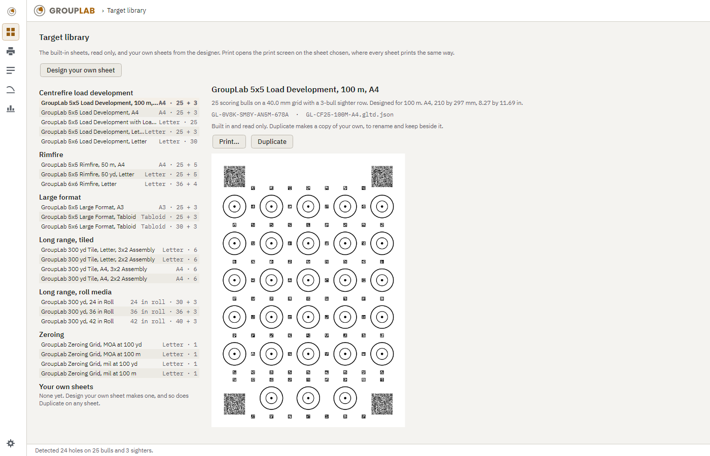
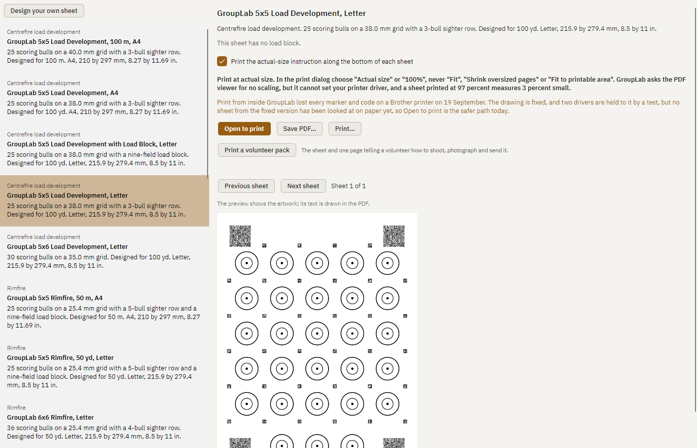

# GroupLab user guide

GroupLab measures how accurately a rifle shoots, and tells you how much its figures can be trusted. This guide takes one sheet from the printer to the analysis. It describes the Windows application as it is built today, and every picture in it is a render of the build.

The rail down the left of the window is how you move around it:
- the mark at the top is the sheet you are working on;
- then the target library, printing, the session records and the ballistics screen;
- then load comparison;
- the gear at the foot is the settings.

## 1. Print a sheet

Open the target library from the rail. It lists the built-in sheets by family, read only, and your own sheets after them. Choose a sheet to see what it is, its identifier and its artwork.

Print opens the print screen on the sheet you chose.
- **The load block** can be left blank, to write in at the range, or filled in now from the fields shown. On a sheet with room for it, a filled block also carries an instance code, so GroupLab reads the load straight off the sheet.
- **Print** (on Windows) prints from inside GroupLab at actual size. It refuses, with the reason, when the paper is not the sheet's or ink would fall in the printer's margin. When the job is sent, a confirmation names the printer and the pages.
- **Open to print** opens the PDF in your viewer instead. Print it from there at Actual size or 100 percent, never Fit.
- **Save PDF** keeps the file.

**Check the size before you shoot.** Measure from the centre of bull 1 to the centre of bull 5 with a ruler. On the Letter 5x5 sheet it is 5.98 in (152.0 mm). If it is not, the printer scaled the sheet, and it should be printed again.

**Your own sheet.** Design your own sheet, in the library or on the print screen, lays out a grid of bulls:
- you choose the page, the rows and columns, the spacing, the ring, the sighters and a load block;
- a layout that cannot register or fit is refused;
- if you give your five-shot group, a spacing tight for it is warned about.

Save to your own sheets keeps a design in the library. There you can rename it, duplicate it, or delete it after GroupLab asks. Duplicate works on a built-in sheet too, as the start of one of your own. Deleting a sheet never makes a session unreadable, because every session keeps its own copy of the sheet it was analysed against.

**A volunteer pack.** Print a volunteer pack, on the print screen, gives the sheet and one page of instructions together, for someone shooting a sheet for the project.

## 2. Shoot it

- Mount the sheet flat, supported all over.
- For a load development sheet, fire one shot per bull, in order, starting at bull 1. The sighter bulls are for sighters, and GroupLab keeps them out of the group unless you ask for them to be analysed.
- Write only in the load block.

Some sheets break one shot a bull on purpose, such as two shots into each of bulls 1 to 10. Say so before you accept the marking: Shots per bull, in the marking screen's side panel, reads the sheet by nearest bull, or as two shots on the bulls you name.

## 3. Photograph or scan it

**A flat scan at 600 dpi is the best record of a sheet.**

GroupLab reads the resolution your scanner wrote into the file and uses it as a starting point, then measures the real resolution from the sheet's own printed markers and tells you both. Where the two disagree, the markers win, because they were printed at a known size and the file's number is only what the scanner meant to do.

For photographs:
- stand about 2.5 ft (75 cm) from the sheet;
- use the phone's main camera, not its wide or zoom lens;
- keep the whole sheet and all its corner squares in the frame;
- do not crop the pictures, and do not send them through a messaging app, which shrinks them.

## 4. Mark it and settle the review queue

Open image, in the header's menu, opens a scan or a photograph. On a GroupLab sheet the rest happens on its own:
1. GroupLab reads the sheet's printed codes to name its definition.
2. It registers the page from the corner and edge markers.
3. It finds the holes by comparing the image with the sheet as printed.
4. It gives each hole to a bull.

Every result is an ordinary mark that you can move, delete or reassign. On any other target, you mark the holes by hand against a length or a rectangle of known size.

The pill in the header counts the marks that need you. The review queue in the side panel lists each one with the choices that settle it. The items are:
- **Contested assignment:** a hole that could belong to either of two bulls, or one that the matching gave to a bull other than its nearest.
- **Possibly two holes:** a mark about the size of two holes.
- **Two shots on one bull.**
- **No bull.**
- **Count differs from rounds fired:** raised when you have said how many rounds you fired.
- **Refused candidate:** something the detector saw and did not take as a hole.
- **Bulls with nothing on them:** when you have said how many rounds you fired and GroupLab finds fewer, it names the bulls that are empty. **A shortfall is never allowed to pass as a clean result.**

**Name the calibre if you know it.** It sets the smallest hole GroupLab will accept, which matters most for small calibres, and it gives you the edge-to-edge figure. On one of the test scans it is the difference between nineteen holes found and twenty-four; on another it is the difference between missing the shot at the edge of the scan and finding it. A .22 hole in paper is much smaller than the bullet that made it, and without the calibre the detector has only the shape of a mark to go on.

**Holes between bulls, and marks off the grid.** A hole that lands between two bulls, or beside the grid rather than on it, is kept, counted and offered to you. It is never dropped for being in the wrong place. Where GroupLab is not sure which bull a hole belongs to, it says so and the figures built on that assignment carry the doubt with them until you have settled it: **a figure that rests on a guess is marked as resting on a guess.**

The queue works from the keyboard:
- **Space** goes to the next item.
- **Enter** takes its first choice.
- **Type a bull's number and press Enter** to give the shot to that bull.
- **T** takes a flagged mark as the two shots the detector says it is.
- **N** marks the selected mark as not a shot.

The tools have keys too:
- C or P pan, V select, I impact, A aim, L length and R rectangle;
- the square brackets turn the view;
- Delete removes the selected mark;
- Ctrl+Z and Ctrl+Y undo and redo.

In the side panel you also set:
- the calibre, as the bullet's diameter;
- the shot distance;
- the rifle, barrel and load, from your records;
- the rounds fired, as a check on the count.

When the marks are right, Accept and analyse. Anything still open stays open: the analysis names it, and the sheet crumb goes back to it.

## 5. Read the analysis

The analysis has three columns:
- **On the left:** the sheet small, drawn from its definition with every shot on it, then the load and the shot table. A click on a bull in the small sheet selects its shots.
- **In the centre:** the composite plot. Every scoring shot is drawn on one bull, each from its own bull's centre, with the group's centre and its CEP 50 and CEP 90 circles. An excluded shot is drawn hollow and is never removed.
- **On the right:** the zero correction, the figures and the two judgement cards.

**Click a hole to edit it.** A small editor opens beside it, not a dialog over the page. From it you can move the hole with the arrow keys, a hundredth of an inch a press and a tenth with Shift held; give it to another bull, either from the list or by clicking a bull on the sheet; set its size by hand where the detector read it wrong; leave a note on it; and mark it:
- **Sighter**, which sets it aside from the group, as a shot on a sighter bull already is;
- **Flyer**, which calls it out on the sheet and in the list and **changes no figure**;
- **Leave out of the figures**, which does change them, and needs a reason;
- **Not a shot**, for a staple, a tear or a pen mark.

Flyer and "leave out" are deliberately two different things. Pointing at a shot and dropping it from the group are two different decisions, and GroupLab will not quietly make the second one for you because you made the first.

Every edit shows a small message at the bottom of the screen saying what changed, with **Undo** on it. Ctrl+Z and Ctrl+Y work everywhere, and the Undo on the message is the same undo.

**A ? beside every figure.** Two or three plain sentences saying what the figure means, what it is good for, and what the number of shots does to it, with **More** going to the glossary. Every explanation says something about sample size, because every one of these figures depends on it, and the commonest mistake in group shooting is treating one five shot group as a measurement of a rifle.

**Every figure carries its interval,** the range the true value is likely to lie in, and the percentage it covers. When you have excluded a shot, each figure is also given without the exclusion, so an exclusion is never hidden.

**The zero correction** is given in MOA, mils, inches and centimetres at once. Where your rifle records its scope's units, that unit leads and the correction is also spelled out in clicks: "Up 8 clicks at 0.1 mil". The clicks are never guessed: a scope that adjusts in quarter minutes and one that adjusts in tenth mils are both common, and assuming either would send you the wrong way. A metric and imperial toggle on the page switches every figure between inches with MOA and centimetres with mils, and changes nothing that is stored.

It says what to dial when the group's centre is far enough from the aim to be told from chance. When it is not, it says so and how many shots would settle it. Dialling an offset nobody can distinguish from zero only chases noise.

**The two cards:**
- **Shape** says whether the group is round, as far as its shots can tell. It also says whether it strings vertically, and what that test could have detected. A test on few shots misses most real stringing, so "no evidence" is not evidence of none.
- **Worst shot** says whether the shot furthest out is further than groups of that size usually put their worst. Even when it is, that makes it worth a look, not a flyer. Whether it was called or pulled is yours to say.

**What each "why" says, in plain words:**
- **Zero correction:** the smallest offset these shots can call; how the spread was estimated; and that moving a zero between distances needs the ballistics screen.
- **CEP:** these circles come from the group's sigma, assuming the shots scatter evenly about the centre.
- **Shape:** how often a truly round group would look this far from round, and the shape of the group's error ellipse.
- **Worst shot:** how far out the worst shot sits in the group's own mean radii, against where simulated round groups put theirs.
- **Decisions left unmade:** every figure here inherits the decisions still open.

**The full CEP table and bivariate fit** are one click away, and GroupLab remembers whether you opened them. The table gives the CEP at 50, 90, 95 and 99 percent three ways. The fit gives the centre and the spread on each axis with their intervals, and the error ellipse.

## 6. Sessions and the report

Accept and analyse saves the sheet as a session: the marking with every edit, its figures, a proof image and its own copy of the sheet. Session records, in the rail, lists them newest first:
- filter them by rifle and by load;
- open one back to its analysis, which needs no image;
- delete one, after GroupLab asks.

The analysis's Report button saves the session as a PDF:
- **Page 1:** the particulars, the plot, the figures with their intervals, the zero correction and the cards.
- **Page 2:** the shot table, the exclusions with their reasons, any decisions left unmade, the registration and every "why".

Every line on it is one the screen shows.

## 7. Comparing loads

Tick two or more sessions in Session records and press Compare the chosen. They appear side by side on the comparison screen, the rail's chart. Each has its plot and its figures with intervals, and below them are the tests with their verdicts.

**The loads are never ranked by their figures alone.** When the intervals overlap, the screen says the data do not separate the loads. Every test also says what it could have detected, and the table at the foot gives the shots per load it takes to resolve a smaller difference. Sessions shot at different distances are compared as angles, and the screen says so.

## 8. The zero correction at another distance, and the dope table

The ballistics screen keeps what the solver needs on your rifle and load records:
- the sight height and zero distance;
- the muzzle velocity and its standard deviation;
- the BC, its drag model and its reference atmosphere;
- the bullet's weight, and for spin drift its length, its diameter and the twist.

All of it is optional. A record without what the solver needs says which field is missing.

**The dope table** gives drop and the wind of a 10 mph crosswind at each range, in your units and your scope's clicks, in the air you enter. Aerodynamic jump is not modelled, and the table says so.

**At another distance.** On the analysis, the zero correction can be carried to a second distance, with its uncertainty carried with it. An offset that could not be told from zero is not carried.

The ballistics screen also carries the analysed group to another distance, and gives the chance of hitting a circle or a rectangle there:
- It is a prediction, never a measurement.
- The chance is given as a range across the group's sigma interval.
- With neither a velocity spread nor a crosswind uncertainty given, it is the group scaled by angle and nothing more.

## 9. Keeping GroupLab up to date

GroupLab checks for a new build when it starts and about once a day after that, and tells you in a bar across the top of the window when one is ready. Nothing is downloaded until you ask for it and nothing is installed without you pressing the button.

When you do, GroupLab downloads the installer, checks it against the SHA-256 the release states, and hands it to Windows. The installer is per-user: it never asks for an administrator, it installs under your own account, and it closes and reopens GroupLab around the update. After it comes back, the same bar tells you which version you are now on.

If an update ever fails, the build you had is still installed and still works. Nothing is removed until the new one is in place.

## 10. Comparing several sheets at once

Where several sheets were shot with the same load, GroupLab can read them as one group. It is not a matter of adding the numbers up: several sheets have several centres, and what a pooled figure means depends on which centre you measure from. GroupLab says which it used and will not pool sheets that cannot honestly be pooled.

## 11. If something goes wrong

**Report a problem** is in the settings. It opens the support page, which takes a description and, if you attach one, a report package: your log, the crash record and the marking you were working on. Nothing is sent until you press send, and you can see what is in the package before you do.

Crash records are written to your own machine whether or not you ever send them. They name the version, the build train and the line it happened on, and they never contain a photograph, a location or anything read out of one.

**Sending in sheets.** The upload page at `grouplab.org/upload` takes scans and photographs that help GroupLab get better at reading them. It is coming: the address is reserved and the page is written, but the server it runs on is not installed yet, so the link will not work until it is.

## 12. Settings

The gear opens the settings:
- **Units:** length, angle and distance, each chosen on its own. They change only how figures are shown.
- **Theme:** dark, light, high contrast, or follow the system.
- **Log:** how much the diagnostic log records, and where it is.
- **Problems:** a way to report a problem, and any crash records not yet dealt with.

