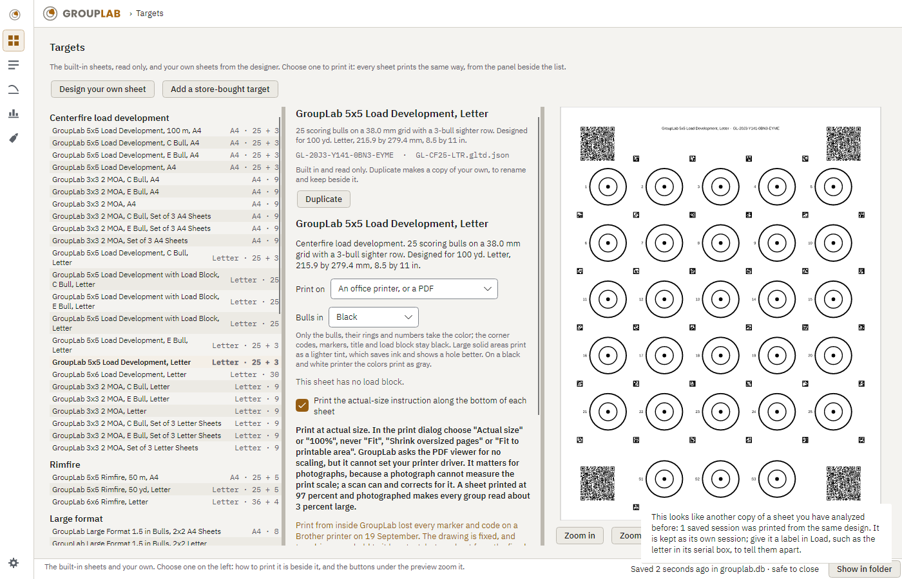
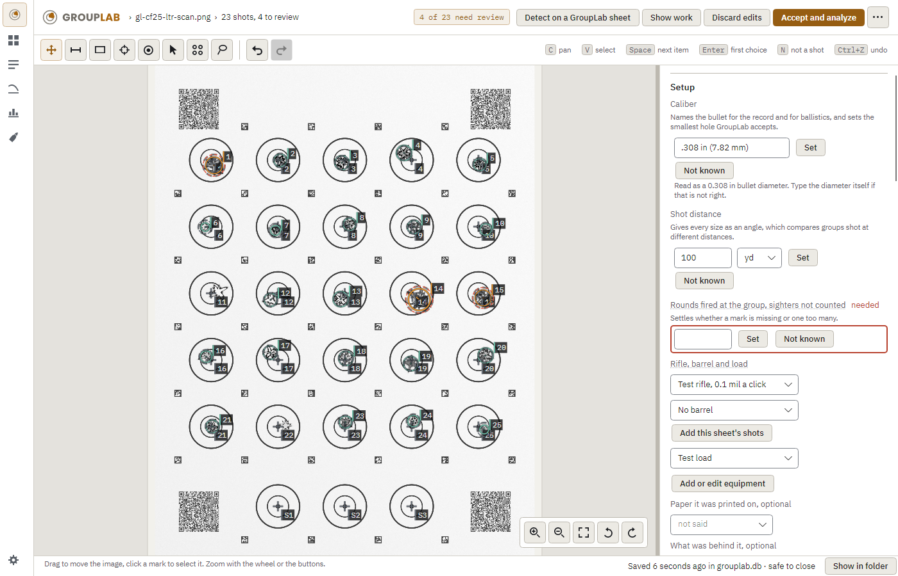
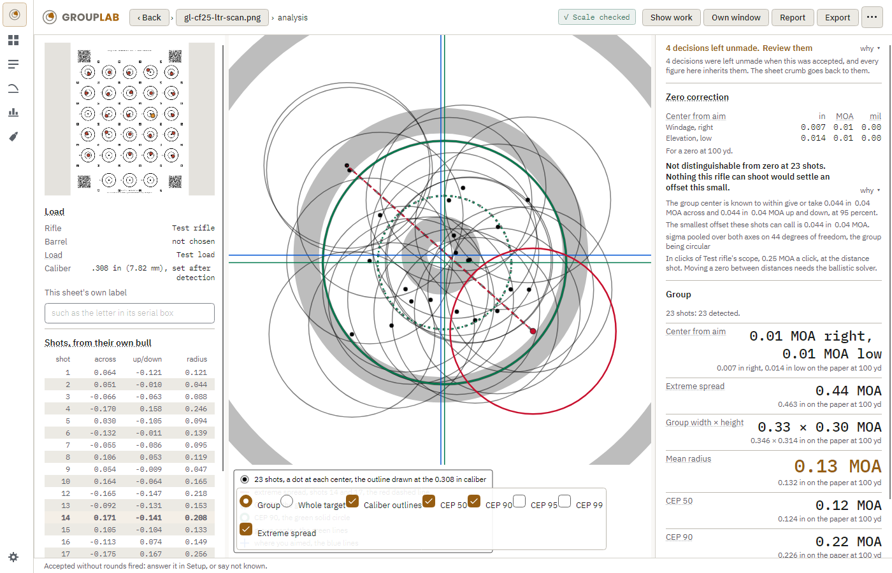
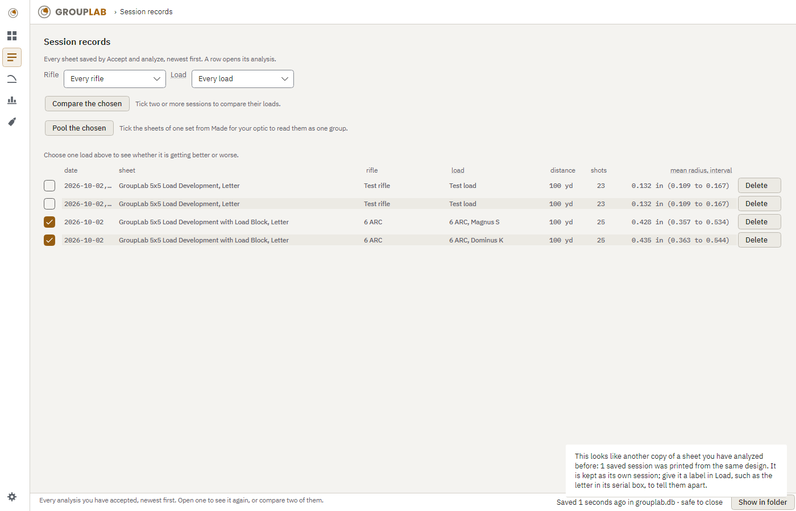
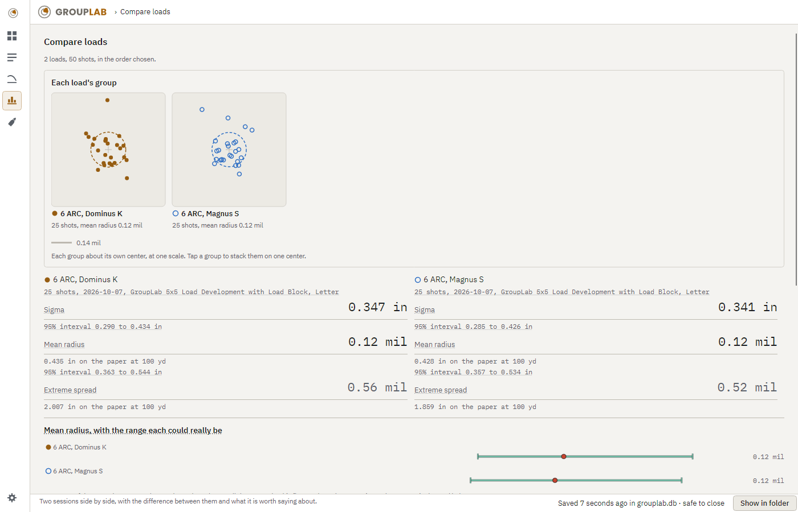
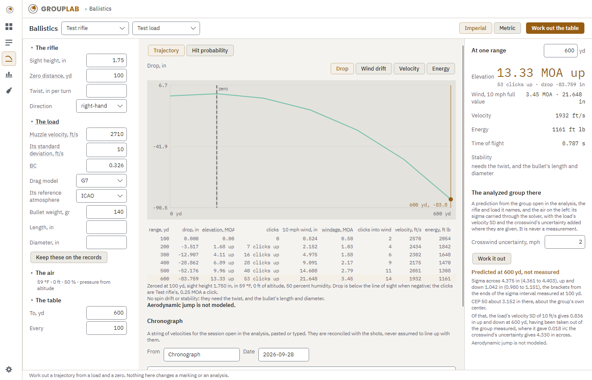
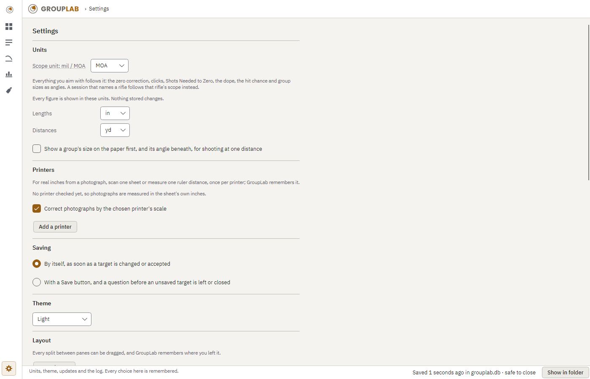

# GroupLab user guide

GroupLab measures how accurately a rifle shoots, and tells you how much its figures can be trusted. It works on any target you already shoot: photograph or scan it, set the scale once and mark the holes by hand (section 1, under a target GroupLab did not print, says how). A GroupLab sheet is the fast lane, where the scale and every hole are found by themselves, and this guide takes one from the printer to the analysis. It describes the Windows application as it is built today, and every picture in it is a render of the build.

The rail down the left of the window is how you move around it:
- the mark at the top is the sheet you are working on;
- then Targets, where sheets are chosen and printed, the session records and the ballistics screen;
- then load comparison;
- the gear at the foot is the settings.

## Mil or MOA

GroupLab works in your scope's unit, mil or MOA, and neither is the default. The first time it starts, on the computer and on the phone,
it asks **Is your scope in mil or MOA?**, with a third answer, **Both, I have rifles of each**, and whether you measure sizes on the paper
in inches or millimeters. Your answer becomes the **Scope unit** at the top of Units in Settings, where you can change it at any time.

**Each rifle keeps its own.** A rifle's record has its scope unit and one click: 0.1 mil, 0.05 mil, 1/4 MOA, 1/8 MOA, or any other
value you type. When a session names a rifle, that rifle's unit wins over Settings; when it names none, Settings decides. If you answered
Both, a session with no rifle asks which rifle it was.

**Everything aiming follows it:** the zero correction, the clicks, Shots Needed to Zero, the dope table, the hit chance, the table of
each shot's offset, Zero from this group, and group sizes shown as angles. With a mil scope the zero correction reads in mil alone,
such as "dial 0.30 mil left, 3 clicks left", with no MOA next to it. The other unit is never far: tap a number to
switch it, or press and hold it for every unit it can take, and GroupLab remembers that figure's choice.

**Getting GroupLab.** The download page, grouplab.org/download/, has every build. On Windows, the Microsoft Store carries an older,
steadier build that updates itself ([Get it from Microsoft](https://apps.microsoft.com/detail/9NWJCXBKZNPZ)); the installer and the zip
there are the newest test build. On an iPhone or iPad, GroupLab is in a public beta through Apple's TestFlight: install TestFlight from
the App Store, then open [the invitation](https://testflight.apple.com/join/A3xyT6C6) on the device.

## 1. Print a sheet

Open **Targets** from the rail. It lists the built-in sheets by family, read only, and your own sheets after them. Choose a sheet and
everything it takes to print it is beside the list, with the page filling the rest of the screen. The page is drawn live from the same
shapes and letters as its PDF, so it is exactly what prints, changes the moment any setting or designer field does, and stays sharp at any
zoom on any screen; **Open as PDF** under it opens the real PDF in your viewer. The phone's Targets screen draws its page the same way.

- **Bulls in** black, blue or red, for any sheet, built in or your own, on the computer and the phone. Only the bulls, their rings and numbers take the color; the corner codes, markers, title and load block stay black. Lines print in the full color and large solid areas, such as the C bull's diamond, as a lighter tint, so a hole shows dark against it. The preview and the PDF follow the choice at once, and GroupLab remembers it for that sheet. GroupLab finds the color from the photograph, so nothing needs to be set when you read the sheet. On a black and white printer the colors print as gray. On a color inkjet, filled bulls use less ink in color than in black, while ring bulls and zeroing grids use a little more, since a colored line takes two inks; blue uses a little less than red.
- **The load block** can be left blank, to write in at the range, or filled in now from the fields shown. On a sheet with room for it, a filled block also carries an instance code, so GroupLab reads the load straight off the sheet.
- **Print** (on Windows) prints from inside GroupLab at actual size. It refuses, with the reason, when the paper is not the sheet's or ink would fall in the printer's margin. When the job is sent, a confirmation names the printer and the pages.
- **Open to print** opens the PDF in your viewer instead. Print it from there at Actual size or 100 percent, never Fit.
- **Save PDF** keeps the file.

**Three sheets come with the E bull as well**: the 5x5 load development sheets for Letter, Letter with the load block, and A4, each with every
bull a black disc with a 0.36 in white center and a small dot. The aim point test of 2026-09-26 found it could be centered on through
every high power scope at 10x, where the usual bull could not. They sit beside the usual ones in the list, with their own identifiers.

**And three with the C bull**: the same three sheets with every bull a black diamond standing on a point, 1.25 in point to point, with a
white diamond center and a small dot. Its points lie on the vertical and horizontal lines through the aim, so a crosshair lines up with the
shape. **Design your own sheet** offers the rings, E or C for its bull, and **Made for your optic** a disc or a diamond, sized by the same
rule. None of them replaces the usual bull.

**The large format sheets print on Letter or A4.** Each is a set of four sheets with eight 1.5 in or 1.4 in bulls apiece, the same bulls
and spacing the tabloid and A3 sheets had; each sheet has its own markers and codes, so scan or photograph them one at a time. A tabloid or
A3 sheet you printed before still reads. The roll sheets are for a plotter, and a photograph of a whole one needs a phone of about 50 MP.

**The zeroing grids are for sighting in by eye.** Each prints at exact scale, so at the bench you fire, read the correction off the grid, dial it and fire again. The squares are a scope's own: 0.2 mil or 0.5 MOA, with a small tick at every click (0.1 mil or 1/4 MOA) between the lines along the center cross and the frame. The legend above the grid, large enough to read through the scope, says what a square and a tick are; each line's distance from the aim is written outside the grid, and nothing on it. Aim at the diamond. A 4 in or 10 cm bar at the bottom checks the print: measure it before you shoot. The sheet has no load block, so enter the load on the session. The design, C3, was chosen by Alan with Jylee and Unholy. For a zero worked out from a group, and the group figures, shoot a [5x5 sheet](#2-shoot-it) instead. GroupLab still reads a scanned zeroing grid, but it cannot know the order of the shots or the dialing between them, which is what the grid was for.

**Made for your optic.** Under Design your own sheet, give the distance, the lowest magnification you will shoot at (1 for a red dot, with the dot's size in MOA) and the number of shots, and press Make the sheet. GroupLab sizes a bull you can center on through that optic: a black disc with a white center that subtends about 3.5 arcminutes at that magnification, the size the aim point test found people can center on, with nothing small at the middle for a crosshair to cover. It makes as many sheets as the shots need, and each sheet's codes say which of the set it is. Analyze each sheet by itself for now; putting a set together into one group is still to come.

**A target GroupLab did not print, with several bulls** (suggested by Unholy, also TNA). Choose **Place bulls** (B) and tap each bull's aim point; drag one to move it, and Delete takes the chosen one away. Shots go to their nearest bull and are drawn in its color, so a shot on the wrong bull shows. **Lasso** (O): draw round several shots, then tap the bull they belong to. For the scale, tap four corners of something rectangular whose size you know, such as the paper's edge, which removes the photograph's angle; or draw a length near a bull, a ring's width or a grid square, and choose **Use it as bull N's own scale**, then a second at right angles to it. GroupLab says when the bulls' scales disagree, which means the photograph was taken at an angle, and how uncertain the sizes are because of it. Under Advanced, **Bull by bull** gives each bull as its own group beside the pooled one. With the bulls tool in hand, **Save these bulls** keeps them as a template; on the next sheet of the same target, tap its first two bulls and **Place the rest**.

**Store-bought targets.** Five Birchwood Casey targets are recognized on the computer and the phone: GroupLab names the target, places its bulls and takes the scale from its printed size, within a median of 0.06 percent on the fingerprinted sheets, warns that printed targets can vary with Check the scale one click away, and asks which you have when the 6 in and 8 in Shoot-N-C bullseyes look alike. The list grows as targets are added to it, and a target added after your build reaches it without a new build: GroupLab looks for a newer signed list when it starts (on a phone, only on Wi-Fi with the battery and storage not low, at most every six hours) and uses it only when its signature checks. There is no way to send one in yet.

**Add a store-bought target.** On Targets, **Add a store-bought target** teaches GroupLab one it does not know, from a photograph of a blank one, in five steps, one question at a time: **Photo**, **Size and scale**, **Straighten**, **The bulls** and **Name and send**. On the computer the steps are listed on the left, done ones ticked in teal and the current one amber, the photo in the middle and the question on the right with **Back** and **Next**; on the phone each step fills the screen, with a five-part bar and Back at the top and one big button at the bottom. Choose or take a photo of the target flat and square on, all four corners in it; GroupLab finds the corners, and where it cannot, offers four amber handles to drag onto them. **How big is this target?** takes one true length three ways: **Its printed size**, the width and height on the package; **A GroupLab sheet in the photo**, laid on the target; or **Two points and a distance**, both ends of something you measured and its length. Under the one picked is what GroupLab measured for it on computer-made photos of two test posters, typically within 0.01 percent at 12 by 18 in and 0.28 percent at 23 by 35 in from the printed size, 0.16 and 0.40 percent from two points, and a Letter sheet too small to read at all on the larger poster; no way is called the best, because none was at every size. **Straighten** shows the corners to check; **The bulls** shows the target straightened with each bull it found as a numbered ring: tap or click a ring to remove it, or the picture to add one, and **These are right** moves on. Last, type the name on its package: where it matches a target already in GroupLab's library at another size, GroupLab says it joins that family; at the same size, that GroupLab already knows it. **Save reference file** on the computer, or **Save and share the file** on the phone, writes the file: the fingerprint, name, size and bulls, never the photo. Send it to GroupLab's maker; each file is checked by hand before it joins the library a later GroupLab recognizes.

**Find holes (Experimental).** Once the scale is set, and the bulls if you placed them, the button under the scale proposes the holes: a hole darker than the paper, a hole in a black bull where what shows through is lighter than the ink, and on a fluorescent target a dark center inside its bright ring. Each one is a mark like any other, to keep, drag onto its hole or delete, and one GroupLab is not sure of is in the review with the reason. It is experimental: it misses some holes, such as one on the edge of a black bull, and it can take printing for a hole, so look at every mark before you trust the figures. Undo takes all of them back at once, and pressing it again replaces only the marks you have not touched.

**Large targets.** A sheet larger than Letter or A4 does not fit a flatbed scanner. For each one the Targets screen works out how many pixels an inch a phone photograph of the whole sheet gives and says whether that is enough. Tiled Letter or A4 pages are the better choice for a large target: each page scans by itself, and a plotter can print them all on one large page with cut lines between them.

**Check the size before you shoot.** Measure from the center of bull 1 to the center of bull 5 with a ruler. On the Letter 5x5 sheet it is 5.98 in (152.0 mm). If it is not, the printer scaled the sheet, and it should be printed again.

**Your own sheet.** Design your own sheet, at the top of Targets, lays out a grid of bulls:
- you choose the page, the rows and columns, the spacing, the ring, the sighters and a load block;
- the bull's size can also be given in inches, MOA or mil, the angles read at the distance you give, so a 0.25 mil bull is 0.90 in across at 100 yd; the E and C bulls take the size exactly, and the rings take the nearest ring set;
- the bull's size can be given in inches, MOA or mil, the angles at the distance you give, so a 0.25 mil bull is 0.90 in across at 100 yd; the E and C bulls take the size exactly and the rings take the nearest ring set;
- a layout that cannot register or fit is refused;
- if you give your five-shot group, a spacing tight for it is warned about.

Save to your own sheets keeps a design in the list. There you can rename it, duplicate it, or delete it after GroupLab asks. Duplicate works on a built-in sheet too, as the start of one of your own. Deleting a sheet never makes a session unreadable, because every session keeps its own copy of the sheet it was analyzed against.

**A volunteer pack.** Print a volunteer pack, beside the chosen sheet, gives the sheet and one page of instructions together, for someone shooting a sheet for the project.

## 2. Shoot it

- Mount the sheet flat, supported all over.
- For a load development sheet, fire one shot per bull, in order, starting at bull 1. The sighter bulls are for sighters, and GroupLab keeps them out of the group unless you ask for them to be analyzed.
- Write only in the load block.

Some sheets break one shot a bull on purpose, such as two shots into each of bulls 1 to 10. Say so before you accept the marking: Shots per bull, in the marking screen's side panel, reads the sheet by nearest bull, or as two shots on the bulls you name.

A sheet with one scoring bull takes a group. Every shot on it goes to that bull, however far out, and the review asks nothing about how many there are; say how many you fired, in Rounds fired, and a count that disagrees names the mark most likely to hold two.

## 3. Photograph or scan it

**A flat scan at 600 dpi is the best record of a sheet.**

GroupLab reads the resolution your scanner wrote into the file and uses it as a starting point, then measures the real resolution from the sheet's own printed markers and tells you both. Where the two disagree, the markers win, because they were printed at a known size and the file's number is only what the scanner meant to do.

For photographs:
- stand about 2 ft (60 cm) from the sheet, close enough that the sheet nearly fills the frame;
- use the phone's main camera, not its wide or zoom lens;
- keep the whole sheet and all its corner squares in the frame;
- do not crop the pictures, and do not send them through a messaging app, which shrinks them.

**Flat on a table, or straight on at the backer.** The phone's camera works either way. Lay the sheet flat and hold the phone over it,
or leave the sheet on its backer at the range and hold the phone upright, straight on to it, in portrait or landscape. The word under the
camera's level says which, **Looking down** or **Upright**, and the level turns green in either when the camera is square to the sheet.
Once the sheet's corner squares are read, the sheet's own angle decides, so a backer leaning back, or a table that is not level, is still
square when the phone is square to the sheet. Guided takes the picture by itself in either position under the same rules: square to the
sheet within 37 degrees, steady, and the sheet read.

**Real inches from a photograph.** A photograph has no ruler in it, so on its own it measures in the sheet's own inches: a sheet your
printer printed at 97 percent makes every group read about 3 percent large. For real inches from a photograph, scan one sheet or measure one ruler distance, once per printer; GroupLab remembers it.
The easiest way is the printer check, offered the first time GroupLab opens and the first time you print, and always in Settings under
**Printers**. Name the printer, print the check page at actual size, and measure it one way: lay any bank, gift or ID card inside its
outline and take one photo (about 0.3 percent), measure between its crosshairs with a digital caliper (about 0.1 percent), measure its
two long lines with a ruler or tape, or scan it. GroupLab shows how large the printer prints across and down and saves it. Photographs of
that printer's sheets are then corrected, and each result says so in one line, such as "Corrected for My printer, 99.2 by 99.4%, checked
28 September". A check measures the sheets printed before it. If you calibrate or service the printer, or change its settings, press
**Printer calibrated or serviced** under that printer in Settings: sheets printed before stay corrected by the old check, and every result
it corrects says so and offers **Check your printer** again, which is worth doing on a sheet printed now. GroupLab offers the same after
about six months. The paper's own edge is checked on every photo too: GroupLab says when it disagrees with the printer's figures by more than about 1.5 percent,
or when a sheet looks printed with Fit to page. On any one photograph, **Measure this sheet with a ruler** corrects just that sheet.

## 4. Mark it and settle the review queue

Open image, in the header's menu, opens a scan or a photograph. On a GroupLab sheet the rest happens on its own:
1. GroupLab reads the sheet's printed codes to name its definition.
2. It registers the page from the corner and edge markers.
3. It finds the holes by comparing the image with the sheet as printed.
4. It gives each hole to a bull.

Every result is an ordinary mark that you can move, delete or reassign. On any other target, you mark the holes by hand against a length or a rectangle of known size. To change that scale, tap its two ends or four corners again and enter the new size, or choose the length or rectangle tool and **Change the length of the scale in use**; every figure follows. Typing a caliber offers the calibers and cartridges that match, with spacing and points forgiven, so "65 creed" finds 6.5 Creedmoor, and choosing one from the list, with a click or with Enter, sets it at once. **Caliber box shows** in Settings, the same on the phone, chooses what the list offers: **Calibers**, the bullet diameters with their usual names, such as .308 (7.62 mm, .30); **Cartridges**, the names, each with its diameter, such as 6.5 Creedmoor, 0.264 in; or **Both**, calibers first and then cartridges, which is where it starts. Any other diameter can still be typed in inches or in millimeters.

With the rectangle tool, **Find the paper's edges** places the four corners on the paper itself when the sheet stands out from what is
behind it, still draggable, and offers a standard paper size when the photograph's shape matches one. On a white board it cannot tell the
paper from the board, and you tap the corners. A photograph taken more than 37 degrees off square to the sheet is refused, with the angle
named, and every photograph you open keeps how far off square it was and how good it is: good, usable or poor.

The pill in the header counts the marks that need you. The review queue in the side panel lists each one with the choices that settle it. The items are:
- **Contested assignment:** a hole that could belong to either of two bulls, or one that the matching gave to a bull other than its nearest.
- **Possibly two holes:** a mark about the size of two holes.
- **Hole read with what is beside it:** a mark at least twice as wide as a hole, usually a hole joined to the printed rings in a photograph taken off square. GroupLab places the shot on the part the size of one hole; check it sits on the hole, or move it.
- **Two shots on one bull.**
- **No bull.**
- **Count differs from rounds fired:** raised when you have said how many rounds you fired.
- **Refused candidate:** something the detector saw and did not take as a hole.
- **Bulls with nothing on them:** when you have said how many rounds you fired and GroupLab finds fewer, it names the bulls that are empty. **A shortfall is never allowed to pass as a clean result.**

**Name the caliber if you know it.** It sets the smallest hole GroupLab will accept, which matters most for small calibers, and it gives you the edge-to-edge figure. On one of the test scans it is the difference between nineteen holes found and twenty-four; on another it is the difference between missing the shot at the edge of the scan and finding it. A .22 hole in paper is much smaller than the bullet that made it, and without the caliber the detector has only the shape of a mark to go on.

**Holes between bulls, and marks off the grid.** A hole that lands between two bulls, or beside the grid rather than on it, is kept, counted and offered to you. It is never dropped for being in the wrong place. Where GroupLab is not sure which bull a hole belongs to, it says so and the figures built on that assignment carry the doubt with them until you have settled it: **a figure that rests on a guess is marked as resting on a guess.**

The queue works from the keyboard:
- **Space** goes to the next item.
- **Enter** takes its first choice.
- **Type a bull's number and press Enter** to give the shot to that bull.
- **T** takes a flagged mark as the two shots the detector says it is.
- **N** marks the selected mark as not a shot.

The tools have keys too:
- C or P pan, V select, I impact, A aim, L length and R rectangle;
- the square brackets turn the view;
- Delete removes the selected mark;
- Ctrl+Z and Ctrl+Y undo and redo, and on a Mac Command Z and Shift Command Z. The undo button's tooltip says what it will undo.

To move around the sheet, a mouse wheel zooms about the pointer, and a touchpad's two finger drag moves the sheet. A pinch zooms, on a touchpad or a touch screen, and so does Ctrl, or Command on a Mac, with any scroll. On a Mac any plain scroll moves the sheet, as it does in other Mac applications.

In the side panel you also set:
- the caliber, as the bullet's diameter;
- the shot distance;
- the rifle, barrel and load, from your records;
- the rounds fired, as a check on the count.

When the marks are right, Accept and analyze. Anything still open stays open: the analysis names it, and the sheet crumb goes back to it.

## 5. Read the analysis

The analysis has three columns:
- **On the left:** the sheet small, drawn from its definition with every shot on it, then the load and the shot table. A click on a bull in the small sheet selects its shots.
- **In the center:** the composite plot. Every scoring shot is drawn on one bull, each from its own bull's center, over the bull's rings drawn as wide gray bands. Green lines cross at the group's center and blue lines at where you aimed, both across the whole plot; the CEP circles are green, CEP 50 dotted, CEP 90 solid, CEP 95 dashed and CEP 99 in dashes and dots; the extreme spread is a red dashed line between the two shots furthest apart. Toggles beside the plot turn CEP 50, CEP 90, CEP 95, CEP 99 and the extreme spread on and off, and GroupLab remembers them; CEP 95 and CEP 99 start off. CEP 99 on also lists it with the figures, with its range, and where your shots are too few to reach that far out, fewer than one expected outside the circle, it says the circle is the model's guess rather than something the shots show. Under Advanced, **A circle for any percent** takes a percent from 1 to 99.9, draws it in long dashes, lists it, and is remembered. **Group** and **Whole target** beside them frame the group alone or the entire bull with the group inside it, also remembered. The mouse wheel or a pinch zooms, dragging empty paper moves the view, and a double click returns to the fitted view. An excluded shot is drawn hollow and is never removed.
- **On the right:** the zero correction, the figures and the two judgment cards.

**Tap a number to switch units.** Tap an angle to switch that number between mil and MOA, a size on the paper to switch it between
inches and centimeters, and a distance to switch it between yards and meters. Only the number you tap changes, and GroupLab remembers
the unit for that figure, so mean radius in MOA stays in MOA the next time while extreme spread can stay in mil; figures you never tap
follow the scope unit ([Mil or MOA](#mil-or-moa)). Right-click a number, or press and hold it on the phone, to choose any unit it can take, SMOA and millimeters
included. A figure's name still explains it when you tap it; only the number switches.

**Click a hole to edit it.** A small editor opens beside it, not a dialog over the page. From it you can move the hole with the arrow keys, a hundredth of an inch a press and a tenth with Shift held; give it to another bull, either from the list or by clicking a bull on the sheet; set its size by hand where the detector read it wrong; leave a note on it; and mark it:
- **Sighter**, which sets it aside from the group, as a shot on a sighter bull already is;
- **Flyer**, which calls it out on the sheet and in the list and **changes no figure**;
- **Leave out of the figures**, which does change them, and needs a reason: every figure, the report and the saved session then leave the shot out, it stays on the sheet drawn hollow, and each figure's detail gives the figure again with every shot;
- **Not a shot**, for a staple, a tear or a pen mark.

Flyer and "leave out" are deliberately two different things. Pointing at a shot and dropping it from the group are two different decisions, and GroupLab will not quietly make the second one for you because you made the first.

Every edit shows a small message at the bottom of the screen saying what changed, with **Undo** on it. Ctrl+Z and Ctrl+Y work everywhere, Command Z and Shift Command Z on a Mac, and the Undo on the message is the same undo.

**Every word you may not know is underlined with dots,** a figure's name or a word like sigma, MOA or bull, here and on the website. Hold the pointer over it, or tab to it, for two or three plain sentences saying what it means; click it or press Enter for the whole entry, with **More in the glossary**. For a figure the sentences say what it is good for and what the number of shots does to it. Every explanation says something about sample size, because every one of these figures depends on it, and the commonest mistake in group shooting is treating one five shot group as a measurement of a rifle.

**Six figures stay in view:** center from aim, extreme spread, group width by height, mean radius, and CEP 50 and 90. **With the shot distance set, each is an angle first,** in your scope's unit (the session's rifle's, or the one in Settings), and its size on the paper at that distance is beneath it in smaller type: an angle is what lets a group shot at 25 yards be compared with one shot at 100. Mil and MOA are the two a scope is marked in; SMOA, an inch at 100 yards, is there for those who think in it, so a 0.422 inch group at 25.4 yards reads 0.46 mil, 1.59 MOA or 1.66 SMOA. Without a distance the figures are sizes on the paper, and the panel says an angle needs the distance, with a button to set it. A setting puts the size on the paper first, for a shooter who only shoots one distance. **Every figure carries its interval,** the range the true value is likely to lie in, and the percentage it covers: hold the pointer over a figure to see it, with its angle at the distance shot. When you have excluded a shot, the tooltip also gives the figure without the exclusion, so an exclusion is never hidden.

**Advanced** holds everything else, closed until you open it: sigma, the strips across and up and down, the order the shots were fired in, the two cards below, the full CEP table, the sighters, and carrying the correction to another distance. GroupLab remembers whether you opened it.

**Velocity and the vertical,** directly under the group's figures, says how much of the group's up-and-down spread comes from velocity
alone. It needs the session's chronograph readings (Ballistics, Chronograph), the shot distance and the load's BC; without one of them
it says which, with a button to it. The share is in amber with its range, at the confidence it states, then a meter from none to all of
it and two bars on one scale: the vertical spread measured on the shots, and the spread velocity alone would make at that distance by
the solver, flown in the air and shot angle entered on Ballistics when that screen has the session's rifle and load chosen, or the
standard day where nothing is entered. Where the range reaches all of it, it says the data cannot tell, and more readings and shots
narrow it. Where each reading was paired with its shot when the readings were accepted, a chart of height against velocity draws the
measured slope and the solver's, and a sentence says whether they agree, and if not, to check the distance, the BC or the order the
readings were paired in. Its why lists the readings' own spread, the solver's height per 10 fps, both vertical spreads, and that the
range errs wide, never narrow. It also says which conditions were used and where they came from, or that the standard day was assumed.
**Velocity band**, beside the plot's other toggles, draws the band velocity alone would make about the group center in amber, with the
measured spread as dotted lines; it starts on and is remembered. On the phone the same is a card above All figures, with Velocity band
under the plot; its Add readings opens a box to paste the readings into.

**Back**, top left, returns to marking with every edit as you left it. The badge beside Show work reads **Scale checked** when the sheet's own markers set the scale; Show work has the detail. **Own window** moves the figures to a window of their own, for a second monitor, and closing that window puts them back.

**Under the shot table,** **Shots and clicks** opens every shot with its offset across and up from the aim point, the clicks that would
bring it onto the aim at your rifle's click value, and a **Counted** tick: untick it and the shot is left out of every figure, struck
through in the list and hollow on the plot, and still on the record. **Share a picture** puts a results box on the photograph: drag it
anywhere, drag its corner to resize it, and tick the lines it carries; the mean radius circle is drawn about the group's center, and a
label, the box's style and a crop around the group are beside it; **Save picture** writes it as a PNG. On a target GroupLab did not
print, **Aim points** lists each aim point in its own color with its own figures, and **+ Aim point** goes back to the sheet to place
another; the figures above pool them all. **Zero from this group,** under the zero correction, says where the group sits, the clicks
with the scope named and how well the center is known at this many shots, and opens Shots Needed to Zero or carries the offset into
Ballistics, whose dope then includes it at every range until you stop it.

**The zero correction** gives the group center's offset across and up and down on the paper and in your scope's unit alone, mil or MOA, and the distance it is for. Where your rifle records its scope's click value, the line beneath spells it out in clicks with the click value stated: "Dial 2 clicks left and 8 clicks up, at 0.1 mil a click". The clicks are never guessed: a scope that adjusts in quarter minutes and one that adjusts in tenth mils are both common, and assuming either would send you the wrong way. A metric and imperial toggle on the page switches the length unit between inches and centimeters, and changes nothing that is stored.

It says what to dial when the group's center is far enough from the aim to be told from chance. When it is not, it says so and how many shots would settle it. Dialing an offset nobody can distinguish from zero only chases noise.

**The two cards,** in Advanced:
- **Shape** says whether the group is round, as far as its shots can tell. It also says whether it strings vertically, and what that test could have detected. A test on few shots misses most real stringing, so "no evidence" is not evidence of none.
- **Worst shot** says whether the shot furthest out is further than groups of that size usually put their worst. Even when it is, that makes it worth a look, not a flyer. Whether it was called or pulled is yours to say.

**What each "why" says, in plain words:**
- **Zero correction:** the smallest offset these shots can call; how the spread was estimated; and that moving a zero between distances needs the ballistics screen.
- **CEP:** these circles come from the group's sigma, assuming the shots scatter evenly about the center.
- **Shape:** how often a truly round group would look this far from round, and the shape of the group's error ellipse.
- **Worst shot:** how far out the worst shot sits in the group's own mean radii, against where simulated round groups put theirs.
- **Decisions left unmade:** every figure here inherits the decisions still open.

**The full CEP table and the fitted ellipse** are in Advanced, one more click away, and GroupLab remembers whether you opened them. The table gives the CEP at 50, 90, 95 and 99 percent three ways. The fit gives the center and the spread on each axis with their intervals, and the error ellipse.

**Fudd buster mode,** Unholy's idea and his name for it, sits beside it from twenty shots: a window that shows, with your own shots, the tightest and the widest three-shot groups among them, what averaging three-shot or five-shot groups would have said against every shot, and the zero chased five shots at a time, with how far each correction was from where the rifle shoots.

**Shots Needed to Zero,** suggested by Jylee, sits under them. From the group's spread and your scope's click value (the rifle's own, or chosen there) it says how many shots a zeroing group needs before its center, dialed to the nearest click, lands on the click closest to the true zero, or within one click of it, 90, 95 and 99 times in 100. Within one click usually takes a handful of shots; the closest click can take hundreds, because a true zero near the line between two clicks is hard to resolve. The spread measured on a few shots may be larger than it looks, so GroupLab allows for that by simulation, and shows its trials and seed; tick **Treat the measured sigma as exact** to work it out exactly instead.

**Export** writes the complete record as a GroupLab file, or the shot coordinates as CSV for a spreadsheet: one row a shot, across and up from the point of aim in inches, MOA and mil, with the distance in the header. **Import shots from a CSV,** in the menu, reads coordinates exported by other software: it starts from GroupLab's guesses at which column is across, which is up and down, the unit, which way is up, and whether the numbers are measured from the point of aim or from the group's own center, each to check and change, and a choice it cannot guess starts empty and says so; then it shows the analysis. Numbers measured from the group's center say nothing about where the aim was, so then there is no offset from aim. There is no image with an import, so the figures are the whole of it.

## 6. Sessions and the report

Accept and analyze saves the sheet as a session: the marking with every edit, its figures, a proof image and its own copy of the sheet. **After that, and after any change, it saves itself**: the status bar says when ("Saved 12 seconds ago in grouplab.db"), that it is safe to close, and **Show in folder** opens the folder that holds every session. In Settings, under **Saving**, you can choose a **Save** button instead; then the bar says **Not saved yet** until you press it, and GroupLab asks before you leave or close a target with unsaved changes. Session records, in the rail, lists them newest first:
- filter them by rifle and by load;
- open one back to its analysis, which needs no image;
- delete one, after GroupLab asks.

The analysis's **Report** button saves the session as a PDF, the full report or one page. **Full report:**
- **Page 1:** the particulars, the plot, the figures with their intervals, the zero correction and the cards.
- **Page 2:** the shot table, the exclusions with their reasons, any decisions left unmade, the registration and every "why".

Every line on it is one the screen shows.

**One-page report** is one dated page, on Letter or on A4 as your region prints: the picture, a plot centered on the group and scaled to
fill it with its grid stated, the figures table, the load and equipment, and a sentence saying how sure the mean radius is at this many
shots. The phone makes the same page.

## 7. Comparing loads

Tick two or more sessions in Session records and press Compare the chosen. They appear side by side on the comparison screen, the rail's chart. Each has its plot and its figures with intervals, and below them are the tests with their verdicts.

**The loads are never ranked by their figures alone.** When the intervals overlap, the screen says the data do not separate the loads. The sentence under each chart and the verdict are one decision, so they never disagree. Every test also says what it could have detected, and the table at the foot gives the shots per load it takes to resolve a smaller difference. Sessions shot at different distances are compared as angles, and the screen says so.

**Each session is named by what tells it apart:** its load where you gave one, then its date where two would read the same, then its time, with the sheet's name beneath. Two sessions shot on one sheet on one day read "2026-09-29, 04:40" and "2026-09-29, 05:01", not the sheet's name twice.

## 8. The zero correction at another distance, and the dope table

The ballistics screen keeps what the solver needs on your rifle and load records:
- the sight height and zero distance;
- the muzzle velocity and its standard deviation;
- the BC, its drag model and its reference atmosphere;
- the bullet's weight, and for spin drift its length, its diameter and the twist.

All of it is optional. A record without what the solver needs says which field is missing.

**Chronograph readings.** Under the trajectory, **Chronograph** takes a session's velocities: type or paste them and press **Read the
list**, or press **Import a file** for a Garmin Xero export from ShotView (a CSV, or an Excel file in which each sheet is a string:
choose the string by its name), a CSV from a spreadsheet (the column of velocities found by its header, or chosen, in ft/s or m/s), a
LabRadar report, or a BulletSeeker export. The Xero reader reads every one of Alan's exports since May 2024; the LabRadar and
BulletSeeker readers are Experimental. A shot deleted on the chronograph stays missing from the numbering, a shot the Xero left out of
its own figures is kept and said, and where a file's own average, SD or spread differs from its shots GroupLab says so. A place name or
coordinates in an older file are never read. A file larger than 10 MB, a workbook that would unpack to far more than any export, or a
damaged file is refused with a sentence saying why, and a formula in a cell is never worked out. GroupLab then proposes what each reading goes with, a row per reading in the order fired:
its number, its speed in the string's own unit, its time where the file has one, and its mark, **Shot 2** in teal, one that needs a
look, such as **Shot 5, left out in ShotView** or **Shot 1, clean bore**, in amber, and **Not this group** plain; a pause that split the
string shows between the rows, such as **6 minute pause**. Above the rows a card says what is proposed and why: a typed list pairs in
order, and a file that numbers and times its shots, as the Xero's does, proposes more and says so. Where the chronograph's pauses split
the string into runs and only one stretch of them has as many shots as the group, the rest are another group's; then a shot the Xero
left out of its own figures is left out, then one marked clean bore is this group's clean bore shot, while there are more readings than
shots; and where the numbering skips a deleted shot, the shot fired in that place goes without a reading. To change a mark, click it on
the computer, which opens the choices under its row, or tap it on the phone, which opens a sheet from the bottom; both offer the same
four, **Not this group**, **A shot of this group** (then the shots to choose from), **This group, clean bore** and **Leave it out**.
Changing one mark never changes another without saying so: choosing a shot another reading has swaps the two and says so, and taking a
reading off its shot says that shot now has no reading. Press **Accept the mapping** on the computer, or **Keep this pairing** on the
phone; **Leave unpaired** keeps the readings with no shot beside any of them. The readings' own spread becomes the load's velocity SD,
and Velocity and the vertical uses them. On the phone the same is under Velocity and the vertical's **Add readings**.

**How the screen is laid out.** Three columns, like the analysis:
- **Along the top:** the rifle and the load, Imperial or Metric, and the one amber button, **Work out the table**, which becomes
  **Work out the chance** in the hit probability view.
- **On the left:** the settings in sections that fold, **The rifle**, **The load**, **The air** and **The table**. A folded section
  says what it holds in one line, and GroupLab remembers which you left open. A field the solver still needs says "needed" beside it,
  and its section opens.
- **In the middle:** **Trajectory** or **Hit probability**, chosen at the top and remembered. The trajectory is a large chart of drop,
  wind drift, velocity or energy with the zero marked, and the dope table under it.
- **On the right, At one range:** the elevation for one range in large amber figures, with the clicks and the drop under it, then the
  wind, velocity, energy, time of flight and stability. Clicking a row of the table or a point on the chart sets the range, and its row
  is highlighted. Under it, the analyzed group carried to that range.

On a narrow window the side columns shrink, and below that the right column moves under the middle.

**The dope table** gives drop and the wind of a 10 mph crosswind at each range, in your units and your scope's clicks, with the velocity and energy there, in the air you enter. Aerodynamic jump is not modeled, and the table says so.

**At another distance.** On the analysis, the zero correction can be carried to a second distance, with its uncertainty carried with it. An offset that could not be told from zero is not carried.

The ballistics screen also carries the analyzed group to another distance, as a prediction and never a measurement. With neither a velocity
spread nor a crosswind uncertainty given, it is the group scaled by angle and nothing more.

**Hit probability.** The middle's second view works out the chance of a hit on a circle, a rectangle or an IPSC outline at a distance. In
it the rifle, the load and the air fold to their one-line summaries, and the left holds **The target**, **What you are unsure of** and
**The shot and the simulation**. The target's distance and the range on the right are the same, so the hold shown and the chance are
for the same shot:
- **Rifle precision** fills itself from the group open in the analysis, or from every saved session of the chosen load pooled, or you type
  it. It is the per axis standard deviation of your shots as an angle, which is sigma, never a group size.
- The muzzle velocity's spread comes from the load, and the **zero error** starts at the uncertainty in your group's center.
- A **confidence preset** sets everything nobody can measure at once, from a known distance with the air measured to a guessed distance
  and a guessed wind. Under it each figure can be edited, with a bias for something you know is off, such as a chronograph reading
  fast.
- The answer is a card that leads with the **first round**'s chance in large figures, then the **second round** fired after you saw
  where the first landed and dialed off its miss. Each comes with its interval, and the screen says whether the interval is mostly your
  precision's own uncertainty or the simulation's.
- **What costs the most** lists every error source by the hits it takes away, largest first with a bar for each, so you can tell whether
  to practice wind calls, work on the load or buy a rangefinder.
- For a string of several shots on one reading it gives the chance of at least one hit and the hits to expect.
- The simulated impacts are drawn over the target beside the card, and a curve shows the chance against distance with its interval as a
  band.

A wind call is drawn once for a whole string, never per shot, because every shot you fire on one reading shares its error. When the group
behind the precision is too small to say anything, the screen says so and how many shots would make it mean something. The same seed gives
the same answer.

## 9. Keeping GroupLab up to date

GroupLab checks for a new build when it starts and about once a day after that, and tells you in a bar across the top of the window when one is ready. Nothing is downloaded until you ask for it and nothing is installed without you pressing the button.

When you do, GroupLab downloads the installer, checks it against the SHA-256 the release states, and hands it to Windows. The installer is per-user: it never asks for an administrator, it installs under your own account, and it closes and reopens GroupLab around the update. After it comes back, the same bar tells you which version you are now on.

If an update ever fails, the build you had is still installed and still works. Nothing is removed until the new one is in place.

**GroupLab Dev on Android updates itself.** The Android build installed from its APK looks for a newer nightly when it starts and about
every six hours, downloads it on Wi-Fi in the background, and checks both its SHA-256 and that it is signed with the same key as the copy
you have before installing it. The first time, it asks for Android's "Install unknown apps" permission and opens that page for you, and
Android asks you to confirm the first update; Google Play Protect asks to scan the new copy first, on the first install and on updates, as
it does any app from outside the Play Store: it is Google's own check, takes a few seconds, and is expected. After that it installs by itself when you leave GroupLab, never while the camera is open, a
sheet is being read or a change is unsaved, and your sessions and settings stay. Settings, About shows the version you have, the newest
one, **Update now**, and **Install updates automatically**, which you can turn off. The copy from Google Play has none of this: Google Play
updates it.

## 10. Comparing several sheets at once

**The sheets of a set pool into one group.** When Made for your optic needs several sheets for your shots, each sheet's codes say which of the
set it is. Analyze each sheet as usual, in any order, then in **Session records** tick them and choose **Pool the chosen**: GroupLab reads
them as one group, every shot measured from its own bull, and says which sheets of the set are still missing and how many shots it has of
the bulls the set holds. A sheet read twice counts once.

Reading other sheets of one load as one group is **not built yet**. It is not a matter of adding the numbers up: separate sheets shot at one
aim point each have their own center, and what a pooled figure means depends on which center you measure from, which is still being decided.
Meanwhile **Compare loads** puts the sessions of two or more loads side by side, each with its own figures and intervals.

## 11. If something goes wrong

**Report a problem** is in the settings. It opens the support page, which takes a description and, if you attach one, a report package: your log, the crash record and the marking you were working on. Nothing is sent until you press send, and you can see what is in the package before you do.

GroupLab can also send error reports by itself, once you say so: the first time it can, and in Settings under **Error reports**, you choose automatically, ask each time, or never. A report holds the version, the system, the error and the names of the last things done, never anything you typed, and never a photograph, file name or location. That part is built but not switched on yet. Crash records are written to your own machine whether or not you ever send them. They name the version, the build train and the line it happened on, and they never contain a photograph, a location or anything read out of one.

**Send diagnostics, on the phone.** Settings, About, **Send diagnostics** puts GroupLab's newest logs, any crash records and the pictures
kept of a sitting into one file and opens the share sheet, so you choose where it goes: AirDrop, Files, OneDrive, email or a message.
GroupLab sends nothing itself. The logs hold no location and no file names, and a kept picture has had its metadata taken out.

**Sending in targets.** The page at `grouplab.org/targets/` takes scans and photographs of targets that help GroupLab get better at reading them. You choose how they may be used: testing only, kept by the project and never published, or may be published in GroupLab's public test data and research. GroupLab can also send a target itself once you have analyzed it, with the holes it found and the ones you corrected, and it asks first every time unless you say otherwise in Settings.

## 12. Settings

The gear opens the settings:
- **Units:** first the **Scope unit: mil / MOA**, with a line saying what it changes (see [Mil or MOA](#mil-or-moa)), then lengths and distances, each chosen on its own. They change only how figures are shown. Beneath them, a box puts a group's size on the paper before its angle. The phone's Settings starts with the same Units.
- **Theme:** dark, light, high contrast, or follow the system.
- **Your data:** **Export all my data** writes one file, ending `.grouplab`, holding every session with GroupLab's own picture of the sheet and its marks, your rifles, barrels and loads, your designed sheets, and your printers and units; **Import data** reads one on any GroupLab, on the computer or the phone. Importing never overwrites or duplicates anything: before anything is written it says what it would add and lists anything here that differs from the file, which is kept as it is here, and you can cancel. The file follows GroupLab's rule for photographs (no location, no metadata, not where the original photograph is kept) and stays with you. On the phone, Export all my data opens the share sheet, so the file can be saved to Files or sent to your computer, and a `.grouplab` file opened with GroupLab from another app offers to import it.
- **Layout:** every split between panes, on the marking and analysis screens, Targets (the list, the sheet's column and the preview), Equipment and Ballistics, can be dragged by its grip, and GroupLab remembers where you left each one. **Reset layout** puts every pane back to its default size at once. On a tablet or an unfolded phone held sideways, the line between the sheet and the numbers on a result is dragged the same way, and the phone's Settings has the same Reset layout.
- **Sharing:** the three things GroupLab may send, in the order the first run screen asks them. Each shows its choice and one short line; **More** opens the full explanation of what it sends, and stays open once you have opened it. **What GroupLab sends**, above them, opens the page on grouplab.org that says exactly what leaves your device. **Sending targets:** send every target you analyze to the project, ask each time, or never, and which consent goes with them. **Error reports:** send them automatically, ask each time, or never, and what a report holds. **Hardware survey:** take part or not, what a report holds, the benchmark, and a button that gives this copy of GroupLab a new random number. The benchmark runs only when you start it, from **Run the benchmark now**; it shows how far it has got, can be canceled, and says when it finished and what it found. Settings says when it last ran. On the first run screen, Yes to the survey asks whether to run the benchmark now or later.
- **Log:** how much the diagnostic log records, and where it is.
- **Problems:** a way to report a problem, and any crash records not yet dealt with.

## 13. On the phone

GroupLab for Android runs on a phone or tablet with Android 10 or later and 4 GB of memory. **GroupLab Dev is the recommended download for
testing until GroupLab is on the Play Store**: from the [download page](https://grouplab.org/download/), it updates itself from every
nightly after the first install with no computer or adb, installs beside the Google Play test copy without replacing it, makes its logs easy
to send with a problem report, and gets fixes the same day. A nightly can occasionally break something, and Dev's data stays in Dev unless
you move it with Settings, **Export all my data** and **Import data**. The
plain APK and the Google Play internal test (if you are invited) are signed with different keys, so remove one before installing the other.
Android asks Google Play Protect to scan an app installed from outside the Play Store, on the first install and on updates: it is Google's
own check, takes a few seconds, and is expected. It uses the same engine as the computer, so the same picture gives the same numbers.

**Capture** is the first screen: the GroupLab mark, one row with the caliber and distance remembered from the last target (**Change**
types new ones), **Take a picture**, **Choose a photo** and **Print a target** side by side, with **From another app** and **Paste a
picture** beneath, a **Getting started on your phone** card that opens this section, and grouplab.org and the version at the foot. It
does not ask every time: only the first time, with no caliber set yet, **Take a picture** or **Choose a photo** asks for it in a sheet
over the page and then goes straight on; the distance may stay empty if you do not know it. **Take a picture**: the camera fills the screen with the instruction at the top, the
checks beneath it (focus, light, the tags and codes read) and a bar that forecasts the picture's quality. In **Guided** it takes the
picture by itself once everything holds; in **Manual** you press the shutter when you choose. Fill the frame with the sheet: GroupLab
says **Move back** only when some of the printing runs out of the picture, **Move closer** when the sheet's codes would be too small to
read, and **Hold steadier** only when a shake has smeared the picture. The level in the middle is a crosshair with a dot that drifts
toward the raised side like a bubble; when the phone is flat over a table, or upright and straight on to a sheet on its backer, the whole
crosshair turns green, and the word under it says which, **Looking down** or **Upright**. **Camera** and **Result**, above the page,
take you to either in one press, the one showing in the highlight color, and the camera has its own **Result** button. While a picture
is read, the line under it names the step it is on, and **Cancel** stops it at once, at any step: Capture shows again with the picture
kept, to **Read it again**, **Choose which sheet it is** or **Forget it**. A reading that has not finished after a minute stops by itself,
says what it was trying to read, and offers the sheets to choose from; time with the screen locked does not count, and a reading carries
on when you come back to it. When a picture's square codes cannot be read,
GroupLab says which sheet it looks like, for you to confirm or choose another.

**Show diagnostics on the camera.** Settings, About, **Show diagnostics on the camera** is off until you turn it on, on Android, iPhone
and iPad alike. With it on, a small block of numbers sits in the bottom corner of the camera: how many frames a second the camera is
judging and how long each takes, the instruction and the check holding it back (the angle, the focus or the light, with its value), the
tilt, and the torch's level. While a picture is read the same corner names the step being read, how long that step and the whole reading
have taken, and on both screens the memory GroupLab is using and how warm the phone says it is. It changes nothing about how a picture is
taken or read; it is there so that a screenshot shows somebody helping you exactly where GroupLab was. The log records the same memory
and warmth with each step of a reading and each change of instruction.

**A photograph from any photo app.** **Choose a photo** opens Android's photo picker, which shows the photographs in your photo apps,
those kept only in the cloud included where Google Photos keeps them, and asks for no permission to your storage; a phone without one
offers the apps instead. **From another app** lists every app that offers pictures by name: Google Photos, Samsung Gallery, your phone
maker's own gallery, Drive, OneDrive, Dropbox and Files. A picture shared into GroupLab from any app, or opened or edited with it, is read
the same way, and several shared at once are read one after another as a set, one per sheet. A photograph kept only in the cloud is
downloaded first, with a line saying which app it is coming from and a **Cancel**; the phone has to be online for that. GroupLab always
reads the whole photograph, and when an app hands over a smaller copy it says so before reading it and suggests another way.

**On iPhone and iPad** (in a public beta through TestFlight): **Choose a photo** opens Photos, iCloud Photos included, with no
question about access, and **From another app** opens Files, which reaches iCloud Drive, Google Drive, OneDrive and Dropbox. iOS lets no
app open another app's library, so a Google Photos picture is **shared** into GroupLab: in Google Photos, Share, then GroupLab. The same
works from Photos and any other app, and **Open in GroupLab** from Files; the picture opens straight into analysis. A picture opened
from Files is read where it lies and left there. **GroupLab's own folder is in the Files app**, under On My iPad (or On My iPhone),
GroupLab: its log is in `logs`, and with **Keep every picture taken, on this device only** turned on in Settings, About, each picture of a
sitting is in `sitting` with what the camera read before it and how it was analyzed. That switch is off until you turn it on, and turning
it off deletes what was kept. On the camera the panel with the instruction sits above the preview rather than
over it, so the preview shows the whole of what the picture will hold.

**Updates on phones that stop apps in the background.** GroupLab Dev looks for an update every time it opens, as well as about every six
hours, so an update is late at worst and never missed. Many phones stop that six-hourly check to save battery unless you allow it (the
names differ a little between versions):

- **Xiaomi, Redmi and POCO:** Settings, Apps, GroupLab Dev, Battery saver, No restrictions, and turn on Autostart.
- **OPPO, OnePlus and realme:** Settings, Apps, GroupLab Dev, Battery usage, Allow background activity.
- **vivo:** Settings, Battery, Background power consumption management, GroupLab Dev, Allow high background power consumption.
- **Honor:** Settings, Battery, App launch, GroupLab Dev, Manage manually, with Run in background on.
- **Huawei:** Settings, Battery, App launch, GroupLab Dev, Manage manually, with Run in background on.
- **Samsung:** Settings, Apps, GroupLab Dev, Battery, Unrestricted.
- **Motorola:** Settings, Apps, GroupLab Dev, App battery usage, Unrestricted.

**The picture check.** Every picture, taken or chosen, gets a score from 0 to 100 on a red, amber and green bar, and numbered notes on the
picture itself: mostly what GroupLab corrected, sometimes what would help next time. Use it, or take it again.

**The result.** The same figures as the computer: tap a figure's name for what it means and what your number of shots can tell, and tap a
number to switch its units. The picture of the sheet stands upright across the screen, with a ring on every hole, and is for looking
only. **Fix holes** opens it under a crosshair fixed in the middle: pinch to zoom and drag the picture until the crosshair is on a hole,
then **Add a hole here**, or **Remove this hole**, with **Undo** for each. Each hole's circle is drawn at your bullet's diameter, so a
correct circle sits on the edge of its hole; with no caliber set, a line says that setting it makes the circles true size. **Move this
hole** leaves the circle where it was: drag the circle itself with your finger, the crosshair on its center, while a dashed ghost stays
where it started and a line says how far it has moved, and the picture scrolls when the circle nears an edge; **Put the hole here** drops
it and **Cancel** puts it back. On the computer, every hole's circle is the caliber's size too once one is set, with the size GroupLab
measured dashed beside it, and a hole dragged with the select tool leaves the same dashed ghost. **Done** takes
the changes back to the result, which measures again; leaving any other way asks whether to keep them. From the result: the bulls you fired at, Shots Needed to Zero, Ballistics with the group carried in, sharing
the session, and sharing the shots as a CSV file. **Import shots from a CSV file,** under Sessions, shows the group as it will be read
and a card of GroupLab's guesses at what each column is, each line tapped to change, then **Import** and the result.

**Sessions, Ballistics and Targets.** Sessions keeps every result, each named by its load, date and time; tick two or more to compare
loads, one figure at a time: each load's name on a line of its own, and its range and value beneath. Extreme spread has no range there,
so it says so and points you to mean radius. In **All figures**, a value too long to sit beside its name goes on the line under it. Ballistics is a
tab of its own: the dope, the trajectory and the chance of a hit. Targets prints a sheet through Android's print dialog or shares its
PDF, and prints the printer check page; Settings, under **Printers**, checks your printer. On a large screen, such as the Tab S8 Ultra or
the Fold 7 opened, the result shows the sheet beside the numbers.

**A target GroupLab did not print** is marked by hand: when its codes cannot be read, choose **Not a GroupLab sheet: mark it by hand**. The
picture moves under a crosshair that stays in the middle: set the two ends of a length you know and type it, set the aim point, then
**Add hole here** on each hole, with **Undo**. A mark under the crosshair can be removed; once the scale is known the crosshair's ring is
your bullet's size. In GroupLab Dev, the development build, **Find holes (Experimental)** at the holes proposes them, as on the computer:
each is a found hole to keep or remove there and to move in **Fix holes**, and one it is not sure of is ringed in amber and asked about on
the result. **Fudd buster mode**, under a result of twenty shots or more, is the same page as on the computer.
**Shots**, under a result, lists every shot with its offset across and up from the aim point and, with your rifle's click value, the
clicks to bring it onto the aim; its **Counted** switch leaves a shot out of every figure, struck through in the list and dashed on the
picture, and still on the record. **Zero from this group** says where the group sits, the clicks, whether that is worth dialing at
this many shots, and opens Shots Needed to Zero, or hands the offset to Ballistics, whose dope then includes it at every range.
On a target GroupLab did not print, **Aim points** gives each aim point a chip in its own color, its holes ringed in the same color:
tap a chip for that aim point's own figures, or **+ Aim point** to set another; the figures above pool them all.
**Share a picture**, under a result, puts a results box on the picture: drag it anywhere, pinch it or drag its corner to resize it, and
tap it to choose its lines. Chips turn the mean radius circle (drawn about the group's center) and a label on and off, and set the box's
style and the crop; then **Save to gallery**, which keeps it in Pictures, GroupLab, or **Share**. **Report**, under a result, makes the
one-page report, to share or print.

