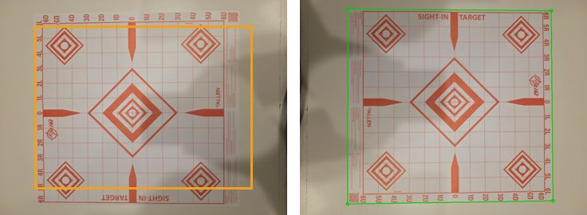
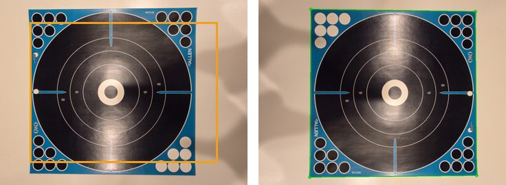
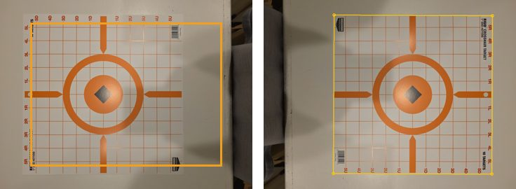
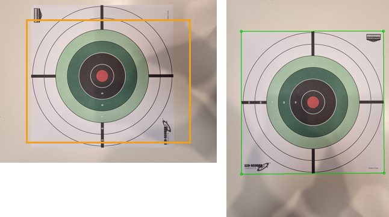
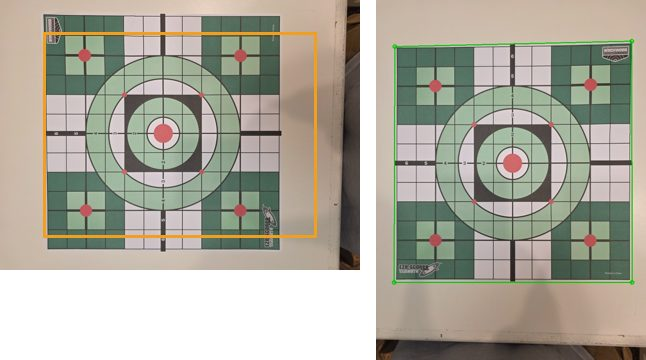

**Open: 22.** Most urgent today: **82, two commands that make Send to GroupLab live, and a first M220 print from the phone** (ten minutes). Then **81, the M834's printer check saved and one more print** (fifteen minutes). Then **56**, your printer's scale from one scan (ten minutes), and turn off the photo correction meanwhile. Then **50**, the camera test of 33 inside it. **54** the store-bought target whenever suits. **74**, a photo of a target on your kitchen table, whenever suits. **75**, redo two reference files and measure two sheets, fifteen minutes. **76**, scale markers on real paper, half an hour. **46** waits until Sunday 4 October. **61**, the Apple steps for GroupLab Dev, whenever suits. **62**, Firebase Test Lab, ten minutes whenever you choose. **57** and **58**, red bulls and store-bought targets, at the range. Then **33**, ten minutes with the Fold 7. Then 9, 16 and 20 (rewritten: eight sheets, and a page to print).
**THE RANGE KIT, SHORTER** (entries 366 to 370, for 4 or 5 October): print from `C:\Dev\grouplab-local\range-2026-10-04\`, starting with `CHECKLIST.pdf`; 7 pages (4 of them load sheets, all at once on the same paper). About an hour of shooting: store-bought targets, one sheet each of .22 LR subsonic, .22 LR high velocity and 6.5 Creedmoor, the C and E bulls. The scale markers wait in `later-at-home\`.
Working from the terminal, 4 October, at 71% of the week (a live reading, the week resets on 8 October, 02:00 UTC): entries 363, 364 and 365 are done, for nightly 167; the inbox is empty.
**Corner brackets** (entry 375, not a request): a 2 mm gap at the corners made the target read 2 to 3 percent large, 10 mm up to 12; now the printed codes alone give the scale, 0.03 to 0.13 percent at any gap or however roughly they are cut, and the corners come from the paper's own edges.

<!-- automation-week: written by scripts/automation-report.py each week; not a request -->
**This week, by itself** (not a request): backed up on 4 October (1686 MB, backup-2026-10-04); the restore test passed on 4 October; 0 archived submissions copied here; cleanup freed 1 MB; on the server, workers deleted or archived: archive 7; the server's own backup is from 2026-10-03; the Oracle boot volume backups are not seen by this report: Alan can check them in the Oracle console, under Boot Volume Backups, whenever he wants.
<!-- /automation-week -->

**CORNERS AND MARKERS, TUNED ON 14 SURFACES** (entry 371, not a request). GroupLab now drew your blank targets onto 14 made-up surfaces (black and grey tables, dark and light wood with seams, white and cream counters, cardboard, OSB, foam board, a shot-up backer, old targets, grass, gravel, carpet) in 112 photos. **Being honest about corners:** it used to call 86 outlines found, 21 of them wrong; now it says found only when two different ways of looking agree, and 38 found had 1 wrong. On your 15 real photos: before, 3 of 14 "found" were wrong (your floor); now 0 of 6, and 5 right ones start as "not sure" for you to check. **Touching or a gap:** brackets must touch the corners (each 2 mm of gap makes a 12 in target read about 2 percent large); bars can touch or lie apart, the scale is the same. The app's words say so. Still to try: the target's printed border, right angles, a live outline on the camera. Pictures: `C:\Dev\grouplab-local\surface-trial-2026-10-04\`.

**SCALE MARKERS, ALL FOUR** (entry 365, not a request; in nightly 167 or the first after it whose notes say so). On Targets, under
Scale markers: **corner brackets** (A), four L pieces cut from one page, give the scale, the camera's angle and the target's corners;
**scale bars** (B), codes 10.000 in apart (250 mm on A4), one for the scale, two in an L for the angle too; **board stickers** (C),
four on your backer measured once with Measure a board, then every photo of a target on it has its scale with nothing placed; and a
**bank card** (D), back side up, nothing printed, blanked out of the photo at once and never kept or sent. They count in Add a
store-bought target (Markers in the photo, chosen by itself) and when you mark a target by hand. Measured on computer-made photos,
before any printer error: board 0.015 percent, bar 0.06, brackets 0.07 on a 12 in target and 0.2 on a 23 by 35 in poster, card 0.15
(found in 30 of 40). Printed markers lean on your printer check; without one they can be off by up to 1.5 percent. Request 76 checks
all this on real paper.

**YOUR SEVEN REFERENCE FILES** (entry 364, not a request; in the library from nightly 167). Each file recognizes its own photo and none
of the others, and its bulls sit on the marks. **Added (4):** Birchwood Casey Shoot-N-C 12 in 5-bull sight-in (BC-34207), Eze-Scorer
12 in sight-in grid (your "Green"; BC-37087), Rigid crosshair, and the National Target Company ST-4. GroupLab now recognizes nine.
**Waiting (3):** the Allen splash bull and the Eze-Scorer bullseye (your "Green 2") took their scale from two points an inch apart,
which makes it only good to about 7 percent: every group on them would be up to 7 percent wrong for everyone. The Allen EZ Aim reads
12.8 by 13.6 in: by its own printed inch squares the paper is about 13.6 by 12.5 in, larger than the 12 by 12 in grid the package means,
so your scale looks right, but at 1.9 percent I would rather have a tape measure reading first. Request 75 asks for both. GroupLab now
says, before saving, when a scale is worse than 2 percent, and the two-points choice says to measure far apart. Your files were made
on a build that still showed photos sideways, so they are stored a quarter turn round; that does not affect recognizing them.

**THE M834 TOMORROW** (entry 363; needs nightly 166 or later, on the computer, Android and the iPhone). In order:
1. **The recording**: done 2026-10-05, thank you. It showed the app printed the C sheet 5.3 percent small; request 78 has GroupLab
   print it instead.
2. **A target through the Phomemo app.** Computer: Targets, a Letter sheet, Print on **Phomemo M834**, **Save for a printer app…** (a
   picture and a PDF, both named `-thermal-300dpi`). Phone: Targets, a sheet, **Share for a printer app**, then the Phomemo app. In the
   app choose 100%, actual or original size, never fit to page. Good: the corner squares sharp and black, the sheet's ruler line true.
3. **The darkness test page** (Targets, Thermal label printers, on the phone; **Save the darkness test page…** on the computer once Print
   on says M834): print it once at each darkness the app offers, write the setting on each in pen, scan them at 600 dpi.
4. **The printer check page** (the GroupLab printer check sheet) through the app, scanned at 600 dpi, opened in the printer check. Good:
   across and along both within about half a percent.
5. **Shoot or poke a target** printed on the M834 with a pen, photograph it with GroupLab, and look at the result.
Send back: the scans and photos into the same folder, and one line on anything that looked wrong.


**THE RANGE TRIP OF 4 OCTOBER, WHAT IT SHOWED** (entry 374; not a request):
- **The C bull on the phone**: you shot one at each of bulls 1 to 15 and every shot landed about an inch low and right, so each hole sat
  nearer the bull below its own, and GroupLab gave it that one. Read a row higher the holes fit exactly as well, so GroupLab now takes
  the reading that starts at bull 1, the order a sheet is shot in. All your C bull photos now match your drawing. The 6 ARC sheet's wide
  photo matched your drawing for all 25. GroupLab missed bull 10's hole (torn at the edge) and, on the E bull from 3 ft, read no code.
- **Chronograph**: CSV and XLS from the Xero's results are read the same, shot for shot; use either.
- **Why the phone stayed on 159**: its automatic checks ran only when the app started and in a background job that waits for unmetered
  Wi-Fi, and the start-up check fired before Android gave the app its network. It now checks again each time you come back to it, retries,
  and shows "GroupLab N is out, Update now" on screen. Before a range trip: Settings, Update now (now step A0 of the paper protocol).
- **The five crash records** are not crashes: each is Android ending the app normally (swiped away, reclaimed, or replaced by an update).
- **Fixed**: panning a zoomed target no longer drags the screen; the "updated" note hides by itself; a selected shot says how far it is
  from its own bull. **Paper and "what was behind it" do not help detection**: they are recorded only, so hole sizes can later be compared
  by paper and backing. Whether to keep them on the setup screen is in the list below.
- **DESIGN NEEDED** (for planning's concepts; nothing built):
  1. **Tabs to open several targets at once** (Unholy). Today the window holds one target; Sessions switches between them.
  2. **The Groups section** (Unholy finds it unclear). Today: "Shots per bull" says how many shots each bull took, which decides whether
     one-to-one matching is forced; "Its row" and "Its column" choose a whole row or column of bulls for a load; "Bulls you fired at" is
     what lets the whole-sheet offset run on a part-shot sheet (entry 130). Removing it needs those three said some other way.
  3. **Shots as one row per shot** (bull and shot number dropdowns, Delete for "Not a shot"). Today "Not a shot" keeps the mark and its
     provenance and can be undone; a Delete would lose that record.
  4. **Lines from each bull to its holes, and tap a bull to add or remove its shots** (you, at the range). Today the lasso puts chosen
     shots on a bull (desktop); the phone has no way to give a shot to a bull but moving it.
  5. **The "Selected shot" area's dropdown** (the reason a shot is left out) and **Show in folder** (opens the saved session's folder):
     Unholy would remove both.
  6. **Barrels under their rifle** instead of their own section. Today rifles, barrels and loads are three lists, a barrel chosen per
     session.
  7. **Paper and "what was behind it" on the setup screen**: keep (for the hole size studies) or remove.

**THE WEEKLY BUDGET, ENTRIES 360 AND 361** (not a request): Code now runs from a terminal, where the status line keeps the week's
reading fresh every minute. A check before every action refuses to go on at **85%**, unless a block already under way (above all a
publish) has marked itself as finishing in the last 45 minutes, and refuses everything at **88%** whatever. Blocks are planned to end
under 85%.

**ADD A STORE-BOUGHT TARGET, WHAT WAS WRONG AND WHAT CHANGED** (entry 362, not a request; arrives in nightly 165)

*What was wrong.* Three things. Your photos were shown the way the camera stored them, not the way they were taken: four of the five
carry a "turn this 180 degrees" or "turn this a quarter" tag, and that screen ignored it. The corner finder was the one built for
GroupLab sheets, which looks for the largest light area by brightness alone; on your white counter that area was the counter itself,
which runs off the edge of the picture, so it gave up on every photo and showed the same fixed rectangle each time. And the picture
could not be zoomed.

*What changed.* The photo is shown the right way up, and **Rotate left** and **Rotate right** turn it a quarter turn on the Photo and
Straighten steps (R and Shift R on the computer). A new corner finder looks for the paper's straight edges and its colour, not only its
brightness: target paper is bluer than a cream counter, and a shadow changes brightness far more than colour. On your five photos it
finds four outright, within about ten pixels in a 4000 pixel photo, about twenty five on one corner of the green grid. On the Rigid
crosshair the paper's edge barely shows against the counter; it says so and starts the corners within about twenty pixels of the right
place, so Next is usually all it needs. Where it cannot find them it now says why. Scroll or pinch to zoom; while you drag a corner a
magnifier above your finger shows the point under it with a crosshair; and a corner let go lands on the clear corner of the picture
nearest it, with Undo. The same finder handles four of the five 600 dpi Birchwood scans on this computer (the fifth is larger than the
scanner, so it has no four corners in it).

*Your second set* (the ST-4 and the Shoot-N-C 12 in sight-in): both found, and both are now in the tests, so six of your seven photos are found. The Shoot-N-C sat next to the counter's edge, which at first was taken for the target's side; that is fixed. With the names and 12 by 12 in sizes from your package photos, the five packaged targets go through all five steps to a saved file. One thing still for you to do by hand: on the two sight-in grids and the splash bull, GroupLab does not find the bulls by itself, so tap each one on **The bulls** step.

*Before and after*, left as the screen showed it, right as it finds it now:






**FOR FENIX, HIS TWO PHOTOS** (entry 354, not a request; to pass on): "Thanks for the two photos, they found three real problems. On the
load development sheet GroupLab marked 32 spots for your 25 shots: the torn top corner and the curled top edge where the board showed
through, the printed 'Print at actual size' line along the lifted bottom edge, and the bull numbers '25' and 'S2', which the photo's
slight blur made look like small holes; on some readings the square marker beside the hole between bulls 12 and 13 was counted as a
second shot. GroupLab now ignores marks in a photo's margin unless they are clean round bullet holes, knows its own printed numbers and
words, and no longer counts a marker's edge as a shot: on your photo it finds 24 of your 25 holes and nothing else. The one it still
misses, on bull 23, touches a marker; add that one by hand. The '49 of 29 need review' counter counted questions instead of shots; it
now counts shots. The diamond sheet failed for a different reason: you made it with the target generator and printed it without saving
it, so GroupLab had no copy and refused it, although the codes on the sheet read fine and hold the whole design, and it wrongly said the
codes could not be read. GroupLab now reads the sheet's design from those codes and finds all 25 holes; check a few white centres it
marks on the wavy left side before you accept. Both fixes are in nightly 162, published 3 October."

**WHAT THE SENDING SETTINGS DO, AND WHAT HAPPENED TO FENIX'S** (entries 354 and 355, not a request; to read and pass on)

*What each setting sends, and when.*
- **Send every target automatically**: a target goes by itself when you press **Accept and analyze**, at the level you chose. **Ask me
  each time**: a short panel under the figures offers it then, and nothing goes until you press Send. **Never**: nothing goes. A
  picture GroupLab could not read, or one you leave before Accept and analyze, is never sent, whatever the setting.
- **Testing only**: used to test and improve detection, never published. **May be published**: may also be published in GroupLab's
  public test data and research, only after it has been looked at.
- **A target** carries: the image with its pixels untouched and every location, date, time and serial number taken out; what GroupLab
  found before you changed anything; what you changed (every mark moved, added, deleted, split, reassigned or excluded); what you told
  it (caliber, distance, rounds fired, paper, backing); the figures and how the scale was set; that session's log with file names
  reduced to a code; and the version. A JPEG or PNG goes as it is; anything else (an iPhone's HEIC, say) goes as a lossless PNG, and
  one still over 30 MB is not sent and says why. One that cannot go now is kept and tried at each start for seven days.
- **Send error reports automatically**: a report goes when GroupLab hits an error or closes without shutting down. It carries the
  version and the system, the error and where in GroupLab it happened, and the names of the last few things done. Never a photograph, a
  file name, a location, or anything typed. A sheet that simply will not read is not an error to GroupLab, so it sends no report.
- **Never in either**: a location (never read at all), your name (only a credit you type yourself, on the website), or a file path.

*What happened to Fenix's.* Nothing from his desktop reached the server: the private archive for October holds only your own app
submission of 1 October and his website upload of the two photos, and no error report came from him. The likeliest reason, from the
code: a target goes only after **Accept and analyze**, and he stopped at the review of the 5x5 sheet (29 marks for 25 shots) and the
diamond sheet never read, so there was nothing to send, and a sheet that fails to read is no error. That cannot be proven without his
log; request 70 asks for it. The words in GroupLab's settings and on the "What GroupLab sends" page now say Accept and analyze plainly.

*What happens to a submission afterwards.* The server's receiver puts it in quarantine; within minutes the intake worker rebuilds the
picture from its pixels (dropping everything else) and moves it to a ready folder; the archive worker copies it into the private
archive on GitHub (never public), proves the copy, and deletes it from the server. Your pull also copies it to this computer. One the
server refuses is deleted after 7 days, one never archived after 60. **What Code does with them today:** reads them by hand when an
entry names them, and adds them to the scoreboard as test cases (Fenix's two are being added now). **Not built yet:** the automatic
comparison of GroupLab's marks with the person's corrections (DETECTION-LEARNING-STUDY.md section 6 describes it as planned).
**Published:** nothing so far; a "may be published" target could be, by Code with your approval, after a look at it.


**URGENT, FENIX'S REPORT ON THE IPHONE** (entry 353, not a request): on TestFlight builds 157 to 159, taps on the iPhone did nothing
while a box had been typed in: Continue and Done for the caliber and distance, Take a picture, Choose photo, and a suggested caliber
picked the wrong one. **What broke:** the fix for your friend's floating keyboard bar closed the keyboard the instant a finger touched
the screen, so the page moved before the finger lifted and the button under it never saw the tap. **Why the checks missed it:** every
automatic check pressed buttons directly, never the way a finger does, down then up, so the page never moved between the two. **Fixed:**
the keyboard now closes only after the finger lifts and the button has done its job; tests now tap the way a finger does, and they fail
on the old code. **Install build 160 from TestFlight:** both groups have it as of 2 October 19:51 your time; Fenix and Unholy can update now. Real taps on Apple's iPhone simulator and an Android emulator now check this with every nightly, and all pass.

**TONIGHT'S LIST, 2 OCTOBER** (entry 352, not a request): done, one worker. Reading a target is now about twice as fast on the computer
and a quarter faster on a phone, every measurement exactly as before. Find holes no longer takes most of the Eze-Scorer's printed
numbers for shots (6 false marks on a clean sheet down to 2, the logo's letters). A damaged or oversized chronograph or fingerprint file
is refused with a plain sentence; a damaged spreadsheet could close GroupLab before. Every phone screen is checked on Apple's iPhone
simulator with each nightly, and now on an Android emulator too (its first run is being repeated after a fix). **One draft to read,
whenever suits:** "Printed numbers are not holes" (website/research/printed-numbers-are-not-holes.md, unpublished): why a scoring
target's bold 6s fooled the hole finder and what tells them apart, from your blank scans and made-up holes only. Say "publish it" or what
to change. All of it is in **nightly 158**, and both phone sweeps pass.

**ADD A STORE-BOUGHT TARGET, AND CHANGING A PAIRING** (entries 348 and 351, not a request): both built as you chose, concept A,
in **nightly 156**. On the phone and the computer, Targets has **Add a store-bought target**: five steps, from a photo of the blank
target to a small file of its fingerprint, name, size and bulls (never the photo), saved or shared for you to send. That nightly is the
one to try your Cabela's and Walmart targets with; the phone gets it from GroupLab Dev's own update, Google Play's test, or TestFlight
once Apple has it. Changing what a chronograph reading goes with is now a row per reading with one mark to tap, the same choices on
both. Also in nightly 155: a target added to the library later reaches every copy without a new build.

**YOUR FRIEND'S TESTFLIGHT FEEDBACK** (entry 350, not a request): retrieved; you did not need to do anything. It came in on 1 October
at 12:50 UTC from an iPhone on build 150, both on the Targets screen, and was filed privately an hour later (issues 15 and 16).
1. "The Done button and bar ended up floating over the app and clicking done did nothing": after the number pad closed, the bar that
sits on it stayed behind in the middle of the screen. 2. "Keyboard doesn't go away making the targets": the number pad stayed up and
nothing closed it. Both came from GroupLab waiting for the iPhone to say when the keyboard opened and closed, which it did not always do.
Now a tap anywhere outside a box closes the keyboard, Done always closes it and clears the bar, and the bar removes itself as soon as no
box is being typed in. **Correction, 2 October 10:40 UTC:** it did not reach TestFlight in nightlies 154 to 156, because one line of the fix did not build for the iPhone and that build failed by itself while the rest published. Fixed: **nightly 157** built for the iPhone again and carries it to TestFlight, with everything 154 to 156 had. Also changed: the regular check for new
feedback looked back only an hour but GitHub runs it every few hours, so it now looks back a day (nothing is ever filed twice).

**YOUR USAGE** (entry 317, not a request): 1 October ended at 0.65 billion tokens with two workers; 2 October so far 0.04 billion,
this session and one worker.

**YOUR OVERNIGHT LIST, 1 OCTOBER** (entry 342, not a request): done apart from one item. In nightly 152: GroupLab recognizes the five
store-bought targets you scanned, names them, places the bulls and sets the scale with a warning to check it, and asks 6 or 8 inch for
the Shoot-N-C only when the picture cannot tell. In the next nightly: the phone reads a sheet's codes in about half the time, with every
measurement unchanged; every box on the computer has a name a screen reader reads, the keyboard reaches and presses every button, and
the Targets screen fits a small window. An imported Garmin Xero string now proposes which shots were this group from its own timing,
and says why. The download page names the Store's version (0.2.0). `grouplab target-reference` makes a fingerprint from a photo of a
poster on the computer; its screens wait for planning's drawings (69). **Next, and what each waits on:** the phone sweep on the
emulators in CI (nothing; first tomorrow); the fingerprint and pairing screens on the phone (planning's concepts, 68 and 69); where a
newer fingerprint library is published (planning, question 80); a Store submission (your cadence, 66); proving the 31 features (one
sitting, docs/PROOF-CHECKLIST.md, now one ordered list). The day stopped at entry 317's share.

**TESTFLIGHT FEEDBACK** (entry 326, not a request): thank you for the token. Every tester's screenshot, comment and crash is now
filed privately as it arrives, and I fix each in turn; Unholy's two are filed and linked to their fixes below.

**UNHOLY'S TESTFLIGHT REPORTS** (entry 328, not a request): both fixed, in **nightly 147**; Unholy can retest on it once it reaches
TestFlight. 1. "Keyboard covers the fields": on the iPhone the number pad hid the distance on the caliber question, and it has no return
key. Now, on every screen with a box to type in, the page moves up so the box and its Continue button stay above the keyboard, a bar on
the keyboard says Next (to the next box) or Done (keeps what was typed and closes it), and tapping outside a box closes it too.
2. "This text is nonsense": the note under a 95 picture said the markers agree "only to 0.005 in, where a flat sheet gives 0.005". The
difference was too small to matter, so that note no longer appears unless the sheet is curled enough to cost the score, and then it
says "The sheet looks slightly curled. GroupLab allowed for it; flattening the sheet would measure a little better." Two other notes
that could print the same number twice were fixed the same way.

**WHERE TO LOOK** (entry 323, not a request): **Velocity and the vertical** is built as you chose, Desktop B and Phone B. On the
desktop it is the block under the group's figures; add a group's chronograph readings on Ballistics, Chronograph, and it shows how much of
the vertical is velocity, with the amber band on the group picture and its Velocity band switch beside CEP and Extreme spread. On the
phone it is the card above All figures, with Add readings and a Velocity band chip under the plot. It is in the next nightly; the phone
check rides along with request 50's sitting.

PUBLIC BETA AND THE STORE (entries 335 to 337, not a request): Apple approved the Public Beta, and both TestFlight groups now get each
build by themselves: build 148, which carries Unholy's two fixes, is in GroupLab Team and was added to the Public Beta and submitted
automatically. Unholy can install 148 from TestFlight now to retest the keyboard and the curl note. GroupLab is in the Microsoft Store
(request 38 closed). With your approval, the TestFlight invitation and the "Get it from Microsoft" badge are on the download page, in the
README's download table and at the start of the guide. The download page is also redesigned as you chose (entry 338, concept A): pick your device at
the top, the newest build on the left and the steady store copy on the right, everything else folded; grouplab.org/download/ once
this push is live, and /download/?device=mac (or iphone, android, linux, windows) to point at one device.

THE LEVEL AT THE RANGE (entry 321, 22:55 UTC, not a request; in the next nightly): the camera's level now works with the phone upright
at a target on its backer as well as flat over a table, choosing by itself; the word "Upright" or "Looking down" sits under the crosshair,
and once the sheet's corner codes are seen, the sheet's own angle decides, so a leaning backer still reads as square. To try at the next
sitting: both positions, and the phone turned sideways. Also new: "Find holes (Experimental)" when marking a target GroupLab did not
print, on the computer and in GroupLab Dev; and a mark much bigger than your bullet is ringed in amber on the result for you to check.

## 82. Send to GroupLab live, and the M220 printing from the phone, about ten minutes (entry 386, question 90)

**Why:** Send to GroupLab (Settings, About, on the phone) sends your logs and a note straight to the project, but the server's error worker
has to be reinstalled before it opens an issue for them; this session cannot reach the server. And the phone can now print scale labels
straight to the M220 over Bluetooth, which no real M220 has done yet.
**Steps:**
1. In MobaXterm, the two commands at the top of `docs/notes/panel.md` (an scp, then an ssh with the dry run and the install).
2. With nightly 177 or later on the Fold 7 or the tablet: the M220 on, with the 70 x 80 roll; GroupLab, Targets, Scale markers,
   **Print two scale labels on the Phomemo M220**. Allow nearby devices if asked, then press it again.
**A good answer:** what the install said, and whether two labels came out (or what the screen said). If they came out, measure one with
a caliper across the two codes of a row: 60.0 mm centre to centre is right.

## 81. The M834's printer check, saved, and one more print to confirm it, about fifteen minutes (entry 385)

**Why:** your two prints on nightly 175 printed whole and cleared the tear bar, and your measurements show the M834 prints true across
the paper (+0.31 percent) and 0.8 percent short along the feed (-0.80 percent by caliper and by ruler). Saved as the M834's printer
check, every photo of a GroupLab sheet printed on it measures in real inches, across and along the feed scaled separately. A second
print says whether the 0.8 percent repeats; if it does, GroupLab will stretch its own M834 prints along the feed to make them true.
**Steps,** on the Fold 7 (and on the computer too, if you photograph or open sheets there):
1. Settings, under **Printers**, check a printer: name it **Phomemo M834**, choose **Digital caliper**, and enter your numbers from
   today's check page in millimeters: **across 150.47**, **down 148.81**. GroupLab shows about 100.3 by 99.2 percent.
2. Print **GroupLab Printer Check, Letter** on the M834 once more (Paper in the M834: A continuous roll), and measure the same four
   numbers: the caliper across and down on the dashed lines, and the ruler across the bottom and down the side.
**A good answer:** the four numbers from the second print. Thermal roll paper curls: flatten the sheet under a book before measuring.

## 76. Scale markers on real paper, about half an hour, whenever suits (entry 365)

**Why:** every accuracy figure for the four scale markers comes from computer-made photos with a perfect print; real paper, a real
printer and a real card decide whether they hold.
**Steps,** with nightly 167 or later (Targets, Scale markers, on the computer):
1. Print **corner brackets** and **scale bars** on Letter at Actual size, with your printer check in place if you have one. Cut them out.
2. Print **board stickers**, stick the four of set A near the corners of a target backer, then **Measure a board** with any GroupLab
   sheet lying on the backer among them.
3. Photograph one target you know the size of (a Shoot-N-C 12 in, say), from where you would normally stand, four times: with the
   four brackets tucked against its corners; with one bar along its bottom edge; on the measured backer with nothing else; and with a
   bank card back side up beside it. Then open each in Add a store-bought target and write down the line under Markers in the photo.
**A good answer:** the four photos in `C:\Dev\grouplab-local\scale-markers\`, and the four lines GroupLab showed, such as "Scale from
4 corner brackets in the photo: good to about 0.15 percent."

## 77. Scale labels on your M220, twenty minutes, whenever suits (entries 372 and 380)

**Why:** the labels are measured on computer-made photos only; your printer, your roll and your camera decide whether that holds. On the
50 x 30 mm roll you keep loaded, a label's two codes are 40 mm apart rather than the 70 x 80 label's 60, so its scale is about one and
a half times as uncertain: about 0.15 percent where the 70 x 80 label typically gave about 0.1 (scaled from that measurement, not
measured on its own).
**Steps,** with nightly 173 or later on the computer (or nightly 175 or later on the phone, which now has the same choice):
1. Targets, Scale markers: set **Label size loaded** to **50 x 30 mm** (it is remembered), then **Save four scale labels for the
   printer's app** (on the phone, **Share four scale labels for the printer's app**). Print all four PNGs from the Phomemo app at 100
   percent on the 50 x 30 roll.
2. Stick two on a blank store-bought target, at opposite corners, flat, where you would not shoot, and one on a GroupLab sheet.
3. Photograph each, square on, and put the photos in `C:\Dev\grouplab-local\m220-labels\`.
**A good answer:** the photos in that folder. (The printer check label for the M220 comes in a later build.)

## 75. Two reference files again, and a tape measure on two sheets, fifteen minutes, whenever suits (entry 364)

**Why:** the Allen splash bull and the Eze-Scorer bullseye files took their scale from two points an inch apart, so they are only good
to about 7 percent and cannot go in the library; and two sheets need their real size to settle what the photos say.
**Steps:**
1. In GroupLab on the phone (nightly 166 or later), Targets, **Add a store-bought target**, once for the **Allen splash bull 55124A**
   and once for the **Eze-Scorer bullseye**: on How big is this target?, choose **Its printed size** and type **12 by 12** (both
   packages say 12 in). Name them "Allen splash bullseye 55124A" and "Eze-Scorer 12 in bullseye". Save and share the two files.
2. With a tape measure, the outside of the paper of the **Allen EZ Aim 55134A** and of the **National Target ST-4**, width and height,
   to the nearest sixteenth.
**A good answer:** the two new files in `C:\Dev\grouplab-local\target-references\`, and four numbers, such as "EZ Aim 13 5/8 by 12
1/2, ST-4 15 by 17".

## 74. One or two photos of a target on your kitchen table, five minutes, whenever suits (entry 362)

**What:** the photos you took of a blank target on the natural wood table, the ones that failed the same way as the counter, sent the
way the counter photos came (into `C:\Dev\grouplab-local\commercial-targets\`, any folder name).

**Why:** the new corner finder was checked on your white counter and on flatbed scans, never on wood. Wood grain is full of straight
lines, which is exactly what could fool it, so one real wooden photo is worth more than any guess.

**A good answer:** one or two photos, all four corners of the target in each. Nothing else needed.

## 72. For Unholy's 4x6 label printer: steps to pass to him, once you have its model number (entries 358 and 359)

**Opened 2026-10-03, rewritten 2026-10-04 (entry 359: the 4x6 printer is Unholy's, not one you are buying).** Nothing to buy. **Waits
until** you have the printer's model number from Unholy; then send him the steps below, and his three answers come back to this folder.
**Why:** GroupLab will print straight to a 4x6 label printer over Bluetooth, with no maker's app, and to do that it must know how his
printer appears to a phone.

**The steps for Unholy, as written for someone who has never used nRF Connect:**
1. On your phone, install **nRF Connect for Mobile** (by Nordic Semiconductor; free, on Google Play and the App Store).
2. Turn the label printer on and keep the phone next to it.
3. Open nRF Connect. On the **Scanner** tab, press **Scan**. A list of nearby devices appears. The printer may be listed by a code or a
   serial number rather than its model name; it is the one whose signal number gets closest to zero when the phone touches the printer.
4. Press **Connect** beside it. After a few seconds a list of "services" appears. Take a screenshot; scroll down and take another until
   the whole list is captured. If the printer never appears in the Scanner list, that is an answer too: say so.
5. Send the screenshots, the printer's model number, and the size of labels you use (4x6 inch, or 100 by 150 mm).

**A good answer:** Unholy's screenshots, model number and label size, saved in `C:\Dev\grouplab-local\printers\`, or "it does not
appear in the scan".

## 70. Fenix's report package from the desktop, five minutes for him, whenever suits (entry 354 section 4)

**Opened 2026-10-03.** **Why:** nothing he read on the desktop on 2 October reached the server, and no error report did either. The code
says a target goes only after Accept and analyze, so the likeliest reason is that he never got that far; his log would prove it, and show
whether anything was tried and refused. **Steps for Fenix:** on the desktop, the gear at the bottom left, **Report a problem**, then send
the zip it makes to you (it has the log and no photographs unless he adds them). **A good answer:** the zip, saved anywhere on this
computer, and its path.

## 67. Turn off GroupLab Team's automatic distribution in TestFlight, about one minute, whenever suits (entries 319, 320 and 335)

**Opened 2026-10-01.** **Why:** both TestFlight groups now get each build by themselves: build 148 reached GroupLab Team and the Public
Beta with nobody touching App Store Connect, so the group's own automatic distribution, which you left on while Apple reviewed the first
build, is no longer needed, and with it off the two groups can never drift apart. **Steps:** in App Store Connect open Apps, GroupLab,
TestFlight; under Internal Testing choose GroupLab Team; in the group's settings turn off automatic distribution of new builds. **A good
answer:** "done". If the setting is named differently, a screenshot of the group's page is enough.

## 62. Firebase Test Lab: GroupLab Dev on real phones every day, free, about ten minutes, whenever you choose (entry 318)

**Opened 2026-09-30.** **Why:** once this is done, every day GroupLab Dev reads the sample scan and walks every tab on three real phones
(a Samsung, a Pixel, and a Xiaomi or Oppo, whichever Test Lab has) and one virtual phone, and I read the screenshots and logs. That is
where differences between phone makers show up, without you buying phones. It stays on the free plan, which has no billing at all, so
nothing can be charged. The workflow is ready and waits for these steps; until then it says "not set up" and tests nothing.

1. Open https://console.firebase.google.com signed in with your Google account. **Add project**, name it `grouplab-testlab`, and turn
   Google Analytics **off**. Leave it on the free Spark plan; never choose Upgrade.
2. In the project, open **Test Lab** (under Run or Release and monitor) once, so it is switched on.
3. Open https://console.cloud.google.com/apis/library/testing.googleapis.com with the `grouplab-testlab` project chosen at the top and
   press **Enable**; then the same for https://console.cloud.google.com/apis/library/toolresults.googleapis.com.
4. Open https://console.cloud.google.com/iam-admin/serviceaccounts (same project), **Create service account**, name `grouplab-ci`.
   Give it exactly two roles: **Firebase Test Lab Admin** and **Firebase Analytics Viewer**. Nothing else. (Those two are what Google
   documents for running tests from CI; they can also see this project's storage, which holds only test results.)
5. Open the new account, **Keys**, **Add key**, **Create new key**, **JSON**. A file downloads.
6. In PowerShell, with the file's real name in the first line (the project ID is shown on the project's home page; it may have a
   short suffix, such as `grouplab-testlab-a1b2c`):

```
Get-Content -Raw "$HOME\Downloads\grouplab-testlab-XXXXXXXX.json" | gh secret set FIREBASE_TESTLAB_KEY -R oRAirwolf/grouplab
gh variable set FIREBASE_PROJECT_ID -R oRAirwolf/grouplab --body "grouplab-testlab"
Remove-Item "$HOME\Downloads\grouplab-testlab-XXXXXXXX.json"
```

   A good result: the first two print nothing or a line saying the secret or variable was set; the key file is then gone from Downloads.
7. Tell planning "request 62 done". I start the first run by hand and put what the phones showed here.

## 61. iOS: the Apple steps for GroupLab Dev, about twenty minutes, whenever suits (entry 315)

**Opened 2026-09-30.** **Why:** entry 315 builds everything that lets me drive and watch the app without your hands (the automation
bridge, scenario files, the replay camera) into a separate iOS app, GroupLab Dev, so the GroupLab that Apple reviews carries none of it.
Until these exist it is built and tested on the simulator only. The distribution certificate and the App Store Connect key you already
set are reused. At developer.apple.com, Certificates, Identifiers & Profiles:

1. Identifiers, the + button, App Groups: create `group.org.grouplab.app.dev` (description: GroupLab Dev).
2. Identifiers, the + button, App IDs, App: Description `GroupLab Dev`, Bundle ID **Explicit** `org.grouplab.app.dev`, turn on App
   Groups, Configure, tick `group.org.grouplab.app.dev`, Continue, Register.
3. The same again for the share extension: Description `GroupLab Dev Share`, Bundle ID `org.grouplab.app.dev.share`, App Groups with
   `group.org.grouplab.app.dev`, Register.
4. Profiles, the + button, Distribution, **App Store Connect**: App ID `org.grouplab.app.dev`, the same distribution certificate, name
   it `GroupLab Dev App Store`, Generate, Download. Then the same for `org.grouplab.app.dev.share`, named `GroupLab Dev Share App Store`.
5. In Git Bash, in the folder with the two downloads:
   ```
   base64 -w0 "GroupLab_Dev_App_Store.mobileprovision" | gh secret set IOS_DEV_PROFILE -R oRAirwolf/grouplab
   base64 -w0 "GroupLab_Dev_Share_App_Store.mobileprovision" | gh secret set IOS_DEV_SHARE_PROFILE -R oRAirwolf/grouplab
   ```
   (use the downloaded files' own names if they differ).
6. In App Store Connect, Apps, the + button, New App: iOS, name **GroupLab Dev** (or **GroupLab Dev Build** if that is taken), Bundle ID
   `org.grouplab.app.dev`, SKU `grouplab-dev`, full access. Then in its TestFlight tab add an internal group named **GroupLab Team**. It
   is never added to an external group, so Apple never reviews it.

**A good answer:** "done", and `gh secret list -R oRAirwolf/grouplab` shows IOS_DEV_PROFILE and IOS_DEV_SHARE_PROFILE.

## 59. TestFlight: GroupLab on your iPad mini, and the two testers' invitations, whenever suits (entries 290 and 310)

**Updated 2026-10-01: mostly done.** Both groups exist, Apple approved the public beta, and the invitation is published (entries 335 to
337); each new build reaches both groups by itself, and request 67 covers turning the team group's own distribution off. What may be
left: on the iPad mini, install Apple's TestFlight app and GroupLab from the invitation; and, if you still want them in GroupLab Team
rather than the public beta, invite Unholy and Fenix in Users and Access with the Marketing role, limited to GroupLab, then add them to
the group. **A good answer:** "GroupLab is on the iPad" and whether it opened, or "nothing left".

## 58. Store-bought targets for the detector, whenever suits you, about ten minutes a target (entry 308)

**Updated 2026-10-01 (entries 325 and 327): in part. Thank you for the five Birchwood Casey blanks** (the 6 in and 8 in Shoot-N-C
bullseyes, the sight-in grid, the crosshair, and the Eze-Scorer), each scanned at 600 dpi with its package photographed. They are on this
computer only and are already being used: GroupLab looks for holes on each clean sheet, where every mark it finds is a false one. **Still
needed, whenever suits you:** shoot each one, then scan it again with the sheet in **the same corner of the glass as its blank** (your
scanner stops at legal size, so the scan holds the same part of the sheet), note how many shots you fired, and take one phone photo of
each whole shot sheet. A good answer: a `shot.png`, the shot count in `notes.txt`, and the photo, in each target's folder.

**Opened 2026-09-30.** **Why:** each blank and shot scan of another maker's target becomes a hard test of finding holes on any target,
kept on your computer only, never committed or shown. **Needed:** yes to buying several that fit on the scanner glass; a spread helps
most: plain black bulls, a fluorescent or splatter target, colored diamonds, and a small grid target. For each one:

1. Scan it at 600 dpi before shooting it.
2. Shoot it, and note how many shots.
3. Scan it again at 600 dpi.
4. Take two or three phone photos, one square on and one at an angle.

Put each target's files in its own folder under `C:\Dev\grouplab-local\commercial-targets\` (for example `splatter-1\blank.png`,
`shot.png`, `photo-1.jpg`) with a line saying how many shots. **A good answer:** "done, N targets".

---

## 57. Red bulls on paper, about fifteen minutes (entry 297)

**Opened 2026-09-30.** **Why:** the sheets can now be printed with red or blue bulls, and GroupLab finds the color from the photo; the
made-up tests read red and blue as well as black, and a real sheet under real light is the proof. **Needed,** once the next nightly is out:

1. In Targets choose GL-CF25-LTR, set "Bulls in" to Red, print it at Actual size.
2. Shoot five shots, or poke five holes with a pen.
3. Take three phone pictures with GroupLab: one with the torch on Auto in a dim room, one under warm indoor lamp light with the torch
   off, and one in daylight.
4. If you have a black-and-white printer, print the same sheet on it too and say whether the bulls read clearly as gray.

**A good answer:** "done"; GroupLab Dev keeps the pictures, and Code reads them from the phone at the next sitting. Every hole found in all
three, with no marks where there is no hole, is the result hoped for.

---

## 56. Your printer's scale, measured properly: one sheet printed now, scanned at 600 dpi (entry 291), about ten minutes

**Opened 2026-09-29.** **Why:** the scale test is done (request 53 has the results). Your three scans show your printer printed those pages
at its true size, within a tenth of a percent. The card photos read it about 0.4% large, and that is the figure GroupLab saved, so photos
since then read groups about 0.4% small. The card method is what needs work, not your printer. And you have calibrated the printer since.
**Needed:**

1. Until you do step 2: in GroupLab Dev, Settings, turn off "Correct photographs by the chosen printer's scale". That is closer to the truth
   than the saved +0.4%.
2. On the computer: print any GroupLab sheet now at Actual size, scan it at 600 dpi, and in GroupLab on the computer choose Printers,
   Add a printer, Scanner, and pick that scan (entry 303). Scanner checks agreed with each other to within 0.07%.
3. Also in Printers, press "Printer calibrated or serviced" on the old printer check, so every result it corrected says so.

**A good answer:** "done", or the percentage the Scanner check showed.

---

## 54. A plain target for the home page's picture, five shots, about fifteen minutes at the range (entries 278 and 308)

**Opened 2026-09-28; clarified 2026-09-30 (entry 308).** **Wanted:** a store-bought target with no brand name or logo printed on it, or
one whose logo sits where it can be cropped off (a plain bull or diamond on white is ideal). Shoot five shots at it, then scan it at 600
dpi or take one square-on phone photo in daylight, and put the files in `C:\Dev\grouplab-local\store-target\`. **Why:** the home page's
"Your own targets" shows a sample GroupLab drew itself until a real one exists; GroupLab never shows or names another maker's target on the
site, so your 20 September photos of the orange target stay test material for the detector only. **A good answer:** "done", and the
distance and caliber if you know them.

## 50. One more short sitting with the Fold 7 and the tablet, later (nothing to do yet)

**Added 2026-09-28 (entries 253 and 255): about thirty minutes now, and the camera test of request 33 is part of it.** Have a printed
GroupLab 5x5 sheet on a table in ordinary room light for the camera test. The sitting also retakes every phone and tablet picture on the
website (entry 253). When the checks that need nobody are done, the panel and the top of this file give you a few short steps with the
Fold 7 over that sheet; nothing else needs your hands.

**Added 2026-10-01 (entries 321 and 322), two more things at that sitting, about five minutes:** the camera's level with the phone
upright at a sheet taped to cardboard as well as flat over the table, in portrait and turned sideways; and the same sheet photographed
from 1.5, 2, 2.5 and 3 ft (45, 60, 75 and 90 cm), so the distance at which GroupLab stops reading the corner codes is measured on a real
phone. The steps come in the panel and at the top of this file when the sitting starts.

**Added 2026-10-01 (entry 323), one more look, about two minutes:** the new Velocity and the vertical card on the Fold 7's cover screen,
with readings pasted in, to see that nothing in it is squeezed and its band chip turns the band off.

**Opened 2026-09-28 (entries 250 and 252).** **Needed:** the phone and the tablet on the charger, unlocked, Wireless debugging off and on,
Stay awake on, for about twenty minutes, **once a line at the top of this file starting "READY FOR THE PHONE AND TABLET:" says so**; not
before. **Why:** three things can only be checked on the devices: the Targets preview now showing a sheet's words and Letter above A4 on the
phone (entry 250), the new C3 zeroing grids on the phone, and how long "Shots Needed to Zero" takes to work out on the Fold and the tablet
(entry 252, which asks for those timings). **A good answer:** nothing written; the devices on and reachable when the line appears. Until
then they can stay put away.

## 46. On or after Sunday 2026-10-04 12:00 UTC: one look at the Oracle backups

**Opened 2026-09-27 (entry 235). Not before Sunday 4 October, 12:00 UTC; then one minute.** In the Oracle console, **Storage**, **Block
Storage**, **Boot Volume Backups**: is there a backup of type **Full** created on 4 October, a little after 12:00 UTC, that expires about
**17 October**? That is the first Full of the schedule you changed on 27 September, and it is all that is needed to know the change worked.

A good answer: "Full, 4 October, expires 17 October", or what the list shows instead.

## 33. The Fold 7's camera: ten minutes with a printed sheet

**2026-09-28 (entry 255): this is now done in request 50's sitting**, while the Fold 7 is connected anyway, with GroupLab Dev rather than
the spike. The steps below are kept as the record; you will be given shorter ones at the time.

**Opened 2026-09-25. Entry 219 item A2.** The capture screen is built: the camera's preview inside GroupLab, one instruction at a time
(move back, move closer, less angle, hold steadier, more or less light, flatten the paper), the lens by zoom, tap to focus, and a shutter
that fires by itself when everything holds. It needs a real camera and a real sheet to measure. Everything is logged to a file on the
phone, so nothing needs watching.

**You need:** the Fold 7 with Wireless debugging on, and a printed GroupLab 5x5 sheet on a table in ordinary room light.

**1. In PowerShell on this machine**, with the address and port on the phone's Wireless debugging screen:

```powershell
$adb = 'C:\Dev\tools\android-sdk\platform-tools\adb.exe'
& $adb connect <address:port shown on the Wireless debugging screen>
$run = gh run list -R oRAirwolf/grouplab --workflow android --status success --limit 1 --json databaseId --jq '.[0].databaseId'
gh run download $run -R oRAirwolf/grouplab -n grouplab-spike-apk -D "$env:TEMP\gl-spike"
& $adb uninstall org.grouplab.app.spike
& $adb install "$env:TEMP\gl-spike\grouplab-spike.apk"
gh run download $run -R oRAirwolf/grouplab -n grouplab-apk -D "$env:TEMP\gl-spike"
& $adb install "$env:TEMP\gl-spike\grouplab.apk"
Remove-Item -Recurse -Force "$env:TEMP\gl-spike"
```

**2. On the phone**, unfolded: open **GroupLab spike**, press **Camera**, allow the camera when asked, and press **Camera** again.

1. Hold the phone over the sheet so the whole sheet shows with a margin. Follow what the words at the top say. When they say **Hold it
   there**, keep still: after a moment the shutter fires by itself and a line appears saying what the picture found.
2. Press **3x** and do the same, then **0.6x**, then **1x**.
3. Tap the sheet in the preview once (focus and exposure lock there), and press **Take**.
4. Move the phone so the sheet runs off the edge, then very close, then at a steep angle, and see that the words change each time.
5. Fold the phone, and do step 1 once on the cover screen.
6. **The application itself**, added by entry 219 item A4: open **GroupLab** (not the spike), answer its first questions, press **Take
   a picture**, allow the camera, and let it take the sheet. **Look for:** a result with the number of shots, the group's size, a plot
   and the photograph with a ring on each hole; drag a ring with **Move** and see the magnifier; then **Sessions** lists it.
7. **Share this session**, and send it to yourself however is easiest (Drive, email, or a cable). On this computer, in GroupLab's menu,
   **Open a session file** and choose it. **Look for:** the same marks on the same picture, and a line naming the phone it came from.

**3. In PowerShell again**, to hand me the log:

```powershell
& 'C:\Dev\tools\android-sdk\platform-tools\adb.exe' pull /sdcard/Android/data/org.grouplab.app.spike/files/spike-log.txt C:\Dev\grouplab-local\spike-log.txt
```

**A good answer.** "Done", and anything that looked wrong: an instruction that did not match what you were doing, a shutter that never
fired or fired on a blurred sheet, or the preview misbehaving when folded. The log is read from `C:\Dev\grouplab-local\spike-log.txt`.
The phone can then be put away again.

---

## 20. The hole size test, when you can shoot it

**Opened 2026-09-24. Entry 158 program B. Nothing waits on it but the article it would make.**

**Rewritten 2026-09-27 (entry 235):** the smallest useful set first, and a page to print.

**What is needed, and it is enough on its own: eight sheets.** Two sheets each of **.22 LR subsonic, .22 LR high velocity, .300 Blackout
subsonic, and 6.5 Creedmoor (or 6 ARC)**, one shot to a bull, 50 yards, all on GroupLab's 25 bull Letter load sheet printed in one batch,
one backing, stapled the same way, shot in the alternating order the plan gives, and each scanned at 600 dpi on your Brother flatbed.
**Print `docs/RANGE-PLAN-HOLE-SIZE.pdf`** (one page: the sheets to print, the order to shoot, what to write on each load block) and take it.

**Only if there is time:** two sheets each of 8.6 Blackout subsonic, .510 Whisper, and whichever of 6 ARC and 6.5 Creedmoor you did not
shoot. **.300 Blackout supersonic is not needed**, since you would have to load it; the article will say what it would have added.

**Why.** A .22 LR hole measures 0.765 of the bullet where centerfire holes measure 0.92 to 0.95, and the one rimfire sheet cannot say
whether that is speed, nose shape, lead against a jacket, or width. This set separates speed from width.

**Commercial gridded sheets** are larger than the flatbed, so they are not scanned (entry 235). When you shoot one, photograph it square
on in even light, with a ruler laid on it if it has no printed scale, and note the distance, the cartridge and which mark each group was
aimed at; GroupLab measures it with the four-point method and a scale at each bull.

**A good answer.** "The scans are in <folder>"; the sheet numbers in the serial boxes say which is which.

---

## 16. The macOS tester: a name for the thanks, and ten minutes on a newer build

**Opened 2026-09-24. Entry 166. Waiting, half of it. Not urgent.** The first half came back on 2026-09-24, entry 189: the
tester is Fenix, and he is thanked in the README with Unholy. The trackpad half below is still open.

**What is needed.** One thing from Fenix, who ran nightly 93 on the M5 Max (his name was answered on 2026-09-24).

1. **What his trackpad actually sends.** On any build newer than nightly 94: Settings, tick **Detailed logging**; open
   the sample; press Command Z after moving a shot, and Shift Command Z; drag with two fingers on the sheet; pinch; scroll
   with Command held; and a mouse wheel, if he has a mouse. Then **Report a problem** and send the report.

**Why.** Command Z did nothing on his Mac because every shortcut read the Control key, and pinch zoom was never built.
Both are fixed, and neither fix has been checked on a Mac. The second half also measures what Avalonia delivers for a
trackpad scroll against a wheel on a Mac, which entry 166 asked to measure rather than assume and which nobody here can
measure without a Mac. The report carries each scroll and pinch as numbers, and no path or picture.

**A good answer.** "Command Z undid it, the drag moved the sheet,
the pinch zoomed", or which of those did not, and the report.

---

## 9. Mark one scan by hand, twice, so a person's click has a number too

**Opened 2026-09-24. Entry 170 section 4.4. Waiting.**

**What is needed.** On the friend's scan `Scan_20260923.png` (the one in your Downloads folder), in GroupLab: detect, then drag each
of the ten hole marks to where you judge the centre of the hole to be, at the zoom you would normally use, and save the session. Then
close it, open the scan fresh, and do the same again without looking at the first session, and save that as a second file. Send the
two session files the way you send anything else, or put them in `C:\Dev\grouplab-submissions\hand-marked\` and say so.

**Why.** The outside user moved nearly every hole centre by a few thousandths of an inch, and that changed his extreme spread by 0.11 MOA.
A person placing a centre by eye is uncertain too, so his corrections are evidence and not ground truth. Two markings of the same scan
by the same person say how uncertain, and the detector is then held to that standard rather than to zero. It cannot be done by
software, because the thing being measured is a person's eye.

**A good answer.** The two session files. Ten minutes, roughly.

---
